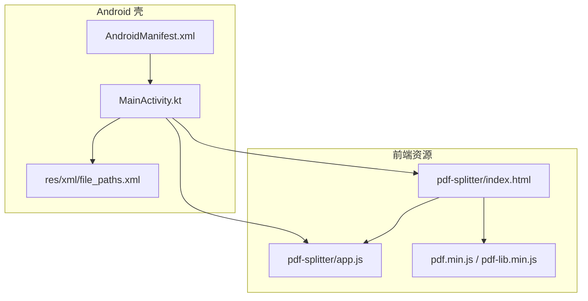
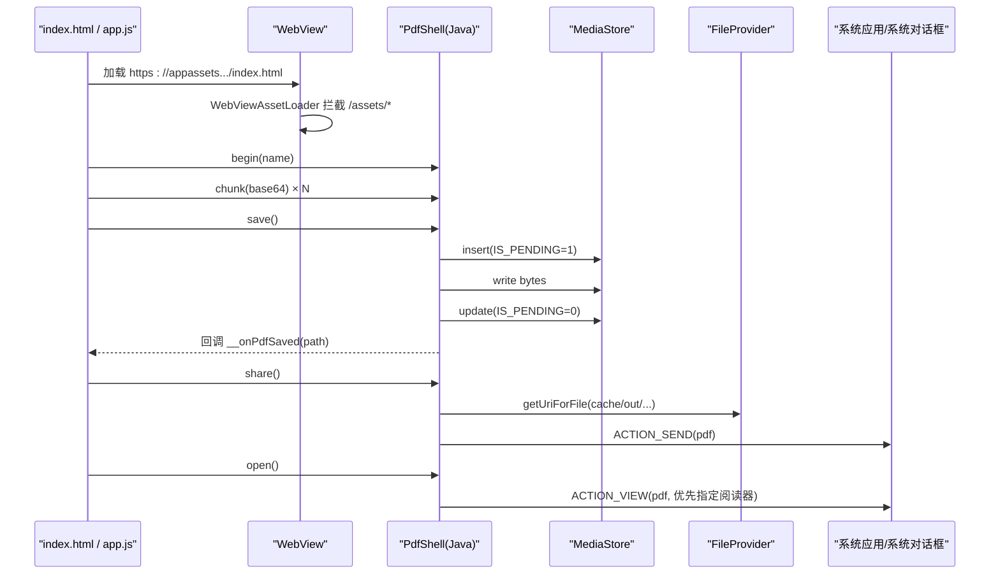
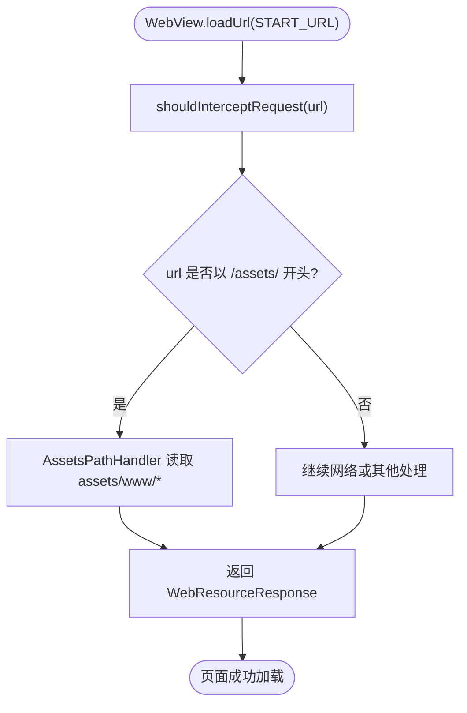
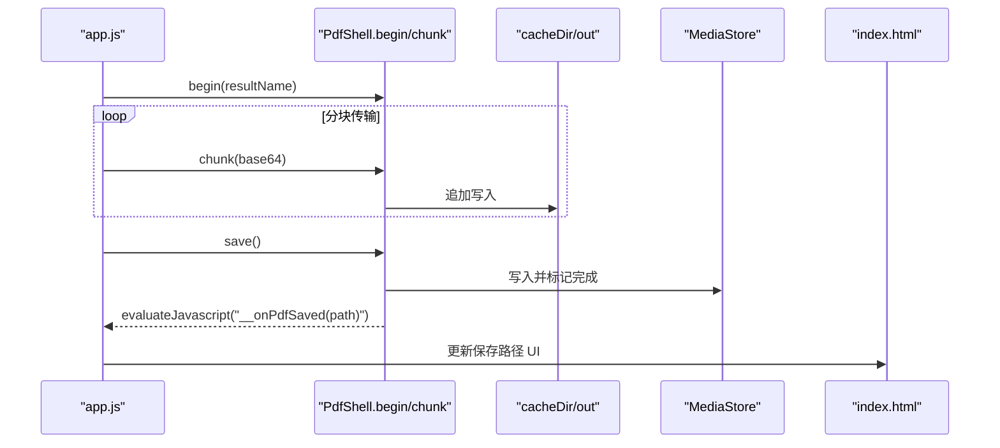
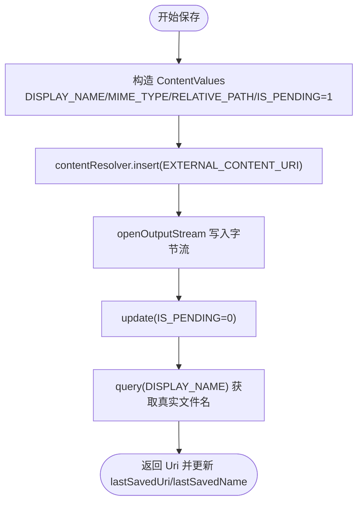
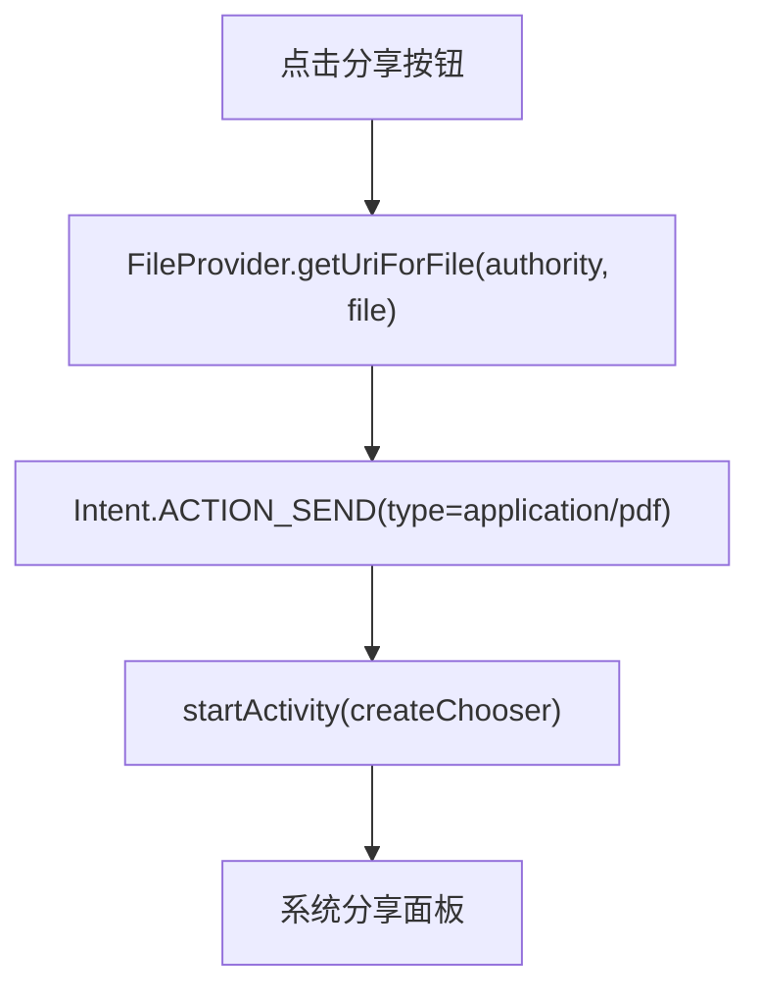
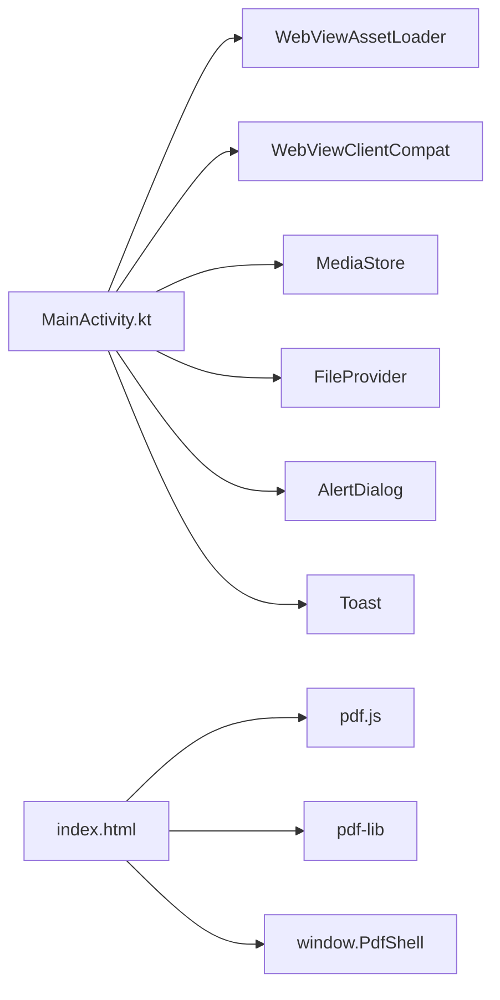

# Android应用架构

<cite>
**本文引用的文件**   
- [MainActivity.kt](file://android/app/src/main/java/com/pdfsplitter/app/MainActivity.kt)
- [AndroidManifest.xml](file://android/app/src/main/AndroidManifest.xml)
- [file_paths.xml](file://android/app/src/main/res/xml/file_paths.xml)
- [index.html](file://pdf-splitter/index.html)
- [app.js](file://pdf-splitter/app.js)
</cite>

## 目录
1. [引言](#引言)
2. [项目结构](#项目结构)
3. [核心组件](#核心组件)
4. [架构总览](#架构总览)
5. [详细组件分析](#详细组件分析)
6. [依赖关系分析](#依赖关系分析)
7. [性能与内存考虑](#性能与内存考虑)
8. [故障排查指南](#故障排查指南)
9. [结论](#结论)

## 引言
本仓库是一个“壳应用”：Android 侧仅承担 WebView 容器、系统能力桥接和文件安全分享职责，全部 PDF 切分逻辑在 assets 中的前端页面运行。MainActivity 通过 WebViewAssetLoader 把本地资源映射为 HTTPS URL，解决 WebView 对 file:// 协议的限制；通过 PdfShell JavaScript 接口实现 JS 与 Native 的双向通信；通过 MediaStore 将结果写入系统下载目录；通过 FileProvider 提供安全的文件分享 URI。

## 项目结构
- android/app：Android 壳工程，包含 MainActivity、清单配置、FileProvider 路径配置。
- pdf-splitter：前端资源，包含 HTML、JS 业务逻辑以及 pdf.js、pdf-lib 库。
- pdftool_test：Node 端测试脚本，与 Android 壳无直接耦合。



**图表来源**
- [MainActivity.kt:37-151](file://android/app/src/main/java/com/pdfsplitter/app/MainActivity.kt#L37-L151)
- [AndroidManifest.xml:13-41](file://android/app/src/main/AndroidManifest.xml#L13-L41)
- [file_paths.xml:1-5](file://android/app/src/main/res/xml/file_paths.xml#L1-L5)
- [index.html:284-286](file://pdf-splitter/index.html#L284-L286)
- [app.js:1-10](file://pdf-splitter/app.js#L1-L10)

**章节来源**
- [MainActivity.kt:37-151](file://android/app/src/main/java/com/pdfsplitter/app/MainActivity.kt#L37-L151)
- [AndroidManifest.xml:1-45](file://android/app/src/main/AndroidManifest.xml#L1-L45)
- [file_paths.xml:1-5](file://android/app/src/main/res/xml/file_paths.xml#L1-L5)
- [index.html:1-289](file://pdf-splitter/index.html#L1-L289)
- [app.js:1-578](file://pdf-splitter/app.js#L1-L578)

## 核心组件
- MainActivity（WebView 容器）
  - 生命周期管理：onCreate 初始化 WebView、WebSettings、WebViewAssetLoader、WebViewClient、WebChromeClient、JavascriptInterface；onDestroy 销毁 WebView。
  - 事件处理：拦截文件选择 onShowFileChooser；桥接 JS alert/confirm；返回键回退；BackHandler 与 WebView 历史联动。
  - 文件操作：MediaStore 写入下载目录；FileProvider 生成分享 URI；打开 PDF 优先定向到已安装阅读器。
- PdfShell（JavaScript 桥）
  - begin/chunk/save/share/open/log：定义 JS 与 Native 的调用契约，采用分块 Base64 传输大文件。
- 前端 app.js
  - 使用 pdf.js 渲染预览，pdf-lib 执行切分、旋转校正、白边裁剪、A4 缩放输出。
  - 检测 window.PdfShell 是否存在以切换下载/分享行为，走原生通道。

**章节来源**
- [MainActivity.kt:85-157](file://android/app/src/main/java/com/pdfsplitter/app/MainActivity.kt#L85-L157)
- [MainActivity.kt:166-262](file://android/app/src/main/java/com/pdfsplitter/app/MainActivity.kt#L166-L262)
- [app.js:512-576](file://pdf-splitter/app.js#L512-L576)

## 架构总览
壳应用采用“WebView + 桥接口 + 系统服务”的分层设计：
- 表现层：HTML/CSS/JS 负责 UI 与交互。
- 业务层：pdf.js + pdf-lib 在浏览器中完成 PDF 解析、预览、切分、导出。
- 桥接层：PdfShell 暴露给 JS，封装文件选择、保存、分享、查看等系统能力。
- 系统层：MediaStore、FileProvider、Intent.ACTION_VIEW/SEND、Activity Result API。



**图表来源**
- [MainActivity.kt:103-112](file://android/app/src/main/java/com/pdfsplitter/app/MainActivity.kt#L103-L112)
- [MainActivity.kt:186-280](file://android/app/src/main/java/com/pdfsplitter/app/MainActivity.kt#L186-L280)
- [MainActivity.kt:282-292](file://android/app/src/main/java/com/pdfsplitter/app/MainActivity.kt#L282-L292)
- [app.js:512-576](file://pdf-splitter/app.js#L512-L576)

## 详细组件分析

### MainActivity：WebView 容器与系统能力桥
- WebView 初始化与安全策略
  - 启用 JavaScript、DOM Storage、允许访问本地内容与缓存优先加载。
  - 通过 WebViewAssetLoader 将 /assets/ 映射为 HTTPS URL，避免 file:// 限制。
  - WebViewClientCompat.shouldInterceptRequest 统一交由 AssetLoader 处理。
- WebChromeClient 事件
  - onShowFileChooser：通过 ActivityResultContracts.OpenDocument 选择 PDF，并复制到 cacheDir/pick 临时目录后回传给 JS。
  - onJsAlert/onJsConfirm：用 AlertDialog 替代默认弹窗，保证用户体验一致。
- JavascriptInterface：PdfShell
  - begin：清理 cacheDir/out 目录，创建目标文件，记录显示名。
  - chunk：Base64 解码并追加写入目标文件，支持大文件分块。
  - save：通过 exportToDownloads 写入 MediaStore 下载目录，更新 IS_PENDING，回传真实文件名，并通过 evaluateJavascript 通知前端。
  - share：通过 FileProvider.getUriForFile 生成 content:// URI，发起 ACTION_SEND。
  - open：优先按优先级匹配已安装的 PDF 阅读器，否则弹出系统选择器。
  - log：调试日志输出。
- 生命周期与 BackHandler
  - onCreate 设置 WebView、注入 PdfShell、注册 onBackPressedDispatcher。
  - onDestroy 销毁 WebView，释放资源。

```mermaid
classDiagram
class MainActivity {
-webView : WebView
-pendingFiles : ValueCallback<Array<Uri>>?
-lastSavedUri : Uri?
-lastSavedName : String
+onCreate(savedInstanceState)
+onDestroy()
-exportToDownloads(src) Uri?
-shareFile(file) void
-sanitize(raw) String
inner class Shell {
-target : File?
-displayName : String
+begin(rawName)
+chunk(part)
+save()
+share()
+open()
+log(msg)
}
}
```

**图表来源**
- [MainActivity.kt:37-157](file://android/app/src/main/java/com/pdfsplitter/app/MainActivity.kt#L37-L157)
- [MainActivity.kt:166-262](file://android/app/src/main/java/com/pdfsplitter/app/MainActivity.kt#L166-L262)

**章节来源**
- [MainActivity.kt:85-157](file://android/app/src/main/java/com/pdfsplitter/app/MainActivity.kt#L85-L157)
- [MainActivity.kt:166-262](file://android/app/src/main/java/com/pdfsplitter/app/MainActivity.kt#L166-L262)
- [MainActivity.kt:264-310](file://android/app/src/main/java/com/pdfsplitter/app/MainActivity.kt#L264-L310)

### WebViewAssetLoader：本地资源 HTTPS 访问
- 构建 AssetLoader，将 /assets/ 前缀映射到 AssetsPathHandler。
- WebViewClientCompat.shouldInterceptRequest 统一拦截请求，由 loader 返回 WebResourceResponse。
- START_URL 使用 https://appassets.androidplatform.net/assets/www/index.html，确保在 WebView 中稳定加载本地资源。



**图表来源**
- [MainActivity.kt:103-112](file://android/app/src/main/java/com/pdfsplitter/app/MainActivity.kt#L103-L112)
- [MainActivity.kt:41-42](file://android/app/src/main/java/com/pdfsplitter/app/MainActivity.kt#L41-L42)

**章节来源**
- [MainActivity.kt:91-112](file://android/app/src/main/java/com/pdfsplitter/app/MainActivity.kt#L91-L112)
- [MainActivity.kt:41-42](file://android/app/src/main/java/com/pdfsplitter/app/MainActivity.kt#L41-L42)

### PdfShell 桥接口：JS 与 Native 映射协议
- 方法映射
  - begin(rawName)：初始化输出文件名与临时文件。
  - chunk(part)：接收 Base64 分块数据，追加写入。
  - save()：写入 MediaStore 下载目录，回调前端 __onPdfSaved(path)。
  - share()：通过 FileProvider 分享临时文件。
  - open()：打开已保存的 PDF，优先定向到指定阅读器。
  - log(msg)：调试日志。
- 数据传输协议
  - 大文件分块：前端 app.js 将 ArrayBuffer 切片为固定大小（约 768KB），Base64 编码后多次调用 chunk。
  - 回调机制：Native 通过 evaluateJavascript 调用 window.__onPdfSaved(path)，前端更新 UI 显示保存路径。



**图表来源**
- [MainActivity.kt:170-209](file://android/app/src/main/java/com/pdfsplitter/app/MainActivity.kt#L170-L209)
- [app.js:512-576](file://pdf-splitter/app.js#L512-L576)

**章节来源**
- [MainActivity.kt:166-262](file://android/app/src/main/java/com/pdfsplitter/app/MainActivity.kt#L166-L262)
- [app.js:512-576](file://pdf-splitter/app.js#L512-L576)

### MediaStore 集成：文件保存路径管理与系统下载目录
- 保存流程
  - 构造 ContentValues，设置 DISPLAY_NAME、MIME_TYPE、RELATIVE_PATH="Download/试卷切分"、IS_PENDING=1。
  - 插入外部存储 URI，写入字节流，更新 IS_PENDING=0。
  - 查询 OpenableColumns.DISPLAY_NAME 获取最终文件名，用于 UI 展示。
- 优点
  - 符合 Android 11+ 分区存储规范，无需额外权限。
  - 结果进入系统“下载”应用可见，便于用户查找。



**图表来源**
- [MainActivity.kt:264-280](file://android/app/src/main/java/com/pdfsplitter/app/MainActivity.kt#L264-L280)

**章节来源**
- [MainActivity.kt:264-280](file://android/app/src/main/java/com/pdfsplitter/app/MainActivity.kt#L264-L280)

### FileProvider：安全文件分享
- 配置
  - Manifest 中声明 androidx.core.content.FileProvider，authorities 使用 ${applicationId}.fileprovider。
  - res/xml/file_paths.xml 暴露 cacheDir/out 目录供分享。
- 使用
  - shareFile 调用 FileProvider.getUriForFile(packageName.fileprovider, file) 生成 content:// URI。
  - 通过 Intent.ACTION_SEND 携带 EXTRA_STREAM，附加 FLAG_GRANT_READ_URI_PERMISSION。



**图表来源**
- [AndroidManifest.xml:33-41](file://android/app/src/main/AndroidManifest.xml#L33-L41)
- [file_paths.xml:1-5](file://android/app/src/main/res/xml/file_paths.xml#L1-L5)
- [MainActivity.kt:282-292](file://android/app/src/main/java/com/pdfsplitter/app/MainActivity.kt#L282-L292)

**章节来源**
- [AndroidManifest.xml:33-41](file://android/app/src/main/AndroidManifest.xml#L33-L41)
- [file_paths.xml:1-5](file://android/app/src/main/res/xml/file_paths.xml#L1-L5)
- [MainActivity.kt:282-292](file://android/app/src/main/java/com/pdfsplitter/app/MainActivity.kt#L282-L292)

### 权限配置与安全考虑
- 最小权限原则
  - 未声明任何 uses-permission，所有文件读写通过 MediaStore 与 FileProvider 完成，遵循分区存储。
- 包可见性
  - 使用 <queries> 声明可 VIEW application/pdf 的应用，避免 Android 11+ queryIntentActivities 查不到第三方 PDF 阅读器。
- WebView 安全
  - 仅允许加载随包本地资源，不打开远程页面；缓存模式 LOAD_CACHE_ELSE_NETWORK 减少网络依赖。
- 文件名清洗
  - sanitize 过滤非法字符、限制长度、强制 .pdf 后缀，避免文件系统异常。

**章节来源**
- [AndroidManifest.xml:4-12](file://android/app/src/main/AndroidManifest.xml#L4-L12)
- [MainActivity.kt:94-101](file://android/app/src/main/java/com/pdfsplitter/app/MainActivity.kt#L94-L101)
- [MainActivity.kt:294-299](file://android/app/src/main/java/com/pdfsplitter/app/MainActivity.kt#L294-L299)

## 依赖关系分析
- MainActivity 依赖
  - androidx.webkit.WebViewAssetLoader：本地资源 HTTPS 映射。
  - androidx.webkit.WebViewClientCompat：请求拦截。
  - android.provider.MediaStore：系统下载目录写入。
  - androidx.core.content.FileProvider：安全分享。
  - android.app.AlertDialog：JS 弹窗替换。
  - android.widget.Toast：用户提示。
- 前端依赖
  - pdf.js：PDF 解析与渲染。
  - pdf-lib：PDF 编辑、切分、缩放。
  - window.PdfShell：桥接口。



**图表来源**
- [MainActivity.kt:1-30](file://android/app/src/main/java/com/pdfsplitter/app/MainActivity.kt#L1-L30)
- [index.html:284-286](file://pdf-splitter/index.html#L284-L286)

**章节来源**
- [MainActivity.kt:1-30](file://android/app/src/main/java/com/pdfsplitter/app/MainActivity.kt#L1-L30)
- [index.html:284-286](file://pdf-splitter/index.html#L284-L286)

## 性能与内存考虑
- 前端渲染优化
  - IntersectionObserver 懒加载预览，避免一次性渲染所有页面。
  - 复用已渲染 canvas 进行白边扫描，减少重复栅格化。
  - 处理过程中定期 await tick() 让出主线程，保持 UI 响应。
- 大文件传输
  - 分块 Base64 传输，避免单次桥调用过大导致 OOM。
- 资源释放
  - 切换文件时销毁上一份 pdf.js 文档，及时释放 worker 与缓存。
  - 扫描位图完成后清空 canvas width/height，释放显存。

**章节来源**
- [app.js:288-329](file://pdf-splitter/app.js#L288-L329)
- [app.js:412-507](file://pdf-splitter/app.js#L412-L507)
- [app.js:512-576](file://pdf-splitter/app.js#L512-L576)

## 故障排查指南
- WebView 无法加载本地资源
  - 检查 WebViewAssetLoader 是否正确注册 /assets/ 路径处理器。
  - 确认 START_URL 使用 https://appassets.androidplatform.net/assets/www/index.html。
- 文件选择失败或返回空
  - 检查 ActivityResultContracts.OpenDocument 是否成功启动。
  - 确认临时目录 cacheDir/pick 有写权限且未被清理。
- 保存到下载目录失败
  - 检查 MediaStore.Downloads.RELATIVE_PATH 是否为 "Download/试卷切分"。
  - 确认 IS_PENDING 状态从 1 更新为 0。
- 分享失败或未找到可接收应用
  - 检查 FileProvider authorities 与 file_paths.xml 配置是否一致。
  - 确认 intent type 为 application/pdf 且包含 EXTRA_STREAM。
- 无法打开 PDF
  - 检查 <queries> 是否声明了 action.VIEW + mimeType application/pdf。
  - 若未安装 PDF 阅读器，会回退到系统选择器。

**章节来源**
- [MainActivity.kt:103-112](file://android/app/src/main/java/com/pdfsplitter/app/MainActivity.kt#L103-L112)
- [MainActivity.kt:56-73](file://android/app/src/main/java/com/pdfsplitter/app/MainActivity.kt#L56-L73)
- [MainActivity.kt:264-280](file://android/app/src/main/java/com/pdfsplitter/app/MainActivity.kt#L264-L280)
- [MainActivity.kt:282-292](file://android/app/src/main/java/com/pdfsplitter/app/MainActivity.kt#L282-L292)
- [AndroidManifest.xml:7-12](file://android/app/src/main/AndroidManifest.xml#L7-L12)

## 结论
该壳应用通过清晰的职责分离实现了高内聚低耦合：前端专注 PDF 处理，Android 侧专注系统能力桥接。WebViewAssetLoader 解决了本地资源 HTTPS 访问问题；PdfShell 桥接口定义了稳定的 JS-Native 协议；MediaStore 与 FileProvider 分别满足系统下载目录集成与安全分享需求；最小权限原则与包可见性配置提升了安全性与兼容性。整体架构简洁、可扩展，适合移动端 PDF 工具类应用的快速迭代与维护。