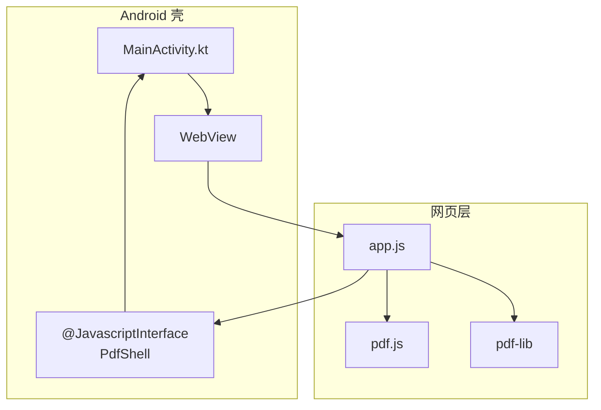
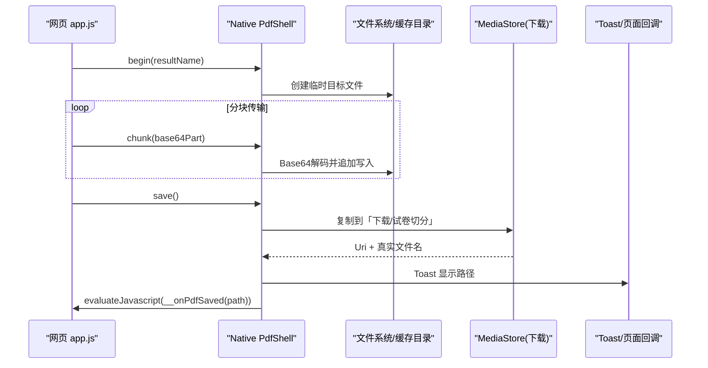
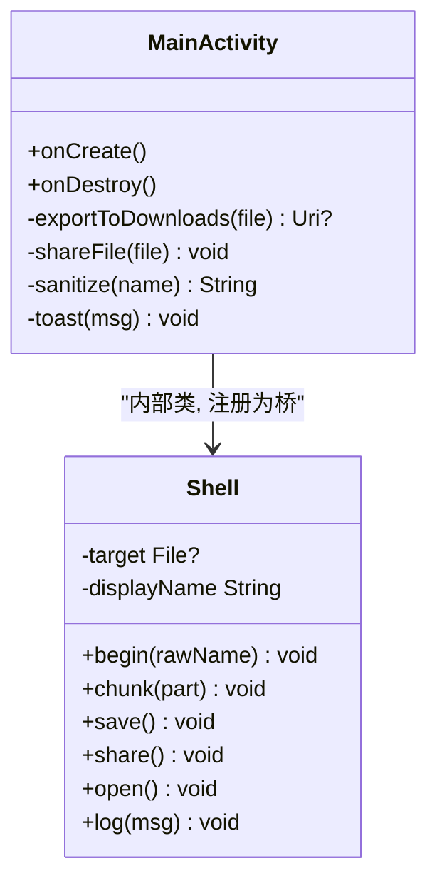
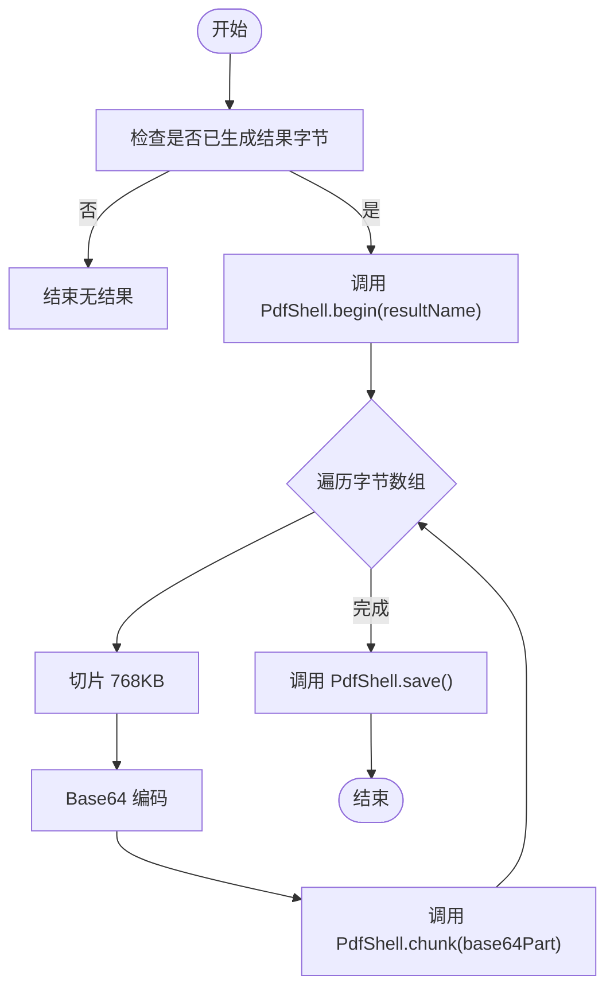
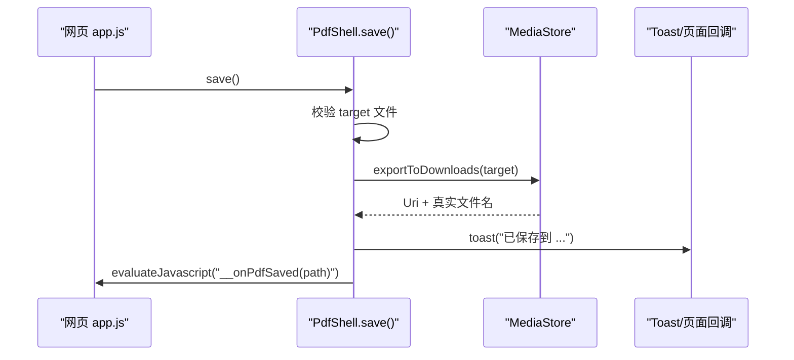
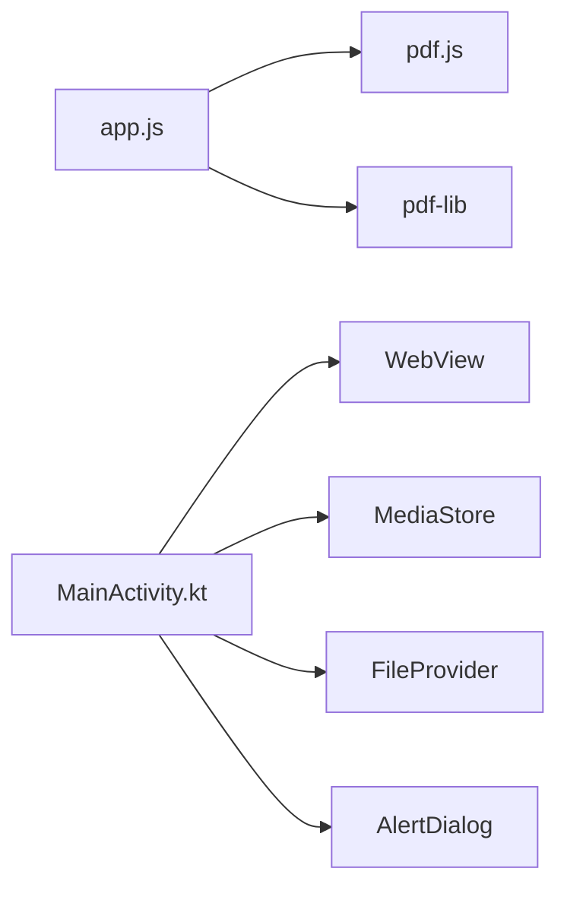

# JavaScript-Native桥接接口

<cite>
**本文引用的文件**   
- [MainActivity.kt](file://android/app/src/main/java/com/pdfsplitter/app/MainActivity.kt)
- [app.js](file://pdf-splitter/app.js)
- [README.md](file://README.md)
</cite>

## 目录
1. [引言](#引言)
2. [项目结构](#项目结构)
3. [核心组件](#核心组件)
4. [架构总览](#架构总览)
5. [详细组件分析](#详细组件分析)
6. [依赖关系分析](#依赖关系分析)
7. [性能与内存优化](#性能与内存优化)
8. [错误处理与用户反馈](#错误处理与用户反馈)
9. [调用示例与最佳实践](#调用示例与最佳实践)
10. [结论](#结论)

## 引言
本仓库实现了一个“试卷切分助手”：在浏览器端使用 pdf.js 预览、pdf-lib 裁剪并生成 A4 PDF，Android 壳通过 WebView 承载网页，并通过 `PdfShell` 桥暴露原生能力。本文聚焦于 JavaScript 与 Native 的桥接设计，重点解释：
- `PdfShell` 类的设计模式与 `@JavascriptInterface` 注解的使用
- 大文件分块传输机制（Base64 编码解码与流式写入）
- `begin`、`chunk`、`save`、`share`、`open` 等核心方法的逻辑与数据流转
- 异步通信处理（包括 `ValueCallback` 的文件选择回调）与线程安全考虑
- 错误处理机制与用户反馈方式
- 具体调用示例与最佳实践建议

## 项目结构
- `pdf-splitter/`：Web 本体（PWA），包含 `index.html`、`app.js` 以及本地化的 pdf.js、pdf-lib 库，业务逻辑全部在网页侧完成。
- `android/`：Android 壳工程（Kotlin + WebView），构建时把 `pdf-splitter/` 同步进 assets，提供文件选择、结果保存、系统分享等原生能力。
- `pdftool_test/`：本地验证脚本与输出，不入库。

**图表来源**
- [MainActivity.kt:85-151](file://android/app/src/main/java/com/pdfsplitter/app/MainActivity.kt#L85-L151)
- [app.js:1-10](file://pdf-splitter/app.js#L1-L10)

**章节来源**
- [README.md:13-22](file://README.md#L13-L22)
- [MainActivity.kt:31-49](file://android/app/src/main/java/com/pdfsplitter/app/MainActivity.kt#L31-L49)

## 核心组件
- `MainActivity`：Android 壳入口，负责 WebView 初始化、资源加载、文件选择、桥对象注册、UI 交互（提示弹窗）。
- `Shell`（内部类）：桥对象，暴露给网页的 `window.PdfShell`，封装 begin/chunk/save/share/open/log 等方法。
- `app.js`：网页主逻辑，负责 PDF 解析、预览、裁剪、生成结果字节，并通过 `PdfShell` 将结果分块传给原生进行落盘或分享。

**章节来源**
- [MainActivity.kt:37-151](file://android/app/src/main/java/com/pdfsplitter/app/MainActivity.kt#L37-L151)
- [MainActivity.kt:166-262](file://android/app/src/main/java/com/pdfsplitter/app/MainActivity.kt#L166-L262)
- [app.js:1-28](file://pdf-splitter/app.js#L1-L28)

## 架构总览
下图展示从网页发起保存到原生落盘的完整流程，包括分块传输、Base64 编解码、流式写入、MediaStore 导出与回调通知。

**图表来源**
- [app.js:512-528](file://pdf-splitter/app.js#L512-L528)
- [MainActivity.kt:170-209](file://android/app/src/main/java/com/pdfsplitter/app/MainActivity.kt#L170-L209)
- [MainActivity.kt:264-280](file://android/app/src/main/java/com/pdfsplitter/app/MainActivity.kt#L264-L280)

## 详细组件分析

### PdfShell 类设计与 @JavascriptInterface
- `Shell` 是 `MainActivity` 的内部类，通过 `webView.addJavascriptInterface(new Shell(), "PdfShell")` 暴露给网页。
- 所有对外方法均标注 `@JavascriptInterface`，确保可被 JavaScript 安全调用。
- 状态字段：
  - `target`：当前待保存的目标文件（位于应用缓存目录下的 `out` 子目录）。
  - `displayName`：用于 MediaStore 展示的真实文件名（可能因重名被系统修改）。
- 关键方法职责：
  - `begin(rawName)`：清理旧文件并创建新目标文件，设置显示名称。
  - `chunk(part)`：对 base64 分块解码并追加写入目标文件。
  - `save()`：校验目标文件有效性后，导出到「下载/试卷切分」，并通过 `evaluateJavascript` 回传实际路径。
  - `share()`：校验目标文件有效性后，通过 `FileProvider` 唤起系统分享。
  - `open()`：按白名单优先定向到阅读器，未命中则退回系统选择器。
  - `log(msg)`：调试日志输出。

**图表来源**
- [MainActivity.kt:147-151](file://android/app/src/main/java/com/pdfsplitter/app/MainActivity.kt#L147-L151)
- [MainActivity.kt:166-262](file://android/app/src/main/java/com/pdfsplitter/app/MainActivity.kt#L166-L262)

**章节来源**
- [MainActivity.kt:147-151](file://android/app/src/main/java/com/pdfsplitter/app/MainActivity.kt#L147-L151)
- [MainActivity.kt:166-262](file://android/app/src/main/java/com/pdfsplitter/app/MainActivity.kt#L166-L262)

### 大文件分块传输机制
- 网页侧：
  - 生成结果字节数组 `state.resultBytes`。
  - 以固定块大小（768KB）循环切片，调用 `toBase64` 转为 base64 字符串。
  - 依次调用 `window.PdfShell.begin(resultName)` 和多次 `window.PdfShell.chunk(base64Part)`。
- 原生侧：
  - `begin` 创建目标文件（缓存目录 `out`），准备追加写入。
  - `chunk` 使用 Android `Base64.decode` 解码并 `FileOutputStream(file, true).write(bytes)` 追加写入。
- 优点：
  - 避免单次桥调用传递几十 MB 数据导致的内存峰值与阻塞。
  - 流式写入降低瞬时内存占用，提升稳定性。

**图表来源**
- [app.js:512-528](file://pdf-splitter/app.js#L512-L528)
- [MainActivity.kt:170-184](file://android/app/src/main/java/com/pdfsplitter/app/MainActivity.kt#L170-L184)

**章节来源**
- [app.js:512-528](file://pdf-splitter/app.js#L512-L528)
- [MainActivity.kt:170-184](file://android/app/src/main/java/com/pdfsplitter/app/MainActivity.kt#L170-L184)

### 核心方法实现逻辑与数据流转

#### begin(rawName)
- 清理缓存目录 `cacheDir/out` 中的旧文件。
- 创建新的目标文件，名称经 `sanitize` 处理（去除非法字符、限制长度、补 `.pdf` 后缀）。
- 为后续 `chunk` 追加写入做准备。

**章节来源**
- [MainActivity.kt:170-176](file://android/app/src/main/java/com/pdfsplitter/app/MainActivity.kt#L170-L176)
- [MainActivity.kt:294-299](file://android/app/src/main/java/com/pdfsplitter/app/MainActivity.kt#L294-L299)

#### chunk(part)
- 若传入分块为空则直接返回。
- 使用 `AndroidBase64.decode` 解码为字节数组。
- 以追加模式打开 `FileOutputStream` 并写入，避免覆盖已有内容。

**章节来源**
- [MainActivity.kt:178-184](file://android/app/src/main/java/com/pdfsplitter/app/MainActivity.kt#L178-L184)

#### save()
- 校验目标文件存在且非空。
- 调用 `exportToDownloads` 将文件写入系统「下载/试卷切分」。
- 更新 `lastSavedUri` 与 `lastSavedName`，并通过 `runOnUiThread` 调用 `toast` 提示用户。
- 通过 `webView.evaluateJavascript` 调用网页回调 `window.__onPdfSaved(path)`，让页面显示实际路径与“查看文件”按钮。

**图表来源**
- [MainActivity.kt:186-209](file://android/app/src/main/java/com/pdfsplitter/app/MainActivity.kt#L186-L209)
- [MainActivity.kt:264-280](file://android/app/src/main/java/com/pdfsplitter/app/MainActivity.kt#L264-L280)
- [app.js:570-576](file://pdf-splitter/app.js#L570-L576)

**章节来源**
- [MainActivity.kt:186-209](file://android/app/src/main/java/com/pdfsplitter/app/MainActivity.kt#L186-L209)
- [MainActivity.kt:264-280](file://android/app/src/main/java/com/pdfsplitter/app/MainActivity.kt#L264-L280)
- [app.js:570-576](file://pdf-splitter/app.js#L570-L576)

#### share()
- 校验目标文件存在且非空。
- 通过 `FileProvider.getUriForFile` 获取共享 URI，构造 `ACTION_SEND` Intent 唤起系统分享。
- 失败时捕获异常并 toast 提示。

**章节来源**
- [MainActivity.kt:211-220](file://android/app/src/main/java/com/pdfsplitter/app/MainActivity.kt#L211-L220)
- [MainActivity.kt:282-292](file://android/app/src/main/java/com/pdfsplitter/app/MainActivity.kt#L282-L292)

#### open()
- 仅当已保存过文件（`lastSavedUri` 存在）才允许打开。
- 优先根据白名单 `VIEWER_PREFS` 定向到真正的阅读器（WPS、小米多看、夸克等），否则退回系统选择器。
- 启动失败时捕获异常并 toast 提示。

**章节来源**
- [MainActivity.kt:222-256](file://android/app/src/main/java/com/pdfsplitter/app/MainActivity.kt#L222-L256)

### 异步通信处理与线程安全
- 文件选择回调：
  - 使用 `registerForActivityResult(ActivityResultContracts.OpenDocument())` 接收用户选择的 PDF。
  - 通过 `ValueCallback<Array<Uri>>` 将结果回传给 WebView 的文件选择器；在 `onShowFileChooser` 中暂存回调并在选择完成后调用 `onReceiveValue`。
  - 为避免重复回调，进入新选择前清空上一次 pending 回调。
- UI 线程安全：
  - 所有涉及 UI 的操作（toast、evaluateJavascript、share/open）均通过 `runOnUiThread` 执行，确保在主线程更新界面。
- 桥调用安全性：
  - 所有桥方法标注 `@JavascriptInterface`，由 WebView 安全暴露给 JavaScript。

```mermaid
sequenceDiagram
participant Web as "网页 <input type=file>"
participant Chrome as "WebChromeClient.onShowFileChooser"
participant Picker as "OpenDocument Contract"
participant Callback as "ValueCallback<Array<Uri>>"
Web->>Chrome : onShowFileChooser(callback, params)
Chrome->>Picker : launch(arrayOf("application/pdf"))
Picker-->>Chrome : ActivityResult(uri?)
Chrome->>Callback : onReceiveValue([uri] or null)
```

**图表来源**
- [MainActivity.kt:56-73](file://android/app/src/main/java/com/pdfsplitter/app/MainActivity.kt#L56-L73)
- [MainActivity.kt:114-124](file://android/app/src/main/java/com/pdfsplitter/app/MainActivity.kt#L114-L124)

**章节来源**
- [MainActivity.kt:56-73](file://android/app/src/main/java/com/pdfsplitter/app/MainActivity.kt#L56-L73)
- [MainActivity.kt:114-124](file://android/app/src/main/java/com/pdfsplitter/app/MainActivity.kt#L114-L124)

## 依赖关系分析
- 网页依赖：
  - `pdf.js`：解析与渲染 PDF，支持 worker 加载与 viewport 坐标。
  - `pdf-lib`：读取/嵌入页面、裁剪、缩放、生成新 PDF。
- 原生依赖：
  - `WebView`、`WebChromeClient`、`WebViewAssetLoader`：资源加载与文件选择。
  - `MediaStore`：写入「下载/试卷切分」目录。
  - `FileProvider`：系统分享。
  - `AlertDialog`：JS alert/confirm 对话框。

**图表来源**
- [app.js:1-10](file://pdf-splitter/app.js#L1-L10)
- [MainActivity.kt:3-29](file://android/app/src/main/java/com/pdfsplitter/app/MainActivity.kt#L3-L29)

**章节来源**
- [app.js:1-10](file://pdf-splitter/app.js#L1-L10)
- [MainActivity.kt:3-29](file://android/app/src/main/java/com/pdfsplitter/app/MainActivity.kt#L3-L29)

## 性能与内存优化
- 分块传输：
  - 网页侧以 768KB 分块，避免单次桥调用过大导致内存峰值。
  - 原生侧追加写入，减少一次性分配。
- 预览复用：
  - 预览 canvas 位图在裁白边检测时复用，避免重复栅格化。
- 旋转归一化：
  - 仅在存在 `/Rotate` 时烘焙旋转矩阵，避免不必要的重存。
- 进度与 UI：
  - 使用 `tick()` 让出时间片，避免长时间阻塞主线程。
  - 处理完成后滚动到底部，提升用户体验。

[本节为通用性能讨论，不直接分析具体文件]

## 错误处理与用户反馈
- 网页侧：
  - 打开 PDF 失败时弹出 alert 提示加密或不支持的格式。
  - 处理过程中 catch 异常并 alert 失败信息。
- 原生侧：
  - `save()` 与 `share()` 校验目标文件有效性，失败时 toast 提示。
  - `open()` 捕获启动失败异常并 toast 提示。
  - `log()` 输出调试日志。
- 文件选择：
  - 选择失败时回调 `onReceiveValue(null)`，避免挂起。

**章节来源**
- [app.js:234-238](file://pdf-splitter/app.js#L234-L238)
- [app.js:497-501](file://pdf-splitter/app.js#L497-L501)
- [MainActivity.kt:190-209](file://android/app/src/main/java/com/pdfsplitter/app/MainActivity.kt#L190-L209)
- [MainActivity.kt:215-220](file://android/app/src/main/java/com/pdfsplitter/app/MainActivity.kt#L215-L220)
- [MainActivity.kt:250-255](file://android/app/src/main/java/com/pdfsplitter/app/MainActivity.kt#L250-L255)
- [MainActivity.kt:258-261](file://android/app/src/main/java/com/pdfsplitter/app/MainActivity.kt#L258-L261)

## 调用示例与最佳实践

### 典型调用流程
- 网页侧：
  1. 生成结果字节 `state.resultBytes`。
  2. 调用 `window.PdfShell.begin(resultName)`。
  3. 循环调用 `window.PdfShell.chunk(base64Part)` 分块传输。
  4. 调用 `window.PdfShell.save()` 或 `window.PdfShell.share()`。
- 原生侧：
  - `begin` 创建临时文件。
  - `chunk` 解码并追加写入。
  - `save` 导出到「下载/试卷切分」并回调页面显示路径。
  - `share` 通过 `FileProvider` 分享。

**章节来源**
- [app.js:512-528](file://pdf-splitter/app.js#L512-L528)
- [MainActivity.kt:170-209](file://android/app/src/main/java/com/pdfsplitter/app/MainActivity.kt#L170-L209)

### 最佳实践建议
- 分块大小：
  - 保持 768KB 左右，平衡网络/桥调用开销与内存占用。
- Base64 编码：
  - 网页侧使用高效编码（分批 `String.fromCharCode.apply`），避免超大字符串拼接。
- 线程安全：
  - 所有 UI 操作必须走 `runOnUiThread`。
  - 文件选择回调需及时释放 `pendingFiles`，避免重复回调。
- 错误处理：
  - 对每个桥方法做参数校验与异常捕获，向用户给出明确提示。
- 文件命名：
  - 使用 `sanitize` 清理非法字符，确保跨平台兼容。
- 分享与查看：
  - 分享不落盘，避免误报“已保存”。
  - 查看优先定向到真正阅读器，提升体验。

[本节为通用实践建议，不直接分析具体文件]

## 结论
本项目通过 `PdfShell` 桥将网页生成的 PDF 结果安全、稳定地传递给原生层，采用分块传输与流式写入有效缓解大文件带来的内存压力。结合 `MediaStore` 与 `FileProvider`，实现了可靠的保存与分享能力。网页侧与原生侧的职责清晰分离，错误处理与用户反馈完善，整体架构简洁高效，适合在手机端处理大量扫描件场景。

[本节为总结性内容，不直接分析具体文件]