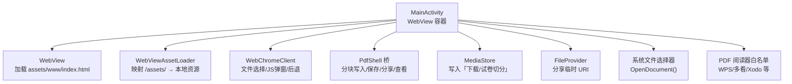
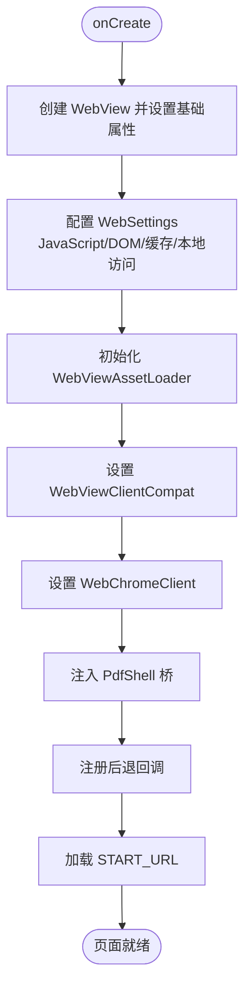
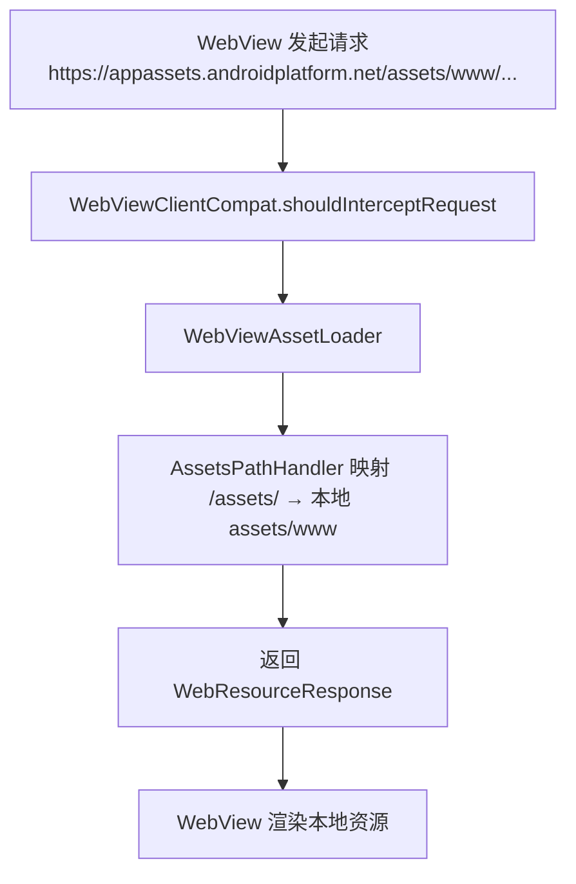
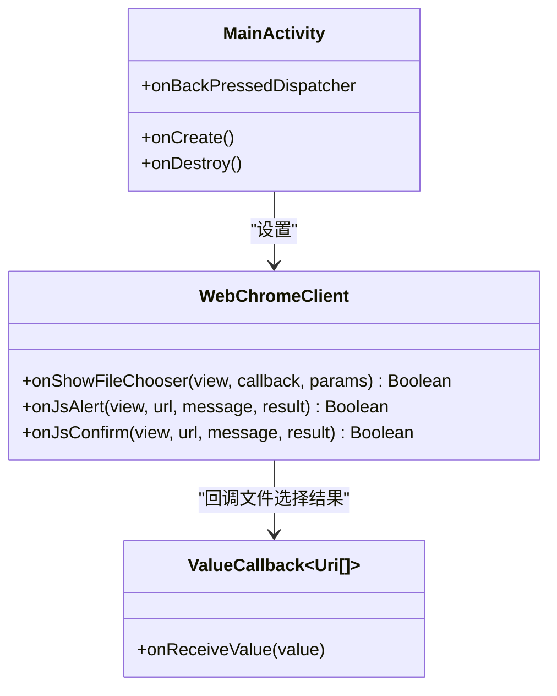
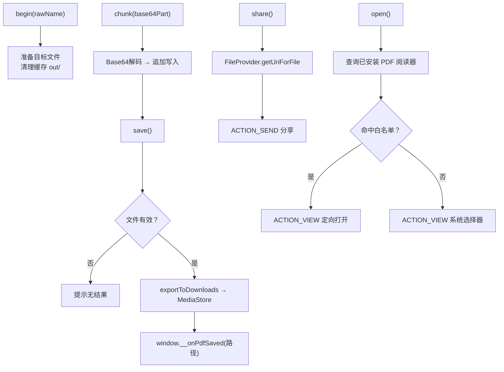
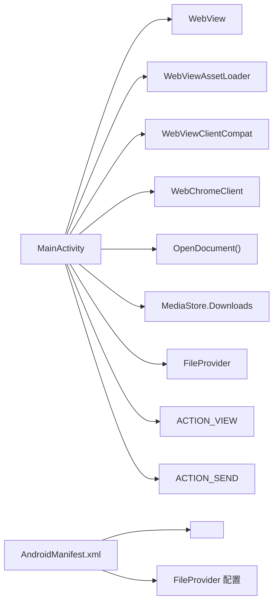

# WebView容器管理

<cite>
**本文引用的文件**   
- [MainActivity.kt](file://android/app/src/main/java/com/pdfsplitter/app/MainActivity.kt)
- [AndroidManifest.xml](file://android/app/src/main/AndroidManifest.xml)
- [file_paths.xml](file://android/app/src/main/res/xml/file_paths.xml)
- [README.md](file://README.md)
</cite>

## 目录
1. [引言](#引言)
2. [项目结构](#项目结构)
3. [核心组件](#核心组件)
4. [架构总览](#架构总览)
5. [详细组件分析](#详细组件分析)
6. [依赖关系分析](#依赖关系分析)
7. [性能与安全配置](#性能与安全配置)
8. [故障排查指南](#故障排查指南)
9. [结论](#结论)

## 引言
本文围绕 Android 端的 `MainActivity`，系统化说明其作为 WebView 容器的设计模式与实现细节。重点包括：
- 生命周期管理与事件处理机制
- 使用 `WebViewAssetLoader` 解决本地资源 HTTPS 协议访问问题
- 集成系统文件选择器 `ActivityResultContracts.OpenDocument()` 及文件复制机制
- 自定义 `WebChromeClient`：文件选择回调、JavaScript 对话框、后退按钮行为
- WebView 安全与性能配置：JavaScript、DOM 存储、缓存策略、本地资源访问控制

该应用的业务逻辑全部位于前端网页中，原生壳仅负责 WebView 无法完成但移动端必需的能力，例如选文件、写入下载目录、唤起系统分享和定向打开 PDF 阅读器。

**章节来源**
- [README.md:1-93](file://README.md#L1-L93)

## 项目结构
Android 端采用“原生壳 + Web 业务”的分离结构：
- `android/app/src/main/java/.../MainActivity.kt`：WebView 容器、桥接接口、文件操作、分享与查看逻辑
- `android/app/src/main/AndroidManifest.xml`：Activity 声明、`FileProvider`、`queries` 包可见性
- `android/app/src/main/res/xml/file_paths.xml`：`FileProvider` 暴露路径
- `pdf-splitter/`：Web 本体（PWA），构建时同步到 `assets/www`

**图表来源**
- [MainActivity.kt:37-310](file://android/app/src/main/java/com/pdfsplitter/app/MainActivity.kt#L37-L310)
- [AndroidManifest.xml:21-41](file://android/app/src/main/AndroidManifest.xml#L21-L41)
- [file_paths.xml:1-5](file://android/app/src/main/res/xml/file_paths.xml#L1-L5)

**章节来源**
- [MainActivity.kt:37-310](file://android/app/src/main/java/com/pdfsplitter/app/MainActivity.kt#L37-L310)
- [AndroidManifest.xml:1-45](file://android/app/src/main/AndroidManifest.xml#L1-L45)
- [file_paths.xml:1-5](file://android/app/src/main/res/xml/file_paths.xml#L1-L5)

## 核心组件
- `MainActivity`：继承 `ComponentActivity`，持有 `WebView`，统一处理页面请求拦截、文件选择、JS 交互、结果导出与分享。
- `WebViewAssetLoader`：将 `/assets/` 路径映射为可被 WebView 以 HTTPS 协议访问的资源地址，避免 `file://` 下 pdf.js worker 加载失败。
- `WebViewClientCompat`：重写 `shouldInterceptRequest`，把请求交给 `WebViewAssetLoader` 处理。
- `WebChromeClient`：自定义文件选择、JS 弹窗、后退行为。
- `Shell`（内部类）：通过 `@JavascriptInterface` 暴露给前端，提供分块写入、保存、分享、查看、日志能力。
- `FileProvider`：用于分享场景的安全 URI 暴露。
- `MediaStore.Downloads`：将结果写入系统下载目录并显示真实文件名。

**章节来源**
- [MainActivity.kt:37-310](file://android/app/src/main/java/com/pdfsplitter/app/MainActivity.kt#L37-L310)

## 架构总览
下图展示从页面发起请求到原生侧处理的完整流程，包括本地资源加载、文件选择、分块写入、保存到下载目录以及分享与查看。

```mermaid
sequenceDiagram
participant Page as "前端页面"
participant WV as "WebView"
participant Client as "WebViewClientCompat"
participant Loader as "WebViewAssetLoader"
participant Chrome as "WebChromeClient"
participant Bridge as "PdfShell 桥"
participant Store as "MediaStore"
participant Provider as "FileProvider"
participant Picker as "系统文件选择器"
participant Viewer as "PDF 阅读器"
Page->>WV : 加载 https : //appassets.androidplatform.net/assets/www/index.html
WV->>Client : shouldInterceptRequest(url)
Client->>Loader : 解析 /assets/ 资源
Loader-->>Client : 返回本地资源响应
Client-->>WV : 渲染本地页面
Page->>Chrome : <input type="file"> 触发
Chrome->>Picker : OpenDocument("application/pdf")
Picker-->>Chrome : 返回 Uri
Chrome->>Bridge : 回调 onReceiveValue(Uri)
Page->>Bridge : begin(rawName)
Page->>Bridge : chunk(base64Part)
Page->>Bridge : save()
Bridge->>Store : 写入「下载/试卷切分」
Store-->>Bridge : 返回 Uri 与真实文件名
Bridge-->>Page : window.__onPdfSaved(路径)
Page->>Bridge : share()
Bridge->>Provider : getUriForFile(file)
Bridge->>Viewer : ACTION_SEND 分享
Page->>Bridge : open()
Bridge->>Viewer : ACTION_VIEW 定向阅读器
```

**图表来源**
- [MainActivity.kt:103-151](file://android/app/src/main/java/com/pdfsplitter/app/MainActivity.kt#L103-L151)
- [MainActivity.kt:114-145](file://android/app/src/main/java/com/pdfsplitter/app/MainActivity.kt#L114-L145)
- [MainActivity.kt:166-262](file://android/app/src/main/java/com/pdfsplitter/app/MainActivity.kt#L166-L262)
- [MainActivity.kt:264-292](file://android/app/src/main/java/com/pdfsplitter/app/MainActivity.kt#L264-L292)
- [AndroidManifest.xml:33-41](file://android/app/src/main/AndroidManifest.xml#L33-L41)

## 详细组件分析

### MainActivity 作为 WebView 容器
- 生命周期管理：
  - `onCreate`：创建 `WebView`，设置背景色、启用调试、配置 `WebSettings`、初始化 `WebViewAssetLoader`、注入 JS 接口、注册后退回调、加载起始 URL。
  - `onDestroy`：销毁 `WebView`，释放资源。
- 事件处理：
  - 后退按钮：优先回退 WebView 历史；若无历史则退出 Activity。
  - JavaScript 对话框：统一用 `AlertDialog` 呈现 `alert` 与 `confirm`。
  - 文件选择：拦截 `<input type="file">`，调用系统选择器并回填结果。

**图表来源**
- [MainActivity.kt:85-151](file://android/app/src/main/java/com/pdfsplitter/app/MainActivity.kt#L85-L151)

**章节来源**
- [MainActivity.kt:85-157](file://android/app/src/main/java/com/pdfsplitter/app/MainActivity.kt#L85-L157)

### WebViewAssetLoader 与本地资源 HTTPS 访问
- 目的：避免在 `file://` 协议下 pdf.js worker 加载失败，同时限制只加载随包的本地资源。
- 实现要点：
  - 使用 `WebViewAssetLoader.Builder().addPathHandler("/assets/", AssetsPathHandler(this))` 建立映射。
  - 在 `WebViewClientCompat.shouldInterceptRequest` 中将请求交由 loader 处理。
  - 起始 URL 使用 `https://appassets.androidplatform.net/assets/www/index.html`，确保 Worker 与主线程同源。

**图表来源**
- [MainActivity.kt:103-112](file://android/app/src/main/java/com/pdfsplitter/app/MainActivity.kt#L103-L112)

**章节来源**
- [MainActivity.kt:103-112](file://android/app/src/main/java/com/pdfsplitter/app/MainActivity.kt#L103-L112)

### 文件选择器集成与文件复制机制
- 使用 `ActivityResultContracts.OpenDocument()` 拉起系统文件选择器，限定 MIME 类型为 `application/pdf`。
- 选择完成后：
  - 清理缓存目录 `cacheDir/pick`，避免残留旧文件。
  - 通过 `contentResolver.openInputStream(uri)` 读取内容，复制到本地临时文件。
  - 保留用户看到的文件名，防止后续输出丢失原始卷名。
- 若选择取消或出错，向 WebView 回调空值，保证前端状态一致。

```mermaid
flowchart TD
Trigger["前端触发 <input type='file'>"] --> OnShow["WebChromeClient.onShowFileChooser"]
OnShow --> Launch["launch OpenDocument('application/pdf')"]
Launch --> Result{"是否选择成功？"}
Result --> |否| CallbackNull["回调 null"]
Result --> |是| Copy["读取 Uri → 复制到 cacheDir/pick"]
Copy --> Name["查询 OpenableColumns.DISPLAY_NAME"]
Name --> CallbackUri["回调 Uri[] 给前端"]
```

**图表来源**
- [MainActivity.kt:56-83](file://android/app/src/main/java/com/pdfsplitter/app/MainActivity.kt#L56-L83)
- [MainActivity.kt:114-124](file://android/app/src/main/java/com/pdfsplitter/app/MainActivity.kt#L114-L124)

**章节来源**
- [MainActivity.kt:56-83](file://android/app/src/main/java/com/pdfsplitter/app/MainActivity.kt#L56-L83)
- [MainActivity.kt:114-124](file://android/app/src/main/java/com/pdfsplitter/app/MainActivity.kt#L114-L124)

### WebChromeClient 自定义实现
- 文件选择回调：
  - 接管 `onShowFileChooser`，调用 `pickPdf.launch(...)`，并将结果通过 `ValueCallback<Array<Uri>>` 传回前端。
- JavaScript 对话框：
  - `onJsAlert`：显示单按钮提示框，关闭后取消 JsResult。
  - `onJsConfirm`：显示确认框，根据用户选择确认或取消。
- 后退按钮行为：
  - 通过 `onBackPressedDispatcher.addCallback`，优先调用 `webView.goBack()`，否则结束 Activity。

**图表来源**
- [MainActivity.kt:114-150](file://android/app/src/main/java/com/pdfsplitter/app/MainActivity.kt#L114-L150)

**章节来源**
- [MainActivity.kt:114-150](file://android/app/src/main/java/com/pdfsplitter/app/MainActivity.kt#L114-L150)

### PdfShell 桥：分块写入、保存、分享与查看
- 分块写入：
  - `begin(rawName)`：准备目标文件，清理缓存目录，生成带合法名称的文件。
  - `chunk(part)`：接收 base64 分块，追加写入文件，避免一次性传输大文件导致内存压力。
- 保存：
  - `save()`：校验文件存在且非空，调用 `exportToDownloads` 写入 MediaStore，更新 `lastSavedUri` 与 `lastSavedName`，并通过 `window.__onPdfSaved` 通知前端。
- 分享：
  - `share()`：通过 `FileProvider.getUriForFile` 获取安全 URI，发起 `ACTION_SEND`，不写入下载目录。
- 查看：
  - `open()`：优先按白名单定向到真正的 PDF 阅读器，若无匹配则退回系统选择器。

**图表来源**
- [MainActivity.kt:166-262](file://android/app/src/main/java/com/pdfsplitter/app/MainActivity.kt#L166-L262)
- [MainActivity.kt:264-292](file://android/app/src/main/java/com/pdfsplitter/app/MainActivity.kt#L264-L292)

**章节来源**
- [MainActivity.kt:166-262](file://android/app/src/main/java/com/pdfsplitter/app/MainActivity.kt#L166-L262)
- [MainActivity.kt:264-292](file://android/app/src/main/java/com/pdfsplitter/app/MainActivity.kt#L264-L292)

### WebView 安全与性能配置
- JavaScript 启用：允许前端执行 pdf.js 与 pdf-lib 逻辑。
- DOM 存储启用：支持前端本地存储需求。
- 本地资源访问：
  - `allowFileAccess = true` 与 `allowContentAccess = true`：配合 `WebViewAssetLoader` 与 `FileProvider` 使用。
  - 起始 URL 使用 HTTPS 协议地址，避免 `file://` 导致的权限与 Worker 加载问题。
- 缓存策略：
  - `cacheMode = LOAD_CACHE_ELSE_NETWORK`：优先使用缓存，减少网络依赖。
- 调试开关：
  - 在 debuggable 模式下启用 `setWebContentsDebuggingEnabled(true)`，便于 Chrome DevTools 调试。

**章节来源**
- [MainActivity.kt:91-101](file://android/app/src/main/java/com/pdfsplitter/app/MainActivity.kt#L91-L101)
- [MainActivity.kt:159-160](file://android/app/src/main/java/com/pdfsplitter/app/MainActivity.kt#L159-L160)

## 依赖关系分析
- `MainActivity` 依赖：
  - `WebView`：承载前端页面。
  - `WebViewAssetLoader`：本地资源映射。
  - `WebViewClientCompat`：请求拦截。
  - `WebChromeClient`：文件选择与 JS 对话框。
  - `ActivityResultContracts.OpenDocument()`：系统文件选择。
  - `MediaStore.Downloads`：写入下载目录。
  - `FileProvider`：分享安全 URI。
  - `Intent.ACTION_VIEW` 与 `ACTION_SEND`：查看与分享。
- Manifest 层依赖：
  - `<queries>`：声明对 `application/pdf` 的 VIEW 能力，满足 Android 11+ 包可见性要求。
  - `FileProvider`：暴露 `cache/out` 目录供分享。

**图表来源**
- [MainActivity.kt:37-310](file://android/app/src/main/java/com/pdfsplitter/app/MainActivity.kt#L37-L310)
- [AndroidManifest.xml:7-12](file://android/app/src/main/AndroidManifest.xml#L7-L12)
- [AndroidManifest.xml:33-41](file://android/app/src/main/AndroidManifest.xml#L33-L41)

**章节来源**
- [MainActivity.kt:37-310](file://android/app/src/main/java/com/pdfsplitter/app/MainActivity.kt#L37-L310)
- [AndroidManifest.xml:1-45](file://android/app/src/main/AndroidManifest.xml#L1-L45)

## 性能与安全配置
- 性能优化：
  - 使用 `LOAD_CACHE_ELSE_NETWORK` 提升重复加载速度。
  - 分块 base64 传输避免单次桥调用过大内存占用。
  - 预览位图复用减少重复栅格化（见 README 中的说明）。
- 安全配置：
  - 仅加载本地资源，不打开远程页面。
  - 通过 `WebViewAssetLoader` 与 HTTPS 协议地址规避 `file://` 限制。
  - 使用 `FileProvider` 安全分享文件。
  - 通过 `queries` 精确声明包可见范围，避免不必要的权限暴露。

[本节为通用指导，不直接分析具体代码文件]

## 故障排查指南
- 本地资源加载失败：
  - 检查是否使用 `WebViewAssetLoader` 并正确映射 `/assets/`。
  - 确认起始 URL 为 `https://appassets.androidplatform.net/assets/www/index.html`。
- 文件选择无效：
  - 确认 `onShowFileChooser` 已实现并调用 `OpenDocument()`。
  - 检查回调是否正确传递 `null` 或 `Uri[]`。
- 保存失败：
  - 检查 `exportToDownloads` 是否成功插入 MediaStore 并更新 `IS_PENDING`。
  - 确认重名情况下真实文件名已回读并展示。
- 分享失败：
  - 检查 `FileProvider` 配置与 `file_paths.xml` 是否包含 `cache/out`。
  - 确认 Intent 设置了 `FLAG_GRANT_READ_URI_PERMISSION`。
- 查看 PDF 失败：
  - 检查 `<queries>` 是否声明 `application/pdf` 的 VIEW 能力。
  - 确认白名单应用已安装，否则退回系统选择器。

**章节来源**
- [MainActivity.kt:103-112](file://android/app/src/main/java/com/pdfsplitter/app/MainActivity.kt#L103-L112)
- [MainActivity.kt:114-124](file://android/app/src/main/java/com/pdfsplitter/app/MainActivity.kt#L114-L124)
- [MainActivity.kt:264-292](file://android/app/src/main/java/com/pdfsplitter/app/MainActivity.kt#L264-L292)
- [AndroidManifest.xml:7-12](file://android/app/src/main/AndroidManifest.xml#L7-L12)
- [AndroidManifest.xml:33-41](file://android/app/src/main/AndroidManifest.xml#L33-L41)
- [file_paths.xml:1-5](file://android/app/src/main/res/xml/file_paths.xml#L1-L5)

## 结论
`MainActivity` 作为 WebView 容器，采用“原生壳 + Web 业务”的清晰分层：前端专注 PDF 切分与预览，原生侧补齐文件选择、结果导出、分享与查看等移动端必要能力。通过 `WebViewAssetLoader` 与 HTTPS 协议访问本地资源，解决了 pdf.js worker 加载问题；通过 `OpenDocument()` 与文件复制机制，保证了文件选择的稳定性与文件名一致性；通过自定义 `WebChromeClient`，完善了文件选择回调、JS 对话框与后退行为；通过合理的 WebView 配置，兼顾了安全性与性能。整体方案简洁、可控，适合在 Android 平台上稳定运行。

[本节为总结性内容，不直接分析具体代码文件]