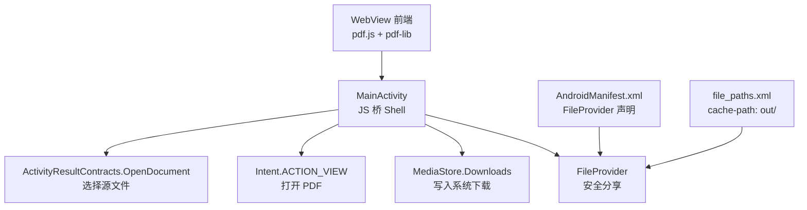
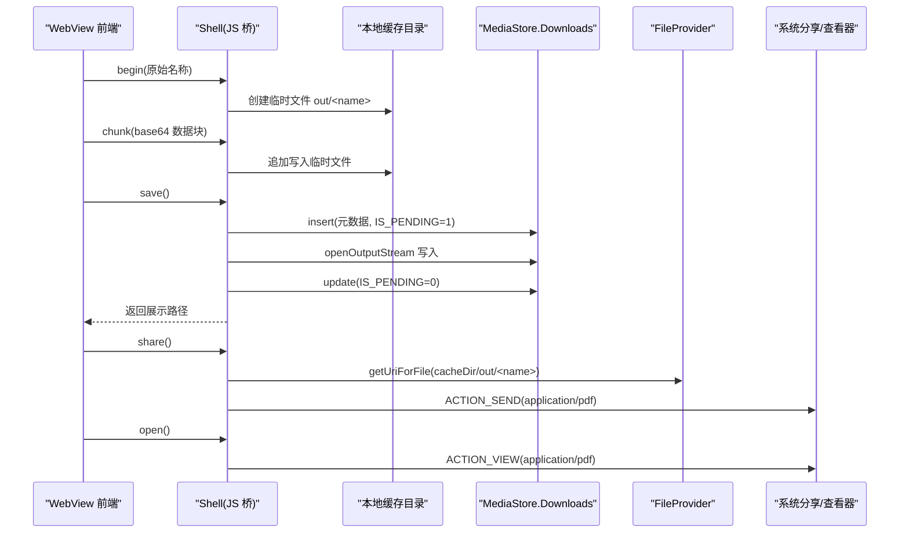
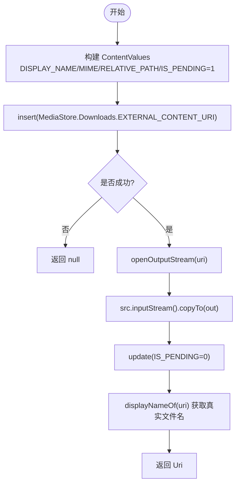
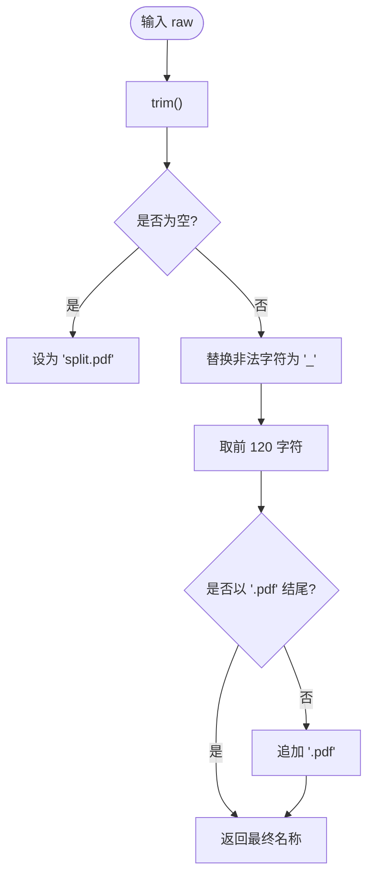
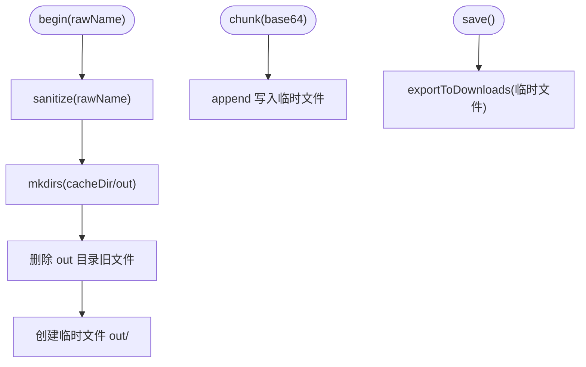
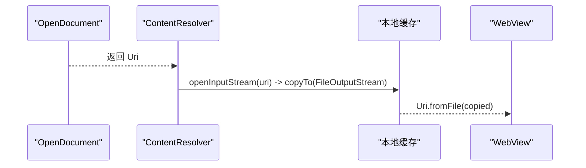
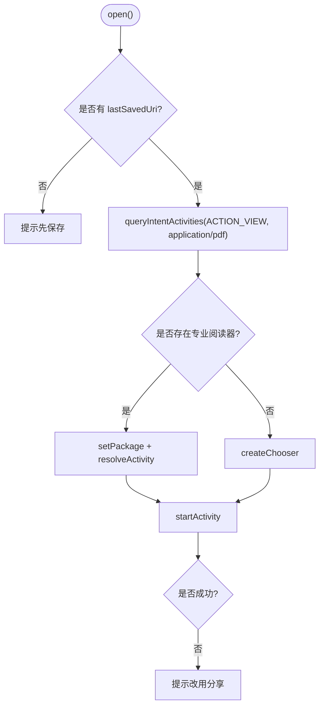
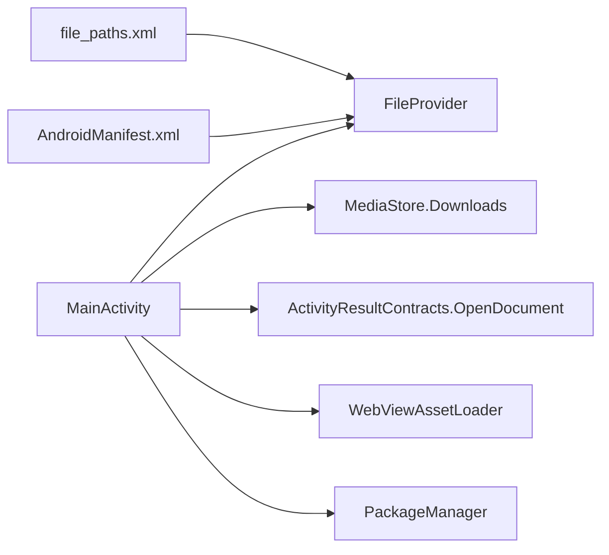

# 文件系统集成

<cite>
**本文引用的文件**   
- [MainActivity.kt](file://android/app/src/main/java/com/pdfsplitter/app/MainActivity.kt)
- [AndroidManifest.xml](file://android/app/src/main/AndroidManifest.xml)
- [file_paths.xml](file://android/app/src/main/res/xml/file_paths.xml)
</cite>

## 目录
1. [引言](#引言)
2. [项目结构](#项目结构)
3. [核心组件](#核心组件)
4. [架构总览](#架构总览)
5. [详细组件分析](#详细组件分析)
6. [依赖关系分析](#依赖关系分析)
7. [性能与资源管理](#性能与资源管理)
8. [故障排查指南](#故障排查指南)
9. [结论](#结论)
10. [附录：最佳实践清单](#附录最佳实践清单)

## 引言
本文件聚焦 Android 端的文件系统集成方案，围绕以下目标展开：
- 使用 MediaStore API 将处理后的 PDF 保存到系统「下载」目录。
- 通过 FileProvider 配置安全分享，避免直接暴露应用私有路径。
- 规范文件命名与安全处理，实现 sanitize 逻辑。
- 说明临时文件的创建、清理与管理机制。
- 解释 URI 到 File 的转换与权限处理。
- 覆盖异常处理与回退策略。
- 总结文件路径管理的最佳实践。

该方案以 WebView 承载前端业务（PDF 切分），原生侧仅负责选文件、写入系统下载、唤起系统分享与打开等“WebView 无法独立完成”的能力。

## 项目结构
本项目在 Android 端的关键文件如下：
- MainActivity.kt：封装 WebView、JS 桥、文件选择、MediaStore 保存、FileProvider 分享、打开文件等能力。
- AndroidManifest.xml：声明 FileProvider、queries（用于查询可打开 PDF 的应用）。
- file_paths.xml：为 FileProvider 暴露缓存目录中的 out 子目录。



图表来源
- [MainActivity.kt:56-83](file://android/app/src/main/java/com/pdfsplitter/app/MainActivity.kt#L56-L83)
- [MainActivity.kt:166-292](file://android/app/src/main/java/com/pdfsplitter/app/MainActivity.kt#L166-L292)
- [AndroidManifest.xml:33-41](file://android/app/src/main/AndroidManifest.xml#L33-L41)
- [file_paths.xml:1-5](file://android/app/src/main/res/xml/file_paths.xml#L1-L5)

章节来源
- [MainActivity.kt:1-311](file://android/app/src/main/java/com/pdfsplitter/app/MainActivity.kt#L1-L311)
- [AndroidManifest.xml:1-45](file://android/app/src/main/AndroidManifest.xml#L1-L45)
- [file_paths.xml:1-5](file://android/app/src/main/res/xml/file_paths.xml#L1-L5)

## 核心组件
- JS 桥 Shell：提供 begin/chunk/save/share/open/log 等方法，负责：
  - 在应用缓存目录中创建临时输出文件并分块写入。
  - 调用 MediaStore 将结果导出到系统「下载」。
  - 通过 FileProvider 生成安全 URI 进行分享。
  - 优先定向到已安装的 PDF 阅读器打开文件。
- MediaStore 导出：使用 Downloads 集合，设置显示名、MIME、相对路径与 IS_PENDING 状态，完成写入后标记完成并读取真实文件名。
- FileProvider 分享：基于 cacheDir/out 暴露文件，配合 Intent.ACTION_SEND 进行分享。
- 文件选择：通过 OpenDocument 契约获取用户选择的 PDF，复制到本地缓存目录供后续处理。
- 命名与安全：sanitize 对非法字符替换、长度限制与后缀规范化。

章节来源
- [MainActivity.kt:166-292](file://android/app/src/main/java/com/pdfsplitter/app/MainActivity.kt#L166-L292)
- [MainActivity.kt:294-299](file://android/app/src/main/java/com/pdfsplitter/app/MainActivity.kt#L294-L299)

## 架构总览
整体流程分为三条主线：输入、处理、输出。



图表来源
- [MainActivity.kt:166-292](file://android/app/src/main/java/com/pdfsplitter/app/MainActivity.kt#L166-L292)

## 详细组件分析

### MediaStore 保存到系统下载目录
- 目标：将生成的 PDF 写入系统「下载」目录下的自定义子目录。
- 关键步骤：
  - 构建 ContentValues，设置 DISPLAY_NAME、MIME_TYPE、RELATIVE_PATH、IS_PENDING。
  - 插入记录并获取 Uri。
  - 通过 contentResolver.openOutputStream 写入文件内容。
  - 更新 IS_PENDING 为 0，表示完成。
  - 再次读取 displayNameOf(uri) 以获取 MediaStore 可能重名调整后的真实文件名。
- 优点：
  - 符合 Android 存储访问框架，兼容 Android 10+ 分区存储。
  - 自动进入系统「下载」应用可见区域，便于用户查找。



图表来源
- [MainActivity.kt:264-280](file://android/app/src/main/java/com/pdfsplitter/app/MainActivity.kt#L264-L280)

章节来源
- [MainActivity.kt:264-280](file://android/app/src/main/java/com/pdfsplitter/app/MainActivity.kt#L264-L280)

### FileProvider 配置与安全分享
- 配置要点：
  - 在 AndroidManifest.xml 中声明 androidx.core.content.FileProvider，authorities 使用 ${applicationId}.fileprovider。
  - 指定 meta-data android.support.FILE_PROVIDER_PATHS 指向 @xml/file_paths。
  - file_paths.xml 中通过 <cache-path name="out" path="out/" /> 暴露缓存目录下的 out 子目录。
- 使用方式：
  - 通过 FileProvider.getUriForFile(context, authorities, file) 生成安全 URI。
  - 使用 Intent.ACTION_SEND 携带 application/pdf 类型与 EXTRA_STREAM。
  - 添加 FLAG_GRANT_READ_URI_PERMISSION 授予读取权限。
- 安全性：
  - 不直接暴露应用私有路径，仅暴露受控的子目录。
  - 通过 grantUriPermissions 控制临时读权限。

```mermaid
classDiagram
class FileProvider {
+getUriForFile(context, authority, file) Uri
}
class Manifest {
+provider(authority="${applicationId}.fileprovider")
+meta_data(FILE_PROVIDER_PATHS="@xml/file_paths")
}
class PathsXml {
+cache-path(name="out", path="out/")
}
class MainActivity {
+shareFile(file)
}
Manifest --> FileProvider : "声明 Provider"
PathsXml --> FileProvider : "定义可共享路径"
MainActivity --> FileProvider : "生成安全 URI"
```

图表来源
- [AndroidManifest.xml:33-41](file://android/app/src/main/AndroidManifest.xml#L33-L41)
- [file_paths.xml:1-5](file://android/app/src/main/res/xml/file_paths.xml#L1-L5)
- [MainActivity.kt:282-292](file://android/app/src/main/java/com/pdfsplitter/app/MainActivity.kt#L282-L292)

章节来源
- [AndroidManifest.xml:33-41](file://android/app/src/main/AndroidManifest.xml#L33-L41)
- [file_paths.xml:1-5](file://android/app/src/main/res/xml/file_paths.xml#L1-L5)
- [MainActivity.kt:282-292](file://android/app/src/main/java/com/pdfsplitter/app/MainActivity.kt#L282-L292)

### 文件命名规范与安全处理（sanitize）
- 规则：
  - 去除首尾空白；为空时使用默认名 split.pdf。
  - 将非法字符（反斜杠、正斜杠、冒号、星号、问号、双引号、小于号、大于号、竖线）替换为下划线。
  - 限制最大长度为 120 个字符。
  - 若不以 .pdf 结尾则自动补全后缀。
- 目的：
  - 避免跨平台文件系统非法字符导致写入失败。
  - 保证统一的后缀，便于 MIME 识别与系统处理。



图表来源
- [MainActivity.kt:294-299](file://android/app/src/main/java/com/pdfsplitter/app/MainActivity.kt#L294-L299)

章节来源
- [MainActivity.kt:294-299](file://android/app/src/main/java/com/pdfsplitter/app/MainActivity.kt#L294-L299)

### 临时文件的创建、清理与管理
- 创建：
  - 在 cacheDir/out 目录下创建临时文件，文件名来自 sanitize(rawName)。
  - 使用 append 模式 FileOutputStream 分块写入 base64 解码后的字节。
- 清理：
  - 每次 begin() 时清空 out 目录旧文件，避免历史残留。
  - 选择文件 pickPdf 回调中也会清理 pick 目录，确保干净环境。
- 生命周期：
  - 临时文件仅在应用运行期间存在，由应用缓存目录管理，卸载时随应用清理。
  - 最终产物通过 MediaStore 导出到系统「下载」，不再依赖临时文件。



图表来源
- [MainActivity.kt:171-184](file://android/app/src/main/java/com/pdfsplitter/app/MainActivity.kt#L171-L184)
- [MainActivity.kt:186-209](file://android/app/src/main/java/com/pdfsplitter/app/MainActivity.kt#L186-L209)

章节来源
- [MainActivity.kt:171-184](file://android/app/src/main/java/com/pdfsplitter/app/MainActivity.kt#L171-L184)
- [MainActivity.kt:186-209](file://android/app/src/main/java/com/pdfsplitter/app/MainActivity.kt#L186-L209)

### URI 到 File 的转换与权限处理
- 从系统选择器获取的 URI：
  - 通过 contentResolver.openInputStream(uri) 读取流，复制至本地缓存目录。
  - 使用 Uri.fromFile(copied) 转换为 File URI 供 WebView 回调。
- 打开与分享时的 URI：
  - 打开：ACTION_VIEW + FLAG_GRANT_READ_URI_PERMISSION。
  - 分享：FileProvider.getUriForFile + ACTION_SEND + FLAG_GRANT_READ_URI_PERMISSION。
- 注意：
  - 不直接使用绝对路径传递敏感文件，始终通过 Content URI 或 FileProvider URI。
  - 对第三方应用只授予必要的临时读权限。



图表来源
- [MainActivity.kt:56-83](file://android/app/src/main/java/com/pdfsplitter/app/MainActivity.kt#L56-L83)

章节来源
- [MainActivity.kt:56-83](file://android/app/src/main/java/com/pdfsplitter/app/MainActivity.kt#L56-L83)

### 打开文件与阅读器定向
- 策略：
  - 优先尝试已安装的专业 PDF 阅读器（如 WPS、Xodo、Adobe Reader）。
  - 若无匹配，退回系统选择器让用户选择。
- 实现：
  - 使用 queries 声明可查询 VIEW action + application/pdf 的应用。
  - 通过 packageManager.queryIntentActivities 获取候选列表。
  - 按优先级 setPackage 并 resolveActivity 确定具体组件。
  - 启动 ACTION_VIEW，失败时提示改用分享。



图表来源
- [AndroidManifest.xml:7-12](file://android/app/src/main/AndroidManifest.xml#L7-L12)
- [MainActivity.kt:222-256](file://android/app/src/main/java/com/pdfsplitter/app/MainActivity.kt#L222-L256)

章节来源
- [AndroidManifest.xml:7-12](file://android/app/src/main/AndroidManifest.xml#L7-L12)
- [MainActivity.kt:222-256](file://android/app/src/main/java/com/pdfsplitter/app/MainActivity.kt#L222-L256)

## 依赖关系分析
- MainActivity 依赖：
  - MediaStore.Downloads：写入系统下载目录。
  - FileProvider：生成安全分享 URI。
  - ActivityResultContracts.OpenDocument：选择源文件。
  - WebViewAssetLoader：加载 assets/www 资源。
  - PackageManager：查询可打开 PDF 的应用。
- 配置依赖：
  - AndroidManifest.xml 声明 FileProvider 与 queries。
  - file_paths.xml 暴露 cacheDir/out 子目录。



图表来源
- [MainActivity.kt:1-311](file://android/app/src/main/java/com/pdfsplitter/app/MainActivity.kt#L1-L311)
- [AndroidManifest.xml:33-41](file://android/app/src/main/AndroidManifest.xml#L33-L41)
- [file_paths.xml:1-5](file://android/app/src/main/res/xml/file_paths.xml#L1-L5)

章节来源
- [MainActivity.kt:1-311](file://android/app/src/main/java/com/pdfsplitter/app/MainActivity.kt#L1-L311)
- [AndroidManifest.xml:1-45](file://android/app/src/main/AndroidManifest.xml#L1-L45)
- [file_paths.xml:1-5](file://android/app/src/main/res/xml/file_paths.xml#L1-L5)

## 性能与资源管理
- 大文件传输：
  - 采用分块 base64 传输，避免单次桥调用内存峰值过高。
  - 使用 append 模式写入临时文件，减少频繁创建开销。
- I/O 优化：
  - 使用 inputStream().use / outputStream().use 确保流关闭。
  - 写入完成后立即更新 IS_PENDING 为 0，使系统扫描可见。
- 缓存清理：
  - begin() 和 pickPdf 回调中主动清理对应目录，防止累积。
- 建议：
  - 对超大文件考虑后台任务与进度反馈。
  - 监控磁盘空间，避免写入失败。
  - 对 Base64 解码与拷贝过程增加超时与错误重试。

[本节为通用指导，不直接分析具体文件]

## 故障排查指南
- 写入「下载」失败：
  - 检查 MediaStore.insert 是否返回 null。
  - 确认 RELATIVE_PATH 是否正确，且应用具备相应权限。
  - 查看日志中 export failed 堆栈。
- 分享失败：
  - 确认 FileProvider.authorities 与 file_paths.xml 配置一致。
  - 检查是否添加了 FLAG_GRANT_READ_URI_PERMISSION。
  - 确认存在可接收 application/pdf 的目标应用。
- 无法打开 PDF：
  - 检查 queries 是否包含 VIEW + application/pdf。
  - 确认 lastSavedUri 有效且未被清理。
  - 若定向失败，提示用户使用系统分享。
- 文件名异常：
  - 检查 sanitize 是否被正确调用。
  - 确认 MediaStore 重名后 displayNameOf(uri) 能获取真实文件名。

章节来源
- [MainActivity.kt:186-209](file://android/app/src/main/java/com/pdfsplitter/app/MainActivity.kt#L186-L209)
- [MainActivity.kt:282-292](file://android/app/src/main/java/com/pdfsplitter/app/MainActivity.kt#L282-L292)
- [MainActivity.kt:222-256](file://android/app/src/main/java/com/pdfsplitter/app/MainActivity.kt#L222-L256)
- [MainActivity.kt:294-299](file://android/app/src/main/java/com/pdfsplitter/app/MainActivity.kt#L294-L299)

## 结论
本方案通过 MediaStore 与 FileProvider 的组合，实现了安全的文件保存与分享，同时利用 WebView 与 JS 桥完成大文件分块处理。通过规范的命名与临时文件管理机制，保证了稳定性与可维护性。配合 queries 与优先级阅读器定向，提升了用户体验。建议在后续迭代中继续完善错误恢复、进度反馈与性能监控。

[本节为总结性内容，不直接分析具体文件]

## 附录：最佳实践清单
- 始终通过 Content URI 或 FileProvider URI 访问文件，避免直接暴露私有路径。
- 使用 MediaStore.Downloads 写入系统「下载」目录，提升用户可发现性。
- 对临时文件集中管理，并在关键节点清理，避免磁盘膨胀。
- 对用户输入的文件名执行 sanitize，限制长度与非法字符。
- 在分享与打开场景明确授权 FLAG_GRANT_READ_URI_PERMISSION。
- 使用 queries 声明可查询的应用类别，提高 ACTION_VIEW 成功率。
- 对关键 I/O 操作使用 try/catch 或 runCatching，并提供用户友好提示。
- 对大文件采用分块传输与增量写入，降低内存压力。

[本节为通用指导，不直接分析具体文件]