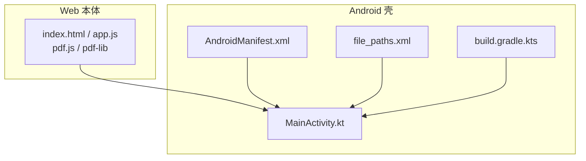
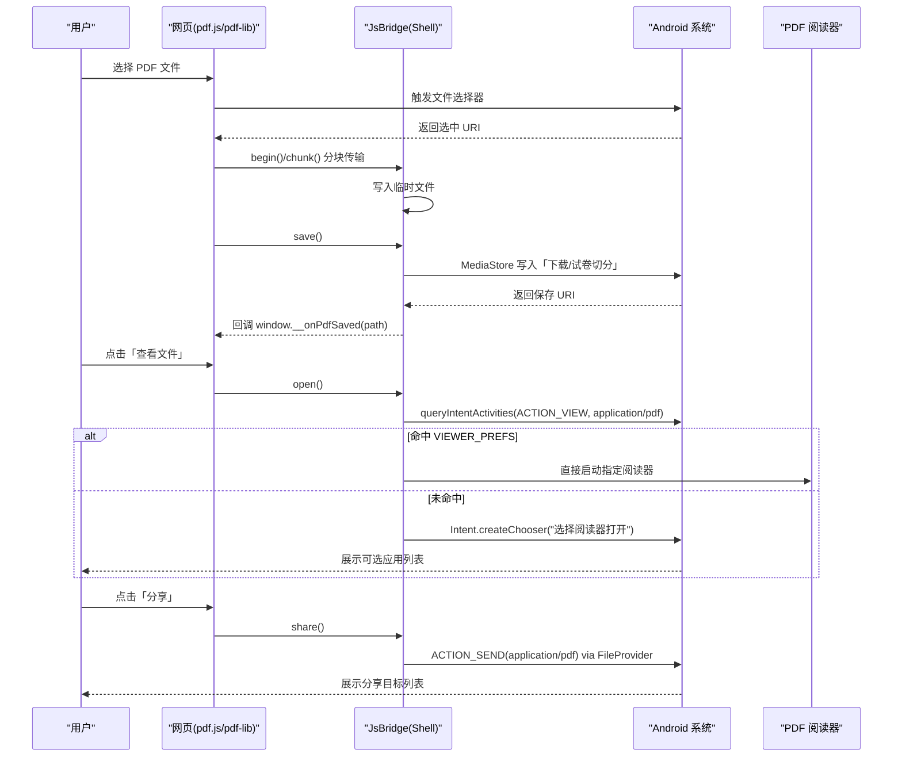
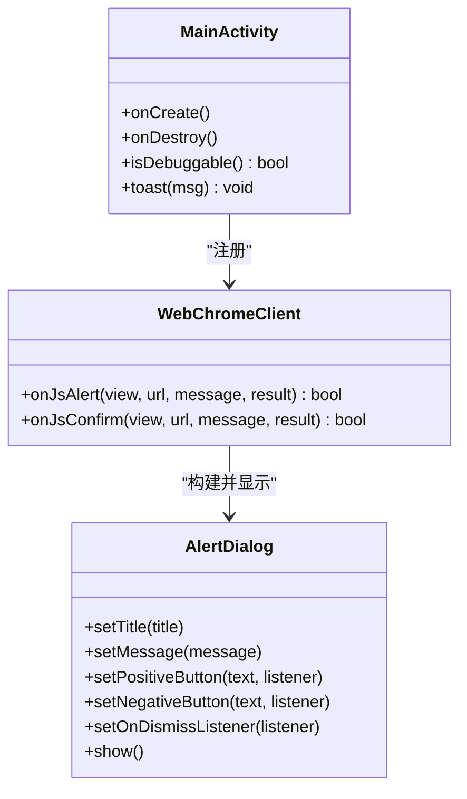
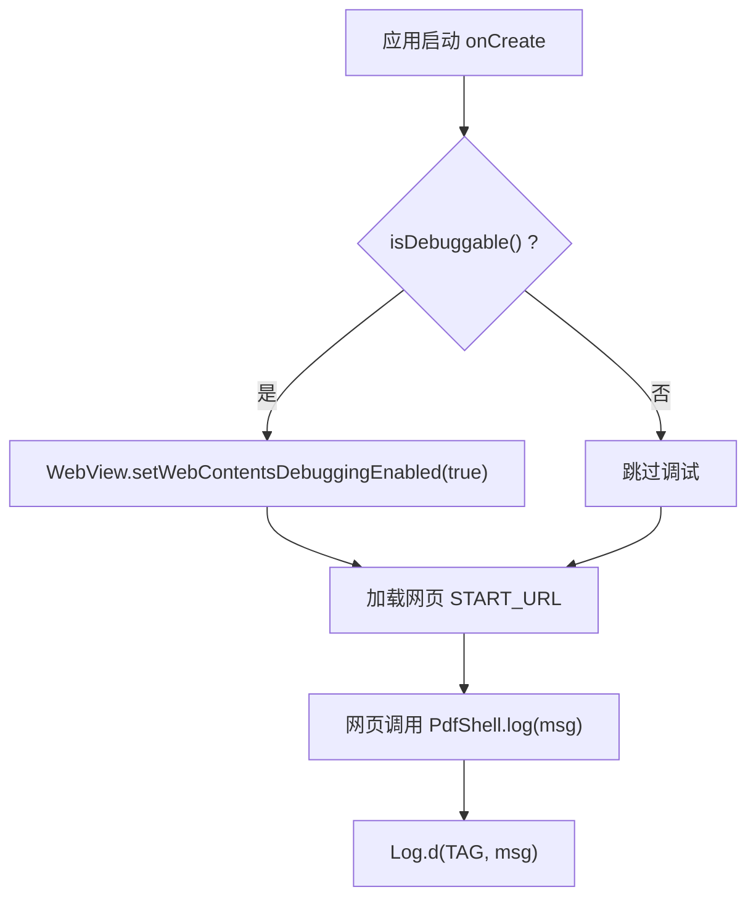
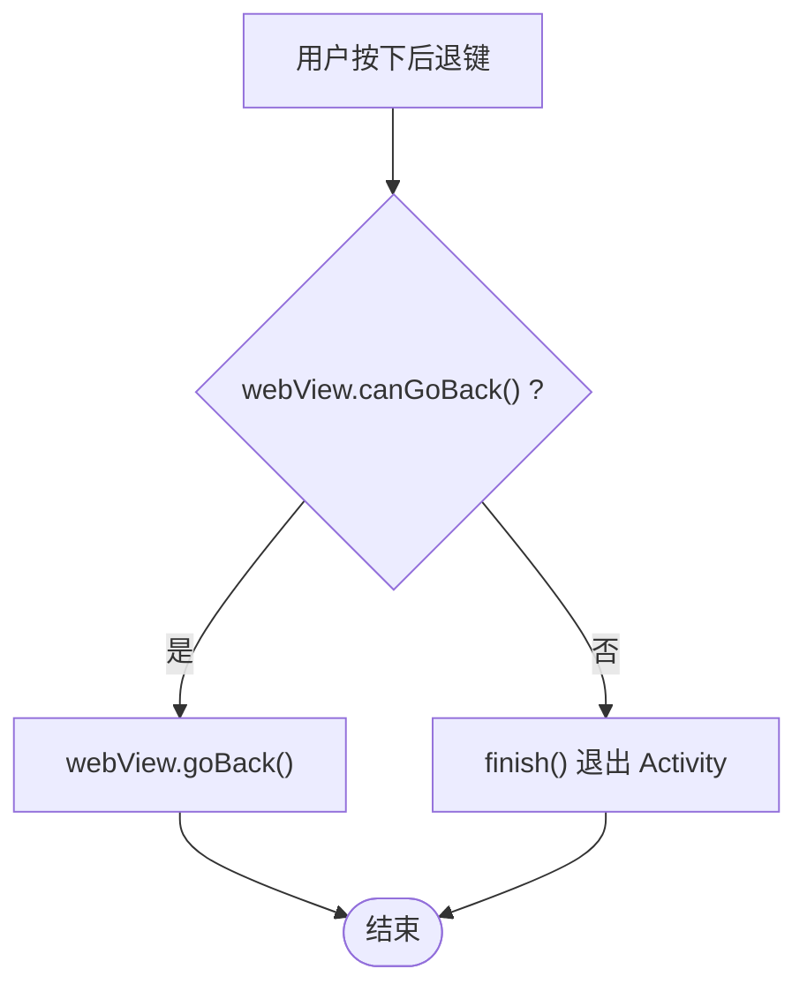
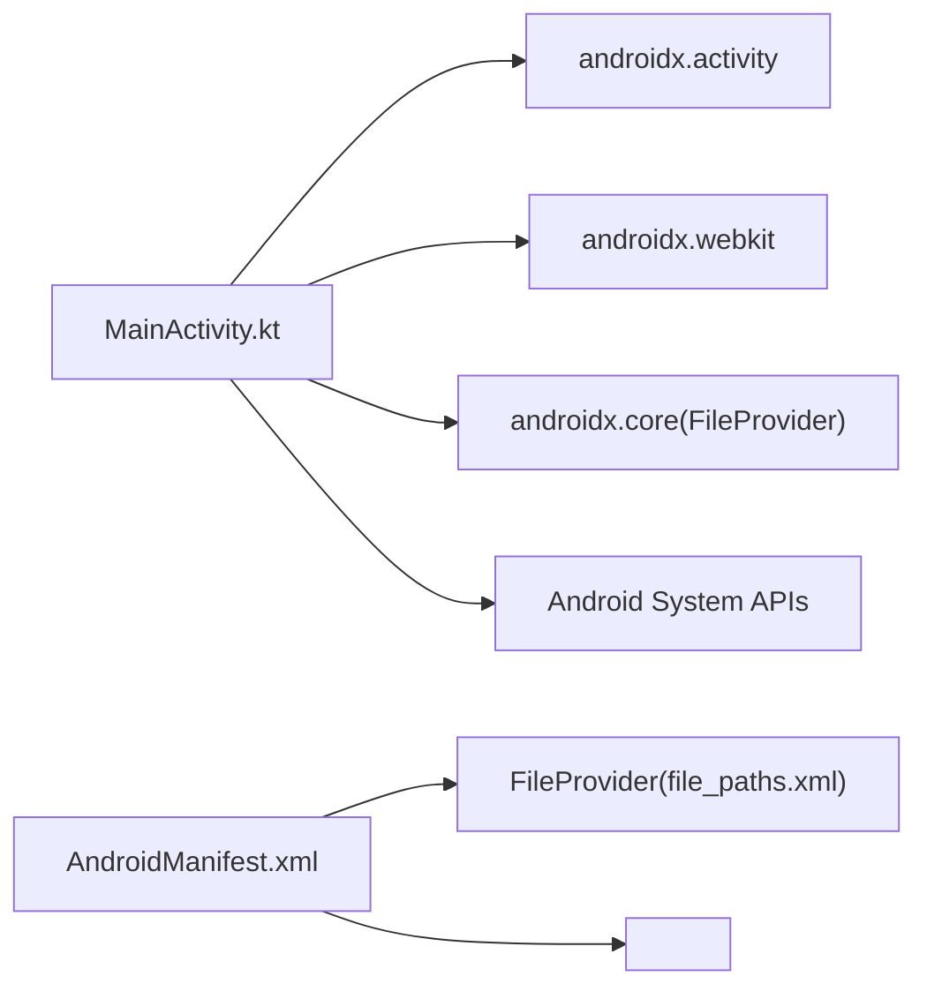

# 系统集成服务

<cite>
**本文引用的文件**   
- [MainActivity.kt](file://android/app/src/main/java/com/pdfsplitter/app/MainActivity.kt)
- [AndroidManifest.xml](file://android/app/src/main/AndroidManifest.xml)
- [file_paths.xml](file://android/app/src/main/res/xml/file_paths.xml)
- [build.gradle.kts](file://android/app/build.gradle.kts)
- [README.md](file://README.md)
</cite>

## 目录
1. [简介](#简介)
2. [项目结构](#项目结构)
3. [核心组件](#核心组件)
4. [架构总览](#架构总览)
5. [详细组件分析](#详细组件分析)
6. [依赖关系分析](#依赖关系分析)
7. [性能与兼容性](#性能与兼容性)
8. [故障排查指南](#故障排查指南)
9. [结论](#结论)

## 简介
本系统集成服务以 Android WebView 为壳，承载本地 Web 应用（pdf.js + pdf-lib）完成 PDF 切分、预览与导出。原生侧负责：
- 自动检测并启动合适的 PDF 阅读器；
- 通过系统分享能力发送结果文件；
- 提供 Toast 与 AlertDialog 提示；
- 启用调试模式与日志记录；
- 定制后退按钮行为与页面导航；
- 适配 Android 10+ 的包可见性与存储访问限制。

该方案不请求用户可见权限，所有处理在设备本地完成，避免网络上传风险。

**章节来源**
- [README.md:1-35](file://README.md#L1-L35)

## 项目结构
- android/app：Android 壳工程，包含 MainActivity、清单配置、FileProvider 路径定义等。
- pdf-splitter：Web 本体（PWA），由构建任务同步到 assets/www。
- pdftool_test：本地验证脚本与输出。



**图表来源**
- [MainActivity.kt:1-50](file://android/app/src/main/java/com/pdfsplitter/app/MainActivity.kt#L1-L50)
- [AndroidManifest.xml:1-45](file://android/app/src/main/AndroidManifest.xml#L1-L45)
- [file_paths.xml:1-5](file://android/app/src/main/res/xml/file_paths.xml#L1-L5)
- [build.gradle.kts:51-84](file://android/app/build.gradle.kts#L51-L84)

**章节来源**
- [README.md:13-22](file://README.md#L13-L22)
- [AndroidManifest.xml:1-45](file://android/app/src/main/AndroidManifest.xml#L1-L45)
- [file_paths.xml:1-5](file://android/app/src/main/res/xml/file_paths.xml#L1-L5)
- [build.gradle.kts:51-84](file://android/app/build.gradle.kts#L51-L84)

## 核心组件
- WebView 外壳与资源加载：使用 WebViewAssetLoader 将本地资源以安全 URL 暴露给网页，避免 file:// 协议导致的 worker 加载失败。
- 文件选择回调：拦截 onShowFileChooser，调用系统 OpenDocument 契约，复制所选 PDF 到缓存目录并回传 URI。
- JS 桥 Shell：提供 begin/chunk/save/share/open/log 等方法，实现大文件分块 base64 传输、写入下载目录、发起系统分享、打开 PDF 阅读器等。
- 系统交互：Toast 提示、AlertDialog 处理 JS alert/confirm、后退按钮路由到 WebView 历史或退出 Activity。
- 调试与日志：根据 FLAG_DEBUGGABLE 开启 WebView 调试，JS 桥 log 方法输出 Log.d。

**章节来源**
- [MainActivity.kt:85-152](file://android/app/src/main/java/com/pdfsplitter/app/MainActivity.kt#L85-L152)
- [MainActivity.kt:166-262](file://android/app/src/main/java/com/pdfsplitter/app/MainActivity.kt#L166-L262)

## 架构总览
整体流程围绕“WebView 业务逻辑 + 原生系统能力”展开：
- 网页端负责 PDF 解析、切分、预览；
- 原生端负责文件 IO、系统分享、阅读器定向、UI 提示；
- 通过 JsInterface 桥接两端数据流。



**图表来源**
- [MainActivity.kt:114-152](file://android/app/src/main/java/com/pdfsplitter/app/MainActivity.kt#L114-L152)
- [MainActivity.kt:166-262](file://android/app/src/main/java/com/pdfsplitter/app/MainActivity.kt#L166-L262)
- [MainActivity.kt:264-292](file://android/app/src/main/java/com/pdfsplitter/app/MainActivity.kt#L264-L292)
- [AndroidManifest.xml:33-41](file://android/app/src/main/AndroidManifest.xml#L33-L41)

## 详细组件分析

### PDF 阅读器自动检测与启动机制（VIEWER_PREFS）
- 白名单策略：按优先级维护已安装阅读器的包名集合，优先直启 WPS、小米多看、夸克、Xodo、Adobe Reader 等真正阅读器，避免邮箱/网盘/AI 助手误当附件处理。
- 查询与匹配：构造 ACTION_VIEW + application/pdf 的 Intent，调用 packageManager.queryIntentActivities 获取已安装应用包名集合，再取第一个在白名单中的包名。
- 精确启动：若命中白名单，设置 intent.setPackage(viewer)，并通过 resolveActivity 进一步确定具体 Activity 组件，确保稳定启动。
- 降级策略：若无命中，则使用 Intent.createChooser 弹出系统选择器，让用户手动选择。
- 兼容要求：Android 11+ 需要在清单中声明 <queries>，否则无法查到第三方应用，导致直启失败。

```mermaid
flowchart TD
Start(["open() 入口"]) --> CheckUri["检查 lastSavedUri 是否存在"]
CheckUri --> |不存在| ToastNoSave["Toast: 请先保存到本地"]
CheckUri --> |存在| BuildViewIntent["构建 ACTION_VIEW + application/pdf"]
BuildViewIntent --> QueryInstalled["queryIntentActivities 获取已安装应用包名集合"]
QueryInstalled --> MatchPref{"是否命中 VIEWER_PREFS?"}
MatchPref --> |是| SetPackage["setPackage(viewer) + resolveActivity 确定组件"]
MatchPref --> |否| CreateChooser["Intent.createChooser(\"选择阅读器打开\")"]
SetPackage --> Launch["startActivity(intent)"]
CreateChooser --> Launch
Launch --> Success{"启动成功?"}
Success --> |是| End(["结束"])
Success --> |否| LogWarn["Log.w(open failed) + Toast(\"没有能打开 PDF 的应用，可改用系统分享\")"]
ToastNoSave --> End
```

**图表来源**
- [MainActivity.kt:222-256](file://android/app/src/main/java/com/pdfsplitter/app/MainActivity.kt#L222-L256)
- [AndroidManifest.xml:7-12](file://android/app/src/main/AndroidManifest.xml#L7-L12)

**章节来源**
- [MainActivity.kt:44-48](file://android/app/src/main/java/com/pdfsplitter/app/MainActivity.kt#L44-L48)
- [MainActivity.kt:222-256](file://android/app/src/main/java/com/pdfsplitter/app/MainActivity.kt#L222-L256)
- [AndroidManifest.xml:7-12](file://android/app/src/main/AndroidManifest.xml#L7-L12)

### 系统分享功能（Intent.createChooser 与权限）
- 分享入口：share() 校验临时文件存在且非空，随后调用 shareFile(file)。
- 文件提供者：使用 FileProvider.getUriForFile 生成安全的 content:// URI，并在 Manifest 中声明 authorities 与 meta-data 指向 file_paths.xml。
- Intent 构造：ACTION_SEND + type=application/pdf + EXTRA_STREAM=fileUri + FLAG_GRANT_READ_URI_PERMISSION。
- 选择器：通过 Intent.createChooser 展示系统分享目标列表，标题为“分享切分后的试卷”。
- 异常处理：捕获异常并记录 Log.w，同时 Toast 提示“未找到可接收 PDF 的应用”。

```mermaid
flowchart TD
ShareStart(["share() 入口"]) --> ValidateFile["校验 target 文件存在且非空"]
ValidateFile --> |无效| ToastNoResult["Toast: 还没有可分享的结果，请先完成切分"]
ValidateFile --> |有效| GetUri["FileProvider.getUriForFile(...)"]
GetUri --> BuildSendIntent["ACTION_SEND + application/pdf + EXTRA_STREAM + READ permission flag"]
BuildSendIntent --> ShowChooser["Intent.createChooser(\"分享切分后的试卷\")"]
ShowChooser --> Done(["结束"])
ToastNoResult --> Done
```

**图表来源**
- [MainActivity.kt:282-292](file://android/app/src/main/java/com/pdfsplitter/app/MainActivity.kt#L282-L292)
- [AndroidManifest.xml:33-41](file://android/app/src/main/AndroidManifest.xml#L33-L41)
- [file_paths.xml:1-5](file://android/app/src/main/res/xml/file_paths.xml#L1-L5)

**章节来源**
- [MainActivity.kt:282-292](file://android/app/src/main/java/com/pdfsplitter/app/MainActivity.kt#L282-L292)
- [AndroidManifest.xml:33-41](file://android/app/src/main/AndroidManifest.xml#L33-L41)
- [file_paths.xml:1-5](file://android/app/src/main/res/xml/file_paths.xml#L1-L5)

### 应用内提示系统（Toast 与 AlertDialog）
- Toast：封装 toast(msg) 统一显示短消息，用于保存、分享、错误提示等场景。
- AlertDialog：
  - onJsAlert：用 AlertDialog.Builder 显示 JS alert 内容，标题取自应用名称字符串资源，确认按钮关闭对话框并取消 JsResult。
  - onJsConfirm：提供“确定/取消”两个按钮，分别对应 confirm/cancel JsResult，支持取消监听。
- 用户体验：所有提示均在主线程执行，避免 UI 更新异常。



**图表来源**
- [MainActivity.kt:126-145](file://android/app/src/main/java/com/pdfsplitter/app/MainActivity.kt#L126-L145)
- [MainActivity.kt:307-309](file://android/app/src/main/java/com/pdfsplitter/app/MainActivity.kt#L307-L309)

**章节来源**
- [MainActivity.kt:126-145](file://android/app/src/main/java/com/pdfsplitter/app/MainActivity.kt#L126-L145)
- [MainActivity.kt:307-309](file://android/app/src/main/java/com/pdfsplitter/app/MainActivity.kt#L307-L309)

### 调试模式与日志记录机制
- 调试开关：isDebuggable() 基于 ApplicationInfo.FLAG_DEBUGGABLE 判断是否为 debug 包；若是，则启用 WebView.setWebContentsDebuggingEnabled(true)，可在 Chrome DevTools 中审查页面。
- 日志通道：Shell.log(msg) 将网页传来的消息通过 Log.d(TAG, msg) 输出，便于定位问题。
- 构建差异：debug 构建类型会添加 .debug 后缀，便于与 release 共存。



**图表来源**
- [MainActivity.kt:91-91](file://android/app/src/main/java/com/pdfsplitter/app/MainActivity.kt#L91-L91)
- [MainActivity.kt:159-160](file://android/app/src/main/java/com/pdfsplitter/app/MainActivity.kt#L159-L160)
- [MainActivity.kt:258-261](file://android/app/src/main/java/com/pdfsplitter/app/MainActivity.kt#L258-L261)
- [build.gradle.kts:56-59](file://android/app/build.gradle.kts#L56-L59)

**章节来源**
- [MainActivity.kt:91-91](file://android/app/src/main/java/com/pdfsplitter/app/MainActivity.kt#L91-L91)
- [MainActivity.kt:159-160](file://android/app/src/main/java/com/pdfsplitter/app/MainActivity.kt#L159-L160)
- [MainActivity.kt:258-261](file://android/app/src/main/java/com/pdfsplitter/app/MainActivity.kt#L258-L261)
- [build.gradle.kts:56-59](file://android/app/build.gradle.kts#L56-L59)

### 后退按钮行为与页面导航处理
- 后退路由：通过 onBackPressedDispatcher.addCallback 注册回调，优先判断 webView.canGoBack()，若可后退则 goBack()，否则 finish() 退出 Activity。
- 适用场景：用户在网页内部浏览历史记录时，后退键先回到上一页；无历史时退出应用，符合移动端直觉。



**图表来源**
- [MainActivity.kt:148-150](file://android/app/src/main/java/com/pdfsplitter/app/MainActivity.kt#L148-L150)

**章节来源**
- [MainActivity.kt:148-150](file://android/app/src/main/java/com/pdfsplitter/app/MainActivity.kt#L148-L150)

### 系统兼容性考虑与版本适配方案
- Android 11+ 包可见性：清单中声明 <queries> 针对 ACTION_VIEW + application/pdf，使 queryIntentActivities 能正确返回已安装的 PDF 阅读器，从而直启 WPS 等应用。
- 存储访问：结果写入走 MediaStore.Downloads，无需额外存储权限；FileProvider 仅用于分享时的 URI 授权。
- WebView 资源加载：使用 WebViewAssetLoader 提供 https://appassets.androidplatform.net/assets/www/ 地址，避免 file:// 下 pdf.js worker 加载失败。
- 最低版本：minSdk 29（Android 10），已在 Android 13 设备上验证选文件、预览、切分、保存、查看、分享等功能。

**章节来源**
- [AndroidManifest.xml:4-12](file://android/app/src/main/AndroidManifest.xml#L4-L12)
- [MainActivity.kt:103-112](file://android/app/src/main/java/com/pdfsplitter/app/MainActivity.kt#L103-L112)
- [README.md:35-35](file://README.md#L35-L35)

## 依赖关系分析
- MainActivity 依赖：
  - AndroidX Activity/WebView/WebChromeClient/WebViewClientCompat；
  - AndroidX Core FileProvider；
  - AndroidX WebKit WebViewAssetLoader；
  - Android System APIs：MediaStore、OpenableColumns、Environment、PackageManager、Intent、Toast、AlertDialog。
- 清单依赖：
  - FileProvider authorities 与 meta-data 指向 file_paths.xml；
  - <queries> 声明允许查询 PDF 查看器。



**图表来源**
- [MainActivity.kt:1-30](file://android/app/src/main/java/com/pdfsplitter/app/MainActivity.kt#L1-L30)
- [AndroidManifest.xml:33-41](file://android/app/src/main/AndroidManifest.xml#L33-L41)
- [AndroidManifest.xml:7-12](file://android/app/src/main/AndroidManifest.xml#L7-L12)
- [build.gradle.kts:80-84](file://android/app/build.gradle.kts#L80-L84)

**章节来源**
- [build.gradle.kts:80-84](file://android/app/build.gradle.kts#L80-L84)
- [AndroidManifest.xml:33-41](file://android/app/src/main/AndroidManifest.xml#L33-L41)
- [AndroidManifest.xml:7-12](file://android/app/src/main/AndroidManifest.xml#L7-L12)

## 性能与兼容性
- 大文件传输：通过 Shell.chunk 分块 base64 传输，避免单次桥调用内存峰值过高。
- 下载写入：使用 MediaStore 异步写入，标记 IS_PENDING，完成后更新为 0，提升系统相册/下载应用的可见性。
- 阅读器直启：优先白名单直启，减少用户选择步骤；未命中时退回系统选择器，保证可用性。
- 兼容性：minSdk 29，Android 11+ 需 <queries>；WebView 资源通过 AssetLoader 加载，避免 file:// 限制。

[本节为通用指导，不直接分析具体文件]

## 故障排查指南
- “没有能打开 PDF 的应用”：
  - 检查是否已安装真正的 PDF 阅读器；
  - 确认清单中 <queries> 已声明 ACTION_VIEW + application/pdf；
  - 查看 Log.w(TAG, "open failed", it) 的具体异常信息。
- “未找到可接收 PDF 的应用”：
  - 检查 FileProvider authorities 是否正确配置；
  - 确认 file_paths.xml 中 cache-path name="out" path="out/" 与代码一致；
  - 查看 Log.w(TAG, "share failed", it)。
- “查看文件前请先保存到本地”：
  - 确认 lastSavedUri 是否已被 exportToDownloads 赋值；
  - 检查 MediaStore 写入是否成功（IS_PENDING 状态）。
- WebView 调试不可用：
  - 确认 isDebuggable() 返回 true（debug 包）；
  - 在 Chrome 中访问 chrome://inspect 进行调试。

**章节来源**
- [MainActivity.kt:250-254](file://android/app/src/main/java/com/pdfsplitter/app/MainActivity.kt#L250-L254)
- [MainActivity.kt:282-292](file://android/app/src/main/java/com/pdfsplitter/app/MainActivity.kt#L282-L292)
- [MainActivity.kt:227-231](file://android/app/src/main/java/com/pdfsplitter/app/MainActivity.kt#L227-L231)
- [MainActivity.kt:91-91](file://android/app/src/main/java/com/pdfsplitter/app/MainActivity.kt#L91-L91)
- [AndroidManifest.xml:7-12](file://android/app/src/main/AndroidManifest.xml#L7-L12)
- [file_paths.xml:1-5](file://android/app/src/main/res/xml/file_paths.xml#L1-L5)

## 结论
本系统集成服务以轻量原生壳配合本地 Web 引擎，实现了 PDF 切分、预览、保存与分享的完整闭环。关键设计点包括：
- 通过 VIEWER_PREFS 白名单与 <queries> 实现稳定的 PDF 阅读器直启；
- 使用 FileProvider + ACTION_SEND + createChooser 完成安全的系统分享；
- 借助 Toast 与 AlertDialog 提供清晰的用户反馈；
- 基于 FLAG_DEBUGGABLE 控制调试模式，并通过 Log.d 输出调试信息；
- 利用 onBackPressedDispatcher 定制后退行为，提升导航体验；
- 全面适配 Android 10+ 的包可见性与存储访问限制。

该方案在保证隐私与安全的前提下，提供了流畅、可靠的 PDF 处理体验。