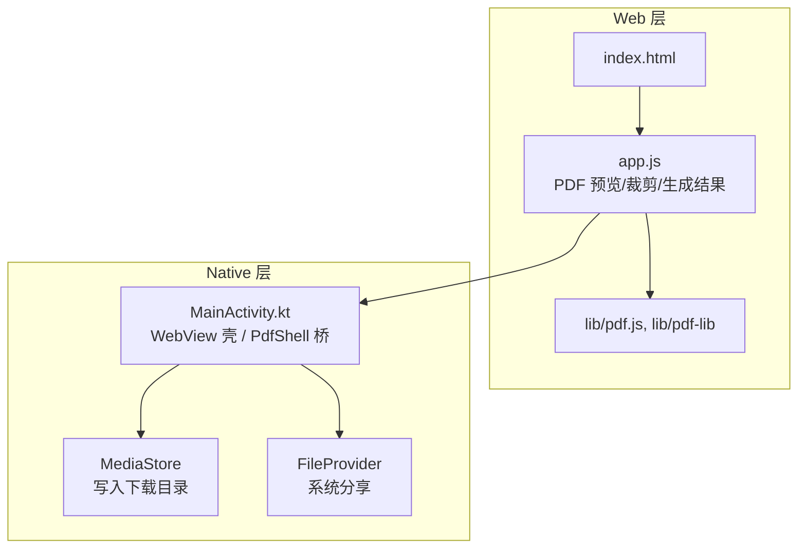
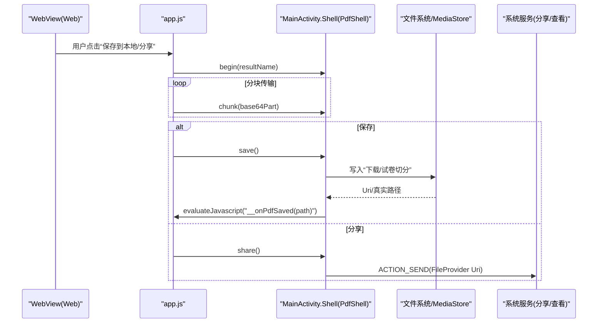
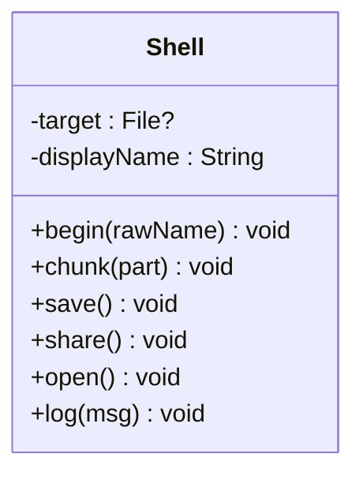
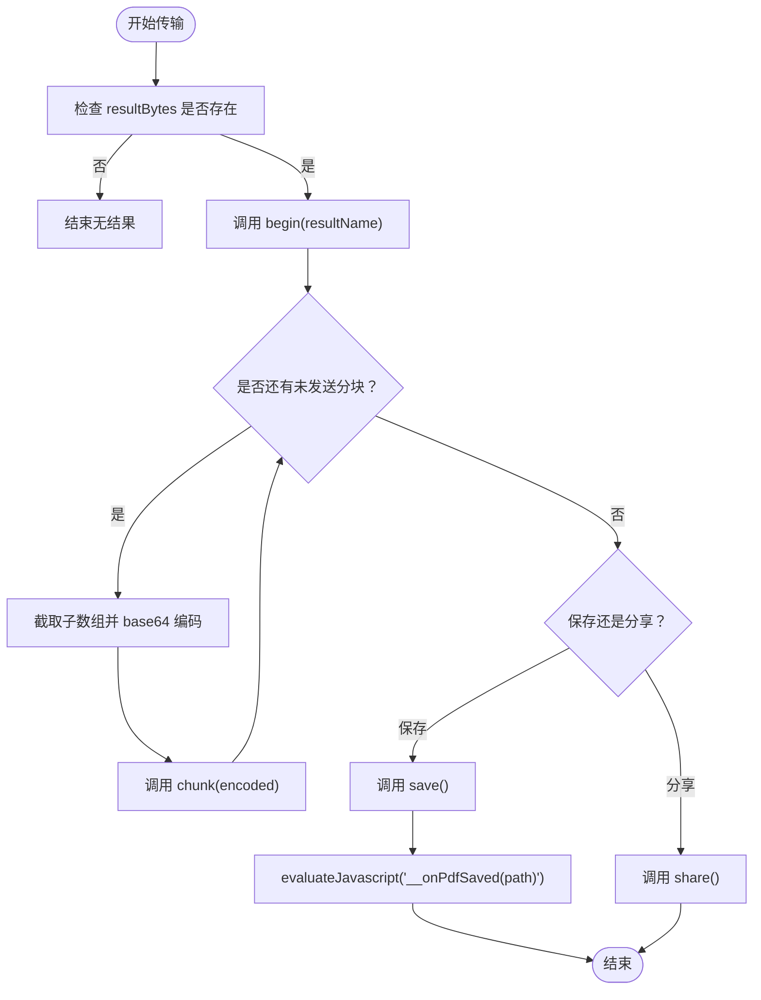
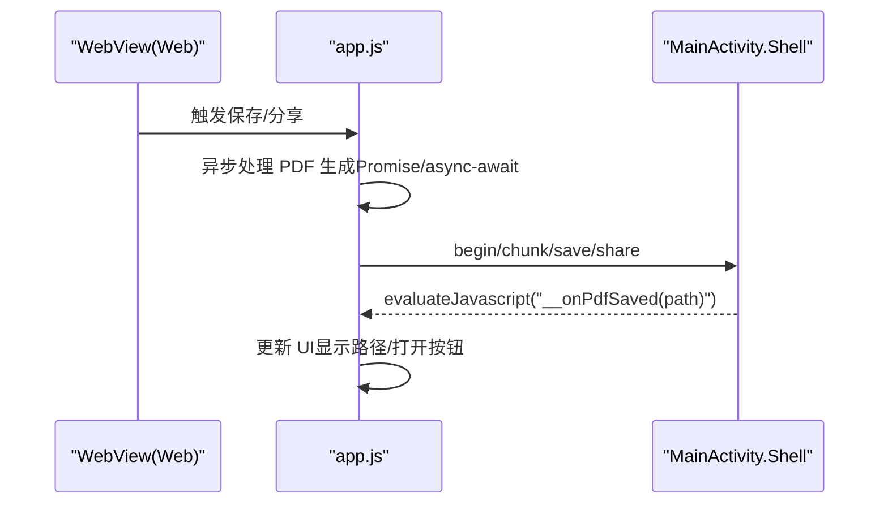
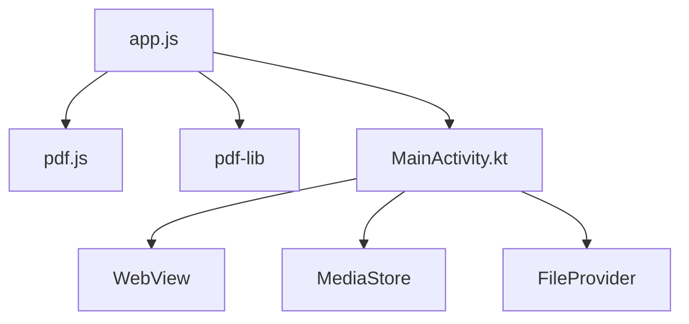

# JavaScript-Native桥接

<cite>
**本文引用的文件**   
- [README.md](file://README.md)
- [app.js](file://pdf-splitter/app.js)
- [MainActivity.kt](file://android/app/src/main/java/com/pdfsplitter/app/MainActivity.kt)
</cite>

## 目录
1. [引言](#引言)
2. [项目结构](#项目结构)
3. [核心组件](#核心组件)
4. [架构总览](#架构总览)
5. [详细组件分析](#详细组件分析)
6. [依赖关系分析](#依赖关系分析)
7. [性能与内存考量](#性能与内存考量)
8. [安全与权限设计](#安全与权限设计)
9. [故障排查指南](#故障排查指南)
10. [扩展与优化建议](#扩展与优化建议)
11. [结论](#结论)

## 引言
本技术文档聚焦于“试卷切分助手”中 JavaScript（WebView 网页）与 Android Native（Kotlin）之间的桥接实现，围绕 PdfShell 接口的设计模式、参数与返回值处理、数据传输机制（base64 编码与分块传输）、异步通信模型（Promise 与回调）、WebView 与 Native 的双向通信（消息路由、事件分发、状态同步），以及安全性与可扩展性进行系统化说明。目标是帮助开发者快速理解现有实现，并在此基础上安全地扩展新接口或优化性能。

## 项目结构
仓库采用“Web 业务 + Android 壳工程”的混合架构：
- pdf-splitter：纯 Web 前端，包含 PWA 入口 index.html、业务逻辑 app.js，以及本地化的 pdf.js 与 pdf-lib 库。
- android：Android 壳工程，使用 WebView 加载 assets/www 中的 Web 资源，并通过 addJavascriptInterface 暴露 PdfShell 桥给页面调用。
- README.md：项目说明、构建流程、关键设计点与已知限制。

图表来源
- [app.js:1-578](file://pdf-splitter/app.js#L1-L578)
- [MainActivity.kt:85-152](file://android/app/src/main/java/com/pdfsplitter/app/MainActivity.kt#L85-L152)
- [MainActivity.kt:264-291](file://android/app/src/main/java/com/pdfsplitter/app/MainActivity.kt#L264-L291)

章节来源
- [README.md:13-22](file://README.md#L13-L22)
- [README.md:67-76](file://README.md#L67-L76)

## 核心组件
- PdfShell 桥（Native 侧）：在 MainActivity 中以 inner class Shell 暴露给 WebView，提供 begin、chunk、save、share、open、log 等方法，负责接收分块数据、落盘、分享、打开文件等原生能力。
- 前端桥调用（Web 侧）：app.js 通过 window.PdfShell 调用 Native 方法，完成大文件分块 base64 传输，并在保存成功后监听 __onPdfSaved 回调以更新 UI。
- 资源加载与 WebView 配置：使用 WebViewAssetLoader 将 assets/www 映射为 https URL，避免 file:// 协议下 pdf.js worker 加载失败；同时启用 JS、DOM Storage，设置缓存策略。
- 文件选择与回调：通过 ActivityResultContracts.OpenDocument 拉起系统文件选择器，保留原始文件名并回传给 WebView。

章节来源
- [MainActivity.kt:103-112](file://android/app/src/main/java/com/pdfsplitter/app/MainActivity.kt#L103-L112)
- [MainActivity.kt:114-152](file://android/app/src/main/java/com/pdfsplitter/app/MainActivity.kt#L114-L152)
- [MainActivity.kt:166-262](file://android/app/src/main/java/com/pdfsplitter/app/MainActivity.kt#L166-L262)
- [app.js:512-576](file://pdf-splitter/app.js#L512-L576)

## 架构总览
下图展示 WebView 与 Native 的双向通信路径：Web 端发起 PDF 切分后，通过 PdfShell.begin/chunk/save/share/open 与 Native 交互；Native 侧通过 evaluateJavascript 回调 Web 端的 window.__onPdfSaved，形成双向消息流。

图表来源
- [app.js:512-576](file://pdf-splitter/app.js#L512-L576)
- [MainActivity.kt:166-262](file://android/app/src/main/java/com/pdfsplitter/app/MainActivity.kt#L166-L262)
- [MainActivity.kt:264-291](file://android/app/src/main/java/com/pdfsplitter/app/MainActivity.kt#L264-L291)

## 详细组件分析

### PdfShell 接口设计与方法语义
- begin(rawName): 初始化目标文件名与临时输出目录，清理旧文件，创建空文件用于后续追加写入。
- chunk(part): 接收 base64 分块，解码后追加写入临时文件。
- save(): 校验临时文件存在且非空，复制到 MediaStore 的“下载/试卷切分”，并将最终显示路径通过 evaluateJavascript 回调给 Web。
- share(): 校验临时文件存在且非空，通过 FileProvider 构造 Uri 并发起系统分享，不落盘到下载目录。
- open(): 根据上次保存的 Uri，优先定向到白名单阅读器应用，否则退回系统选择器。
- log(msg): 调试日志输出。

图表来源
- [MainActivity.kt:166-262](file://android/app/src/main/java/com/pdfsplitter/app/MainActivity.kt#L166-L262)

章节来源
- [MainActivity.kt:166-262](file://android/app/src/main/java/com/pdfsplitter/app/MainActivity.kt#L166-L262)

### 数据传输机制：base64 编码与分块传输
- 前端分块大小：固定 768 KB 每块，循环调用 chunk 发送 base64 编码的分片。
- base64 编码：将 Uint8Array 分段拼接字符串后使用 btoa 编码，避免单次过大字符串导致栈溢出。
- 后端解码与落盘：Native 侧使用 Base64.decode 解码后以追加模式写入临时文件，确保顺序一致。
- 文件名与路径：begin 中 sanitize 过滤非法字符并限制长度，确保跨平台兼容。

图表来源
- [app.js:512-528](file://pdf-splitter/app.js#L512-L528)
- [MainActivity.kt:170-184](file://android/app/src/main/java/com/pdfsplitter/app/MainActivity.kt#L170-L184)
- [MainActivity.kt:294-299](file://android/app/src/main/java/com/pdfsplitter/app/MainActivity.kt#L294-L299)

章节来源
- [app.js:512-528](file://pdf-splitter/app.js#L512-L528)
- [MainActivity.kt:170-184](file://android/app/src/main/java/com/pdfsplitter/app/MainActivity.kt#L170-L184)
- [MainActivity.kt:294-299](file://android/app/src/main/java/com/pdfsplitter/app/MainActivity.kt#L294-L299)

### 异步通信处理：Promise 封装与回调函数
- Web 侧：app.js 使用 async/await 与 Promise 管理 PDF 读取、旋转归一化、预览渲染、裁剪与生成结果；错误通过 catch 捕获并提示用户。
- Native 侧：通过 evaluateJavascript 将保存成功后的真实路径回调给 Web 的 window.__onPdfSaved，实现状态同步。
- 错误传播：Web 侧对异常进行统一处理并 alert；Native 侧对导出与分享失败进行 Log 记录与 Toast 提示。

图表来源
- [app.js:204-239](file://pdf-splitter/app.js#L204-L239)
- [app.js:412-508](file://pdf-splitter/app.js#L412-L508)
- [MainActivity.kt:205-208](file://android/app/src/main/java/com/pdfsplitter/app/MainActivity.kt#L205-L208)

章节来源
- [app.js:204-239](file://pdf-splitter/app.js#L204-L239)
- [app.js:412-508](file://pdf-splitter/app.js#L412-L508)
- [MainActivity.kt:205-208](file://android/app/src/main/java/com/pdfsplitter/app/MainActivity.kt#L205-L208)

### WebView 与 Native 的双向通信
- 消息路由：Web 通过 window.PdfShell 调用 Native 方法；Native 通过 evaluateJavascript 回调 Web 的全局函数。
- 事件分发：文件选择回调由 ActivityResultContracts 处理，将 URI 复制至缓存目录并返回给 WebView。
- 状态同步：保存成功后，Native 将最终路径回传，Web 更新 UI 并启用“查看文件”按钮。

图表来源
- [MainActivity.kt:103-112](file://android/app/src/main/java/com/pdfsplitter/app/MainActivity.kt#L103-L112)
- [MainActivity.kt:147-152](file://android/app/src/main/java/com/pdfsplitter/app/MainActivity.kt#L147-L152)
- [MainActivity.kt:205-208](file://android/app/src/main/java/com/pdfsplitter/app/MainActivity.kt#L205-L208)
- [app.js:566-576](file://pdf-splitter/app.js#L566-L576)

章节来源
- [MainActivity.kt:103-112](file://android/app/src/main/java/com/pdfsplitter/app/MainActivity.kt#L103-L112)
- [MainActivity.kt:147-152](file://android/app/src/main/java/com/pdfsplitter/app/MainActivity.kt#L147-L152)
- [MainActivity.kt:205-208](file://android/app/src/main/java/com/pdfsplitter/app/MainActivity.kt#L205-L208)
- [app.js:566-576](file://pdf-splitter/app.js#L566-L576)

## 依赖关系分析
- Web 层依赖 pdf.js 与 pdf-lib 进行解析、预览与裁剪；不依赖网络资源，全部本地化。
- Native 层依赖 Android SDK 的 WebView、MediaStore、FileProvider 与 Intent 系统能力。
- 桥接层通过 addJavascriptInterface 建立直接调用通道，避免复杂的消息总线。

图表来源
- [app.js:1-11](file://pdf-splitter/app.js#L1-L11)
- [MainActivity.kt:85-152](file://android/app/src/main/java/com/pdfsplitter/app/MainActivity.kt#L85-L152)
- [MainActivity.kt:264-291](file://android/app/src/main/java/com/pdfsplitter/app/MainActivity.kt#L264-L291)

章节来源
- [app.js:1-11](file://pdf-splitter/app.js#L1-L11)
- [MainActivity.kt:85-152](file://android/app/src/main/java/com/pdfsplitter/app/MainActivity.kt#L85-L152)
- [MainActivity.kt:264-291](file://android/app/src/main/java/com/pdfsplitter/app/MainActivity.kt#L264-L291)

## 性能与内存考量
- 预览复用位图：已渲染页标记 painted，裁白边时直接复用 canvas 位图，避免重复栅格化。
- 懒加载渲染：IntersectionObserver 仅渲染可视区域，减少初始渲染开销。
- 分块传输：固定 768 KB 分块，降低单次桥调用的内存压力。
- 大文件限制：几百页扫描件一次性嵌入会导致内存峰值偏高，无法中途取消。
- 白边检测耗时：逐页栅格化约 1s/页，瓶颈在内容解析与绘制指令。

章节来源
- [app.js:153-193](file://pdf-splitter/app.js#L153-L193)
- [app.js:288-329](file://pdf-splitter/app.js#L288-L329)
- [app.js:512-528](file://pdf-splitter/app.js#L512-L528)
- [README.md:77-90](file://README.md#L77-L90)

## 安全与权限设计
- 输入验证：文件名 sanitize 过滤非法字符并限制长度，避免路径注入。
- 权限最小化：安装包无 INTERNET 与存储可见权限，仅使用内部签名级权限。
- 资源隔离：WebViewAssetLoader 仅加载 assets/www，禁止远程页面加载。
- 白名单定向：查看文件按 VIEWER_PREFS 白名单定向到真正阅读器，避免邮箱/网盘/AI 助手误上传。
- 查询可见性：Android 11+ 需声明 <queries> 以正确查询可打开 PDF 的应用。

章节来源
- [MainActivity.kt:294-299](file://android/app/src/main/java/com/pdfsplitter/app/MainActivity.kt#L294-L299)
- [MainActivity.kt:44-49](file://android/app/src/main/java/com/pdfsplitter/app/MainActivity.kt#L44-L49)
- [MainActivity.kt:93-101](file://android/app/src/main/java/com/pdfsplitter/app/MainActivity.kt#L93-L101)
- [README.md:4-5](file://README.md#L4-L5)
- [README.md:74-76](file://README.md#L74-L76)

## 故障排查指南
- WebView 调试：安装 debug 包后访问 chrome://inspect 审查页面与 console。
- 文件选择失败：检查 OpenDocument 回调是否返回 null，确认 URI 可读与复制成功。
- 保存失败：检查 MediaStore 插入与更新是否成功，确认 IS_PENDING 标志位。
- 分享失败：检查 FileProvider Uri 是否正确，确认系统有可接收 PDF 的应用。
- 打开失败：检查白名单应用是否安装，必要时退回系统选择器。

章节来源
- [README.md:54-56](file://README.md#L54-L56)
- [MainActivity.kt:56-73](file://android/app/src/main/java/com/pdfsplitter/app/MainActivity.kt#L56-L73)
- [MainActivity.kt:264-291](file://android/app/src/main/java/com/pdfsplitter/app/MainActivity.kt#L264-L291)
- [MainActivity.kt:226-256](file://android/app/src/main/java/com/pdfsplitter/app/MainActivity.kt#L226-L256)

## 扩展与优化建议
- 新增接口步骤：
  - 在 MainActivity.Shell 中添加 @JavascriptInterface 方法，定义参数与返回值语义。
  - 在 app.js 中增加对应调用封装，必要时封装 Promise 以统一错误处理。
  - 如需回调，使用 evaluateJavascript 调用 window.__xxx 全局函数。
- 调试技巧：
  - 使用 Shell.log 输出关键信息，结合 Logcat 定位问题。
  - 在 Chrome DevTools 中观察 WebView 控制台与网络面板。
- 性能优化：
  - 调整分块大小以适应不同设备内存与 CPU 性能。
  - 对超大文件考虑流式处理或后台任务，避免主线程阻塞。
  - 复用已渲染位图与中间结果，减少重复计算。

章节来源
- [MainActivity.kt:166-262](file://android/app/src/main/java/com/pdfsplitter/app/MainActivity.kt#L166-L262)
- [app.js:512-576](file://pdf-splitter/app.js#L512-L576)
- [README.md:54-56](file://README.md#L54-L56)

## 结论
本项目通过简洁的 PdfShell 桥实现了 Web 与 Native 的高效协作：Web 侧专注 PDF 解析、预览与裁剪，Native 侧提供文件选择、落盘、分享与查看等系统能力。基于 base64 分块传输与 evaluateJavascript 回调，系统在移动端环境下具备较好的稳定性与用户体验。未来可在安全性、性能与可扩展性方面持续优化，以满足更大规模与更复杂场景的需求。