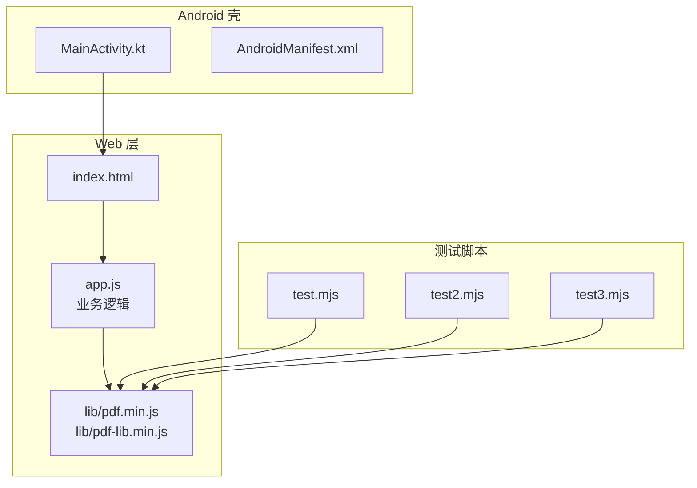
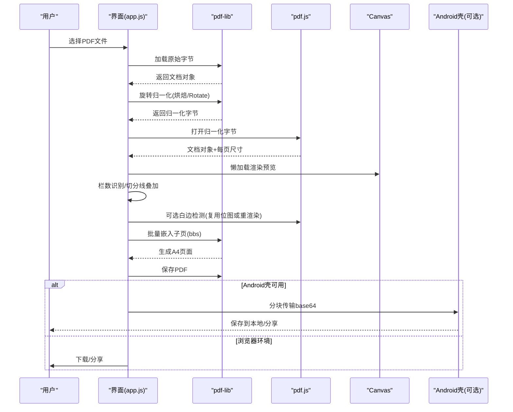
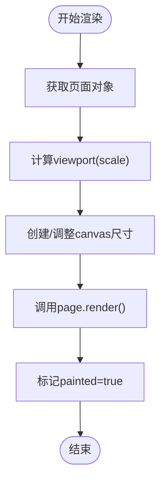
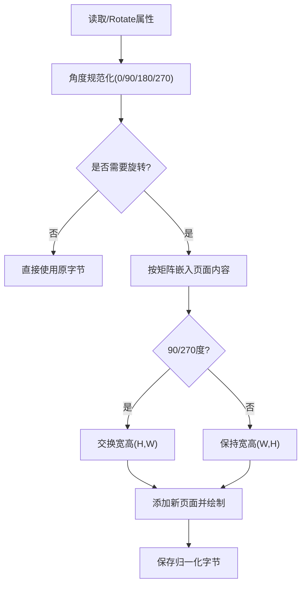
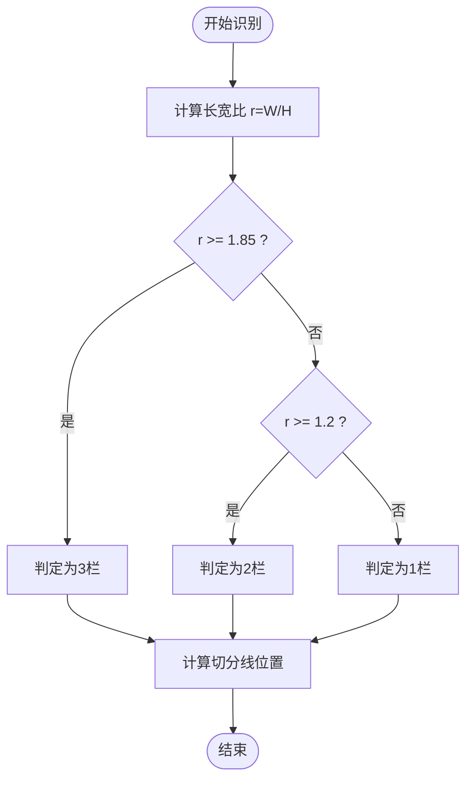
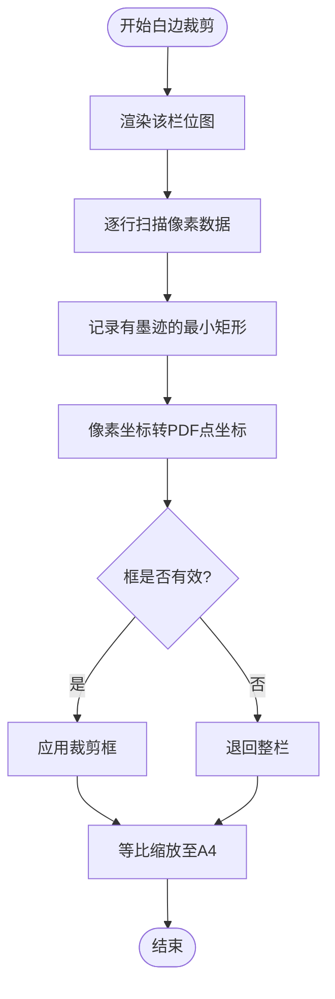
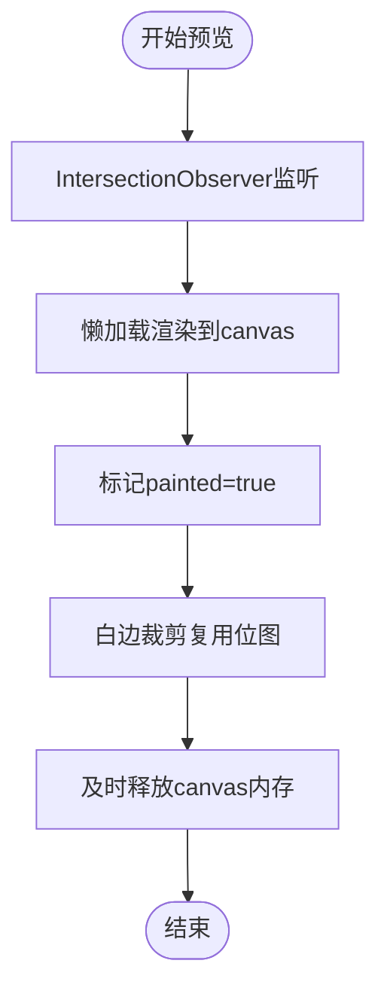
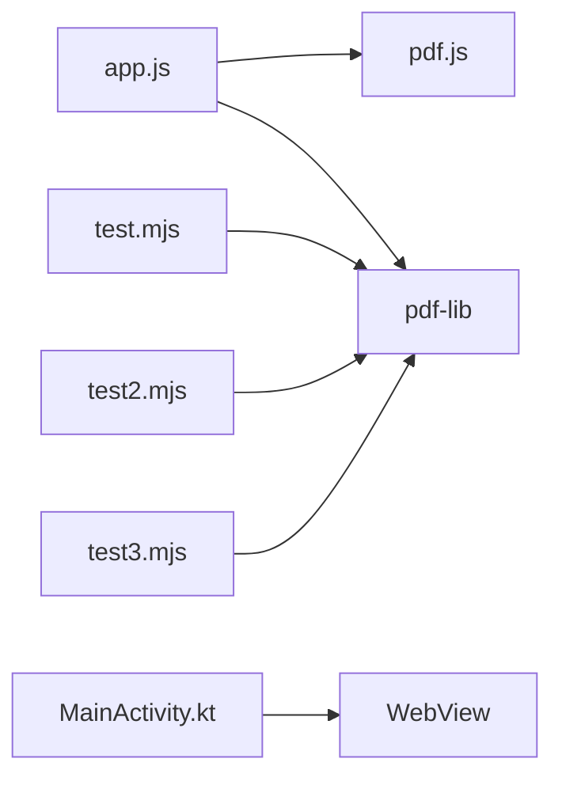

# PDF处理引擎

<cite>
**本文引用的文件**   
- [README.md](file://README.md)
- [app.js](file://pdf-splitter/app.js)
- [test.mjs](file://pdftool_test/test.mjs)
- [test2.mjs](file://pdftool_test/test2.mjs)
- [test3.mjs](file://pdftool_test/test3.mjs)
</cite>

## 目录
1. [引言](#引言)
2. [项目结构](#项目结构)
3. [核心组件](#核心组件)
4. [架构总览](#架构总览)
5. [详细组件分析](#详细组件分析)
6. [依赖关系分析](#依赖关系分析)
7. [性能与优化](#性能与优化)
8. [故障排查指南](#故障排查指南)
9. [结论](#结论)

## 引言
本项目是一个“试卷切分助手”，目标是将 A3/A4 拼版试卷（一页横排 2 栏或 3 栏）切分为“一页一题”的标准 A4 PDF，便于直接打印。全部处理在手机/电脑本地完成，不联网、不上传。技术选型上：
- 预览与栅格化使用 pdf.js；
- 页面裁剪、嵌入与输出使用 pdf-lib；
- Android 壳工程通过 WebView 承载 Web 应用，并通过原生桥接实现文件选择、保存与分享。

本技术文档聚焦 PDF 处理引擎的实现细节，包括 pdf-lib 的 API 使用、pdf.js 渲染机制、旋转校正算法、智能栏数识别、白边裁剪、以及位图缓存与异步处理等性能优化策略。

## 项目结构
仓库包含以下关键部分：
- `pdf-splitter/`：Web 本体（PWA），包含入口 HTML、主逻辑脚本与本地化的 pdf.js、pdf-lib 资源；
- `android/`：Android 壳工程（Kotlin + WebView），负责 WebView 配置、文件选择、结果保存与分享；
- `pdftool_test/`：Node.js 侧验证脚本，演示 pdf-lib 的多种切分与嵌入方式；
- 根目录 README 说明产品功能、构建流程与已知限制。

**图表来源**
- [README.md:13-22](file://README.md#L13-L22)
- [app.js:1-10](file://pdf-splitter/app.js#L1-L10)
- [test.mjs:1-11](file://pdftool_test/test.mjs#L1-L11)
- [test2.mjs:1-11](file://pdftool_test/test2.mjs#L1-L11)
- [test3.mjs:1-11](file://pdftool_test/test3.mjs#L1-L11)

**章节来源**
- [README.md:13-22](file://README.md#L13-L22)

## 核心组件
- PDF 加载与归一化：读取原始 ArrayBuffer，使用 pdf-lib 加载并执行旋转归一化，得到统一坐标系的字节流；
- 文档打开与尺寸采集：使用 pdf.js 打开归一化后的字节流，收集每页显示宽高；
- 预览与栅格化：基于 pdf.js viewport 渲染到 canvas，支持懒加载与 IntersectionObserver；
- 栏数识别：按页面长宽比自动判断 2 栏或 3 栏，也支持手动模式；
- 白边裁剪：将每栏渲染为位图，扫描墨迹区域，计算最小矩形作为裁剪框；
- 页面嵌入与输出：使用 pdf-lib 批量嵌入裁剪后的子页，等比缩放至 A4 纵向，生成最终 PDF；
- 结果导出：支持下载、系统分享，或在 Android 壳中通过原生桥接保存与查看。

**章节来源**
- [app.js:13-28](file://pdf-splitter/app.js#L13-L28)
- [app.js:204-239](file://pdf-splitter/app.js#L204-L239)
- [app.js:243-263](file://pdf-splitter/app.js#L243-L263)
- [app.js:265-329](file://pdf-splitter/app.js#L265-L329)
- [app.js:331-361](file://pdf-splitter/app.js#L331-L361)
- [app.js:412-508](file://pdf-splitter/app.js#L412-L508)

## 架构总览
整体处理流程如下：
1. 用户选择 PDF 文件；
2. 使用 pdf-lib 加载并进行旋转归一化；
3. 使用 pdf.js 打开文档，采集每页尺寸；
4. 构建预览网格，懒加载渲染；
5. 根据设置进行栏数识别与切分线叠加；
6. 可选白边裁剪：复用已渲染位图或触发一次独立栅格化；
7. 使用 pdf-lib 批量嵌入子页并绘制到 A4 页面；
8. 保存结果并提供下载/分享。

**图表来源**
- [app.js:204-239](file://pdf-splitter/app.js#L204-L239)
- [app.js:243-263](file://pdf-splitter/app.js#L243-L263)
- [app.js:265-329](file://pdf-splitter/app.js#L265-L329)
- [app.js:412-508](file://pdf-splitter/app.js#L412-L508)

## 详细组件分析

### pdf-lib 核心API使用
- 文档创建与加载：
  - 使用 `PDFDocument.create()` 创建新文档；
  - 使用 `PDFDocument.load()` 加载输入字节，忽略加密以兼容扫描卷；
- 页面操作：
  - `getPages()` 获取源页面列表；
  - `embedPage()` / `embedPages()` 按边界框裁剪并嵌入子页；
  - `addPage([W,H])` 添加 A4 页面；
  - `drawPage(emb, {x,y,width,height})` 将子页等比绘制到 A4；
- 输出：
  - `save({useObjectStreams:true})` 生成压缩后的字节流。

示例参考路径：
- 基础切分与等比缩放：[test.mjs:26-47](file://pdftool_test/test.mjs#L26-L47)
- 单页嵌入循环：[test2.mjs:32-41](file://pdftool_test/test2.mjs#L32-L41)
- 批量嵌入优化：[test3.mjs:24-54](file://pdftool_test/test3.mjs#L24-L54)
- 主流程批量嵌入与绘制：[app.js:452-477](file://pdf-splitter/app.js#L452-L477)

**章节来源**
- [test.mjs:18-54](file://pdftool_test/test.mjs#L18-L54)
- [test2.mjs:18-47](file://pdftool_test/test2.mjs#L18-L47)
- [test3.mjs:18-56](file://pdftool_test/test3.mjs#L18-L56)
- [app.js:412-508](file://pdf-splitter/app.js#L412-L508)

### pdf.js 渲染机制与viewport坐标
- Worker 配置：在 HTTPS 下使用 worker，file:// 下回退主线程；
- 文档打开：使用 `pdfjsLib.getDocument({data})` 打开归一化字节；
- viewport 与栅格化：
  - `page.getViewport({scale})` 计算显示尺寸；
  - `page.render({canvasContext, viewport})` 渲染到 canvas；
- 预览优化：
  - 固定逻辑宽度 `RENDER_W=820`，按页面实际宽高计算 scale；
  - 使用 IntersectionObserver 懒加载，避免一次性渲染所有页；
  - 标记 `it.painted=true` 表示位图真正可用，供白边裁剪复用。

**图表来源**
- [app.js:6-9](file://pdf-splitter/app.js#L6-L9)
- [app.js:243-263](file://pdf-splitter/app.js#L243-L263)
- [app.js:316-329](file://pdf-splitter/app.js#L316-L329)

**章节来源**
- [app.js:6-9](file://pdf-splitter/app.js#L6-L9)
- [app.js:243-263](file://pdf-splitter/app.js#L243-L263)
- [app.js:316-329](file://pdf-splitter/app.js#L316-L329)

### 旋转校正算法
- 问题背景：
  - pdf.js 的 viewport 会自动应用页面的 `/Rotate`；
  - pdf-lib 的 `getSize()` / `embedPage()` 完全忽略 `/Rotate`；
  - 因此必须先“烘焙”旋转，使预览与裁剪在同一套显示坐标中。
- 实现要点：
  - 读取页面 `/Rotate`，若不存在则尝试父节点；
  - 对角度做规范化（0/90/180/270）；
  - 定义四个变换矩阵，分别对应 0°/90°/180°/270°，用于顺时针旋转到显示方向；
  - 90°/270° 时交换宽高，确保新页面尺寸正确；
  - 若无页面带旋转，直接复用原字节，避免无谓重存。

**图表来源**
- [app.js:57-103](file://pdf-splitter/app.js#L57-L103)

**章节来源**
- [app.js:57-103](file://pdf-splitter/app.js#L57-L103)

### 智能栏数识别算法
- 自动识别：
  - 计算页面长宽比 `r = W/H`；
  - 若 `r >= 1.85` 判为 3 栏；
  - 若 `r >= 1.2` 判为 2 栏；
  - 否则为 1 栏；
- 手动模式：
  - 用户可选择“左中右 3 栏”或“左右 2 栏”；
- 切分线叠加：
  - 根据栏数计算等分位置，支持全局微调偏移；
  - 更新预览覆盖层与输出页数统计。

**图表来源**
- [app.js:45-54](file://pdf-splitter/app.js#L45-L54)
- [app.js:331-361](file://pdf-splitter/app.js#L331-L361)

**章节来源**
- [app.js:45-54](file://pdf-splitter/app.js#L45-L54)
- [app.js:331-361](file://pdf-splitter/app.js#L331-L361)

### 白边裁剪实现
- 像素扫描检测：
  - 将每栏渲染成位图，逐行扫描像素数据；
  - 阈值判断非白色像素（RGB任一通道 < 240）；
  - 记录有墨迹的最小矩形，并加少量余量（TRIM_PAD）避免削到笔画；
- 墨迹区域识别：
  - 将像素坐标换算回 PDF 点坐标；
  - 结合页面高度转换 Y 轴方向；
  - 过滤过小的无效框（宽高小于阈值）。
- 等比缩放算法：
  - 将裁剪后的子页等比放入 A4，保证宽和高都不超出可用区；
  - 由上下边距决定放大率，左右留白自适应。

**图表来源**
- [app.js:105-193](file://pdf-splitter/app.js#L105-L193)
- [app.js:442-456](file://pdf-splitter/app.js#L442-L456)

**章节来源**
- [app.js:105-193](file://pdf-splitter/app.js#L105-L193)
- [app.js:442-456](file://pdf-splitter/app.js#L442-L456)

### 预览优化与位图缓存
- 懒加载渲染：
  - 使用 IntersectionObserver 仅渲染可见区域；
  - 处理期间让路给 pdf.js 队列，完成后补渲染；
- 位图复用：
  - 标记 `it.painted=true`，白边裁剪直接复用已渲染 canvas；
  - 避免同一页被 pdf.js 栅格化两遍；
- 内存管理：
  - 及时释放临时 canvas（width/height 置零）；
  - 切换文件时销毁旧 pdf.js 文档，释放 worker 与缓存。

**图表来源**
- [app.js:265-329](file://pdf-splitter/app.js#L265-L329)
- [app.js:153-193](file://pdf-splitter/app.js#L153-L193)

**章节来源**
- [app.js:265-329](file://pdf-splitter/app.js#L265-L329)
- [app.js:153-193](file://pdf-splitter/app.js#L153-L193)

## 依赖关系分析
- Web 层依赖：
  - app.js 依赖 pdf.js（预览/栅格化）与 pdf-lib（裁剪/嵌入/输出）；
- Android 壳依赖：
  - MainActivity.kt 提供 WebViewAssetLoader、文件选择器、PdfShell 桥；
- 测试脚本依赖：
  - Node.js 环境下使用 pdf-lib 进行离线验证。

**图表来源**
- [app.js:1-10](file://pdf-splitter/app.js#L1-L10)
- [test.mjs:1-11](file://pdftool_test/test.mjs#L1-L11)
- [test2.mjs:1-11](file://pdftool_test/test2.mjs#L1-L11)
- [test3.mjs:1-11](file://pdftool_test/test3.mjs#L1-L11)

**章节来源**
- [README.md:67-75](file://README.md#L67-L75)
- [app.js:1-10](file://pdf-splitter/app.js#L1-L10)

## 性能与优化
- 位图缓存：
  - 复用已渲染 canvas，避免重复栅格化；
- 异步处理：
  - 使用 Promise 链与 async/await 控制流程；
  - 进度条分段更新，提升用户体验；
- 内存管理：
  - 及时释放临时 canvas；
  - 切换文件时销毁旧文档；
  - 大文件一次性嵌入可能导致内存峰值偏高；
- 渲染瓶颈：
  - 白边裁剪需逐页栅格化，未预览到的页仍需一次 pdf.js 渲染；
  - 实测约 1 秒/页，瓶颈在内容解析与绘制指令而非像素量。

**章节来源**
- [README.md:81-90](file://README.md#L81-L90)
- [app.js:153-193](file://pdf-splitter/app.js#L153-L193)
- [app.js:412-508](file://pdf-splitter/app.js#L412-L508)

## 故障排查指南
- 无法打开 PDF：
  - 可能是加密文件，提示先去除密码；
- 处理失败：
  - 检查控制台错误日志；
  - 确认文件是否为合法 PDF；
- 预览空白或错位：
  - 检查 `/Rotate` 是否正确烘焙；
  - 确认 viewport 计算与 canvas 尺寸匹配；
- 白边裁剪异常：
  - 检查像素阈值与 TRIM_PAD；
  - 确认页面高度与 Y 轴方向转换；
- 内存不足：
  - 减少同时嵌入的页数；
  - 及时释放临时资源；
  - 避免大文件一次性处理。

**章节来源**
- [app.js:234-238](file://pdf-splitter/app.js#L234-L238)
- [app.js:497-507](file://pdf-splitter/app.js#L497-L507)
- [README.md:83-90](file://README.md#L83-L90)

## 结论
本项目通过 pdf.js 与 pdf-lib 的协同工作，实现了从预览、栏数识别、白边裁剪到 A4 输出的完整 PDF 处理流程。关键技术包括：
- 旋转校正：烘焙 `/Rotate`，统一坐标系；
- 智能栏数识别：基于长宽比的自动判断与手动调整；
- 白边裁剪：像素扫描与墨迹区域识别；
- 性能优化：位图缓存、异步处理与内存管理。

这些设计使得系统在移动端与浏览器环境中均能稳定运行，满足试卷切分的实际需求。