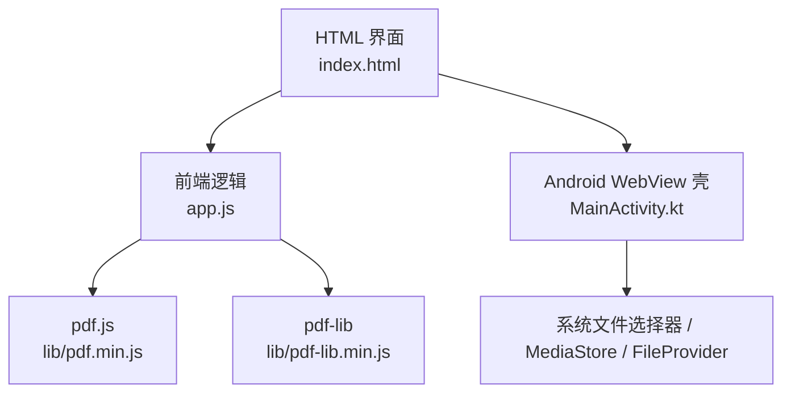
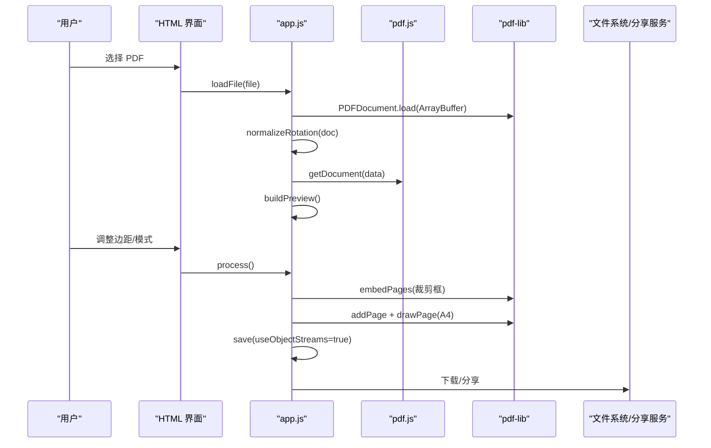
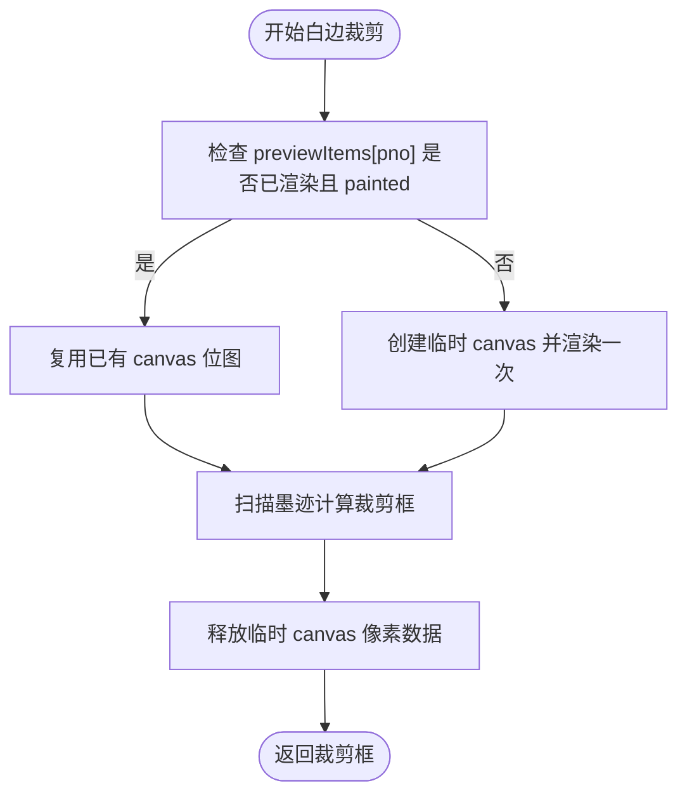
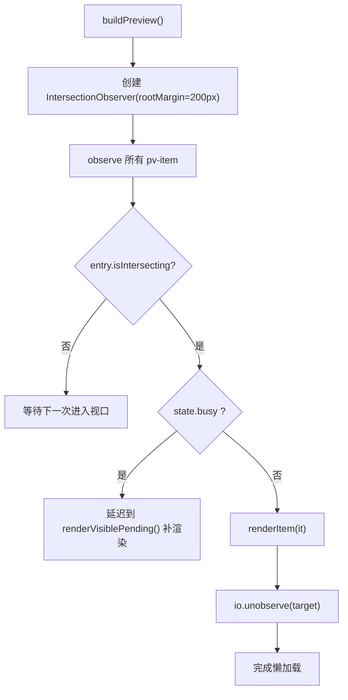
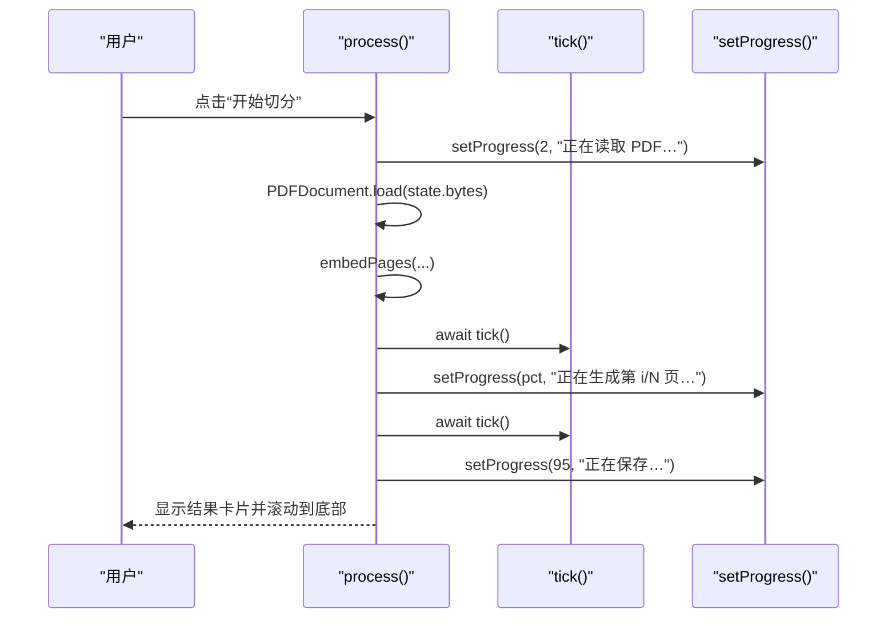
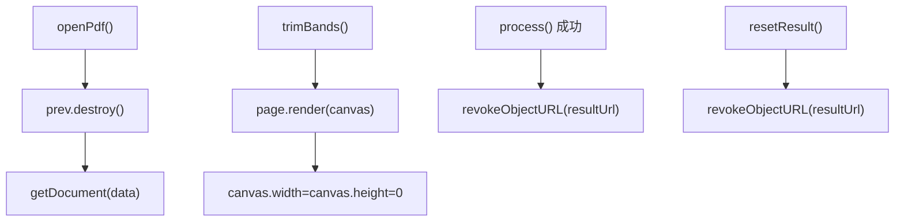
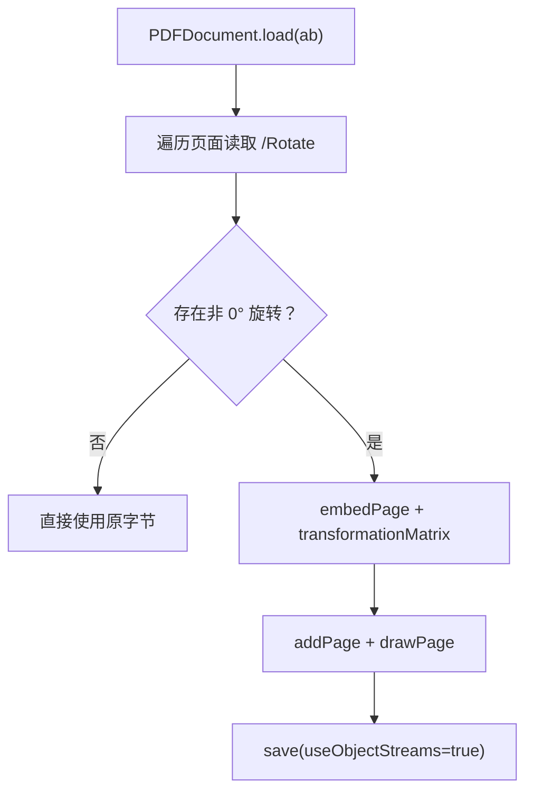
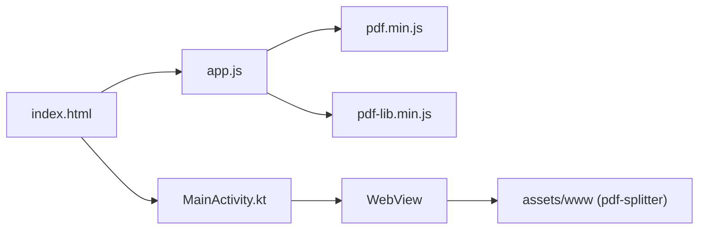

# 性能优化策略

<cite>
**本文引用的文件**   
- [README.md](file://README.md)
- [app.js](file://pdf-splitter/app.js)
- [index.html](file://pdf-splitter/index.html)
</cite>

## 目录
1. [引言](#引言)
2. [项目结构](#项目结构)
3. [核心组件](#核心组件)
4. [架构总览](#架构总览)
5. [详细组件分析](#详细组件分析)
6. [依赖关系分析](#依赖关系分析)
7. [性能考量](#性能考量)
8. [故障排查指南](#故障排查指南)
9. [结论](#结论)
10. [附录：移动端适配与监控建议](#附录移动端适配与监控建议)

## 引言
本技术文档围绕“试卷切分助手”的 PDF 处理性能优化策略展开，重点解释以下方面：
- 位图缓存机制：previewItems 数组管理、painted 状态标记、canvas 元素复用。
- IntersectionObserver 懒加载：可视区域检测、滚动优化、内存释放。
- 异步处理策略：Promise 链式调用、tick() 调度、进度反馈与用户体验优化。
- 内存管理最佳实践：大对象及时释放、canvas 清理、pdf.js 文档销毁。
- 性能监控与瓶颈分析方法。
- 移动端环境下的特殊优化考虑与适配策略。

该应用以 pdf.js 负责解析与预览渲染，以 pdf-lib 负责按栏裁剪并等比放入 A4 页面；Android WebView 壳仅承担文件选择、资源加载与结果保存/分享桥接，业务逻辑全部在网页端实现。

**章节来源**
- [README.md:1-22](file://README.md#L1-L22)

## 项目结构
本项目由三部分组成：
- Web 前端：pdf-splitter/index.html（结构与样式）、pdf-splitter/app.js（业务逻辑）。
- Android 原生壳：android/app/src/main/java/com/pdfsplitter/app/MainActivity.kt（WebView 桥接）。
- 本地库：pdf-splitter/lib/pdf.min.js、pdf-splitter/lib/pdf-lib.min.js。

**图表来源**
- [index.html:284-286](file://pdf-splitter/index.html#L284-L286)
- [app.js:6-10](file://pdf-splitter/app.js#L6-L10)
- [README.md:67-75](file://README.md#L67-L75)

**章节来源**
- [index.html:1-141](file://pdf-splitter/index.html#L1-L141)
- [app.js:1-55](file://pdf-splitter/app.js#L1-L55)
- [README.md:13-22](file://README.md#L13-L22)

## 核心组件
- 状态与工具：state 对象集中管理文件、字节流、pdf.js 文档、页面尺寸、边距、模式、busy 标志等；提供 fmtSize、detectCols、colsFor、tick 等工具函数。
- 旋转归一化：normalizeRotation 将 /Rotate 烘焙进内容，统一预览与裁剪坐标。
- 白边裁剪：scanInk/scanBands/trimsBands 通过栅格化扫描墨迹最小矩形，计算每栏裁剪框。
- 预览与懒加载：buildPreview/renderItem/updateOverlays 配合 IntersectionObserver 实现按需渲染。
- 切分流程：process 使用 Promise 链与 tick() 调度，逐步嵌入页面、缩放至 A4、生成结果。
- 下载与分享：shellUsable/shellTransfer 走原生通道，或浏览器下载/分享 API。

**章节来源**
- [app.js:13-55](file://pdf-splitter/app.js#L13-L55)
- [app.js:57-103](file://pdf-splitter/app.js#L57-L103)
- [app.js:105-193](file://pdf-splitter/app.js#L105-L193)
- [app.js:265-329](file://pdf-splitter/app.js#L265-L329)
- [app.js:412-508](file://pdf-splitter/app.js#L412-L508)
- [app.js:512-552](file://pdf-splitter/app.js#L512-L552)

## 架构总览
整体数据流如下：用户选择 PDF → 读取 ArrayBuffer → pdf-lib 加载并做旋转归一化 → pdf.js 打开文档 → 构建预览（懒加载）→ 用户调整参数 → 触发切分 → 逐页计算栏与裁剪框 → 嵌入到输出 PDF → 缩放至 A4 → 生成 Blob/ObjectURL → 下载/分享。

**图表来源**
- [app.js:204-239](file://pdf-splitter/app.js#L204-L239)
- [app.js:243-263](file://pdf-splitter/app.js#L243-L263)
- [app.js:265-329](file://pdf-splitter/app.js#L265-L329)
- [app.js:412-508](file://pdf-splitter/app.js#L412-L508)

## 详细组件分析

### 位图缓存与 Canvas 复用
- previewItems 数组：每个条目包含 DOM 节点、原始页面索引、尺寸、rendered/painted 标记。rendered 表示已发起渲染，painted 表示 canvas 位图真正可用。
- paintedPreview：当需要白边裁剪时，若对应页已渲染且 painted 为真，则直接复用其 canvas 位图，避免重复栅格化。
- canvas 复用：同一页不会被 pdf.js 栅格化两遍，显著降低大文件的处理时间。

**图表来源**
- [app.js:153-161](file://pdf-splitter/app.js#L153-L161)
- [app.js:164-193](file://pdf-splitter/app.js#L164-L193)

**章节来源**
- [app.js:153-193](file://pdf-splitter/app.js#L153-L193)

### IntersectionObserver 懒加载
- 构建预览时，为每个 pv-item 设置 IntersectionObserver，rootMargin 设为 200px，提前预取即将进入视口的页面。
- 当 state.busy 为真（切分进行中），IntersectionObserver 回调让路给切分任务，不立即渲染，避免抢占 pdf.js 队列。
- 处理结束后通过 renderVisiblePending 补渲染可见区域未渲染的项。
- 一旦某项被观察到且尚未渲染，调用 renderItem 渲染后 unobserve，减少观察器负担。

**图表来源**
- [app.js:288-314](file://pdf-splitter/app.js#L288-L314)
- [app.js:316-329](file://pdf-splitter/app.js#L316-L329)

**章节来源**
- [app.js:288-329](file://pdf-splitter/app.js#L288-L329)

### 异步处理与进度反馈
- Promise 链式调用：loadFile/openPdf/buildPreview/process 均基于 Promise 链，保证顺序执行与错误捕获。
- tick() 调度：在关键循环中插入 await tick()，把重任务拆成多个微任务，避免长时间阻塞主线程，提升滚动与交互流畅度。
- 进度反馈：setProgress/clearProgress 更新底部进度条与文案，让用户感知“正在读取 PDF”“正在检测白边 N/M 页”“正在生成第 i/N 页”“正在保存”。

**图表来源**
- [app.js:55-55](file://pdf-splitter/app.js#L55-L55)
- [app.js:403-410](file://pdf-splitter/app.js#L403-L410)
- [app.js:412-508](file://pdf-splitter/app.js#L412-L508)

**章节来源**
- [app.js:55-55](file://pdf-splitter/app.js#L55-L55)
- [app.js:403-410](file://pdf-splitter/app.js#L403-L410)
- [app.js:412-508](file://pdf-splitter/app.js#L412-L508)

### 内存管理与最佳实践
- pdf.js 文档销毁：openPdf 中先 prev.destroy() 再加载新文档，避免旧文档与 worker 长期驻留内存。
- 临时 canvas 清理：trimBands 中渲染完成后立即将 canvas.width/height 置 0，释放位图内存。
- 结果 URL 释放：resetResult 与 process 成功后对旧的 resultUrl 调用 URL.revokeObjectURL，防止 ObjectURL 泄漏。
- 大对象及时释放：resultBytes/resultUrl 在重置时清空；blob 仅在必要时保留。

**图表来源**
- [app.js:243-263](file://pdf-splitter/app.js#L243-L263)
- [app.js:182-192](file://pdf-splitter/app.js#L182-L192)
- [app.js:483-485](file://pdf-splitter/app.js#L483-L485)
- [app.js:554-564](file://pdf-splitter/app.js#L554-L564)

**章节来源**
- [app.js:243-263](file://pdf-splitter/app.js#L243-L263)
- [app.js:182-192](file://pdf-splitter/app.js#L182-L192)
- [app.js:483-485](file://pdf-splitter/app.js#L483-L485)
- [app.js:554-564](file://pdf-splitter/app.js#L554-L564)

### 旋转归一化与坐标一致性
- 由于 pdf.js viewport 会应用 /Rotate，而 pdf-lib getSize/embedPage 忽略它，因此必须先烘焙旋转，确保预览与裁剪在同一套显示坐标下。
- normalizeRotation 遍历页面，根据 Rotate 角度选择变换矩阵，写入新文档并移除 /Rotate，避免后续处理出现方向错乱。

**图表来源**
- [app.js:57-103](file://pdf-splitter/app.js#L57-L103)

**章节来源**
- [app.js:57-103](file://pdf-splitter/app.js#L57-L103)

## 依赖关系分析
- app.js 依赖 pdf.js 进行解析与预览渲染，依赖 pdf-lib 进行页面嵌入与输出。
- index.html 引入 pdf.min.js、pdf-lib.min.js 与 app.js，并提供 UI 与样式。
- Android MainActivity.kt 通过 WebViewAssetLoader 提供本地资源地址，解决 file:// 下 worker 加载失败问题，并通过 PdfShell 桥传递结果。

**图表来源**
- [index.html:284-286](file://pdf-splitter/index.html#L284-L286)
- [README.md:67-75](file://README.md#L67-L75)

**章节来源**
- [index.html:284-286](file://pdf-splitter/index.html#L284-L286)
- [README.md:67-75](file://README.md#L67-L75)

## 性能考量
- 位图缓存：通过 painted 标记与 previewItems 复用 canvas，避免重复栅格化，显著缩短大文件处理时间。
- 懒加载：IntersectionObserver 预取即将进入视口的页面，减少首屏渲染压力。
- 异步调度：tick() 拆分长任务，保持 UI 响应；进度反馈提升用户感知。
- 内存释放：及时销毁 pdf.js 文档、清理临时 canvas、撤销旧 ObjectURL，降低峰值内存占用。
- 白边裁剪：仅在启用时进行，且优先复用预览位图；未预览页仍需一次独立渲染，这是“处理会稍慢”的主要耗时点。

[本节为通用性能讨论，不直接分析具体代码行]

## 故障排查指南
- 无法打开加密 PDF：loadFile 中 catch 分支提示加密文件需先去除密码。
- 旋转异常：确认 normalizeRotation 是否正确烘焙旋转；若页面无 /Rotate，应跳过重存。
- 预览卡顿：检查 IntersectionObserver rootMargin 与 state.busy 让路逻辑；确认未在 busy 期间频繁触发 renderItem。
- 内存泄漏：确认 openPdf 中 prev.destroy() 是否执行；trimBands 中 canvas.width/height 是否置 0；resetResult 是否撤销旧 URL。
- 白边裁剪失败：scanBands 返回 null 的栏会退回整栏；检查 scanInk 阈值与 TRIM_PAD 设置。

**章节来源**
- [app.js:234-238](file://pdf-splitter/app.js#L234-L238)
- [app.js:82-103](file://pdf-splitter/app.js#L82-L103)
- [app.js:288-314](file://pdf-splitter/app.js#L288-L314)
- [app.js:243-263](file://pdf-splitter/app.js#L243-L263)
- [app.js:182-192](file://pdf-splitter/app.js#L182-L192)
- [app.js:164-193](file://pdf-splitter/app.js#L164-L193)

## 结论
该项目的性能优化围绕“少渲染、早释放、稳调度”三大原则展开：
- 通过 previewItems 与 painted 标记实现位图缓存，避免重复栅格化。
- 借助 IntersectionObserver 实现懒加载与可视区域检测，平衡首屏体验与内存占用。
- 使用 Promise 链与 tick() 调度，确保长任务不阻塞 UI，并通过进度反馈提升用户体验。
- 严格遵循内存管理最佳实践，及时释放 pdf.js 文档、canvas 像素数据与旧 ObjectURL。
这些策略共同保障了在手机与电脑上的稳定与流畅处理体验。

[本节为总结性内容，不直接分析具体代码行]

## 附录：移动端适配与监控建议
- 移动端适配要点：
  - WebViewAssetLoader 提供 https 资源地址，避免 file:// 下 pdf.js worker 加载失败。
  - 文件选择器通过 onShowFileChooser 接入系统选择器，保留原始文件名。
  - 结果保存与分享通过 PdfShell 桥走原生通道，避免浏览器限制。
  - 底部操作栏固定显示，便于拇指操作与进度查看。
- 性能监控建议：
  - 使用 Performance API 记录关键阶段耗时：loadFile、normalizeRotation、buildPreview、process、save。
  - 统计 IntersectionObserver 触发次数与 renderItem 调用次数，评估懒加载命中率。
  - 监控内存峰值与垃圾回收频率，关注 trimBands 中 canvas 释放效果。
  - 针对大文件场景，增加“正在检测白边 N/M 页”的进度粒度，提升用户感知。

**章节来源**
- [README.md:67-75](file://README.md#L67-L75)
- [index.html:126-134](file://pdf-splitter/index.html#L126-L134)
- [app.js:403-410](file://pdf-splitter/app.js#L403-L410)