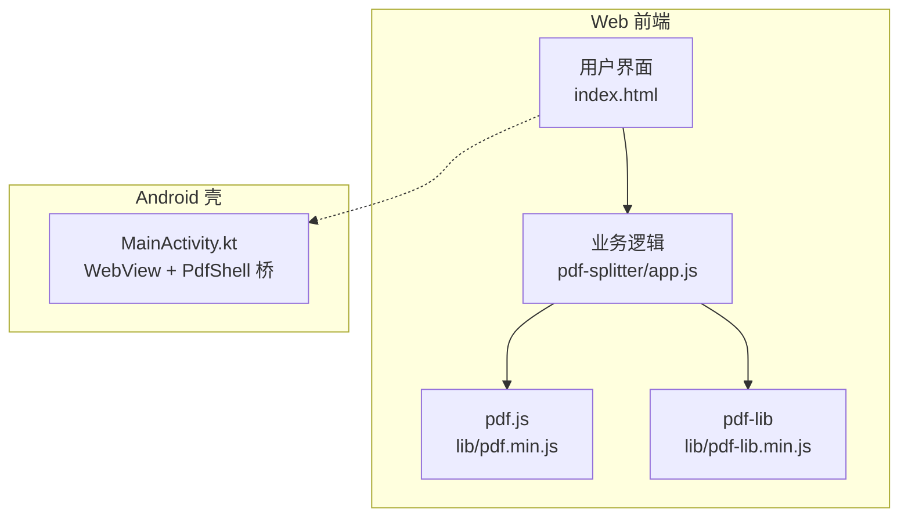
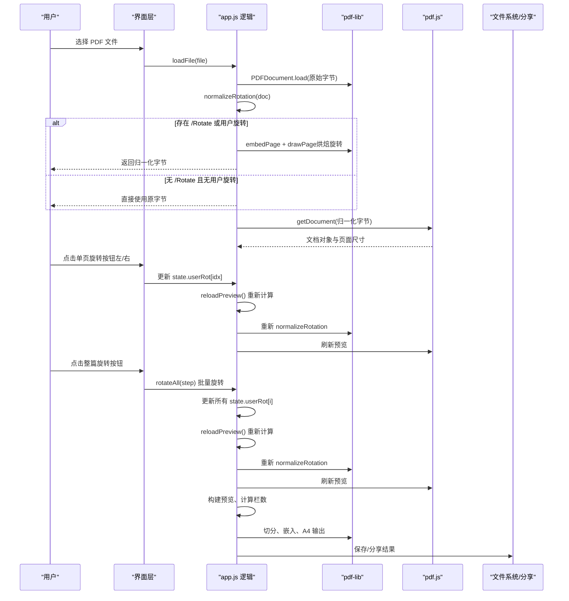
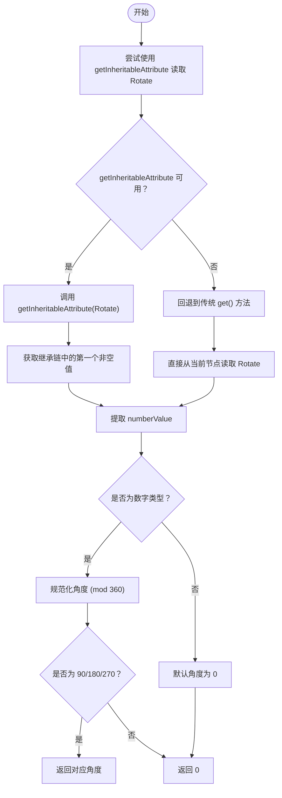
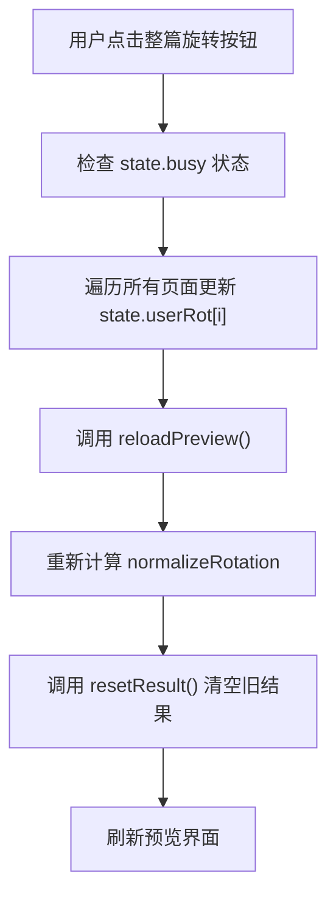
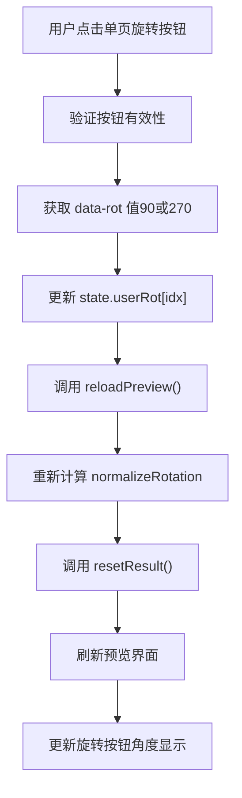
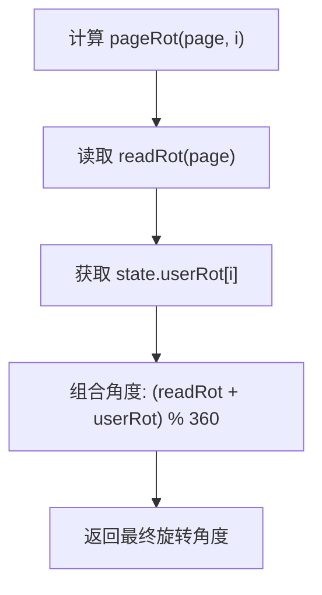
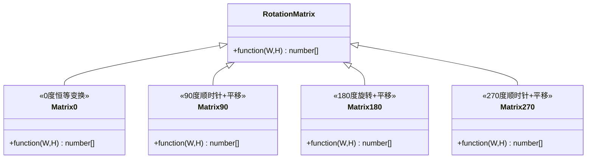
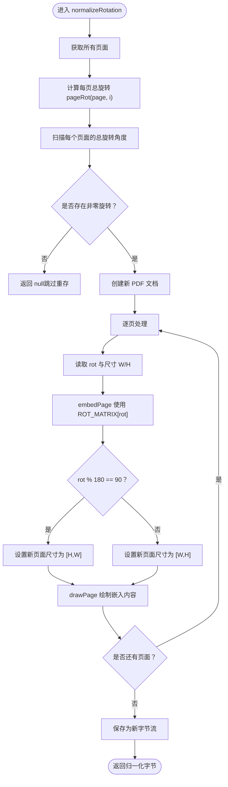
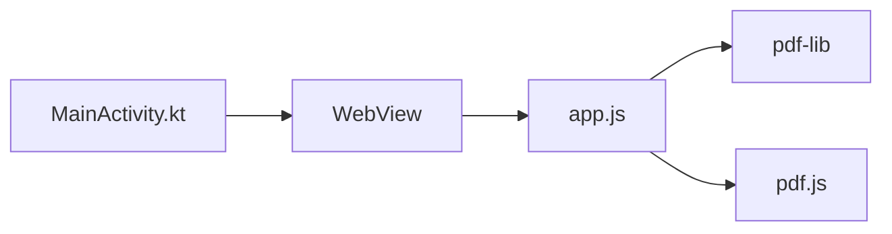

基于我对代码的分析，我现在了解了新增的批量旋转功能和改进的单页控制。让我更新旋转校正算法文档：

# 旋转校正算法

<cite>
**本文引用的文件**   
- [README.md](file://README.md)
- [app.js](file://pdf-splitter/app.js)
- [index.html](file://pdf-splitter/index.html)
</cite>

## 更新摘要
**变更内容**   
- **新增**批量旋转功能：添加了 `rotateAll` 函数用于整篇页面的批量旋转操作
- **增强**单页控制：从单个旋转按钮升级为双按钮系统（左旋/右旋），提供更直观的页面方向调整
- **移除**教学提示消息：移除了冗余的指导性提示，采用更直观的用户界面设计
- **优化**用户交互：每页现在都有独立的左旋和右旋按钮，支持精确的90°旋转控制
- **改进**批量操作：整篇旋转功能与单页旋转共享同一状态管理，支持混合操作模式

## 目录
1. [引言](#引言)
2. [项目结构](#项目结构)
3. [核心组件](#核心组件)
4. [架构总览](#架构总览)
5. [详细组件分析](#详细组件分析)
6. [依赖关系分析](#依赖关系分析)
7. [性能考量](#性能考量)
8. [故障排查指南](#故障排查指南)
9. [结论](#结论)
10. [附录：坐标与矩阵说明](#附录坐标与矩阵说明)

## 引言
本技术文档聚焦于"PDF 旋转校正算法"，围绕仓库中试卷切分助手的前端逻辑展开，重点解释以下内容：
- /Rotate 属性的读取机制，包括页面节点、父节点及祖先节点的完整继承链查找。
- **新增**批量旋转功能，允许用户通过整篇旋转按钮一次性调整所有页面方向。
- **增强**每页手动旋转功能，从单按钮升级为双按钮系统（⟳左/⟳右），提供更精确的控制。
- 四个旋转角度（0°、90°、180°、270°）对应的变换矩阵与坐标转换原理。
- **增强版** normalizeRotation 函数的完整流程：检测是否需要烘焙、嵌入页面、调整输出尺寸、移除 /Rotate，同时结合用户手动旋转。
- 为什么需要烘焙旋转属性，以及 pdf.js 与 pdf-lib 在坐标系处理上的差异。
- 旋转校正对后续预览、白边检测、栏数判断、裁剪与 A4 输出的影响。
- 提供可落地的代码片段路径，帮助读者快速定位实现位置。

该算法的核心目标是：让预览渲染与 PDF 内容切分在同一套显示坐标系下进行，避免因为 /Rotate 导致的方向不一致或横倒输出，同时为用户提供灵活的页面方向调整能力，包括批量操作和精确的单页控制。

## 项目结构
本项目是一个离线可用的 PWA 工具，Web 本体位于 pdf-splitter/，Android 壳工程位于 android/。Web 端使用 pdf.js 做解析与预览，使用 pdf-lib 做页面嵌入与输出。旋转校正发生在加载 PDF 之后、打开 pdf.js 文档之前，确保后续所有操作都基于归一化后的字节流。



图表来源
- [app.js:1-11](file://pdf-splitter/app.js#L1-L11)
- [README.md:13-23](file://README.md#L13-L23)

章节来源
- [README.md:13-23](file://README.md#L13-L23)
- [app.js:1-11](file://pdf-splitter/app.js#L1-L11)

## 核心组件
- 旋转矩阵 ROT_MATRIX：定义 0°、90°、180°、270° 的变换矩阵函数，用于将页面内容顺时针旋转到显示方向。
- readRot(page)：从页面节点或其祖先节点读取 /Rotate 值，通过 getInheritableAttribute() 方法支持完整的继承链遍历，规范化为 0/90/180/270。
- pageRot(page, i)：计算每页的总旋转角度，结合声明的 /Rotate 和用户手动旋转，使用公式 `(readRot(page) + state.userRot[i]) % 360`。
- state.userRot 数组：存储每页用户手动应用的旋转角度，初始化为空数组，随用户操作动态更新。
- **新增** rotateAll(step)：批量旋转函数，对所有页面的 userRot 进行统一旋转操作，支持整篇左旋/右旋。
- **增强版** normalizeRotation(doc)：遍历所有页面，若存在非零旋转则创建新文档，按矩阵嵌入并重绘页面，最后返回归一化字节；若无旋转直接返回 null，避免多余重存。
- **增强** 预览界面旋转按钮：每个预览页面现在有两个旋转按钮（左旋 ⟳ 和右旋 ⟳），点击后为该页增加或减少 90° 旋转。
- **新增** 整篇旋转按钮：在预览区域顶部添加整篇左旋和右旋按钮，支持批量操作。
- loadFile() 与 openPdf()：先通过 pdf-lib 加载并执行 normalizeRotation，再用归一化字节打开 pdf.js 文档，保证预览与切分坐标系一致。

章节来源
- [app.js:57-115](file://pdf-splitter/app.js#L57-L115)
- [app.js:216-241](file://pdf-splitter/app.js#L216-L241)
- [app.js:243-263](file://pdf-splitter/app.js#L243-L263)

## 架构总览
下图展示从文件选择到最终输出的关键流程，突出旋转校正的位置与作用，以及新增的批量旋转功能和增强的单页控制。



图表来源
- [app.js:216-241](file://pdf-splitter/app.js#L216-L241)
- [app.js:265-273](file://pdf-splitter/app.js#L265-L273)
- [app.js:243-263](file://pdf-splitter/app.js#L243-L263)
- [app.js:412-480](file://pdf-splitter/app.js#L412-L480)

## 详细组件分析

### /Rotate 读取机制：完整的继承链遍历

readRot 的实现遵循以下规则：
- 优先尝试使用 `page.node.getInheritableAttribute(PDFLib.PDFName.of('Rotate'))` 获取 /Rotate 属性。
- getInheritableAttribute() 会自动沿整个父链向上查找，找到第一个有值的节点，这是 PDF 标准中可继承属性的正确处理方式。
- 如果 getInheritableAttribute 不可用，回退到传统的 `page.node.get(PDFLib.PDFName.of('Rotate'))` 方法。
- 取到的值必须为数字类型才视为有效角度；否则默认 0。
- 对角度进行模 360 规范化，仅接受 90/180/270，其他值统一视为 0。

这种设计完全兼容 PDF 规范中的可继承属性机制，无论 /Rotate 定义在页面节点、父 Pages 节点还是更高层的祖先节点上，都能正确获取。



图表来源
- [app.js:69-82](file://pdf-splitter/app.js#L69-L82)

章节来源
- [app.js:69-82](file://pdf-splitter/app.js#L69-L82)

### 批量旋转功能：整篇页面的统一旋转操作

**新增** rotateAll 函数提供了整篇 PDF 文件的批量旋转能力，允许用户一次性调整所有页面的方向。

#### 核心实现
```javascript
function rotateAll(step) {
  if (state.busy) return;                       // 切分处理中不打断
  for (var i = 0; i < state.sizes.length; i++) {
    state.userRot[i] = ((state.userRot[i] || 0) + step) % 360;
  }
  reloadPreview().then(resetResult);
}
```

#### 功能特性
- **批量操作**：遍历所有页面，对每个页面的 userRot 应用相同的旋转步长
- **状态同步**：与单页旋转共享同一 state.userRot 数组，支持混合操作
- **防重复操作**：在 busy 状态下阻止新的批量旋转请求
- **自动刷新**：旋转完成后自动触发预览重建和结果重置

#### 用户界面
- **整篇左旋按钮**：id="btn-rot-all-left"，调用 rotateAll(270) 实现逆时针90°旋转
- **整篇右旋按钮**：id="btn-rot-all-right"，调用 rotateAll(90) 实现顺时针90°旋转
- **视觉反馈**：按钮带有旋转图标和明确的文字标签



图表来源
- [app.js:231-241](file://pdf-splitter/app.js#L231-L241)
- [index.html:238-245](file://pdf-splitter/index.html#L238-L245)

章节来源
- [app.js:231-241](file://pdf-splitter/app.js#L231-L241)
- [index.html:238-245](file://pdf-splitter/index.html#L238-L245)

### 增强的单页旋转控制：双按钮系统设计

**增强** 每页旋转控制从单一按钮升级为双按钮系统，提供更精确和直观的页面方向调整能力。

#### 界面设计
- **左旋按钮**（pv-rot-l）：位于页面左上角，data-rot="270"，实现逆时针90°旋转
- **右旋按钮**（pv-rot-r）：位于页面右上角，data-rot="90"，实现顺时针90°旋转
- **角度标签**：每个按钮旁边显示当前页面的用户旋转角度（0°、90°、180°、270°）
- **视觉反馈**：按钮采用圆形设计，带有旋转箭头图标，悬停时显示浅蓝色背景

#### 交互逻辑
```javascript
pvGrid.addEventListener('click', function (e) {
  var btn = e.target.closest('.pv-rot');
  if (!btn) return;
  if (state.busy) return;                       // 切分处理中不打断
  var item = btn.closest('.pv-item');
  var idx = item && parseInt(item.getAttribute('data-idx'), 10);
  if (isNaN(idx)) return;
  var step = parseInt(btn.getAttribute('data-rot'), 10);
  if (step !== 90 && step !== 270) step = 90;   // 只认 ±90（270 即逆时针 90）
  state.userRot[idx] = ((state.userRot[idx] || 0) + step) % 360;
  // 旋转会改变页面尺寸/栏数，需重算字节并作废旧结果
  reloadPreview().then(resetResult);
});
```

#### 用户体验改进
- **精确控制**：用户可以分别控制左旋和右旋，无需多次点击同一按钮
- **即时反馈**：每次旋转后立即更新预览和角度标签显示
- **状态一致性**：与批量旋转共享状态，支持灵活的操作组合
- **无障碍支持**：包含 aria-label 属性，提升可访问性



图表来源
- [app.js:216-229](file://pdf-splitter/app.js#L216-L229)
- [index.html:324-338](file://pdf-splitter/index.html#L324-L338)

章节来源
- [app.js:216-229](file://pdf-splitter/app.js#L216-L229)
- [index.html:324-338](file://pdf-splitter/index.html#L324-L338)

### 增强的 pageRot 函数：结合声明与用户旋转

pageRot 函数实现了旋转角度的组合计算，将 PDF 声明的 /Rotate 值与用户手动旋转相结合。

计算公式：`pageRot(page, i) = (readRot(page) + state.userRot[i]) % 360`

这个函数确保了：
- 用户的旋转操作会叠加到 PDF 原有的旋转角度上。
- 最终角度始终保持在 0-359° 范围内。
- 当没有用户旋转时，退回到原始的 readRot 行为。



图表来源
- [app.js:84-87](file://pdf-splitter/app.js#L84-L87)

章节来源
- [app.js:84-87](file://pdf-splitter/app.js#L84-L87)

### 四个旋转矩阵的原理与坐标变换
ROT_MATRIX 定义了四种角度的变换矩阵函数，参数为页面宽高 W、H，返回一个长度为 6 的数组，表示仿射变换矩阵 [a, b, c, d, e, f]。这些矩阵把页面内容顺时针旋转到显示方向，并与 pdf-lib 的 embedPage 接口配合使用。

- 0°：恒等变换，不改变坐标。
- 90°：绕原点顺时针旋转 90°，并进行平移以对齐左上角。
- 180°：绕原点旋转 180°，并平移到右下角。
- 270°：绕原点顺时针旋转 270°，并平移到右上角。

这些矩阵已在文本坐标下逐一实测核对，确保预览与切分方向一致。



图表来源
- [app.js:62-67](file://pdf-splitter/app.js#L62-L67)

章节来源
- [app.js:57-67](file://pdf-splitter/app.js#L57-L67)

### 增强版 normalizeRotation 函数的实现流程
normalizeRotation 的职责是"烘焙"旋转属性，使后续预览与切分都在同一坐标系中进行。其流程如下：
- 遍历所有页面，使用 `pageRot(page, i)` 函数计算每页的总旋转角度。
- 检查是否存在非零旋转（包括声明的 /Rotate 和用户手动旋转）。
- 如果没有页面带旋转，直接返回 null，调用方直接使用原字节，避免多余重存。
- 如果有页面带旋转，创建一个新 PDF 文档，逐页：
  - 读取旋转角度 rot（已包含用户旋转）。
  - 获取页面尺寸 W、H。
  - 使用 ROT_MATRIX[rot](W, H) 作为变换矩阵，embedPage 将页面内容嵌入到新文档。
  - 根据 rot 决定新页面尺寸：当 rot % 180 === 90 时交换宽高，否则保持原宽高。
  - 在新页面中 drawPage 绘制嵌入的内容。
- 最后保存为新字节流，供后续 pdf.js 预览与 pdf-lib 切分共用。



图表来源
- [app.js:84-115](file://pdf-splitter/app.js#L84-L115)

章节来源
- [app.js:84-115](file://pdf-splitter/app.js#L84-L115)

### 为什么需要烘焙旋转属性：pdf.js 与 pdf-lib 的坐标系差异
- pdf.js 的 viewport 会自动应用 /Rotate，因此预览时页面会按显示方向渲染。
- pdf-lib 的 getSize()/embedPage() 完全忽略 /Rotate，它只关心页面几何尺寸与内容嵌入。
- 如果不烘焙旋转，预览与切分会使用两套不同的坐标系，导致：
  - 预览方向正确但输出横倒。
  - 栏数判断错误（例如横向 A3 被误判为两栏）。
  - 白边检测与裁剪框错位。
- 烘焙后，/Rotate 被"写进"内容的变换矩阵，页面不再携带 /Rotate，预览与切分均基于显示坐标，输出方向与源文件显示一致。

章节来源
- [README.md:77-80](file://README.md#L77-L80)
- [app.js:57-60](file://pdf-splitter/app.js#L57-L60)

### 代码示例与片段路径
- 旋转矩阵定义与读取逻辑（包含继承属性处理）：
  - [app.js:62-82](file://pdf-splitter/app.js#L62-L82)
- 每页旋转计算函数：
  - [app.js:84-87](file://pdf-splitter/app.js#L84-L87)
- **新增** 批量旋转函数：
  - [app.js:231-241](file://pdf-splitter/app.js#L231-L241)
- **增强** 单页旋转事件处理：
  - [app.js:216-229](file://pdf-splitter/app.js#L216-L229)
- **增强版** 归一化流程与嵌入绘制：
  - [app.js:88-115](file://pdf-splitter/app.js#L88-L115)
- 用户旋转状态管理：
  - [app.js:13-29](file://pdf-splitter/app.js#L13-L29)
- 加载文件并触发归一化：
  - [app.js:229-259](file://pdf-splitter/app.js#L229-L259)
- 重新加载预览逻辑：
  - [app.js:265-273](file://pdf-splitter/app.js#L265-L273)
- 打开 pdf.js 文档并使用归一化字节：
  - [app.js:275-295](file://pdf-splitter/app.js#L275-L295)
- **新增** 整篇旋转按钮HTML结构：
  - [index.html:238-245](file://pdf-splitter/index.html#L238-L245)
- **增强** 单页旋转按钮HTML结构：
  - [index.html:324-338](file://pdf-splitter/index.html#L324-L338)
- 切分与 A4 输出（依赖已烘焙的坐标系）：
  - [app.js:451-547](file://pdf-splitter/app.js#L451-L547)

## 依赖关系分析
- app.js 依赖 pdf-lib 进行 PDF 文档加载、页面嵌入与输出。
- app.js 依赖 pdf.js 进行解析与预览。
- Android 壳 MainActivity.kt 负责 WebView 资源加载、文件选择桥接与结果保存/分享，但不参与旋转校正逻辑。



图表来源
- [app.js:1-11](file://pdf-splitter/app.js#L1-L11)
- [README.md:67-76](file://README.md#L67-L76)

章节来源
- [app.js:1-11](file://pdf-splitter/app.js#L1-L11)
- [README.md:67-76](file://README.md#L67-L76)

## 性能考量
- 烘焙旋转仅在检测到非零 /Rotate 或用户旋转时执行；若无旋转直接复用原字节，避免额外 I/O。
- 逐页嵌入与绘制采用链式 Promise，避免一次性内存峰值过高。
- 预览位图复用机制减少重复栅格化，提升整体性能。
- **新增** 批量旋转操作会遍历所有页面更新状态，但不会立即触发重计算，只在 reloadPreview 时统一处理。
- **增强** 单页旋转操作会触发完整的预览重建，频繁旋转可能影响性能。
- 大文件（几百页扫描件）一次性嵌入会导致内存峰值偏高，这是已知限制。

章节来源
- [README.md:88-90](file://README.md#L88-L90)
- [app.js:88-115](file://pdf-splitter/app.js#L88-L115)

## 故障排查指南
- 无法打开加密 PDF：
  - 现象：提示加密文件需先去除密码。
  - 原因：load 时 ignoreEncryption=true，但仍可能因加密结构异常失败。
  - 建议：先用工具去除密码后再处理。
- 旋转方向不正确：
  - 检查 /Rotate 是否在祖先节点定义，readRot 现已支持完整的继承链遍历。
  - 确认 getInheritableAttribute() 方法可用，如不可用会回退到传统方法。
  - 确认 ROT_MATRIX 与 embedPage 的变换矩阵一致。
  - 检查用户旋转是否正确应用，查看 state.userRot 数组的值。
- 预览与切分不一致：
  - 确认 normalizeRotation 已执行，state.bytes 为归一化字节。
  - 检查 openPdf 是否使用 state.bytes 而非原始 ab。
  - 确认用户旋转操作后调用了 reloadPreview() 重新计算。
- 继承属性相关问题：
  - 某些 PDF 生成器可能将 /Rotate 定义在多层祖先节点上。
  - getInheritableAttribute() 会自动处理这种情况，无需手动遍历父链。
  - 如遇问题，检查 PDF 文件的节点层次结构是否正确。
- **新增** 批量旋转无效：
  - 检查 rotateAll 函数是否正确绑定事件监听器。
  - 确认 state.busy 标志未阻止批量旋转操作。
  - 验证所有页面的 state.userRot 数组索引是否正确更新。
- **增强** 单页旋转按钮无效：
  - 检查按钮事件监听器是否正确绑定。
  - 确认 state.busy 标志未阻止旋转操作。
  - 验证页面索引 idx 是否正确获取。
  - 检查 data-rot 属性值是否为 90 或 270。

章节来源
- [app.js:229-259](file://pdf-splitter/app.js#L229-L259)
- [app.js:265-273](file://pdf-splitter/app.js#L265-L273)
- [app.js:69-82](file://pdf-splitter/app.js#L69-L82)
- [app.js:216-241](file://pdf-splitter/app.js#L216-L241)

## 结论
旋转校正是试卷切分助手的关键前置步骤。通过读取 /Rotate、应用正确的旋转矩阵、烘焙到内容并移除 /Rotate，系统确保了 pdf.js 预览与 pdf-lib 切分在同一显示坐标系下进行。这避免了输出横倒、栏数误判与白边检测错位等问题，提升了切分质量与用户体验。

**重要改进**：新的 getInheritableAttribute() 方法实现了完整的 PDF 旋转继承链遍历，修复了之前只检查一级父节点的严重缺陷。现在无论 /Rotate 定义在页面节点、父 Pages 节点还是更深层的祖先节点上，都能正确识别和处理，大大提升了算法的健壮性和兼容性。

**全新功能**：批量旋转功能为用户提供了高效的整篇页面方向调整能力。通过新增的整篇左旋和右旋按钮，用户可以一次性调整所有页面的方向，大大提高了处理效率。`rotateAll` 函数与现有的单页旋转功能共享同一状态管理机制，支持灵活的混合操作模式。

**显著增强**：每页手动旋转功能从单一按钮升级为双按钮系统（左旋/右旋），为用户提供更精确和直观的页面方向调整能力。新的界面设计不仅提升了用户体验，还保持了与批量旋转功能的无缝集成。`state.userRot` 数组和增强的 `pageRot` 函数实现了声明旋转与用户旋转的无缝结合，让用户能够在切分前精确控制每页的最终方向。

对于没有旋转的文件，系统会跳过重存，保持高效处理。新增的批量旋转功能和增强的单页控制进一步增强了系统的易用性和准确性，让用户能够处理各种复杂的旋转场景，无论是批量调整还是精细微调都能轻松应对。

## 附录：坐标与矩阵说明
- 坐标系约定：
  - pdf.js 的 viewport 以显示方向为准，自动应用 /Rotate。
  - pdf-lib 的 embedPage/drawPage 以页面几何为准，忽略 /Rotate。
- 矩阵含义：
  - 0°：[1,0,0,1,0,0] 恒等变换。
  - 90°：[0,-1,1,0,0,W] 顺时针旋转并平移至左上角。
  - 180°：[-1,0,0,-1,W,H] 旋转并平移至右下角。
  - 270°：[0,1,-1,0,H,0] 顺时针旋转并平移至右上角。
- 尺寸调整：
  - 当 rot % 180 === 90 时，新页面宽高交换为 [H,W]，否则保持 [W,H]。
- 继承属性处理：
  - getInheritableAttribute() 是 PDF 标准中可继承属性的正确访问方式。
  - 该方法会自动沿父链向上查找，找到第一个非空的属性值。
  - 提供了向后兼容性，当方法不可用时回退到传统的 get() 方法。
- 用户旋转处理：
  - state.userRot 数组存储每页的用户旋转角度。
  - pageRot 函数结合声明旋转和用户旋转：`(readRot(page) + state.userRot[i]) % 360`。
  - 用户旋转操作会触发完整的预览重建，确保坐标系一致性。
- **新增** 批量旋转处理：
  - rotateAll 函数遍历所有页面，统一应用旋转操作。
  - 支持整篇左旋（+270°）和右旋（+90°）两种操作模式。
  - 与单页旋转共享状态管理，支持混合操作。
- **增强** 单页旋转处理：
  - 双按钮系统提供精确的左旋（270°）和右旋（90°）控制。
  - 每个按钮都有明确的功能标识和视觉反馈。
  - 实时更新角度标签显示，提供即时操作反馈。

章节来源
- [app.js:62-67](file://pdf-splitter/app.js#L62-L67)
- [app.js:69-82](file://pdf-splitter/app.js#L69-L82)
- [app.js:84-87](file://pdf-splitter/app.js#L84-L87)
- [app.js:88-115](file://pdf-splitter/app.js#L88-L115)
- [app.js:216-241](file://pdf-splitter/app.js#L216-L241)