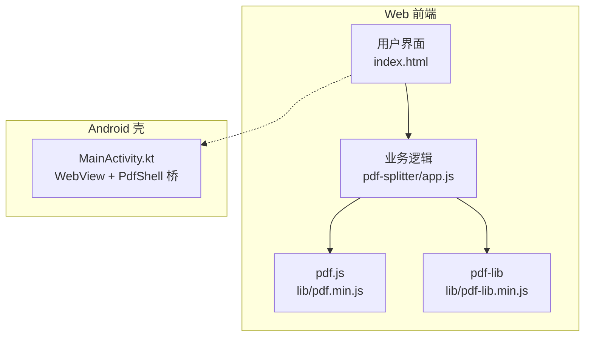
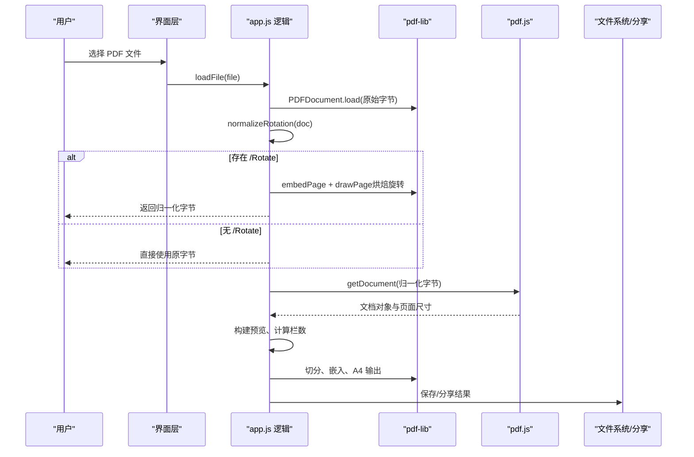
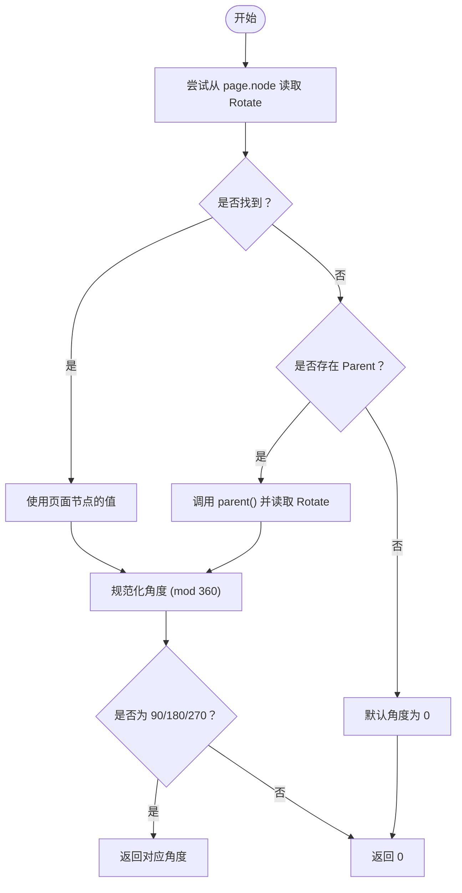
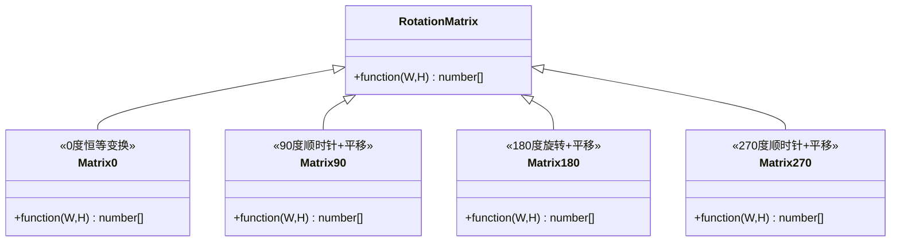
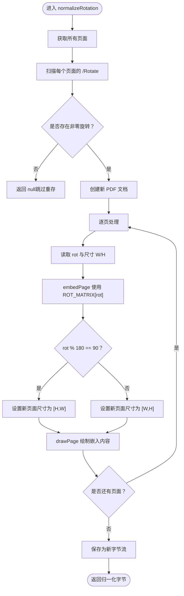
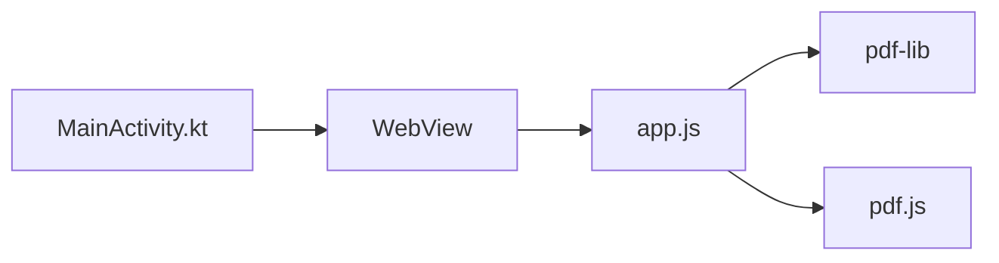

# 旋转校正算法

<cite>
**本文引用的文件**   
- [README.md](file://README.md)
- [app.js](file://pdf-splitter/app.js)
</cite>

## 目录
1. [引言](#引言)
2. [项目结构](#项目结构)
3. [核心组件](#核心组件)
4. [架构总览](#架构总览)
5. [详细组件分析](#详细组件分析)
6. [依赖关系分析](#依赖关系分析)
7. [性能考量](#性能考量)
8. [故障排查指南](#故障排查指南)
9. [结论](#结论)
10. [附录：坐标与矩阵说明](#附录坐标与矩阵说明)

## 引言
本技术文档聚焦于“PDF 旋转校正算法”，围绕仓库中试卷切分助手的前端逻辑展开，重点解释以下内容：
- /Rotate 属性的读取机制，包括页面节点与父节点的查找顺序。
- 四个旋转角度（0°、90°、180°、270°）对应的变换矩阵与坐标转换原理。
- normalizeRotation 函数的完整流程：检测是否需要烘焙、嵌入页面、调整输出尺寸、移除 /Rotate。
- 为什么需要烘焙旋转属性，以及 pdf.js 与 pdf-lib 在坐标系处理上的差异。
- 旋转校正对后续预览、白边检测、栏数判断、裁剪与 A4 输出的影响。
- 提供可落地的代码片段路径，帮助读者快速定位实现位置。

该算法的核心目标是：让预览渲染与 PDF 内容切分在同一套显示坐标系下进行，避免因为 /Rotate 导致的方向不一致或横倒输出。

## 项目结构
本项目是一个离线可用的 PWA 工具，Web 本体位于 pdf-splitter/，Android 壳工程位于 android/。Web 端使用 pdf.js 做解析与预览，使用 pdf-lib 做页面嵌入与输出。旋转校正发生在加载 PDF 之后、打开 pdf.js 文档之前，确保后续所有操作都基于归一化后的字节流。

图表来源
- [app.js:1-11](file://pdf-splitter/app.js#L1-L11)
- [README.md:13-23](file://README.md#L13-L23)

章节来源
- [README.md:13-23](file://README.md#L13-L23)
- [app.js:1-11](file://pdf-splitter/app.js#L1-L11)

## 核心组件
- 旋转矩阵 ROT_MATRIX：定义 0°、90°、180°、270° 的变换矩阵函数，用于将页面内容顺时针旋转到显示方向。
- readRot(page)：从页面节点或其父节点读取 /Rotate 值，规范化为 0/90/180/270。
- normalizeRotation(doc)：遍历所有页面，若存在非零旋转则创建新文档，按矩阵嵌入并重绘页面，最后返回归一化字节；若无旋转直接返回 null，避免多余重存。
- loadFile() 与 openPdf()：先通过 pdf-lib 加载并执行 normalizeRotation，再用归一化字节打开 pdf.js 文档，保证预览与切分坐标系一致。

章节来源
- [app.js:57-103](file://pdf-splitter/app.js#L57-L103)
- [app.js:204-239](file://pdf-splitter/app.js#L204-L239)
- [app.js:243-263](file://pdf-splitter/app.js#L243-L263)

## 架构总览
下图展示从文件选择到最终输出的关键流程，突出旋转校正的位置与作用。

图表来源
- [app.js:204-239](file://pdf-splitter/app.js#L204-L239)
- [app.js:243-263](file://pdf-splitter/app.js#L243-L263)
- [app.js:412-480](file://pdf-splitter/app.js#L412-L480)

## 详细组件分析

### /Rotate 读取机制：页面节点与父节点
readRot 的实现遵循以下规则：
- 优先从当前页面的 node 上读取 Rotate 键。
- 如果未找到且存在 Parent，则调用 parent() 获取父节点，再从父节点读取 Rotate。
- 取到的值必须为数字类型才视为有效角度；否则默认 0。
- 对角度进行模 360 规范化，仅接受 90/180/270，其他值统一视为 0。

这种设计兼容某些 PDF 中 /Rotate 可能定义在父级节点的情况，同时避免非法角度导致的异常。

图表来源
- [app.js:68-80](file://pdf-splitter/app.js#L68-L80)

章节来源
- [app.js:68-80](file://pdf-splitter/app.js#L68-L80)

### 四个旋转矩阵的原理与坐标变换
ROT_MATRIX 定义了四种角度的变换矩阵函数，参数为页面宽高 W、H，返回一个长度为 6 的数组，表示仿射变换矩阵 [a, b, c, d, e, f]。这些矩阵把页面内容顺时针旋转到显示方向，并与 pdf-lib 的 embedPage 接口配合使用。

- 0°：恒等变换，不改变坐标。
- 90°：绕原点顺时针旋转 90°，并进行平移以对齐左上角。
- 180°：绕原点旋转 180°，并平移到右下角。
- 270°：绕原点顺时针旋转 270°，并平移到右上角。

这些矩阵已在文本坐标下逐一实测核对，确保预览与切分方向一致。

图表来源
- [app.js:61-66](file://pdf-splitter/app.js#L61-L66)

章节来源
- [app.js:57-66](file://pdf-splitter/app.js#L57-L66)

### normalizeRotation 函数的实现流程
normalizeRotation 的职责是“烘焙”旋转属性，使后续预览与切分都在同一坐标系中进行。其流程如下：
- 遍历所有页面，检查是否存在非零 /Rotate。
- 如果没有页面带旋转，直接返回 null，调用方直接使用原字节，避免多余重存。
- 如果有页面带旋转，创建一个新 PDF 文档，逐页：
  - 读取旋转角度 rot。
  - 获取页面尺寸 W、H。
  - 使用 ROT_MATRIX[rot](W, H) 作为变换矩阵，embedPage 将页面内容嵌入到新文档。
  - 根据 rot 决定新页面尺寸：当 rot % 180 === 90 时交换宽高，否则保持原宽高。
  - 在新页面中 drawPage 绘制嵌入的内容。
- 最后保存为新字节流，供后续 pdf.js 预览与 pdf-lib 切分共用。

图表来源
- [app.js:82-103](file://pdf-splitter/app.js#L82-L103)

章节来源
- [app.js:82-103](file://pdf-splitter/app.js#L82-L103)

### 为什么需要烘焙旋转属性：pdf.js 与 pdf-lib 的坐标系差异
- pdf.js 的 viewport 会自动应用 /Rotate，因此预览时页面会按显示方向渲染。
- pdf-lib 的 getSize()/embedPage() 完全忽略 /Rotate，它只关心页面几何尺寸与内容嵌入。
- 如果不烘焙旋转，预览与切分会使用两套不同的坐标系，导致：
  - 预览方向正确但输出横倒。
  - 栏数判断错误（例如横向 A3 被误判为两栏）。
  - 白边检测与裁剪框错位。
- 烘焙后，/Rotate 被“写进”内容的变换矩阵，页面不再携带 /Rotate，预览与切分均基于显示坐标，输出方向与源文件显示一致。

章节来源
- [README.md:77-80](file://README.md#L77-L80)
- [app.js:57-60](file://pdf-splitter/app.js#L57-L60)

### 代码示例与片段路径
- 旋转矩阵定义与读取逻辑：
  - [app.js:61-80](file://pdf-splitter/app.js#L61-L80)
- 归一化流程与嵌入绘制：
  - [app.js:82-103](file://pdf-splitter/app.js#L82-L103)
- 加载文件并触发归一化：
  - [app.js:204-239](file://pdf-splitter/app.js#L204-L239)
- 打开 pdf.js 文档并使用归一化字节：
  - [app.js:243-263](file://pdf-splitter/app.js#L243-L263)
- 切分与 A4 输出（依赖已烘焙的坐标系）：
  - [app.js:412-480](file://pdf-splitter/app.js#L412-L480)

## 依赖关系分析
- app.js 依赖 pdf-lib 进行 PDF 文档加载、页面嵌入与输出。
- app.js 依赖 pdf.js 进行解析与预览。
- Android 壳 MainActivity.kt 负责 WebView 资源加载、文件选择桥接与结果保存/分享，但不参与旋转校正逻辑。

图表来源
- [app.js:1-11](file://pdf-splitter/app.js#L1-L11)
- [README.md:67-76](file://README.md#L67-L76)

章节来源
- [app.js:1-11](file://pdf-splitter/app.js#L1-L11)
- [README.md:67-76](file://README.md#L67-L76)

## 性能考量
- 烘焙旋转仅在检测到非零 /Rotate 时执行；若无旋转直接复用原字节，避免额外 I/O。
- 逐页嵌入与绘制采用链式 Promise，避免一次性内存峰值过高。
- 预览位图复用机制减少重复栅格化，提升整体性能。
- 大文件（几百页扫描件）一次性嵌入会导致内存峰值偏高，这是已知限制。

章节来源
- [README.md:88-90](file://README.md#L88-L90)
- [app.js:82-103](file://pdf-splitter/app.js#L82-L103)

## 故障排查指南
- 无法打开加密 PDF：
  - 现象：提示加密文件需先去除密码。
  - 原因：load 时 ignoreEncryption=true，但仍可能因加密结构异常失败。
  - 建议：先用工具去除密码后再处理。
- 旋转方向不正确：
  - 检查 /Rotate 是否在父节点定义，readRot 已支持父节点读取。
  - 确认 ROT_MATRIX 与 embedPage 的变换矩阵一致。
- 预览与切分不一致：
  - 确认 normalizeRotation 已执行，state.bytes 为归一化字节。
  - 检查 openPdf 是否使用 state.bytes 而非原始 ab。

章节来源
- [app.js:204-239](file://pdf-splitter/app.js#L204-L239)
- [app.js:243-263](file://pdf-splitter/app.js#L243-L263)
- [app.js:68-80](file://pdf-splitter/app.js#L68-L80)

## 结论
旋转校正是试卷切分助手的关键前置步骤。通过读取 /Rotate、应用正确的旋转矩阵、烘焙到内容并移除 /Rotate，系统确保了 pdf.js 预览与 pdf-lib 切分在同一显示坐标系下进行。这避免了输出横倒、栏数误判与白边检测错位等问题，提升了切分质量与用户体验。对于没有旋转的文件，系统会跳过重存，保持高效处理。

## 附录：坐标与矩阵说明
- 坐标系约定：
  - pdf.js 的 viewport 以显示方向为准，自动应用 /Rotate。
  - pdf-lib 的 embedPage/drawPage 以页面几何为准，忽略 /Rotate。
- 矩阵含义：
  - 0°：[1,0,0,1,0,0] 恒等变换。
  - 90°：[0,-1,1,0,0,W] 顺时针旋转并平移至左上角。
  - 180°：[-1,0,0,-1,W,H] 旋转并平移至右下角。
  - 270°：[0,1,-1,0,H,0] 顺时针旋转并平移至右上角。
- 尺寸调整：
  - 当 rot % 180 === 90 时，新页面宽高交换为 [H,W]，否则保持 [W,H]。

章节来源
- [app.js:61-66](file://pdf-splitter/app.js#L61-L66)
- [app.js:95-99](file://pdf-splitter/app.js#L95-L99)