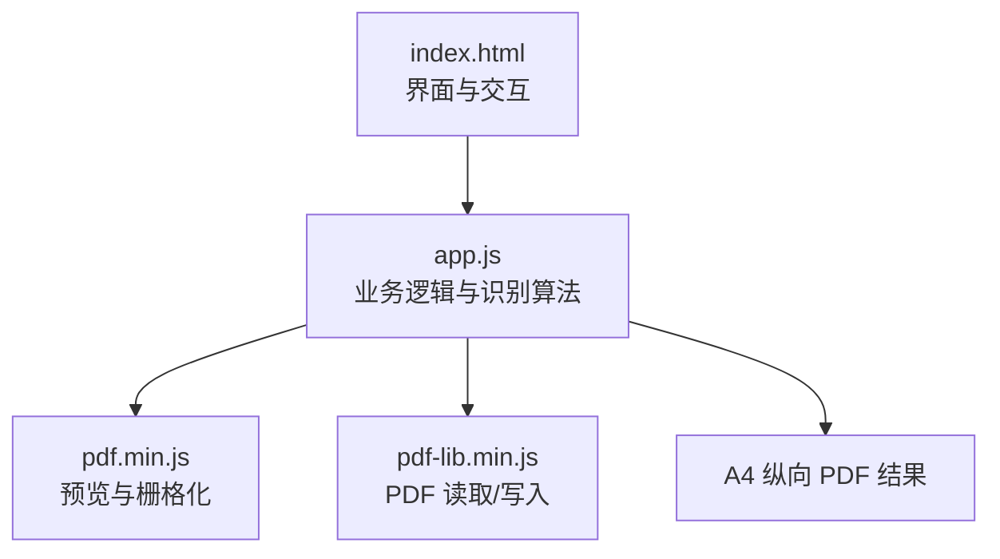
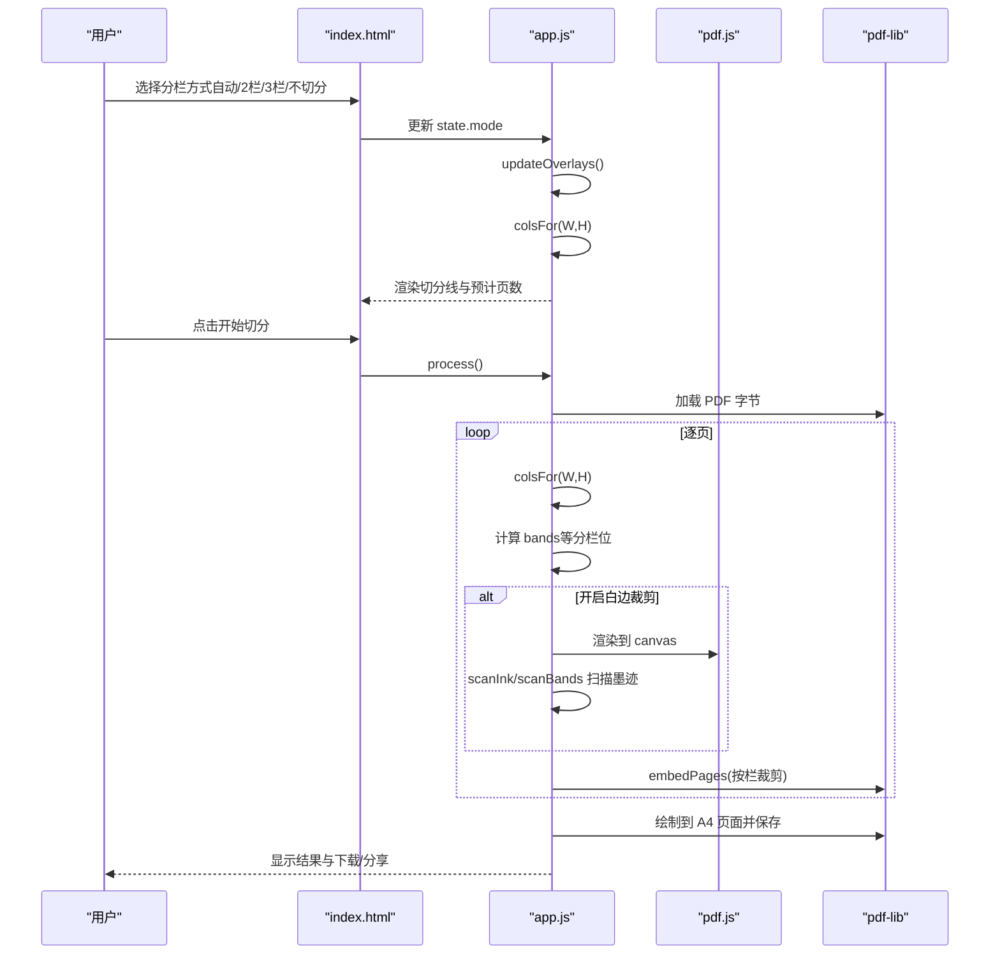
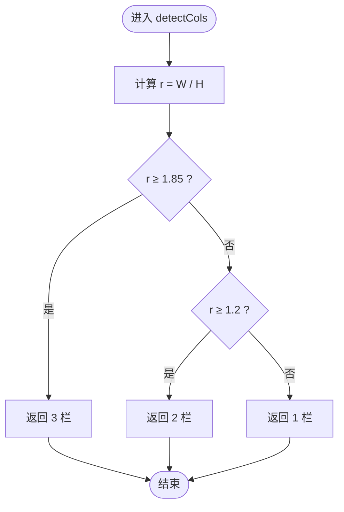
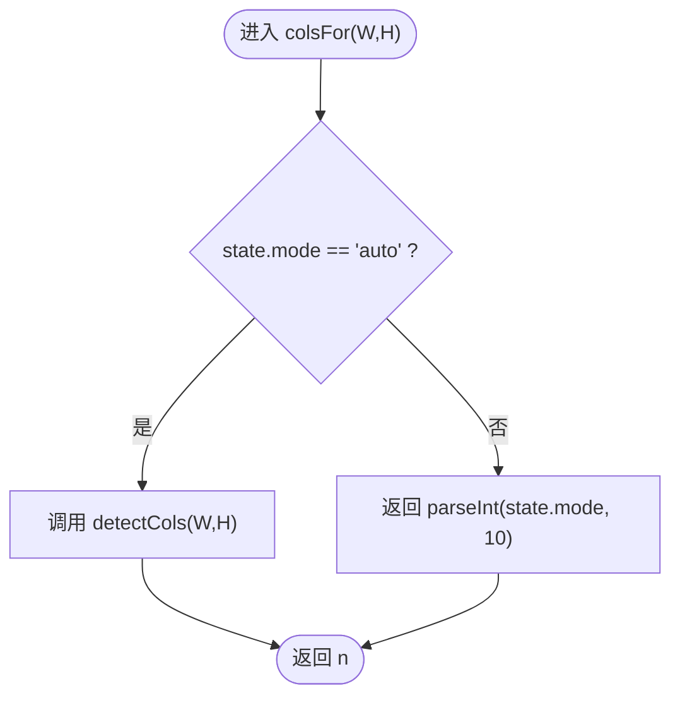
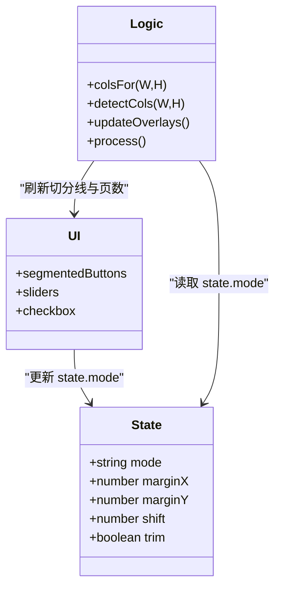
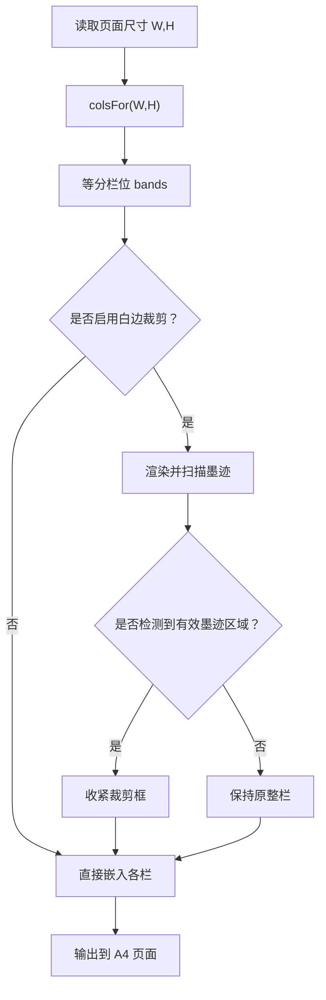
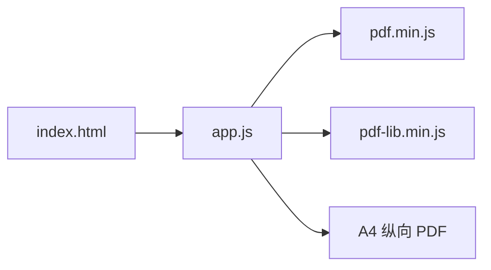

# 智能栏数识别

<cite>
**本文引用的文件**   
- [app.js](file://pdf-splitter/app.js)
- [index.html](file://pdf-splitter/index.html)
- [README.md](file://README.md)
</cite>

## 目录
1. [引言](#引言)
2. [项目结构](#项目结构)
3. [核心组件](#核心组件)
4. [架构总览](#架构总览)
5. [详细组件分析](#详细组件分析)
6. [依赖关系分析](#依赖关系分析)
7. [性能与准确率](#性能与准确率)
8. [故障排查](#故障排查)
9. [结论](#结论)
10. [附录：交互选项与使用建议](#附录交互选项与使用建议)

## 引言
本技术文档聚焦“智能栏数识别”能力，解释试卷切分助手如何根据页面尺寸自动判断一页应切成几栏，并支持用户手动切换为固定栏数。重点包括：
- detectCols 函数的实现逻辑与阈值设计（1.85 对应 3 栏、1.2 对应 2 栏）。
- colsFor 函数在自动模式与手动模式之间的切换机制。
- A3/A4 拼版试卷的典型比例特征与识别边界。
- 用户界面中的自动识别、2 栏、3 栏等选择项。
- 检测算法示例、边界情况处理、准确率影响因素与优化策略。

该功能面向“一页横排 2 栏或 3 栏的拼版试卷”，目标是把每栏输出成一张标准 A4 纵向 PDF，便于直接打印。

## 项目结构
本项目由 Web 前端与 Android 壳工程组成，智能栏数识别逻辑位于 Web 前端的 app.js 中，界面定义在 index.html 中；README 提供了整体背景、已知限制与使用说明。

图表来源
- [index.html:194-220](file://pdf-splitter/index.html#L194-L220)
- [app.js:45-54](file://pdf-splitter/app.js#L45-L54)
- [app.js:412-490](file://pdf-splitter/app.js#L412-L490)

章节来源
- [README.md:1-23](file://README.md#L1-L23)
- [index.html:194-220](file://pdf-splitter/index.html#L194-L220)
- [app.js:1-30](file://pdf-splitter/app.js#L1-L30)

## 核心组件
本节聚焦智能栏数识别的核心函数与状态流转。

- detectCols(W, H)
  - 输入：页面宽 W、高 H（单位是 pdf.js viewport 的逻辑点）。
  - 计算长宽比 r = W / H。
  - 规则：
    - r ≥ 1.85 → 返回 3 栏。
    - r ≥ 1.2 → 返回 2 栏。
    - 其他 → 返回 1 栏（不切分）。
  - 特点：纯数学阈值判定，无机器学习、无图像内容分析。

- colsFor(W, H)
  - 若 state.mode === 'auto'，调用 detectCols(W, H)。
  - 否则返回 parseInt(state.mode, 10)，即用户选择的固定栏数。
  - 作用：统一入口，屏蔽自动/手动两种模式差异。

- 状态 state.mode
  - 默认值为 'auto'。
  - 通过界面分段按钮更新，可选值包括 'auto'、'2'、'3'、'1'。

章节来源
- [app.js:45-54](file://pdf-splitter/app.js#L45-L54)
- [app.js:13-28](file://pdf-splitter/app.js#L13-L28)
- [app.js:364-372](file://pdf-splitter/app.js#L364-L372)

## 架构总览
智能栏数识别贯穿“预览叠加切分线”和“实际切分生成”两条路径。

图表来源
- [index.html:194-220](file://pdf-splitter/index.html#L194-L220)
- [app.js:331-361](file://pdf-splitter/app.js#L331-L361)
- [app.js:412-490](file://pdf-splitter/app.js#L412-L490)

## 详细组件分析

### detectCols：页面长宽比分析与阈值设定
detectCols 基于页面宽高比进行简单阈值分类：
- 当 r ≥ 1.85 时，认为页面更“扁宽”，适合分为左中右 3 栏。
- 当 r ≥ 1.2 且 < 1.85 时，认为页面宽度适中，适合左右 2 栏。
- 其他情况视为单栏，不进行切分。

这种设计的优点是轻量、稳定、可预测；缺点是仅依赖几何形状，无法感知真实排版语义。例如，某些 A3 横版三栏试卷的实际比例可能接近 √2 ≈ 1.41，会被误判为 2 栏。

图表来源
- [app.js:45-50](file://pdf-splitter/app.js#L45-L50)

章节来源
- [app.js:45-50](file://pdf-splitter/app.js#L45-L50)
- [README.md:85-86](file://README.md#L85-L86)

### colsFor：自动模式与手动模式的切换
colsFor 作为统一入口，根据当前 mode 决定行为：
- 自动模式：调用 detectCols(W, H)。
- 手动模式：返回用户选择的数值（如 '2'、'3'、'1'）。

该函数被多处调用：
- 预览阶段：updateOverlays 用于计算切分线位置与预计输出页数。
- 处理阶段：process 用于确定每页的 bands（栏位区间）。

图表来源
- [app.js:51-54](file://pdf-splitter/app.js#L51-L54)
- [app.js:331-361](file://pdf-splitter/app.js#L331-L361)
- [app.js:412-490](file://pdf-splitter/app.js#L412-L490)

章节来源
- [app.js:51-54](file://pdf-splitter/app.js#L51-L54)
- [app.js:331-361](file://pdf-splitter/app.js#L331-L361)
- [app.js:412-490](file://pdf-splitter/app.js#L412-L490)

### 不同栏数布局的特征分析
- 2 栏布局（左右）：常见于 A3 横版拼版，页面宽度明显大于高度，但不足以达到 3 栏阈值。
- 3 栏布局（左中右）：页面更“扁宽”，通常出现在多栏排版的试卷或资料中。
- A3/A4 拼版试卷典型比例：
  - A3 横版约为 1.41（√2），容易被 detectCols 判为 2 栏。
  - 因此 README 明确指出：自动识别只按页面长宽比判断，A3 横版三栏可能被误判为 2 栏，需要手动选“左中右 3 栏”。

这意味着：
- 自动识别适用于大多数“明显偏宽”的 3 栏场景。
- 对于 A3 横版三栏，推荐用户在界面中选择“左中右 3 栏”。

章节来源
- [README.md:85-86](file://README.md#L85-L86)
- [app.js:45-50](file://pdf-splitter/app.js#L45-L50)

### 用户交互选项
界面提供以下分栏方式：
- 自动识别：按页面比例判断。
- 左右 2 栏：一页切成两页。
- 左中右 3 栏：一页切成三页。
- 不切分：仅转 A4 版式。

这些选项通过分段按钮设置 state.mode，并在预览区实时更新切分线与预计页数。

图表来源
- [index.html:194-220](file://pdf-splitter/index.html#L194-L220)
- [app.js:13-28](file://pdf-splitter/app.js#L13-L28)
- [app.js:364-372](file://pdf-splitter/app.js#L364-L372)
- [app.js:331-361](file://pdf-splitter/app.js#L331-L361)

章节来源
- [index.html:194-220](file://pdf-splitter/index.html#L194-L220)
- [app.js:364-372](file://pdf-splitter/app.js#L364-L372)

### 检测算法示例与边界情况处理
- 正常情况：
  - 页面很宽（r ≥ 1.85）→ 自动识别为 3 栏。
  - 页面中等宽度（1.2 ≤ r < 1.85）→ 自动识别为 2 栏。
  - 页面接近正方形或竖版（r < 1.2）→ 不切分。
- 边界情况：
  - A3 横版三栏（r ≈ 1.41）→ 被误判为 2 栏，需手动改为 3 栏。
  - 混合文档（不同页面比例不同）→ 每页独立调用 colsFor，可能出现同一文档中部分页自动识别为 2 栏、部分为 3 栏的情况。
  - 旋转页面：代码会先做旋转归一化，确保预览与裁剪在同一坐标系下。
  - 白边裁剪失败：若某栏未检测到墨迹，则保留原始整栏，避免裁空。

图表来源
- [app.js:412-490](file://pdf-splitter/app.js#L412-L490)
- [app.js:109-151](file://pdf-splitter/app.js#L109-L151)
- [app.js:164-193](file://pdf-splitter/app.js#L164-L193)

章节来源
- [app.js:412-490](file://pdf-splitter/app.js#L412-L490)
- [app.js:109-151](file://pdf-splitter/app.js#L109-L151)
- [app.js:164-193](file://pdf-splitter/app.js#L164-L193)

## 依赖关系分析
智能栏数识别依赖以下模块：
- pdf.js：负责解析 PDF、获取页面尺寸、渲染到 canvas（用于白边裁剪）。
- pdf-lib：负责读取/写入 PDF、嵌入页面、创建 A4 输出。
- DOM 与事件系统：接收用户选择、更新状态、渲染预览。

图表来源
- [index.html:284-286](file://pdf-splitter/index.html#L284-L286)
- [app.js:1-11](file://pdf-splitter/app.js#L1-L11)
- [app.js:412-490](file://pdf-splitter/app.js#L412-L490)

章节来源
- [index.html:284-286](file://pdf-splitter/index.html#L284-L286)
- [app.js:1-11](file://pdf-splitter/app.js#L1-L11)

## 性能与准确率
- 性能特性：
  - 自动识别本身极快，仅做除法与比较。
  - 白边裁剪会触发 pdf.js 栅格化，约 1 秒/页，是主要耗时点。
  - 已预览过的页面可复用位图，避免重复渲染。
- 准确率影响因素：
  - 仅依赖页面长宽比，无法理解真实排版语义。
  - A3 横版三栏（≈1.41）易被误判为 2 栏。
  - 混合文档中不同页面比例不一致时，自动识别可能产生不一致结果。
- 优化策略：
  - 对已知 A3 横版三栏场景，引导用户手动选择“左中右 3 栏”。
  - 可在 detectCols 中引入更细粒度阈值或加权评分，但仍需结合更多版面特征（如文本块分布、空白带宽度）。
  - 增加“检测置信度”提示，帮助用户判断是否需要手动调整。

章节来源
- [README.md:83-90](file://README.md#L83-L90)
- [app.js:109-193](file://pdf-splitter/app.js#L109-L193)
- [app.js:412-490](file://pdf-splitter/app.js#L412-L490)

## 故障排查
常见问题与处理方法：
- 自动识别错误（A3 横版三栏被判为 2 栏）：
  - 在界面中选择“左中右 3 栏”。
- 加密 PDF 无法打开：
  - 需要先去除密码再处理。
- 大文件内存峰值偏高：
  - 一次性嵌入所有页面，内存占用较高；建议分批处理或减少白边裁剪。
- 白边裁剪导致某栏为空：
  - 若未检测到墨迹，代码会保留整栏，不会裁空。
- 预览与裁剪不一致：
  - 代码先做旋转归一化，确保预览与裁剪在同一坐标系；若仍异常，检查源文件是否含复杂 Rotate。

章节来源
- [README.md:83-90](file://README.md#L83-L90)
- [app.js:83-103](file://pdf-splitter/app.js#L83-L103)
- [app.js:497-507](file://pdf-splitter/app.js#L497-L507)

## 结论
智能栏数识别以页面长宽比为唯一依据，具备实现简单、运行稳定的优点，但在 A3 横版三栏等边界场景下存在误判风险。通过界面提供的自动识别、2 栏、3 栏、不切分选项，用户可灵活修正识别结果。未来若需进一步提升准确率，可引入更丰富的版面特征分析，并结合用户反馈持续优化阈值与交互提示。

## 附录：交互选项与使用建议
- 自动识别：适合大多数明显偏宽的 3 栏场景。
- 左右 2 栏：适合 A3 横版双栏试卷。
- 左中右 3 栏：适合 A3 横版三栏或明显扁宽的 3 栏文档。
- 不切分：仅将原页缩放至 A4，不做栏切分。
- 白边裁剪：勾选后可提升铺满度，但会增加处理时间。
- 边距与微调：左右边距影响横向留白，上下边距决定放大率；切分线微调用于对齐跨栏文字。

章节来源
- [index.html:194-220](file://pdf-splitter/index.html#L194-L220)
- [README.md:33-35](file://README.md#L33-L35)