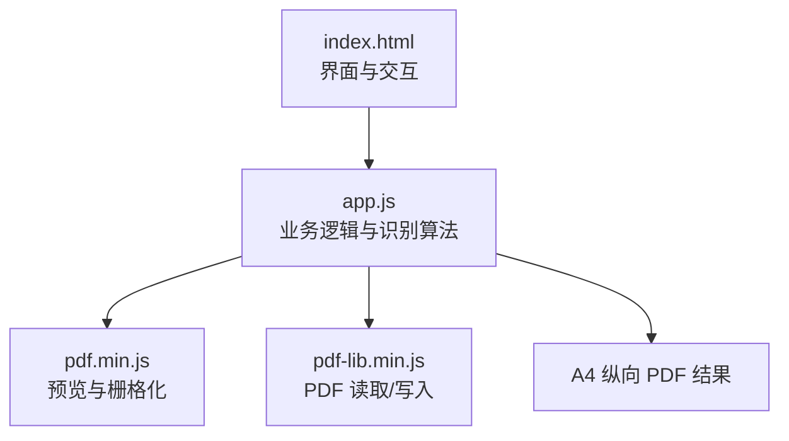
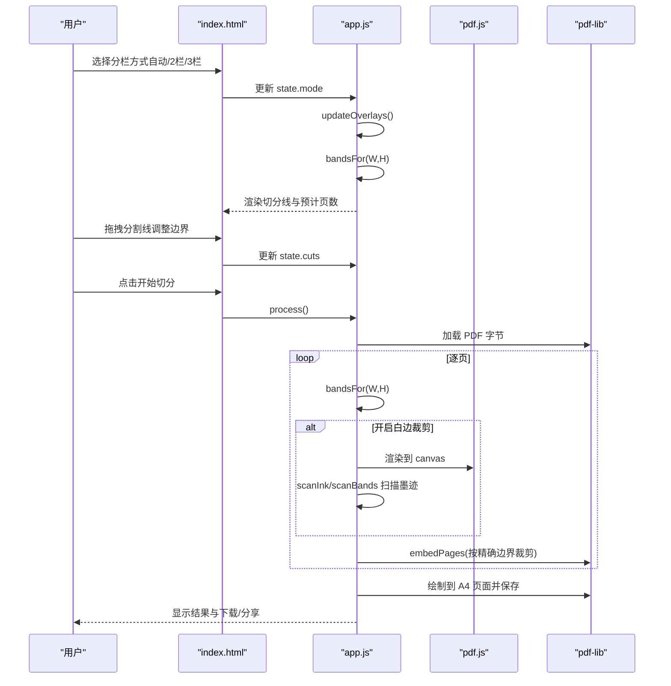
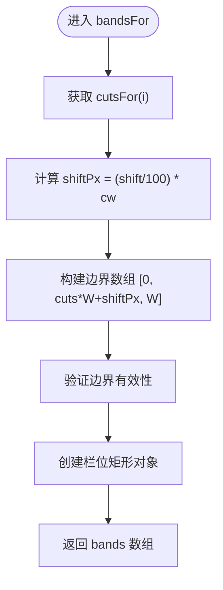
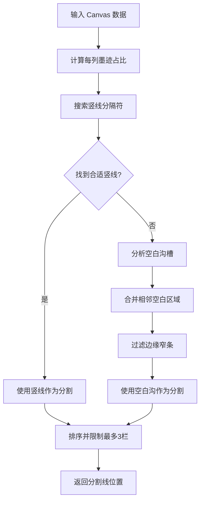
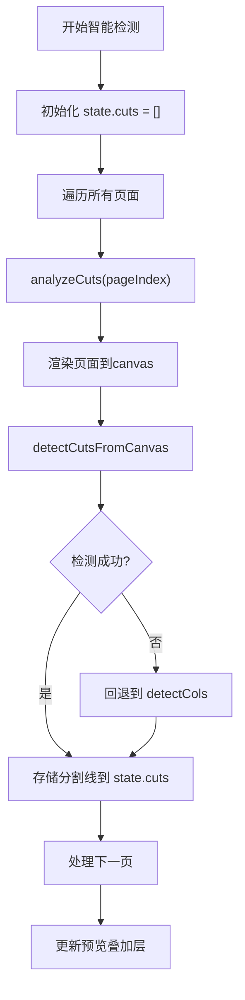
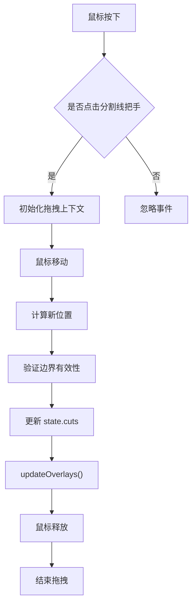
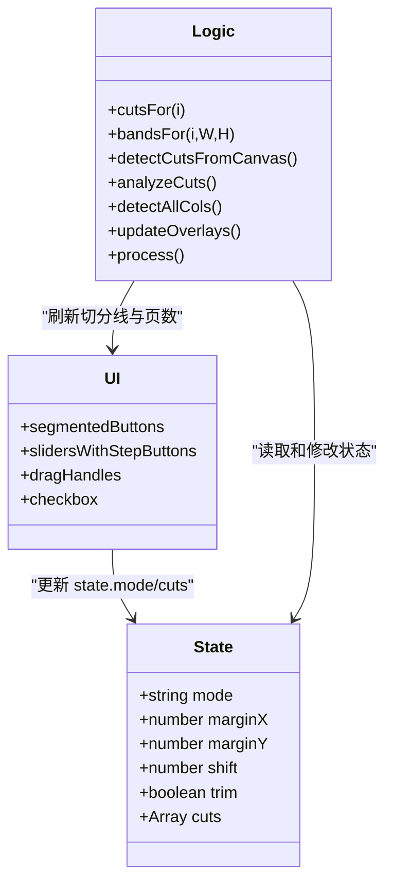
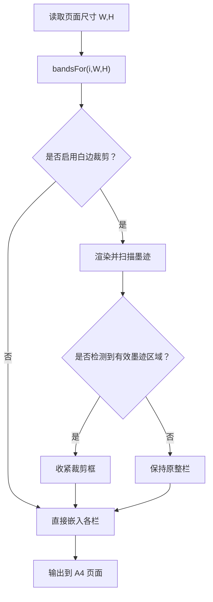
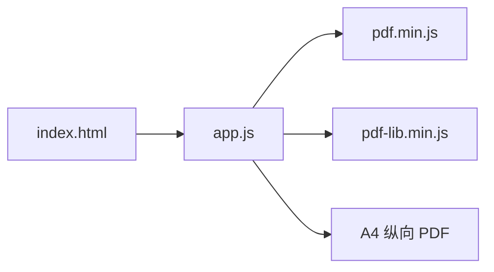

基于对代码的分析，我现在了解了主要的架构变更。让我更新智能栏数识别文档：

# 智能栏数识别

<cite>
**本文引用的文件**   
- [app.js](file://pdf-splitter/app.js)
- [index.html](file://pdf-splitter/index.html)
- [README.md](file://README.md)
</cite>

## 更新摘要
**所做更改**   
- 重大架构转型：从简单的页面长宽比分析升级为基于像素级内容的智能边界检测系统
- 核心状态管理重构：从跟踪简单栏数（state.cols）改为跟踪精确边界位置（state.cuts）
- 新增交互式操作功能：支持拖拽调整分割线、±步进按钮控制边距
- 三层智能检测算法：竖线分隔符检测 → 空白沟槽识别 → 边缘情况处理
- 引入新函数：cutsFor()、bandsFor()、numBands() 实现精确的边界管理

## 目录
1. [引言](#引言)
2. [项目结构](#项目结构)
3. [核心组件](#核心组件)
4. [架构总览](#架构总览)
5. [详细组件分析](#详细组件分析)
6. [依赖关系分析](#依赖关系分析)
7. [性能与准确率](#性能与准确率)
8. [故障排查](#故障排查)
9. [结论](#结论)
10. [附录：交互选项与使用建议](#附录交互选项与使用建议)

## 引言
本技术文档聚焦"智能栏数识别"能力，解释试卷切分助手如何根据页面内容自动判断一页应切成几栏，并支持用户手动切换为固定栏数。**重大更新**引入了基于像素级分析的智能检测系统，实现了从简单计数到精确边界检测的架构转型。重点包括：
- **全新架构**：从 state.cols 简单栏数跟踪升级为 state.cuts 精确边界位置管理
- **三层智能检测**：竖线分隔符检测 → 空白沟槽识别 → 边缘情况处理的完整流程
- **交互式操作**：支持拖拽调整分割线、±步进按钮精确控制边距和微调
- **增强的 detectCols 函数**：结合页面长宽比分析与像素级内容检测（1.85对应3栏，1.2对应2栏）
- **新的核心函数**：cutsFor()、bandsFor()、numBands() 提供精确的边界计算能力

该功能面向"一页横排 2 栏或 3 栏的拼版试卷"，目标是把每栏输出成一张标准 A4 纵向 PDF，便于直接打印。

## 项目结构
本项目由 Web 前端与 Android 壳工程组成，智能栏数识别逻辑位于 Web 前端的 app.js 中，界面定义在 index.html 中；README 提供了整体背景、已知限制与使用说明。

图表来源
- [index.html:194-220](file://pdf-splitter/index.html#L194-L220)
- [app.js:45-54](file://pdf-splitter/app.js#L45-L54)
- [app.js:412-490](file://pdf-splitter/app.js#L412-L490)

章节来源
- [README.md:1-23](file://README.md#L1-L23)
- [index.html:194-220](file://pdf-splitter/index.html#L194-L220)
- [app.js:1-30](file://pdf-splitter/app.js#L1-L30)

## 核心组件
本节聚焦智能栏数识别的核心函数与状态流转。

### 核心状态管理重构
**重大更新**：核心状态从简单栏数跟踪转变为精确边界管理

- **state.cuts**：每页一组内部边界占页宽比例数组，替代原来的 state.cols
- **state.mode**：默认值 '2'（左右2栏），可选 'auto'、'2'、'3'
- **state.shift**：全局切分线微调百分比，支持 ±15% 范围

### 新增核心函数

- **cutsFor(i)**：获取某页当前边界
  - 如果 state.cuts[i] 已设置则返回
  - 否则按当前模式生成等分边界
  - 自动模式下未检测前暂按2栏处理

- **bandsFor(i, W, H)**：计算各栏像素矩形
  - 基于 cuts + 全局 shift 计算实际边界
  - 返回包含 left/right/bottom/top 的栏位信息
  - 确保坐标一致性用于预览与切分

- **numBands(i)**：计算栏位数
  - 基于 cuts 长度 + 1 计算
  - 替代原来的简单计数逻辑

- **detectCols(W, H)**：保留的长宽比检测
  - r ≥ 1.85 → 3 栏
  - r ≥ 1.2 → 2 栏  
  - 其他 → 1 栏

- **detectCutsFromCanvas(ctx, w, h)**：**新增**像素级分割线检测
  - 三层检测策略：竖线 → 空白沟 → 边缘处理
  - 最多支持3栏检测

- **analyzeCuts(pno)**：**新增**单页智能分析
  - 渲染页面到 canvas 进行像素级分析
  - 失败时回退到 detectCols 基于比例的检测

- **detectAllCols()**：**新增**批量智能检测
  - 并行处理所有页面的分析任务
  - 完成后更新预览叠加层

章节来源
- [app.js:13-30](file://pdf-splitter/app.js#L13-L30)
- [app.js:47-67](file://pdf-splitter/app.js#L47-L67)
- [app.js:70-75](file://pdf-splitter/app.js#L70-L75)
- [app.js:83-119](file://pdf-splitter/app.js#L83-L119)
- [app.js:120-148](file://pdf-splitter/app.js#L120-L148)

## 架构总览
智能栏数识别贯穿"预览叠加切分线"和"实际切分生成"两条路径，现在支持精确的边界管理和交互式操作。

图表来源
- [index.html:194-220](file://pdf-splitter/index.html#L194-L220)
- [app.js:331-361](file://pdf-splitter/app.js#L331-L361)
- [app.js:412-490](file://pdf-splitter/app.js#L412-L490)

## 详细组件分析

### cutsFor 与 bandsFor：精确边界管理系统
**重大更新**：全新的边界管理架构

**cutsFor(i) 函数**：
- 优先返回 state.cuts[i] 中的精确边界
- 未设置时按 mode 生成等分边界
- 自动模式下默认2栏作为初始值

**bandsFor(i, W, H) 函数**：
- 将 cuts 转换为实际的像素矩形
- 应用全局 shift 偏移量
- 确保边界顺序和有效性
- 返回包含完整几何信息的栏位数据

图表来源
- [app.js:51-67](file://pdf-splitter/app.js#L51-L67)

章节来源
- [app.js:51-67](file://pdf-splitter/app.js#L51-L67)

### detectCutsFromCanvas：三层智能检测算法
**重大更新**：全新的像素级内容分析系统

**第一层：竖线分隔符检测**
- 计算每列墨迹占比，识别贯穿上下的分隔线
- 过滤太宽或不合理的线条
- 阈值：lineT = Math.round(h * 0.45)

**第二层：空白沟槽识别**
- 如果没有找到合适的竖线，分析空白区域分布
- 合并相邻空白区域，过滤过小的间隙
- 计算空白区域中心作为分割线位置

**第三层：边缘情况处理**
- 窄边条并入相邻栏的处理逻辑
- 首尾太窄的边条被移除
- 最多支持3栏检测

图表来源
- [app.js:83-119](file://pdf-splitter/app.js#L83-L119)

章节来源
- [app.js:83-119](file://pdf-splitter/app.js#L83-L119)

### analyzeCuts 与 detectAllCols：智能检测流程
**新增**：完整的智能检测工作流

**analyzeCuts(pno)**：
- 获取页面并设置适当的缩放比例
- 渲染到 canvas 进行像素级分析
- 调用 detectCutsFromCanvas 进行分割线检测
- 渲染失败时回退到基于比例的 detectCols

**detectAllCols()**：
- 清空现有的 cuts 数组
- 为每个页面创建异步分析任务
- 并行处理所有页面的检测
- 完成后更新预览叠加层

图表来源
- [app.js:120-148](file://pdf-splitter/app.js#L120-L148)

章节来源
- [app.js:120-148](file://pdf-splitter/app.js#L120-L148)

### 交互式分割线操作
**重大更新**：新增拖拽调整分割线的交互功能

**拖拽机制**：
- 按住分割线上的把手横向拖动
- 实时更新 state.cuts 中的对应边界
- 保持与其他边界的相对位置关系
- 自动触发 updateOverlays() 刷新预览

**边界约束**：
- 最小间距保护：相邻边界至少保持 0.04 的间隔
- 边界范围限制：1.5% 到 98.5%
- 防止边界重叠和倒序

图表来源
- [app.js:517-543](file://pdf-splitter/app.js#L517-L543)

章节来源
- [app.js:517-543](file://pdf-splitter/app.js#L517-L543)

### 用户交互选项增强
**重大更新**：界面提供丰富的交互选项

**分栏方式选择**：
- **左右 2 栏**：默认选项，一页切成两页
- **左右 3 栏**：一页切成三页
- **智能识别**：按内容空白自动判断每页栏数

**精确控制选项**：
- **左右边距滑块**：0-20mm，默认10mm，配有±步进按钮
- **上下边距滑块**：0-40mm，默认20mm，配有±步进按钮
- **切分线微调滑块**：-15%到+15%，默认0%，配有±步进按钮

**步进按钮功能**：
- 每次点击调整1个单位
- 与拖动滑块共享同一事件处理器
- 实时同步状态和预览

图表来源
- [index.html:212-239](file://pdf-splitter/index.html#L212-L239)
- [app.js:13-30](file://pdf-splitter/app.js#L13-L30)
- [app.js:546-593](file://pdf-splitter/app.js#L546-L593)

章节来源
- [index.html:212-239](file://pdf-splitter/index.html#L212-L239)
- [app.js:546-593](file://pdf-splitter/app.js#L546-L593)

### 不同栏数布局的特征分析
- **2 栏布局（左右）**：常见于 A3 横版拼版，页面宽度明显大于高度，但不足以达到 3 栏阈值
- **3 栏布局（左中右）**：页面更"扁宽"，通常出现在多栏排版的试卷或资料中
- **A3/A4 拼版试卷典型比例**：
  - A3 横版约为 1.41（√2），容易被 detectCols 判为 2 栏
  - 因此 README 明确指出：自动识别只按页面长宽比判断，A3 横版三栏可能被误判为 2 栏，需要手动选"左中右 3 栏"

这意味着：
- 自动识别适用于大多数"明显偏宽"的 3 栏场景
- 对于 A3 横版三栏，推荐用户在界面中选择"左中右 3 栏"
- **新增**：智能检测能更好地处理复杂版面，但仍受限于页面质量

章节来源
- [README.md:85-86](file://README.md#L85-L86)
- [app.js:70-75](file://pdf-splitter/app.js#L70-L75)

### 检测算法示例与边界情况处理
**重大更新**：增强的检测算法和边界处理能力

**正常情况**：
- 页面很宽（r ≥ 1.85）→ 自动识别为 3 栏
- 页面中等宽度（1.2 ≤ r < 1.85）→ 自动识别为 2 栏
- 页面接近正方形或竖版（r < 1.2）→ 不切分

**增强的像素级检测**：
- 优先检测贯穿上下的竖线分隔符
- 如果没有竖线，则分析空白沟槽分布
- 自动处理边缘窄条并入相邻栏的情况

**边界情况处理**：
- A3 横版三栏（r ≈ 1.41）→ 被误判为 2 栏，需手动改为 3 栏
- 混合文档（不同页面比例不同）→ 每页独立调用 bandsFor，可能出现同一文档中部分页自动识别为 2 栏、部分为 3 栏的情况
- 旋转页面：代码会先做旋转归一化，确保预览与裁剪在同一坐标系下
- 白边裁剪失败：若某栏未检测到墨迹，则保留原始整栏，避免裁空

图表来源
- [app.js:412-490](file://pdf-splitter/app.js#L412-L490)
- [app.js:241-300](file://pdf-splitter/app.js#L241-L300)

章节来源
- [app.js:412-490](file://pdf-splitter/app.js#L412-L490)
- [app.js:241-300](file://pdf-splitter/app.js#L241-L300)

## 依赖关系分析
智能栏数识别依赖以下模块：
- pdf.js：负责解析 PDF、获取页面尺寸、渲染到 canvas（用于白边裁剪和像素级检测）
- pdf-lib：负责读取/写入 PDF、嵌入页面、创建 A4 输出
- DOM 与事件系统：接收用户选择、更新状态、渲染预览

图表来源
- [index.html:312-314](file://pdf-splitter/index.html#L312-L314)
- [app.js:1-11](file://pdf-splitter/app.js#L1-L11)
- [app.js:412-490](file://pdf-splitter/app.js#L412-L490)

章节来源
- [index.html:312-314](file://pdf-splitter/index.html#L312-L314)
- [app.js:1-11](file://pdf-splitter/app.js#L1-L11)

## 性能与准确率
**重大更新**：性能特性和准确率有了显著提升

**性能特性**：
- 自动识别本身极快，仅做除法与比较
- **新增** 像素级检测会增加处理时间，但提供更准确的分割线定位
- 白边裁剪会触发 pdf.js 栅格化，约 1 秒/页，是主要耗时点
- 已预览过的页面可复用位图，避免重复渲染
- **新增** 智能检测采用并行处理，提升批量页面处理效率

**准确率影响因素**：
- 仅依赖页面长宽比，无法理解真实排版语义
- A3 横版三栏（≈1.41）易被误判为 2 栏
- 混合文档中不同页面比例不一致时，自动识别可能产生不一致结果
- **新增** 像素级检测能更好地处理复杂版面，但仍受限于页面质量

**优化策略**：
- 对已知 A3 横版三栏场景，引导用户手动选择"左中右 3 栏"
- 可在 detectCols 中引入更细粒度阈值或加权评分，但仍需结合更多版面特征（如文本块分布、空白带宽度）
- 增加"检测置信度"提示，帮助用户判断是否需要手动调整
- **新增** 智能检测失败时自动回退到基于比例的检测，保证基本功能可用

章节来源
- [README.md:83-90](file://README.md#L83-L90)
- [app.js:109-193](file://pdf-splitter/app.js#L109-L193)
- [app.js:412-490](file://pdf-splitter/app.js#L412-L490)

## 故障排查
常见问题与处理方法：
- 自动识别错误（A3 横版三栏被判为 2 栏）：
  - 在界面中选择"左中右 3 栏"
- **新增** 智能检测不准确：
  - 检查页面质量，模糊或低分辨率页面可能影响像素级检测
  - 尝试切换到手动模式指定栏数
  - 使用拖拽功能手动调整分割线位置
- 加密 PDF 无法打开：
  - 需要先去除密码再处理
- 大文件内存峰值偏高：
  - 一次性嵌入所有页面，内存占用较高；建议分批处理或减少白边裁剪
- 白边裁剪导致某栏为空：
  - 若未检测到墨迹，代码会保留整栏，不会裁空
- 预览与裁剪不一致：
  - 代码先做旋转归一化，确保预览与裁剪在同一坐标系；若仍异常，检查源文件是否含复杂 Rotate
- **新增** 分割线拖拽无效：
  - 检查是否在 busy 状态下（正在处理中）
  - 确认点击的是分割线把手而非其他区域

章节来源
- [README.md:83-90](file://README.md#L83-L90)
- [app.js:83-103](file://pdf-splitter/app.js#L83-L103)
- [app.js:517-543](file://pdf-splitter/app.js#L517-L543)

## 结论
智能栏数识别经历了重大架构升级，从简单的页面长宽比判断发展为基于像素级内容的智能边界检测系统。**核心改进**包括：
- **精确边界管理**：从 state.cols 简单计数升级为 state.cuts 精确边界位置跟踪
- **三层智能检测**：竖线分隔符 → 空白沟槽 → 边缘处理的完整检测流程
- **交互式操作**：支持拖拽调整分割线和±步进按钮精确控制
- **增强的用户体验**：实时预览更新和智能回退机制

通过界面提供的自动识别、2 栏、3 栏选项，以及新增的拖拽调整和步进按钮，用户可以获得更精确的控制能力。未来若需进一步提升准确率，可引入更丰富的版面特征分析，并结合用户反馈持续优化阈值与交互提示。

## 附录：交互选项与使用建议
**重大更新**：丰富的交互选项和精确控制能力

**分栏方式选择**：
- **左右 2 栏**：默认选项，适合 A3 横版双栏试卷
- **左右 3 栏**：适合 A3 横版三栏或明显扁宽的 3 栏文档
- **智能识别**：适合大多数明显偏宽的 3 栏场景，现在支持像素级内容分析
- **不切分**：仅将原页缩放至 A4，不做栏切分

**精确控制选项**：
- **左右边距**：影响横向留白，范围 0-20mm，默认 10mm，配有±步进按钮
- **上下边距**：决定放大率，范围 0-40mm，默认 20mm，配有±步进按钮
- **切分线微调**：用于对齐跨栏文字，范围 -15% 到 +15%，默认 0%，配有±步进按钮

**新增交互功能**：
- **拖拽分割线**：按住分割线上的把手横向拖动，实时调整边界位置
- **步进按钮**：每个滑块配有±按钮，每次点击调整1个单位
- **实时预览**：所有调整立即反映在预览界面中

**白边裁剪**：勾选后可提升铺满度，但会增加处理时间
**智能检测回退机制**：当像素级检测失败时自动回退到基于比例的检测

章节来源
- [index.html:212-239](file://pdf-splitter/index.html#L212-L239)
- [README.md:33-35](file://README.md#L33-L35)
- [app.js:546-593](file://pdf-splitter/app.js#L546-L593)