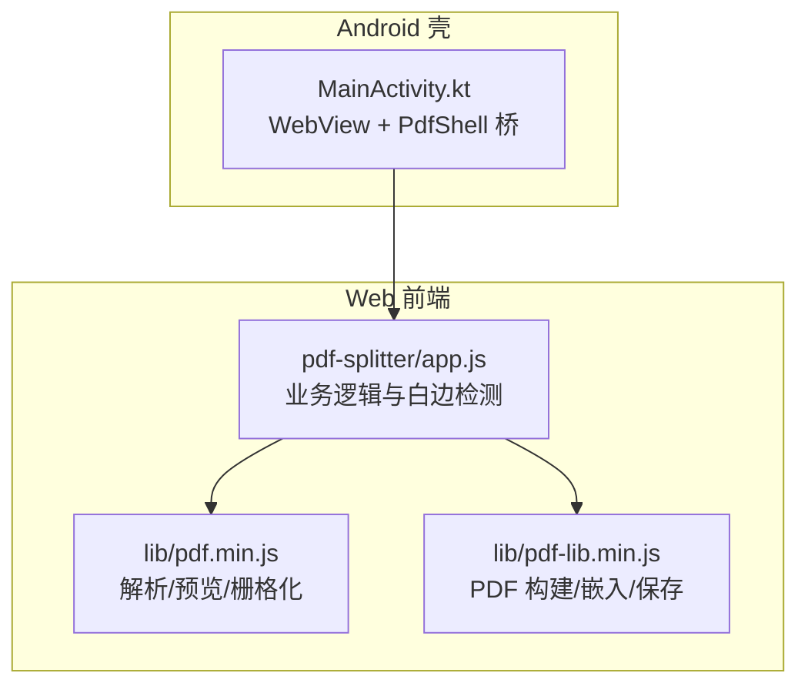
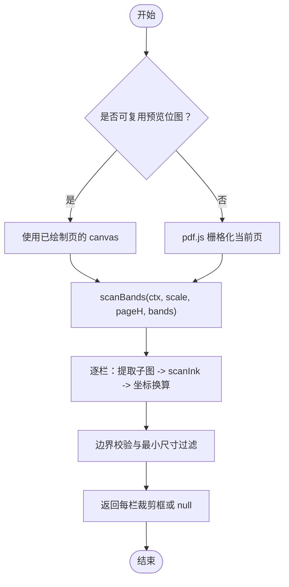
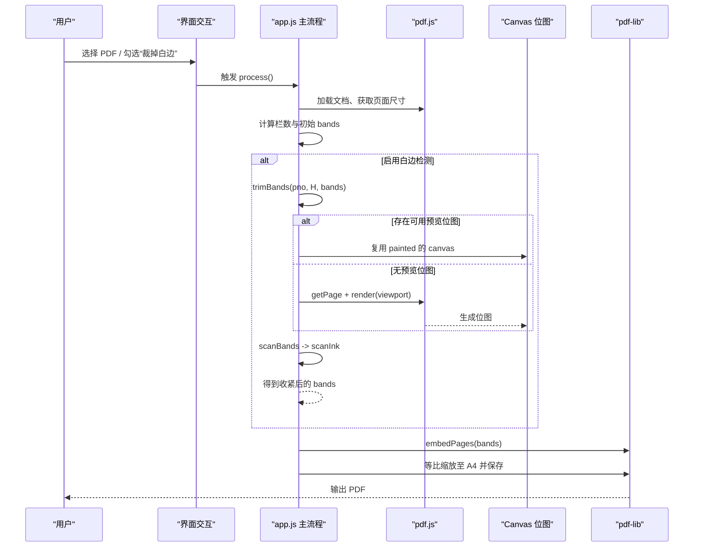
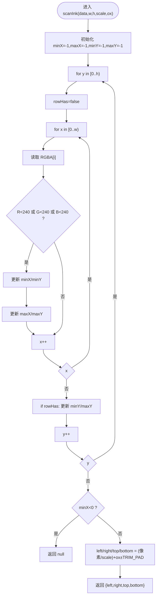
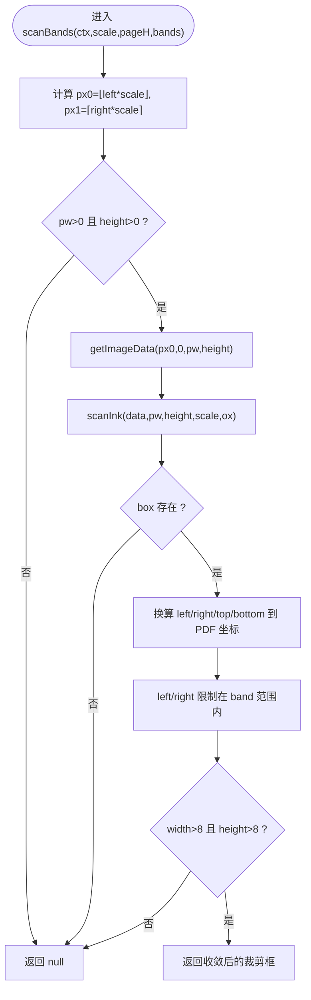
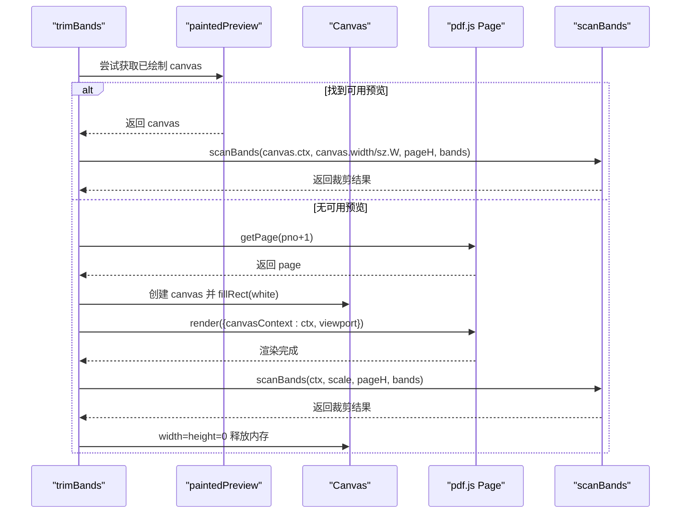
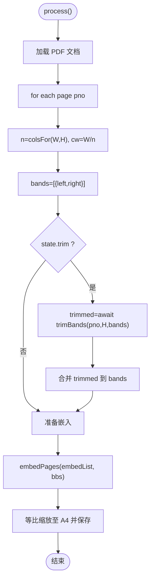
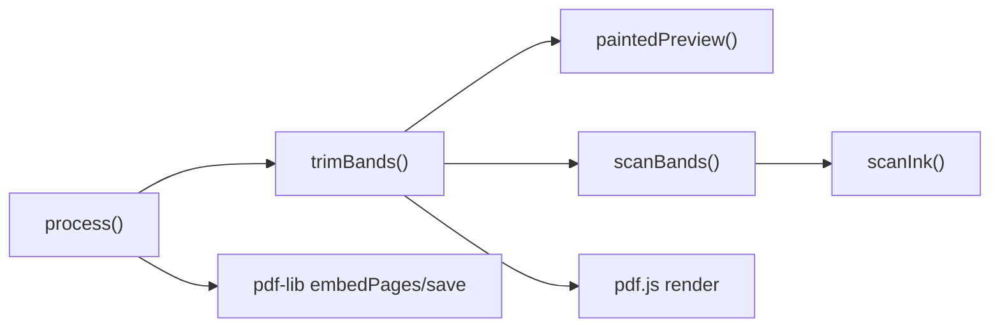

# 白边裁剪检测

<cite>
**本文引用的文件**   
- [app.js](file://pdf-splitter/app.js)
- [README.md](file://README.md)
</cite>

## 目录
1. [引言](#引言)
2. [项目结构](#项目结构)
3. [核心组件](#核心组件)
4. [架构总览](#架构总览)
5. [详细组件分析](#详细组件分析)
6. [依赖关系分析](#依赖关系分析)
7. [性能考量](#性能考量)
8. [故障排查指南](#故障排查指南)
9. [结论](#结论)
10. [附录：参数调优与最佳实践](#附录参数调优与最佳实践)

## 引言
本技术文档聚焦“白边裁剪检测”算法，围绕以下目标展开：
- 深入解释像素扫描函数 scanInk 的墨迹识别、阈值判断与边界框计算逻辑。
- 详细说明栏级处理函数 scanBands 的位图复用、坐标转换与边界验证流程。
- 阐述 trimBands 的完整实现路径，包括预览位图复用、pdf.js 栅格化、内存管理与错误恢复。
- 解释 TRIM_PAD 参数的作用与调优方法，并给出避免过度裁剪导致内容丢失的策略。
- 提供具体扫描示例与性能优化建议，并分析该算法在不同 PDF 类型上的适用性与局限性。

该功能属于“试卷切分助手”的前端处理链路的一部分：先用 pdf.js 渲染页面用于预览与白边检测，再用 pdf-lib 按栏裁剪并等比放入 A4 页面输出。

**章节来源**
- [README.md:77-90](file://README.md#L77-L90)

## 项目结构
仓库中与白边裁剪直接相关的代码位于前端 Web 应用入口脚本中；Android 壳工程仅负责 WebView 桥接与系统能力封装，不实现裁剪算法。

**图表来源**
- [app.js:1-11](file://pdf-splitter/app.js#L1-L11)
- [README.md:13-22](file://README.md#L13-L22)

**章节来源**
- [README.md:13-22](file://README.md#L13-L22)

## 核心组件
本节梳理与白边裁剪直接相关的三个核心函数及其协作关系：
- scanInk：像素级扫描，识别有墨迹的最小矩形，并转换为 PDF 点坐标。
- scanBands：对每个栏（band）进行位图切片、坐标换算与边界校验。
- trimBands：选择预览位图或触发 pdf.js 栅格化，统一调用 scanBands，并管理资源释放。

**图表来源**
- [app.js:109-193](file://pdf-splitter/app.js#L109-L193)

**章节来源**
- [app.js:109-193](file://pdf-splitter/app.js#L109-L193)

## 架构总览
从用户操作到最终输出的整体流程如下：

**图表来源**
- [app.js:412-480](file://pdf-splitter/app.js#L412-L480)
- [app.js:164-193](file://pdf-splitter/app.js#L164-L193)

**章节来源**
- [app.js:412-480](file://pdf-splitter/app.js#L412-L480)

## 详细组件分析

### scanInk：像素扫描与墨迹区域识别
scanInk 接收图像数据数组 data、宽高 w/h、scale 与横向偏移 ox，执行以下关键步骤：
- 行扫描优化：逐行记录该行是否存在墨迹，减少无效遍历。
- 阈值判断：若任一 RGB 通道值小于 240，即视为非纯白像素，计入墨迹。
- 边界更新：维护 minX/minY/maxX/maxY，形成最小包围矩形。
- 空结果处理：若未检测到任何墨迹，返回 null，由上层保留原始栏范围。
- 坐标换算：将像素坐标除以 scale 转为 PDF 点坐标，并以 ox 修正横轴偏移。
- 余量扩展：以 TRIM_PAD 向四周扩展边界，避免笔画被削切。

复杂度分析：
- 时间复杂度 O(w×h)，空间复杂度 O(1)。
- 通过“行是否有墨迹”的短路判断，可减少部分无用行的边界更新开销。

**图表来源**
- [app.js:109-132](file://pdf-splitter/app.js#L109-L132)

**章节来源**
- [app.js:109-132](file://pdf-splitter/app.js#L109-L132)

### scanBands：栏级处理流程
scanBands 对传入的 bands 列表逐项处理：
- 像素坐标映射：根据 scale 将 PDF 点坐标转换为 canvas 像素坐标 px0/px1。
- 边界验证：确保 pw=px1-px0>0 且 canvas.height>0，否则跳过该栏。
- 子图提取：使用 getImageData(px0, 0, pw, height) 取出栏内位图数据。
- 调用 scanInk：传入 pw、height、scale 与 ox=px0/scale，得到墨迹框 box。
- 坐标换算与裁剪：
  - left/right 在 band 范围内取交集，防止越界。
  - top/bottom 基于 pageH 与 box.top/bottom 换算为 PDF 坐标系（y 向上）。
- 最小尺寸过滤：若 right-left 与 top-bottom 均不大于 8 pt，则返回 null，表示无法有效裁剪。

**图表来源**
- [app.js:134-151](file://pdf-splitter/app.js#L134-L151)

**章节来源**
- [app.js:134-151](file://pdf-splitter/app.js#L134-L151)

### trimBands：预览复用、栅格化与内存管理
trimBands 的职责是选择合适的位图源并调用 scanBands：
- 预览复用：
  - 检查 previewItems 是否与当前文件大小一致，避免不同文件的缓存污染。
  - 仅当 it.painted=true 且 canvas 尺寸足够大时复用。
  - 复用时的 scale 为 pc.width / sz.W，保证与预览一致的显示尺度。
- 独立栅格化：
  - 若无可用预览，则通过 pdf.js 获取页面 viewport，scale=min(2, RENDER_W/vp0.width)，确保屏幕内外一致性。
  - 创建 canvas 并填充白色背景，再调用 page.render 完成栅格化。
- 资源释放：
  - 无论成功或失败，都将 canvas.width/height 置零，及时释放扫描件的大内存占用。
- 错误处理：
  - 捕获渲染异常，记录日志并返回 bands.map(()=>null)，由调用方回退为整栏。

**图表来源**
- [app.js:153-193](file://pdf-splitter/app.js#L153-L193)

**章节来源**
- [app.js:153-193](file://pdf-splitter/app.js#L153-L193)

### 与主流程的集成
process 函数在逐页循环中：
- 计算列数 n 与初始 bands（左/右边界）。
- 若启用白边检测，则调用 trimBands 获得收紧后的 bands。
- 将 bands 写入 embedList 与 bbs，供 pdf-lib 嵌入。
- 最后等比缩放至 A4 并保存。

**图表来源**
- [app.js:412-480](file://pdf-splitter/app.js#L412-L480)

**章节来源**
- [app.js:412-480](file://pdf-splitter/app.js#L412-L480)

## 依赖关系分析
- 内部依赖：
  - scanBands 依赖 scanInk。
  - trimBands 依赖 paintedPreview、pdf.js 的 page.getViewport/render 与 scanBands。
  - process 依赖 trimBands 与 pdf-lib 的 embedPages/save。
- 外部依赖：
  - pdf.js：解析 PDF、渲染页面到 Canvas。
  - pdf-lib：构建新 PDF、嵌入页面、保存字节流。
- 耦合与内聚：
  - 白边检测模块高度内聚于 app.js 的三个函数，职责清晰。
  - 与预览系统的耦合通过 paintedPreview 控制，避免重复栅格化。

**图表来源**
- [app.js:109-193](file://pdf-splitter/app.js#L109-L193)
- [app.js:412-480](file://pdf-splitter/app.js#L412-L480)

**章节来源**
- [app.js:109-193](file://pdf-splitter/app.js#L109-L193)
- [app.js:412-480](file://pdf-splitter/app.js#L412-L480)

## 性能考量
- 预览复用：已绘制的页直接复用 canvas，避免二次栅格化，显著降低耗时。
- 栅格化成本：未预览页需一次 pdf.js 渲染，瓶颈在内容解析与绘制指令而非像素量。
- 内存管理：及时将 canvas.width/height 置零，释放扫描件位图占用的大量内存。
- 进度反馈：在处理过程中分段更新进度条，提升用户体验。

**章节来源**
- [README.md:81-90](file://README.md#L81-L90)
- [app.js:175-191](file://pdf-splitter/app.js#L175-L191)

## 故障排查指南
- 加密 PDF：不支持，需先去除密码。
- 旋转问题：已通过 normalizeRotation 烘焙 /Rotate，避免预览与裁剪坐标不一致。
- 白边检测失败：若某栏检测不到墨迹，会退回整栏，不会裁空。
- 渲染异常：trimBands 捕获渲染错误，记录日志并返回 bands.map(()=>null)，由调用方保持原栏。

**章节来源**
- [README.md:83-90](file://README.md#L83-L90)
- [app.js:187-191](file://pdf-splitter/app.js#L187-L191)

## 结论
白边裁剪检测通过像素扫描与栏级处理，结合预览复用与 pdf.js 栅格化，实现了高效、稳定的 PDF 白边去除。TRIM_PAD 提供了必要的余量保护，避免笔画被削切；同时通过最小尺寸过滤与边界校验，确保裁剪结果合理可靠。在大文件场景下，需注意内存峰值与栅格化耗时，并通过预览复用与及时释放资源来优化性能。

[无需来源：总结性内容]

## 附录：参数调优与最佳实践

### TRIM_PAD 的作用与调优
- 作用：在墨迹最小矩形基础上向四周扩展 TRIM_PAD 个点，避免笔画边缘被精确裁剪而丢失细节。
- 调优建议：
  - 默认值为 3 pt，适用于多数试卷扫描件。
  - 若发现笔画被轻微削切，可适当增大 TRIM_PAD（例如 4–5 pt），但需权衡可能引入多余白边。
  - 若内容密度低、白边较多，可适度减小 TRIM_PAD，但要确保最小尺寸过滤仍能有效剔除噪声。

**章节来源**
- [app.js:107-131](file://pdf-splitter/app.js#L107-L131)

### 避免过度裁剪导致内容丢失
- 保持最小尺寸过滤：right-left>8 且 top-bottom>8，避免极小区域被误判为有效内容。
- 边界限制：left/right 限制在 band 范围内，top/bottom 限制在页面范围内，防止越界。
- 回退策略：检测不到墨迹的栏返回 null，调用方保留原始整栏，确保内容不丢失。

**章节来源**
- [app.js:134-151](file://pdf-splitter/app.js#L134-L151)
- [app.js:164-193](file://pdf-splitter/app.js#L164-L193)

### 扫描算法示例
- 输入：某栏的 Canvas 位图数据、scale、pageH、bands。
- 步骤：
  1. 将 PDF 坐标换算为像素坐标，提取栏内子图。
  2. 逐像素扫描，RGB 任一通道<240 视为墨迹。
  3. 计算 minX/minY/maxX/maxY，得到最小矩形。
  4. 换算为 PDF 坐标，并以 TRIM_PAD 扩展。
  5. 与 band 边界取交集，校验最小尺寸后返回裁剪框。

**章节来源**
- [app.js:109-151](file://pdf-splitter/app.js#L109-L151)

### 性能优化策略
- 优先复用预览位图：避免重复栅格化。
- 控制渲染尺度：scale=min(2, RENDER_W/vp0.width)，平衡清晰度与性能。
- 及时释放资源：render 完成后将 canvas.width/height 置零。
- 分批处理：在 process 中每 6 页插入 tick()，避免长时间阻塞 UI。

**章节来源**
- [app.js:170-191](file://pdf-splitter/app.js#L170-L191)
- [app.js:472-477](file://pdf-splitter/app.js#L472-L477)

### 不同 PDF 类型的适用性与局限性
- 适用：
  - 试卷扫描件：白边明显、内容密度适中，算法效果良好。
  - 文本型 PDF：文字边缘清晰，阈值判断稳定。
- 局限：
  - 自动识别只按页面长宽比判断栏数，极端比例可能误判。
  - 跨栏文字仍按等分线切割，可能导致内容不完整。
  - 大文件一次性嵌入，内存峰值偏高；不能中途取消。
  - 加密 PDF 不支持。

**章节来源**
- [README.md:83-90](file://README.md#L83-L90)