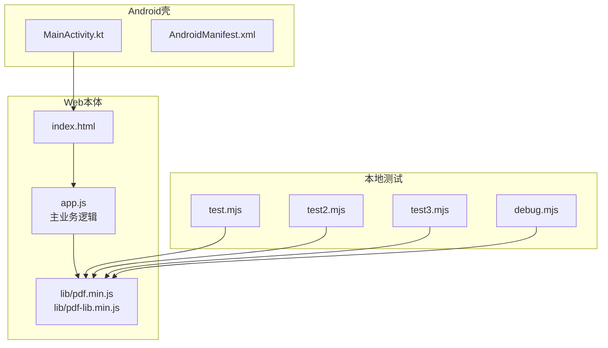
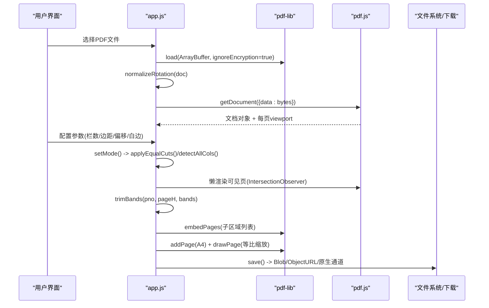
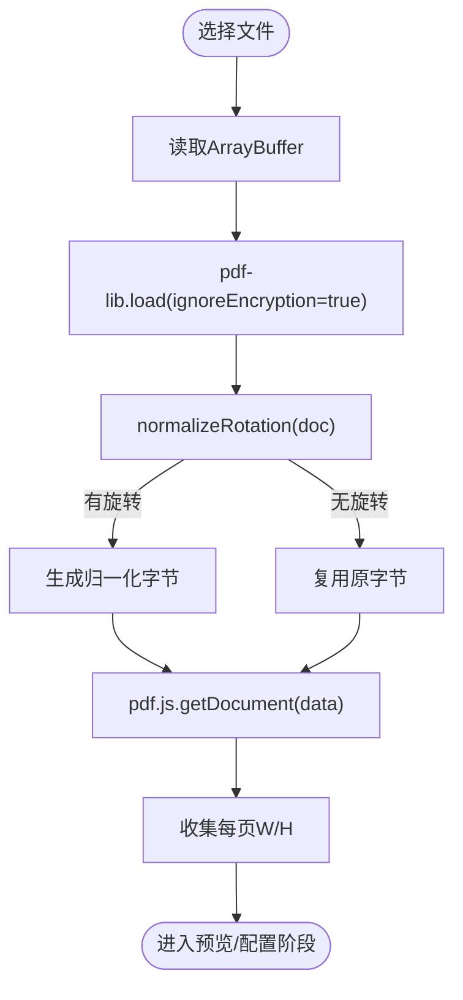
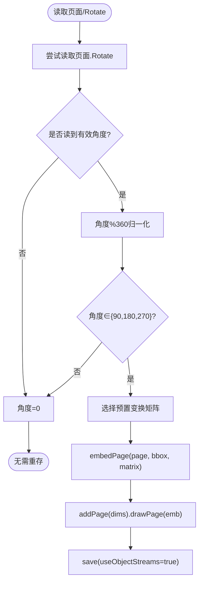
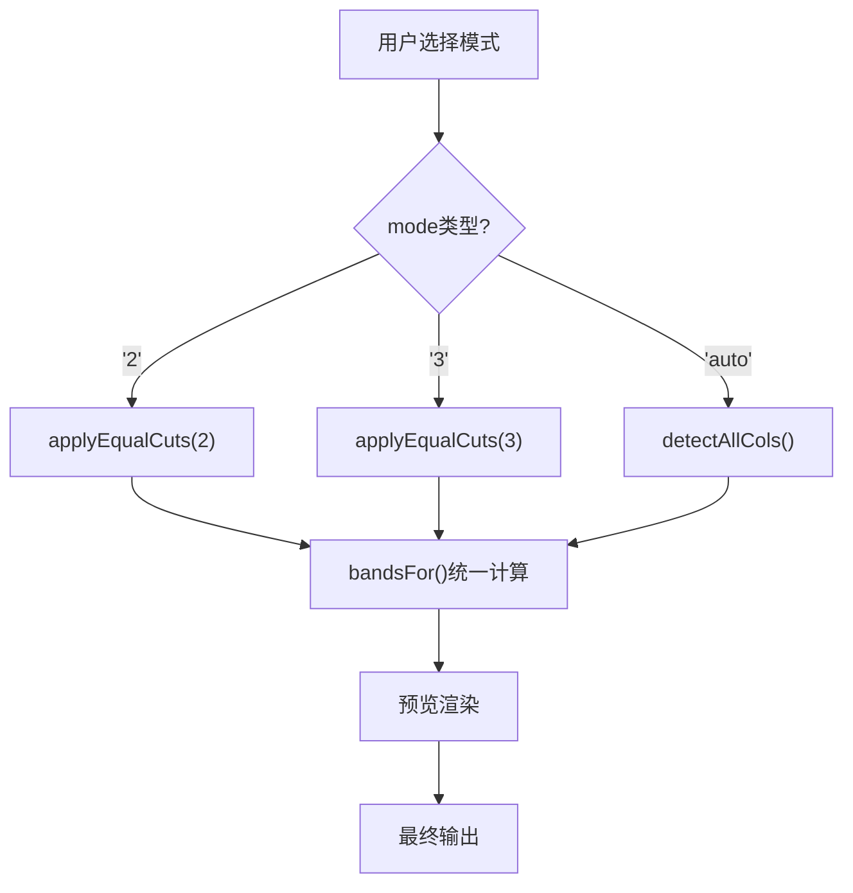
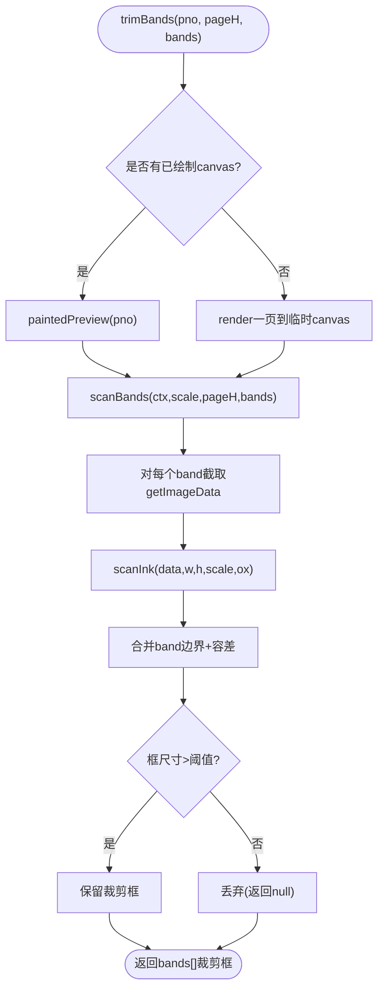
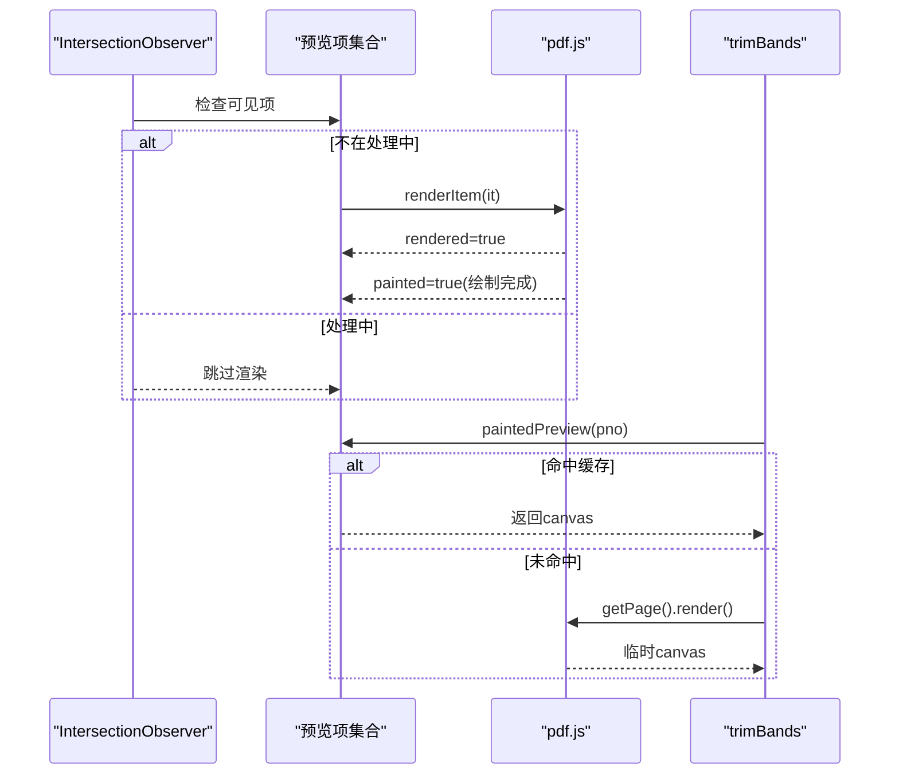
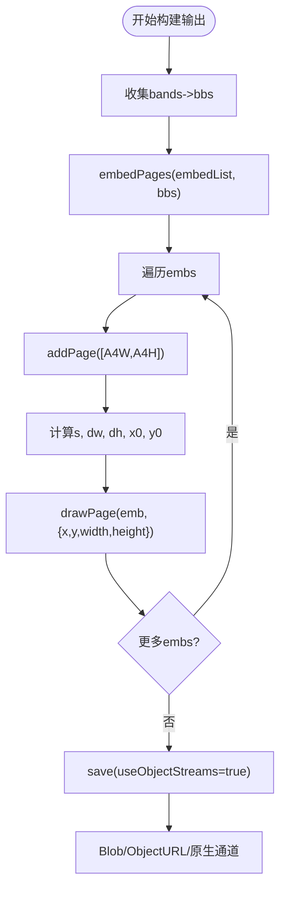
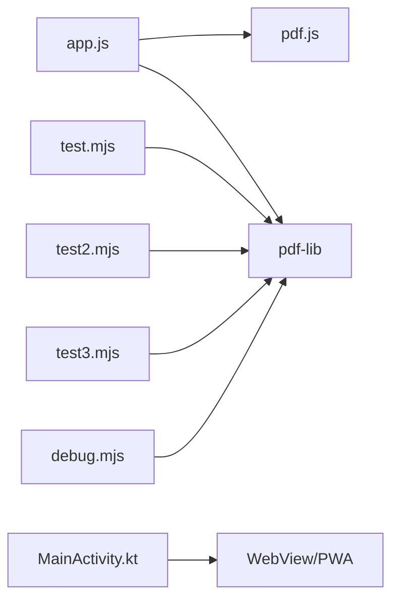

# PDF处理引擎

<cite>
**本文引用的文件**   
- [README.md](file://README.md)
- [app.js](file://pdf-splitter/app.js)
- [test.mjs](file://pdftool_test/test.mjs)
- [test2.mjs](file://pdftool_test/test2.mjs)
- [test3.mjs](file://pdftool_test/test3.mjs)
- [debug.mjs](file://pdftool_test/debug.mjs)
</cite>

## 更新摘要
**所做更改**   
- 更新了模式切换行为章节，详细说明固定列模式和自动模式的增强功能
- 新增了 applyEqualCuts() 函数的技术实现说明
- 更新了 bandsFor() 统一计算方法的描述
- 完善了智能识别算法中精确边界位置存储机制
- 增强了预览渲染与输出生成一致性的说明

## 目录
1. [引言](#引言)
2. [项目结构](#项目结构)
3. [核心组件](#核心组件)
4. [架构总览](#架构总览)
5. [详细组件分析](#详细组件分析)
6. [依赖关系分析](#依赖关系分析)
7. [性能与优化](#性能与优化)
8. [故障排查指南](#故障排查指南)
9. [结论](#结论)
10. [附录：关键算法对照](#附录关键算法对照)

## 引言
本技术文档围绕"试卷切分助手"的PDF处理引擎展开，重点解释前端Web应用如何集成 pdf-lib 与 pdf.js 两大库，完成从文件加载、解析、旋转校正、页面裁剪到最终渲染输出的完整流程。文档还深入剖析旋转校正算法（/Rotate 读取与变换矩阵计算）、白边检测算法（像素扫描、墨迹检测、裁剪框计算）以及预览系统（pdf.js 渲染队列管理、位图缓存与性能优化），并给出关键函数的实现路径与调用时序说明。

**最新更新**：增强了模式切换行为，支持固定列模式的等分布局和自动模式的精确边界定位，通过统一的 bandsFor() 方法确保预览与输出的一致性。

## 项目结构
仓库采用"Web本体 + Android壳工程 + 本地测试脚本"的分层组织方式：
- pdf-splitter：PWA Web本体，包含入口HTML、主逻辑 app.js 以及本地化的 pdf.js、pdf-lib 资源。
- android：Android壳工程，通过 WebView 承载Web本体，并提供原生能力桥接。
- pdftool_test：Node端验证脚本，用于离线校验 pdf-lib 的裁剪、缩放与批量嵌入行为。

图表来源
- [app.js:1-10](file://pdf-splitter/app.js#L1-L10)
- [README.md:13-22](file://README.md#L13-L22)

章节来源
- [README.md:13-22](file://README.md#L13-L22)

## 核心组件
- 文件加载与解析
  - 使用 pdf-lib 加载原始 ArrayBuffer，执行旋转归一化；随后用 pdf.js 打开文档，收集每页显示尺寸。
- 旋转校正
  - 读取 /Rotate，按角度选择预置变换矩阵，将内容顺时针烘焙到显示方向，并移除 /Rotate。
- 页面裁剪与栏数识别
  - 支持三种模式：固定2栏、固定3栏、自动智能识别；可整体平移分割线。
  - **新增**：固定列模式使用 applyEqualCuts() 在所有页面应用等分布局。
  - **新增**：自动模式存储精确边界位置而非仅列数。
- 白边检测
  - 对每栏渲染为位图后扫描像素，寻找最小墨迹矩形，作为实际裁剪框；未检测到墨迹时退回整栏。
- 输出构建
  - 使用 pdf-lib 批量 embedPages 裁剪后的子区域，等比缩放到 A4 纵向页面，添加左右上下留白。
- 预览系统
  - 基于 pdf.js 懒渲染，IntersectionObserver 控制可见区域渲染；已绘制页缓存 canvas，供白边检测复用。

章节来源
- [app.js:13-28](file://pdf-splitter/app.js#L13-L28)
- [app.js:57-103](file://pdf-splitter/app.js#L57-L103)
- [app.js:105-193](file://pdf-splitter/app.js#L105-L193)
- [app.js:412-508](file://pdf-splitter/app.js#L412-L508)
- [app.js:265-329](file://pdf-splitter/app.js#L265-L329)

## 架构总览
下图展示从文件选择到结果产出的端到端流程，以及两个核心库的职责边界。

图表来源
- [app.js:204-239](file://pdf-splitter/app.js#L204-L239)
- [app.js:243-263](file://pdf-splitter/app.js#L243-L263)
- [app.js:265-329](file://pdf-splitter/app.js#L265-L329)
- [app.js:412-508](file://pdf-splitter/app.js#L412-L508)
- [app.js:546-560](file://pdf-splitter/app.js#L546-L560)

## 详细组件分析

### 文件加载与解析流程
- 选择文件后，先以 ArrayBuffer 形式读取，再用 pdf-lib 加载（忽略加密）。
- 执行旋转归一化：若存在非零 /Rotate，则生成新字节流；否则直接复用原字节。
- 用 pdf.js 打开归一化后的字节，收集每页 viewport 尺寸，用于后续栏数判断与预览布局。

图表来源
- [app.js:204-239](file://pdf-splitter/app.js#L204-L239)
- [app.js:243-263](file://pdf-splitter/app.js#L243-L263)

章节来源
- [app.js:204-239](file://pdf-splitter/app.js#L204-L239)
- [app.js:243-263](file://pdf-splitter/app.js#L243-L263)

### 旋转校正算法
- /Rotate 读取：优先从页面节点读取 Rotate；若不存在则尝试父节点；无效值回退为0度。
- 角度规范化：对任意角度取模并归一到 {0, 90, 180, 270}。
- 变换矩阵：为四个角度分别定义二维仿射矩阵，使内容顺时针旋转到显示方向。
- 烘焙策略：遍历所有页面，embedPage 时传入对应矩阵；若某页带旋转则创建新文档写入；若无旋转则跳过重存，直接复用原字节。

图表来源
- [app.js:68-103](file://pdf-splitter/app.js#L68-L103)

章节来源
- [app.js:68-103](file://pdf-splitter/app.js#L68-L103)

### 页面裁剪与栏数识别

**更新**：增强了模式切换行为，支持更灵活的分割策略。

- **固定列模式**：当用户选择2栏或3栏时，系统使用 `applyEqualCuts(n)` 函数在所有页面上应用等分布局，确保每页都有相同的分割比例。
- **自动模式**：继续执行内容分析，但现在存储精确的边界位置（cuts数组）而不仅仅是列数，提供更精细的控制。
- **统一计算方法**：两种模式都使用 `bandsFor(i, W, H)` 函数计算实际的栏像素矩形，确保预览渲染和最终输出生成的一致性。

图表来源
- [app.js:47-67](file://pdf-splitter/app.js#L47-L67)
- [app.js:140-151](file://pdf-splitter/app.js#L140-L151)
- [app.js:546-560](file://pdf-splitter/app.js#L546-L560)

章节来源
- [app.js:47-67](file://pdf-splitter/app.js#L47-L67)
- [app.js:140-151](file://pdf-splitter/app.js#L140-L151)
- [app.js:546-560](file://pdf-splitter/app.js#L546-L560)

### 白边检测算法
- 像素扫描 scanInk：逐行扫描RGBA数据，阈值低于240视为墨迹；记录最小/最大x/y，转换为PDF坐标并加入TRIM_PAD余量。
- 分条扫描 scanBands：对每个band在canvas上截取图像数据，调用scanInk得到墨迹框；再与band边界求交，过滤过小框。
- 预览复用 paintedPreview：若该页已在预览中绘制过，直接复用其canvas，避免重复栅格化。
- 兜底渲染：若无可复用位图，则按需渲染一页到临时canvas，完成后释放内存。

图表来源
- [app.js:109-151](file://pdf-splitter/app.js#L109-L151)
- [app.js:153-193](file://pdf-splitter/app.js#L153-L193)

章节来源
- [app.js:109-151](file://pdf-splitter/app.js#L109-L151)
- [app.js:153-193](file://pdf-splitter/app.js#L153-L193)

### 预览系统与渲染队列
- 懒渲染：使用 IntersectionObserver 监听可视区域，仅渲染进入视口的页面；设置 rootMargin 提前加载。
- 渲染状态：每个预览项维护 rendered/painted 标记；renderItem 负责创建viewport、设置canvas尺寸并调用 page.render。
- 位图缓存：painted 为 true 表示位图可用，trimBands 可直接复用，避免二次栅格化。
- 处理期间让路：当 state.busy 为真时，IntersectionObserver 不触发渲染，交由 renderVisiblePending 在处理结束后补渲染。

图表来源
- [app.js:265-329](file://pdf-splitter/app.js#L265-L329)
- [app.js:153-193](file://pdf-splitter/app.js#L153-L193)

章节来源
- [app.js:265-329](file://pdf-splitter/app.js#L265-L329)
- [app.js:153-193](file://pdf-splitter/app.js#L153-L193)

### 输出构建与保存
- 批量嵌入：收集所有栏的裁剪框 bbs，调用 out.embedPages(embedList, bbs) 一次批量嵌入，减少复制开销。
- A4缩放：每栏独立计算等比缩放因子 s=min((A4W-2*marginX)/emb.width, (A4H-2*marginY)/emb.height)，居中放置。
- 进度反馈：分段更新进度条，并在关键步骤 await tick() 让出UI线程。
- 保存与导出：out.save({useObjectStreams:true}) 生成二进制，转为Blob/ObjectURL；Android环境下走 PdfShell 原生通道。

图表来源
- [app.js:412-508](file://pdf-splitter/app.js#L412-L508)

章节来源
- [app.js:412-508](file://pdf-splitter/app.js#L412-L508)

## 依赖关系分析
- Web端依赖
  - pdf.js：负责解析与渲染，提供 viewport、getDocument、page.render 等API。
  - pdf-lib：负责PDF结构操作，包括 load、create、embedPage/embedPages、addPage、drawPage、save。
- Android壳依赖
  - MainActivity.kt 通过 WebViewAssetLoader 提供本地资源访问，并通过 PdfShell 桥接保存/分享。
- 测试脚本依赖
  - Node端脚本使用 pdf-lib 进行离线验证，覆盖基础裁剪、批量嵌入等行为。

图表来源
- [app.js:1-10](file://pdf-splitter/app.js#L1-L10)
- [test.mjs:1-56](file://pdftool_test/test.mjs#L1-L56)
- [test2.mjs:1-48](file://pdftool_test/test2.mjs#L1-L48)
- [test3.mjs:1-57](file://pdftool_test/test3.mjs#L1-L57)
- [debug.mjs:1-36](file://pdftool_test/debug.mjs#L1-L36)

章节来源
- [app.js:1-10](file://pdf-splitter/app.js#L1-L10)
- [test.mjs:1-56](file://pdftool_test/test.mjs#L1-L56)
- [test2.mjs:1-48](file://pdftool_test/test2.mjs#L1-L48)
- [test3.mjs:1-57](file://pdftool_test/test3.mjs#L1-L57)
- [debug.mjs:1-36](file://pdftool_test/debug.mjs#L1-L36)

## 性能与优化
- 预览复用：已绘制的页面直接复用canvas，避免重复栅格化；同一页不会被pdf.js渲染两遍。
- 懒渲染：IntersectionObserver 控制渲染范围，减少首屏压力。
- 批量化嵌入：使用 embedPages 一次性嵌入多个子区域，减少对象复制与I/O。
- 内存回收：临时canvas在处理后立即清空宽高，降低大扫描件内存占用。
- UI线程让渡：关键步骤使用 await tick() 让出事件循环，保证进度条与交互流畅。
- **新增**：统一的 bandsFor() 计算方法避免了重复计算，提升模式切换时的响应速度。

[本节为通用性能建议，不直接分析具体文件]

## 故障排查指南
- 无法打开PDF
  - 可能原因：加密PDF、损坏文件或浏览器环境限制。
  - 处理：提示去除密码；捕获异常并显示错误信息。
- 预览空白或卡顿
  - 可能原因：worker加载失败、内存不足、IntersectionObserver不可用。
  - 处理：降级为主线程渲染；检查根容器尺寸；必要时禁用白边检测。
- 白边检测异常
  - 可能原因：阈值过低导致误裁；图片分辨率过低；跨栏文字被截断。
  - 处理：调整TRIM_PAD；关闭白边检测；确认分割线与shift设置合理。
- 输出方向错误
  - 可能原因：/Rotate未正确烘焙；坐标体系不一致。
  - 处理：确保 normalizeRotation 已执行；核对 ROT_MATRIX 与页面宽高交换逻辑。
- **新增**：模式切换问题
  - 可能原因：applyEqualCuts() 或 detectAllCols() 执行异常。
  - 处理：检查 state.cuts 数组是否正确初始化；确认 bandsFor() 计算逻辑正常。

章节来源
- [app.js:234-239](file://pdf-splitter/app.js#L234-L239)
- [app.js:497-508](file://pdf-splitter/app.js#L497-L508)
- [app.js:546-560](file://pdf-splitter/app.js#L546-L560)

## 结论
本PDF处理引擎通过 pdf-lib 与 pdf.js 的协同工作，实现了从旋转校正、栏数识别、白边检测到A4输出的一体化流程。**最新增强**了模式切换行为，支持固定列模式的等分布局和自动模式的精确边界定位，通过统一的 bandsFor() 方法确保预览与输出的一致性。旋转校正通过预置变换矩阵将 /Rotate 烘焙进内容，确保预览与裁剪坐标系一致；白边检测基于像素扫描与分条裁剪，兼顾精度与性能；预览系统通过懒渲染与位图缓存显著降低渲染成本。整体方案在移动端与浏览器环境中均具备良好可用性。

[本节为总结性内容，不直接分析具体文件]

## 附录：关键算法对照

### normalizeRotation 函数要点
- 读取 /Rotate：优先页面节点，其次父节点；无效值回退为0。
- 角度归一化：对任意角度取模并限定为 {0, 90, 180, 270}。
- 变换矩阵：为四个角度分别定义二维仿射矩阵，使内容顺时针旋转到显示方向。
- 烘焙策略：若存在旋转，创建新文档并逐个页面 embedPage + addPage + drawPage；若无旋转，直接返回 null 让调用方复用原字节。

章节来源
- [app.js:68-103](file://pdf-splitter/app.js#L68-L103)

### scanInk 算法要点
- 输入：ImageData.data（RGBA）、图像宽w、高h、缩放scale、水平偏移ox。
- 扫描策略：逐行扫描，若任一通道小于240视为墨迹；记录最小/最大x/y。
- 坐标转换：将像素坐标转换为PDF点坐标，并加入TRIM_PAD容差。
- 返回值：返回 {left,right,top,bottom}；若未检测到墨迹返回 null。

章节来源
- [app.js:109-132](file://pdf-splitter/app.js#L109-L132)

### trimBands 函数要点
- 预览复用：若该页已绘制，直接复用canvas；否则按需渲染一页到临时canvas。
- 分条扫描：对每个band截取图像数据，调用 scanInk 得到墨迹框。
- 边界合并：与band边界求交，过滤过小框；返回每栏的最终裁剪框。
- 错误处理：渲染失败时返回空框数组，避免中断整体流程。

章节来源
- [app.js:153-193](file://pdf-splitter/app.js#L153-L193)

### applyEqualCuts 函数要点（新增）
- 功能：为所有页面应用等分布局的分割线。
- 实现：遍历所有页面，为每页生成 equalCuts(n) 的结果，其中 n 为目标列数。
- 使用场景：当用户选择固定2栏或3栏模式时调用。
- 效果：确保所有页面都有相同比例的分割线，便于批量处理。

章节来源
- [app.js:149-151](file://pdf-splitter/app.js#L149-L151)

### bandsFor 统一计算方法要点（增强）
- 功能：根据 cuts 数组和全局 shift 计算每页各栏的实际像素矩形。
- 统一性：固定列模式和自动模式共用此方法，确保预览与输出一致性。
- 计算逻辑：考虑 cuts 比例、全局 shift 偏移、边界约束，生成 bounds 数组。
- 返回值：返回 bands 数组，包含每栏的 left、right、bottom、top 坐标。

章节来源
- [app.js:57-67](file://pdf-splitter/app.js#L57-L67)

### detectCutsFromCanvas 智能识别算法要点
- 输入：canvas上下文、画布宽高。
- 检测策略：①优先找竖线（含断续但贯穿上下的分隔线）②没竖线按空白沟③窄边条并入相邻栏。
- 输出：返回 cuts 数组，包含精确的分割线位置比例。
- 智能特性：自动识别2栏或3栏布局，处理边缘情况。

章节来源
- [app.js:82-119](file://pdf-splitter/app.js#L82-L119)