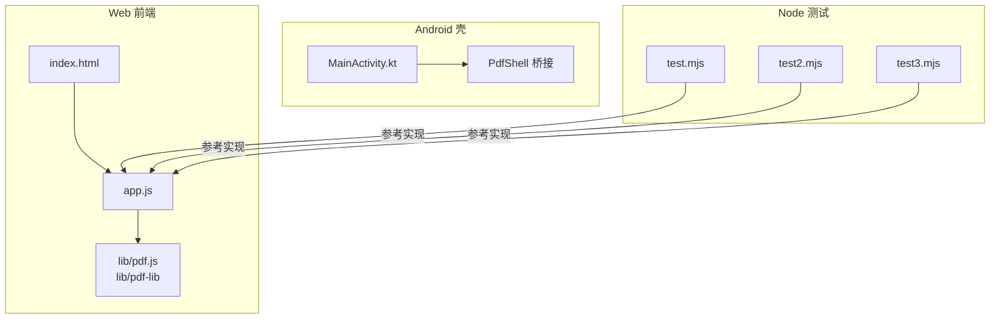
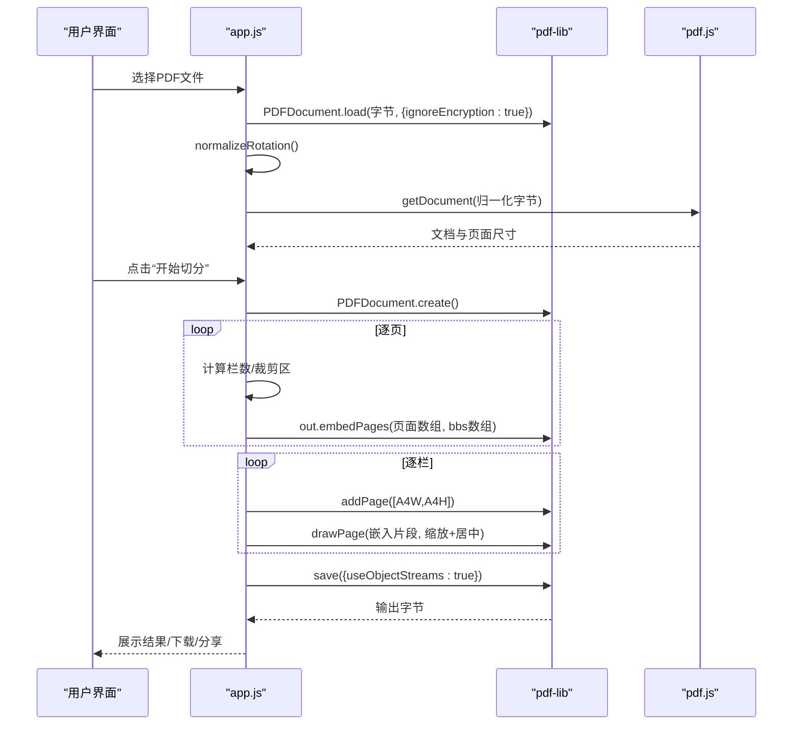
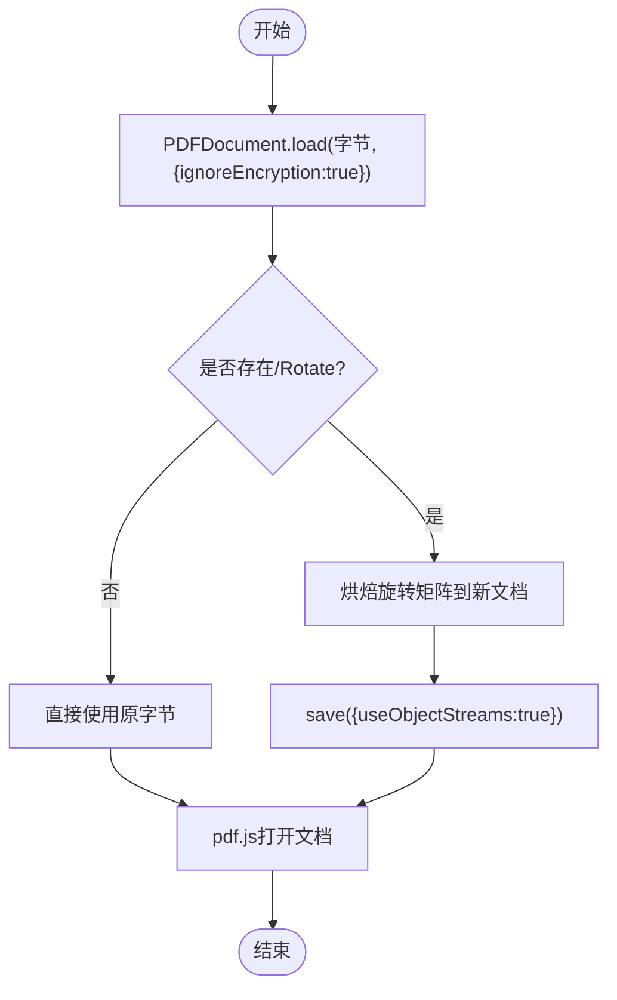
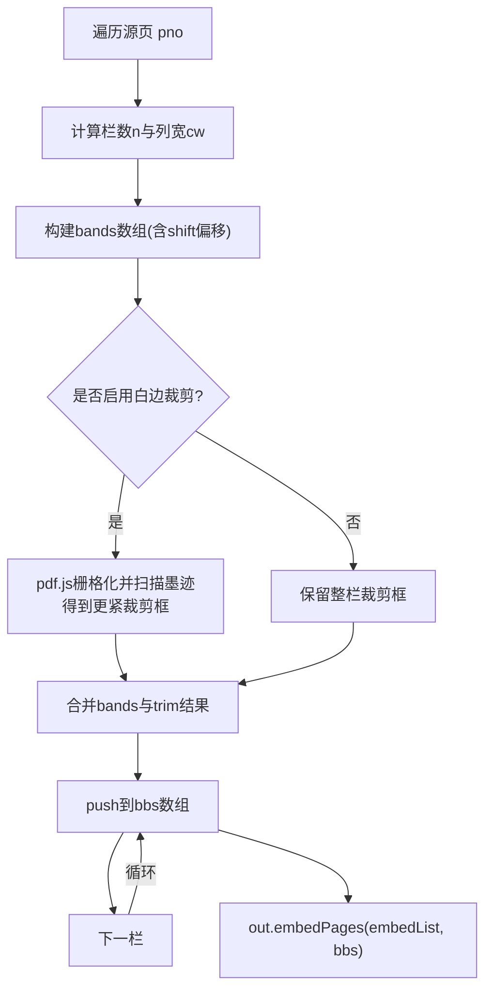
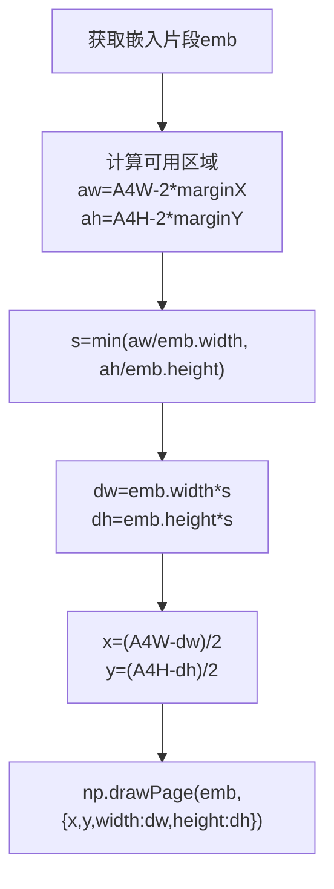
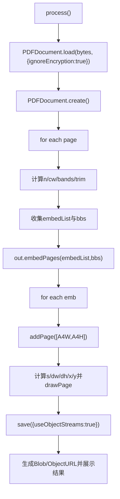
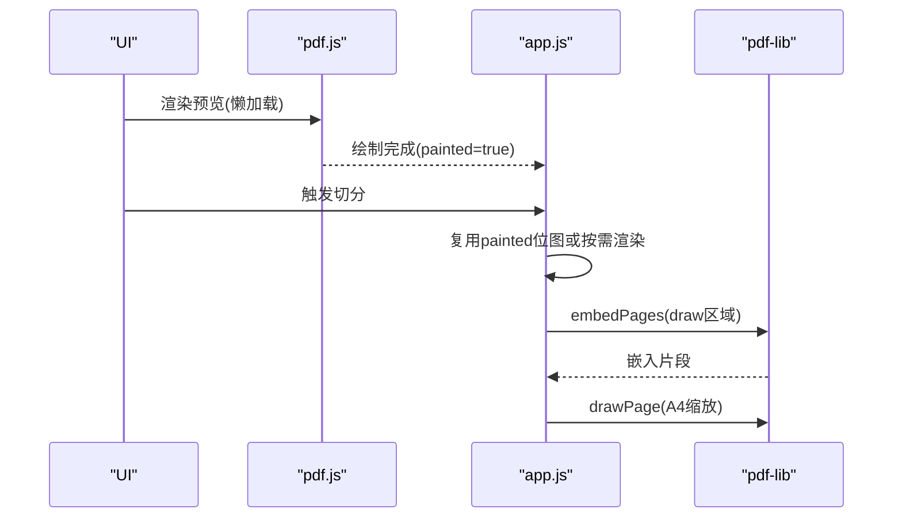
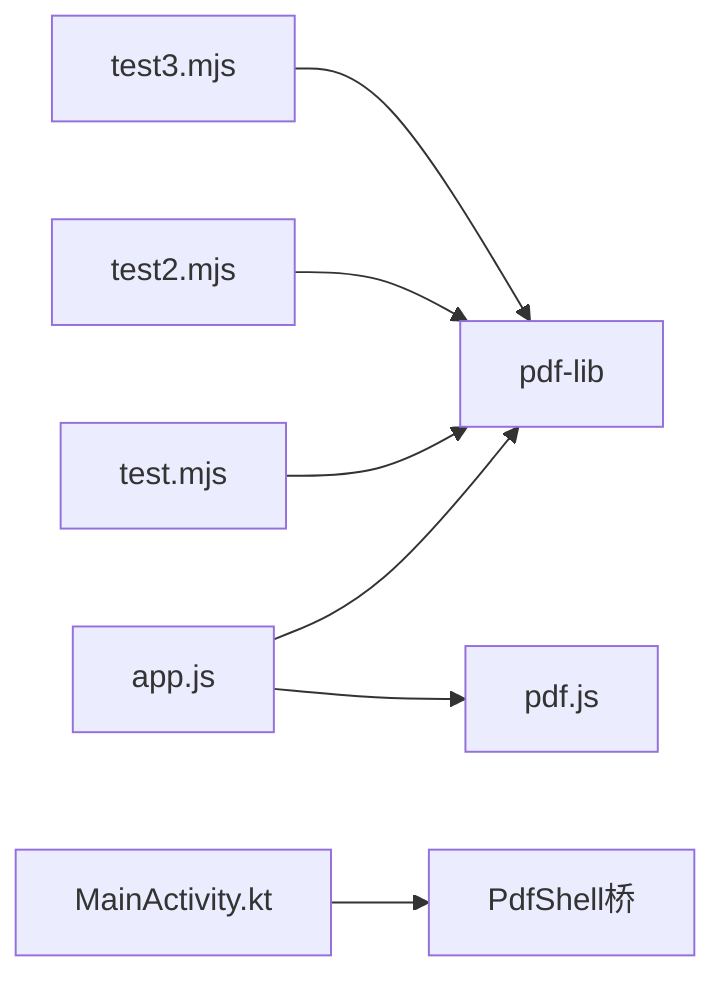

# pdf-lib集成方案

<cite>
**本文引用的文件**   
- [README.md](file://README.md)
- [app.js](file://pdf-splitter/app.js)
- [test.mjs](file://pdftool_test/test.mjs)
- [test2.mjs](file://pdftool_test/test2.mjs)
- [test3.mjs](file://pdftool_test/test3.mjs)
</cite>

## 目录
1. [引言](#引言)
2. [项目结构](#项目结构)
3. [核心组件](#核心组件)
4. [架构总览](#架构总览)
5. [详细组件分析](#详细组件分析)
6. [依赖关系分析](#依赖关系分析)
7. [性能与优化](#性能与优化)
8. [故障排查](#故障排查)
9. [结论](#结论)
10. [附录：示例与最佳实践](#附录示例与最佳实践)

## 引言
本技术文档围绕仓库中的“试卷切分助手”展开，聚焦于如何使用 pdf-lib 完成 PDF 的加载、旋转归一化、按栏裁剪、等比缩放至 A4 页面以及最终保存。同时说明与 pdf.js 的协作模式：pdf.js 负责解析与预览，pdf-lib 负责按栏裁剪并生成输出 PDF。文档重点解释 PDFDocument 初始化流程、embedPages 批量嵌入机制、页面缩放与定位算法、process 函数的完整处理链路，以及 useObjectStreams 的性能优化效果。

## 项目结构
- pdf-splitter：Web 本体（PWA），包含 index.html、app.js 以及本地化的 pdf.js 与 pdf-lib 资源，不依赖 CDN。
- android：Android 壳工程，通过 WebView 承载 Web 应用，并提供文件选择、结果保存与分享等原生能力。
- pdftool_test：Node.js 侧的验证脚本，演示使用 pdf-lib 进行分页、裁剪、缩放与保存的多种写法。

图表来源
- [README.md:13-22](file://README.md#L13-L22)
- [app.js:1-11](file://pdf-splitter/app.js#L1-L11)

章节来源
- [README.md:13-22](file://README.md#L13-L22)

## 核心组件
- PDF 加载与旋转归一化：在浏览器端先通过 pdf-lib 加载原始字节，随后对带 /Rotate 的页面进行内容级旋转烘焙，保证后续预览与裁剪坐标一致。
- 栏数检测与分割：根据页面宽高比自动判断 2 栏或 3 栏，支持手动覆盖；计算每栏裁剪区域。
- 白边裁剪：可选地基于 pdf.js 渲染位图扫描墨迹，得到更紧凑的裁剪框，再等比放入 A4。
- 批量嵌入与缩放：将各栏作为独立页面嵌入目标文档，按可用区域等比缩放并居中绘制到 A4。
- 输出与保存：使用 useObjectStreams 压缩对象流，生成最终 PDF 供下载或分享。

章节来源
- [app.js:57-103](file://pdf-splitter/app.js#L57-L103)
- [app.js:105-193](file://pdf-splitter/app.js#L105-L193)
- [app.js:412-508](file://pdf-splitter/app.js#L412-L508)

## 架构总览
整体流程分为三个阶段：
1. 输入阶段：读取 ArrayBuffer，调用 PDFDocument.load 并忽略加密标记，随后执行旋转归一化。
2. 处理阶段：遍历源页，计算栏数与裁剪区域，构建 embedPages 参数数组，批量嵌入页面片段。
3. 输出阶段：为每个嵌入片段创建新 A4 页面，计算缩放因子并居中绘制，最后以 useObjectStreams 保存。

图表来源
- [app.js:204-239](file://pdf-splitter/app.js#L204-L239)
- [app.js:412-508](file://pdf-splitter/app.js#L412-L508)

## 详细组件分析

### PDFDocument 初始化与 ignoreEncryption
- 入口：loadFile 中读取文件为 ArrayBuffer，调用 PDFDocument.load(ab.slice(0), { ignoreEncryption: true })。
- ignoreEncryption 的作用：允许跳过密码校验继续加载，便于后续统一做旋转归一化；若仍失败则提示用户先去除密码。
- 旋转归一化：normalizeRotation 会检查每页是否带 /Rotate，若有则用变换矩阵把内容顺时针旋转到显示方向，并写入新文档；若无旋转则直接复用原字节，避免多余重存。

图表来源
- [app.js:204-239](file://pdf-splitter/app.js#L204-L239)
- [app.js:82-103](file://pdf-splitter/app.js#L82-L103)

章节来源
- [app.js:204-239](file://pdf-splitter/app.js#L204-L239)
- [app.js:82-103](file://pdf-splitter/app.js#L82-L103)

### embedPages 批量嵌入机制与 bbs 数组
- 目的：将一页多栏的内容分别作为独立页面嵌入，减少重复复制开销。
- bbs 数组构建：
  - 先按页面宽高比计算栏数 n，得到每栏宽度 cw。
  - 对每一栏 k，构造 { left: x0, bottom: y0, right: x1, top: y1 }，其中 x0/k*cw + shiftPx，x1 = x0 + cw；y0/y1 默认取整栏高度，若启用白边裁剪则替换为扫描得到的更紧框。
- 批量调用：out.embedPages(embedList, bbs)，返回嵌入片段数组 embs，后续逐一绘制到 A4 页面。

图表来源
- [app.js:427-457](file://pdf-splitter/app.js#L427-L457)
- [app.js:109-151](file://pdf-splitter/app.js#L109-L151)

章节来源
- [app.js:427-457](file://pdf-splitter/app.js#L427-L457)
- [app.js:109-151](file://pdf-splitter/app.js#L109-L151)

### 页面缩放与定位算法
- A4 常量：A4W = 595.276，A4H = 841.89（单位：点）。
- margin 处理：左右 marginX、上下 marginY（毫米）转换为点（mm2pt = 72/25.4），得到可用区域 aw = A4W - 2*marginX，ah = A4H - 2*marginY。
- 缩放因子：s = min(aw / emb.width, ah / emb.height)，确保嵌入内容宽高都不超出可用区。
- 定位：dw = emb.width * s，dh = emb.height * s；绘制位置 x = (A4W - dw)/2，y = (A4H - dh)/2，实现水平垂直居中。

图表来源
- [app.js:462-477](file://pdf-splitter/app.js#L462-L477)

章节来源
- [app.js:462-477](file://pdf-splitter/app.js#L462-L477)

### process 函数完整流程
process 是切分的核心异步函数，主要步骤如下：
1. 状态保护与进度初始化：防止重复处理，禁用按钮，更新进度条。
2. 加载源文档：再次调用 PDFDocument.load(state.bytes.slice(0), { ignoreEncryption: true })。
3. 创建输出文档：PDFDocument.create()。
4. 遍历源页：
   - 获取页面尺寸 W/H，计算栏数 n 与列宽 cw。
   - 考虑 shift 偏移，构建 bands 数组。
   - 若启用白边裁剪，调用 trimBands 得到更紧裁剪框。
   - 将每栏加入 embedList 与 bbs。
5. 批量嵌入：await out.embedPages(embedList, bbs)。
6. 缩放绘制：为每个嵌入片段新建 A4 页面，计算缩放与居中位置后绘制。
7. 保存输出：out.save({ useObjectStreams: true })，生成 Blob 并创建 ObjectURL 供下载/分享。

图表来源
- [app.js:412-508](file://pdf-splitter/app.js#L412-L508)

章节来源
- [app.js:412-508](file://pdf-splitter/app.js#L412-L508)

### 与 pdf.js 的协作模式
- 预览：使用 pdf.js 渲染页面到 canvas，用于展示切分线与标签，同时缓存已绘制的位图以便白边裁剪复用。
- 白边裁剪：优先复用已绘制位图，否则按需渲染一次，扫描墨迹得到更紧裁剪框。
- 坐标一致性：旋转归一化后，pdf.js viewport 与 pdf-lib 的坐标体系一致，避免预览与输出不一致。

图表来源
- [app.js:265-329](file://pdf-splitter/app.js#L265-L329)
- [app.js:153-193](file://pdf-splitter/app.js#L153-L193)

章节来源
- [app.js:265-329](file://pdf-splitter/app.js#L265-L329)
- [app.js:153-193](file://pdf-splitter/app.js#L153-L193)

## 依赖关系分析
- 前端依赖：
  - pdf-lib：PDF 文档创建、加载、页面嵌入与保存。
  - pdf.js：PDF 解析、viewport 与渲染，提供预览与白边扫描。
- Android 壳依赖：
  - WebViewAssetLoader：提供本地资源访问。
  - PdfShell 桥：结果分块 base64 传输、保存到 MediaStore、系统分享。
- Node 测试脚本：
  - test.mjs：演示 copyPages + setMediaBox/setCropBox + embedPages 的组合用法。
  - test2.mjs：演示单页多次 embedPage 的用法。
  - test3.mjs：演示批量 embedPages 的参数构建与 useObjectStreams 保存。

图表来源
- [README.md:67-75](file://README.md#L67-L75)
- [test.mjs:1-56](file://pdftool_test/test.mjs#L1-L56)
- [test2.mjs:1-48](file://pdftool_test/test2.mjs#L1-L48)
- [test3.mjs:1-57](file://pdftool_test/test3.mjs#L1-L57)

章节来源
- [README.md:67-75](file://README.md#L67-L75)
- [test.mjs:1-56](file://pdftool_test/test.mjs#L1-L56)
- [test2.mjs:1-48](file://pdftool_test/test2.mjs#L1-L48)
- [test3.mjs:1-57](file://pdftool_test/test3.mjs#L1-L57)

## 性能与优化
- useObjectStreams：在 normalizeRotation 与 process 的 save 调用中均启用 useObjectStreams:true，可显著减小输出体积，提升 I/O 效率。
- 批量嵌入：使用 embedPages 一次性传入所有页面与裁剪框，使内部 copier 跨栏复用资源，减少重复拷贝开销。
- 预览复用：已绘制的位图直接复用，避免二次栅格化；未预览到的页按需渲染一次，释放 canvas 内存。
- 进度与分片：长任务中使用 tick() 让出主线程，避免阻塞 UI；大文件分块传输给原生层。

章节来源
- [app.js:102-103](file://pdf-splitter/app.js#L102-L103)
- [app.js:459-480](file://pdf-splitter/app.js#L459-L480)
- [app.js:153-193](file://pdf-splitter/app.js#L153-L193)
- [app.js:512-528](file://pdf-splitter/app.js#L512-L528)

## 故障排查
- 无法打开 PDF：可能是加密文件，需先去除密码；代码中 catch 分支会提示错误信息。
- 预览卡顿：大量扫描件需要栅格化，属于预期耗时；可通过勾选“裁掉白边”前的预览缓存来减少重复渲染。
- 输出异常：检查 margin 设置是否过大导致内容过小；确认栏数识别是否正确（比例阈值 1.85 与 1.2）。
- 移动端保存失败：WebView 环境走 PdfShell 桥，确保 begin/chunk/save 流程正确；分享失败时回退到下载。

章节来源
- [app.js:234-238](file://pdf-splitter/app.js#L234-L238)
- [app.js:497-507](file://pdf-splitter/app.js#L497-L507)
- [app.js:530-552](file://pdf-splitter/app.js#L530-L552)

## 结论
该方案通过 pdf.js 与 pdf-lib 的协作，实现了从多栏拼版试卷到标准 A4 页面的自动化切分与缩放。关键优化点包括旋转归一化、白边裁剪、批量嵌入与 useObjectStreams 压缩。对于大文件与移动端场景，提供了预览复用、进度反馈与原生桥接的完整体验。

## 附录：示例与最佳实践

### 示例一：Node 端基础切分（copyPages + setMediaBox/setCropBox）
- 适用场景：快速验证分页与裁剪逻辑。
- 关键点：
  - 使用 copyPages 复制源页，setMediaBox/setCropBox 指定裁剪区域。
  - 再通过 embedPages 将裁剪后的页面嵌入新文档。
  - 最后 addPage + drawPage 缩放至 A4。

章节来源
- [test.mjs:18-54](file://pdftool_test/test.mjs#L18-L54)

### 示例二：Node 端逐页 embedPage
- 适用场景：简单逐页裁剪，无需批量参数构建。
- 关键点：
  - 对每栏构造 bb 对象，调用 embedPage(sp, bb)。
  - 新增 A4 页面并缩放绘制。

章节来源
- [test2.mjs:18-46](file://pdftool_test/test2.mjs#L18-L46)

### 示例三：Node 端批量 embedPages
- 适用场景：高效批量嵌入，复用资源。
- 关键点：
  - 预先构建 embedPagesArg 与 bbs 数组。
  - 一次调用 embedPages 获得 embs。
  - 使用 useObjectStreams 保存。

章节来源
- [test3.mjs:18-55](file://pdftool_test/test3.mjs#L18-L55)

### 最佳实践清单
- 始终在 load 时传入 ignoreEncryption:true，并在捕获异常后提示用户去除密码。
- 优先使用 embedPages 批量嵌入，减少重复拷贝与内存峰值。
- 合理设置 marginX/marginY，避免内容过小或溢出。
- 在长任务中穿插 tick() 让出主线程，保持 UI 响应。
- 使用 useObjectStreams:true 保存，减小输出体积。