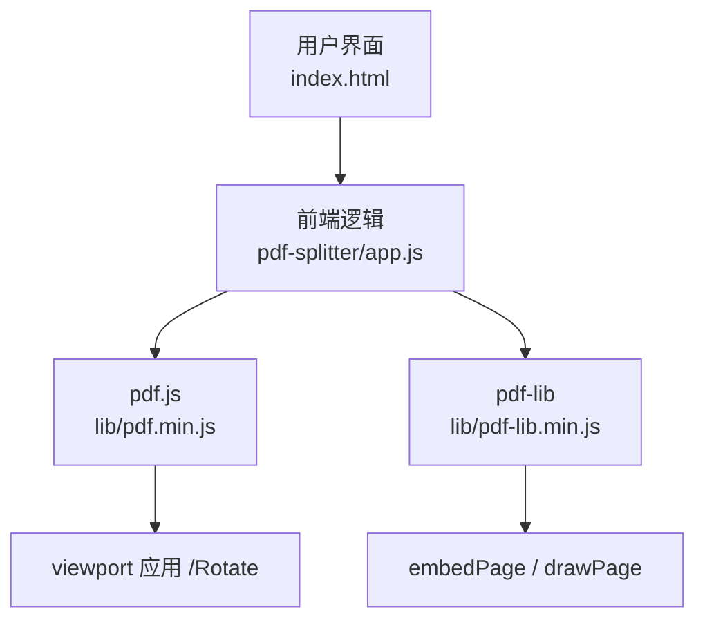
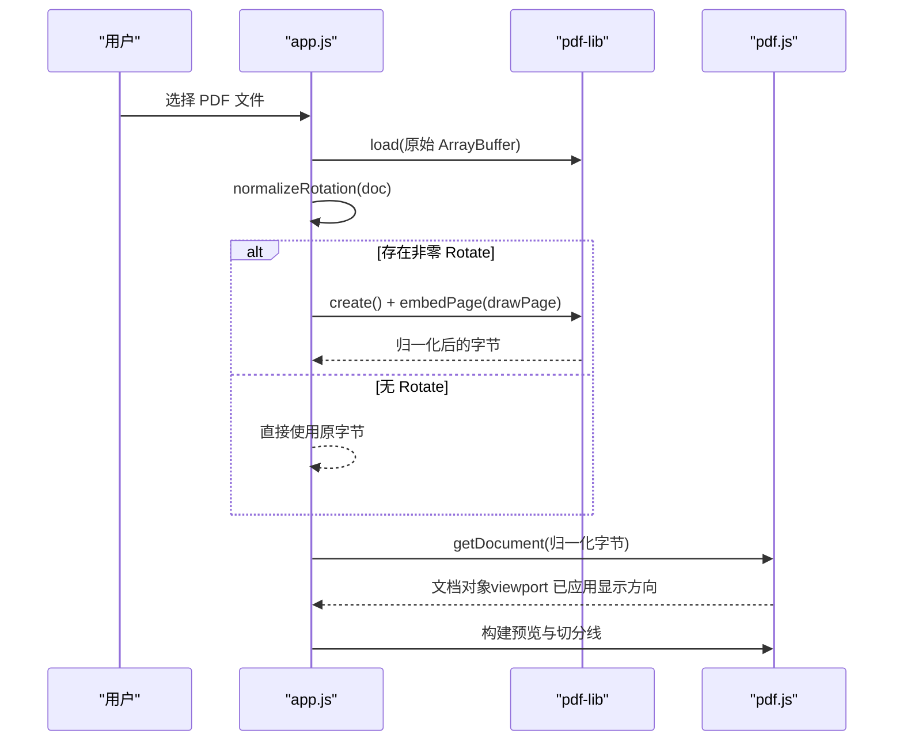
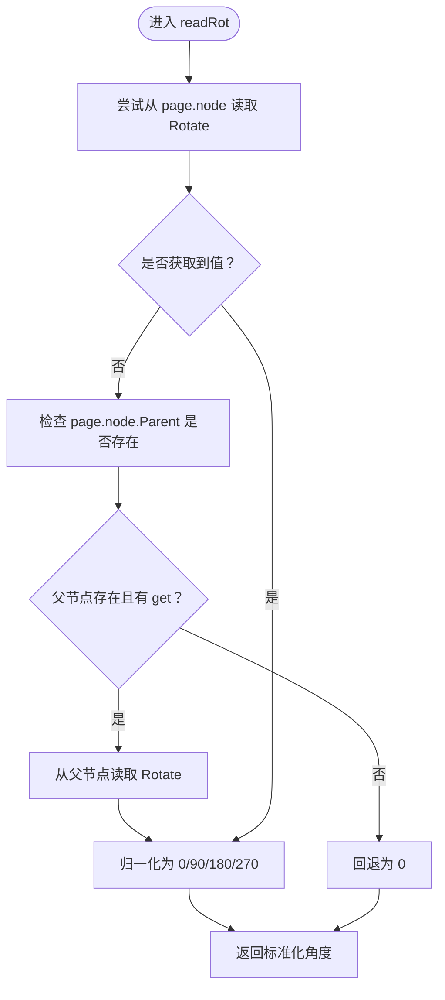
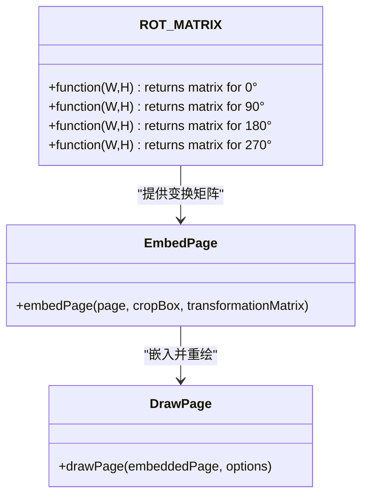
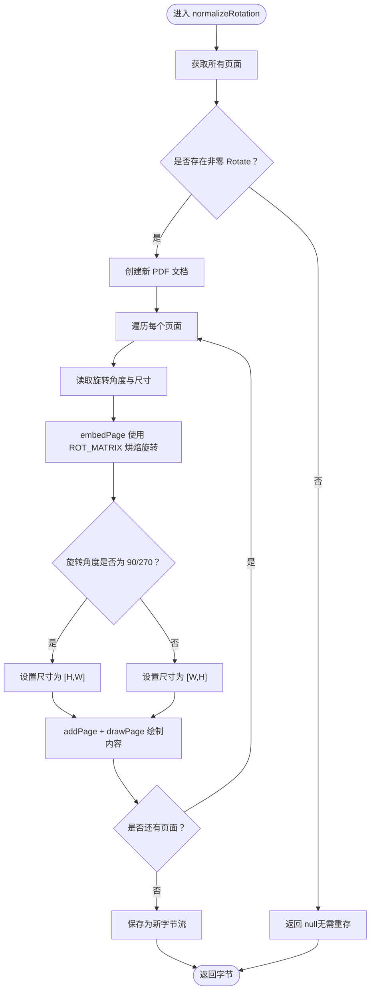
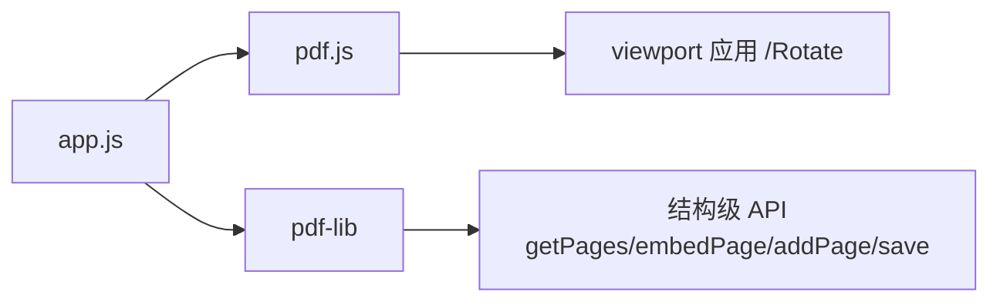

# 旋转校正算法

<cite>
**本文引用的文件**   
- [app.js](file://pdf-splitter/app.js)
- [README.md](file://README.md)
</cite>

## 目录
1. [引言](#引言)
2. [项目结构](#项目结构)
3. [核心组件](#核心组件)
4. [架构总览](#架构总览)
5. [详细组件分析](#详细组件分析)
6. [依赖关系分析](#依赖关系分析)
7. [性能考虑](#性能考虑)
8. [故障排查指南](#故障排查指南)
9. [结论](#结论)

## 引言
本技术文档聚焦于 PDF 旋转校正算法，目标是解释以下关键点：
- 如何从 PDF 页面节点及其父节点中读取 `/Rotate` 属性。
- 四个标准旋转角度（0°、90°、180°、270°）对应的坐标变换矩阵与几何含义。
- `normalizeRotation` 的完整处理流程：检测是否需要旋转、嵌入页面、重新绘制以及输出字节。
- 为什么必须在 pdf-lib 中“烘焙”旋转，而不能依赖 pdf.js 的 viewport；这对预览与输出一致性的影响。
- 代码示例路径，用于定位 ROT_MATRIX 数组定义与 readRot 函数的实现细节。

该算法位于 Web 应用的前端逻辑中，使用 pdf-lib 对 PDF 进行结构级处理，使用 pdf.js 负责解析与预览渲染。

**章节来源**
- [README.md:77-81](file://README.md#L77-L81)

## 项目结构
本项目是一个以网页为核心的 PWA，Android 壳工程仅承担 WebView、文件选择与结果保存等原生能力。PDF 旋转校正逻辑全部在网页侧实现，核心文件如下：
- `pdf-splitter/app.js`：前端业务逻辑，包含旋转校正、白边裁剪、切分与导出等。
- `pdf-splitter/lib/pdf.min.js`：pdf.js 库，用于解析与预览。
- `pdf-splitter/lib/pdf-lib.min.js`：pdf-lib 库，用于结构级操作与生成新 PDF。

**图表来源**
- [app.js:7-10](file://pdf-splitter/app.js#L7-L10)
- [app.js:216-224](file://pdf-splitter/app.js#L216-L224)

**章节来源**
- [README.md:13-23](file://README.md#L13-L23)
- [app.js:6-10](file://pdf-splitter/app.js#L6-L10)

## 核心组件
旋转校正相关核心组件包括：
- `ROT_MATRIX`：按旋转角度返回 pdf-lib 所需的变换矩阵函数。
- `readRot(page)`：从页面节点或父节点读取 `/Rotate`，并归一化为 0/90/180/270。
- `normalizeRotation(doc)`：遍历所有页面，必要时创建新文档，嵌入并重绘页面，最终输出字节。

这些组件共同保证：预览（pdf.js）与输出（pdf-lib）在同一套显示坐标系下工作，避免横倒或错位。

**章节来源**
- [app.js:57-103](file://pdf-splitter/app.js#L57-L103)

## 架构总览
下图展示加载 PDF 后，旋转校正与后续预览、切分的整体流程。重点在于：先通过 pdf-lib 烘焙旋转，再交给 pdf.js 预览，确保两者坐标一致。

**图表来源**
- [app.js:216-224](file://pdf-splitter/app.js#L216-L224)
- [app.js:243-263](file://pdf-splitter/app.js#L243-L263)

**章节来源**
- [app.js:216-224](file://pdf-splitter/app.js#L216-L224)
- [app.js:243-263](file://pdf-splitter/app.js#L243-L263)

## 详细组件分析

### 读取 `/Rotate` 的属性机制
`readRot` 的实现遵循以下逻辑：
1. 尝试从当前页面的节点读取 `/Rotate`。
2. 若未找到且页面节点存在父节点，则从父节点读取 `/Rotate`。
3. 将读取到的值转换为数字；若无效则回退为 0。
4. 对角度做模 360 归一化，只接受 90/180/270，否则视为 0。

这种设计兼容某些 PDF 中 `/Rotate` 可能出现在父节点的情况，同时保证异常时不中断流程。

**图表来源**
- [app.js:68-80](file://pdf-splitter/app.js#L68-L80)

**章节来源**
- [app.js:68-80](file://pdf-splitter/app.js#L68-L80)

### 四个旋转矩阵的原理与坐标变换
`ROT_MATRIX` 为每个标准旋转角度提供变换矩阵函数，供 pdf-lib 的 `embedPage` 使用。其几何含义如下：
- 0°：恒等变换，保持原坐标。
- 90°：顺时针旋转 90°，交换宽高并将原点偏移至右上角。
- 180°：顺时针旋转 180°，翻转 x/y 并平移至右下角。
- 270°：顺时针旋转 270°，交换宽高并将原点偏移至左下角。

这些矩阵已经过文本坐标实测核对，确保内容在显示方向上正确对齐。

**图表来源**
- [app.js:61-66](file://pdf-splitter/app.js#L61-L66)
- [app.js:95-98](file://pdf-splitter/app.js#L95-L98)

**章节来源**
- [app.js:61-66](file://pdf-splitter/app.js#L61-L66)

### normalizeRotation 的完整处理流程
`normalizeRotation` 的工作流程如下：
1. 遍历所有页面，调用 `readRot` 判断是否有非零旋转。
2. 如果没有任何页面需要旋转，直接返回 null，让调用方使用原字节，避免不必要的重存。
3. 如果需要旋转：
   - 创建新的 PDF 文档。
   - 对每个页面：
     - 读取旋转角度与页面尺寸。
     - 使用对应矩阵调用 `embedPage`，将内容烘焙进目标坐标。
     - 根据旋转角度决定新页面尺寸（90°/270° 交换宽高）。
     - 添加新页面并绘制嵌入内容。
4. 最后保存为新字节流。

**图表来源**
- [app.js:83-103](file://pdf-splitter/app.js#L83-L103)

**章节来源**
- [app.js:83-103](file://pdf-splitter/app.js#L83-L103)

### 代码示例路径
- ROT_MATRIX 数组定义位置：[app.js:61-66](file://pdf-splitter/app.js#L61-L66)
- readRot 函数实现位置：[app.js:68-80](file://pdf-splitter/app.js#L68-L80)
- normalizeRotation 函数实现位置：[app.js:83-103](file://pdf-splitter/app.js#L83-L103)

**章节来源**
- [app.js:61-66](file://pdf-splitter/app.js#L61-L66)
- [app.js:68-80](file://pdf-splitter/app.js#L68-L80)
- [app.js:83-103](file://pdf-splitter/app.js#L83-L103)

### 为什么需要在 pdf-lib 中烘焙旋转而不是依赖 pdf.js 的 viewport
- pdf.js 的 viewport 会在渲染时自动应用 `/Rotate`，使预览显示方向正确。
- pdf-lib 的 `getSize()` 与 `embedPage()` 完全忽略 `/Rotate`，因此若不烘焙旋转，预览与裁剪会基于两套不同的坐标系统，导致输出横倒或错位。
- 通过在 pdf-lib 中将 `/Rotate` 顺时针烘焙进内容（使用 `embedPage` 的 transformationMatrix），并在 90°/270° 时交换宽高、移除 `/Rotate`，可确保预览、检测栏数、裁剪与输出都在同一套显示坐标中，从而保持一致性。

这一策略直接影响预览与输出的视觉一致性，避免因库差异导致的布局错误。

**章节来源**
- [README.md:77-81](file://README.md#L77-L81)
- [app.js:57-66](file://pdf-splitter/app.js#L57-L66)

## 依赖关系分析
旋转校正模块依赖两个外部库：
- pdf.js：用于解析 PDF 并提供 viewport，渲染预览。
- pdf-lib：用于结构级操作，包括读取页面、嵌入内容、生成新 PDF。

**图表来源**
- [app.js:7-10](file://pdf-splitter/app.js#L7-L10)
- [app.js:216-224](file://pdf-splitter/app.js#L216-L224)

**章节来源**
- [app.js:7-10](file://pdf-splitter/app.js#L7-L10)
- [app.js:216-224](file://pdf-splitter/app.js#L216-L224)

## 性能考虑
- 若无页面带旋转，`normalizeRotation` 直接返回 null，避免一次额外的 PDF 重存，节省 I/O 与内存。
- 烘焙旋转时，逐页嵌入并重绘，适合中等规模文档；对于数百页的大文件，内存峰值偏高，需权衡处理时间。
- 预览位图复用可减少重复栅格化开销，但旋转校正本身仍需在结构层完成，不能仅靠渲染优化。

[本节为通用性能讨论，不直接分析具体文件]

## 故障排查指南
常见问题与定位建议：
- 读取 `/Rotate` 失败：检查页面节点与父节点是否存在，确认 `page.node.get` 与 `parent.get` 可用；异常时回退为 0，不影响流程。
- 输出方向错误：确认是否在 pdf-lib 中烘焙了旋转，而非依赖 pdf.js 的 viewport；检查 ROT_MATRIX 是否正确传入 `embedPage`。
- 页面尺寸异常：确认 90°/270° 时是否交换宽高；检查 `addPage` 的尺寸参数。
- 大文件处理缓慢：注意逐页嵌入与重绘的开销；可考虑分批处理或限制页数。

**章节来源**
- [app.js:68-80](file://pdf-splitter/app.js#L68-L80)
- [app.js:83-103](file://pdf-splitter/app.js#L83-L103)

## 结论
本旋转校正算法通过读取 `/Rotate` 属性、应用标准旋转矩阵、在 pdf-lib 中烘焙旋转，确保了预览与输出的一致性。关键设计点包括：
- 从页面节点与父节点稳健读取 `/Rotate`。
- 使用四个标准角度的变换矩阵精确控制坐标。
- 仅在必要时烘焙旋转，避免不必要的重存。
- 明确区分 pdf.js 的 viewport 与 pdf-lib 的结构 API，避免坐标不一致。

该方案适用于试卷切分等场景，兼顾准确性与性能，并为后续扩展提供了清晰的代码结构。

[本节为总结性内容，不直接分析具体文件]