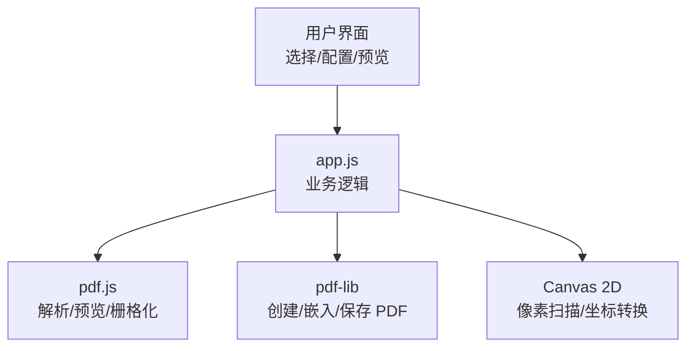
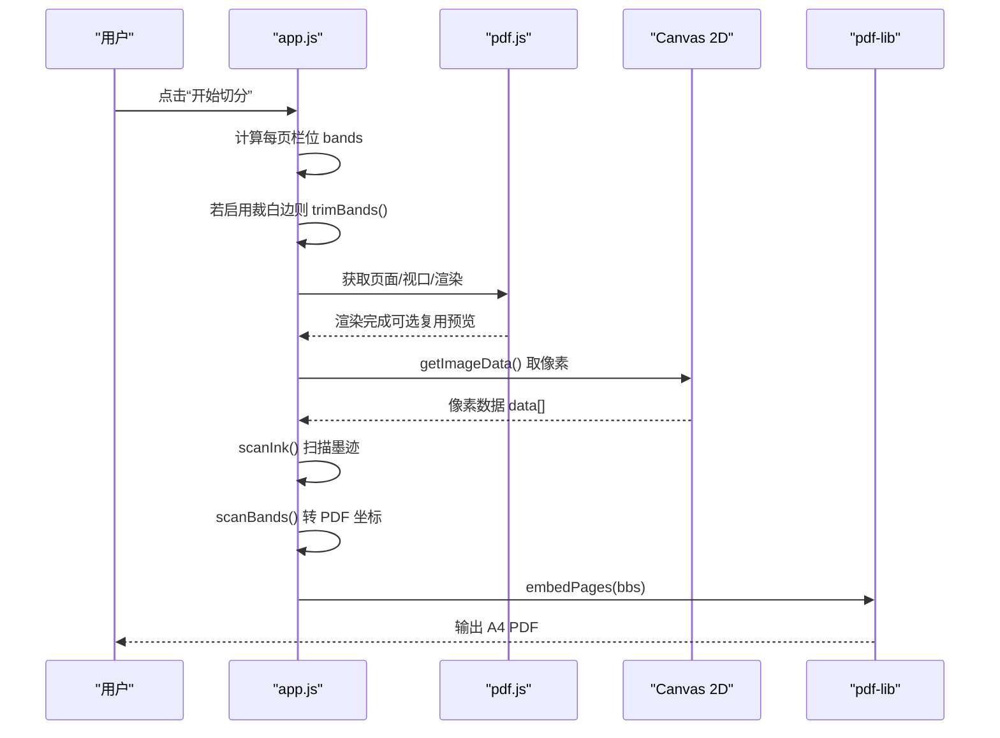
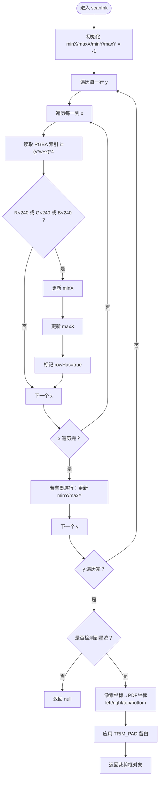
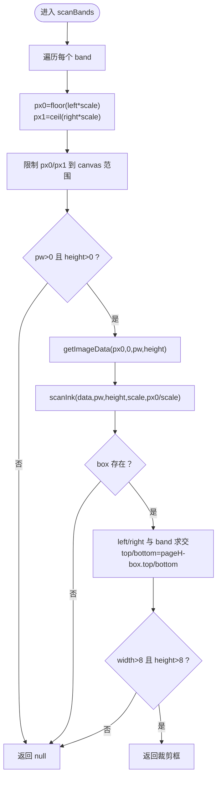
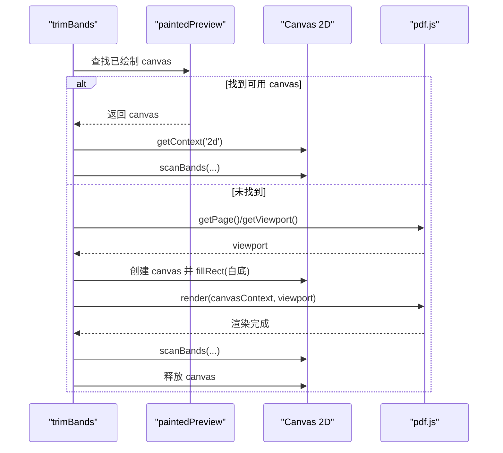
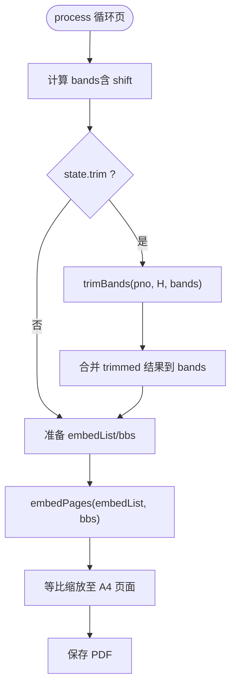
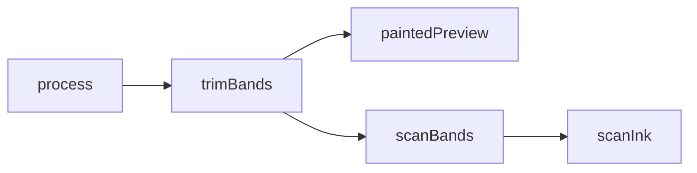

# 白边检测算法

<cite>
**本文引用的文件**   
- [app.js](file://pdf-splitter/app.js)
</cite>

## 目录
1. [引言](#引言)
2. [项目结构](#项目结构)
3. [核心组件](#核心组件)
4. [架构总览](#架构总览)
5. [详细组件分析](#详细组件分析)
6. [依赖关系分析](#依赖关系分析)
7. [性能考量](#性能考量)
8. [故障排查指南](#故障排查指南)
9. [结论](#结论)

## 引言
本技术文档聚焦“试卷切分助手”中的 PDF 白边检测与裁剪逻辑，重点解释以下实现细节：
- `scanInk` 的像素扫描策略：如何遍历位图数据、判定有墨迹像素、维护最小矩形边界。
- 最小矩形框计算：`minX`、`maxX`、`minY`、`maxY` 的更新规则与边界处理。
- `TRIM_PAD` 留白常量：为何需要额外余量以避免削到笔画。
- `scanBands` 的工作流程：将位图检测结果转换为 PDF 坐标系下的裁剪框。
- `paintedPreview` 的缓存复用机制：如何复用已渲染 canvas 位图提升性能。
- 坐标转换与像素访问方式的具体说明（以路径引用代替直接贴代码）。

该功能的目标是在不改变内容语义的前提下，尽可能收紧每栏内容的裁剪区域，从而在输出 A4 页面时获得更大的有效显示面积。

## 项目结构
本项目为 Web PWA + Android WebView 壳工程。PDF 解析与预览使用 pdf.js，PDF 生成与嵌入使用 pdf-lib；白边检测逻辑位于前端主脚本中，通过 Canvas 2D API 读取栅格化后的位图数据进行像素级扫描。

**图表来源**
- [app.js:10-11](file://pdf-splitter/app.js#L10-L11)
- [app.js:105-193](file://pdf-splitter/app.js#L105-L193)

**章节来源**
- [app.js:1-28](file://pdf-splitter/app.js#L1-L28)
- [app.js:10-11](file://pdf-splitter/app.js#L10-L11)

## 核心组件
- `scanInk(data, w, h, scale, ox)`：对单行或整幅位图进行像素扫描，返回 PDF 坐标系下的候选裁剪框。
- `scanBands(ctx, scale, pageH, bands)`：按栏（band）提取位图并调用 `scanInk`，再将结果转换到 PDF 坐标系。
- `paintedPreview(pno)`：从预览列表中查找已绘制完成的 canvas，用于复用位图。
- `trimBands(pno, pageH, bands)`：若可复用预览位图则直接扫描；否则按需渲染一页并扫描，最终返回各栏裁剪框。

这些函数共同构成“白边检测 → 坐标转换 → 裁剪框收敛”的核心链路。

**章节来源**
- [app.js:109-131](file://pdf-splitter/app.js#L109-L131)
- [app.js:134-150](file://pdf-splitter/app.js#L134-L150)
- [app.js:154-161](file://pdf-splitter/app.js#L154-L161)
- [app.js:164-193](file://pdf-splitter/app.js#L164-L193)

## 架构总览
下图展示白边检测在主流程中的位置与关键交互：

**图表来源**
- [app.js:412-461](file://pdf-splitter/app.js#L412-L461)
- [app.js:164-193](file://pdf-splitter/app.js#L164-L193)
- [app.js:109-150](file://pdf-splitter/app.js#L109-L150)

## 详细组件分析

### 像素扫描与最小矩形：`scanInk`
`scanInk` 负责在位图上寻找“有墨迹”的最小包围矩形，并输出 PDF 坐标系的候选裁剪框。其关键要点如下：

- **像素遍历顺序**：逐行 y，再逐列 x，索引按 RGBA 四通道线性展开。
- **墨迹判定阈值**：任一 RGB 通道小于 240 即视为非纯白（接近白色但允许轻微噪点），标记该行存在墨迹。
- **边界更新策略**：
  - `minX`：首次遇到墨迹时初始化，后续取较小值。
  - `maxX`：始终取较大值。
  - `minY`：首次出现有墨迹的行时初始化。
  - `maxY`：持续更新到最后一次有墨迹的行。
- **空页处理**：若未检测到任何墨迹（`minX < 0`），返回 `null`，由上层保留原始整栏。
- **坐标转换与留白**：
  - 先将像素坐标除以 `scale` 得到 PDF 单位坐标，再加上横向偏移 `ox`。
  - 左右方向：左边界用 `minX`，右边界用 `maxX + 1`，保证包含最后一个像素。
  - 上下方向：y 轴向下为正，因此 top/bottom 分别对应 minY/(maxY+1)。
  - 应用 `TRIM_PAD` 作为额外余量，避免裁剪到笔画边缘。

**图表来源**
- [app.js:109-131](file://pdf-splitter/app.js#L109-L131)

**章节来源**
- [app.js:109-131](file://pdf-splitter/app.js#L109-L131)

### 留白策略与 `TRIM_PAD`
- `TRIM_PAD` 是一个以 PDF 点（pt）为单位的常量，表示在最小矩形基础上向外扩展的余量。
- 作用：
  - 避免因像素采样误差或轻微压缩噪声导致笔画被削掉。
  - 让裁剪框略大于“严格最小矩形”，提高视觉完整性。
- 影响范围：
  - 左右方向：left 减 TRIM_PAD，right 加 TRIM_PAD。
  - 上下方向：top 减 TRIM_PAD，bottom 加 TRIM_PAD。
- 注意：
  - 若最终裁剪框过小（宽度或高度小于阈值），会被丢弃，退回整栏。

**章节来源**
- [app.js:107-107](file://pdf-splitter/app.js#L107-L107)
- [app.js:127-131](file://pdf-splitter/app.js#L127-L131)
- [app.js:149-149](file://pdf-splitter/app.js#L149-L149)

### 栏扫描与坐标转换：`scanBands`
`scanBands` 接收一个或多个栏（bands），对每个栏执行以下步骤：

1. **像素区间映射**：
   - 将 PDF 坐标的 left/right 乘以 scale，得到 canvas 像素区间的 px0/px1。
   - 限制在 canvas 范围内，防止越界。
2. **有效性检查**：
   - 若宽度 ≤ 0 或 canvas 高度 ≤ 0，直接返回 null。
3. **像素数据提取**：
   - 使用 `ctx.getImageData(px0, 0, pw, ctx.canvas.height)` 获取该栏的像素数据。
   - 传入 `scanInk` 时附带 `scale` 和 `ox=px0/scale`，以便还原 PDF 坐标。
4. **结果回写与坐标转换**：
   - 将 `scanInk` 返回的 box 与原始 band 做交集：
     - left/right 限制在 band 范围内。
     - bottom/top 根据 PDF 坐标系（原点在左下角）换算：pageH - box.bottom / box.top。
   - 过滤掉过小的裁剪框（宽或高小于阈值），返回 null 交由上层保留整栏。

**图表来源**
- [app.js:134-150](file://pdf-splitter/app.js#L134-L150)

**章节来源**
- [app.js:134-150](file://pdf-splitter/app.js#L134-L150)

### 预览位图复用：`paintedPreview`
`paintedPreview` 提供对已渲染 canvas 的查找与校验：

- **同步性检查**：若当前预览项数量与页面尺寸列表不一致，说明预览与新文件不同步，不复用。
- **绘制状态检查**：仅当 `it.painted` 为真时才认为位图可用。
- **尺寸下限检查**：canvas 宽高均不小于 80，避免极小画布产生不可靠结果。
- **返回值**：符合条件的 canvas 元素，供 `trimBands` 直接使用其 2D 上下文。

这种设计确保同一页不会被 pdf.js 栅格化两遍，显著降低大文件的处理时间。

**章节来源**
- [app.js:154-161](file://pdf-splitter/app.js#L154-L161)

### 裁剪入口：`trimBands`
`trimBands` 是白边检测的统一入口：

- **优先复用**：若 `paintedPreview` 返回有效 canvas，则直接调用 `scanBands`。
- **按需渲染**：否则通过 pdf.js 获取页面、计算与预览一致的 scale，创建临时 canvas 并渲染。
- **内存管理**：渲染完成后立即释放 canvas（宽高置零），避免扫描件位图长期占用内存。
- **错误处理**：渲染失败时记录日志并返回全 null，使上层保留原始整栏。

**图表来源**
- [app.js:154-161](file://pdf-splitter/app.js#L154-L161)
- [app.js:164-193](file://pdf-splitter/app.js#L164-L193)

**章节来源**
- [app.js:164-193](file://pdf-splitter/app.js#L164-L193)

### 主流程集成：`process`
在整体切分流程中，白边检测仅在用户勾选“裁掉页面四周白边”时触发：

- 计算每页栏位 bands（含 shift 微调）。
- 若启用裁白边，调用 `trimBands` 并将返回的裁剪框覆盖原 bands。
- 将 bands 转为 pdf-lib 的嵌入边界 bbs，随后等比缩放至 A4 页面。

**图表来源**
- [app.js:427-461](file://pdf-splitter/app.js#L427-L461)

**章节来源**
- [app.js:427-461](file://pdf-splitter/app.js#L427-L461)

## 依赖关系分析
- `scanInk` 依赖：
  - 像素数组（RGBA）、图像宽高、scale、横向偏移 ox。
- `scanBands` 依赖：
  - Canvas 2D 上下文、scale、页面高度 pageH、bands 列表。
- `paintedPreview` 依赖：
  - 全局预览列表 previewItems、页面尺寸 state.sizes。
- `trimBands` 依赖：
  - paintedPreview、pdf.js 页面接口、Canvas 2D。
- 主流程 `process` 依赖：
  - pdf-lib 的 embedPages、A4 尺寸常量、margin 换算。

**图表来源**
- [app.js:109-193](file://pdf-splitter/app.js#L109-L193)
- [app.js:412-461](file://pdf-splitter/app.js#L412-L461)

**章节来源**
- [app.js:109-193](file://pdf-splitter/app.js#L109-L193)
- [app.js:412-461](file://pdf-splitter/app.js#L412-L461)

## 性能考量
- **预览复用**：通过 `paintedPreview` 复用已渲染 canvas，避免重复栅格化，显著减少大文件处理时间。
- **渲染尺度一致**：`trimBands` 在未复用时采用与预览相同的 scale，保证屏幕内外页面的裁剪边距一致。
- **及时释放内存**：临时 canvas 在扫描后立刻释放宽高，避免扫描件位图长期驻留内存。
- **阈值过滤**：对过小的裁剪框直接丢弃，退回整栏，避免无意义裁剪带来的质量损失。

[本节为通用性能讨论，不直接分析具体代码片段]

## 故障排查指南
- **无法检测到墨迹**：
  - 检查是否启用了白边裁剪（state.trim）。
  - 确认预览 canvas 已绘制完成（`it.painted` 为真）。
  - 检查像素阈值：RGB 任一通道小于 240 才判为墨迹，过于干净的背景可能误判为空页。
- **裁剪框过小或被丢弃**：
  - 若 width 或 height 不大于阈值（例如 8），会返回 null，由上层保留整栏。
  - 可适当调整 `TRIM_PAD` 或放宽阈值（需权衡笔画完整性与铺满度）。
- **坐标异常**：
  - 确认 scale 与 ox 传递正确。
  - 注意 PDF 坐标系 y 轴向上，而 canvas y 轴向下，需在 `scanBands` 中进行换算。
- **内存压力过大**：
  - 确保临时 canvas 在扫描后释放。
  - 避免同时渲染过多页面；利用 IntersectionObserver 懒加载预览。

**章节来源**
- [app.js:109-193](file://pdf-splitter/app.js#L109-L193)
- [app.js:412-461](file://pdf-splitter/app.js#L412-L461)

## 结论
白边检测算法通过像素级扫描与坐标转换，实现了在保持内容完整性的前提下尽可能收紧裁剪框的目标。`scanInk` 提供稳健的最小矩形计算与留白策略，`scanBands` 完成栏级扫描与 PDF 坐标适配，`paintedPreview` 与 `trimBands` 协同实现高效的位图复用与按需渲染。整体方案在保证视觉质量的同时兼顾了移动端内存与性能约束，适合大规模扫描件的高效处理。