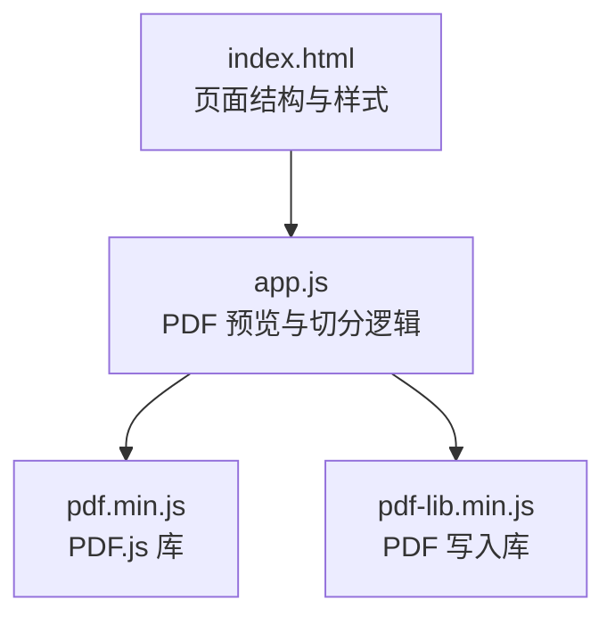
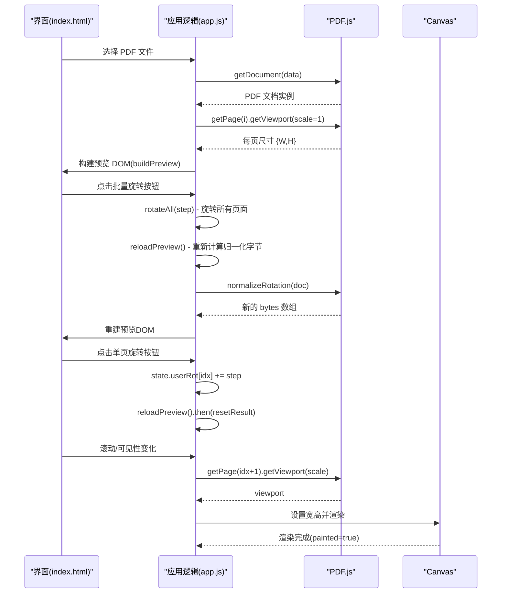
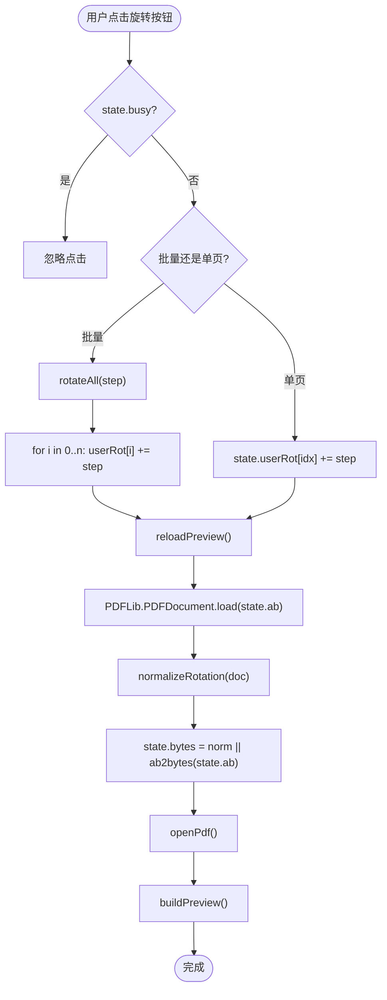
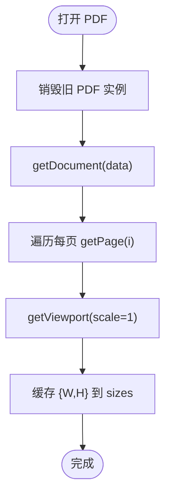
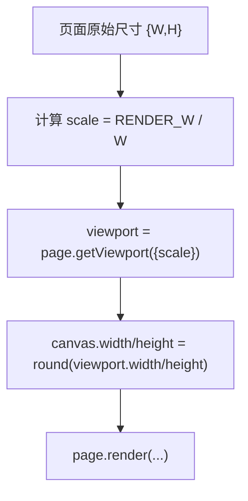
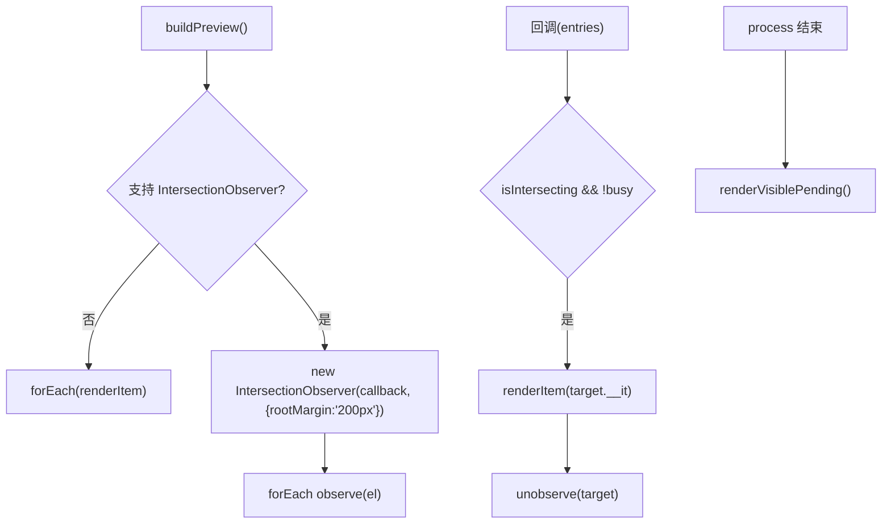
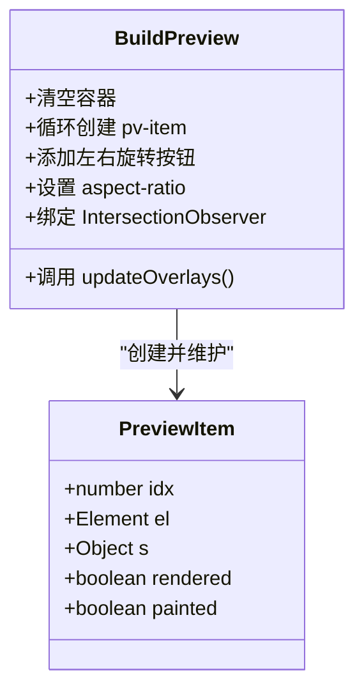
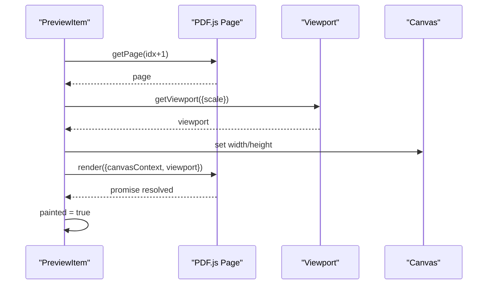
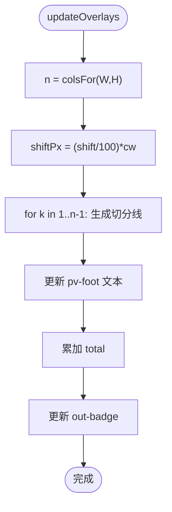
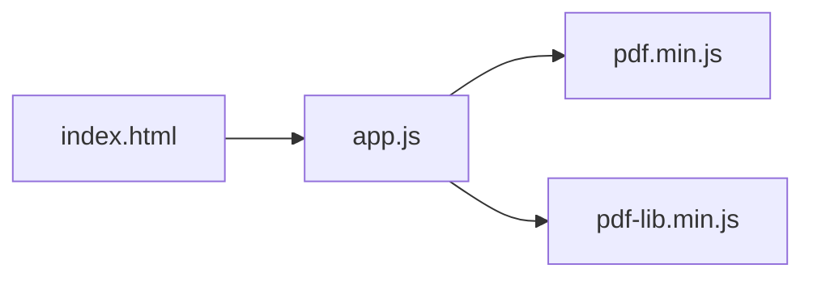

# 预览渲染系统

<cite>
**本文引用的文件**   
- [app.js](file://pdf-splitter/app.js)
- [index.html](file://pdf-splitter/index.html)
</cite>

## 更新摘要
**变更内容**   
- 新增批量旋转按钮UI元素（'整篇左旋'和'整篇右旋'），允许用户一次性旋转所有页面
- 改进单页旋转控制，为每个页面提供独立的左旋和右旋按钮
- 更新CSS样式以支持新的布局结构，包括.rot-all容器和flexbox定位
- 增强用户交互体验，提供更直观的旋转操作界面

## 目录
1. [引言](#引言)
2. [项目结构](#项目结构)
3. [核心组件](#核心组件)
4. [架构总览](#架构总览)
5. [详细组件分析](#详细组件分析)
6. [依赖关系分析](#依赖关系分析)
7. [性能与内存优化](#性能与内存优化)
8. [故障排查指南](#故障排查指南)
9. [结论](#结论)

## 引言
本技术文档聚焦"试卷切分助手"中的 PDF 预览渲染子系统，围绕基于 pdf.js 的渲染管线展开，重点说明：
- Worker 配置、页面加载与视口管理；
- 基于 IntersectionObserver 的懒加载策略；
- RENDER_W 常量对逻辑宽度与缩放比例的影响；
- buildPreview 的 DOM 生成、事件绑定与状态管理；
- renderItem 的异步渲染流程；
- updateOverlays 的叠加层管理机制；
- **增强的旋转功能**：支持批量旋转所有页面和单个页面的独立旋转控制；
- 渲染优化技巧与内存管理实践。

该子系统在浏览器端完成解析与渲染，不上传服务器，适合移动端与桌面端使用。

## 项目结构
PDF 预览渲染相关代码集中在前端资源中：
- index.html：页面结构与样式，包含预览容器、设置控件、结果卡片与底部操作栏。
- app.js：业务逻辑，包括 PDF 加载、旋转归一化、预览构建、懒加载、叠加层更新、切分处理等。

**图表来源**
- [index.html:284-286](file://pdf-splitter/index.html#L284-L286)
- [app.js:1-10](file://pdf-splitter/app.js#L1-L10)

**章节来源**
- [index.html:1-307](file://pdf-splitter/index.html#L1-L307)
- [app.js:1-635](file://pdf-splitter/app.js#L1-L635)

## 核心组件
- PDF 初始化与 Worker 配置：通过全局对象设置 workerSrc，并在 HTTPS 下正常加载，file:// 协议下自动回退主线程。
- 页面尺寸采集：打开 PDF 后并行获取每页 viewport，缓存到 sizes 数组。
- 预览构建：为每页创建 pv-item 容器、canvas、叠加层与页脚信息，并维护渲染状态。
- **增强的旋转功能**：
  - 批量旋转：提供"整篇左旋"和"整篇右旋"按钮，一次性旋转所有页面
  - 单页旋转：每个页面右上角提供独立的左旋和右旋按钮
  - 旋转角度标签：显示当前页面的累计旋转角度
- reloadPreview机制：旋转变化时重新计算归一化字节数组，确保预览与输出一致性。
- 懒加载渲染：使用 IntersectionObserver 检测可视区域，按需触发 renderItem。
- 叠加层更新：根据列数与偏移计算切分线位置，显示标签与页数统计。
- 渲染回调与复用：renderItem 完成后标记 painted，供白边裁剪时直接复用位图。

**章节来源**
- [app.js:6-10](file://pdf-splitter/app.js#L6-L10)
- [app.js:216-241](file://pdf-splitter/app.js#L216-L241)
- [app.js:279-287](file://pdf-splitter/app.js#L279-L287)
- [app.js:314-362](file://pdf-splitter/app.js#L314-L362)
- [app.js:373-386](file://pdf-splitter/app.js#L373-L386)
- [app.js:389-418](file://pdf-splitter/app.js#L389-L418)

## 架构总览
预览渲染系统的关键交互如下：

**图表来源**
- [app.js:216-241](file://pdf-splitter/app.js#L216-L241)
- [app.js:279-287](file://pdf-splitter/app.js#L279-L287)
- [app.js:314-362](file://pdf-splitter/app.js#L314-L362)
- [app.js:373-386](file://pdf-splitter/app.js#L373-L386)

## 详细组件分析

### 增强的旋转功能与批量操作
**更新**：系统现在支持两种旋转模式，提供更灵活的页面方向调整能力。

- **批量旋转按钮**：
  - "整篇左旋"按钮：逆时针旋转所有页面90度（step = 270°）
  - "整篇右旋"按钮：顺时针旋转所有页面90度（step = 90°）
  - 位于预览区域的顶部，使用.flexbox布局排列
  - 带有SVG图标和中文标签，提供直观的操作提示

- **改进的单页旋转控制**：
  - 每个预览页面左上角显示左旋按钮（⟳图标）
  - 每个预览页面右上角显示右旋按钮（↻图标）
  - 右旋按钮带有旋转角度标签，显示当前页面的累计旋转角度
  - 支持±90度的精确旋转控制

- **rotateAll函数**：
  - 遍历所有页面，累加旋转角度到state.userRot数组
  - 调用reloadPreview重新计算归一化字节数组
  - 重置结果数据，避免不一致的输出

- **用户旋转状态管理**：
  - state.userRot数组跟踪每页的用户手动旋转角度
  - 批量旋转和单页旋转共用同一数组，支持混合操作
  - 每次旋转操作都模360保持角度范围在0-359度

**图表来源**
- [app.js:216-241](file://pdf-splitter/app.js#L216-L241)
- [app.js:279-287](file://pdf-splitter/app.js#L279-L287)

**章节来源**
- [app.js:216-241](file://pdf-splitter/app.js#L216-L241)
- [app.js:279-287](file://pdf-splitter/app.js#L279-L287)

### Worker 配置与页面加载
- Worker 配置：
  - 若存在 window.pdfjsLib，则设置 GlobalWorkerOptions.workerSrc 指向 lib/pdf.worker.min.js。
  - 在 file:// 协议下可能失败，会自动回退到主线程执行。
- 页面加载：
  - openPdf 会销毁上一份 PDF 实例以释放内存，然后调用 getDocument 加载新文档。
  - 并发请求所有页面的 getPage，并以 scale=1 获取 viewport.width/height，存入 state.sizes。

**图表来源**
- [app.js:289-309](file://pdf-splitter/app.js#L289-L309)

**章节来源**
- [app.js:6-10](file://pdf-splitter/app.js#L6-L10)
- [app.js:289-309](file://pdf-splitter/app.js#L289-L309)

### 视口管理与缩放比例
- 视口获取：
  - 预览阶段使用 RENDER_W 作为目标逻辑宽度，按页面原始 W 计算 scale = RENDER_W / s.W。
  - 白边裁剪阶段也采用相同逻辑，确保屏幕内外一致。
- 缩放上限：
  - 白边裁剪时对 scale 做 Math.min(2, ...) 限制，避免过大像素导致性能问题。

**图表来源**
- [app.js:373-386](file://pdf-splitter/app.js#L373-L386)
- [app.js:176-205](file://pdf-splitter/app.js#L176-L205)

**章节来源**
- [app.js:176-205](file://pdf-splitter/app.js#L176-L205)
- [app.js:373-386](file://pdf-splitter/app.js#L373-L386)

### 懒加载策略（IntersectionObserver）
- 构建预览时：
  - 为每个 pv-item 创建元素并挂载 __it 引用。
  - 若不支持 IntersectionObserver，则立即对所有项调用 renderItem。
  - 否则创建 IntersectionObserver，rootMargin 设为 200px，提前预取可视区上下方内容。
- 可见性回调：
  - 当 isIntersecting 为真且 state.busy 为假时，调用 renderItem(it)。
  - 观察后立即 unobserve，减少监听开销。
- 补渲染机制：
  - renderVisiblePending 在 busy 结束后扫描当前可视区域附近未渲染项，进行补渲染。

**图表来源**
- [app.js:314-362](file://pdf-splitter/app.js#L314-L362)
- [app.js:364-371](file://pdf-splitter/app.js#L364-L371)

**章节来源**
- [app.js:314-362](file://pdf-splitter/app.js#L314-L362)
- [app.js:364-371](file://pdf-splitter/app.js#L364-L371)

### RENDER_W 的作用与设计考虑
- 定义：RENDER_W = 820，表示预览 canvas 的逻辑宽度。
- 设计目的：
  - 统一预览缩放基准，使不同尺寸页面在预览中具有一致的视觉宽度。
  - 简化 scale 计算，便于在白边裁剪与预览之间保持一致的栅格化尺度。
- 影响范围：
  - renderItem 中 scale = RENDER_W / it.s.W。
  - trimBands 中 scale = Math.min(2, RENDER_W / vp0.width)，保证裁剪检测与预览一致。

**章节来源**
- [app.js:312-313](file://pdf-splitter/app.js#L312-L313)
- [app.js:373-386](file://pdf-splitter/app.js#L373-L386)
- [app.js:176-205](file://pdf-splitter/app.js#L176-L205)

### buildPreview 函数完整分析
- DOM 结构生成：
  - 清空 pvGrid，循环 state.sizes 创建 pv-item。
  - 每个 item 包含 pv-wrap（含 canvas 与 cut-layer）、pv-foot。
  - 使用 aspect-ratio 保持页面纵横比。
  - **增强的旋转按钮**：每个页面左上角添加左旋按钮，右上角添加右旋按钮，包含SVG图标和旋转角度标签。
- 状态管理：
  - 维护 previewItems 数组，每项包含 idx、el、s、rendered、painted。
  - 初始 rendered=false、painted=false。
- 叠加层更新：
  - 调用 updateOverlays 生成切分线与页脚信息。
- 懒加载绑定：
  - 检查 IntersectionObserver 支持情况，必要时降级为立即渲染。
  - 为每个 el 挂载 __it 引用并 observe。

**图表来源**
- [app.js:314-362](file://pdf-splitter/app.js#L314-L362)

**章节来源**
- [app.js:314-362](file://pdf-splitter/app.js#L314-L362)

### renderItem 函数的异步渲染流程
- 获取页面与视口：
  - 通过 state.pdf.getPage(idx+1) 获取页面。
  - 使用 scale = RENDER_W / it.s.W 计算 viewport。
- 设置 canvas 尺寸：
  - canvas.width/height 设置为 viewport.width/height 的整数近似值。
- 渲染回调：
  - page.render 返回 Promise，完成后将 it.painted 置为 true，表示位图可用。
  - 捕获错误并记录日志。
- 状态标记：
  - 无论成功或失败，都将 it.rendered 置为 true，避免重复渲染。

**图表来源**
- [app.js:373-386](file://pdf-splitter/app.js#L373-L386)

**章节来源**
- [app.js:373-386](file://pdf-splitter/app.js#L373-L386)

### updateOverlays 叠加层管理机制
- 切分线绘制：
  - 根据 colsFor(W,H) 计算列数 n，每列宽 cw = W/n。
  - 根据 shift 百分比计算偏移 shiftPx，生成 n-1 条切分线。
  - 每条切分线以百分比 left 定位，并附带序号标签。
- 标签显示：
  - 每行 pv-foot 显示原第几页与切出页数。
- 页数统计：
  - 累计 total 输出页数，更新 out-badge 文本。

**图表来源**
- [app.js:389-418](file://pdf-splitter/app.js#L389-L418)

**章节来源**
- [app.js:389-418](file://pdf-splitter/app.js#L389-L418)

## 依赖关系分析
- 外部库：
  - pdf.min.js：提供 PDF 解析、页面渲染与 worker 能力。
  - pdf-lib.min.js：用于写入新的 PDF 文档与嵌入页面。
- 内部模块耦合：
  - app.js 内聚了 PDF 加载、预览构建、叠加层更新与切分处理。
  - index.html 仅负责 UI 结构与样式，通过 ID 与 app.js 交互。

**图表来源**
- [index.html:284-286](file://pdf-splitter/index.html#L284-L286)
- [app.js:1-10](file://pdf-splitter/app.js#L1-L10)

**章节来源**
- [index.html:284-286](file://pdf-splitter/index.html#L284-L286)
- [app.js:1-10](file://pdf-splitter/app.js#L1-L10)

## 性能与内存优化
- Worker 与主线程回退：
  - 在 HTTPS 下使用 worker 提升解析性能；file:// 下自动回退主线程，保证可用性。
- 文档销毁与内存释放：
  - 切换文件时调用 prev.destroy() 释放 pdf.js 文档缓存与 worker 占用。
  - reloadPreview 时也会销毁旧实例，防止内存泄漏。
- 位图复用与及时释放：
  - 已渲染页面标记 painted，白边裁剪时直接复用位图，避免重复渲染。
  - 裁剪完成后将 canvas.width/height 置零，尽快释放位图内存。
- 渲染队列与进度让路：
  - 处理过程中 state.busy 阻止 IntersectionObserver 触发渲染，避免与切分任务争抢队列。
  - 处理结束后通过 renderVisiblePending 补渲染可视区附近页面。
- 缩放上限控制：
  - 白边裁剪阶段对 scale 做 Math.min(2, ...) 限制，防止超大像素导致卡顿。
- **旋转优化**：
  - 批量旋转和单页旋转操作都会重置结果数据，避免不一致的输出。
  - 每次旋转都从原始 ArrayBuffer 重建，不随点击次数累积失真。
  - 批量旋转和单页旋转共用同一状态数组，支持灵活的混合操作。

**章节来源**
- [app.js:6-10](file://pdf-splitter/app.js#L6-L10)
- [app.js:289-309](file://pdf-splitter/app.js#L289-L309)
- [app.js:176-205](file://pdf-splitter/app.js#L176-L205)
- [app.js:314-362](file://pdf-splitter/app.js#L314-L362)
- [app.js:364-371](file://pdf-splitter/app.js#L364-L371)

## 故障排查指南
- 无法打开加密 PDF：
  - 提示用户先去除密码，再重新选择文件。
- 预览渲染失败：
  - 查看控制台错误日志，确认页面索引与视口计算是否正确。
- 白边裁剪失败：
  - 检查 scanInk 与 scanBands 是否检测到有效墨迹框；失败时保留原始整栏。
- 结果导出异常：
  - 检查 PDFLib 写入与保存流程，确认 bytes 与 Blob 转换正确。
- **旋转功能问题**：
  - 确认 rotateAll 函数正确执行，检查 state.userRot 数组状态。
  - 验证 normalizeRotation 是否正确处理用户旋转角度。
  - 检查批量旋转按钮和单页旋转按钮的事件绑定是否正常。
  - 确认 .rot-all 容器的CSS样式是否正确应用。

**章节来源**
- [app.js:243-273](file://pdf-splitter/app.js#L243-L273)
- [app.js:373-386](file://pdf-splitter/app.js#L373-L386)
- [app.js:176-205](file://pdf-splitter/app.js#L176-L205)
- [app.js:364-371](file://pdf-splitter/app.js#L364-L371)

## 结论
该预览渲染系统通过合理的 Worker 配置、视口管理与 IntersectionObserver 懒加载策略，实现了高效、低内存占用的 PDF 预览体验。**增强的旋转功能**进一步提升了用户体验，提供了批量旋转和单页旋转的双重控制方式，允许用户灵活调整页面方向，确保预览与输出的一致性。RENDER_W 统一了预览与裁剪的缩放基准，buildPreview 与 renderItem 协同完成 DOM 生成与异步渲染，updateOverlays 提供直观的切分可视化。结合位图复用、缩放上限与忙闲调度，系统在移动端与桌面端均具备良好性能表现。

**关键改进**：
- 批量旋转按钮提供了高效的整篇旋转接口
- 改进的单页旋转控制提供了精确的页面级调整
- 统一的旋转状态管理确保了数据一致性
- 优化的CSS布局提升了用户界面的可访问性
- 完整的错误处理避免了旋转操作中的异常情况