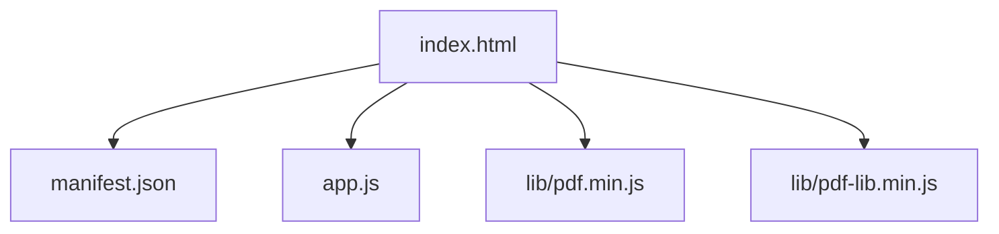
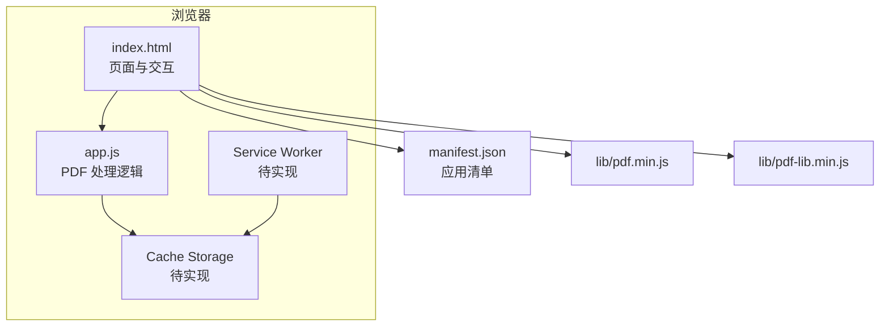
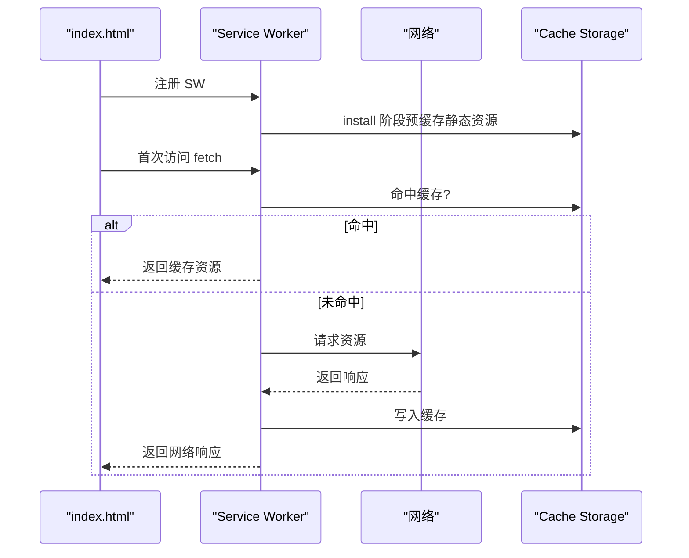
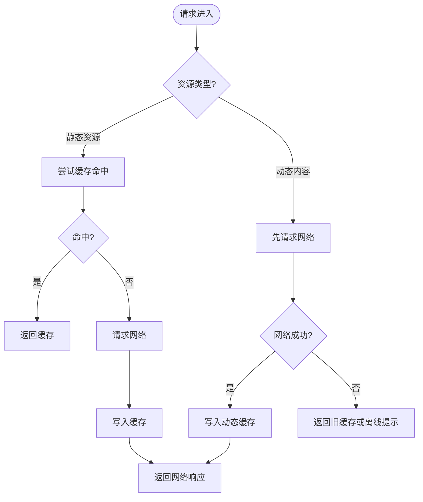
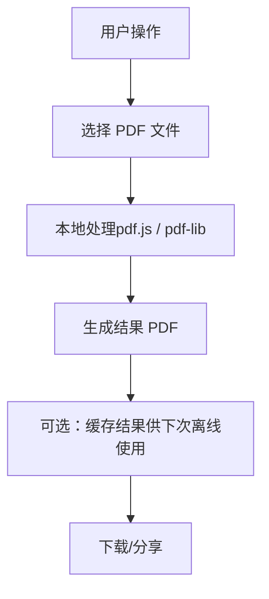
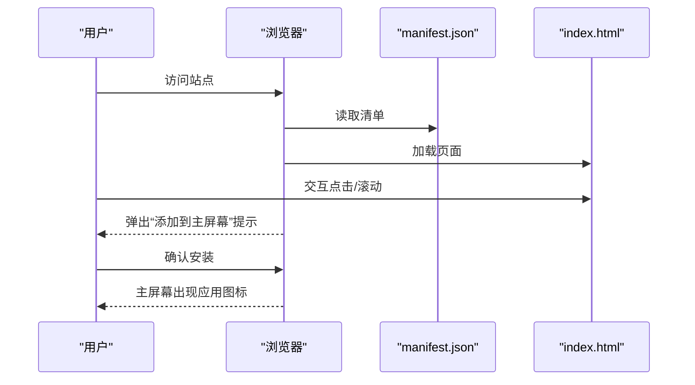
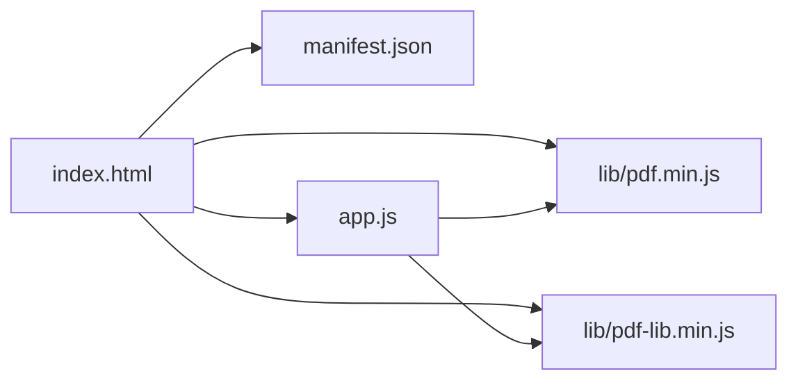

# PWA配置与离线能力

<cite>
**本文引用的文件**   
- [manifest.json](file://pdf-splitter/manifest.json)
- [index.html](file://pdf-splitter/index.html)
- [app.js](file://pdf-splitter/app.js)
</cite>

## 目录
1. [引言](#引言)
2. [项目结构](#项目结构)
3. [核心组件](#核心组件)
4. [架构总览](#架构总览)
5. [详细组件分析](#详细组件分析)
6. [依赖关系分析](#依赖关系分析)
7. [性能考虑](#性能考虑)
8. [故障排查指南](#故障排查指南)
9. [结论](#结论)
10. [附录](#附录)

## 引言
本文件围绕“试卷切分助手”的渐进式 Web 应用（PWA）配置与离线能力进行系统化说明。重点包括：
- manifest.json 的配置项与应用元数据
- Service Worker 的注册与管理机制（当前仓库未包含，提供实现建议）
- 缓存策略与网络请求拦截（当前仓库未包含，提供实现建议）
- 静态资源预缓存与动态内容按需缓存方案
- PWA 安装流程、用户体验优化与行为控制
- 部署最佳实践与浏览器兼容性、降级方案

## 项目结构
本项目为单页 PDF 处理工具，核心前端位于 pdf-splitter 目录：
- index.html：页面结构与样式入口，引入 manifest 与脚本
- app.js：PDF 解析、预览、切分与下载逻辑
- manifest.json：PWA 应用清单
- lib/pdf.min.js、lib/pdf-lib.min.js：PDF 渲染与编辑库

**图表来源**
- [index.html:1-20](file://pdf-splitter/index.html#L1-L20)
- [manifest.json:1-18](file://pdf-splitter/manifest.json#L1-L18)
- [app.js:1-10](file://pdf-splitter/app.js#L1-L10)

**章节来源**
- [index.html:1-20](file://pdf-splitter/index.html#L1-L20)
- [manifest.json:1-18](file://pdf-splitter/manifest.json#L1-L18)

## 核心组件
- 应用清单 manifest.json：定义应用名称、短名、描述、启动 URL、作用域、显示模式、方向、主题色、背景色、语言与图标集。
- 页面入口 index.html：声明 theme-color、移动端可运行 meta、manifest 链接、图标与 Apple 触摸图标，并加载 PDF 库与业务脚本。
- 业务逻辑 app.js：基于 pdf.js 与 pdf-lib 完成 PDF 读取、旋转校正、白边检测、栏切分、A4 缩放输出、结果下载与分享；同时通过 localStorage 持久化用户偏好。

**章节来源**
- [manifest.json:1-18](file://pdf-splitter/manifest.json#L1-L18)
- [index.html:1-20](file://pdf-splitter/index.html#L1-L20)
- [app.js:1-30](file://pdf-splitter/app.js#L1-L30)

## 架构总览
从 PWA 视角看，当前仓库已具备应用清单与页面入口，但尚未实现 Service Worker 与缓存策略。下图展示现有结构与未来扩展点：

**图表来源**
- [index.html:1-20](file://pdf-splitter/index.html#L1-L20)
- [manifest.json:1-18](file://pdf-splitter/manifest.json#L1-L18)
- [app.js:1-10](file://pdf-splitter/app.js#L1-L10)

## 详细组件分析

### manifest.json 配置详解
- name：应用完整名称，用于系统与应用商店展示。
- short_name：短名称，受空间限制时显示。
- description：应用用途说明，帮助理解功能。
- start_url：应用启动入口，当前为相对路径 "."，表示根目录。
- scope：作用域，当前为 "."，限定 SW 控制范围。
- display：standalone，使应用以全屏独立窗口方式打开。
- orientation：portrait，锁定竖屏方向。
- background_color：应用启动时的背景色。
- theme_color：主题色，影响状态栏与标题栏颜色。
- lang：zh-CN，界面语言。
- icons：包含 SVG 与 PNG 多尺寸图标，支持 maskable 适配不同系统图标形状。

这些字段共同决定应用在桌面/移动端的呈现方式、安装外观与启动体验。

**章节来源**
- [manifest.json:1-18](file://pdf-splitter/manifest.json#L1-L18)

### Service Worker 注册与管理机制（当前未实现，建议方案）
虽然仓库中未包含 Service Worker 文件，但为实现离线能力，建议在 index.html 中增加注册逻辑，并在 SW 中实现以下职责：
- 生命周期管理：install、activate、fetch、message
- 缓存策略：
  - 静态资源预缓存：HTML、CSS、JS、字体、图标等
  - 动态内容按需缓存：PDF 文件、预览图、API 响应（如有）
- 网络请求拦截：优先命中缓存，失败回退到网络或离线兜底页面
- 版本更新：清理旧缓存，确保用户获取最新版本

[此图为概念流程图，不直接映射具体源码文件]

### 缓存策略与网络请求拦截（当前未实现，建议方案）
- 预缓存（Install 阶段）
  - 目标：HTML、CSS、JS、图标、字体等关键静态资源
  - 目的：保证首屏快速加载与离线可用
- 运行时缓存（Fetch 阶段）
  - 静态资源：Cache First，失败回退 Network
  - 动态内容（如 PDF）：Network First，成功则写入 Cache；失败回退到上次缓存或提示离线
- 版本管理
  - 使用版本号或哈希命名缓存键
  - activate 阶段清理旧缓存，避免占用空间

[此图为概念流程图，不直接映射具体源码文件]

### 离线功能的实现方案
- 静态资源预缓存
  - 将 index.html、app.js、lib/*.js、icon.svg、icon-*.png 等加入预缓存列表
  - 在 SW install 事件中批量缓存，确保离线可访问
- 动态内容按需缓存
  - 对用户上传的 PDF 或生成的结果 PDF，采用 Network First + Cache 策略
  - 若网络不可用，返回最近一次成功处理的缓存结果，或提示重新联网
- 离线兜底
  - 当关键资源缺失时，返回友好的离线提示页面，引导用户联网重试

[此图为概念流程图，不直接映射具体源码文件]

### PWA 的安装流程与用户体验优化
- 添加到主屏幕
  - 满足条件：manifest 有效、HTTPS、存在可安装的图标与名称、用户有交互
  - 可在检测到可安装时提示用户添加主屏幕图标
- 安装后行为控制
  - display: standalone 使应用全屏运行
  - orientation: portrait 锁定竖屏
  - theme_color/background_color 统一视觉风格
- 安装提示时机
  - 首次访问且用户有交互（点击、滚动）后触发提示
  - 避免频繁打扰，提供“稍后再说”选项

[此图为概念流程图，不直接映射具体源码文件]

### 当前代码中的相关实现要点
- 页面入口与清单引用
  - index.html 中通过 link rel="manifest" 引用 manifest.json
  - 设置 theme-color meta 与移动端可运行 meta
- 应用清单字段
  - 定义了名称、短名、描述、启动 URL、作用域、display、orientation、主题色、背景色、语言与图标
- 业务逻辑
  - app.js 使用 pdf.js 与 pdf-lib 完成 PDF 处理，所有计算在浏览器端完成，适合配合 SW 做离线缓存

**章节来源**
- [index.html:1-20](file://pdf-splitter/index.html#L1-L20)
- [manifest.json:1-18](file://pdf-splitter/manifest.json#L1-L18)
- [app.js:1-10](file://pdf-splitter/app.js#L1-L10)

## 依赖关系分析
- 页面依赖
  - index.html 依赖 manifest.json、lib/pdf.min.js、lib/pdf-lib.min.js、app.js
- 运行时依赖
  - app.js 依赖 pdf.js 与 pdf-lib 提供的 API
- PWA 扩展依赖
  - 未来需引入 Service Worker 与 Cache Storage API

**图表来源**
- [index.html:1-20](file://pdf-splitter/index.html#L1-L20)
- [manifest.json:1-18](file://pdf-splitter/manifest.json#L1-L18)
- [app.js:1-10](file://pdf-splitter/app.js#L1-L10)

**章节来源**
- [index.html:1-20](file://pdf-splitter/index.html#L1-L20)
- [manifest.json:1-18](file://pdf-splitter/manifest.json#L1-L18)
- [app.js:1-10](file://pdf-splitter/app.js#L1-L10)

## 性能考虑
- 预缓存关键静态资源，减少首屏加载时间
- 对大体积 PDF 的处理尽量在后台线程或分片处理，避免阻塞 UI
- 合理使用 IntersectionObserver 懒加载预览，降低内存占用
- 及时释放不再使用的 Canvas 与对象 URL，避免内存泄漏
- 使用 useObjectStreams 等优化参数减小输出体积

**章节来源**
- [app.js:288-305](file://pdf-splitter/app.js#L288-L305)
- [app.js:479-486](file://pdf-splitter/app.js#L479-L486)

## 故障排查指南
- 无法安装 PWA
  - 检查 HTTPS、manifest 是否有效、图标是否存在、display 与 orientation 是否合理
- 离线不可用
  - 确认 SW 是否正确注册与激活
  - 检查预缓存列表是否包含必要资源
  - 验证 fetch 拦截逻辑是否命中缓存
- PDF 处理异常
  - 加密 PDF 需要去除密码或忽略加密（当前代码已忽略加密）
  - 旋转页面需先归一化坐标，避免输出横倒
- 内存不足
  - 及时销毁 pdf.js 文档实例
  - 释放 Canvas 与 Object URL

**章节来源**
- [app.js:243-263](file://pdf-splitter/app.js#L243-L263)
- [app.js:82-103](file://pdf-splitter/app.js#L82-L103)
- [app.js:554-564](file://pdf-splitter/app.js#L554-L564)

## 结论
当前仓库已具备 PWA 的基础配置（manifest 与页面入口），但未实现 Service Worker 与缓存策略。为实现完整的离线能力，建议：
- 新增 Service Worker，实现静态资源预缓存与动态内容按需缓存
- 在 index.html 中注册 SW，并提供安装提示与离线兜底
- 结合现有 PDF 处理逻辑，缓存关键结果以提升离线体验
- 遵循部署最佳实践与兼容性要求，确保在不同浏览器下稳定运行

## 附录
- 推荐缓存键命名规范：资源路径 + 版本号/哈希
- 建议离线提示文案：明确告知用户当前处于离线状态，并提供联网重试按钮
- 兼容性参考：Chrome、Edge、Firefox、Safari 对 PWA 的支持差异与降级方案