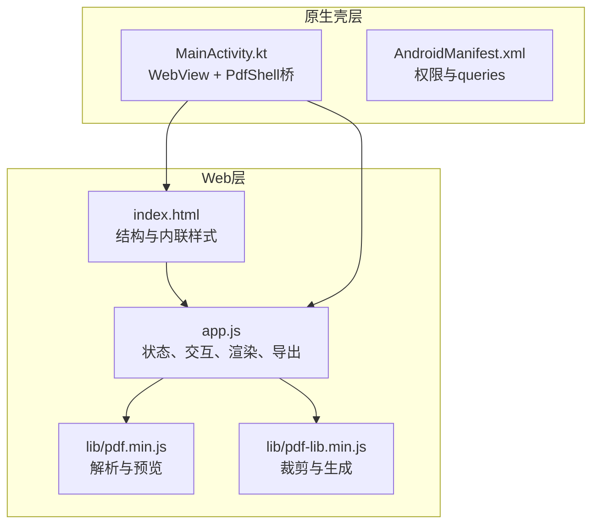
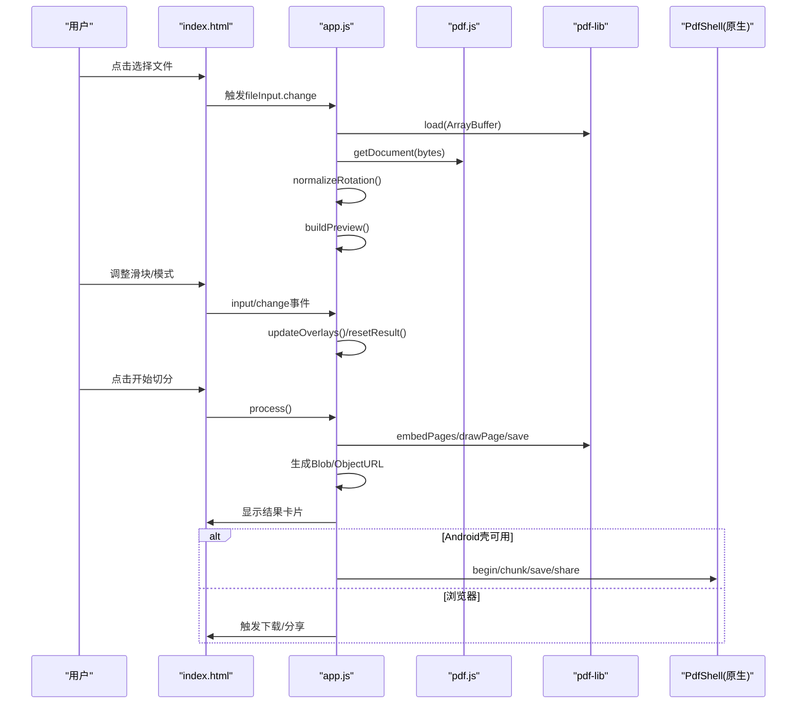
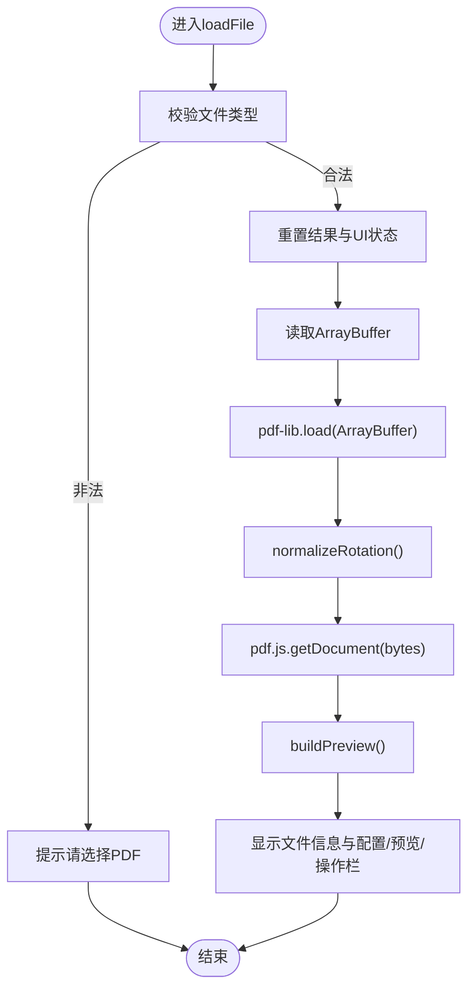
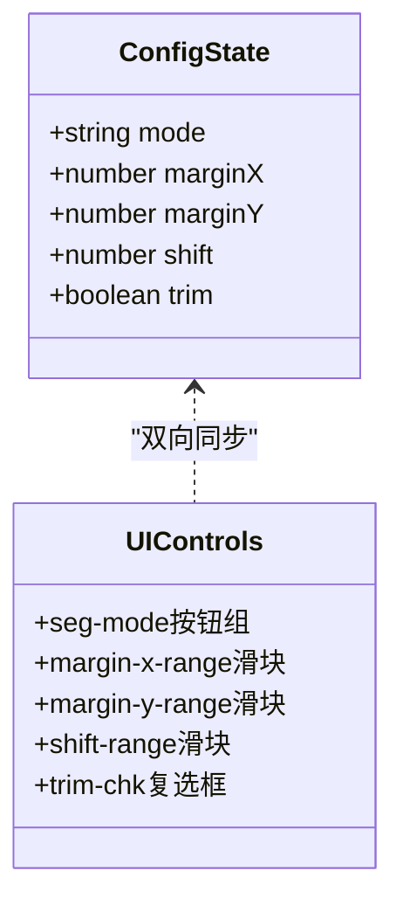
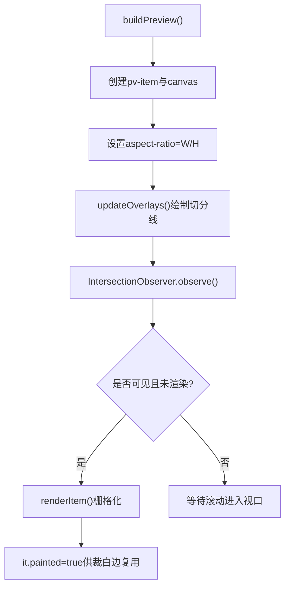
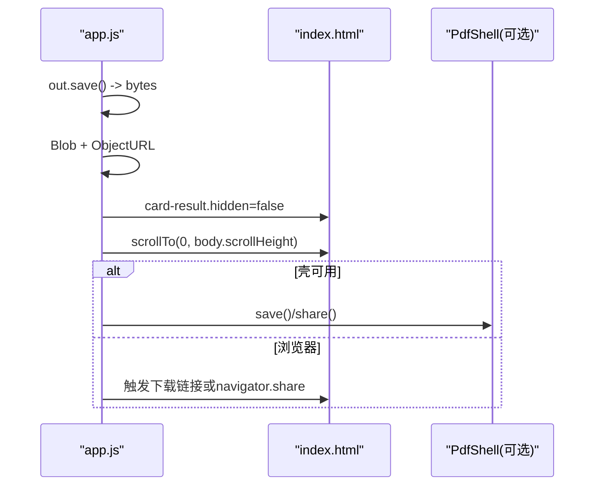
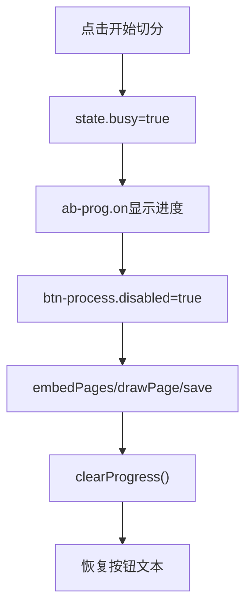
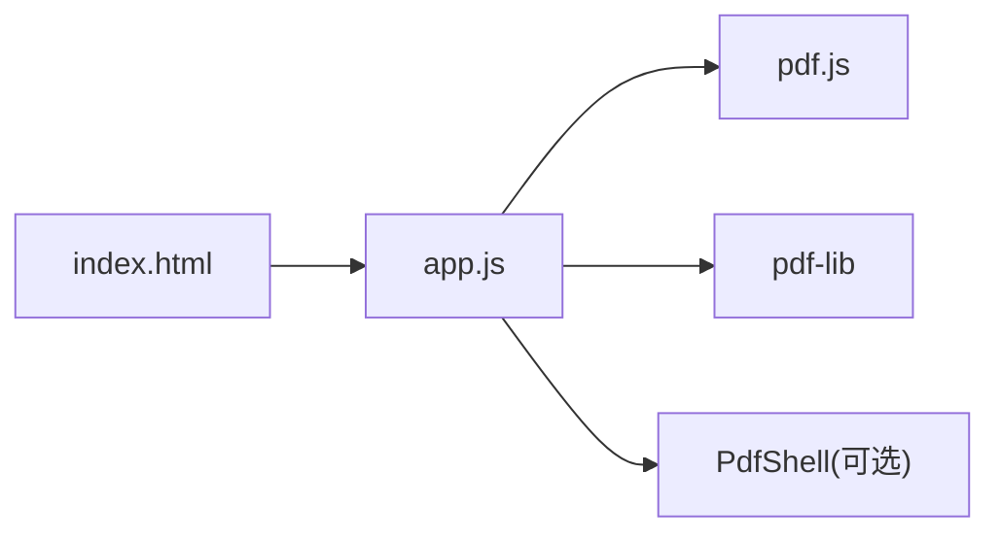

# UI组件设计

<cite>
**本文引用的文件**   
- [index.html](file://pdf-splitter/index.html)
- [app.js](file://pdf-splitter/app.js)
- [README.md](file://README.md)
</cite>

## 目录
1. [引言](#引言)
2. [项目结构](#项目结构)
3. [核心组件](#核心组件)
4. [架构总览](#架构总览)
5. [详细组件分析](#详细组件分析)
6. [依赖关系分析](#依赖关系分析)
7. [性能与渲染特性](#性能与渲染特性)
8. [样式与DOM操作规范](#样式与dom操作规范)
9. [故障排查指南](#故障排查指南)
10. [结论](#结论)

## 引言
本文件面向Web前端UI设计与实现，聚焦基于HTML/CSS的前端界面架构与JavaScript交互逻辑。该应用是一个“试卷切分助手”，把A3/A4拼版PDF按栏切分为标准A4页面，并在浏览器或Android WebView中离线运行。文档重点解释以下方面：
- 文件选择界面、参数配置面板、实时预览网格、结果展示卡片的设计模式
- DOM操作管理策略，包括事件监听器的绑定与解绑机制
- 响应式布局方案，包括aspect-ratio保持预览比例、flexbox自适应排列
- 用户交互流程，包括拖拽/点击上传、滑块调节、按钮点击的统一处理
- CSS样式规范与JavaScript DOM操作最佳实践示例（以路径引用代替具体代码）

## 项目结构
Web本体位于`pdf-splitter/`，包含入口HTML、主脚本以及本地化的pdf.js与pdf-lib库；Android壳工程负责WebView桥接与系统能力补充。

**图表来源**
- [index.html:1-12](file://pdf-splitter/index.html#L1-L12)
- [index.html:284-286](file://pdf-splitter/index.html#L284-L286)
- [app.js:1-11](file://pdf-splitter/app.js#L1-L11)
- [README.md:13-22](file://README.md#L13-L22)

**章节来源**
- [README.md:13-22](file://README.md#L13-L22)

## 核心组件
- 文件选择区：支持点击触发隐藏input[type=file]，并显示已选文件信息
- 参数配置面板：分栏模式选择、左右/上下边距滑块、切分线微调、白边裁剪开关
- 实时预览网格：每页一个卡片，使用aspect-ratio保持比例，叠加切分线与标签
- 结果展示卡片：完成提示、下载/分享按钮、保存路径与查看文件入口
- 底部固定操作栏：进度条与“开始切分/更换文件”按钮

这些组件通过CSS变量统一主题色、圆角、阴影等视觉风格，并通过hidden属性控制显隐。

**章节来源**
- [index.html:14-141](file://pdf-splitter/index.html#L14-L141)
- [index.html:161-282](file://pdf-splitter/index.html#L161-L282)

## 架构总览
整体交互由HTML提供结构，app.js管理状态与事件，pdf.js用于解析与预览，pdf-lib用于裁剪与输出。Android壳在需要时接管文件选择与结果保存/分享。

**图表来源**
- [app.js:195-239](file://pdf-splitter/app.js#L195-L239)
- [app.js:265-361](file://pdf-splitter/app.js#L265-L361)
- [app.js:412-508](file://pdf-splitter/app.js#L412-L508)
- [app.js:530-552](file://pdf-splitter/app.js#L530-L552)

## 详细组件分析

### 文件选择界面
- 设计模式：外层dropzone作为可点击区域，内部隐藏真实input[type=file]，避免原生样式差异
- 交互流程：点击dropzone触发fileInput.click；change事件中校验类型、读取ArrayBuffer、加载PDF、归一化旋转、打开文档、构建预览
- DOM管理：通过id选择器集中获取节点，统一更新card-file/card-config/card-preview/action-bar的hidden状态

**图表来源**
- [app.js:204-239](file://pdf-splitter/app.js#L204-L239)

**章节来源**
- [index.html:163-192](file://pdf-splitter/index.html#L163-L192)
- [app.js:195-239](file://pdf-splitter/app.js#L195-L239)

### 参数配置面板
- 分栏模式：segmented按钮组，active类切换当前模式，影响colsFor计算与预览切分线
- 边距滑块：左右/上下边距分别对应marginX/marginY，单位mm，影响最终A4缩放与留白
- 切分线微调：shift百分比偏移，影响预览切分线与实际裁剪位置
- 白边裁剪：checkbox默认关闭，localStorage持久化用户选择；开启后逐栏扫描墨迹最小矩形

**图表来源**
- [index.html:194-220](file://pdf-splitter/index.html#L194-L220)
- [app.js:363-399](file://pdf-splitter/app.js#L363-L399)

**章节来源**
- [index.html:194-220](file://pdf-splitter/index.html#L194-L220)
- [app.js:363-399](file://pdf-splitter/app.js#L363-L399)

### 实时预览网格
- 布局：pv-grid为纵向flex容器，每个pv-item包含pv-wrap与pv-foot
- 比例保持：pv-wrap使用aspect-ratio=页面宽高比，canvas宽度100%、高度auto
- 切分线：cut-layer绝对定位覆盖整个pv-wrap，动态插入cut-line与cut-lbl
- 懒渲染：IntersectionObserver观察可见项，state.busy时让路给处理任务，完成后补渲染

**图表来源**
- [index.html:92-103](file://pdf-splitter/index.html#L92-L103)
- [app.js:265-329](file://pdf-splitter/app.js#L265-L329)

**章节来源**
- [index.html:92-103](file://pdf-splitter/index.html#L92-L103)
- [app.js:265-329](file://pdf-splitter/app.js#L265-L329)

### 结果展示卡片
- 内容：成功图标、统计文案、下载/分享按钮、查看文件按钮、保存路径提示
- 行为：process成功后显示卡片并滚动到底部；根据环境决定是否调用PdfShell桥
- 资源释放：resetResult中撤销ObjectURL并清理按钮状态

**图表来源**
- [app.js:479-508](file://pdf-splitter/app.js#L479-L508)
- [app.js:530-552](file://pdf-splitter/app.js#L530-L552)

**章节来源**
- [index.html:231-264](file://pdf-splitter/index.html#L231-L264)
- [app.js:479-508](file://pdf-splitter/app.js#L479-L508)
- [app.js:530-552](file://pdf-splitter/app.js#L530-L552)

### 底部固定操作栏
- 作用：常驻底部，提供进度条与“开始切分/更换文件”按钮
- 状态：ab-prog在process开始时显示，完成后隐藏；按钮在busy期间禁用并显示旋转动画

**图表来源**
- [index.html:126-134](file://pdf-splitter/index.html#L126-L134)
- [app.js:401-410](file://pdf-splitter/app.js#L401-L410)
- [app.js:412-508](file://pdf-splitter/app.js#L412-L508)

**章节来源**
- [index.html:126-134](file://pdf-splitter/index.html#L126-L134)
- [app.js:401-410](file://pdf-splitter/app.js#L401-L410)

## 依赖关系分析
- pdf.js：负责解析PDF与渲染到Canvas，提供viewport与getDocument API
- pdf-lib：负责创建新PDF、嵌入页面、裁剪区域、保存到字节流
- app.js：协调两者，管理状态、DOM、事件与进度反馈
- index.html：定义结构、样式与静态资源引入

**图表来源**
- [index.html:284-286](file://pdf-splitter/index.html#L284-L286)
- [app.js:1-11](file://pdf-splitter/app.js#L1-L11)
- [app.js:566-576](file://pdf-splitter/app.js#L566-L576)

**章节来源**
- [README.md:22-22](file://README.md#L22-L22)
- [app.js:1-11](file://pdf-splitter/app.js#L1-L11)

## 性能与渲染特性
- 旋转归一化：对带/Rotate的页面进行烘焙，确保预览与裁剪坐标一致，避免横倒输出
- 白边裁剪：将每栏渲染为位图，扫描有墨迹的最小矩形作为裁剪框；若检测不到墨迹则退回整栏
- 预览复用：已渲染的Canvas可直接复用，避免重复栅格化，显著降低耗时
- 懒加载：IntersectionObserver仅渲染可见项，减少首屏压力
- 进度反馈：分段setProgress与tick让长任务不阻塞UI

优化建议：
- 大文件分批处理：当前一次性嵌入所有页面，内存峰值偏高；可按批嵌入并逐步save
- 预取下一页：在滚动接近阈值时提前渲染下一张，提升流畅度
- 裁剪缓存：对相同尺寸与参数的页面缓存裁剪框，避免重复扫描

**章节来源**
- [app.js:57-103](file://pdf-splitter/app.js#L57-L103)
- [app.js:105-193](file://pdf-splitter/app.js#L105-L193)
- [app.js:288-329](file://pdf-splitter/app.js#L288-L329)
- [README.md:77-90](file://README.md#L77-L90)

## 样式与DOM操作规范

### CSS样式规范
- 使用CSS变量统一管理颜色、圆角、阴影等主题值，便于扩展与维护
- 使用flexbox与grid组织布局，保证在不同屏幕下的自适应
- 使用aspect-ratio保持预览卡片比例，配合canvas width:100%;height:auto实现等比缩放
- 使用hidden属性控制模块显隐，避免频繁display切换带来的重排开销
- 使用过渡与动画增强交互反馈，如按钮active态、进度条填充动画

参考路径：
- [index.html:14-141](file://pdf-splitter/index.html#L14-L141)

### DOM操作最佳实践
- 集中获取DOM节点：通过id选择器在初始化阶段缓存，避免重复查询
- 事件委托与就近匹配：如segmented按钮组使用closest('button')精准定位目标
- 状态驱动视图：变更state后调用updateOverlays/resetResult等方法统一刷新UI
- 资源释放：在resetResult中撤销ObjectURL，避免内存泄漏
- 异步协作：使用tick让出时间片，避免长任务阻塞渲染；IntersectionObserver与state.busy协同控制渲染时机

参考路径：
- [app.js:30-55](file://pdf-splitter/app.js#L30-L55)
- [app.js:363-399](file://pdf-splitter/app.js#L363-L399)
- [app.js:554-564](file://pdf-splitter/app.js#L554-L564)

### 响应式布局实现要点
- 主体最大宽度限制与居中：wrap.max-width与margin:0 auto
- 顶部工具栏与卡片间距：topbar.inner与main.gap
- 预览网格纵向排列：pv-grid.flex-direction:column
- 底部操作栏固定定位：action-bar.position:fixed与safe-area适配

参考路径：
- [index.html:38-51](file://pdf-splitter/index.html#L38-L51)
- [index.html:92-103](file://pdf-splitter/index.html#L92-L103)
- [index.html:126-134](file://pdf-splitter/index.html#L126-L134)

## 故障排查指南
- 无法打开PDF：可能是加密文件，需先去除密码；错误信息会alert提示
- 预览空白或方向异常：检查/Rotate是否正确归一化；确认normalizeRotation执行路径
- 切分线错位：检查mode与shift参数，确认updateOverlays被调用
- 白边裁剪无效：确认trim-chk勾选且已渲染过该页；若未渲染，首次处理会走独立栅格化
- 下载/分享失败：Android壳下走PdfShell通道；浏览器下检查navigator.share支持与ObjectURL有效性

参考路径：
- [app.js:234-238](file://pdf-splitter/app.js#L234-L238)
- [app.js:530-552](file://pdf-splitter/app.js#L530-L552)
- [README.md:83-90](file://README.md#L83-L90)

**章节来源**
- [app.js:234-238](file://pdf-splitter/app.js#L234-L238)
- [app.js:530-552](file://pdf-splitter/app.js#L530-L552)
- [README.md:83-90](file://README.md#L83-L90)

## 结论
该Web UI采用清晰的模块化结构与状态驱动视图模式，结合pdf.js与pdf-lib实现离线PDF预览与切分。通过CSS变量与flexbox/grid构建响应式布局，利用aspect-ratio保持预览比例，借助IntersectionObserver与state.busy实现高效懒渲染。事件处理集中在app.js中，遵循就近匹配与统一刷新原则，保障交互一致性。针对移动端与Android WebView场景，提供了PdfShell桥接能力，完善文件选择与结果落盘/分享体验。建议在后续版本中引入分批处理与裁剪缓存，进一步优化大文件场景的性能与内存占用。