# Web应用架构

<cite>
**本文引用的文件**   
- [README.md](file://README.md)
- [index.html](file://pdf-splitter/index.html)
- [app.js](file://pdf-splitter/app.js)
- [manifest.json](file://pdf-splitter/manifest.json)
</cite>

## 目录
1. [简介](#简介)
2. [项目结构](#项目结构)
3. [核心组件](#核心组件)
4. [架构总览](#架构总览)
5. [详细组件分析](#详细组件分析)
6. [依赖关系分析](#依赖关系分析)
7. [性能优化策略](#性能优化策略)
8. [故障排查指南](#故障排查指南)
9. [结论](#结论)

## 简介
本项目是一个面向“拼版试卷”的 Web PWA 工具，目标是将 A3/A4 横版拼版（一页两栏或三栏）切分为标准 A4 纵向单页 PDF，便于直接打印。全部处理在浏览器本地完成，不上传、不联网；Android 壳工程仅补齐 WebView 能力与系统级文件操作，业务逻辑完全由前端实现。

技术选型：
- 预览与解析：pdf.js
- 裁剪与生成：pdf-lib
- PWA：manifest.json 定义安装元信息，Web 页面可直接离线运行

本架构文档聚焦以下方面：
- 基于 pdf-lib 和 pdf.js 的前端 PDF 处理流程：加载、解析、旋转归一化、预览、裁剪、输出
- 状态管理机制：state 对象设计与应用状态维护策略
- UI 组件设计模式：文件选择界面、参数配置面板、实时预览网格
- PWA 配置与离线能力：manifest.json 的作用与服务工作线程的使用现状
- 性能优化：预览位图复用、大文件分块传输、懒渲染与进度反馈

**章节来源**
- [README.md:1-22](file://README.md#L1-L22)

## 项目结构
仓库根目录包含 Android 原生壳工程与 Web 本体。Web 本体位于 `pdf-splitter/`，是完整的 PWA，包含入口 HTML、主逻辑 JS、PWA 清单以及本地化的 pdf.js 与 pdf-lib 库。

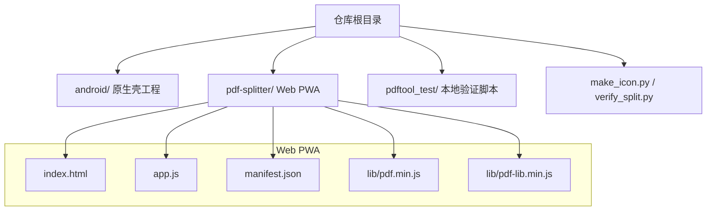

**图表来源**
- [index.html:1-13](file://pdf-splitter/index.html#L1-L13)
- [app.js:1-11](file://pdf-splitter/app.js#L1-L11)
- [manifest.json:1-17](file://pdf-splitter/manifest.json#L1-L17)

**章节来源**
- [README.md:13-22](file://README.md#L13-L22)
- [index.html:1-13](file://pdf-splitter/index.html#L1-L13)
- [app.js:1-11](file://pdf-splitter/app.js#L1-L11)
- [manifest.json:1-17](file://pdf-splitter/manifest.json#L1-L17)

## 核心组件
- 入口页面 index.html：提供 UI 骨架、样式、资源引用与 PWA 基础 meta 标签
- 主逻辑 app.js：封装 PDF 加载、旋转归一化、预览、参数交互、切分生成、下载与分享
- PWA 清单 manifest.json：定义应用名称、启动路径、显示模式、主题色与图标
- 第三方库：pdf.js（解析与预览）、pdf-lib（PDF 构建与裁剪）

职责划分：
- index.html 负责结构与展示，不包含业务逻辑
- app.js 作为唯一业务模块，集中管理 state、DOM 事件、PDF 处理管线与结果导出
- manifest.json 声明 PWA 行为，配合浏览器实现“安装到桌面”等能力

**章节来源**
- [index.html:1-13](file://pdf-splitter/index.html#L1-L13)
- [app.js:1-28](file://pdf-splitter/app.js#L1-L28)
- [manifest.json:1-17](file://pdf-splitter/manifest.json#L1-L17)

## 架构总览
整体数据流从用户选择 PDF 开始，经过解析、旋转归一化、预览与参数调整，最终进入切分生成阶段，产出新的 A4 PDF 并支持下载或分享。

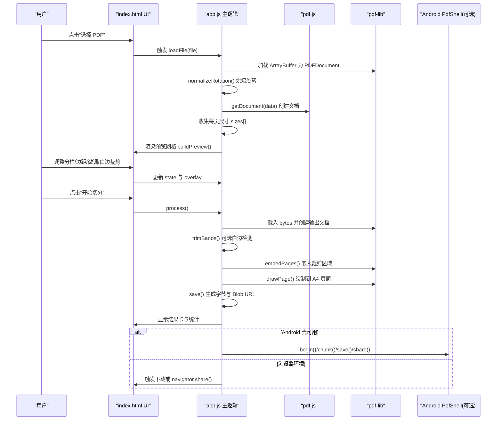

**图表来源**
- [app.js:204-239](file://pdf-splitter/app.js#L204-L239)
- [app.js:243-263](file://pdf-splitter/app.js#L243-L263)
- [app.js:265-361](file://pdf-splitter/app.js#L265-L361)
- [app.js:412-508](file://pdf-splitter/app.js#L412-L508)
- [app.js:530-552](file://pdf-splitter/app.js#L530-L552)

## 详细组件分析

### 文件加载与解析流程
- 文件校验与重置：loadFile 校验 PDF 类型，清空旧结果与 UI 状态
- ArrayBuffer 读取：通过 file.arrayBuffer() 获取原始字节
- pdf-lib 加载：使用 ignoreEncryption 容错加载，便于后续旋转归一化
- 旋转归一化：normalizeRotation 将 /Rotate 烘焙进内容矩阵，避免 pdf-lib 与 pdf.js 坐标系不一致
- pdf.js 打开：openPdf 销毁旧文档后创建新文档，并行收集每页尺寸

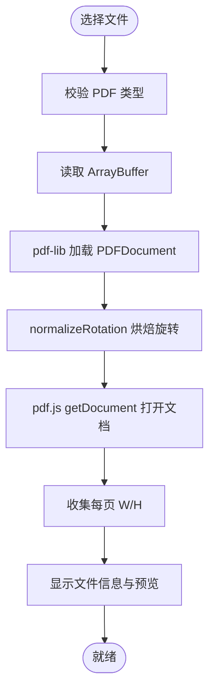

**图表来源**
- [app.js:204-239](file://pdf-splitter/app.js#L204-L239)
- [app.js:243-263](file://pdf-splitter/app.js#L243-L263)
- [app.js:57-103](file://pdf-splitter/app.js#L57-L103)

**章节来源**
- [app.js:204-239](file://pdf-splitter/app.js#L204-L239)
- [app.js:243-263](file://pdf-splitter/app.js#L243-L263)
- [app.js:57-103](file://pdf-splitter/app.js#L57-L103)

### 旋转归一化算法
- 目的：统一 pdf.js viewport 与 pdf-lib 坐标体系，避免输出方向错误
- 方法：遍历页面读取 /Rotate，按 90/180/270 度分别计算变换矩阵，embedPage 时应用矩阵，再写入新页面
- 优化：若无页面带旋转，直接返回 null，调用方复用原字节，避免无谓重存

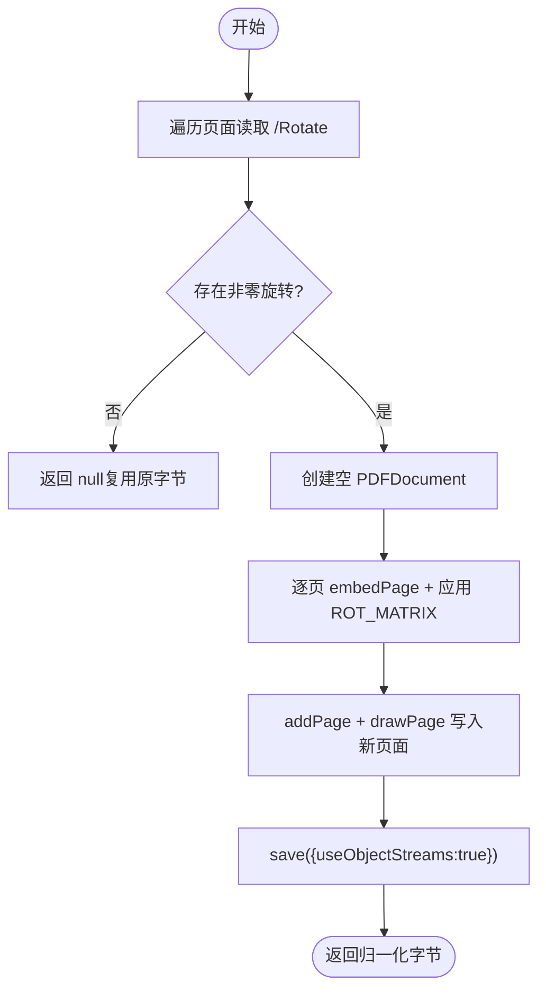

**图表来源**
- [app.js:57-103](file://pdf-splitter/app.js#L57-L103)

**章节来源**
- [app.js:57-103](file://pdf-splitter/app.js#L57-L103)

### 预览与实时网格
- 构建预览：buildPreview 为每页创建 pv-item，内含 canvas 与 cut-layer 叠加层
- 懒渲染：IntersectionObserver 监听可视区域，仅在可见时渲染，减少初始开销
- 渲染控制：renderItem 设置 canvas 尺寸并调用 pdf.js render，完成后标记 painted
- 覆盖层更新：updateOverlays 根据 mode/shift 动态绘制切分线与标签，不重绘 canvas
- 位图复用：paintedPreview 在裁白边时直接复用已渲染的 canvas，避免二次栅格化

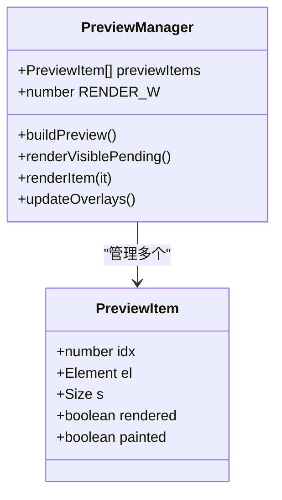

**图表来源**
- [app.js:265-361](file://pdf-splitter/app.js#L265-L361)

**章节来源**
- [app.js:265-361](file://pdf-splitter/app.js#L265-L361)

### 参数配置面板与状态同步
- 分栏模式：自动识别或手动选择 1/2/3 栏，影响 colsFor 与 overlay 切线
- 边距滑块：左右 marginX、上下 marginY，单位 mm，决定 A4 缩放比例
- 切分微调：shift 百分比偏移，用于对齐跨栏文字
- 白边裁剪：trim 开关，默认关闭，localStorage 持久化用户偏好
- 状态同步：所有输入变更立即更新 state 与 UI，并 resetResult 以清除旧结果

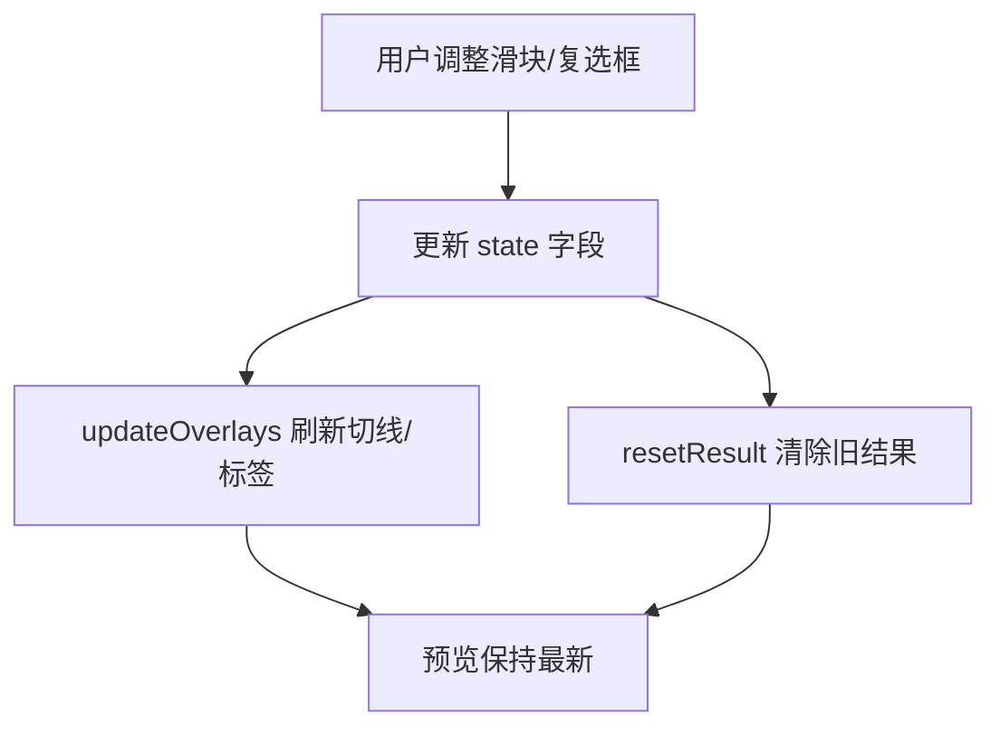

**图表来源**
- [app.js:363-399](file://pdf-splitter/app.js#L363-L399)

**章节来源**
- [app.js:363-399](file://pdf-splitter/app.js#L363-L399)

### 切分生成与输出
- 输入：state.bytes（已旋转归一化），mode/marginX/marginY/shift/trim
- 步骤：
  - 计算每页栏数与 band 区间
  - 若开启 trim，调用 trimBands 扫描墨迹得到更紧裁剪框
  - embedPages 嵌入各栏内容
  - 逐页 addPage(A4) 并按 margin 等比缩放绘制
  - save 生成字节，构造 Blob URL 并缓存 resultBytes/resultUrl
- 输出：
  - 浏览器：下载链接或 navigator.share
  - Android 壳：PdfShell.begin/chunk/save/share 分块 base64 传输

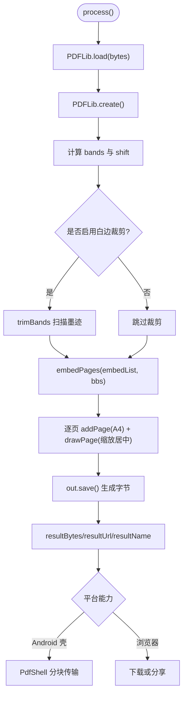

**图表来源**
- [app.js:412-508](file://pdf-splitter/app.js#L412-L508)
- [app.js:530-552](file://pdf-splitter/app.js#L530-L552)

**章节来源**
- [app.js:412-508](file://pdf-splitter/app.js#L412-L508)
- [app.js:530-552](file://pdf-splitter/app.js#L530-L552)

### 状态管理机制
state 对象集中管理应用状态，包括：
- 文件与字节：file、ab、bytes（归一化后的字节）
- 文档与尺寸：pdf（pdf.js 文档）、sizes（每页宽高）
- 用户参数：mode、marginX、marginY、shift、trim
- 运行时标志：busy、resultBytes、resultUrl、resultName

维护策略：
- 初始化：在 loadFile 中重置并填充
- 更新：UI 事件直接修改对应字段，保证单一数据源
- 清理：resetResult 释放 Blob URL 与结果 DOM 状态
- 并发保护：busy 防止重复处理

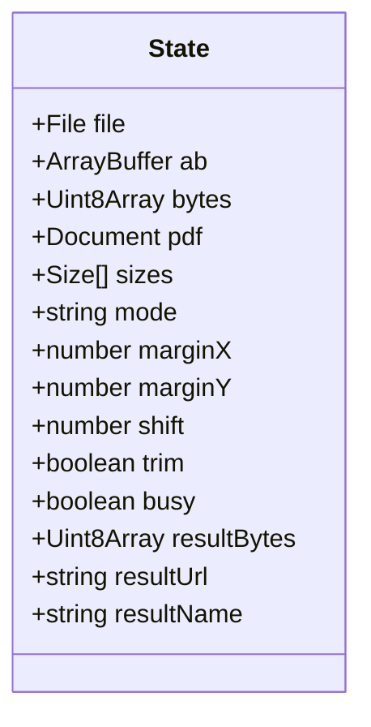

**图表来源**
- [app.js:13-28](file://pdf-splitter/app.js#L13-L28)

**章节来源**
- [app.js:13-28](file://pdf-splitter/app.js#L13-L28)
- [app.js:554-564](file://pdf-splitter/app.js#L554-L564)

### UI 组件设计模式
- 文件选择界面：dropzone 与隐藏 input[type=file]，点击触发选择；支持更换文件
- 文件信息卡片：显示文件名与页数/大小，提供更换按钮
- 参数配置面板：分段按钮组（分栏模式）、紧凑行滑块（边距/微调）、复选框（白边裁剪）
- 预览网格：pv-grid 容器，每个 pv-item 包含 canvas 与 cut-layer 叠加层，底部 pv-foot 显示页码与切出页数
- 结果卡片：成功图标、统计信息、下载/分享/查看文件按钮，Android 壳下显示保存路径
- 固定操作栏：action-bar 常驻底部，显示进度条与“更换文件/开始切分”按钮

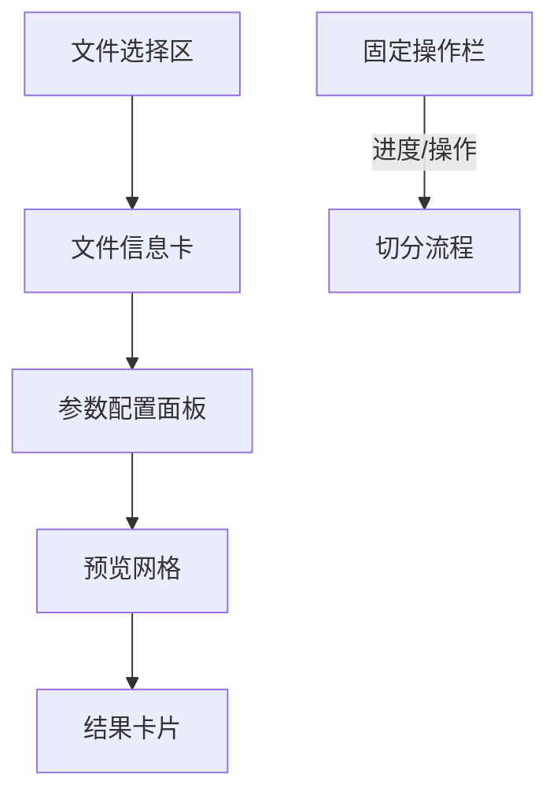

**图表来源**
- [index.html:163-282](file://pdf-splitter/index.html#L163-L282)

**章节来源**
- [index.html:163-282](file://pdf-splitter/index.html#L163-L282)

### PWA 配置与离线能力
- manifest.json：
  - name/short_name/description：应用标识与描述
  - start_url/scope：启动路径与作用域
  - display：standalone 全屏应用体验
  - orientation/background_color/theme_color/lang：外观与语言
  - icons：多尺寸图标，支持 maskable
- index.html：
  - rel="manifest" 引入清单
  - theme-color/mobile-web-app-capable/apple-mobile-web-app-* 提升移动端体验
- 服务工作线程：
  - 当前代码未显式注册 Service Worker
  - 由于 pdf.js workerSrc 指向 lib/pdf.worker.min.js，且 README 说明可离线使用，实际离线能力主要依赖静态资源本地化与浏览器缓存
  - 如需更强离线缓存，可在未来扩展 Service Worker 预缓存关键资源

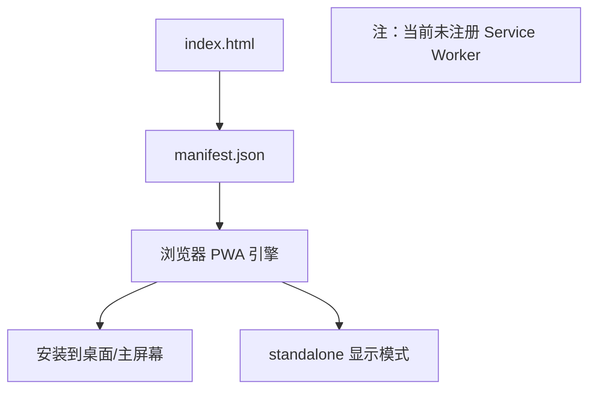

**图表来源**
- [manifest.json:1-17](file://pdf-splitter/manifest.json#L1-L17)
- [index.html:4-12](file://pdf-splitter/index.html#L4-L12)

**章节来源**
- [manifest.json:1-17](file://pdf-splitter/manifest.json#L1-L17)
- [index.html:4-12](file://pdf-splitter/index.html#L4-L12)
- [README.md:37-42](file://README.md#L37-L42)

## 依赖关系分析
- 外部依赖：
  - pdf.js：解析 PDF、渲染预览、viewport 与 worker 管理
  - pdf-lib：构建新 PDF、嵌入页面、裁剪与绘制
- 内部依赖：
  - index.html 依赖 app.js 与两个库
  - app.js 依赖 window.pdfjsLib 与 window.PDFLib
  - Android 壳通过 window.PdfShell 桥接原生能力

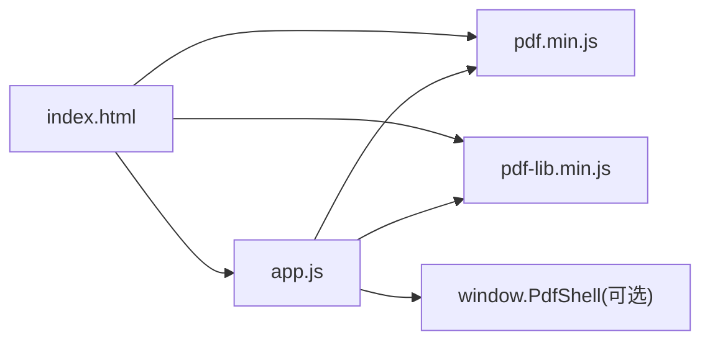

**图表来源**
- [index.html:284-286](file://pdf-splitter/index.html#L284-L286)
- [app.js:7-10](file://pdf-splitter/app.js#L7-L10)
- [app.js:514-528](file://pdf-splitter/app.js#L514-L528)

**章节来源**
- [index.html:284-286](file://pdf-splitter/index.html#L284-L286)
- [app.js:7-10](file://pdf-splitter/app.js#L7-L10)
- [app.js:514-528](file://pdf-splitter/app.js#L514-L528)

## 性能优化策略
- 预览位图复用：
  - paintedPreview 复用已渲染 canvas，避免 trimBands 再次栅格化
  - IntersectionObserver 懒加载，仅渲染可视区域
- 大文件分块传输：
  - Android 壳下通过 PdfShell.chunk 分块 base64 传输，避免单次过大消息
- 渲染队列协调：
  - 处理中 state.busy 阻止 IntersectionObserver 继续渲染，结束后补渲染可见项
- 内存管理：
  - openPdf 销毁旧 pdf.js 文档，及时释放 worker 与缓存
  - trimBands 渲染后立即清空 canvas 宽高，释放位图内存
- 进度反馈：
  - setProgress/clearProgress 提供稳定进度条，提升用户体验

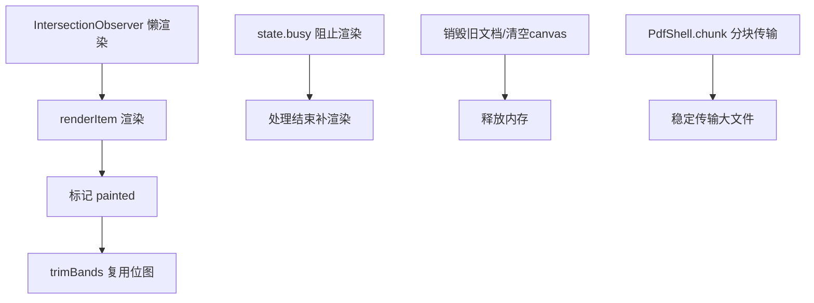

**图表来源**
- [app.js:288-305](file://pdf-splitter/app.js#L288-L305)
- [app.js:307-329](file://pdf-splitter/app.js#L307-L329)
- [app.js:153-193](file://pdf-splitter/app.js#L153-L193)
- [app.js:243-263](file://pdf-splitter/app.js#L243-L263)
- [app.js:514-528](file://pdf-splitter/app.js#L514-L528)

**章节来源**
- [app.js:288-305](file://pdf-splitter/app.js#L288-L305)
- [app.js:307-329](file://pdf-splitter/app.js#L307-L329)
- [app.js:153-193](file://pdf-splitter/app.js#L153-L193)
- [app.js:243-263](file://pdf-splitter/app.js#L243-L263)
- [app.js:514-528](file://pdf-splitter/app.js#L514-L528)

## 故障排查指南
- 无法打开 PDF：
  - 可能原因：加密文件、损坏文件
  - 现象：alert 提示“无法打开该 PDF”，控制台输出错误
  - 处理：先去除密码或修复文件
- 处理失败：
  - 可能原因：pdf-lib 嵌入失败、内存不足
  - 现象：alert 提示“处理失败”，控制台输出错误
  - 处理：减小文件大小或关闭白边裁剪
- 预览卡顿：
  - 可能原因：大量页面同时渲染
  - 处理：确保 IntersectionObserver 正常工作，避免阻塞主线程
- Android 壳分享/下载异常：
  - 检查 window.PdfShell 是否存在，确认 begin/chunk/save/share 调用顺序
  - 确认分块大小与 base64 转换正确

**章节来源**
- [app.js:234-238](file://pdf-splitter/app.js#L234-L238)
- [app.js:497-507](file://pdf-splitter/app.js#L497-L507)
- [app.js:530-552](file://pdf-splitter/app.js#L530-L552)

## 结论
该 Web PWA 应用以 index.html 为入口、app.js 为核心逻辑，结合 pdf.js 与 pdf-lib 实现了从 PDF 加载、旋转归一化、预览到切分生成的完整闭环。状态管理集中在 state 对象，UI 组件采用卡片化与网格布局，兼顾移动端交互与可读性。PWA 通过 manifest.json 提供安装与全屏体验，当前未显式注册 Service Worker，但凭借本地化库与浏览器缓存可实现离线使用。性能方面通过预览位图复用、懒渲染、内存释放与大文件分块传输等手段显著优化了处理速度与稳定性。