# 状态管理机制

<cite>
**本文引用的文件**   
- [app.js](file://pdf-splitter/app.js)
- [README.md](file://README.md)
</cite>

## 目录
1. [引言](#引言)
2. [项目结构](#项目结构)
3. [核心组件](#核心组件)
4. [架构总览](#架构总览)
5. [详细组件分析](#详细组件分析)
6. [依赖关系分析](#依赖关系分析)
7. [性能考量](#性能考量)
8. [故障排查指南](#故障排查指南)
9. [结论](#结论)
10. [附录：状态字段与生命周期速查](#附录状态字段与生命周期速查)

## 引言
本文件聚焦“试卷切分助手”的前端应用状态管理机制，围绕全局 `state` 对象的设计模式、数据结构、UI 与数据一致性、状态变更触发流程、以及内存管理策略展开。该应用以浏览器/WebView 为运行环境，使用 pdf.js 负责解析与预览，pdf-lib 负责按栏裁剪并等比放入 A4 页面；所有处理均在本地完成，不上传任何数据。

## 项目结构
- Web 本体位于 `pdf-splitter/`，包含入口 HTML、主逻辑脚本 `app.js`，以及本地化的 pdf.js 与 pdf-lib 资源。
- Android 壳工程通过 WebView 加载 Web 资源，补充文件选择、结果保存与分享等原生能力。
- 状态管理完全由前端脚本维护，不涉及后端或外部服务。

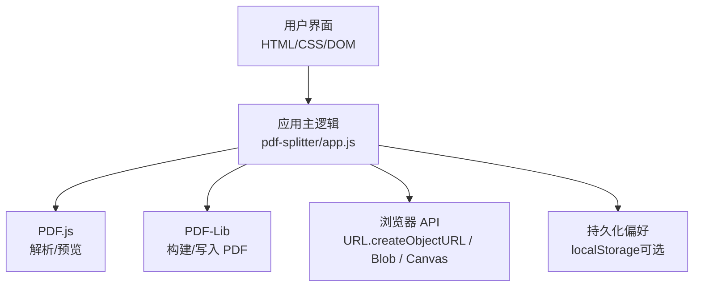

**图表来源**
- [app.js:13-28](file://pdf-splitter/app.js#L13-L28)
- [app.js:204-239](file://pdf-splitter/app.js#L204-L239)
- [app.js:243-263](file://pdf-splitter/app.js#L243-L263)
- [app.js:412-508](file://pdf-splitter/app.js#L412-L508)

**章节来源**
- [README.md:13-22](file://README.md#L13-L22)

## 核心组件
本节从“状态模型—同步机制—变更触发—内存管理”四个维度说明。

### 状态模型：`state` 对象设计
`state` 是应用的核心数据源，集中保存当前文件、原始二进制、归一化字节、pdf.js 文档、每页尺寸、显示模式、边距、偏移、白边裁剪开关、忙闲标志、结果二进制、结果 URL 与文件名等。

- `file`：当前选中的 File 对象，用于展示文件名、大小和生成输出文件名。
- `ab`：原始 ArrayBuffer，作为输入源，避免重复读取磁盘/网络。
- `bytes`：Uint8Array，代表可用于 pdf-lib 的字节序列；若存在旋转则先烘焙旋转再存储，确保预览与输出坐标一致。
- `pdf`：pdf.js 文档实例，仅用于预览与尺寸计算；换文件时显式销毁旧实例。
- `sizes`：数组，每项为 `{W, H}`，表示每页在 pdf.js 坐标系下的宽高，驱动预览布局与列数判断。
- `mode`：分栏模式，`auto` 自动识别，或手动指定 1/2/3 栏。
- `marginX` / `marginY`：左右/上下边距（毫米），控制输出到 A4 后的留白。
- `shift`：整体偏移百分比，用于微调分栏线位置。
- `trim`：是否启用“裁掉白边”，默认关闭，勾选后记住。
- `busy`：处理中标志，防止重复提交并协调预览渲染队列。
- `resultBytes` / `resultUrl` / `resultName`：切分结果的数据、可下载 URL 与文件名。

这些字段共同构成“单一事实来源”。UI 只读展示，交互只写 `state`，再由视图层根据 `state` 增量更新。

**章节来源**
- [app.js:13-28](file://pdf-splitter/app.js#L13-L28)

### 数据与 UI 的一致性策略
- 数据驱动视图：`buildPreview()` 依据 `state.sizes` 重建 DOM 节点；`updateOverlays()` 依据 `state.mode`、`state.shift` 等重绘切分线与统计信息，但不重新渲染 canvas。
- 懒加载渲染：使用 IntersectionObserver 按需渲染可见页，减少初始开销；处理期间暂停观察器回调，完成后补渲染。
- 设置变更即时生效：滑块、单选按钮、复选框直接修改 `state` 对应字段，并调用 `resetResult()` 清除历史结果，必要时调用 `updateOverlays()` 刷新视觉。
- 结果区与操作栏：`process()` 成功后更新 `state.resultBytes`、`state.resultUrl`、`state.resultName`，并显示结果卡片；`resetResult()` 清理结果并恢复按钮文案。

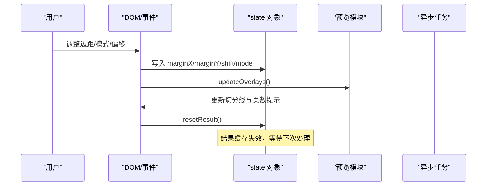

**图表来源**
- [app.js:363-399](file://pdf-splitter/app.js#L363-L399)
- [app.js:331-361](file://pdf-splitter/app.js#L331-L361)
- [app.js:554-564](file://pdf-splitter/app.js#L554-L564)

**章节来源**
- [app.js:331-361](file://pdf-splitter/app.js#L331-L361)
- [app.js:363-399](file://pdf-splitter/app.js#L363-L399)
- [app.js:554-564](file://pdf-splitter/app.js#L554-L564)

### 状态变更触发机制
- 用户输入：
  - 切换分栏模式：更新 `state.mode`，刷新覆盖层并重置结果。
  - 调整边距与偏移：更新 `state.marginX/Y`、`state.shift`，刷新覆盖层并重置结果。
  - 勾选白边裁剪：更新 `state.trim`，持久化偏好并重置结果。
- 文件选择：
  - 读取 ArrayBuffer，创建 pdf-lib 文档，执行旋转归一化，得到 `state.bytes`。
  - 打开 pdf.js 文档，收集每页尺寸到 `state.sizes`，构建预览。
- 异步任务完成：
  - 切分完成后写入 `state.resultBytes`、`state.resultUrl`、`state.resultName`，显示结果卡并滚动到底部。
  - 处理结束后恢复按钮状态，清 `state.busy`，并延迟补渲染未显示的预览项。

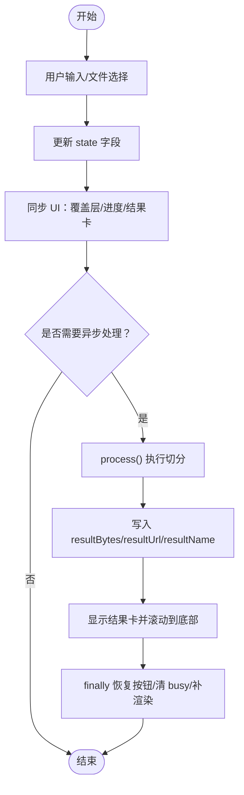

**图表来源**
- [app.js:204-239](file://pdf-splitter/app.js#L204-L239)
- [app.js:412-508](file://pdf-splitter/app.js#L412-L508)
- [app.js:554-564](file://pdf-splitter/app.js#L554-L564)

**章节来源**
- [app.js:204-239](file://pdf-splitter/app.js#L204-L239)
- [app.js:412-508](file://pdf-splitter/app.js#L412-L508)

### 内存管理策略
- pdf.js 文档对象：
  - 每次换文件前，先释放上一份 `state.pdf`，再创建新文档，避免 pdf.js 内部缓存与 worker 长期驻留。
- Canvas 位图：
  - 白边检测临时 canvas 在渲染完成后立即清空宽高，释放像素缓冲；已预览的 canvas 复用，避免重复栅格化。
- URL 对象：
  - 生成新结果前撤销旧 `state.resultUrl`；重置结果时也撤销并置空。
- 二进制缓冲：
  - 使用 `state.ab` 与 `state.bytes` 避免重复读取；`bytes` 仅在需要旋转时烘焙，否则复用原缓冲，减少拷贝。
- 大文件处理：
  - 对大量页面嵌入采用分批进度提示与短暂让路（`await tick()`），降低主线程阻塞风险；但一次性嵌入仍可能产生较高峰值内存。

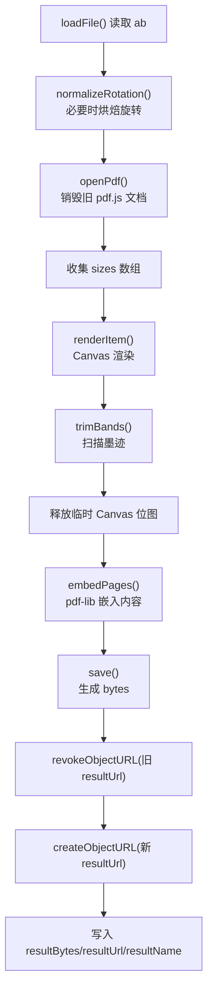

**图表来源**
- [app.js:83-103](file://pdf-splitter/app.js#L83-L103)
- [app.js:204-239](file://pdf-splitter/app.js#L204-L239)
- [app.js:243-263](file://pdf-splitter/app.js#L243-L263)
- [app.js:164-193](file://pdf-splitter/app.js#L164-L193)
- [app.js:412-508](file://pdf-splitter/app.js#L412-L508)
- [app.js:554-564](file://pdf-splitter/app.js#L554-L564)

**章节来源**
- [app.js:83-103](file://pdf-splitter/app.js#L83-L103)
- [app.js:164-193](file://pdf-splitter/app.js#L164-L193)
- [app.js:204-239](file://pdf-splitter/app.js#L204-L239)
- [app.js:243-263](file://pdf-splitter/app.js#L243-L263)
- [app.js:412-508](file://pdf-splitter/app.js#L412-L508)
- [app.js:554-564](file://pdf-splitter/app.js#L554-L564)

## 架构总览
下图展示状态在各阶段的生命周期与关键职责边界。

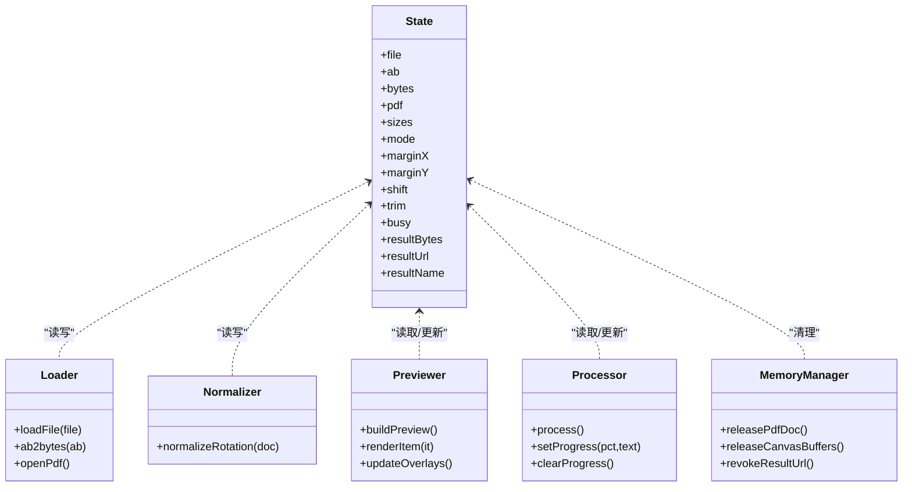

**图表来源**
- [app.js:13-28](file://pdf-splitter/app.js#L13-L28)
- [app.js:204-239](file://pdf-splitter/app.js#L204-L239)
- [app.js:243-263](file://pdf-splitter/app.js#L243-L263)
- [app.js:268-329](file://pdf-splitter/app.js#L268-L329)
- [app.js:412-508](file://pdf-splitter/app.js#L412-L508)

## 详细组件分析

### 文件加载与旋转归一化
- 文件校验与初始化：检查扩展名与 MIME，隐藏各卡片，准备进入加载流程。
- 读取 ArrayBuffer：赋值 `state.file` 与 `state.ab`，并用 pdf-lib 加载文档。
- 旋转归一化：检测页面 `/Rotate`，必要时将旋转烘焙进内容，返回新的字节流；若无旋转则直接复用原缓冲。
- 打开 pdf.js：销毁旧文档，创建新文档，收集每页尺寸到 `state.sizes`，构建预览。

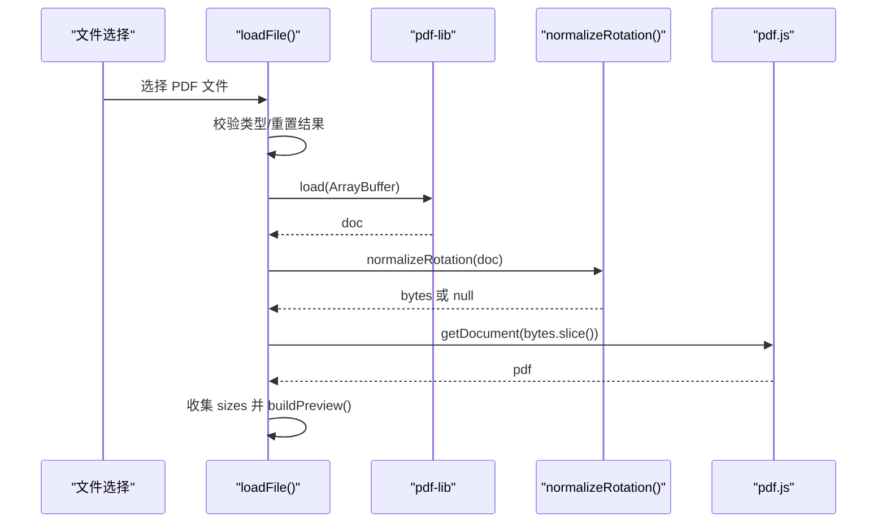

**图表来源**
- [app.js:204-239](file://pdf-splitter/app.js#L204-L239)
- [app.js:83-103](file://pdf-splitter/app.js#L83-L103)
- [app.js:243-263](file://pdf-splitter/app.js#L243-L263)

**章节来源**
- [app.js:204-239](file://pdf-splitter/app.js#L204-L239)
- [app.js:83-103](file://pdf-splitter/app.js#L83-L103)
- [app.js:243-263](file://pdf-splitter/app.js#L243-L263)

### 预览与覆盖层
- 预览构建：根据 `state.sizes` 动态生成 DOM，设置 aspect-ratio，插入 canvas 与切分覆盖层。
- 懒加载渲染：IntersectionObserver 监听可视区域，调用 `renderItem()` 渲染；处理期间暂停，完成后补渲染。
- 覆盖层更新：根据 `state.mode`、`state.shift` 计算分栏线与标签，更新底部统计文本，不重绘 canvas。

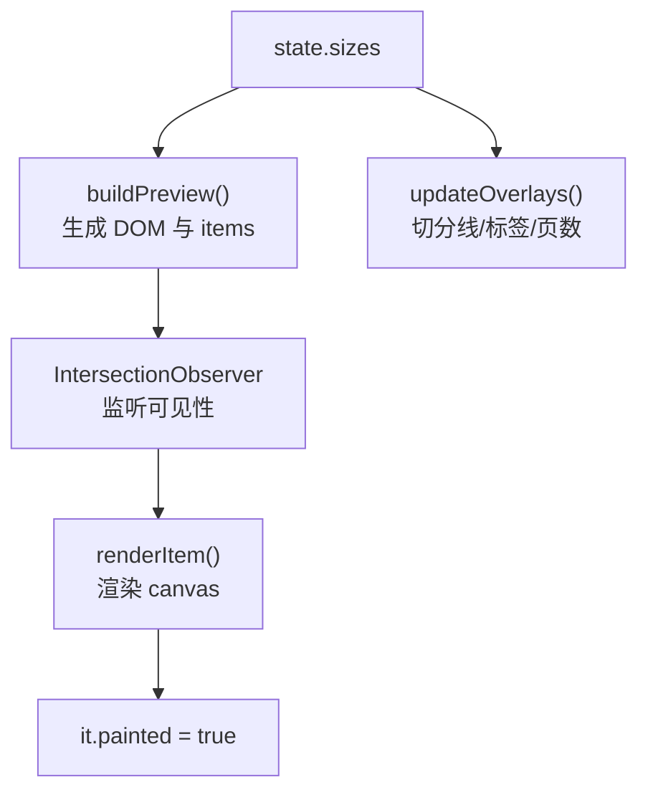

**图表来源**
- [app.js:268-329](file://pdf-splitter/app.js#L268-L329)
- [app.js:331-361](file://pdf-splitter/app.js#L331-L361)

**章节来源**
- [app.js:268-329](file://pdf-splitter/app.js#L268-L329)
- [app.js:331-361](file://pdf-splitter/app.js#L331-L361)

### 白边裁剪与位图复用
- 已预览页复用：若某页已渲染且 canvas 尺寸合理，直接复用其位图进行墨迹扫描。
- 未预览页渲染：按需渲染一页，绘制白色背景后扫描有墨迹的最小矩形，转换为裁剪框。
- 失败回退：扫描失败或无墨迹时保留整栏，避免裁空。
- 及时释放：临时 canvas 宽高清零，释放像素缓冲。

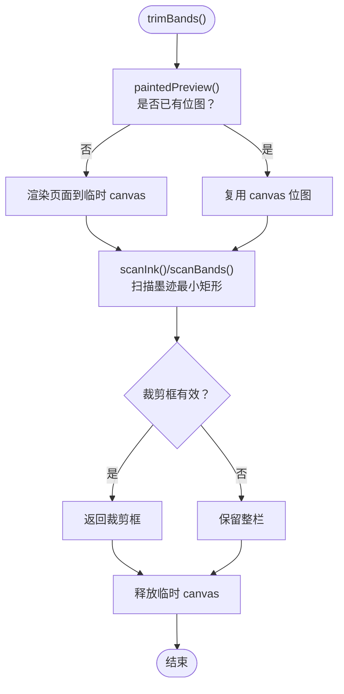

**图表来源**
- [app.js:153-193](file://pdf-splitter/app.js#L153-L193)

**章节来源**
- [app.js:153-193](file://pdf-splitter/app.js#L153-L193)

### 切分与结果生成
- 读取源文档：基于 `state.bytes` 加载 pdf-lib 文档。
- 计算分栏：根据 `state.mode` 与页面宽高计算栏宽与偏移。
- 白边检测：若启用 `state.trim`，逐页扫描并收紧裁剪框。
- 嵌入与缩放：将每栏内容嵌入新文档，等比缩放到 A4 可用区域，添加边距。
- 保存与结果：生成 `state.resultBytes`，撤销旧 URL，创建新 URL，更新文件名与结果卡。

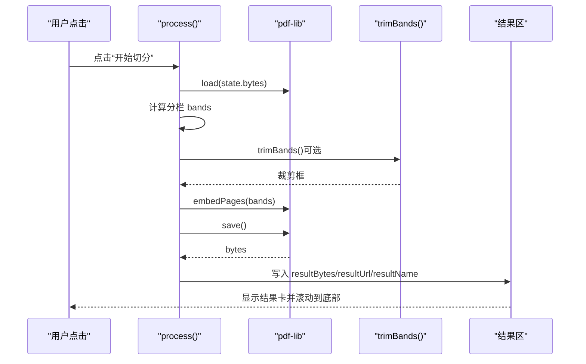

**图表来源**
- [app.js:412-508](file://pdf-splitter/app.js#L412-L508)

**章节来源**
- [app.js:412-508](file://pdf-splitter/app.js#L412-L508)

### 结果下载与分享
- 下载：优先走原生桥（Android），否则创建 `<a>` 元素触发下载。
- 分享：优先走原生桥，其次尝试系统分享 API，最后降级提示。
- 结果清理：`resetResult()` 撤销 URL 并隐藏结果卡。

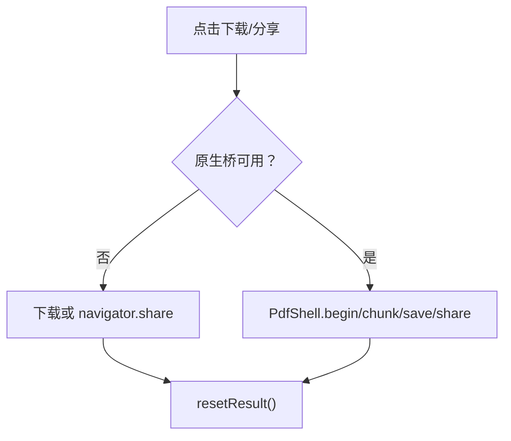

**图表来源**
- [app.js:512-552](file://pdf-splitter/app.js#L512-L552)
- [app.js:554-564](file://pdf-splitter/app.js#L554-L564)

**章节来源**
- [app.js:512-552](file://pdf-splitter/app.js#L512-L552)
- [app.js:554-564](file://pdf-splitter/app.js#L554-L564)

## 依赖关系分析
- 外部库：
  - pdf.js：解析 PDF、获取页面与视口、渲染到 canvas。
  - pdf-lib：加载/创建/嵌入页面、保存 PDF。
- 浏览器 API：
  - URL.createObjectURL/revokeObjectURL：结果 URL 生命周期管理。
  - Blob/File：结果数据封装与分享。
  - Canvas：预览与白边检测。
  - IntersectionObserver：懒加载预览。
  - localStorage：可选偏好持久化。

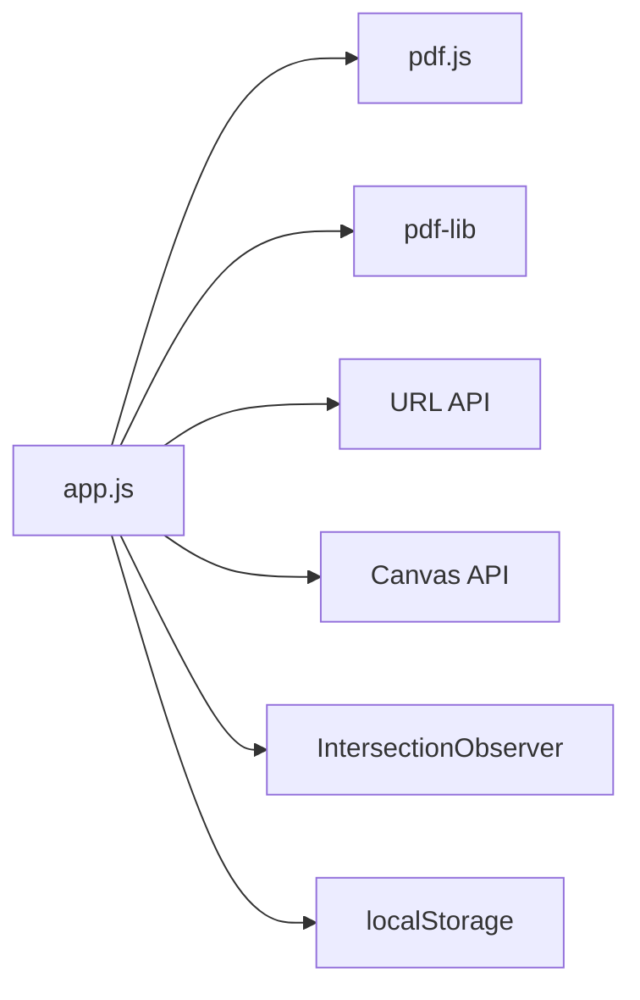

**图表来源**
- [app.js:7-10](file://pdf-splitter/app.js#L7-L10)
- [app.js:243-263](file://pdf-splitter/app.js#L243-L263)
- [app.js:288-305](file://pdf-splitter/app.js#L288-L305)
- [app.js:483-485](file://pdf-splitter/app.js#L483-L485)
- [app.js:554-564](file://pdf-splitter/app.js#L554-L564)

**章节来源**
- [app.js:7-10](file://pdf-splitter/app.js#L7-L10)
- [app.js:243-263](file://pdf-splitter/app.js#L243-L263)
- [app.js:288-305](file://pdf-splitter/app.js#L288-L305)
- [app.js:483-485](file://pdf-splitter/app.js#L483-L485)
- [app.js:554-564](file://pdf-splitter/app.js#L554-L564)

## 性能考量
- 预览懒加载：仅渲染可视区域，减少初始渲染成本。
- 位图复用：已预览页直接复用 canvas 位图，避免重复栅格化。
- 处理让路：在密集处理循环中插入 `await tick()`，让出主线程帧，提升响应性。
- 进度反馈：分段更新进度条与文本，缓解长时间处理的感知压力。
- 大文件限制：一次性嵌入多页可能导致内存峰值偏高；建议分批处理或限制页数（当前实现为一次性嵌入）。

[本节为通用性能指导，不直接分析具体代码行]

## 故障排查指南
- 无法打开加密 PDF：
  - 现象：提示无法打开或需去除密码。
  - 原因：当前不支持加密 PDF。
  - 解决：先用其他工具去除密码后再导入。
- 处理缓慢：
  - 现象：出现“正在检测白边 N/M 页”耗时较长。
  - 原因：未预览到的页需要一次独立渲染。
  - 解决：启用“裁掉白边”并提前滚动预览，使更多页被渲染；或关闭白边检测以提升速度。
- 内存占用高：
  - 现象：手机卡顿或崩溃。
  - 原因：大文件一次性嵌入、pdf.js 文档未释放、临时 canvas 未释放。
  - 解决：确保换文件时旧 pdf.js 文档被销毁；避免长时间持有多个结果 URL；谨慎开启白边检测。
- 结果无法下载/分享：
  - 现象：点击无效或提示不支持。
  - 原因：原生桥不可用或浏览器不支持分享 API。
  - 解决：在 Android 壳内使用 PdfShell；浏览器环境下降级为下载。

**章节来源**
- [README.md:83-90](file://README.md#L83-L90)
- [app.js:234-238](file://pdf-splitter/app.js#L234-L238)
- [app.js:497-501](file://pdf-splitter/app.js#L497-L501)
- [app.js:530-552](file://pdf-splitter/app.js#L530-L552)

## 结论
该应用的状态管理以全局 `state` 为中心，结合 pdf.js 与 pdf-lib 的能力，实现了从文件加载、旋转归一化、预览、白边检测到结果生成的完整闭环。通过懒加载、位图复用、处理让路与明确的内存清理策略，兼顾了移动端性能与用户体验。最佳实践包括：始终通过 `state` 驱动 UI、在换文件时销毁旧 pdf.js 文档、及时撤销结果 URL、谨慎启用白边检测并在大文件场景下关注内存峰值。

[本节为总结性内容，不直接分析具体代码行]

## 附录：状态字段与生命周期速查
- file：文件选择时赋值，用于展示与命名。
- ab：文件读取后赋值，作为输入源。
- bytes：旋转归一化后赋值，供 pdf-lib 使用。
- pdf：openPdf() 中创建，换文件前销毁。
- sizes：openPdf() 中收集，驱动预览与列数判断。
- mode/marginX/marginY/shift/trim：用户输入更新，影响覆盖层与处理参数。
- busy：process() 开始时置真，finally 中置假。
- resultBytes/resultUrl/resultName：process() 成功后赋值，resetResult() 中清理。

**章节来源**
- [app.js:13-28](file://pdf-splitter/app.js#L13-L28)
- [app.js:204-239](file://pdf-splitter/app.js#L204-L239)
- [app.js:243-263](file://pdf-splitter/app.js#L243-L263)
- [app.js:412-508](file://pdf-splitter/app.js#L412-L508)
- [app.js:554-564](file://pdf-splitter/app.js#L554-L564)