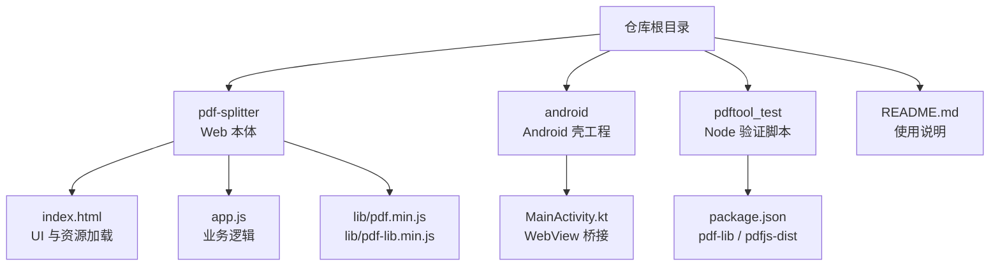
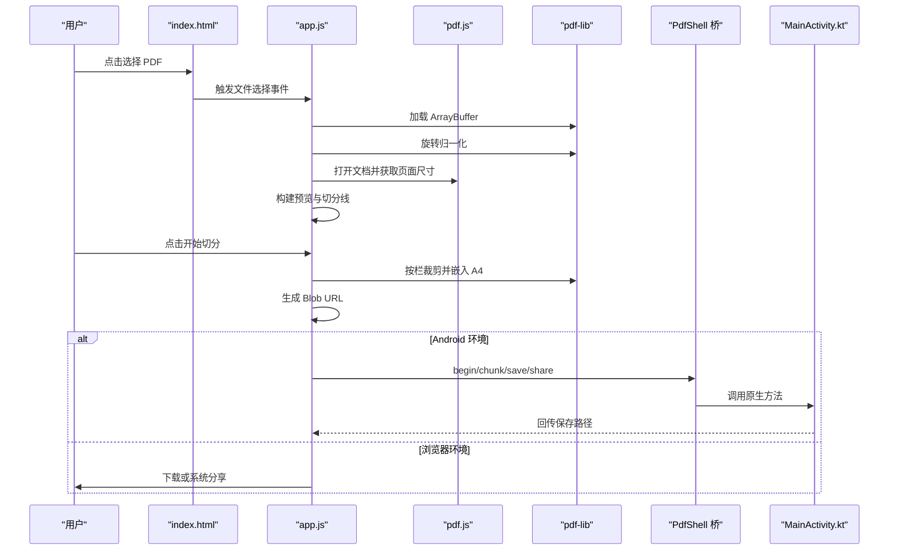
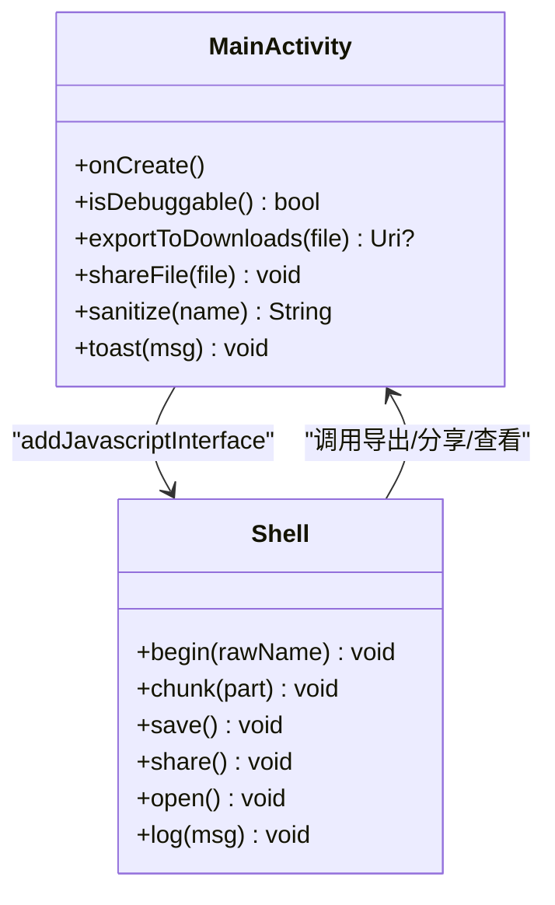

# 开发者指南

<cite>
**本文引用的文件**   
- [README.md](file://README.md)
- [app.js](file://pdf-splitter/app.js)
- [index.html](file://pdf-splitter/index.html)
- [MainActivity.kt](file://android/app/src/main/java/com/pdfsplitter/app/MainActivity.kt)
- [package.json](file://pdftool_test/package.json)
</cite>

## 目录
1. [简介](#简介)
2. [项目结构](#项目结构)
3. [开发环境搭建](#开发环境搭建)
4. [代码规范与最佳实践](#代码规范与最佳实践)
5. [调试技巧与工具](#调试技巧与工具)
6. [核心组件与数据流](#核心组件与数据流)
7. [扩展开发指导](#扩展开发指导)
8. [版本管理与协作流程](#版本管理与协作流程)
9. [性能与内存注意事项](#性能与内存注意事项)
10. [常见问题排查](#常见问题排查)
11. [结论](#结论)

## 简介
本项目是一个“试卷切分助手”，目标是把 A3/A4 拼版试卷（一页横排两栏或三栏）切分成“一页一题”的标准 A4 PDF，方便直接打印。全部处理在手机或电脑本地完成，不联网、不上传；Android 安装包没有用户可见的网络或存储权限，只依赖系统能力与 WebView。

Web 层使用 pdf.js 做解析和预览，使用 pdf-lib 做按栏裁剪并等比放入 A4 页面；Android 壳工程用 Kotlin + WebView 提供文件选择、结果保存、分享和查看文件等原生能力。

## 项目结构
仓库采用“Web 本体 + Android 壳 + 测试脚本”的三层组织方式：

- `pdf-splitter/`：PWA Web 本体，包含入口 HTML、前端逻辑和离线化的 pdf.js、pdf-lib。
- `android/`：Android 壳工程，构建时把 `pdf-splitter/` 同步到 assets，对外暴露 WebView 应用。
- `pdftool_test/`：Node.js 侧验证脚本，依赖 pdf-lib 和 pdfjs-dist，用于本地校验旋转矩阵、白边检测等算法。
- 根目录说明文档、图标生成脚本、PDF 校验脚本等辅助文件。

**图表来源**
- [README.md:13-22](file://README.md#L13-L22)
- [index.html:284-286](file://pdf-splitter/index.html#L284-L286)
- [MainActivity.kt:37-51](file://android/app/src/main/java/com/pdfsplitter/app/MainActivity.kt#L37-L51)
- [package.json:1-17](file://pdftool_test/package.json#L1-L17)

**章节来源**
- [README.md:13-22](file://README.md#L13-L22)

## 开发环境搭建

### 必要工具
- Node.js：用于运行 `pdftool_test/` 中的本地验证脚本。
- JDK 17：Android 构建需要较新的 JDK。
- Android SDK：至少 platform 36 与 build-tools。
- Gradle：仓库已带 wrapper，可直接通过 `./gradlew` 调用。
- Chrome DevTools：用于浏览器调试与 WebView 远程调试。
- Android Studio：用于打开 Android 工程、连接设备、查看日志。

### 克隆与初始化
1. 克隆仓库到本地。
2. 进入 `pdftool_test/`，安装依赖：
   - 执行包管理器安装命令后，会安装 pdf-lib 与 pdfjs-dist。
3. 在 `pdf-splitter/` 目录下启动本地 HTTP 服务，例如 Python 内置服务器，然后访问 `http://localhost:8000`。
4. 在 Android 工程中执行 Gradle 任务构建 Debug 或 Release APK。

### 构建产物路径
- Debug APK：包名带 `.debug` 后缀，可与正式版共存。
- Release APK：默认输出路径为 `android/app/build/outputs/apk/release/app-release.apk`。
- Web 资源：`pdf-splitter/` 是唯真源，构建任务会自动同步进 `android/app/src/main/assets/www/`，该目录不应手动维护。

**章节来源**
- [README.md:44-56](file://README.md#L44-L56)
- [package.json:1-17](file://pdftool_test/package.json#L1-L17)

## 代码规范与最佳实践

### JavaScript 编码风格
- 使用立即执行函数包裹主逻辑，避免污染全局命名空间。
- 使用 `'use strict'` 开启严格模式。
- 使用 `var` 管理局部状态，配合集中式 `state` 对象保存文件、尺寸、边距、模式、结果等。
- 使用 Promise 与 `async/await` 组合异步流程，如文件读取、PDF 加载、页面嵌入、保存等。
- 使用短变量名与局部 DOM 缓存减少重复查询。

### 命名约定
- 状态字段使用小写驼峰，如 `marginX`、`marginY`、`shift`、`trim`、`busy`。
- DOM 元素常用 `$` 前缀或语义化常量，如 `dropzone`、`pvGrid`、`actionBar`。
- 配置常量放在顶部，如 A4 宽高、白边裁剪余量、本地存储键名。
- Android 侧常量使用 `companion object`，如 TAG、START_URL、DOWNLOAD_DIR、VIEWER_PREFS。

### 注释规范
- 关键算法处有中文注释说明动机，例如旋转校正、白边裁剪、预览复用、WebView 桥职责。
- 对第三方库行为差异有明确注释，例如 pdf.js viewport 与 pdf-lib getSize/embedPage 坐标差异。
- 对用户可见提示与错误信息保持简洁可操作。

### 最佳实践
- 大文件处理中及时释放中间对象，例如渲染完成后清空 canvas 宽高。
- 长耗时任务中使用进度条和 UI 反馈，避免界面假死。
- 使用 IntersectionObserver 懒加载预览，降低首屏压力。
- 通过 WebViewAssetLoader 提供本地资源 URL，避免 file:// 协议下 worker 加载失败。
- 原生桥接口只做必要能力封装，业务逻辑尽量留在网页层。

**章节来源**
- [app.js:1-28](file://pdf-splitter/app.js#L1-L28)
- [app.js:57-103](file://pdf-splitter/app.js#L57-L103)
- [app.js:105-193](file://pdf-splitter/app.js#L105-L193)
- [MainActivity.kt:37-51](file://android/app/src/main/java/com/pdfsplitter/app/MainActivity.kt#L37-L51)

## 调试技巧与工具

### Chrome DevTools
- 浏览器端：直接访问 `http://localhost:8000`，打开 DevTools 查看 Console、Network、Performance。
- WebView 远程调试：安装 Debug APK 后，Chrome 访问 `chrome://inspect`，选中设备与 WebView 实例进行审查。
- 重点观察：
  - PDF 加载是否成功。
  - pdf.js worker 是否加载。
  - 预览 canvas 渲染是否触发。
  - 切分进度与最终 Blob URL 是否正确生成。

### Android Studio 调试
- 连接设备或模拟器，运行 Debug APK。
- 使用 Logcat 过滤 TAG `PdfSplitter`，查看原生侧日志。
- 检查 WebView 设置：JavaScript 启用、DOM Storage 启用、缓存策略。
- 检查文件选择回调、MediaStore 写入、FileProvider 分享是否正常。

### 日志分析方法
- 前端：
  - 使用 `console.error` 记录异常。
  - 使用进度文本提示当前阶段，如“正在读取 PDF”“正在检测白边 N/M 页”“正在生成第 i/N 页”。
- 原生：
  - 使用 `Log.d`、`Log.e`、`Log.w` 记录桥方法、导出失败、分享失败。
  - 通过 Toast 向用户反馈保存路径或失败原因。

**章节来源**
- [README.md:56-57](file://README.md#L56-L57)
- [MainActivity.kt:159-160](file://android/app/src/main/java/com/pdfsplitter/app/MainActivity.kt#L159-L160)
- [MainActivity.kt:194-208](file://android/app/src/main/java/com/pdfsplitter/app/MainActivity.kt#L194-L208)
- [MainActivity.kt:282-291](file://android/app/src/main/java/com/pdfsplitter/app/MainActivity.kt#L282-L291)

## 核心组件与数据流

### Web 层核心流程
Web 层负责：
- 选择 PDF 文件。
- 使用 pdf.js 解析文档、获取页面尺寸。
- 使用 pdf-lib 进行旋转归一化、按栏裁剪、嵌入 A4 页面。
- 生成结果 Blob URL，支持下载或分享。
- 在 Android 环境下通过 PdfShell 桥将结果传给原生。

**图表来源**
- [index.html:284-286](file://pdf-splitter/index.html#L284-L286)
- [app.js:204-239](file://pdf-splitter/app.js#L204-L239)
- [app.js:412-508](file://pdf-splitter/app.js#L412-L508)
- [app.js:512-552](file://pdf-splitter/app.js#L512-L552)
- [MainActivity.kt:166-262](file://android/app/src/main/java/com/pdfsplitter/app/MainActivity.kt#L166-L262)

### Android 壳职责
Android 壳只做四件事：
- 使用 WebViewAssetLoader 提供本地资源 URL。
- 拦截 `<input type="file">`，调用系统文件选择器并保留原始文件名。
- 实现 PdfShell 桥：分块 base64 传输结果、保存到 MediaStore、发起分享、定向阅读器打开。
- 让页面的 alert/confirm 弹窗正常显示。

**图表来源**
- [MainActivity.kt:37-51](file://android/app/src/main/java/com/pdfsplitter/app/MainActivity.kt#L37-L51)
- [MainActivity.kt:166-262](file://android/app/src/main/java/com/pdfsplitter/app/MainActivity.kt#L166-L262)

**章节来源**
- [README.md:67-76](file://README.md#L67-L76)
- [MainActivity.kt:85-152](file://android/app/src/main/java/com/pdfsplitter/app/MainActivity.kt#L85-L152)
- [MainActivity.kt:166-262](file://android/app/src/main/java/com/pdfsplitter/app/MainActivity.kt#L166-L262)

## 扩展开发指导

### 添加新功能
- 若新增的是 UI 交互或展示逻辑，优先在 `index.html` 与 `app.js` 中扩展。
- 若新增的是原生能力（如自定义分享渠道、新文件格式），在 `MainActivity.kt` 中增加桥方法，并在 `app.js` 中调用。
- 所有新增功能应提供用户可见提示与错误处理，避免静默失败。

### 集成第三方库
- Web 层：
  - 将第三方库放到 `pdf-splitter/lib/`，并在 `index.html` 中引入。
  - 注意 worker 路径、跨域限制、文件大小与加载时机。
- Android 层：
  - 在 Gradle 中添加依赖，确保与现有 Android SDK 版本兼容。
  - 避免引入需要网络权限或后台服务的库，以免破坏“本地处理”的设计原则。

### API 扩展方法
- 前端 API：
  - 在 `app.js` 中暴露必要的状态与方法，供外部脚本或自动化测试调用。
  - 保持方法签名稳定，避免破坏现有 WebView 桥。
- 原生 API：
  - 在 `Shell` 类中新增 `@JavascriptInterface` 方法。
  - 对输入参数做校验与清理，防止恶意文件名或异常数据导致崩溃。
  - 返回结果时通过 `evaluateJavascript` 或 Toast 通知前端。

**章节来源**
- [index.html:284-286](file://pdf-splitter/index.html#L284-L286)
- [app.js:512-552](file://pdf-splitter/app.js#L512-L552)
- [MainActivity.kt:166-262](file://android/app/src/main/java/com/pdfsplitter/app/MainActivity.kt#L166-L262)

## 版本管理与协作流程

### Git 工作流
- 主干分支建议为 `main`，功能开发使用独立分支，如 `feature/xxx`。
- 提交信息应清晰描述改动范围，例如“优化白边检测性能”“修复旋转矩阵 270° 问题”。
- 修改 Web 层后，确认 `pdf-splitter/` 能独立运行；修改 Android 层后，确认能构建 Debug APK。

### 分支策略
- 紧急修复走 hotfix 分支，合并回 main 后打标签。
- 大功能迭代先建 feature 分支，完成自测后再提 PR。
- 发布前在 main 上打 release 标签，并更新 README 中的版本号与构建说明。

### 代码审查规范
- 审查重点：
  - 是否有未处理的异常与边界条件。
  - 是否引入不必要的网络或权限。
  - 是否影响大文件处理时的内存占用。
  - 是否破坏 WebView 桥契约。
- 审查通过后合并，并补充测试用例或验证脚本。

[本节为通用流程说明，不直接分析具体源码文件]

## 性能与内存注意事项

### 预览复用
- 已渲染过的预览 canvas 会被标记为 `painted`，裁白边时直接复用位图，避免二次栅格化。
- 未预览到的页仍会触发一次 pdf.js 渲染，这是“处理会稍慢”的主要来源。

### 白边裁剪
- 白边裁剪逐页扫描像素，时间复杂度与像素量相关。
- 检测到墨迹的最小矩形作为裁剪框，再等比放入 A4，提升纸面利用率。
- 检测不到墨迹的栏退回整栏，不会裁空。

### 旋转校正
- pdf.js viewport 应用 `/Rotate`，而 pdf-lib 的 `getSize()`/`embedPage()` 忽略它。
- 因此先烘焙旋转，统一坐标系，避免预览与裁剪坐标不一致。
- 无旋转页面跳过重存，直接使用原字节，节省 IO。

### 大文件处理
- 几百页扫描件一次性嵌入会导致内存峰值偏高。
- 当前实现不能中途取消，需提醒用户耐心等待。
- 建议后续考虑分页处理或流式写入以降低峰值。

**章节来源**
- [README.md:77-90](file://README.md#L77-L90)
- [app.js:105-193](file://pdf-splitter/app.js#L105-L193)
- [app.js:412-508](file://pdf-splitter/app.js#L412-L508)

## 常见问题排查

### 无法打开加密 PDF
- 前端会提示加密文件需先去除密码。
- 检查 pdf-lib 加载时是否忽略加密，但加密内容仍无法正确解析。

### WebView 中 pdf.js worker 加载失败
- 使用 WebViewAssetLoader 提供本地资源 URL，避免 file:// 协议问题。
- 确认 `lib/pdf.worker.min.js` 存在且路径正确。

### 保存失败或路径为空
- 检查 MediaStore 写入是否成功，查看 Logcat 中 `export failed`。
- 确认系统允许应用写入下载目录，或改用分享方式。

### 分享找不到接收应用
- 检查 FileProvider 配置与应用清单。
- 确认系统中有 PDF 阅读器或分享目标。

**章节来源**
- [app.js:234-238](file://pdf-splitter/app.js#L234-L238)
- [MainActivity.kt:194-208](file://android/app/src/main/java/com/pdfsplitter/app/MainActivity.kt#L194-L208)
- [MainActivity.kt:282-291](file://android/app/src/main/java/com/pdfsplitter/app/MainActivity.kt#L282-L291)

## 结论
本项目的核心在于“Web 业务 + 原生桥接”的清晰分工：Web 层专注 PDF 解析、预览、切分与结果生成，Android 层专注文件选择、保存、分享与查看。通过 pdf.js 与 pdf-lib 的组合，实现了本地离线处理、旋转校正、白边裁剪与 A4 适配。开发者在扩展功能时应遵循现有架构，保持性能与内存友好，并提供完善的用户提示与错误处理。

[本节为总结性内容，不直接分析具体源码文件]