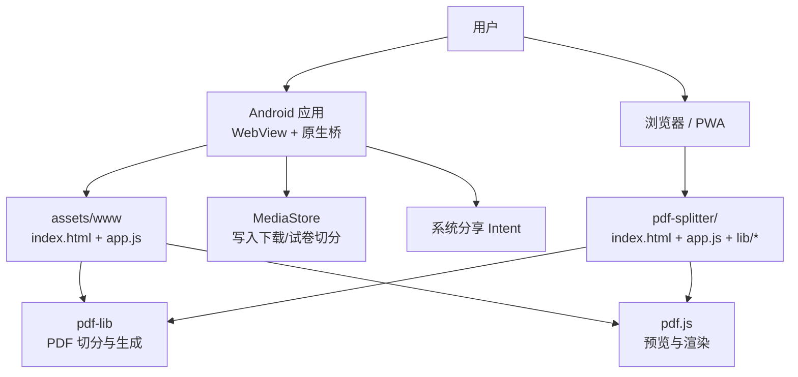
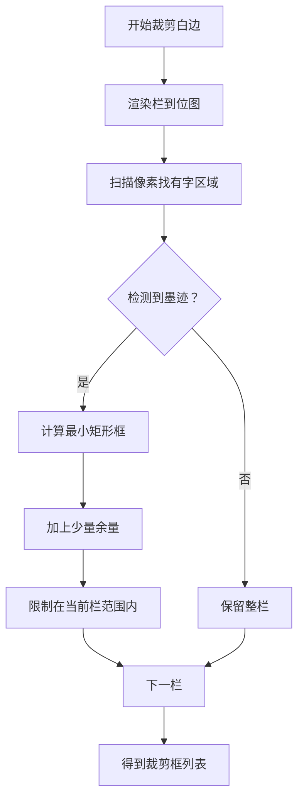

# 快速开始

<cite>
**本文引用的文件**   
- [README.md](file://README.md)
- [MainActivity.kt](file://android/app/src/main/java/com/pdfsplitter/app/MainActivity.kt)
- [AndroidManifest.xml](file://android/app/src/main/AndroidManifest.xml)
- [index.html](file://pdf-splitter/index.html)
- [app.js](file://pdf-splitter/app.js)
</cite>

## 目录
1. [简介](#简介)
2. [项目结构速览](#项目结构速览)
3. [Android 应用：从零到打印的完整流程](#android-应用从零到打印的完整流程)
4. [Web PWA：两种打开方式与使用方法](#web-pwa两种打开方式与使用方法)
5. [核心处理逻辑速览](#核心处理逻辑速览)
6. [常见问题与排错](#常见问题与排错)
7. [性能与注意事项](#性能与注意事项)
8. [结论](#结论)

## 简介
试卷切分助手的目的是把 A3/A4 拼版试卷（一页里横排 2 栏或 3 栏）切成「一页一题」的标准 A4 PDF，方便直接打印。所有处理都在手机或电脑本地完成，不联网、不上传；Android 安装包没有网络等用户可见权限，隐私更安全。

对于新用户，最简路径是：
- Android：安装 APK → 选 PDF → 切分 → 保存到本地 → 查看或分享 → 系统打印。
- Web：直接双击 `pdf-splitter/index.html`，或通过本地 HTTP 服务器访问后使用。

**章节来源**
- [README.md:1-5](file://README.md#L1-L5)

## 项目结构速览
仓库主要包含三部分：
- `pdf-splitter/`：Web 本体，包含页面、样式、脚本和 pdf.js、pdf-lib 本地库，可直接离线使用。
- `android/`：Android 壳工程，用 WebView 加载网页，并补齐手机端必需能力：选择文件、写入下载目录、唤起系统分享、定向阅读器。
- 其他：构建脚本、测试脚本、图标生成脚本等。



**图表来源**
- [MainActivity.kt:31-36](file://android/app/src/main/java/com/pdfsplitter/app/MainActivity.kt#L31-L36)
- [MainActivity.kt:103-151](file://android/app/src/main/java/com/pdfsplitter/app/MainActivity.kt#L103-L151)
- [index.html:284-286](file://pdf-splitter/index.html#L284-L286)
- [app.js:1-11](file://pdf-splitter/app.js#L1-L11)

**章节来源**
- [README.md:13-22](file://README.md#L13-L22)

## Android 应用：从零到打印的完整流程

### 第一步：安装 APK
- 将打包好的 APK 传到手机，点击安装。
- 如果提示需要允许「安装未知应用」，请允许当前来源安装。
- 安装完成后在桌面找到「试卷切分助手」并打开。

说明：
- 应用要求 Android 10 及以上。
- 应用本身不声明网络等用户可见权限，只通过系统能力读写文件和发起分享。

**章节来源**
- [README.md:24-35](file://README.md#L24-L35)
- [AndroidManifest.xml:4-12](file://android/app/src/main/AndroidManifest.xml#L4-L12)

### 第二步：选择试卷 PDF
- 打开 App 后，点击「点击选择试卷 PDF」。
- 系统会弹出文件选择器，选择你的拼版 PDF。
- 应用会显示文件名、页数和大小，并自动进入设置与预览界面。

注意：
- 如果系统文件选择器无法选择 PDF，请确认系统文件管理器支持 PDF 类型，或在「存储权限」相关设置中允许该文件管理器访问文件。
- 应用内部会把选择的 PDF 复制到缓存目录，避免后续读取失败。

**章节来源**
- [MainActivity.kt:56-83](file://android/app/src/main/java/com/pdfsplitter/app/MainActivity.kt#L56-L83)
- [index.html:164-177](file://pdf-splitter/index.html#L164-L177)

### 第三步：选择分栏方式与边距
- 分栏方式默认「自动识别」，按页面长宽比判断 2 栏或 3 栏。
- 如果自动识别不准，可手动选择「左右 2 栏」「左中右 3 栏」或「不切分」。
- 调整左右边距、上下边距和切分线微调，使预览中的虚线尽量贴合题目边界。
- 「裁掉页面四周白边」默认关闭；勾选后会按每栏实际有字范围裁剪，放大后更铺满 A4，但处理会变慢。

提示：
- 上下边距决定最终放大率；左右边距主要用于给装订打孔留空间。
- 切分线只能整体等分加全局微调，不能逐栏独立设置。

**章节来源**
- [index.html:194-220](file://pdf-splitter/index.html#L194-L220)
- [app.js:45-54](file://pdf-splitter/app.js#L45-L54)
- [app.js:363-399](file://pdf-splitter/app.js#L363-L399)

### 第四步：预览切分效果
- 应用会为每一页生成预览图，并在图上叠加切分虚线。
- 你可以滚动预览，观察不同页面的切分位置是否合适。
- 如果切分线偏了，回到设置调整「切分线微调」或手动切换分栏模式。

优化点：
- 预览采用懒加载，只有进入可视区域才会渲染，节省内存。
- 已渲染过的页面会被标记，后续检测白边时可以直接复用位图，减少重复渲染。

**章节来源**
- [index.html:222-229](file://pdf-splitter/index.html#L222-L229)
- [app.js:265-329](file://pdf-splitter/app.js#L265-L329)
- [app.js:153-193](file://pdf-splitter/app.js#L153-L193)

### 第五步：开始切分
- 点击底部固定操作栏的「开始切分」。
- 进度条会显示当前阶段，例如「正在读取 PDF」「正在检测白边」「正在嵌入页面内容」「正在生成第 N/M 页」「正在保存」。
- 切分完成后，页面会自动滚到底部，结果卡片就在拇指附近。

输出信息：
- 结果卡片会显示总页数、A4 纵向、输出文件大小。
- 如果是 Android 环境，按钮文案会变为「保存到本地」。

**章节来源**
- [index.html:270-282](file://pdf-splitter/index.html#L270-L282)
- [app.js:401-508](file://pdf-splitter/app.js#L401-L508)

### 第六步：保存到本地
- 点击「保存到本地」，应用会把结果写入手机的「下载 / 试卷切分」文件夹。
- 保存成功后，会显示实际路径；如果重名，系统会自动加序号。
- 同时会出现「查看文件」按钮，可直接交给 WPS、小米多看等阅读器打开。

实现要点：
- 原生层通过 MediaStore 写入下载目录，并把真实路径回传给页面显示。
- 文件名会保留原始试卷名称，并做安全字符替换。

**章节来源**
- [MainActivity.kt:186-209](file://android/app/src/main/java/com/pdfsplitter/app/MainActivity.kt#L186-L209)
- [MainActivity.kt:264-280](file://android/app/src/main/java/com/pdfsplitter/app/MainActivity.kt#L264-L280)
- [app.js:530-539](file://pdf-splitter/app.js#L530-L539)

### 第七步：查看文件或分享
- 「查看文件」会优先尝试打开真正的 PDF 阅读器，如 WPS、小米多看、Xodo、Adobe Reader 等。
- 如果没有命中白名单，会退回系统选择器让你选择应用。
- 「分享」会通过系统分享面板发送到微信、QQ、邮件或系统打印服务；它只发送文件，不会额外写入下载目录。

**章节来源**
- [MainActivity.kt:222-256](file://android/app/src/main/java/com/pdfsplitter/app/MainActivity.kt#L222-L256)
- [MainActivity.kt:282-292](file://android/app/src/main/java/com/pdfsplitter/app/MainActivity.kt#L282-L292)
- [app.js:541-552](file://pdf-splitter/app.js#L541-L552)

### 第八步：打印
- 在系统打印对话框中选择纸张为 A4。
- 缩放选择「适应页面」或「实际大小」。
- 这样每页内容会铺满一张 A4 纸，适合直接打印。

**章节来源**
- [index.html:262-264](file://pdf-splitter/index.html#L262-L264)
- [README.md:31-33](file://README.md#L31-L33)

## Web PWA：两种打开方式与使用方法

### 方式一：直接双击 HTML 文件
- 在电脑上找到 `pdf-splitter/index.html`。
- 双击打开，浏览器会加载页面。
- 点击「点击选择试卷 PDF」，选择本地 PDF。
- 设置分栏、边距、切分线后点击「开始切分」。
- 切分完成后点击「下载 PDF」即可保存。

特点：
- 完全离线，不需要服务器。
- 浏览器版本走浏览器下载机制，不经手机下载目录。

**章节来源**
- [README.md:37-42](file://README.md#L37-L42)
- [index.html:164-177](file://pdf-splitter/index.html#L164-L177)
- [app.js:530-539](file://pdf-splitter/app.js#L530-L539)

### 方式二：通过本地 HTTP 服务器访问
- 进入 `pdf-splitter` 目录。
- 运行 Python 内置 HTTP 服务器：`python -m http.server 8000`。
- 在 Chrome 中访问 `http://localhost:8000`。
- 在 Chrome 中可以「安装到桌面/主屏幕」，像 App 一样使用。

特点：
- 更适合移动端浏览器体验。
- 可以安装为 PWA，获得更接近原生应用的入口。

**章节来源**
- [README.md:39-42](file://README.md#L39-L42)

### Web 端操作流程
1. 打开页面后点击选择 PDF。
2. 选择分栏方式与边距。
3. 查看预览中的切分线。
4. 点击「开始切分」。
5. 点击「下载 PDF」保存结果。
6. 如果需要分享，点击「分享」调用系统分享 API。

**章节来源**
- [index.html:164-282](file://pdf-splitter/index.html#L164-L282)
- [app.js:195-239](file://pdf-splitter/app.js#L195-L239)
- [app.js:401-508](file://pdf-splitter/app.js#L401-L508)
- [app.js:530-552](file://pdf-splitter/app.js#L530-L552)

## 核心处理逻辑速览

### 旋转校正
有些扫描 PDF 带有 `/Rotate`，导致显示方向与实际坐标不一致。应用会在加载后做一次归一化：
- 把旋转烘焙进页面内容矩阵。
- 90°/270° 时交换宽高。
- 去掉 `/Rotate`，让预览、检测栏数、裁剪在同一套坐标下工作。

```mermaid
flowchart TD
Start["加载 PDF"] --> CheckRotate["检查页面是否带 /Rotate"]
CheckRotate --> |无旋转| UseOriginal["直接使用原字节"]
CheckRotate --> |有旋转| Normalize["烘焙旋转矩阵并重存"]
Normalize -> Preview["统一坐标预览"]
UseOriginal -> Preview
Preview -> DetectCols["检测栏数"]
DetectCols -> TrimOrCut["裁剪白边或直接切分"]
TrimOrCut -> EmbedA4["嵌入 A4 页面"]
EmbedA4 -> Save["保存结果"]
```

**图表来源**
- [app.js:57-103](file://pdf-splitter/app.js#L57-L103)
- [app.js:204-239](file://pdf-splitter/app.js#L204-L239)

**章节来源**
- [README.md:77-81](file://README.md#L77-L81)
- [app.js:57-103](file://pdf-splitter/app.js#L57-L103)

### 白边裁剪
开启「裁掉页面四周白边」后：
- 把每栏渲染成位图。
- 扫描像素找出有墨迹的最小矩形。
- 作为真正裁剪框，再等比放入 A4。
- 如果检测不到墨迹，则退回整栏，不会裁空。



**图表来源**
- [app.js:105-193](file://pdf-splitter/app.js#L105-L193)

**章节来源**
- [README.md:81-82](file://README.md#L81-L82)
- [app.js:105-193](file://pdf-splitter/app.js#L105-L193)

### 生成 A4 输出
- 按栏裁剪或等分后，把每个栏嵌入新的 A4 页面。
- 根据左右、上下边距计算可用区域。
- 按宽和高都不超出可用区的方式等比缩放。
- 生成完成后输出 PDF。

**章节来源**
- [app.js:421-486](file://pdf-splitter/app.js#L421-L486)

## 常见问题与排错

### 问题一：无法选择 PDF 文件
可能原因：
- 系统文件选择器不支持 PDF。
- 文件管理器权限不足。
- WebView 的文件选择回调未正确触发。

解决方法：
- 更换系统文件管理器，确保能浏览 PDF。
- 在系统设置中允许该文件管理器访问存储。
- 在 Android 应用中，原生层会捕获文件选择回调并复制文件到缓存目录，避免后续读取失败。

**章节来源**
- [MainActivity.kt:114-124](file://android/app/src/main/java/com/pdfsplitter/app/MainActivity.kt#L114-L124)
- [MainActivity.kt:56-83](file://android/app/src/main/java/com/pdfsplitter/app/MainActivity.kt#L56-L83)

### 问题二：保存失败或找不到文件
可能原因：
- 写入「下载」目录失败。
- 存储权限异常。
- 文件名被系统修改。

解决方法：
- 确认「下载 / 试卷切分」目录存在。
- 查看 Toast 提示的实际路径。
- 如果重名，系统会自动加序号，例如 `(1)`。

**章节来源**
- [MainActivity.kt:186-209](file://android/app/src/main/java/com/pdfsplitter/app/MainActivity.kt#L186-L209)
- [MainActivity.kt:264-280](file://android/app/src/main/java/com/pdfsplitter/app/MainActivity.kt#L264-L280)

### 问题三：点击「查看文件」没有打开阅读器
可能原因：
- 系统里没有安装 PDF 阅读器。
- 包可见性限制导致查询不到应用。
- 默认选择器被邮箱、网盘、AI 助手等拦截。

解决方法：
- 安装 WPS、小米多看、Xodo、Adobe Reader 等阅读器。
- 应用已声明 `queries`，用于查询能打开 PDF 的应用。
- 如果白名单没命中，会退回系统选择器。

**章节来源**
- [AndroidManifest.xml:4-12](file://android/app/src/main/AndroidManifest.xml#L4-L12)
- [MainActivity.kt:44-49](file://android/app/src/main/java/com/pdfsplitter/app/MainActivity.kt#L44-L49)
- [MainActivity.kt:222-256](file://android/app/src/main/java/com/pdfsplitter/app/MainActivity.kt#L222-L256)

### 问题四：加密 PDF 无法打开
现象：
- 提示无法打开 PDF，可能是加密文件。

解决方法：
- 先用其他工具去除密码。
- 应用加载 PDF 时会忽略加密标志，但底层解析仍可能失败。

**章节来源**
- [app.js:216-238](file://pdf-splitter/app.js#L216-L238)
- [README.md:90](file://README.md#L90)

### 问题五：自动识别栏数不对
现象：
- A3 横版三栏被判成 2 栏。

原因：
- 自动识别只按页面长宽比判断：比例 ≥1.85 判 3 栏，≥1.2 判 2 栏。
- A3 横版三栏的比例约 1.41，会被判成 2 栏。

解决方法：
- 手动选择「左中右 3 栏」。

**章节来源**
- [README.md:85](file://README.md#L85)
- [app.js:45-54](file://pdf-splitter/app.js#L45-L54)

### 问题六：处理很慢
可能原因：
- 开启了「裁掉页面四周白边」。
- 大文件几百页扫描件一次性嵌入，内存峰值偏高。
- 没有预览到的页仍需一次 pdf.js 渲染。

解决方法：
- 先不开启白边裁剪，确认基本切分正常后再开启。
- 分批处理超大文件。
- 等待进度条完成，不要频繁切换页面。

**章节来源**
- [README.md:88-90](file://README.md#L88-L90)
- [app.js:153-193](file://pdf-splitter/app.js#L153-L193)
- [app.js:440-450](file://pdf-splitter/app.js#L440-L450)

## 性能与注意事项

### 性能特征
- 预览懒加载：只有进入可视区域的页面才会渲染。
- 白边裁剪复用位图：已经画过的页直接复用，避免重复栅格化。
- 大文件内存峰值高：几百页扫描件一次性嵌入，不能中途取消。
- 白边裁剪耗时主要来自 pdf.js 渲染，不是像素量瓶颈。

### 最佳实践
- 首次使用建议先不勾选「裁掉页面四周白边」，确认切分线正确后再开启。
- 调整上下边距控制放大率，调整左右边距控制装订空间。
- 打印前先在阅读器中预览，确认分页和缩放合适。
- 大文件建议在性能较好的设备上处理。

**章节来源**
- [README.md:81-90](file://README.md#L81-L90)
- [app.js:288-329](file://pdf-splitter/app.js#L288-L329)
- [app.js:440-486](file://pdf-splitter/app.js#L440-L486)

## 结论
通过 Android 应用或 Web PWA，你可以在最短时间内完成第一次成功的 PDF 切分：
- Android：安装 APK → 选 PDF → 切分 → 保存到本地 → 查看或分享 → 打印。
- Web：打开 HTML 或本地 HTTP 服务器 → 选 PDF → 切分 → 下载或分享。

如果遇到权限、文件选择器、阅读器打开等问题，可参考常见问题部分逐步排查。处理大文件或开启白边裁剪时，注意性能和内存占用。