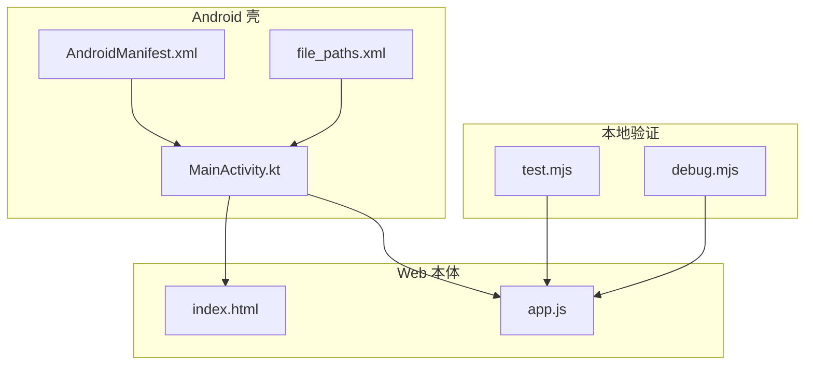

# 故障排除

<cite>
**本文引用的文件**   
- [README.md](file://README.md)
- [AndroidManifest.xml](file://android/app/src/main/AndroidManifest.xml)
- [MainActivity.kt](file://android/app/src/main/java/com/pdfsplitter/app/MainActivity.kt)
- [file_paths.xml](file://android/app/src/main/res/xml/file_paths.xml)
- [index.html](file://pdf-splitter/index.html)
- [app.js](file://pdf-splitter/app.js)
- [test.mjs](file://pdftool_test/test.mjs)
- [debug.mjs](file://pdftool_test/debug.mjs)
</cite>

## 目录
1. [简介](#简介)
2. [项目结构与定位](#项目结构与定位)
3. [常见问题与解决方案](#常见问题与解决方案)
4. [错误诊断方法](#错误诊断方法)
5. [已知限制与变通方案](#已知限制与变通方案)
6. [性能调优指南](#性能调优指南)
7. [安全注意事项](#安全注意事项)
8. [社区支持与贡献](#社区支持与贡献)
9. [结论](#结论)

## 简介
本故障排除文档面向「试卷切分助手」的使用者、测试人员与维护者，覆盖安装问题、权限配置、文件选择器异常、处理失败、保存与分享异常、性能瓶颈与安全注意事项。文档同时给出日志分析、堆栈跟踪、内存优化和兼容性处理的实操建议，并说明项目的已知限制及可采用的 workaround。

## 项目结构与定位
该仓库包含三部分：
- Android 原生壳工程：负责 WebView 资源加载、系统文件选择、结果写入下载目录、系统分享与查看文件定向。
- Web 本体（PWA）：基于 pdf.js 预览、pdf-lib 裁剪与生成 A4 PDF，全部在本地浏览器或 WebView 中运行。
- 本地验证脚本：用于 Node 环境下快速验证 pdf-lib 的切分逻辑。

**图表来源**
- [MainActivity.kt:37-151](file://android/app/src/main/java/com/pdfsplitter/app/MainActivity.kt#L37-L151)
- [AndroidManifest.xml:1-45](file://android/app/src/main/AndroidManifest.xml#L1-L45)
- [file_paths.xml:1-5](file://android/app/src/main/res/xml/file_paths.xml#L1-L5)
- [index.html:284-286](file://pdf-splitter/index.html#L284-L286)
- [app.js:1-10](file://pdf-splitter/app.js#L1-L10)
- [test.mjs:1-18](file://pdftool_test/test.mjs#L1-L18)
- [debug.mjs:1-18](file://pdftool_test/debug.mjs#L1-L18)

**章节来源**
- [README.md:13-22](file://README.md#L13-L22)
- [MainActivity.kt:31-49](file://android/app/src/main/java/com/pdfsplitter/app/MainActivity.kt#L31-L49)
- [index.html:1-13](file://pdf-splitter/index.html#L1-L13)

## 常见问题与解决方案

### 安装与启动问题
- 现象：安装 APK 后无法打开、提示签名错误或升级失败。
- 原因：签名密钥丢失或重新签名导致已安装用户无法直接升级；调试包与发布包共存时行为不同。
- 解决：
  - 使用 README 中的构建命令重新构建 debug/release 包。
  - 若签名密钥丢失，只能卸载重装；更换密钥需按 README 指引生成新的 keystore。
  - 调试阶段使用 debug 包并通过 Chrome inspect 调试 WebView。

**章节来源**
- [README.md:44-65](file://README.md#L44-L65)
- [MainActivity.kt:85-101](file://android/app/src/main/java/com/pdfsplitter/app/MainActivity.kt#L85-L101)

### 权限与存储写入异常
- 现象：点击「保存到本地」无反应、提示写入失败、找不到输出路径。
- 原因：
  - MediaStore 写入失败或返回 null。
  - 重名时系统自动加后缀，但页面未正确回显真实路径。
  - FileProvider 配置不正确导致分享失败。
- 排查步骤：
  - 检查 MainActivity 的 exportToDownloads 是否返回 Uri，以及 IS_PENDING 标记是否正确更新。
  - 确认 file_paths.xml 暴露了缓存目录 out，供 FileProvider 分享临时文件。
  - 查看 Toast 提示与 Logcat 中 “export failed” 日志。
- 解决：
  - 确保应用具备写入外部存储的能力（通过 MediaStore 而非直接路径）。
  - 若分享失败，检查 AndroidManifest.xml 中 FileProvider 的 authorities 与 meta-data 配置。
  - 若“查看文件”失败，确认 queries 声明了 VIEW action + application/pdf，以便查询到阅读器。

**章节来源**
- [MainActivity.kt:186-220](file://android/app/src/main/java/com/pdfsplitter/app/MainActivity.kt#L186-L220)
- [MainActivity.kt:264-292](file://android/app/src/main/java/com/pdfsplitter/app/MainActivity.kt#L264-L292)
- [file_paths.xml:1-5](file://android/app/src/main/res/xml/file_paths.xml#L1-L5)
- [AndroidManifest.xml:33-41](file://android/app/src/main/AndroidManifest.xml#L33-L41)
- [AndroidManifest.xml:7-12](file://android/app/src/main/AndroidManifest.xml#L7-L12)

### 文件选择器异常
- 现象：点击选择 PDF 无响应、选完文件不加载、文件名丢失。
- 原因：
  - WebView 裸模式下 <input type="file"> 默认无效，需要原生 onShowFileChooser 回调。
  - 系统文件选择器返回的 Uri 没有流或读取失败。
  - 原始文件名未保留，导致结果命名异常。
- 排查步骤：
  - 检查 MainActivity.onShowFileChooser 是否调用 pickPdf.launch 并设置 pendingFiles。
  - 检查 pickPdf 回调中是否成功复制文件到 cacheDir/pick，并返回 Uri 数组。
  - 检查 displayNameOf 是否能从 OpenableColumns.DISPLAY_NAME 取到文件名。
- 解决：
  - 确保 ActivityResultContracts.OpenDocument() 可用且权限正常。
  - 若文件名乱码或缺失，使用 lastPathSegment 兜底，并 sanitize 清理非法字符。

**章节来源**
- [MainActivity.kt:114-124](file://android/app/src/main/java/com/pdfsplitter/app/MainActivity.kt#L114-L124)
- [MainActivity.kt:56-83](file://android/app/src/main/java/com/pdfsplitter/app/MainActivity.kt#L56-L83)
- [MainActivity.kt:294-299](file://android/app/src/main/java/com/pdfsplitter/app/MainActivity.kt#L294-L299)

### PDF 打开与加密问题
- 现象：提示无法打开 PDF，或处理失败。
- 原因：
  - PDF 被加密，前端忽略加密仍可能失败。
  - 旋转坐标不一致导致预览与裁剪错位。
- 排查步骤：
  - 查看 app.js 中 loadFile 的 catch 分支，确认是否弹出加密提示。
  - 检查 normalizeRotation 是否检测到 /Rotate 并烘焙矩阵。
- 解决：
  - 对加密 PDF 先去除密码再处理。
  - 若页面方向异常，确认 normalizeRotation 已将 Rotate 顺时针烘焙进内容，并移除 /Rotate。

**章节来源**
- [app.js:204-239](file://pdf-splitter/app.js#L204-L239)
- [app.js:57-103](file://pdf-splitter/app.js#L57-L103)
- [README.md:77-81](file://README.md#L77-L81)

### 预览与切分线显示异常
- 现象：预览空白、切分线位置不对、输出页数错误。
- 原因：
  - IntersectionObserver 懒渲染未触发。
  - 设置变更后未调用 updateOverlays 刷新切分线与输出计数。
  - 列数检测逻辑与手动模式冲突。
- 排查步骤：
  - 检查 buildPreview 是否创建 canvas 与 cut-layer。
  - 检查 seg-mode 点击事件是否更新 state.mode 并 resetResult。
  - 检查 colsFor 与 detectCols 的逻辑是否与界面选项一致。
- 解决：
  - 在非 IntersectionObserver 环境强制渲染所有项。
  - 切换模式后重新计算总页数并更新 UI。

**章节来源**
- [app.js:265-329](file://pdf-splitter/app.js#L265-L329)
- [app.js:331-361](file://pdf-splitter/app.js#L331-L361)
- [app.js:363-399](file://pdf-splitter/app.js#L363-L399)
- [app.js:45-54](file://pdf-splitter/app.js#L45-L54)

### 白边裁剪与性能卡顿
- 现象：开启“裁掉页面四周白边”后处理明显变慢，进度停留在“正在检测白边”。
- 原因：
  - 每栏需要栅格化位图扫描墨迹，未预览到的页会额外渲染一次。
  - 大文件一次性嵌入，内存峰值偏高。
- 排查步骤：
  - 观察 trimBands 是否复用 paintedPreview 的 canvas。
  - 检查 scanBands 与 scanInk 是否及时释放 canvas 尺寸。
- 解决：
  - 对大扫描件谨慎开启白边裁剪，或分批处理。
  - 利用预览已画过的页直接复用位图，避免重复栅格化。

**章节来源**
- [app.js:105-193](file://pdf-splitter/app.js#L105-L193)
- [README.md:81-90](file://README.md#L81-L90)

### 保存与分享异常
- 现象：点击“保存到本地”无结果，或“分享”失败。
- 原因：
  - PdfShell.begin/chunk/save 流程未完成。
  - FileProvider 未找到可接收的应用。
  - 浏览器不支持 navigator.share。
- 排查步骤：
  - 检查 app.js 中 shellUsable 与 shellTransfer 是否执行。
  - 检查 MainActivity.Share 是否抛出异常并 toast 提示。
  - 在浏览器版 fallback 到下载链接或系统分享 API。
- 解决：
  - 在 Android 壳中使用 PdfShell.save 与 share。
  - 浏览器环境提供下载按钮与 navigator.share 降级提示。

**章节来源**
- [app.js:512-552](file://pdf-splitter/app.js#L512-L552)
- [MainActivity.kt:211-256](file://android/app/src/main/java/com/pdfsplitter/app/MainActivity.kt#L211-L256)

### 查看文件定向失败
- 现象：点击“查看文件”无法打开 WPS 等阅读器，或误交给邮箱/网盘。
- 原因：
  - Android 11+ 包可见性限制导致 queryIntentActivities 返回空。
  - VIEWER_PREFS 白名单未命中。
- 排查步骤：
  - 检查 AndroidManifest.xml 中 queries 是否声明 application/pdf。
  - 检查 MainActivity.open 是否优先匹配白名单包名。
- 解决：
  - 确保 manifest 声明 queries。
  - 在白名单未命中时退回系统选择器。

**章节来源**
- [AndroidManifest.xml:7-12](file://android/app/src/main/AndroidManifest.xml#L7-L12)
- [MainActivity.kt:222-256](file://android/app/src/main/java/com/pdfsplitter/app/MainActivity.kt#L222-L256)
- [README.md:67-75](file://README.md#L67-L75)

## 错误诊断方法

### 日志分析
- Android 侧：
  - 关注 TAG “PdfSplitter” 的 Log.e 与 Log.w，尤其是 export failed、open failed、share failed。
  - 使用 adb logcat 过滤 com.pdfsplitter.app 或 PdfSplitter。
- Web 侧：
  - 在 Chrome DevTools Console 中查看 console.error 输出的加载失败、渲染失败、处理失败信息。
  - 若为 PWA，可在 Application 面板检查 Service Worker 与 Cache Storage。

**章节来源**
- [MainActivity.kt:194-196](file://android/app/src/main/java/com/pdfsplitter/app/MainActivity.kt#L194-L196)
- [MainActivity.kt:251-254](file://android/app/src/main/java/com/pdfsplitter/app/MainActivity.kt#L251-L254)
- [MainActivity.kt:283-291](file://android/app/src/main/java/com/pdfsplitter/app/MainActivity.kt#L283-L291)
- [app.js:234-238](file://pdf-splitter/app.js#L234-L238)
- [app.js:497-501](file://pdf-splitter/app.js#L497-L501)

### 堆栈跟踪
- Android：
  - 捕获 runCatching 的 onFailure 分支，记录完整堆栈。
  - 针对 MediaStore 写入失败，打印 Uri 与相对路径。
- Web：
  - 捕获 PDFLib.load、embedPages、save 的异常，记录 message 与堆栈。
  - 对 render 失败记录页索引与 viewport 尺寸。

**章节来源**
- [MainActivity.kt:194-196](file://android/app/src/main/java/com/pdfsplitter/app/MainActivity.kt#L194-L196)
- [MainActivity.kt:251-254](file://android/app/src/main/java/com/pdfsplitter/app/MainActivity.kt#L251-L254)
- [app.js:497-501](file://pdf-splitter/app.js#L497-L501)
- [app.js:324-326](file://pdf-splitter/app.js#L324-L326)

### 性能瓶颈定位
- 主要瓶颈：
  - 白边裁剪逐页栅格化，未预览到的页仍需一次 pdf.js 渲染。
  - 大文件一次性嵌入，内存峰值高。
- 定位方法：
  - 观察进度文本“正在检测白边 N/M 页”与“正在生成第 i/M 页”。
  - 使用 Chrome Performance 面板录制处理过程，定位长时间阻塞任务。
  - 对比开启/关闭白边裁剪的处理时间。

**章节来源**
- [README.md:81-90](file://README.md#L81-L90)
- [app.js:440-450](file://pdf-splitter/app.js#L440-L450)
- [app.js:459-477](file://pdf-splitter/app.js#L459-L477)

## 已知限制与变通方案

### 自动识别只按长宽比判断
- 限制：比例 ≥1.85 判 3 栏、≥1.2 判 2 栏；A3 横版三栏可能被判成 2 栏。
- 变通：手动选择“左中右 3 栏”。

**章节来源**
- [README.md:83-87](file://README.md#L83-L87)
- [app.js:45-54](file://pdf-splitter/app.js#L45-L54)

### 切分线只能整体等分 + 全局微调
- 限制：不能逐栏设独立边界。
- 变通：使用“切分线微调”滑块进行全局偏移。

**章节来源**
- [README.md:86-87](file://README.md#L86-L87)
- [app.js:331-361](file://pdf-splitter/app.js#L331-L361)

### 大文件内存峰值偏高
- 限制：几百页扫描件一次性嵌入，内存峰值高且不能中途取消。
- 变通：分批处理或降低分辨率；谨慎开启白边裁剪。

**章节来源**
- [README.md:88-90](file://README.md#L88-L90)
- [app.js:459-477](file://pdf-splitter/app.js#L459-L477)

### 加密 PDF 不支持
- 限制：加密 PDF 无法处理。
- 变通：先去除密码再导入。

**章节来源**
- [README.md:90-91](file://README.md#L90-L91)
- [app.js:219-238](file://pdf-splitter/app.js#L219-L238)

## 性能调优指南

### 内存管理
- 换文件时销毁上一份 pdf.js 文档，释放 worker 与缓存。
- 裁白边检测完成后立即释放 canvas 尺寸，避免位图常驻内存。
- 结果 URL 使用 ObjectURL 并在重置时 revoke。

**章节来源**
- [app.js:243-263](file://pdf-splitter/app.js#L243-L263)
- [app.js:182-191](file://pdf-splitter/app.js#L182-L191)
- [app.js:554-564](file://pdf-splitter/app.js#L554-L564)

### 渲染优化
- 使用 IntersectionObserver 懒渲染，仅渲染可视区域附近页。
- 预览已画过的页直接复用位图，避免重复栅格化。
- 控制 RENDER_W 以平衡清晰度与性能。

**章节来源**
- [app.js:288-305](file://pdf-splitter/app.js#L288-L305)
- [app.js:153-161](file://pdf-splitter/app.js#L153-L161)
- [app.js:266-285](file://pdf-splitter/app.js#L266-L285)

### 处理速度提升技巧
- 关闭白边裁剪以提升速度。
- 减少不必要的预览重渲染，仅在设置变化时更新 overlay。
- 使用 useObjectStreams 压缩输出。

**章节来源**
- [app.js:390-399](file://pdf-splitter/app.js#L390-L399)
- [app.js:331-361](file://pdf-splitter/app.js#L331-L361)
- [app.js:480-485](file://pdf-splitter/app.js#L480-L485)

## 安全注意事项

### 文件权限
- 应用不声明 uses-permission，仅通过 MediaStore 写入下载目录。
- FileProvider 仅暴露缓存目录 out，限制分享范围。

**章节来源**
- [AndroidManifest.xml:4-6](file://android/app/src/main/AndroidManifest.xml#L4-L6)
- [AndroidManifest.xml:33-41](file://android/app/src/main/AndroidManifest.xml#L33-L41)
- [file_paths.xml:1-5](file://android/app/src/main/res/xml/file_paths.xml#L1-L5)

### 数据安全
- 全部处理在本地完成，不联网、不上传。
- WebView 仅加载 assets/www 本地资源，禁止远程页面。

**章节来源**
- [README.md:1-5](file://README.md#L1-L5)
- [MainActivity.kt:94-101](file://android/app/src/main/java/com/pdfsplitter/app/MainActivity.kt#L94-L101)

### 隐私保护
- 不收集用户数据，不启用网络请求。
- 文件名 sanitize 防止注入非法字符。

**章节来源**
- [MainActivity.kt:294-299](file://android/app/src/main/java/com/pdfsplitter/app/MainActivity.kt#L294-L299)

## 社区支持与贡献

### 问题报告渠道
- 通过仓库 issue 提交问题，附上设备型号、Android 版本、PDF 样例（脱敏）、日志片段。
- 若涉及签名或构建问题，提供构建命令与错误堆栈。

**章节来源**
- [README.md:92-93](file://README.md#L92-L93)

### 反馈收集
- 在 README 或 issue 中描述使用场景、期望行为与实际行为差异。
- 提供复现步骤与预期输出。

**章节来源**
- [README.md:24-35](file://README.md#L24-L35)

### 贡献指南
- 修改网页代码后无需手动拷贝，构建任务会自动同步 assets/www。
- 调试 WebView 使用 debug 包与 chrome://inspect。
- 签名密钥本地生成，勿提交至仓库。

**章节来源**
- [README.md:54-65](file://README.md#L54-L65)
- [README.md:44-52](file://README.md#L44-L52)

## 结论
本故障排除文档围绕安装、权限、文件选择器、PDF 处理、保存分享、性能与安全等关键维度，提供了系统化的排查路径与解决方案。对于大文件与白边裁剪的性能瓶颈，建议结合预览复用与参数调优；对于 Android 11+ 的包可见性与分享问题，需确保 manifest 与 FileProvider 配置正确。若遇到加密 PDF 或未知兼容性问题，请先去除密码或采用本地验证脚本辅助定位。