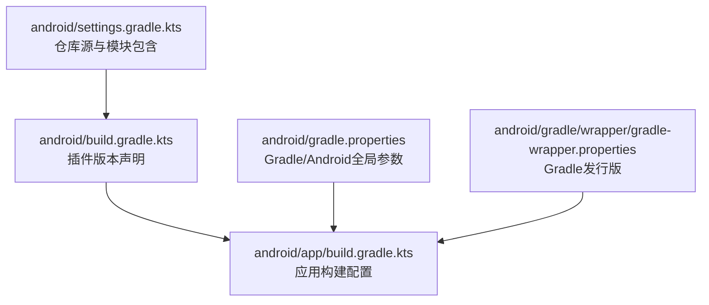
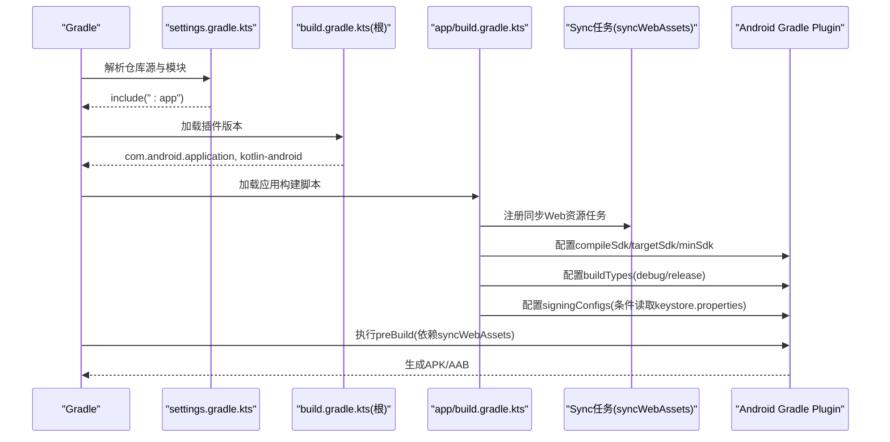
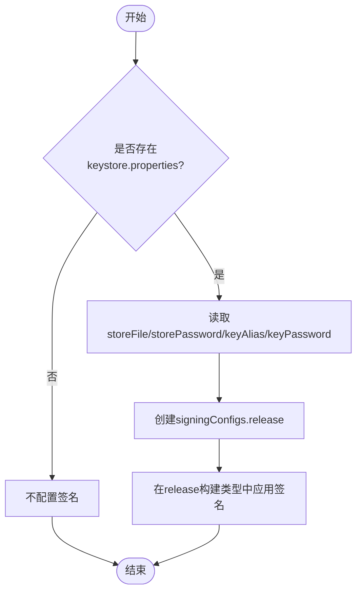
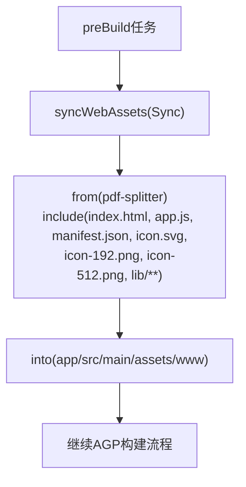

# Android构建配置

<cite>
**本文引用的文件**   
- [android/app/build.gradle.kts](file://android/app/build.gradle.kts)
- [android/build.gradle.kts](file://android/build.gradle.kts)
- [android/gradle.properties](file://android/gradle.properties)
- [android/settings.gradle.kts](file://android/settings.gradle.kts)
- [android/gradle/wrapper/gradle-wrapper.properties](file://android/gradle/wrapper/gradle-wrapper.properties)
</cite>

## 目录
1. [简介](#简介)
2. [项目结构](#项目结构)
3. [核心组件](#核心组件)
4. [架构总览](#架构总览)
5. [详细组件分析](#详细组件分析)
6. [依赖管理策略](#依赖管理策略)
7. [资源同步机制](#资源同步机制)
8. [构建优化建议](#构建优化建议)
9. [故障排查指南](#故障排查指南)
10. [结论](#结论)

## 简介
本文件面向Android工程维护者，系统化说明该仓库的Gradle构建配置与最佳实践。重点覆盖：
- 编译SDK、目标SDK、最小SDK版本设置
- 签名配置与keystore.properties的安全使用
- 构建类型（debug/release）差异与混淆/优化开关
- 依赖管理与版本策略（Kotlin、WebView等）
- Web源码自动同步到assets的构建任务
- 增量编译、并行构建等性能优化建议

## 项目结构
Android模块位于android/app下，根级build脚本用于声明插件版本；settings负责仓库源与模块包含；gradle.properties集中配置Gradle与Android行为；wrapper锁定Gradle发行版。

图表来源
- [android/settings.gradle.kts:1-24](file://android/settings.gradle.kts#L1-L24)
- [android/build.gradle.kts:1-5](file://android/build.gradle.kts#L1-L5)
- [android/app/build.gradle.kts:1-85](file://android/app/build.gradle.kts#L1-L85)
- [android/gradle.properties:1-14](file://android/gradle.properties#L1-L14)
- [android/gradle/wrapper/gradle-wrapper.properties:1-8](file://android/gradle/wrapper/gradle-wrapper.properties#L1-L8)

章节来源
- [android/settings.gradle.kts:1-24](file://android/settings.gradle.kts#L1-L24)
- [android/build.gradle.kts:1-5](file://android/build.gradle.kts#L1-L5)
- [android/app/build.gradle.kts:1-85](file://android/app/build.gradle.kts#L1-L85)
- [android/gradle.properties:1-14](file://android/gradle.properties#L1-L14)
- [android/gradle/wrapper/gradle-wrapper.properties:1-8](file://android/gradle/wrapper/gradle-wrapper.properties#L1-L8)

## 核心组件
- SDK版本与兼容性
  - compileSdk=36
  - targetSdk=36
  - minSdk=29
  - Java/Kotlin JVM目标为17
- 构建类型
  - release：启用签名（若存在keystore.properties），未启用代码混淆
  - debug：追加applicationId后缀与versionName后缀
- 资源打包排除
  - 排除META-INF/*与LICENSE.txt
- 依赖
  - androidx.core:core-ktx:1.16.0
  - androidx.activity:activity-ktx:1.10.1
  - androidx.webkit:webkit:1.13.0

章节来源
- [android/app/build.gradle.kts:28-70](file://android/app/build.gradle.kts#L28-L70)
- [android/app/build.gradle.kts:80-84](file://android/app/build.gradle.kts#L80-L84)

## 架构总览
下图展示从Gradle初始化到应用包生成的关键流程，包括Web资源同步、签名与构建类型处理。

图表来源
- [android/settings.gradle.kts:1-24](file://android/settings.gradle.kts#L1-L24)
- [android/build.gradle.kts:1-5](file://android/build.gradle.kts#L1-L5)
- [android/app/build.gradle.kts:15-21](file://android/app/build.gradle.kts#L15-L21)
- [android/app/build.gradle.kts:28-70](file://android/app/build.gradle.kts#L28-L70)
- [android/app/build.gradle.kts:78-84](file://android/app/build.gradle.kts#L78-L84)

## 详细组件分析

### SDK版本与语言工具链
- compileSdk=36：指定编译时使用的Android API级别
- targetSdk=36：声明应用针对的目标API级别
- minSdk=29：最低支持系统版本
- Java/Kotlin JVM目标=17：确保字节码兼容性与Kotlin编译目标一致

章节来源
- [android/app/build.gradle.kts:28-38](file://android/app/build.gradle.kts#L28-L38)
- [android/app/build.gradle.kts:62-75](file://android/app/build.gradle.kts#L62-L75)

### 签名配置与keystore.properties
- 通过Properties在构建脚本中读取根目录keystore.properties
- 仅当文件存在且非空时创建release签名配置
- 字段约定：storeFile、storePassword、keyAlias、keyPassword
- 安全最佳实践
  - keystore.properties加入.gitignore，不提交至仓库
  - CI环境通过环境变量注入敏感信息，避免落盘明文
  - 限制keystore文件访问权限，仅构建用户可读
  - 定期轮换密钥并妥善保管离线备份

图表来源
- [android/app/build.gradle.kts:23-26](file://android/app/build.gradle.kts#L23-L26)
- [android/app/build.gradle.kts:40-49](file://android/app/build.gradle.kts#L40-L49)
- [android/app/build.gradle.kts:51-55](file://android/app/build.gradle.kts#L51-L55)

章节来源
- [android/app/build.gradle.kts:23-26](file://android/app/build.gradle.kts#L23-L26)
- [android/app/build.gradle.kts:40-49](file://android/app/build.gradle.kts#L40-L49)
- [android/app/build.gradle.kts:51-55](file://android/app/build.gradle.kts#L51-L55)

### 构建类型：debug与release
- debug
  - applicationIdSuffix=".debug"
  - versionNameSuffix="-debug"
  - 便于与正式版并存安装
- release
  - isMinifyEnabled=false（当前未启用R8/ProGuard混淆）
  - signingConfig引用release签名配置（若存在）

章节来源
- [android/app/build.gradle.kts:51-60](file://android/app/build.gradle.kts#L51-L60)

### 资源打包与兼容性
- packaging.resources.excludes排除META-INF/*与LICENSE.txt，减少冗余与冲突
- compileOptions与kotlin.jvmTarget统一为Java 17，保证字节码一致性

章节来源
- [android/app/build.gradle.kts:62-75](file://android/app/build.gradle.kts#L62-L75)
- [android/app/build.gradle.kts:67-69](file://android/app/build.gradle.kts#L67-L69)

## 依赖管理策略
- 插件版本
  - com.android.application: 9.3.0
  - org.jetbrains.kotlin.android: 2.2.10
- 应用依赖
  - androidx.core:core-ktx:1.16.0
  - androidx.activity:activity-ktx:1.10.1
  - androidx.webkit:webkit:1.13.0
- 版本更新建议
  - 优先对齐AndroidX生态的推荐版本矩阵
  - Kotlin与AGP保持官方兼容表内版本
  - WebView依赖建议使用稳定分支，结合Play服务或系统WebView版本进行灰度验证
  - 引入dependency-check或Dependabot类工具进行漏洞扫描与升级提醒

章节来源
- [android/build.gradle.kts:1-5](file://android/build.gradle.kts#L1-L5)
- [android/app/build.gradle.kts:80-84](file://android/app/build.gradle.kts#L80-L84)

## 资源同步机制
- 设计目标
  - 将pdf-splitter目录下的Web源码（index.html、app.js、manifest.json及lib/**等）自动同步到app/src/main/assets/www
  - 避免两处副本漂移，构建前强制同步
- 实现要点
  - 定义Sync任务syncWebAssets，按include规则拷贝文件
  - preBuild任务依赖syncWebAssets，确保每次构建前执行
  - assets/www已纳入忽略列表，避免重复提交

图表来源
- [android/app/build.gradle.kts:8-21](file://android/app/build.gradle.kts#L8-L21)
- [android/app/build.gradle.kts:78-78](file://android/app/build.gradle.kts#L78-L78)

章节来源
- [android/app/build.gradle.kts:8-21](file://android/app/build.gradle.kts#L8-L21)
- [android/app/build.gradle.kts:78-78](file://android/app/build.gradle.kts#L78-L78)

## 构建优化建议
- 并行构建
  - org.gradle.parallel=true已在gradle.properties启用
- 增量编译
  - kotlin.incremental=true已启用
- 缓存
  - org.gradle.caching=true已启用
- JVM参数与GC
  - org.gradle.jvmargs=-Xmx2560m -Dfile.encoding=UTF-8 -XX:+UseParallelGC
- 其他可选项
  - 开启configuration-cache以加速配置阶段（当前为false，可按需评估）
  - 按需启用R8/ProGuard混淆与压缩（当前release未启用）
  - 使用本地Maven镜像或代理提升依赖下载速度（settings中已配置阿里云镜像）

章节来源
- [android/gradle.properties:1-14](file://android/gradle.properties#L1-L14)
- [android/settings.gradle.kts:1-19](file://android/settings.gradle.kts#L1-L19)

## 故障排查指南
- 无法找到keystore.properties
  - 现象：release构建未签名或失败
  - 排查：确认根目录存在keystore.properties且包含storeFile、storePassword、keyAlias、keyPassword四个键
  - 解决：补齐缺失字段或检查路径是否正确
- 签名路径错误
  - 现象：找不到storeFile对应文件
  - 排查：storeFile应为相对或绝对路径，指向有效keystore
  - 解决：修正路径并确保构建用户有读权限
- Web资源不同步
  - 现象：assets/www缺少最新Web文件
  - 排查：确认preBuild是否依赖syncWebAssets，以及include规则是否匹配新增文件
  - 解决：补充include规则或清理后重新构建
- 构建速度慢
  - 现象：全量构建耗时较长
  - 排查：确认并行、增量、缓存已启用；检查JVM堆大小是否足够
  - 解决：调整org.gradle.jvmargs，必要时开启configuration-cache

章节来源
- [android/app/build.gradle.kts:23-26](file://android/app/build.gradle.kts#L23-L26)
- [android/app/build.gradle.kts:40-49](file://android/app/build.gradle.kts#L40-L49)
- [android/app/build.gradle.kts:15-21](file://android/app/build.gradle.kts#L15-L21)
- [android/app/build.gradle.kts:78-78](file://android/app/build.gradle.kts#L78-L78)
- [android/gradle.properties:1-14](file://android/gradle.properties#L1-L14)

## 结论
该Android工程的构建配置清晰、职责分明：通过settings集中管理仓库源，根build声明插件版本，app模块聚焦SDK、签名、构建类型与依赖；同时利用Gradle任务实现Web源码到assets的自动化同步。建议在后续迭代中：
- 逐步启用release混淆与资源压缩
- 建立依赖版本治理与自动化升级流程
- 在CI中注入签名凭据，完善安全基线
- 持续评估configuration-cache与R8对构建性能的影响