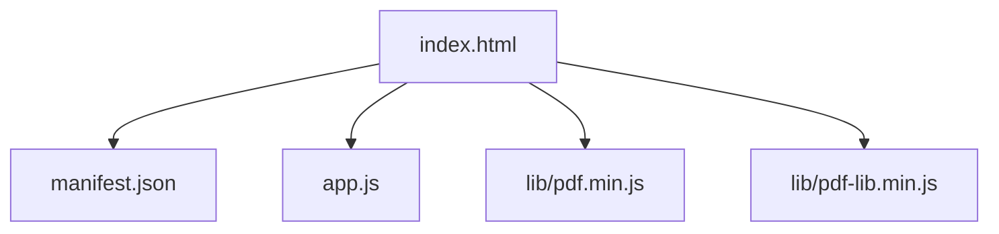
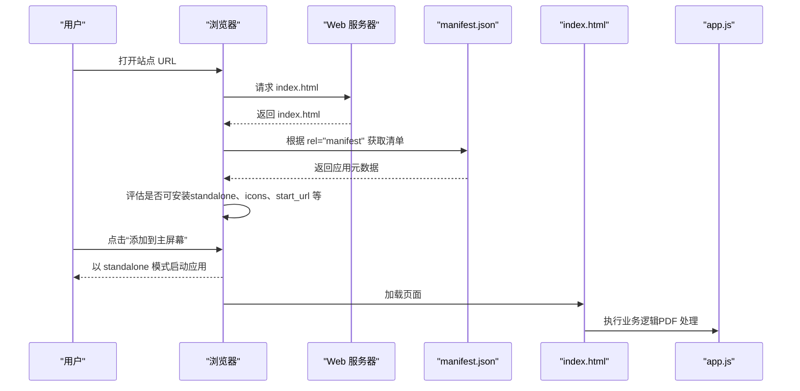
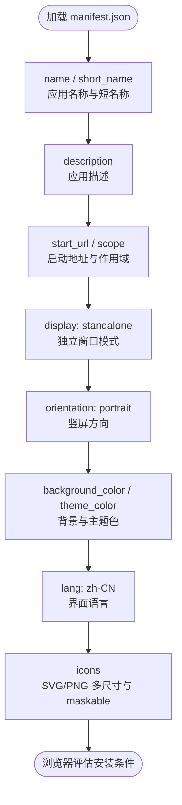
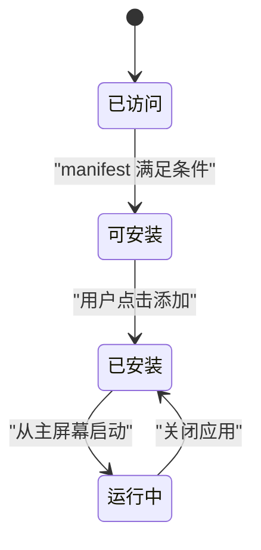
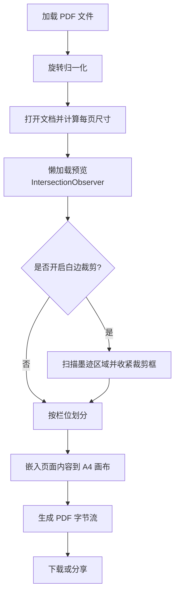
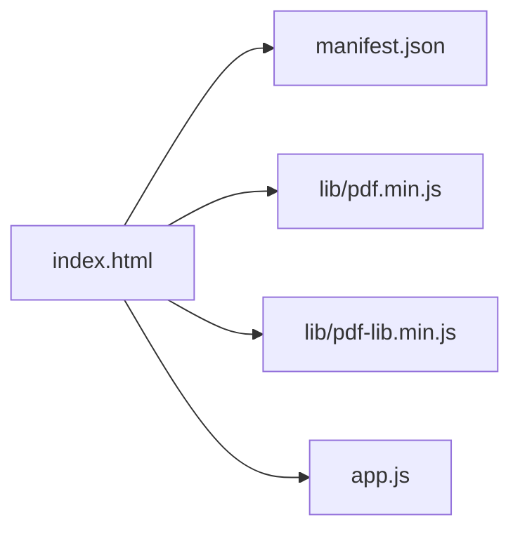

# PWA部署配置

<cite>
**本文引用的文件**   
- [manifest.json](file://pdf-splitter/manifest.json)
- [index.html](file://pdf-splitter/index.html)
- [app.js](file://pdf-splitter/app.js)
</cite>

## 目录
1. [简介](#简介)
2. [项目结构](#项目结构)
3. [核心组件](#核心组件)
4. [架构总览](#架构总览)
5. [详细组件分析](#详细组件分析)
6. [依赖关系分析](#依赖关系分析)
7. [性能与缓存建议](#性能与缓存建议)
8. [调试与测试指南](#调试与测试指南)
9. [结论](#结论)
10. [附录：字段清单与最佳实践](#附录字段清单与最佳实践)

## 简介
本文件面向“试卷切分助手”PWA 的部署与配置，重点说明以下方面：
- Web App Manifest（应用清单）的作用与关键字段含义
- Service Worker 的配置与使用现状、离线能力与后台同步建议
- PWA 安装流程与用户体验优化（添加到主屏幕、独立窗口、全屏显示）
- HTTPS 与安全策略（CSP、混合内容处理）
- PWA 调试与测试方法（Chrome DevTools、离线验证、性能分析）

该项目当前是一个纯前端 PDF 处理工具，所有处理逻辑在浏览器中完成；未包含 Service Worker 实现。因此，离线缓存与后台同步属于“可选增强项”，本文会给出落地建议与参考路径。

## 项目结构
仓库中与 PWA 直接相关的资源位于 pdf-splitter 目录：
- manifest.json：PWA 应用清单
- index.html：页面入口，引用清单与图标
- app.js：前端业务逻辑（PDF 解析、预览、切分、下载/分享）
- lib/pdf.min.js、lib/pdf-lib.min.js：第三方 PDF 库

**图表来源**
- [index.html:10-12](file://pdf-splitter/index.html#L10-L12)
- [index.html:284-286](file://pdf-splitter/index.html#L284-L286)

**章节来源**
- [index.html:1-13](file://pdf-splitter/index.html#L1-L13)
- [index.html:284-286](file://pdf-splitter/index.html#L284-L286)

## 核心组件
- Web App Manifest：定义应用名称、短名称、描述、启动 URL、作用域、显示模式、方向、主题色、背景色、语言与图标集。
- HTML 入口：声明 theme-color、移动端可运行 meta、引用 manifest 与图标。
- 前端脚本：负责 PDF 加载、旋转校正、栏位识别、白边裁剪、A4 输出、下载与分享。

**章节来源**
- [manifest.json:1-17](file://pdf-splitter/manifest.json#L1-L17)
- [index.html:4-12](file://pdf-splitter/index.html#L4-L12)
- [app.js:1-28](file://pdf-splitter/app.js#L1-L28)

## 架构总览
下图展示 PWA 安装与运行时关键交互：用户通过浏览器访问站点，浏览器读取 manifest 并决定是否提供“添加到主屏幕”提示；安装后以独立窗口模式运行；页面加载时引入 PDF 库与业务脚本进行本地处理。

**图表来源**
- [index.html:10-12](file://pdf-splitter/index.html#L10-L12)
- [manifest.json:1-17](file://pdf-splitter/manifest.json#L1-L17)

## 详细组件分析

### Web App Manifest 配置
manifest.json 定义了 PWA 的核心元数据，直接影响安装体验与运行外观：
- name / short_name：应用名称与短名称，用于桌面/主屏幕显示
- description：应用描述，帮助商店或系统理解用途
- start_url / scope：启动地址与作用域，决定 PWA 导航边界
- display：standalone 表示独立窗口模式，隐藏浏览器 UI
- orientation：portrait 锁定竖屏方向
- background_color / theme_color：应用启动背景与状态栏主题色
- lang：zh-CN 指定界面语言
- icons：SVG 与 PNG 多尺寸图标，支持 maskable 提升适配性

**图表来源**
- [manifest.json:1-17](file://pdf-splitter/manifest.json#L1-L17)

**章节来源**
- [manifest.json:1-17](file://pdf-splitter/manifest.json#L1-L17)

### HTML 入口与 PWA 元信息
index.html 中关键 PWA 相关设置：
- <meta name="theme-color">：与 manifest 的 theme_color 保持一致，统一状态栏颜色
- <meta name="mobile-web-app-capable">：允许移动端作为 Web App 运行
- <link rel="manifest">：引用 manifest.json
- <link rel="icon"> / <link rel="apple-touch-icon">：为不同平台提供图标

这些设置确保在不同浏览器与设备上获得一致的 PWA 体验。

**章节来源**
- [index.html:4-12](file://pdf-splitter/index.html#L4-L12)

### Service Worker 现状与建议
当前仓库未包含 Service Worker 文件，也未在 index.html 中注册 SW。这意味着：
- 无预缓存策略
- 无离线资源管理
- 无后台同步功能
- 首次加载依赖网络获取 PDF 库与页面资源

若需启用离线能力，建议：
- 新增 service-worker.js 并在 index.html 中注册
- 使用 Cache API 预缓存静态资源（HTML、CSS、JS、图标）
- 对 PDF 库等资源采用“先缓存后网络”或“网络优先”的策略
- 如需后台任务，可使用 Background Sync API 提交队列任务

注意：由于本项目是纯客户端 PDF 处理工具，离线场景下仍需用户选择本地 PDF 文件；SW 主要加速静态资源加载与提升首屏稳定性。

[本节为概念性建议，不直接分析具体代码文件]

### PWA 安装流程与用户体验优化
- 添加到主屏幕：当 manifest 满足要求（如 standalone、有效图标、start_url），浏览器会提示“添加到主屏幕”。
- 独立窗口模式：display=standalone 使应用以独立窗口运行，隐藏浏览器地址栏与工具栏。
- 全屏显示：可通过全屏 API 进一步隐藏系统 UI，但需谨慎使用，避免影响用户操作。
- 横竖屏控制：orientation=portrait 限制为竖屏，适合移动端阅读与打印预览。

[此图为概念流程图，不映射到具体代码文件]

### HTTPS 与安全策略
- HTTPS 要求：Service Worker 必须在 HTTPS 环境下注册；即使不使用 SW，也建议使用 HTTPS 保障传输安全。
- 内容安全策略（CSP）：建议通过 HTTP 头或 <meta http-equiv="Content-Security-Policy"> 限制脚本、样式、图片的来源，防止注入攻击。
- 混合内容处理：确保页面内所有子资源（JS、CSS、图片、字体）均通过 HTTPS 加载，避免被浏览器拦截。
- 图标与媒体：确保 SVG/PNG 图标与媒体资源可被正确加载，避免跨域问题。

[本节为通用安全建议，不直接分析具体代码文件]

### 前端业务逻辑与 PWA 集成点
app.js 负责 PDF 解析、预览、切分与输出，与 PWA 的集成点包括：
- 使用 window.pdfjsLib 配置 workerSrc，在 HTTPS 下正常加载 worker
- 使用 localStorage 保存用户偏好（如白边裁剪开关），便于下次启动恢复
- 结果导出通过 Blob + ObjectURL 触发下载，或在 Android 外壳中走原生通道

**图表来源**
- [app.js:6-9](file://pdf-splitter/app.js#L6-L9)
- [app.js:83-103](file://pdf-splitter/app.js#L83-L103)
- [app.js:109-193](file://pdf-splitter/app.js#L109-L193)
- [app.js:412-508](file://pdf-splitter/app.js#L412-L508)

**章节来源**
- [app.js:6-9](file://pdf-splitter/app.js#L6-L9)
- [app.js:83-103](file://pdf-splitter/app.js#L83-L103)
- [app.js:109-193](file://pdf-splitter/app.js#L109-L193)
- [app.js:412-508](file://pdf-splitter/app.js#L412-L508)

## 依赖关系分析
- index.html 依赖 manifest.json 与图标资源
- index.html 依赖 pdf.min.js、pdf-lib.min.js 与 app.js
- app.js 依赖 pdf.js 与 pdf-lib 提供的 API
- 若未来引入 Service Worker，则 index.html 将注册 SW，SW 再管理缓存策略

**图表来源**
- [index.html:10-12](file://pdf-splitter/index.html#L10-L12)
- [index.html:284-286](file://pdf-splitter/index.html#L284-L286)

**章节来源**
- [index.html:10-12](file://pdf-splitter/index.html#L10-L12)
- [index.html:284-286](file://pdf-splitter/index.html#L284-L286)

## 性能与缓存建议
- 预缓存静态资源：将 HTML、CSS、JS、图标等放入 Cache Storage，减少二次加载时间
- 按需加载 PDF 库：可在首次进入时异步加载，避免阻塞首屏
- 大文件处理：PDF 解析与渲染较耗时，建议在后台线程或 Web Worker 中执行，避免阻塞 UI
- 内存释放：及时销毁 pdf.js 文档对象与释放 Canvas 缓冲区，避免内存泄漏
- 进度反馈：保持用户可见的进度条与文案，提升感知性能

[本节为通用性能建议，不直接分析具体代码文件]

## 调试与测试指南
- Chrome DevTools：
  - Application 面板查看 Manifest、Cache Storage、IndexedDB
  - Network 面板检查资源加载顺序与失败原因
  - Lighthouse 生成 PWA 评分与改进建议
- 离线验证：
  - 在 DevTools 中切换“Offline”模式，验证静态资源是否可用
  - 模拟弱网环境，观察加载时间与卡顿情况
- 性能分析：
  - Performance 面板录制关键交互（上传、预览、切分）
  - Memory 面板检查是否存在内存泄漏
- 安装流程验证：
  - 确认 manifest 满足安装条件（standalone、图标、start_url）
  - 在主屏幕启动后验证独立窗口模式与主题色

[本节为通用调试建议，不直接分析具体代码文件]

## 结论
该项目的 PWA 基础配置已通过 manifest.json 与 index.html 建立，具备独立窗口模式与主题色等特性。当前未实现 Service Worker，因此离线缓存与后台同步需要额外开发。建议优先完善 HTTPS 与安全策略，随后引入 SW 以提升性能与离线可用性，并通过 DevTools 与 Lighthouse 持续优化安装体验与性能表现。

[本节为总结性内容，不直接分析具体代码文件]

## 附录：字段清单与最佳实践
- manifest.json 关键字段
  - name / short_name：清晰表达应用用途，短名称用于主屏幕显示
  - description：简洁描述功能，帮助用户理解价值
  - start_url / scope：确保 PWA 导航范围可控
  - display：standalone 提供原生感体验
  - orientation：根据产品形态选择合适的方向
  - background_color / theme_color：与应用品牌一致
  - lang：匹配目标市场语言
  - icons：提供 SVG 与多种尺寸 PNG，maskable 提升适配性
- HTML 入口最佳实践
  - 设置 theme-color 与移动端可运行 meta
  - 引用 manifest 与图标资源
  - 避免不必要的第三方脚本阻塞首屏
- Service Worker 实施要点
  - 仅在 HTTPS 下注册
  - 预缓存关键资源，合理设置过期策略
  - 对动态资源采用网络优先或缓存优先策略
  - 使用 Background Sync 处理后台任务（如批量分享、增量更新）

[本节为通用最佳实践，不直接分析具体代码文件]