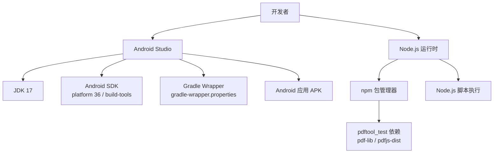
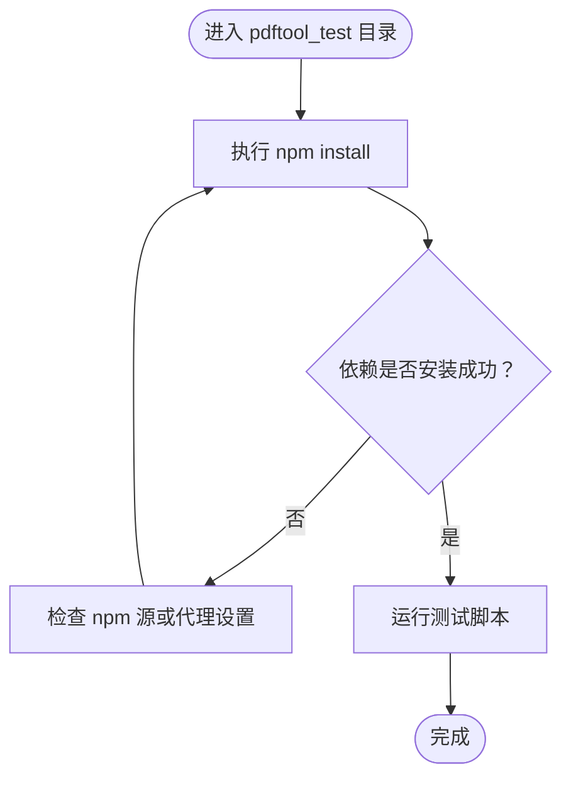
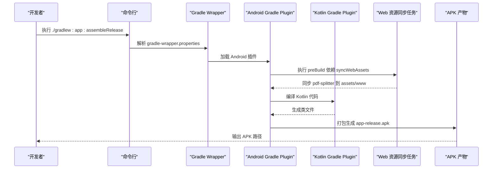

# 开发环境搭建

<cite>
**本文引用的文件**   
- [README.md](file://README.md)
- [android/build.gradle.kts](file://android/build.gradle.kts)
- [android/app/build.gradle.kts](file://android/app/build.gradle.kts)
- [android/gradle.properties](file://android/gradle.properties)
- [android/gradle/wrapper/gradle-wrapper.properties](file://android/gradle/wrapper/gradle-wrapper.properties)
- [pdftool_test/package.json](file://pdftool_test/package.json)
</cite>

## 目录
1. [简介](#简介)
2. [项目结构与环境依赖总览](#项目结构与环境依赖总览)
3. [Android 开发环境安装与配置](#android-开发环境安装与配置)
4. [Node.js 环境与 pdftool_test 依赖安装](#nodejs-环境与-pdftool_test-依赖安装)
5. [Gradle Wrapper 使用指南](#gradle-wrapper-使用指南)
6. [IDE 配置建议](#ide-配置建议)
7. [常见问题排查](#常见问题排查)
8. [结论](#结论)

## 简介
本指南面向首次在本仓库进行开发的工程师，目标是快速、稳定地搭建 Android + Node.js 开发环境，并掌握 Gradle Wrapper 的构建方式与常见问题的处理方法。本项目包含：
- Android 壳工程（Kotlin + WebView），用于在手机上运行 PWA 网页版 PDF 切分工具；
- Web 本体（PWA），纯前端实现 PDF 预览与切分逻辑；
- pdftool_test，基于 Node.js 的本地验证脚本。

## 项目结构与环境依赖总览
- Android 工程位于 android 目录，要求 JDK 17、Android SDK（platform 36 + build-tools）、Gradle（通过 wrapper 管理）。
- Web 本体位于 pdf-splitter 目录，可直接在浏览器中离线使用。
- pdftool_test 是 Node.js 测试脚本，依赖 pdf-lib 与 pdfjs-dist。

**图表来源**
- [README.md:44-56](file://README.md#L44-L56)
- [android/app/build.gradle.kts:28-38](file://android/app/build.gradle.kts#L28-L38)
- [android/gradle/wrapper/gradle-wrapper.properties:1-8](file://android/gradle/wrapper/gradle-wrapper.properties#L1-L8)
- [pdftool_test/package.json:12-15](file://pdftool_test/package.json#L12-L15)

**章节来源**
- [README.md:13-23](file://README.md#L13-L23)
- [README.md:44-56](file://README.md#L44-L56)

## Android 开发环境安装与配置
本节说明如何安装和配置 Android 开发所需的环境，包括 JDK 17、Android Studio、Android SDK 以及 Gradle Wrapper。

### 安装 JDK 17
- 下载并安装 JDK 17（OpenJDK 或 Oracle JDK 均可）。
- 设置系统环境变量 JAVA_HOME 指向 JDK 安装目录。
- 在命令行执行 java -version 确认版本为 17。

提示：Android 工程的 Kotlin 与 Java 编译目标均为 JVM 17，因此必须使用 JDK 17。

**章节来源**
- [android/app/build.gradle.kts:62-65](file://android/app/build.gradle.kts#L62-L65)
- [android/app/build.gradle.kts:72-76](file://android/app/build.gradle.kts#L72-L76)

### 安装 Android Studio
- 安装最新稳定版 Android Studio。
- 启动后进入 Settings/Preferences，确保已安装以下组件：
  - Android SDK Platform 36
  - Android SDK Build-Tools
  - Android Emulator（可选）
- 在 SDK Manager 中确认 platform 36 与 build-tools 已勾选并安装完成。

注意：Android 工程 compileSdk 与 targetSdk 均设置为 36，minSdk 为 29。

**章节来源**
- [android/app/build.gradle.kts:28-38](file://android/app/build.gradle.kts#L28-L38)

### 配置 Android SDK 路径
- 如果 Android Studio 未自动识别 SDK，请在 IDE 中手动指定 SDK 路径。
- 确保命令行 gradle 能访问到正确的 Android SDK。

### 配置 Gradle Wrapper
- 项目自带 Gradle Wrapper，无需单独安装 Gradle。
- Wrapper 使用的 Gradle 版本由 gradle-wrapper.properties 指定，并通过腾讯镜像下载。
- 首次构建时会自动下载对应版本的 Gradle。

**章节来源**
- [android/gradle/wrapper/gradle-wrapper.properties:1-8](file://android/gradle/wrapper/gradle-wrapper.properties#L1-L8)

## Node.js 环境与 pdftool_test 依赖安装
本节说明如何在 Windows 上安装 Node.js，并安装 pdftool_test 所需的依赖。

### 安装 Node.js
- 从官网下载并安装 Node.js LTS 版本。
- 安装完成后，在命令行执行 node -v 与 npm -v 确认版本可用。

### 安装 pdftool_test 依赖
- 打开命令行，进入 pdftool_test 目录。
- 执行 npm install 安装依赖。
- 依赖清单包含 pdf-lib 与 pdfjs-dist，用于本地 PDF 处理与渲染验证。

**图表来源**
- [pdftool_test/package.json:12-15](file://pdftool_test/package.json#L12-L15)

**章节来源**
- [pdftool_test/package.json:1-17](file://pdftool_test/package.json#L1-L17)

## Gradle Wrapper 使用指南
本节介绍如何使用 Gradle Wrapper 构建 Android 应用，包括常用命令、环境变量与代理设置。

### 常用构建命令
- 进入 android 目录。
- 构建发布包：./gradlew :app:assembleRelease
- 构建调试包：./gradlew :app:assembleDebug

说明：
- 发布包输出路径为 android/app/build/outputs/apk/release/app-release.apk。
- 调试包包名带 .debug 后缀，可与正式版共存。

**章节来源**
- [README.md:44-56](file://README.md#L44-L56)

### 环境变量配置
- GRADLE_USER_HOME：Gradle 缓存与 Wrapper 分发目录的基础路径。
- ANDROID_HOME 或 ANDROID_SDK_ROOT：Android SDK 路径。
- JAVA_HOME：JDK 17 路径。
- PATH：确保 gradle 或 ./gradlew 可执行。

提示：Wrapper 默认将 Gradle 分发下载到 GRADLE_USER_HOME/wrapper/dists。

**章节来源**
- [android/gradle/wrapper/gradle-wrapper.properties:1-8](file://android/gradle/wrapper/gradle-wrapper.properties#L1-L8)

### 代理设置
若网络受限，可通过以下方式配置代理：
- 在 ~/.gradle/gradle.properties 或项目根 gradle.properties 中添加 HTTP/HTTPS 代理配置。
- 或使用 npm config set proxy 配置 Node.js 代理（仅影响 npm）。

注意：Gradle 与 npm 的代理配置相互独立，请分别检查。

### 构建流程概览

**图表来源**
- [android/app/build.gradle.kts:15-21](file://android/app/build.gradle.kts#L15-L21)
- [android/app/build.gradle.kts:78-78](file://android/app/build.gradle.kts#L78-L78)
- [android/gradle/wrapper/gradle-wrapper.properties:1-8](file://android/gradle/wrapper/gradle-wrapper.properties#L1-L8)

## IDE 配置建议
本节提供 Android Studio 的项目导入、代码格式化与调试器配置建议。

### 导入 Android 项目
- 打开 Android Studio，选择 Open Existing Project。
- 选择 android 目录作为项目根目录。
- 等待 Gradle 同步完成，确保 SDK 与插件版本匹配。

### 代码格式化规则
- 启用 Kotlin 官方代码风格：kotlin.code.style=official。
- 保持 Java/Kotlin 编码为 UTF-8。
- 建议在 IDE 中开启保存时格式化，避免风格不一致。

**章节来源**
- [android/gradle.properties:12-12](file://android/gradle.properties#L12-L12)

### 调试器配置
- 安装 debug 包后，可在 Chrome 中访问 chrome://inspect 审查 WebView 页面。
- 确保设备或模拟器已启用 USB 调试或远程调试。
- 如需调试原生层，可在 Android Studio 中直接附加调试器到进程。

**章节来源**
- [README.md:56-56](file://README.md#L56-L56)

### 签名与发布
- 发布包签名信息从 keystore.properties 读取，该文件应放在 android 根目录且不要提交到版本库。
- 若需更换密钥，可使用 keytool 生成新的 jks 文件，并更新 keystore.properties。

**章节来源**
- [android/app/build.gradle.kts:23-49](file://android/app/build.gradle.kts#L23-L49)
- [README.md:58-65](file://README.md#L58-L65)

## 常见问题排查
本节汇总常见环境问题及解决方案。

### 权限问题
- 现象：无法写入下载目录或无法分享文件。
- 原因：Android 10+ 存储权限与 MediaStore 使用方式变化。
- 解决：确保应用按文档方式使用 MediaStore 写入“下载/试卷切分”，并使用 FileProvider 发起分享。

**章节来源**
- [README.md:67-75](file://README.md#L67-L75)

### 网络问题
- 现象：Gradle 或 npm 下载失败。
- 原因：网络受限或镜像不可达。
- 解决：
  - Gradle：检查 gradle-wrapper.properties 中的 distributionUrl 与代理配置。
  - npm：检查 npm 源与代理设置。

**章节来源**
- [android/gradle/wrapper/gradle-wrapper.properties:1-8](file://android/gradle/wrapper/gradle-wrapper.properties#L1-L8)
- [pdftool_test/package.json:12-15](file://pdftool_test/package.json#L12-L15)

### 版本冲突
- 现象：编译失败或运行异常。
- 原因：JDK、Android SDK、Gradle 或插件版本不匹配。
- 解决：
  - 使用 JDK 17。
  - 安装 Android SDK platform 36 与 build-tools。
  - 使用项目自带的 Gradle Wrapper。
  - 确保 Android Gradle Plugin 与 Kotlin 插件版本兼容。

**章节来源**
- [android/build.gradle.kts:1-4](file://android/build.gradle.kts#L1-L4)
- [android/app/build.gradle.kts:28-38](file://android/app/build.gradle.kts#L28-L38)
- [android/app/build.gradle.kts:62-76](file://android/app/build.gradle.kts#L62-L76)

### 构建性能优化
- 现象：构建缓慢。
- 原因：并行构建、缓存未启用或 JVM 参数不足。
- 解决：
  - 启用 org.gradle.parallel=true 与 org.gradle.caching=true。
  - 调整 org.gradle.jvmargs 以分配更多内存。
  - 保持 Kotlin 增量编译开启。

**章节来源**
- [android/gradle.properties:1-4](file://android/gradle.properties#L1-L4)
- [android/gradle.properties:12-14](file://android/gradle.properties#L12-L14)

## 结论
按照本指南完成 JDK 17、Android Studio、Android SDK 与 Node.js 的安装与配置后，即可顺利导入项目、安装依赖并进行构建与调试。遇到问题时，优先检查版本一致性、网络与代理配置，并结合 Gradle Wrapper 与 npm 的日志定位具体原因。