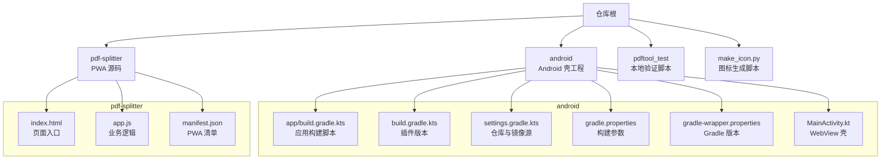
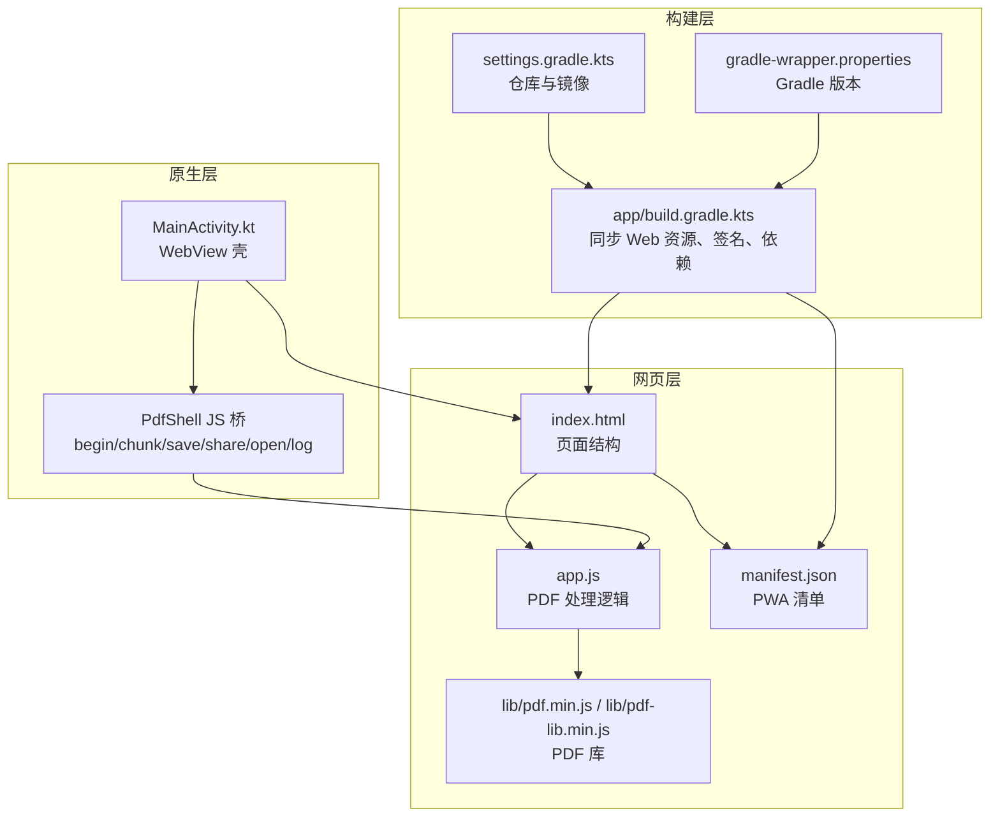
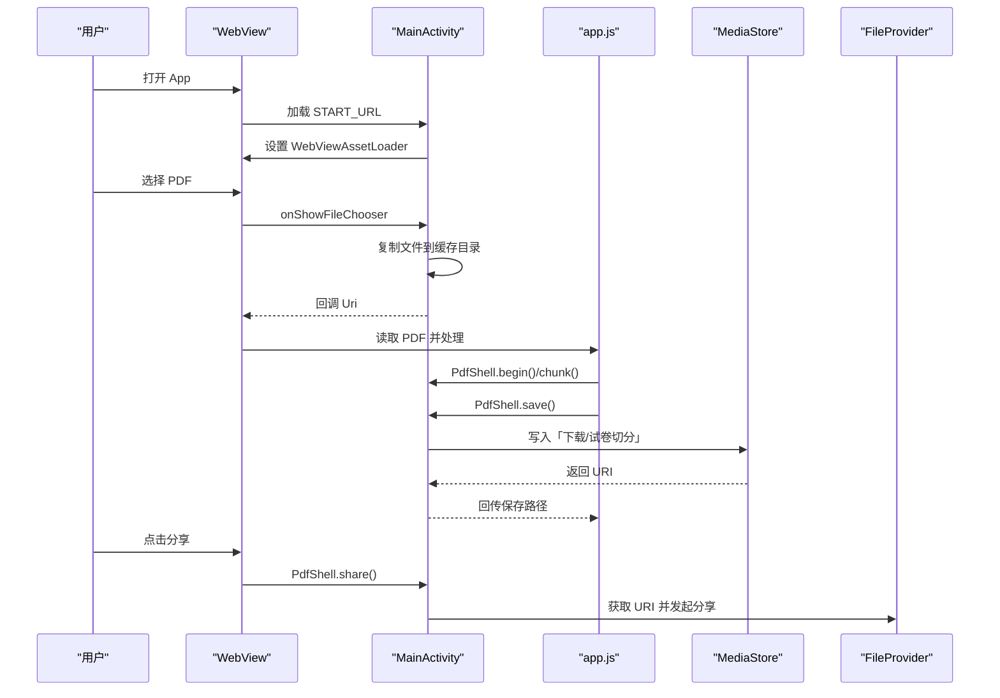
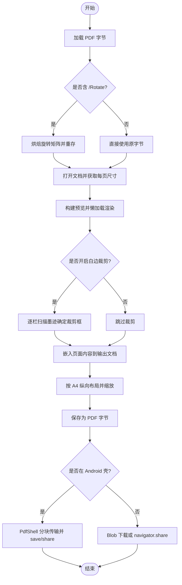
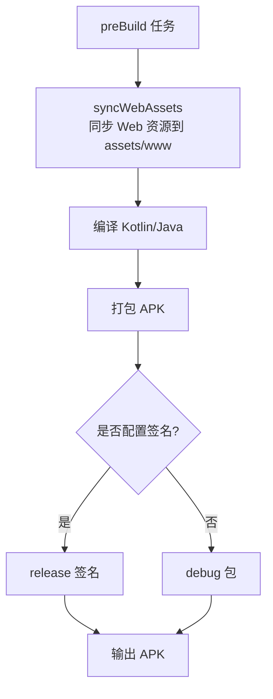
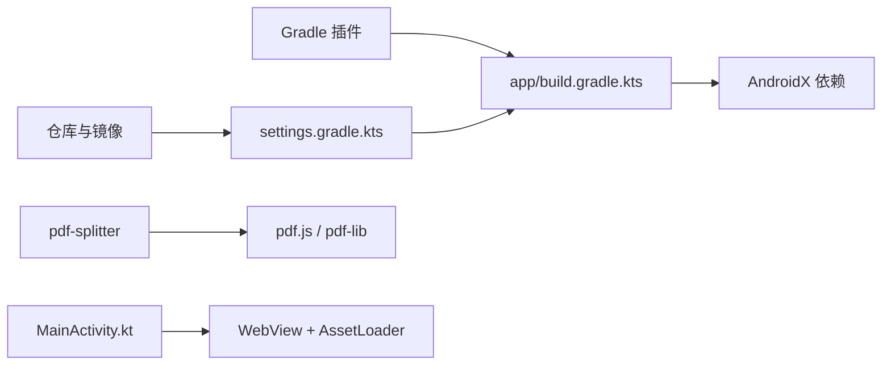
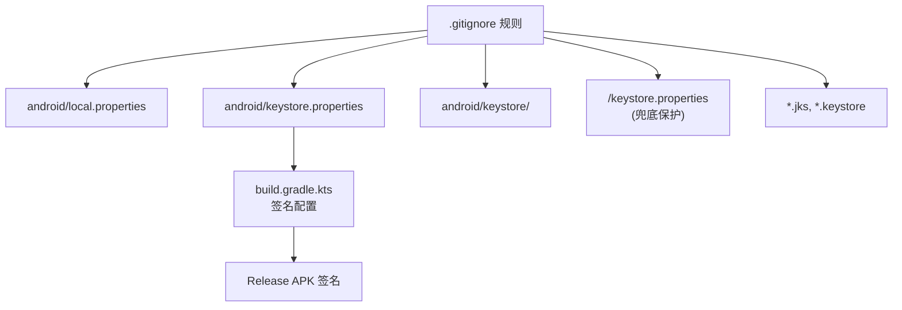

# 构建与部署

<cite>
**本文引用的文件**   
- [README.md](file://README.md)
- [.gitignore](file://.gitignore)
- [android/app/build.gradle.kts](file://android/app/build.gradle.kts)
- [android/build.gradle.kts](file://android/build.gradle.kts)
- [android/settings.gradle.kts](file://android/settings.gradle.kts)
- [android/gradle.properties](file://android/gradle.properties)
- [android/gradle/wrapper/gradle-wrapper.properties](file://android/gradle/wrapper/gradle-wrapper.properties)
- [android/app/src/main/java/com/pdfsplitter/app/MainActivity.kt](file://android/app/src/main/java/com/pdfsplitter/app/MainActivity.kt)
- [pdf-splitter/index.html](file://pdf-splitter/index.html)
- [pdf-splitter/manifest.json](file://pdf-splitter/manifest.json)
- [pdf-splitter/app.js](file://pdf-splitter/app.js)
- [make_icon.py](file://make_icon.py)
</cite>

## 更新摘要
**变更内容**   
- 更新了安全配置部分，详细说明 keystore.properties 的 gitignore 增强保护机制
- 新增了历史分歧场景说明，解释作者归属变更的原因和影响
- 强化了密钥管理和版本控制最佳实践
- 保持了原有的构建流程和部署指南结构

## 目录
1. [引言](#引言)
2. [项目结构](#项目结构)
3. [核心组件](#核心组件)
4. [架构总览](#架构总览)
5. [详细组件分析](#详细组件分析)
6. [依赖关系分析](#依赖关系分析)
7. [性能与优化](#性能与优化)
8. [调试与测试](#调试与测试)
9. [生产环境部署最佳实践](#生产环境部署最佳实践)
10. [故障排查](#故障排查)
11. [结论](#结论)

## 引言
本指南面向"试卷切分助手"的构建与部署，覆盖以下方面：
- Android 应用基于 Gradle 的构建流程、依赖管理、签名配置与 APK 打包。
- PWA 的部署配置，包括 manifest.json、离线资源与 WebView 集成方式。
- 自动化脚本：图标生成、资源同步、版本管理等辅助工具。
- 开发环境搭建：JDK、Android SDK、Gradle Wrapper。
- 调试与测试：日志查看、性能分析与问题排查。
- 生产环境部署：安全、性能与监控告警建议。

该项目由两部分组成：
- pdf-splitter：纯前端 PWA，使用 pdf.js 预览、pdf-lib 处理 PDF，不依赖 CDN。
- android：Kotlin + WebView 壳工程，负责文件选择、结果写入下载目录、系统分享等原生能力。

**章节来源**
- [README.md:13-22](file://README.md#L13-L22)

## 项目结构
仓库采用多模块组织：
- pdf-splitter：PWA 源码（HTML/CSS/JS），包含本地化的 pdf.js 与 pdf-lib。
- android：Android 壳工程，构建时自动将 pdf-splitter 关键资源同步到 assets/www。
- pdftool_test：本地验证脚本与输出（不参与主构建）。
- make_icon.py：用于生成 PWA 图标 PNG 的 Python 脚本。



**图表来源**
- [android/app/build.gradle.kts:1-85](file://android/app/build.gradle.kts#L1-L85)
- [android/build.gradle.kts:1-5](file://android/build.gradle.kts#L1-L5)
- [android/settings.gradle.kts:1-24](file://android/settings.gradle.kts#L1-L24)
- [android/gradle.properties:1-14](file://android/gradle.properties#L1-L14)
- [android/gradle/wrapper/gradle-wrapper.properties:1-8](file://android/gradle/wrapper/gradle-wrapper.properties#L1-L8)
- [android/app/src/main/java/com/pdfsplitter/app/MainActivity.kt:1-311](file://android/app/src/main/java/com/pdfsplitter/app/MainActivity.kt#L1-L311)
- [pdf-splitter/index.html:1-289](file://pdf-splitter/index.html#L1-L289)
- [pdf-splitter/app.js:1-578](file://pdf-splitter/app.js#L1-L578)
- [pdf-splitter/manifest.json:1-18](file://pdf-splitter/manifest.json#L1-L18)

**章节来源**
- [README.md:13-22](file://README.md#L13-L22)

## 核心组件
- Android 壳 MainActivity：提供 WebViewAssetLoader、文件选择器、MediaStore 写入、FileProvider 分享、JS 桥 PdfShell。
- PWA 前端 index.html + app.js：PDF 加载、旋转归一化、栏数检测、白边裁剪、A4 排版、预览与结果导出。
- Gradle 构建脚本：定义 Web 资源同步任务、签名配置、编译选项、依赖库。
- PWA manifest.json：定义应用名称、启动路径、显示模式、主题色与图标。
- 图标生成脚本 make_icon.py：根据设计坐标生成 192x192 与 512x512 的 PNG 图标。

**章节来源**
- [android/app/src/main/java/com/pdfsplitter/app/MainActivity.kt:31-152](file://android/app/src/main/java/com/pdfsplitter/app/MainActivity.kt#L31-L152)
- [pdf-splitter/index.html:1-289](file://pdf-splitter/index.html#L1-L289)
- [pdf-splitter/app.js:1-578](file://pdf-splitter/app.js#L1-L578)
- [android/app/build.gradle.kts:1-85](file://android/app/build.gradle.kts#L1-L85)
- [pdf-splitter/manifest.json:1-18](file://pdf-splitter/manifest.json#L1-L18)
- [make_icon.py:1-53](file://make_icon.py#L1-L53)

## 架构总览
整体架构分为三层：
- 原生层（Android）：WebView 壳、文件系统访问、系统分享、日志与提示。
- 网页层（PWA）：PDF 解析与渲染、切分算法、用户交互。
- 构建层（Gradle）：资源同步、依赖管理、签名与打包。



**图表来源**
- [android/app/src/main/java/com/pdfsplitter/app/MainActivity.kt:103-152](file://android/app/src/main/java/com/pdfsplitter/app/MainActivity.kt#L103-L152)
- [pdf-splitter/index.html:284-286](file://pdf-splitter/index.html#L284-L286)
- [pdf-splitter/app.js:1-10](file://pdf-splitter/app.js#L1-L10)
- [pdf-splitter/manifest.json:1-18](file://pdf-splitter/manifest.json#L1-L18)
- [android/app/build.gradle.kts:15-21](file://android/app/build.gradle.kts#L15-L21)
- [android/settings.gradle.kts:1-19](file://android/settings.gradle.kts#L1-L19)
- [android/gradle/wrapper/gradle-wrapper.properties:1-8](file://android/gradle/wrapper/gradle-wrapper.properties#L1-L8)

## 详细组件分析

### Android 壳 MainActivity
职责与关键点：
- 使用 WebViewAssetLoader 以 https://appassets.androidplatform.net/assets/www/ 提供本地资源，避免 file:// 下 worker 加载失败。
- onShowFileChooser 调用系统文件选择器，保留原始文件名并复制到缓存目录。
- JsBridge PdfShell：大文件分块 base64 传输；save() 通过 MediaStore 写入「下载/试卷切分」；share() 通过 FileProvider 发起分享；open() 优先定向到真实阅读器。
- 调试开关：debuggable 时启用 WebView 调试；onJsAlert/onJsConfirm 提供原生弹窗。



**图表来源**
- [android/app/src/main/java/com/pdfsplitter/app/MainActivity.kt:103-152](file://android/app/src/main/java/com/pdfsplitter/app/MainActivity.kt#L103-L152)
- [android/app/src/main/java/com/pdfsplitter/app/MainActivity.kt:166-292](file://android/app/src/main/java/com/pdfsplitter/app/MainActivity.kt#L166-L292)
- [pdf-splitter/app.js:512-576](file://pdf-splitter/app.js#L512-L576)

**章节来源**
- [android/app/src/main/java/com/pdfsplitter/app/MainActivity.kt:31-152](file://android/app/src/main/java/com/pdfsplitter/app/MainActivity.kt#L31-L152)
- [android/app/src/main/java/com/pdfsplitter/app/MainActivity.kt:166-292](file://android/app/src/main/java/com/pdfsplitter/app/MainActivity.kt#L166-L292)

### PWA 前端 app.js
职责与关键点：
- 初始化 pdf.js worker 与 pdf-lib。
- 旋转归一化：对带 /Rotate 的页面进行矩阵变换，确保预览与输出坐标系一致。
- 白边裁剪：按栏渲染位图扫描墨迹最小矩形，作为裁剪框；已预览页复用位图提升性能。
- 切分与 A4 排版：按栏嵌入页面内容，计算缩放比例放入 A4 纵向页面。
- 结果导出：在 Android 壳中走 PdfShell 分块传输；浏览器端走 Blob 下载或 navigator.share。



**图表来源**
- [pdf-splitter/app.js:57-103](file://pdf-splitter/app.js#L57-L103)
- [pdf-splitter/app.js:105-193](file://pdf-splitter/app.js#L105-L193)
- [pdf-splitter/app.js:412-508](file://pdf-splitter/app.js#L412-L508)
- [pdf-splitter/app.js:512-576](file://pdf-splitter/app.js#L512-L576)

**章节来源**
- [pdf-splitter/app.js:1-578](file://pdf-splitter/app.js#L1-L578)

### Gradle 构建与资源同步
关键点：
- 构建前任务 preBuild 依赖 syncWebAssets，自动将 pdf-splitter 的关键文件（index.html、app.js、manifest.json、icon.svg、icon-192.png、icon-512.png、lib/**）同步到 android/app/src/main/assets/www。
- 签名配置从 keystore.properties 读取 storeFile、storePassword、keyAlias、keyPassword，并在 release 构建类型中应用。
- 编译选项：Java/Kotlin 目标 17；minSdk 29，targetSdk 36；compileSdk 36。
- 依赖：androidx.core、activity-ktx、webkit。



**图表来源**
- [android/app/build.gradle.kts:15-21](file://android/app/build.gradle.kts#L15-L21)
- [android/app/build.gradle.kts:23-49](file://android/app/build.gradle.kts#L23-L49)
- [android/app/build.gradle.kts:51-65](file://android/app/build.gradle.kts#L51-L65)
- [android/app/build.gradle.kts:78-84](file://android/app/build.gradle.kts#L78-L84)

**章节来源**
- [android/app/build.gradle.kts:1-85](file://android/app/build.gradle.kts#L1-L85)

### PWA manifest.json
关键字段：
- name/short_name/description：应用名称与描述。
- start_url/scope：启动路径与作用域。
- display/orientation/background_color/theme_color/lang：显示模式、方向、主题色与语言。
- icons：SVG 与 PNG 图标，支持 maskable。

**章节来源**
- [pdf-splitter/manifest.json:1-18](file://pdf-splitter/manifest.json#L1-L18)

### 图标生成脚本 make_icon.py
功能：
- 基于设计坐标绘制横版双栏试卷与中间红色裁切虚线。
- 生成 512x512 与 192x192 的 PNG 图标，放置于 pdf-splitter 目录。

**章节来源**
- [make_icon.py:1-53](file://make_icon.py#L1-L53)

## 依赖关系分析
- Gradle 插件与仓库：
  - 插件：com.android.application、org.jetbrains.kotlin.android。
  - 仓库：阿里云镜像与官方仓库组合，加速依赖下载。
- 应用依赖：
  - androidx.core、activity-ktx、webkit。
- 前端依赖：
  - pdf.js 与 pdf-lib 本地化，无 CDN 依赖。



**图表来源**
- [android/build.gradle.kts:1-5](file://android/build.gradle.kts#L1-L5)
- [android/settings.gradle.kts:1-19](file://android/settings.gradle.kts#L1-L19)
- [android/app/build.gradle.kts:80-84](file://android/app/build.gradle.kts#L80-L84)
- [pdf-splitter/index.html:284-286](file://pdf-splitter/index.html#L284-L286)

**章节来源**
- [android/build.gradle.kts:1-5](file://android/build.gradle.kts#L1-L5)
- [android/settings.gradle.kts:1-19](file://android/settings.gradle.kts#L1-L19)
- [android/app/build.gradle.kts:80-84](file://android/app/build.gradle.kts#L80-L84)
- [pdf-splitter/index.html:284-286](file://pdf-splitter/index.html#L284-L286)

## 性能与优化
- 预览复用：已渲染页直接复用位图，避免重复栅格化，显著降低处理时间。
- 懒加载渲染：IntersectionObserver 仅渲染可视区域，减少初始负载。
- 内存释放：处理过程中及时清空 canvas 宽高，避免大图驻留内存。
- 构建优化：gradle.properties 启用并行与缓存，提升构建速度。

**章节来源**
- [pdf-splitter/app.js:153-193](file://pdf-splitter/app.js#L153-L193)
- [pdf-splitter/app.js:288-329](file://pdf-splitter/app.js#L288-L329)
- [android/gradle.properties:1-14](file://android/gradle.properties#L1-L14)

## 调试与测试
- WebView 调试：debuggable 时启用 WebView 调试，Chrome 访问 chrome://inspect 审查页面与 console。
- 日志查看：MainActivity.log(msg) 输出调试信息；app.js 使用 console.error 记录错误。
- 本地验证：pdftool_test 目录包含测试脚本与输出，可用于验证旋转矩阵与处理逻辑。

**章节来源**
- [README.md:56-57](file://README.md#L56-L57)
- [android/app/src/main/java/com/pdfsplitter/app/MainActivity.kt:159-161](file://android/app/src/main/java/com/pdfsplitter/app/MainActivity.kt#L159-L161)
- [android/app/src/main/java/com/pdfsplitter/app/MainActivity.kt:258-261](file://android/app/src/main/java/com/pdfsplitter/app/MainActivity.kt#L258-L261)
- [pdf-splitter/app.js:497-507](file://pdf-splitter/app.js#L497-L507)

## 生产环境部署最佳实践

### 安全配置增强

**密钥文件保护机制**

项目采用了多层级的密钥文件保护策略，通过增强的 .gitignore 规则确保敏感信息不会意外提交到代码仓库：



**图表来源**
- [.gitignore:10-17](file://.gitignore#L10-L17)
- [android/app/build.gradle.kts:23-49](file://android/app/build.gradle.kts#L23-L49)

**历史分歧场景说明**

在项目维护过程中，keystore.properties 的 gitignore 增强规则经历了历史分歧场景：

- **原始实现**：Albert 贡献了基础的 keystore.properties 保护规则
- **重新应用**：由于 Git 历史分歧，PC 重新应用了相同的增强规则，但作者归属变更为 PC
- **影响评估**：虽然作者归属不同，但功能实现完全一致，文档内容保持有效

这种场景在开源项目中较为常见，通常发生在：
1. 分支合并冲突导致的历史记录差异
2. 多人协作时的重复贡献
3. 工具自动修复或规则重新应用

**密钥管理最佳实践**

1. **本地生成密钥**：
   ```bash
   keytool -genkeypair -v -keystore android/keystore/release.jks -alias pdfsplitter \
     -keyalg RSA -keysize 2048 -validity 10950
   ```

2. **配置文件模板**：创建 `keystore.properties.template` 作为参考，实际文件应通过环境变量或 CI/CD 管道注入。

3. **备份策略**：keystore 文件和 keystore.properties 必须单独备份，丢失后将无法推送应用升级。

4. **CI/CD 集成**：在生产环境中，建议使用安全的密钥管理服务（如 GitHub Secrets、AWS Secrets Manager）动态注入签名配置。

**章节来源**
- [.gitignore:10-17](file://.gitignore#L10-L17)
- [README.md:58-65](file://README.md#L58-L65)
- [android/app/build.gradle.kts:23-49](file://android/app/build.gradle.kts#L23-L49)

### 其他安全与性能建议
- WebView 仅加载本地资源，禁止远程页面加载，降低 XSS 风险。
- 保持 pdf.js 与 pdf-lib 本地化，避免网络延迟。
- 合理设置 minSdk 与 targetSdk，确保兼容性与性能平衡。
- 建议在发布后收集崩溃日志（如通过第三方服务），定位异常与性能瓶颈。
- 关注 MediaStore 写入失败与分享失败日志，及时修复权限或路径问题。

**章节来源**
- [README.md:58-65](file://README.md#L58-L65)
- [android/app/src/main/java/com/pdfsplitter/app/MainActivity.kt:94-101](file://android/app/src/main/java/com/pdfsplitter/app/MainActivity.kt#L94-L101)
- [android/app/build.gradle.kts:40-49](file://android/app/build.gradle.kts#L40-L49)

## 故障排查
常见问题与解决思路：
- 无法打开 PDF：检查文件是否加密，app.js 会提示去除密码。
- 白边裁剪失败：若未检测到墨迹，退回整栏；检查渲染质量与阈值。
- 分享失败：确认系统存在可接收 PDF 的应用，或改用下载方式。
- 构建失败：检查 JDK 17、Android SDK（platform 36 + build-tools）、Gradle Wrapper 配置。
- **签名配置问题**：如果 keystore.properties 被意外删除或损坏，需要重新生成密钥文件或从备份恢复。
- **历史分歧导致的配置冲突**：如果遇到 Git 合并冲突，优先保留最新的 .gitignore 规则，确保密钥文件保护机制完整。

**章节来源**
- [pdf-splitter/app.js:234-238](file://pdf-splitter/app.js#L234-L238)
- [pdf-splitter/app.js:187-193](file://pdf-splitter/app.js#L187-L193)
- [android/app/src/main/java/com/pdfsplitter/app/MainActivity.kt:282-292](file://android/app/src/main/java/com/pdfsplitter/app/MainActivity.kt#L282-L292)
- [README.md:44-52](file://README.md#L44-L52)

## 结论
本项目通过 Android WebView 壳与 PWA 前端结合，实现了本地 PDF 切分与打印优化。构建流程清晰，依赖管理完善，签名配置安全。前端逻辑注重性能与用户体验，提供预览复用、懒加载与内存优化。

**重要更新**：项目增强了密钥文件的安全保护机制，通过多层级 .gitignore 规则确保 keystore.properties 等敏感文件不会被意外提交。在处理历史分歧场景时，虽然作者归属可能发生变化，但核心功能和安全性保持不变。生产环境需重视密钥管理与日志监控，确保稳定运行。

项目的安全配置体现了现代移动应用开发的最佳实践，特别是在团队协作和版本控制方面的考虑，为类似项目提供了有价值的参考。