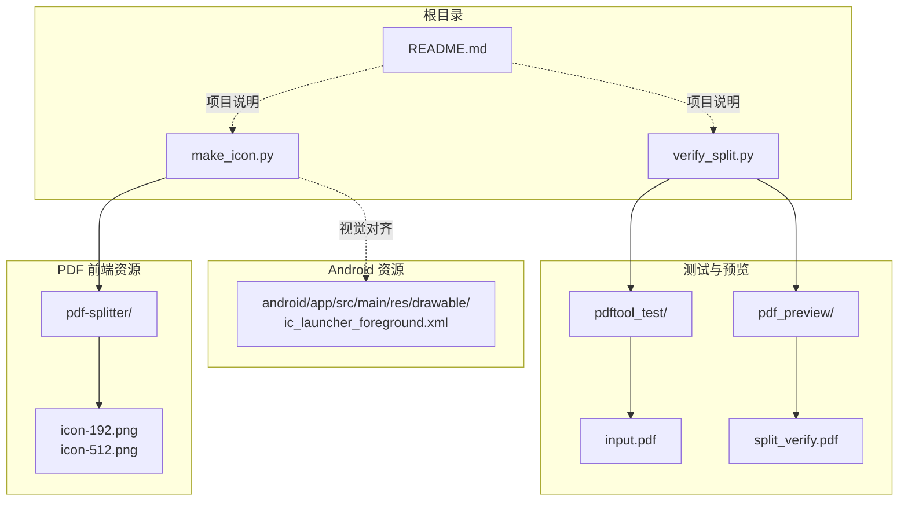
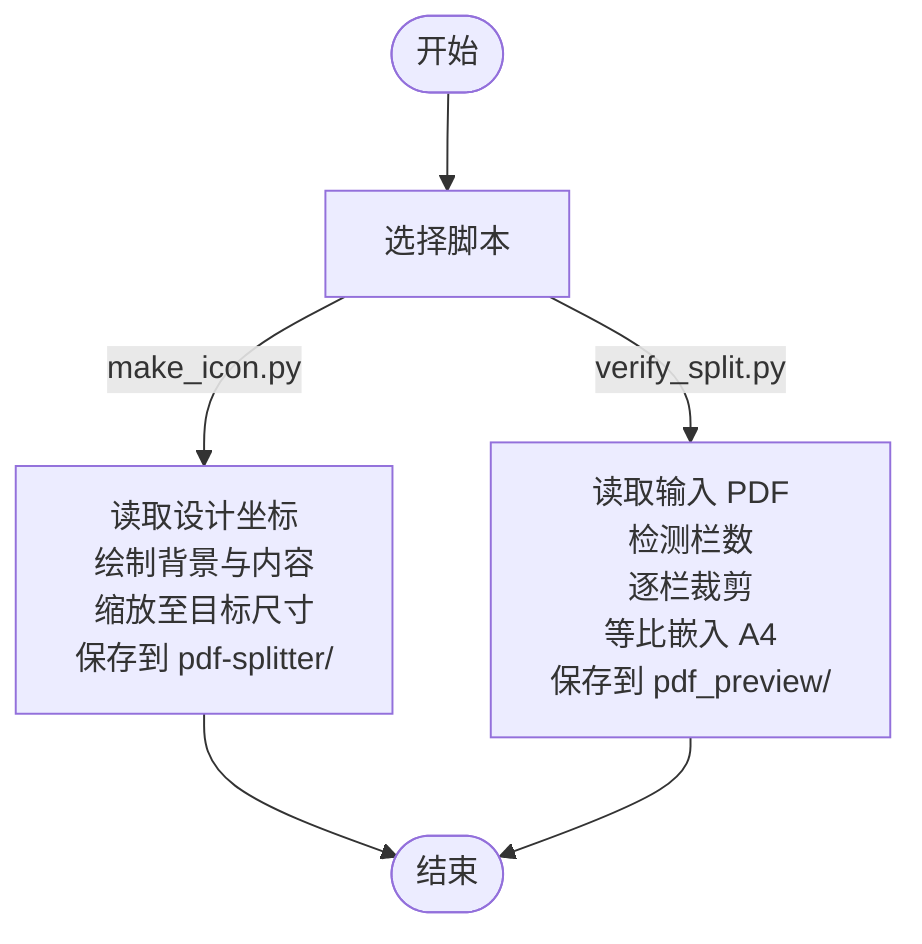
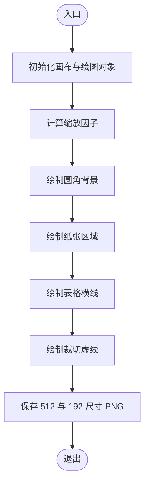
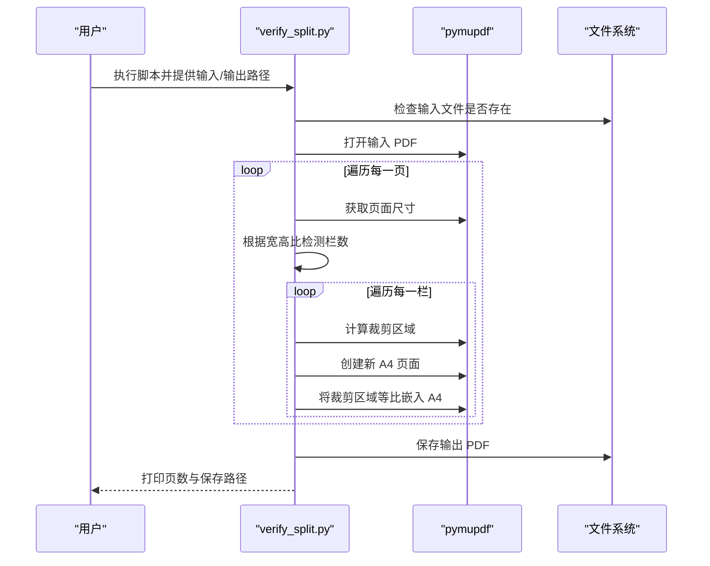

# 自动化脚本

<cite>
**本文引用的文件**   
- [make_icon.py](file://make_icon.py)
- [verify_split.py](file://verify_split.py)
- [README.md](file://README.md)
</cite>

## 目录
1. [简介](#简介)
2. [项目结构](#项目结构)
3. [核心脚本总览](#核心脚本总览)
4. [架构与数据流](#架构与数据流)
5. [详细组件分析](#详细组件分析)
6. [依赖与环境要求](#依赖与环境要求)
7. [使用方法与参数说明](#使用方法与参数说明)
8. [错误处理与日志输出](#错误处理与日志输出)
9. [性能与可扩展性](#性能与可扩展性)
10. [故障排查](#故障排查)
11. [结论](#结论)

## 简介
本仓库提供两个 Python 自动化脚本，用于试卷切分工具链的辅助工作：
- `make_icon.py`：生成 PWA 应用图标，保证 Android 启动图标与网页图标视觉一致。
- `verify_split.py`：对横向拼版试卷进行“按栏切分 + A4 嵌入”的验证预览，便于快速检查切分效果。

这些脚本面向本地离线环境，不上传任何文件，适合在构建、测试或日常维护流程中自动执行。

## 项目结构
与自动化脚本直接相关的目录和文件如下：
- `pdf-splitter/`：PWA 前端资源，包含 `index.html`、`app.js` 以及本地化的 PDF 库；脚本生成的图标会输出到该目录。
- `pdftool_test/`：存放测试输入与调试脚本，`verify_split.py` 默认读取其中的 `input.pdf`。
- `pdf_preview/`：`verify_split.py` 的输出目录（若不存在会自动创建）。
- `android/app/src/main/res/drawable/ic_launcher_foreground.xml`：Android 启动图标矢量源，`make_icon.py` 与其保持视觉一致。

**图表来源**
- [make_icon.py:1-53](file://make_icon.py#L1-L53)
- [verify_split.py:1-54](file://verify_split.py#L1-L54)
- [README.md:13-22](file://README.md#L13-L22)

**章节来源**
- [README.md:13-22](file://README.md#L13-L22)

## 核心脚本总览
- `make_icon.py`
  - 功能：根据设计稿坐标绘制横版双栏试卷与中间红色裁切虚线，生成 `pdf-splitter/icon-192.png` 与 `pdf-splitter/icon-512.png`。
  - 关键行为：以 512 为基准坐标系，按比例缩放至目标尺寸；自动创建输出目录并打印保存路径。
- `verify_split.py`
  - 功能：打开横向拼版 PDF，按页面宽高比自动判断栏数（1/2/3），将每栏裁剪后等比放入 A4 页面，输出验证 PDF。
  - 关键行为：支持命令行参数指定输入与输出路径；默认读取 `pdftool_test/input.pdf`，输出到 `pdf_preview/split_verify.pdf`。

**章节来源**
- [make_icon.py:1-53](file://make_icon.py#L1-L53)
- [verify_split.py:1-54](file://verify_split.py#L1-L54)

## 架构与数据流
两个脚本均为独立可执行程序，无相互依赖，但共享项目上下文：
- `make_icon.py` 依赖 PIL（Pillow）进行图像绘制与保存。
- `verify_split.py` 依赖 pymupdf 进行 PDF 读取、裁剪与写入。
- 两者均通过相对路径访问项目内资源，适合在仓库根目录直接运行。

[本图为概念流程图，不对应具体代码结构，故不提供图表来源]

## 详细组件分析

### make_icon.py 分析
- 设计坐标与布局
  - 以 512×512 为设计稿坐标系，定义纸张区域、行位置、左右列坐标、折叠中线等常量。
  - 通过比例换算函数将设计坐标映射到任意目标尺寸。
- 绘制逻辑
  - 先绘制圆角背景矩形，再绘制白色纸张区域。
  - 遍历行与左右列，绘制灰色横线模拟试卷表格。
  - 沿中线绘制红色虚线表示裁切位置。
- 输出
  - 循环生成 512 与 192 两种尺寸 PNG，保存到 `pdf-splitter/`。

**图表来源**
- [make_icon.py:20-52](file://make_icon.py#L20-L52)

**章节来源**
- [make_icon.py:1-53](file://make_icon.py#L1-L53)

### verify_split.py 分析
- 输入与输出
  - 输入：横向拼版 PDF（一页多栏）。
  - 输出：每栏一页 A4 纵向的验证 PDF。
- 栏数检测
  - 基于页面宽高比判断：≥1.85 视为 3 栏，≥1.2 视为 2 栏，否则为 1 栏。
- 切分与嵌入
  - 对每页按栏等宽裁剪，计算缩放比例使内容适配 A4 可用区域，居中放置。
  - 使用 pymupdf 的页面渲染接口将裁剪区域嵌入新页面。
- 命令行参数
  - 第一个参数为输入 PDF 路径，第二个参数为输出 PDF 路径；未提供时使用默认路径。

**图表来源**
- [verify_split.py:17-53](file://verify_split.py#L17-L53)

**章节来源**
- [verify_split.py:1-54](file://verify_split.py#L1-L54)

## 依赖与环境要求
- Python 版本
  - 脚本使用标准库 `os`、`sys` 与第三方库 `PIL`、`pymupdf`，建议 Python 3.8+。
- 依赖库安装
  - Pillow：`pip install Pillow`
  - pymupdf：`pip install pymupdf`
- 运行目录
  - 建议在仓库根目录运行脚本，确保相对路径正确解析到 `pdf-splitter/`、`pdftool_test/` 等目录。
- 权限与路径
  - 需要写入 `pdf-splitter/` 与 `pdf_preview/` 目录的权限；脚本会自动创建缺失的输出目录。

**章节来源**
- [make_icon.py:6-10](file://make_icon.py#L6-L10)
- [verify_split.py:3-15](file://verify_split.py#L3-L15)
- [README.md:13-22](file://README.md#L13-L22)

## 使用方法与参数说明

### make_icon.py
- 基本用法
  - 在仓库根目录执行：`python make_icon.py`
  - 自动生成 `pdf-splitter/icon-192.png` 与 `pdf-splitter/icon-512.png`。
- 输出位置
  - 输出目录为脚本所在目录下的 `pdf-splitter/`，若不存在则自动创建。
- 自定义扩展
  - 修改 `OUT_DIR` 可改变输出目录。
  - 调整 `DOC`、`ROWS`、`COL_L`、`COL_R`、`FOLD` 等常量可定制图标内容与布局。
  - 在尺寸循环中添加新尺寸可批量生成更多规格。

**章节来源**
- [make_icon.py:10-52](file://make_icon.py#L10-L52)

### verify_split.py
- 基本用法
  - 默认模式：`python verify_split.py`，读取 `pdftool_test/input.pdf`，输出到 `pdf_preview/split_verify.pdf`。
  - 指定输入输出：`python verify_split.py <输入PDF路径> <输出PDF路径>`。
- 输入校验
  - 若输入文件不存在，脚本直接退出并提示找不到输入文件。
- 输出控制
  - 输出目录不存在时自动创建；最终打印输出页数与保存路径。
- 自定义扩展
  - 修改 `detect_cols` 中的阈值可调整栏数识别策略。
  - 调整 `MARGIN` 可改变 A4 页面的边距。
  - 修改缩放与居中逻辑可改变嵌入方式。

**章节来源**
- [verify_split.py:8-53](file://verify_split.py#L8-L53)

## 错误处理与日志输出
- `make_icon.py`
  - 异常捕获：未显式捕获异常，依赖 Python 默认异常机制。
  - 日志输出：仅在保存成功后打印 `saved <路径>`。
- `verify_split.py`
  - 异常捕获：未显式捕获异常，依赖 Python 默认异常机制。
  - 日志输出：
    - 输入文件不存在时输出错误信息并退出。
    - 完成后打印输出页数与保存路径。

建议在生产环境中增加 try-except 包裹关键步骤，记录异常堆栈与耗时统计，以便定位问题。

**章节来源**
- [make_icon.py:47-52](file://make_icon.py#L47-L52)
- [verify_split.py:13-14](file://verify_split.py#L13-L14)
- [verify_split.py:50-52](file://verify_split.py#L50-L52)

## 性能与可扩展性
- `make_icon.py`
  - 性能特征：仅绘制少量几何图形，性能开销极低。
  - 优化点：可缓存已生成的尺寸结果，避免重复绘制。
- `verify_split.py`
  - 性能特征：逐页栅格化与嵌入操作，页数较多时耗时增长明显。
  - 优化点：
    - 并行处理页面（需注意 pymupdf 线程安全）。
    - 调整压缩选项以减少输出文件大小。
    - 预检测栏数并缓存结果。
- 集成到构建流程
  - 可在 CI/CD 中调用脚本生成图标与验证 PDF，作为质量门禁的一部分。
  - 结合单元测试对 `detect_cols` 与绘制逻辑进行断言。

**章节来源**
- [make_icon.py:20-52](file://make_icon.py#L20-L52)
- [verify_split.py:32-53](file://verify_split.py#L32-L53)

## 故障排查
- 常见问题
  - 找不到输入文件：检查 `verify_split.py` 的输入路径是否正确。
  - 输出目录权限不足：确保有写入 `pdf-splitter/` 与 `pdf_preview/` 的权限。
  - 依赖库未安装：确认已安装 `Pillow` 与 `pymupdf`。
- 调试建议
  - 临时打印中间变量（如页面尺寸、栏数、缩放比例）以定位逻辑问题。
  - 使用较小的测试 PDF 验证脚本行为。
- 参考文档
  - 项目整体说明与限制见 `README.md`，包括旋转校正、白边裁剪、已知限制等。

**章节来源**
- [verify_split.py:13-14](file://verify_split.py#L13-L14)
- [README.md:77-92](file://README.md#L77-L92)

## 结论
`make_icon.py` 与 `verify_split.py` 提供了试卷切分工具链中关键的辅助能力：前者确保图标视觉一致性，后者提供快速切分验证。两者均简洁易用，适合集成到自动化流程中。通过合理配置参数、扩展处理逻辑与增强错误处理，可进一步提升其稳定性与可维护性。