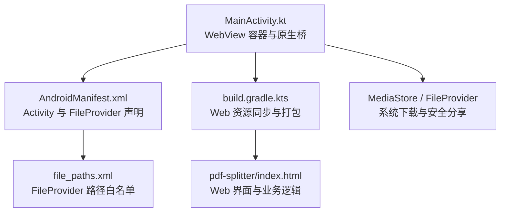
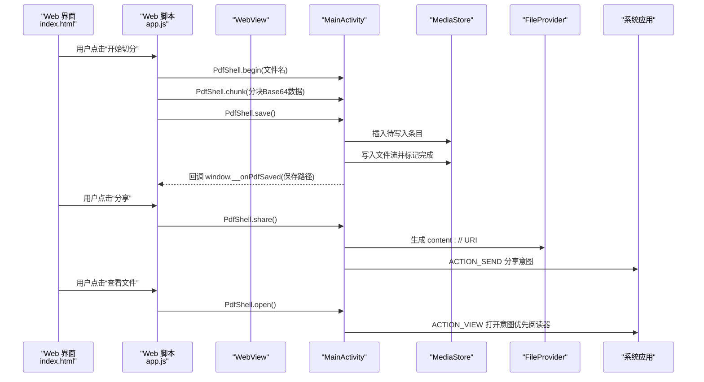
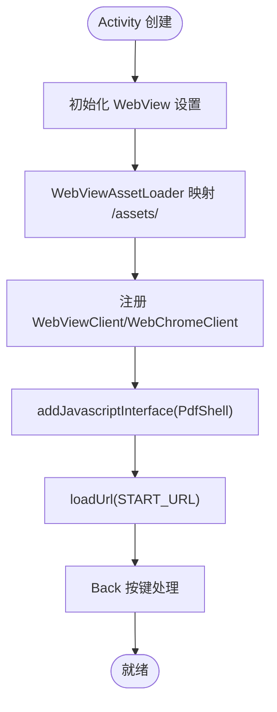
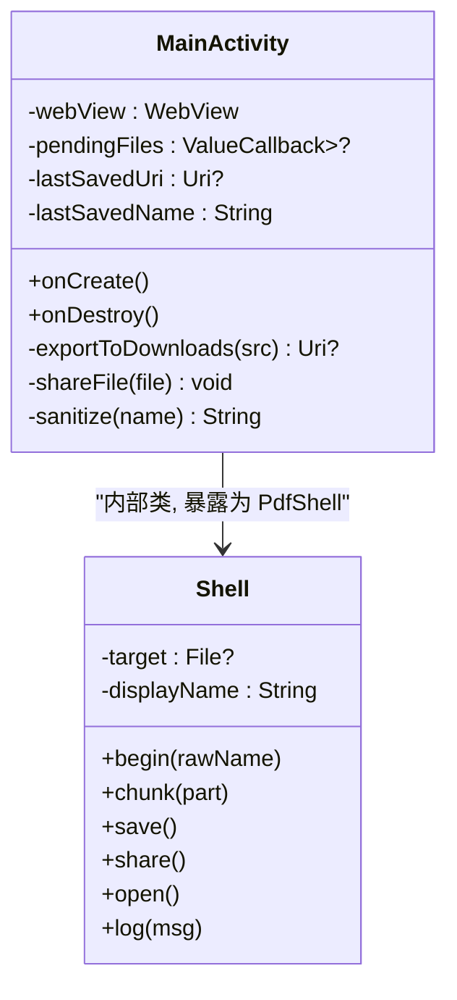
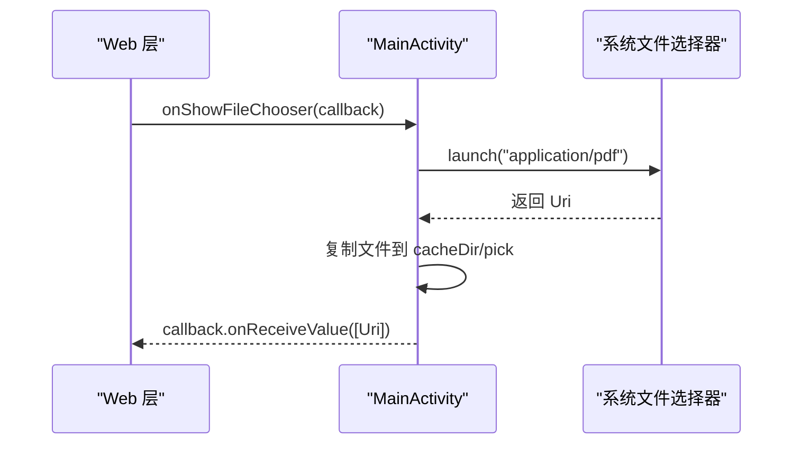
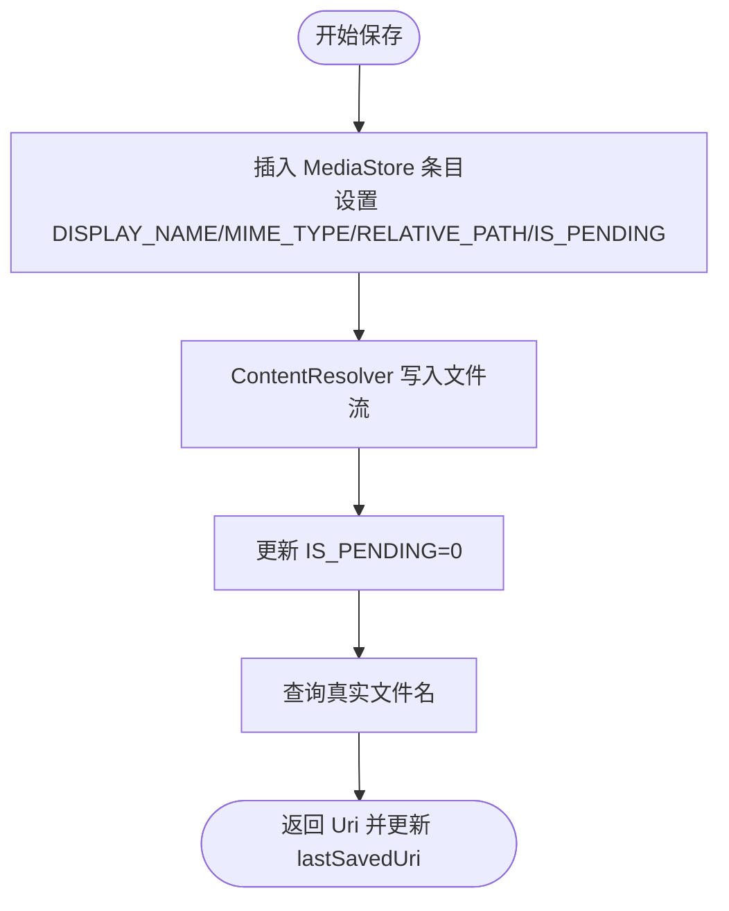
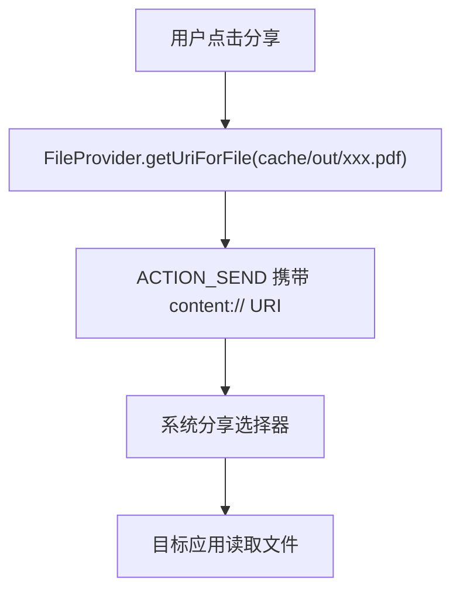
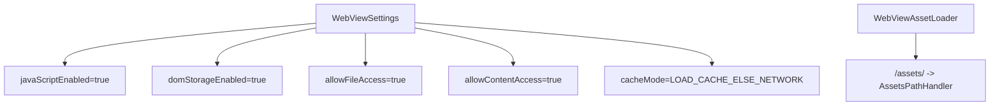
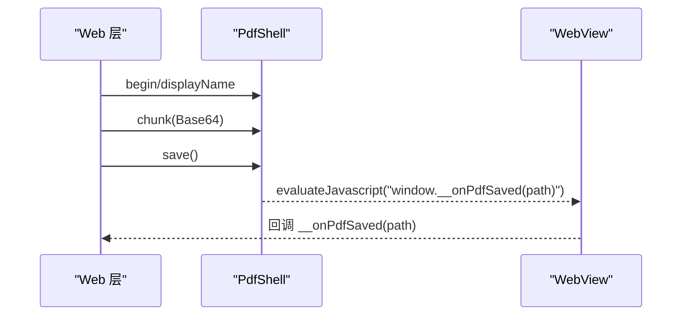
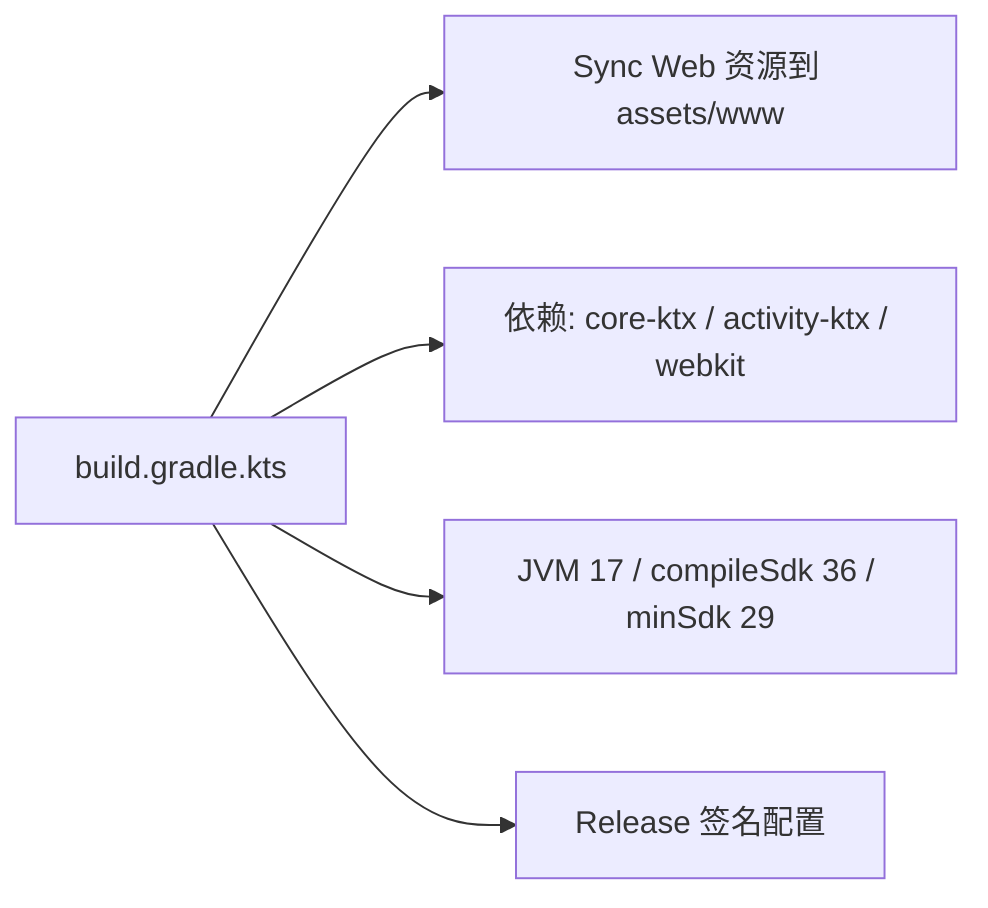

# Android应用架构

<cite>
**本文引用的文件**   
- [MainActivity.kt](file://android/app/src/main/java/com/pdfsplitter/app/MainActivity.kt)
- [build.gradle.kts](file://android/app/build.gradle.kts)
- [AndroidManifest.xml](file://android/app/src/main/AndroidManifest.xml)
- [file_paths.xml](file://android/app/src/main/res/xml/file_paths.xml)
- [index.html](file://pdf-splitter/index.html)
</cite>

## 目录
1. [简介](#简介)
2. [项目结构](#项目结构)
3. [核心组件](#核心组件)
4. [架构总览](#架构总览)
5. [详细组件分析](#详细组件分析)
6. [依赖与构建配置](#依赖与构建配置)
7. [性能与兼容性](#性能与兼容性)
8. [故障排查指南](#故障排查指南)
9. [结论](#结论)

## 简介
本项目是一个以 WebView 为容器的 Android 壳应用，核心业务逻辑运行在本地 Web 资源中（PDF 解析、切分、预览），原生侧仅负责：
- 文件选择与权限桥接
- 大文件分块写入与保存至系统下载目录
- 安全分享与查看 PDF
- WebView 生命周期与系统集成封装

该设计将重型 PDF 处理留在前端，原生层保持轻量，便于跨平台复用与快速迭代。

## 项目结构
Android 模块采用标准的 Gradle + Kotlin 工程组织：
- 应用入口与 WebView 容器：`MainActivity.kt`
- 清单与 Provider 配置：`AndroidManifest.xml`、`file_paths.xml`
- 构建脚本与 Web 资源同步：`build.gradle.kts`
- Web 前端资源：`pdf-splitter/index.html` 及静态资源

**图表来源**
- [MainActivity.kt:37-151](file://android/app/src/main/java/com/pdfsplitter/app/MainActivity.kt#L37-L151)
- [AndroidManifest.xml:21-41](file://android/app/src/main/AndroidManifest.xml#L21-L41)
- [file_paths.xml:1-5](file://android/app/src/main/res/xml/file_paths.xml#L1-L5)
- [build.gradle.kts:15-21](file://android/app/build.gradle.kts#L15-L21)

**章节来源**
- [MainActivity.kt:37-151](file://android/app/src/main/java/com/pdfsplitter/app/MainActivity.kt#L37-L151)
- [AndroidManifest.xml:1-45](file://android/app/src/main/AndroidManifest.xml#L1-L45)
- [file_paths.xml:1-5](file://android/app/src/main/res/xml/file_paths.xml#L1-L5)
- [build.gradle.kts:1-85](file://android/app/build.gradle.kts#L1-L85)

## 核心组件
- MainActivity：作为 WebView 容器，负责页面加载、JS 接口暴露、文件选择回调、结果导出与分享。
- Shell（JsInterface）：供 Web 层调用的原生能力封装，包括 begin/chunk/save/share/open/log。
- FileProvider：通过 `cache-path` 暴露缓存目录中的输出文件，用于安全分享。
- MediaStore：将最终 PDF 写入系统“下载”目录的自定义子目录，并标记完成状态。
- WebViewAssetLoader：将 `/assets/` 映射到包内资源，避免远程加载风险。

**章节来源**
- [MainActivity.kt:103-151](file://android/app/src/main/java/com/pdfsplitter/app/MainActivity.kt#L103-L151)
- [MainActivity.kt:166-262](file://android/app/src/main/java/com/pdfsplitter/app/MainActivity.kt#L166-L262)
- [AndroidManifest.xml:33-41](file://android/app/src/main/AndroidManifest.xml#L33-L41)
- [file_paths.xml:1-5](file://android/app/src/main/res/xml/file_paths.xml#L1-L5)

## 架构总览
整体采用“原生壳 + Web 内核”的分层架构：
- 原生层：提供系统能力（文件选择、存储、分享、打开）、WebView 生命周期管理、错误提示。
- Web 层：使用 pdf.js 渲染与 pdf-lib 进行 PDF 切分，通过 window.PdfShell 调用原生能力。

**图表来源**
- [MainActivity.kt:166-262](file://android/app/src/main/java/com/pdfsplitter/app/MainActivity.kt#L166-L262)
- [MainActivity.kt:264-292](file://android/app/src/main/java/com/pdfsplitter/app/MainActivity.kt#L264-L292)
- [index.html:284-286](file://pdf-splitter/index.html#L284-L286)

## 详细组件分析

### MainActivity 作为 WebView 容器
职责与关键点：
- 初始化 WebView 并启用 JavaScript、DOM Storage、本地资源访问与缓存优先策略。
- 使用 WebViewAssetLoader 将 `/assets/` 映射到包内资源，限制远程加载。
- 注册 WebChromeClient 拦截文件选择器、JS Alert/Confirm。
- 通过 addJavascriptInterface 暴露 PdfShell 给 Web 层。
- 处理返回键行为：优先 WebView 历史回退，否则退出 Activity。

**图表来源**
- [MainActivity.kt:85-151](file://android/app/src/main/java/com/pdfsplitter/app/MainActivity.kt#L85-L151)

**章节来源**
- [MainActivity.kt:85-151](file://android/app/src/main/java/com/pdfsplitter/app/MainActivity.kt#L85-L151)

### PdfShell 桥接接口设计
- begin(rawName)：准备输出文件，清理旧缓存，记录显示名。
- chunk(part)：接收 Base64 分块，追加写入目标文件。
- save()：将缓存文件写入系统下载目录，更新 lastSavedUri，并通过 evaluateJavascript 通知 Web 层。
- share()：通过 FileProvider 生成 URI，发起系统分享。
- open()：优先定向到已安装的 PDF 阅读器，否则使用系统选择器。
- log(msg)：调试日志输出。

**图表来源**
- [MainActivity.kt:37-54](file://android/app/src/main/java/com/pdfsplitter/app/MainActivity.kt#L37-L54)
- [MainActivity.kt:166-262](file://android/app/src/main/java/com/pdfsplitter/app/MainActivity.kt#L166-L262)

**章节来源**
- [MainActivity.kt:166-262](file://android/app/src/main/java/com/pdfsplitter/app/MainActivity.kt#L166-L262)

### 文件选择与异步回调
- 使用 ActivityResultContracts.OpenDocument 启动系统文件选择器，限定 MIME 类型为 application/pdf。
- 将选择的 Uri 复制到缓存目录 pick，保留原始文件名，并通过 ValueCallback 回传给 Web 层。
- 对异常进行 try/catch 包裹，确保回调始终被触发。

**图表来源**
- [MainActivity.kt:56-73](file://android/app/src/main/java/com/pdfsplitter/app/MainActivity.kt#L56-L73)
- [MainActivity.kt:114-124](file://android/app/src/main/java/com/pdfsplitter/app/MainActivity.kt#L114-L124)

**章节来源**
- [MainActivity.kt:56-73](file://android/app/src/main/java/com/pdfsplitter/app/MainActivity.kt#L56-L73)
- [MainActivity.kt:114-124](file://android/app/src/main/java/com/pdfsplitter/app/MainActivity.kt#L114-L124)

### MediaStore API 与下载目录集成
- 使用 MediaStore.Downloads.EXTERNAL_CONTENT_URI 插入待写入条目，设置 DISPLAY_NAME、MIME_TYPE、RELATIVE_PATH、IS_PENDING。
- 通过 ContentResolver 写入文件流，完成后更新 IS_PENDING=0。
- 重名时自动加后缀，再次查询真实文件名并展示给用户。

**图表来源**
- [MainActivity.kt:264-280](file://android/app/src/main/java/com/pdfsplitter/app/MainActivity.kt#L264-L280)

**章节来源**
- [MainActivity.kt:264-280](file://android/app/src/main/java/com/pdfsplitter/app/MainActivity.kt#L264-L280)

### FileProvider 安全共享实现
- Manifest 中声明 androidx.core.content.FileProvider，authorities 使用 `${applicationId}.fileprovider`。
- file_paths.xml 暴露 cache/out 目录，允许外部应用读取生成的 PDF。
- 分享时通过 FileProvider.getUriForFile 生成 content:// URI，并附加读权限标志。

**图表来源**
- [AndroidManifest.xml:33-41](file://android/app/src/main/AndroidManifest.xml#L33-L41)
- [file_paths.xml:1-5](file://android/app/src/main/res/xml/file_paths.xml#L1-L5)
- [MainActivity.kt:282-292](file://android/app/src/main/java/com/pdfsplitter/app/MainActivity.kt#L282-L292)

**章节来源**
- [AndroidManifest.xml:33-41](file://android/app/src/main/AndroidManifest.xml#L33-L41)
- [file_paths.xml:1-5](file://android/app/src/main/res/xml/file_paths.xml#L1-L5)
- [MainActivity.kt:282-292](file://android/app/src/main/java/com/pdfsplitter/app/MainActivity.kt#L282-L292)

### WebView 配置与资源加载
- 启用 JavaScript、DOM Storage、本地文件访问与内容访问。
- 使用 WebViewAssetLoader 将 `/assets/` 映射到包内资源，避免网络请求。
- 设置缓存模式为 LOAD_CACHE_ELSE_NETWORK，提升离线体验。

**图表来源**
- [MainActivity.kt:94-111](file://android/app/src/main/java/com/pdfsplitter/app/MainActivity.kt#L94-L111)

**章节来源**
- [MainActivity.kt:94-111](file://android/app/src/main/java/com/pdfsplitter/app/MainActivity.kt#L94-L111)

### Web 层与原生桥交互
- Web 界面通过 window.PdfShell 调用原生方法，如 begin/chunk/save/share/open。
- 原生侧通过 evaluateJavascript 回调 window.__onPdfSaved，向 Web 层传递保存路径。
- Web 层使用 pdf.js 和 pdf-lib 进行 PDF 渲染与切分，不上传服务器。

**图表来源**
- [MainActivity.kt:205-207](file://android/app/src/main/java/com/pdfsplitter/app/MainActivity.kt#L205-L207)
- [index.html:284-286](file://pdf-splitter/index.html#L284-L286)

**章节来源**
- [MainActivity.kt:205-207](file://android/app/src/main/java/com/pdfsplitter/app/MainActivity.kt#L205-L207)
- [index.html:284-286](file://pdf-splitter/index.html#L284-L286)

## 依赖与构建配置
- 编译与 SDK：compileSdk/targetSdk=36，minSdk=29，Java/Kotlin JVM 目标为 17。
- 签名与构建类型：release 支持 keystore.properties；debug 添加后缀。
- Web 资源同步：preBuild 任务将 pdf-splitter 指定文件同步到 assets/www。
- 依赖库：core-ktx、activity-ktx、webkit。

**图表来源**
- [build.gradle.kts:15-21](file://android/app/build.gradle.kts#L15-L21)
- [build.gradle.kts:28-70](file://android/app/build.gradle.kts#L28-L70)
- [build.gradle.kts:80-84](file://android/app/build.gradle.kts#L80-L84)

**章节来源**
- [build.gradle.kts:1-85](file://android/app/build.gradle.kts#L1-L85)

## 性能与兼容性
- 大文件传输：采用分块 Base64 传输，避免单次桥调用内存压力过大。
- 缓存策略：优先本地缓存，减少网络开销。
- 版本兼容：minSdk=29（Android 10+），利用 MediaStore 与 queries 适配包可见性。
- 调试开关：根据 ApplicationInfo.FLAG_DEBUGGABLE 控制 WebView 调试开关。

[本节为通用指导，不涉及具体代码片段]

## 故障排查指南
常见问题与定位建议：
- 无法打开 PDF：检查是否安装 PDF 阅读器，或改用系统分享。
- 保存失败：确认 MediaStore 写入成功，检查 IS_PENDING 状态与真实文件名。
- 分享失败：确认 FileProvider authorities 与 file_paths.xml 配置正确。
- 文件选择无响应：检查 OpenDocument 回调是否被触发，以及 pendingFiles 是否正确赋值。

**章节来源**
- [MainActivity.kt:226-255](file://android/app/src/main/java/com/pdfsplitter/app/MainActivity.kt#L226-L255)
- [MainActivity.kt:264-292](file://android/app/src/main/java/com/pdfsplitter/app/MainActivity.kt#L264-L292)

## 结论
本方案通过 WebView 容器承载 Web 层 PDF 处理能力，原生层仅提供必要的系统集成与文件系统操作。该架构具备以下优势：
- 业务逻辑集中在前端，便于跨平台复用与快速迭代。
- 原生层职责清晰，专注于文件选择、存储、分享与打开等系统能力。
- 使用 MediaStore 与 FileProvider 保证数据安全与用户体验。
- 构建流程自动化同步 Web 资源，降低维护成本。

[本节为总结性内容，不涉及具体代码片段]