# JavaScript-Native桥接机制

<cite>
**本文引用的文件**   
- [README.md](file://README.md)
- [MainActivity.kt](file://android/app/src/main/java/com/pdfsplitter/app/MainActivity.kt)
- [index.html](file://pdf-splitter/index.html)
- [app.js](file://pdf-splitter/app.js)
</cite>

## 目录
1. [引言](#引言)
2. [项目结构](#项目结构)
3. [核心组件](#核心组件)
4. [架构总览](#架构总览)
5. [详细组件分析](#详细组件分析)
6. [依赖关系分析](#依赖关系分析)
7. [性能与内存优化](#性能与内存优化)
8. [安全与健壮性](#安全与健壮性)
9. [常见问题排查](#常见问题排查)
10. [结论](#结论)

## 引言
本仓库实现了一个“试卷切分助手”：在浏览器或 Android WebView 中加载本地 PDF，使用 pdf.js 预览、pdf-lib 按栏裁剪并输出 A4 纵向 PDF。Android 壳工程负责补齐 WebView 无法直接提供的能力：系统文件选择、结果写入下载目录、系统分享、PDF 阅读器定向打开等。JavaScript 与 Android Native 之间通过 `PdfShell` 接口进行双向通信，大体积 PDF 结果采用分块 Base64 传输，避免单次桥调用数据过大导致崩溃或卡顿。

## 项目结构
- `pdf-splitter/`：Web 本体（PWA），包含 `index.html`、`app.js` 以及本地化的 pdf.js、pdf-lib。
- `android/`：Android 壳工程（Kotlin + WebView），构建时把 `pdf-splitter/` 同步到 `assets/www`，并通过 `WebViewAssetLoader` 以 HTTPS 协议暴露资源。
- `pdftool_test/`：本地验证脚本与输出，用于旋转矩阵和尺寸测试。

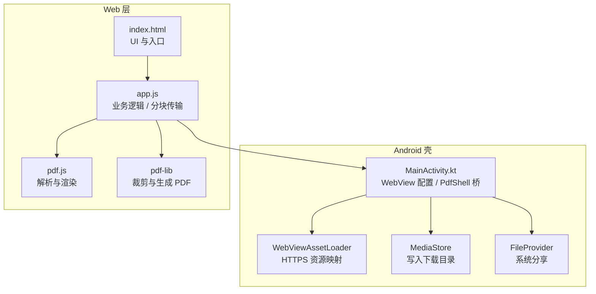

**图表来源**
- [MainActivity.kt:103-151](file://android/app/src/main/java/com/pdfsplitter/app/MainActivity.kt#L103-L151)
- [index.html:284-286](file://pdf-splitter/index.html#L284-L286)
- [app.js:284-286](file://pdf-splitter/app.js#L284-L286)

**章节来源**
- [README.md:13-22](file://README.md#L13-L22)

## 核心组件
- `MainActivity`：Android 壳 Activity，负责 WebView 初始化、资源加载、文件选择、`PdfShell` 桥方法实现、结果保存与分享。
- `Shell`：`PdfShell` 的 Native 实现，提供 `begin()`、`chunk()`、`save()`、`share()`、`open()`、`log()` 等方法。
- `app.js`：前端业务逻辑，负责 PDF 读取、旋转归一化、白边检测、分页裁剪、结果 Blob 生成，以及通过 `window.PdfShell` 与原生交互。
- `index.html`：页面结构与 UI 元素，绑定按钮事件，展示进度、预览、结果区。

**章节来源**
- [MainActivity.kt:37-151](file://android/app/src/main/java/com/pdfsplitter/app/MainActivity.kt#L37-L151)
- [MainActivity.kt:166-262](file://android/app/src/main/java/com/pdfsplitter/app/MainActivity.kt#L166-L262)
- [app.js:1-28](file://pdf-splitter/app.js#L1-L28)
- [index.html:161-286](file://pdf-splitter/index.html#L161-L286)

## 架构总览
整体流程如下：用户在 Web 层选择 PDF，前端解析并预览；点击“开始切分”后，前端生成结果 PDF 字节数组；若运行在 Android WebView 环境，则通过 `PdfShell.begin()` 初始化目标文件，再循环调用 `PdfShell.chunk()` 分块传输 Base64 数据；完成后调用 `PdfShell.save()` 写入系统下载目录，或通过 `PdfShell.share()` 发起系统分享；用户可点击“查看文件”由原生定向打开 PDF 阅读器。

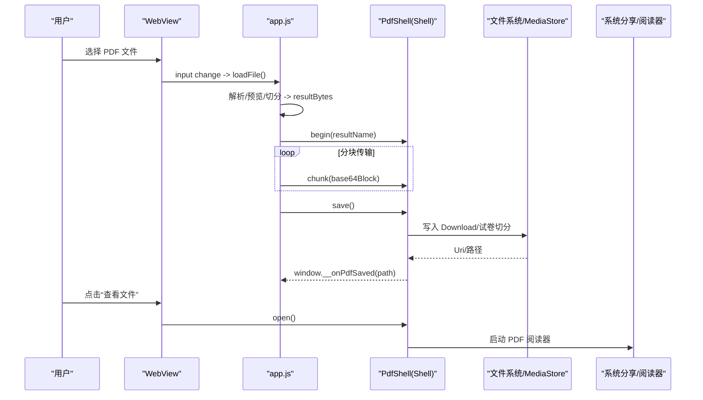

**图表来源**
- [app.js:512-552](file://pdf-splitter/app.js#L512-L552)
- [MainActivity.kt:170-256](file://android/app/src/main/java/com/pdfsplitter/app/MainActivity.kt#L170-L256)

## 详细组件分析

### PdfShell 接口设计
`PdfShell` 是暴露给 Web 层的桥接口，Native 侧通过 `addJavascriptInterface` 注册为 `window.PdfShell`。其方法职责如下：
- `begin(rawName)`：清理缓存输出目录，创建临时文件，记录显示名称。
- `chunk(part)`：接收 Base64 分块，解码并追加写入临时文件。
- `save()`：校验临时文件存在且非空，写入系统下载目录，回传真实路径给 Web。
- `share()`：校验临时文件存在且非空，通过 FileProvider 发起系统分享。
- `open()`：根据已保存 Uri 定向打开 PDF 阅读器，优先匹配白名单应用。
- `log(msg)`：调试日志输出。

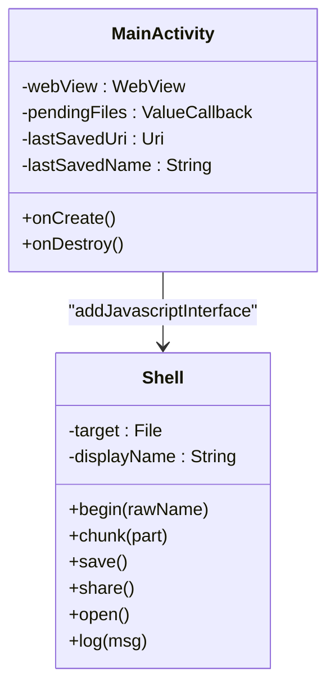

**图表来源**
- [MainActivity.kt:147-151](file://android/app/src/main/java/com/pdfsplitter/app/MainActivity.kt#L147-L151)
- [MainActivity.kt:166-262](file://android/app/src/main/java/com/pdfsplitter/app/MainActivity.kt#L166-L262)

**章节来源**
- [MainActivity.kt:166-262](file://android/app/src/main/java/com/pdfsplitter/app/MainActivity.kt#L166-L262)

### 参数传递与返回值处理
- 参数类型：
  - `rawName`：字符串，原始文件名，经 `sanitize()` 清洗后作为输出文件名。
  - `part`：Base64 字符串，代表二进制分块。
  - `msg`：字符串，日志消息。
- 返回值：
  - 所有桥方法均为 void，状态与结果通过 UI 回调或全局函数通知 Web 层。
  - `save()` 成功后通过 `evaluateJavascript` 调用 `window.__onPdfSaved(path)`，将实际保存路径传给前端。

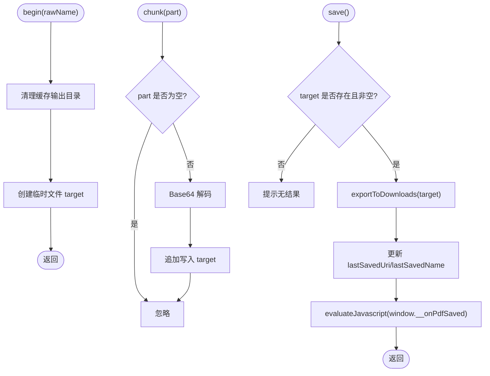

**图表来源**
- [MainActivity.kt:170-208](file://android/app/src/main/java/com/pdfsplitter/app/MainActivity.kt#L170-L208)

**章节来源**
- [MainActivity.kt:170-208](file://android/app/src/main/java/com/pdfsplitter/app/MainActivity.kt#L170-L208)

### 大文件分块传输机制
- 分块大小：768KB（`CH = 768 * 1024`）。
- 编码策略：前端对每个分块使用自定义 `toBase64()`，按 32KB 子块拼接字符串后调用 `btoa()`，减少单次字符串拼接开销。
- 传输模式：同步循环调用 `chunk()`，不等待每次回调；Native 侧顺序解码并追加写入临时文件。
- 完成触发：全部分块发送完毕后，前端调用 `save()` 或 `share()`。

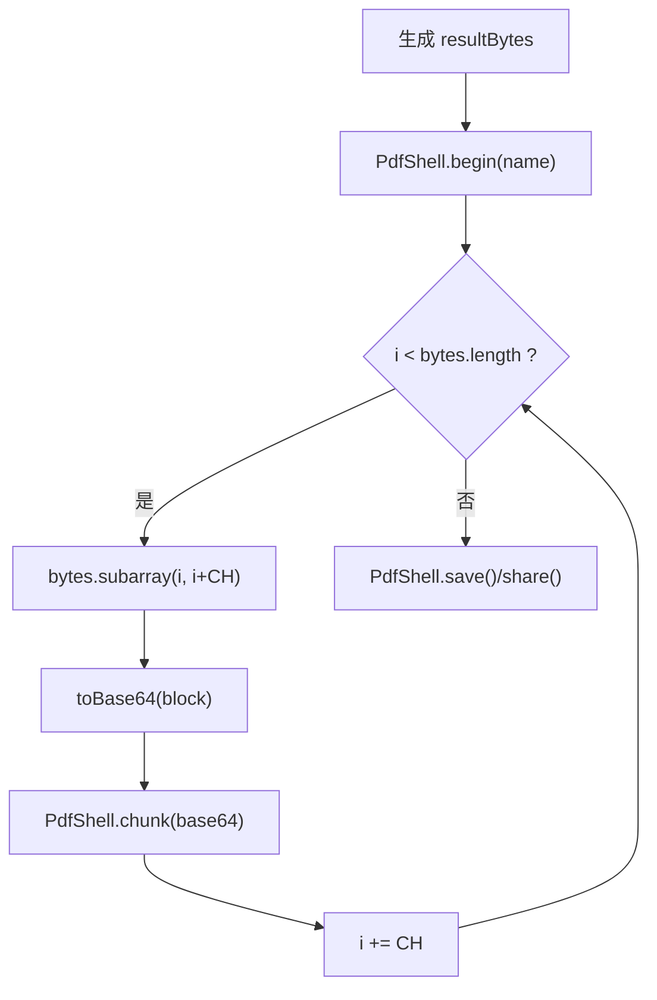

**图表来源**
- [app.js:515-528](file://pdf-splitter/app.js#L515-L528)
- [MainActivity.kt:178-184](file://android/app/src/main/java/com/pdfsplitter/app/MainActivity.kt#L178-L184)

**章节来源**
- [app.js:515-528](file://pdf-splitter/app.js#L515-L528)
- [MainActivity.kt:178-184](file://android/app/src/main/java/com/pdfsplitter/app/MainActivity.kt#L178-L184)

### 异步通信与状态同步
- 前端状态：`state.busy` 控制处理中不可重复触发；`state.resultBytes` 保存最终 PDF 字节；`state.resultUrl` 管理 ObjectURL 生命周期。
- 原生回调：`window.__onPdfSaved(path)` 在 `save()` 成功后由 Native 注入执行，前端据此显示“查看文件”按钮与实际路径。
- 错误传播：前端 try/catch 捕获异常并 alert；原生侧对 MediaStore/FileProvider 操作使用 `runCatching` 包裹，失败时 toast 提示并记录日志。

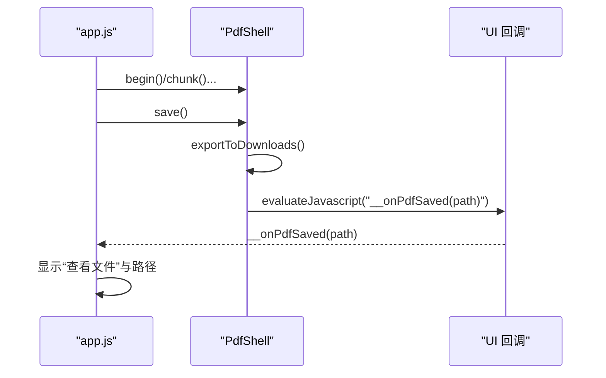

**图表来源**
- [MainActivity.kt:186-208](file://android/app/src/main/java/com/pdfsplitter/app/MainActivity.kt#L186-L208)
- [app.js:566-576](file://pdf-splitter/app.js#L566-L576)

**章节来源**
- [app.js:412-507](file://pdf-splitter/app.js#L412-L507)
- [MainActivity.kt:186-208](file://android/app/src/main/java/com/pdfsplitter/app/MainActivity.kt#L186-L208)

### WebViewAssetLoader 与 HTTPS 资源访问
- 资源根 URL：`https://appassets.androidplatform.net/assets/www/index.html`。
- 拦截请求：`shouldInterceptRequest` 委托给 `WebViewAssetLoader`，将 `/assets/` 映射到应用内 assets。
- 目的：避免 `file://` 协议下 pdf.js worker 加载失败，确保 Worker 线程正常初始化。

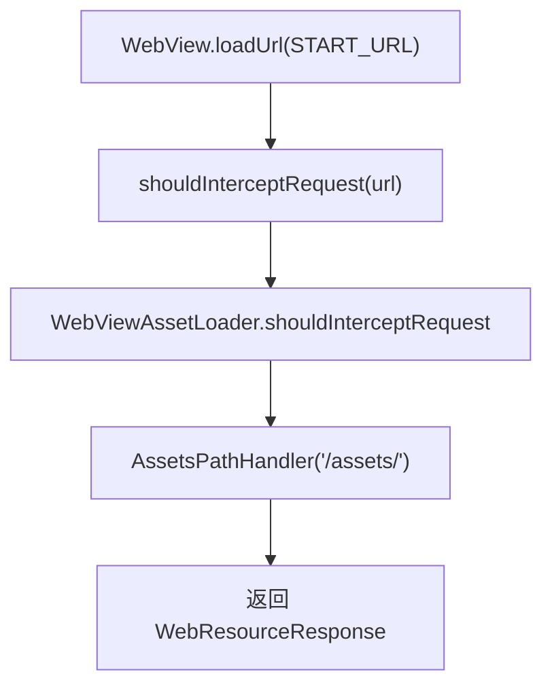

**图表来源**
- [MainActivity.kt:41-42](file://android/app/src/main/java/com/pdfsplitter/app/MainActivity.kt#L41-L42)
- [MainActivity.kt:103-112](file://android/app/src/main/java/com/pdfsplitter/app/MainActivity.kt#L103-L112)

**章节来源**
- [MainActivity.kt:103-112](file://android/app/src/main/java/com/pdfsplitter/app/MainActivity.kt#L103-L112)

### 文件选择与结果保存
- 文件选择：`onShowFileChooser` 接管 `<input type="file">`，使用 `ActivityResultContracts.OpenDocument()` 拉起系统选择器，保留原始文件名并复制到缓存目录。
- 结果保存：`save()` 通过 `MediaStore.Downloads` 写入“下载/试卷切分”，设置 `IS_PENDING=1`，写入完成后置 `IS_PENDING=0`，并回读真实文件名。
- 结果查看：`open()` 优先匹配白名单阅读器包名，未命中则退回系统选择器。

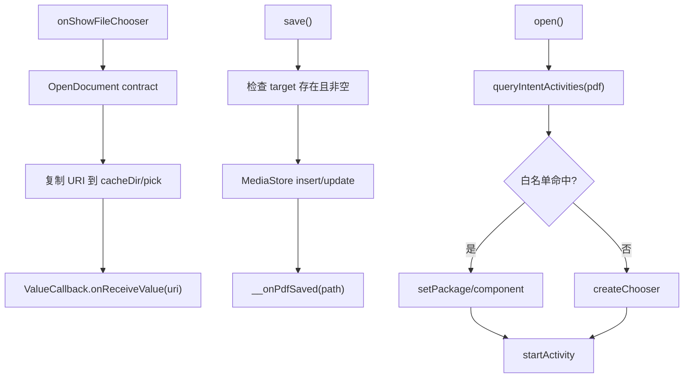

**图表来源**
- [MainActivity.kt:56-83](file://android/app/src/main/java/com/pdfsplitter/app/MainActivity.kt#L56-L83)
- [MainActivity.kt:186-256](file://android/app/src/main/java/com/pdfsplitter/app/MainActivity.kt#L186-L256)

**章节来源**
- [MainActivity.kt:56-83](file://android/app/src/main/java/com/pdfsplitter/app/MainActivity.kt#L56-L83)
- [MainActivity.kt:186-256](file://android/app/src/main/java/com/pdfsplitter/app/MainActivity.kt#L186-L256)

### 系统分享与查看文件
- 分享：`share()` 使用 `FileProvider.getUriForFile()` 构造 URI，通过 `ACTION_SEND` 发起系统分享，不落盘以避免误报“已保存”。
- 查看文件：`open()` 基于上次保存的 Uri，优先定向到 WPS、小米多看、夸克等阅读器，若无匹配则使用系统选择器。

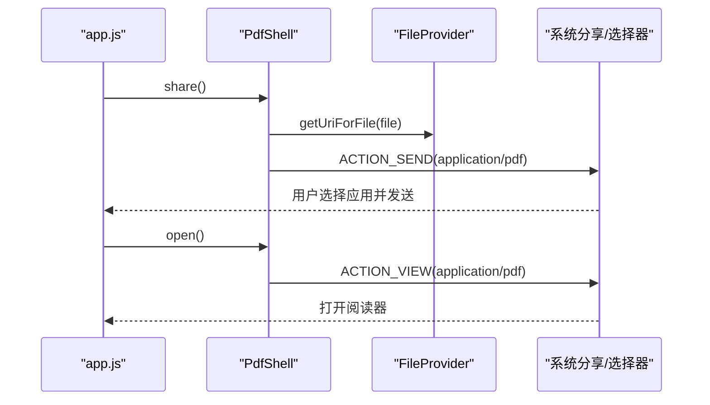

**图表来源**
- [MainActivity.kt:211-256](file://android/app/src/main/java/com/pdfsplitter/app/MainActivity.kt#L211-L256)
- [MainActivity.kt:282-292](file://android/app/src/main/java/com/pdfsplitter/app/MainActivity.kt#L282-L292)

**章节来源**
- [MainActivity.kt:211-256](file://android/app/src/main/java/com/pdfsplitter/app/MainActivity.kt#L211-L256)
- [MainActivity.kt:282-292](file://android/app/src/main/java/com/pdfsplitter/app/MainActivity.kt#L282-L292)

## 依赖关系分析
- Web 层依赖：
  - `pdf.min.js`：PDF 解析与渲染。
  - `pdf-lib.min.js`：PDF 文档创建、嵌入与保存。
  - `app.js`：业务逻辑与桥调用。
- Native 层依赖：
  - `WebViewAssetLoader`：HTTPS 资源映射。
  - `MediaStore`：写入系统下载目录。
  - `FileProvider`：安全分享文件。
  - `ActivityResultContracts`：系统文件选择。

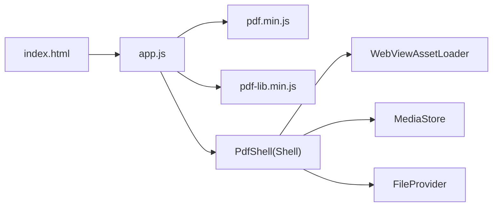

**图表来源**
- [index.html:284-286](file://pdf-splitter/index.html#L284-L286)
- [MainActivity.kt:103-112](file://android/app/src/main/java/com/pdfsplitter/app/MainActivity.kt#L103-L112)
- [MainActivity.kt:186-292](file://android/app/src/main/java/com/pdfsplitter/app/MainActivity.kt#L186-L292)

**章节来源**
- [index.html:284-286](file://pdf-splitter/index.html#L284-L286)
- [MainActivity.kt:103-112](file://android/app/src/main/java/com/pdfsplitter/app/MainActivity.kt#L103-L112)
- [MainActivity.kt:186-292](file://android/app/src/main/java/com/pdfsplitter/app/MainActivity.kt#L186-L292)

## 性能与内存优化
- 预览复用位图：已渲染页标记 `painted`，裁白边时直接复用 canvas 像素数据，避免二次栅格化。
- 懒加载渲染：使用 `IntersectionObserver` 仅渲染可视区域，减少初始渲染压力。
- 分块传输：768KB 分块降低单次桥调用内存峰值；Base64 子块拼接减少字符串分配。
- 对象释放：切换 PDF 时调用 `prev.destroy()`，及时释放 pdf.js 文档与 worker 缓存；canvas 宽高置零释放位图。
- 进度反馈：每 6 个嵌入页 yield 一次 `tick()`，让出主线程帧时间，避免界面卡顿。

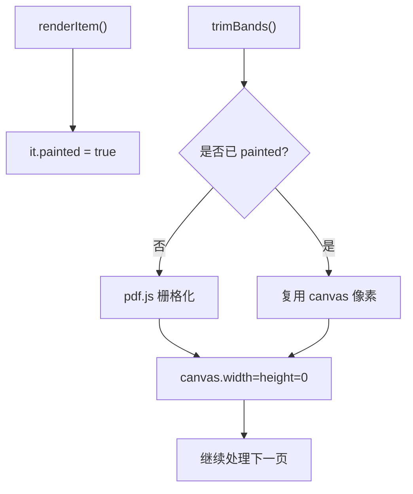

**图表来源**
- [app.js:153-193](file://pdf-splitter/app.js#L153-L193)
- [app.js:243-263](file://pdf-splitter/app.js#L243-L263)
- [app.js:476-477](file://pdf-splitter/app.js#L476-L477)

**章节来源**
- [app.js:153-193](file://pdf-splitter/app.js#L153-L193)
- [app.js:243-263](file://pdf-splitter/app.js#L243-L263)
- [app.js:476-477](file://pdf-splitter/app.js#L476-L477)

## 安全与健壮性
- 文件名清洗：`sanitize()` 过滤非法字符、限制长度、强制 `.pdf` 后缀。
- 输入校验：`chunk()` 忽略空分块；`save()/share()` 校验临时文件存在且非空。
- 异常处理：原生侧使用 `runCatching` 包裹 IO 操作，失败时 toast 提示并记录日志；前端 try/catch 捕获异常并 alert。
- 权限与可见性：Android 11+ 需声明 `<queries>` 以查询 PDF 接收器；白名单优先定向阅读器，避免邮箱/网盘误当附件上传。
- 资源释放：WebView 销毁时调用 `webView.destroy()`；ObjectURL 在结果重置时 `revokeObjectURL`。

**章节来源**
- [MainActivity.kt:294-299](file://android/app/src/main/java/com/pdfsplitter/app/MainActivity.kt#L294-L299)
- [MainActivity.kt:186-256](file://android/app/src/main/java/com/pdfsplitter/app/MainActivity.kt#L186-L256)
- [app.js:554-564](file://pdf-splitter/app.js#L554-L564)
- [README.md:71-75](file://README.md#L71-L75)

## 常见问题排查
- 无法打开 PDF：
  - 检查加密 PDF：前端提示需先去除密码。
  - 检查系统默认选择器：白名单未命中时退回系统选择器。
- 分享失败：
  - 确认已安装可接收 PDF 的应用；否则 toast 提示“未找到可接收 PDF 的应用”。
- 保存失败：
  - 检查存储权限与可用空间；MediaStore 写入失败会 toast “写入「下载」失败”。
- 预览卡顿：
  - 检查是否启用白边裁剪；大量扫描件逐页栅格化耗时明显。
- Worker 加载失败：
  - 确认通过 `WebViewAssetLoader` 以 HTTPS 协议加载资源，而非 `file://`。

**章节来源**
- [app.js:234-238](file://pdf-splitter/app.js#L234-L238)
- [MainActivity.kt:282-292](file://android/app/src/main/java/com/pdfsplitter/app/MainActivity.kt#L282-L292)
- [MainActivity.kt:186-208](file://android/app/src/main/java/com/pdfsplitter/app/MainActivity.kt#L186-L208)
- [README.md:71-75](file://README.md#L71-L75)

## 结论
本项目通过 `PdfShell` 桥实现了 JavaScript 与 Android Native 的双向通信，采用 768KB 分块 Base64 传输解决大文件跨层传递问题。WebViewAssetLoader 以 HTTPS 协议暴露本地资源，规避了 file:// 协议下的兼容性问题。前端负责 PDF 解析、预览与切分，原生侧负责文件选择、结果保存与系统分享，职责清晰、耦合度低。性能方面通过位图复用、懒加载渲染、对象释放与进度 yield 等手段优化用户体验。安全性上注重文件名清洗、输入校验、异常处理与资源释放，保障稳定运行。