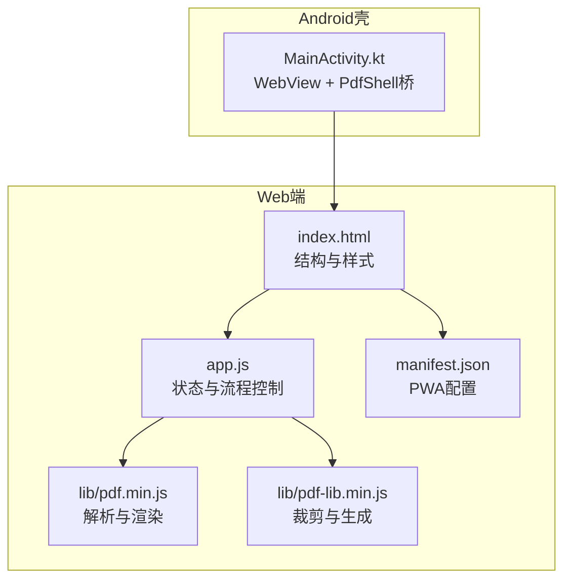
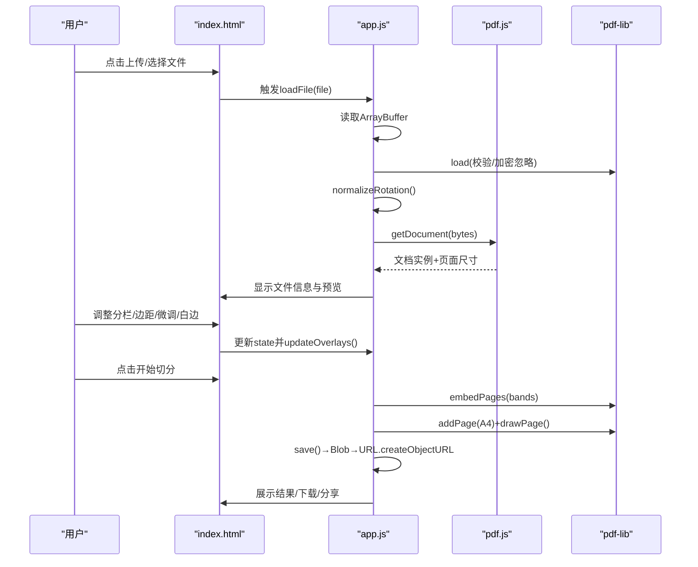
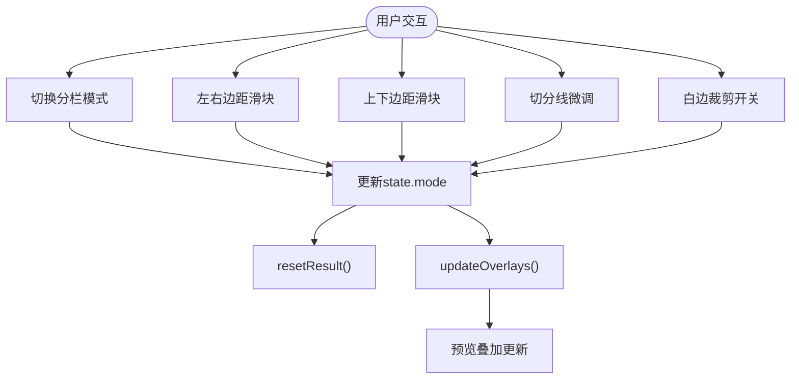
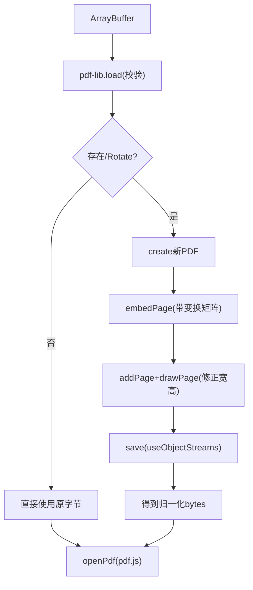
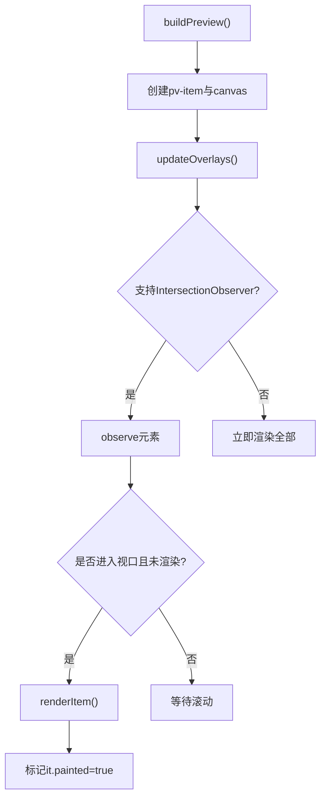
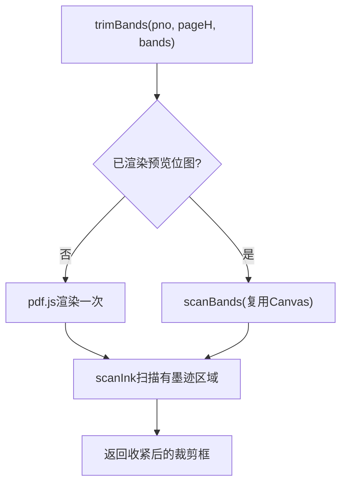
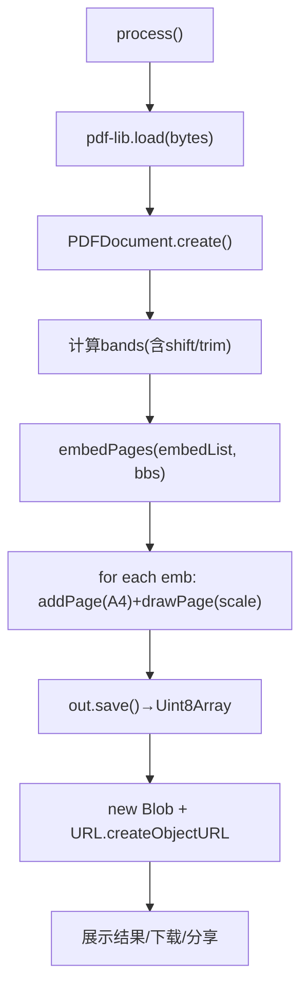
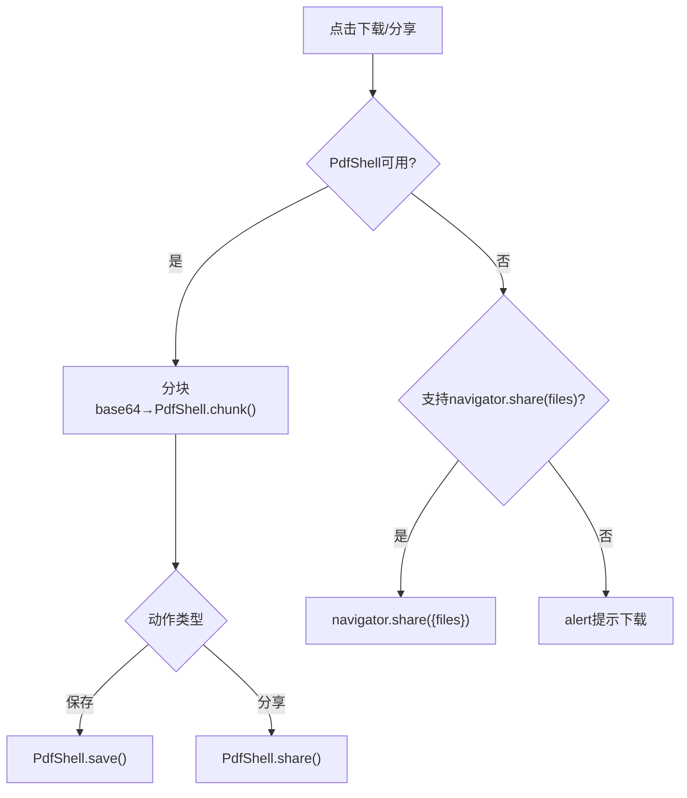
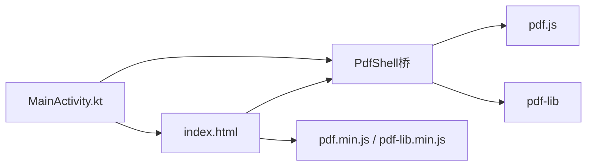
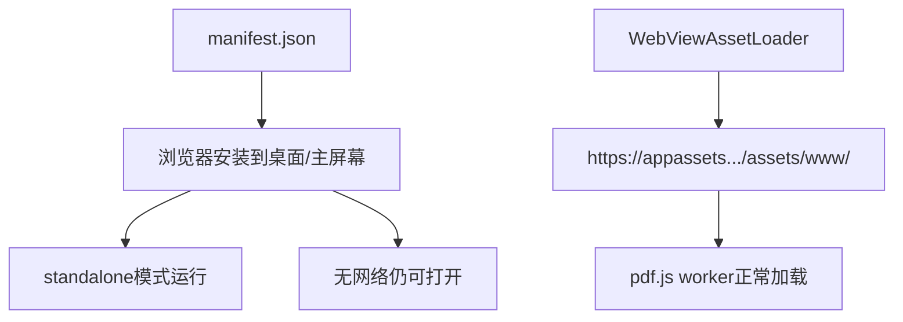

# Web应用架构

<cite>
**本文引用的文件**   
- [index.html](file://pdf-splitter/index.html)
- [app.js](file://pdf-splitter/app.js)
- [manifest.json](file://pdf-splitter/manifest.json)
- [README.md](file://README.md)
</cite>

## 目录
1. [引言](#引言)
2. [项目结构](#项目结构)
3. [核心组件](#核心组件)
4. [架构总览](#架构总览)
5. [详细组件分析](#详细组件分析)
6. [依赖关系分析](#依赖关系分析)
7. [性能与内存优化](#性能与内存优化)
8. [PWA特性与离线能力](#pwa特性与离线能力)
9. [故障排查指南](#故障排查指南)
10. [结论](#结论)

## 引言
本项目是一个面向移动端和桌面浏览器的Web PWA应用，用于将A3/A4拼版试卷（一页含2栏或3栏）切分为标准A4单页PDF，便于直接打印。应用采用三层架构：UI层（HTML/CSS）、业务逻辑层（app.js）、数据处理层（基于pdf.js预览、pdf-lib处理）。所有计算在浏览器本地完成，不上传服务器；同时提供Android WebView壳工程以增强文件选择、原生保存与分享等能力。

## 项目结构
- pdf-splitter：Web本体，包含入口页面、样式、主逻辑脚本以及本地化的pdf.js与pdf-lib库。
- android：Android壳工程，通过WebView加载Web资源，并桥接系统级能力。
- pdftool_test：本地验证脚本与输出，辅助旋转矩阵与坐标一致性校验。
- README.md：使用说明、构建流程与已知限制。

**图表来源**
- [index.html:1-13](file://pdf-splitter/index.html#L1-L13)
- [index.html:284-286](file://pdf-splitter/index.html#L284-L286)
- [app.js:1-11](file://pdf-splitter/app.js#L1-L11)
- [manifest.json:1-17](file://pdf-splitter/manifest.json#L1-L17)
- [README.md:67-75](file://README.md#L67-L75)

**章节来源**
- [README.md:13-22](file://README.md#L13-L22)
- [index.html:1-13](file://pdf-splitter/index.html#L1-L13)
- [manifest.json:1-17](file://pdf-splitter/manifest.json#L1-L17)

## 核心组件
- UI层（index.html）
  - 定义拖拽上传区、文件信息卡片、分栏模式选择、边距与微调滑块、白边裁剪开关、预览网格、结果操作区与底部固定操作栏。
  - 通过CSS变量统一主题色、圆角、阴影与布局间距，适配移动端安全区域与触摸交互。
- 业务逻辑层（app.js）
  - 集中管理全局state对象，监听DOM事件，驱动PDF加载、预览、参数更新、切分生成与下载/分享。
  - 使用Promise链式与async/await组织异步流程，结合进度条与用户反馈。
- 数据处理层
  - pdf.js：负责解析PDF文档、获取页面尺寸、渲染到Canvas进行预览与白边检测。
  - pdf-lib：负责读取/写入PDF字节流、嵌入指定矩形区域、创建A4页面并绘制内容。

**章节来源**
- [index.html:14-141](file://pdf-splitter/index.html#L14-L141)
- [index.html:161-286](file://pdf-splitter/index.html#L161-L286)
- [app.js:13-28](file://pdf-splitter/app.js#L13-L28)
- [app.js:195-239](file://pdf-splitter/app.js#L195-L239)
- [app.js:412-508](file://pdf-splitter/app.js#L412-L508)

## 架构总览
应用遵循“UI事件 → 状态更新 → 数据层处理 → UI刷新”的单向数据流。关键流程包括：
- 文件选择与加载：读取ArrayBuffer → 用pdf-lib校验 → 旋转归一化 → 用pdf.js打开文档 → 收集每页尺寸 → 构建预览。
- 预览与叠加：懒加载渲染Canvas，叠加切分线与标签，实时更新输出页数。
- 切分生成：按列划分bands → 可选白边扫描 → 嵌入pdf-lib → 缩放至A4 → 保存Blob → 展示结果。
- 下载/分享：优先走PdfShell桥（Android），否则走浏览器下载或系统分享API。

**图表来源**
- [app.js:204-239](file://pdf-splitter/app.js#L204-L239)
- [app.js:243-263](file://pdf-splitter/app.js#L243-L263)
- [app.js:265-361](file://pdf-splitter/app.js#L265-L361)
- [app.js:412-508](file://pdf-splitter/app.js#L412-L508)

## 详细组件分析

### 状态管理与事件驱动
- state对象设计
  - 文件与数据：file、ab、bytes、pdf、sizes、resultBytes/resultUrl/resultName。
  - 用户设置：mode、marginX、marginY、shift、trim。
  - 运行时：busy标志防止重复处理。
- 事件绑定
  - 上传区点击与input change触发loadFile。
  - 分栏模式切换、滑块input、白边checkbox变更时更新state并重置结果。
  - 底部操作栏按钮触发process、更换文件等。

**图表来源**
- [app.js:13-28](file://pdf-splitter/app.js#L13-L28)
- [app.js:363-399](file://pdf-splitter/app.js#L363-L399)
- [app.js:331-361](file://pdf-splitter/app.js#L331-L361)
- [app.js:554-564](file://pdf-splitter/app.js#L554-L564)

**章节来源**
- [app.js:13-28](file://pdf-splitter/app.js#L13-L28)
- [app.js:363-399](file://pdf-splitter/app.js#L363-L399)

### PDF加载与旋转校正
- 加载流程
  - 读取ArrayBuffer后先用pdf-lib.load做基础校验。
  - normalizeRotation遍历页面Rotate属性，必要时创建新PDF，按角度矩阵重绘页面并去掉Rotate，确保pdf.js与pdf-lib坐标系一致。
- 旋转矩阵
  - 针对0/90/180/270度分别定义变换矩阵，保证预览方向与输出方向一致。

**图表来源**
- [app.js:57-103](file://pdf-splitter/app.js#L57-L103)
- [app.js:204-239](file://pdf-splitter/app.js#L204-L239)
- [app.js:243-263](file://pdf-splitter/app.js#L243-L263)

**章节来源**
- [app.js:57-103](file://pdf-splitter/app.js#L57-L103)
- [app.js:204-239](file://pdf-splitter/app.js#L204-L239)

### 预览系统与懒加载
- 预览构建
  - 为每页创建pv-item容器，内含canvas与切分线叠加层，根据页面宽高比设置aspect-ratio。
  - updateOverlays动态计算切分线位置与输出页数，避免重新渲染Canvas。
- 懒加载渲染
  - 使用IntersectionObserver观察元素进入视口，未进入则延迟渲染，减少首屏开销。
  - 处理中暂停懒加载，完成后补渲染可见项。

**图表来源**
- [app.js:265-329](file://pdf-splitter/app.js#L265-L329)
- [app.js:331-361](file://pdf-splitter/app.js#L331-L361)

**章节来源**
- [app.js:265-329](file://pdf-splitter/app.js#L265-L329)
- [app.js:331-361](file://pdf-splitter/app.js#L331-L361)

### 白边裁剪与位图复用
- 白边检测
  - 将每栏渲染为位图，扫描非白色像素的最小包围盒，作为实际裁剪框，并保留一定余量避免削到笔画。
  - 若某栏无法检测到墨迹，则退回整栏，不会裁空。
- 位图复用
  - 如果该页已在预览中渲染过，直接复用其Canvas位图，避免二次栅格化，显著降低耗时。

**图表来源**
- [app.js:105-193](file://pdf-splitter/app.js#L105-L193)
- [app.js:440-450](file://pdf-splitter/app.js#L440-L450)

**章节来源**
- [app.js:105-193](file://pdf-splitter/app.js#L105-L193)
- [app.js:440-450](file://pdf-splitter/app.js#L440-L450)

### 切分生成与A4输出
- 分栏与偏移
  - 根据mode与页面比例决定列数n，计算每栏宽度cw与shiftPx偏移。
  - 生成bands列表，记录left/right及可选top/bottom（白边裁剪后）。
- 嵌入与缩放
  - 使用pdf-lib.embedPages批量嵌入各栏矩形区域。
  - 对每个嵌入页创建A4页面，计算等比缩放因子s，居中绘制。
- 进度与保存
  - 分段更新进度条文本与百分比，最终save()得到Uint8Array，转Blob并通过URL.createObjectURL暴露下载链接。

**图表来源**
- [app.js:412-508](file://pdf-splitter/app.js#L412-L508)

**章节来源**
- [app.js:412-508](file://pdf-splitter/app.js#L412-L508)

### 下载与分享
- Android壳桥接
  - 当存在window.PdfShell时，将结果分块base64传输给原生，调用PdfShell.save()/share()。
- 浏览器环境
  - 优先尝试navigator.share(files)，失败回退到普通下载或仅分享标题/文本。

**图表来源**
- [app.js:512-552](file://pdf-splitter/app.js#L512-L552)

**章节来源**
- [app.js:512-552](file://pdf-splitter/app.js#L512-L552)

## 依赖关系分析
- UI层依赖
  - index.html引入pdf.min.js、pdf-lib.min.js与app.js，并通过link rel="manifest"声明PWA清单。
- 业务逻辑层依赖
  - app.js依赖pdf.js进行文档解析与渲染，依赖pdf-lib进行PDF读写与页面嵌入。
- 原生壳依赖
  - MainActivity.kt通过WebViewAssetLoader提供https协议访问本地资源，避免file://下worker加载失败；通过PdfShell桥实现大文件分块传输与系统级保存/分享。

**图表来源**
- [index.html:284-286](file://pdf-splitter/index.html#L284-L286)
- [app.js:1-11](file://pdf-splitter/app.js#L1-L11)
- [README.md:67-75](file://README.md#L67-L75)

**章节来源**
- [index.html:284-286](file://pdf-splitter/index.html#L284-L286)
- [app.js:1-11](file://pdf-splitter/app.js#L1-L11)
- [README.md:67-75](file://README.md#L67-L75)

## 性能与内存优化
- 懒加载渲染
  - 使用IntersectionObserver仅在元素进入视口时渲染，减少首屏与后台页面的渲染压力。
- 位图复用
  - 已渲染预览页直接复用Canvas位图，避免二次pdf.js栅格化，显著缩短处理时间。
- 内存释放
  - 换文件时销毁上一份pdf.js文档实例，及时释放worker与缓存占用。
  - 白边扫描临时Canvas在完成后清空width/height，释放位图内存。
- 大文件处理
  - 使用useObjectStreams压缩对象流，减小输出体积。
  - 分批嵌入与进度更新，避免长时间阻塞UI线程。
- 最佳实践建议
  - 对超大PDF可考虑分页处理或增量生成，但当前实现一次性嵌入，峰值内存较高。
  - 谨慎开启白边裁剪，因其需要逐页栅格化，页数多时会增加耗时。

**章节来源**
- [app.js:243-263](file://pdf-splitter/app.js#L243-L263)
- [app.js:153-193](file://pdf-splitter/app.js#L153-L193)
- [app.js:479-485](file://pdf-splitter/app.js#L479-L485)
- [README.md:81-90](file://README.md#L81-L90)

## PWA特性与离线能力
- manifest.json配置
  - name/short_name/description描述应用名称与用途。
  - start_url与scope限定启动路径与作用域。
  - display设为standalone，orientation为portrait，背景色与主题色匹配UI。
  - icons提供SVG与PNG多种尺寸，支持maskable。
- 离线能力
  - 应用无需CDN依赖，所有脚本与样式均为本地文件，可直接双击index.html离线运行。
  - Android壳通过WebViewAssetLoader提供https协议访问assets/www，避免file://下pdf.js worker加载失败。

**图表来源**
- [manifest.json:1-17](file://pdf-splitter/manifest.json#L1-L17)
- [README.md:37-42](file://README.md#L37-L42)
- [README.md:67-75](file://README.md#L67-L75)

**章节来源**
- [manifest.json:1-17](file://pdf-splitter/manifest.json#L1-L17)
- [README.md:37-42](file://README.md#L37-L42)
- [README.md:67-75](file://README.md#L67-L75)

## 故障排查指南
- 无法打开PDF
  - 可能为加密文件，需先去除密码；错误信息会弹窗提示。
- 预览卡顿或白边检测慢
  - 检查是否开启白边裁剪；未预览到的页会触发一次独立渲染，耗时约1秒/页。
- 输出方向异常
  - 确认normalizeRotation是否正确烘焙Rotate；若页面存在Rotate而未被处理，预览与输出坐标系不一致会导致横倒。
- Android环境下下载/分享不可用
  - 检查是否存在PdfShell桥；若无，则回退到浏览器下载或系统分享API。
- file://协议下worker加载失败
  - 建议使用http.server或Android壳提供的https协议访问。

**章节来源**
- [app.js:234-238](file://pdf-splitter/app.js#L234-L238)
- [app.js:497-501](file://pdf-splitter/app.js#L497-L501)
- [app.js:512-552](file://pdf-splitter/app.js#L512-L552)
- [README.md:81-90](file://README.md#L81-L90)

## 结论
本应用通过清晰的三层架构与事件驱动的状态管理，实现了PDF文件的本地解析、预览、切分与输出。借助pdf.js与pdf-lib的组合，既保证了预览体验，又提供了可靠的PDF处理能力。PWA配置与Android壳增强了离线可用性与系统级集成。性能方面通过懒加载、位图复用与对象流压缩等手段有效降低了渲染与内存压力。未来可在超大文件场景下引入分页处理与取消机制，进一步提升用户体验。