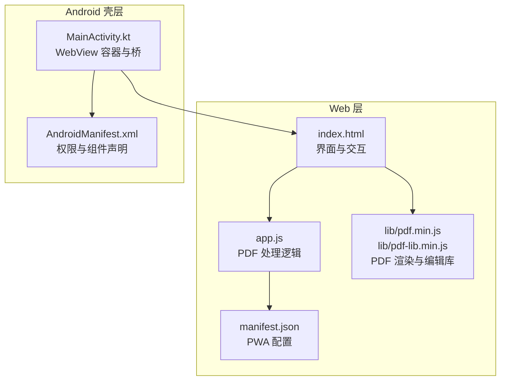
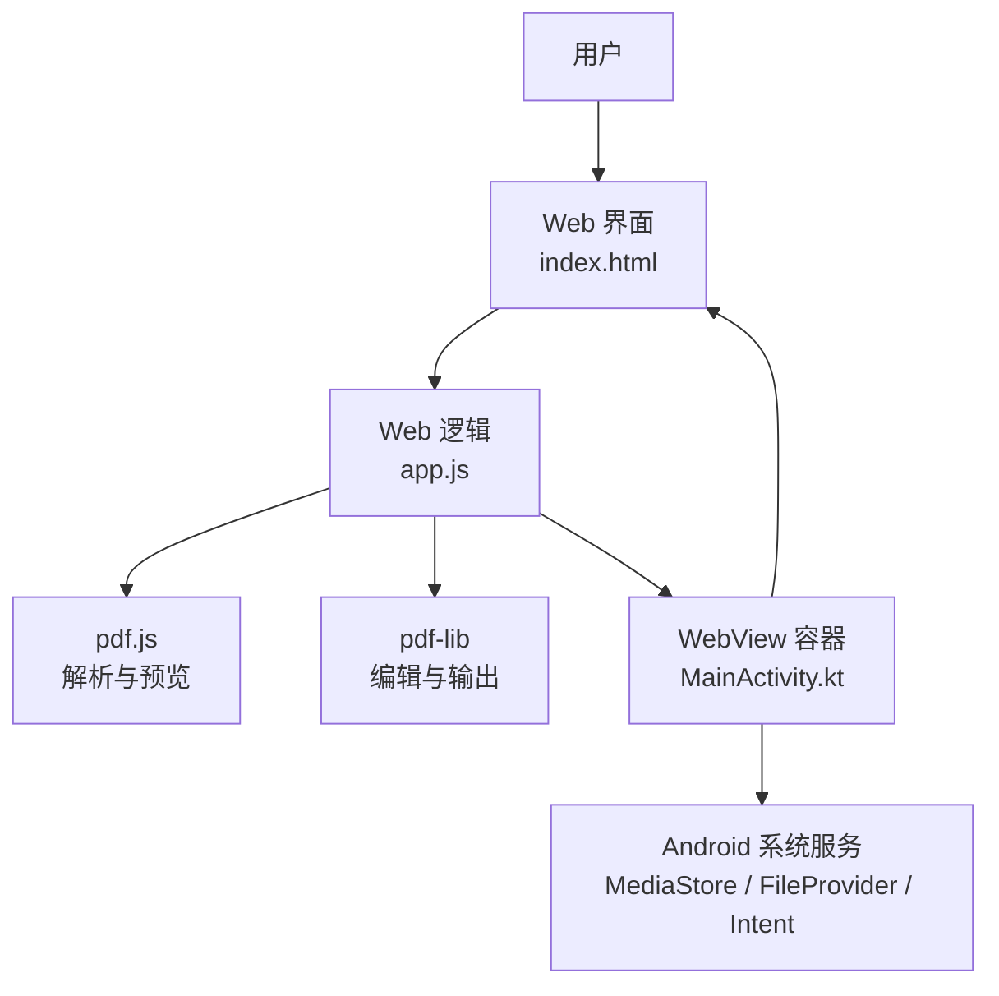
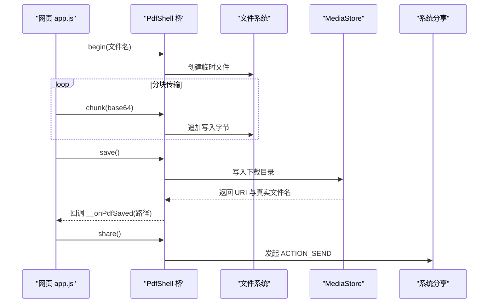
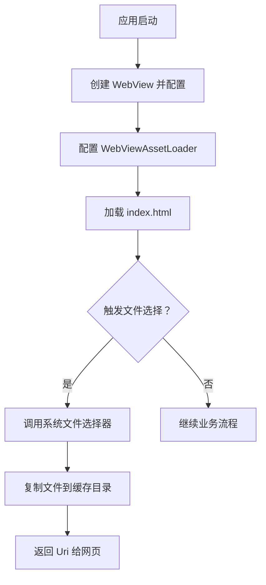
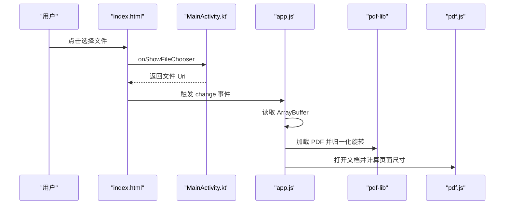
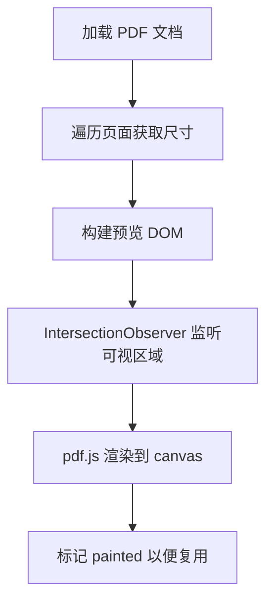
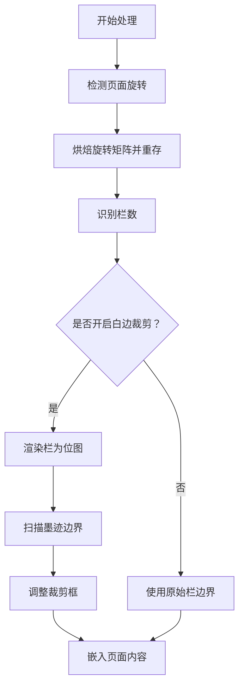
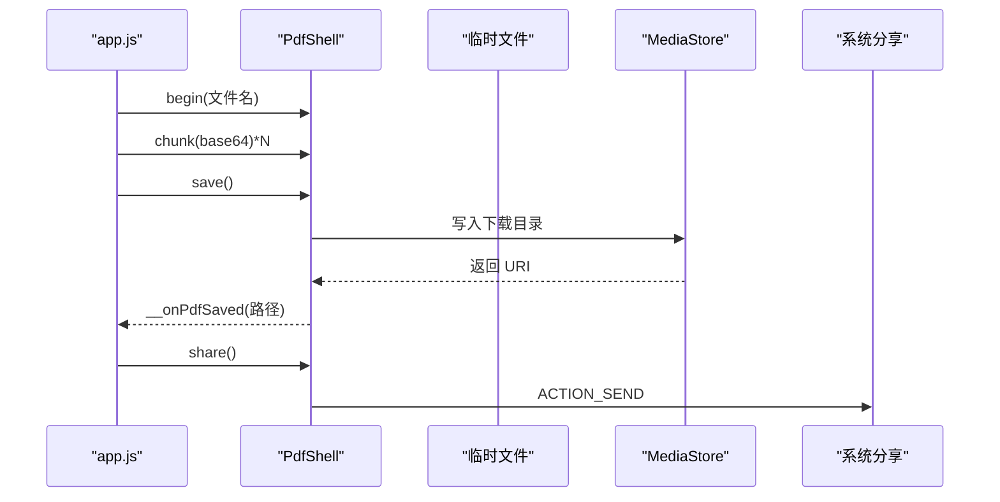
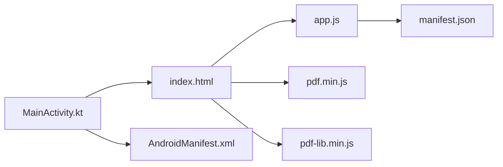

# 架构设计

<cite>
**本文引用的文件**   
- [README.md](file://README.md)
- [index.html](file://pdf-splitter/index.html)
- [app.js](file://pdf-splitter/app.js)
- [manifest.json](file://pdf-splitter/manifest.json)
- [MainActivity.kt](file://android/app/src/main/java/com/pdfsplitter/app/MainActivity.kt)
- [AndroidManifest.xml](file://android/app/src/main/AndroidManifest.xml)
</cite>

## 目录
1. [引言](#引言)
2. [项目结构](#项目结构)
3. [核心组件](#核心组件)
4. [系统架构总览](#系统架构总览)
5. [分层与职责](#分层与职责)
6. [JavaScript 与 Native 桥接机制](#javascript-与-native-桥接机制)
7. [WebView 容器工作原理](#webview-容器工作原理)
8. [数据流转与关键流程](#数据流转与关键流程)
9. [依赖关系分析](#依赖关系分析)
10. [技术选型权衡](#技术选型权衡)
11. [性能与安全考虑](#性能与安全考虑)
12. [故障排查指南](#故障排查指南)
13. [结论](#结论)

## 引言
本仓库实现了一个跨平台 PDF 处理工具：在浏览器或 Android WebView 中运行，把 A3/A4 拼版试卷按两栏或三栏切分为单页 A4 PDF。Web 层是完整可用的 PWA；Android 壳层只负责 WebView 无法直接完成的系统能力，如文件选择、结果写入下载目录、系统分享和定向打开阅读器。所有 PDF 解析、预览、裁剪、缩放等逻辑都在前端 JavaScript 中完成，不联网、不上传用户文件。

## 项目结构
项目采用“Web 本体 + Android 壳”的分层组织方式：
- `pdf-splitter/`：PWA 本体，包含入口页面、业务脚本、PDF 渲染库与 PDF 编辑库的本地化资源，以及 PWA 清单。
- `android/`：Android 壳工程，使用 Kotlin 编写，通过 WebView 加载 `pdf-splitter/` 中的内容，并暴露原生能力给网页。
- `pdftool_test/`：用于本地验证 PDF 旋转矩阵、白边检测等算法的测试脚本。
- 根目录说明文档与构建相关辅助脚本。

**图表来源**  
- [index.html:1-289](file://pdf-splitter/index.html#L1-L289)  
- [app.js:1-578](file://pdf-splitter/app.js#L1-L578)  
- [manifest.json:1-18](file://pdf-splitter/manifest.json#L1-L18)  
- [MainActivity.kt:1-311](file://android/app/src/main/java/com/pdfsplitter/app/MainActivity.kt#L1-L311)  
- [AndroidManifest.xml:1-45](file://android/app/src/main/AndroidManifest.xml#L1-L45)

**章节来源**  
- [README.md:13-22](file://README.md#L13-L22)  
- [index.html:1-289](file://pdf-splitter/index.html#L1-L289)  
- [manifest.json:1-18](file://pdf-splitter/manifest.json#L1-L18)

## 核心组件
- Web 入口与 UI：`index.html` 提供文件选择、分栏设置、预览、进度条、结果操作按钮等界面。
- Web 业务逻辑：`app.js` 负责 PDF 加载、旋转归一化、栏数识别、白边检测、分页裁剪、A4 缩放、预览渲染、结果生成与导出。
- PDF 库：`pdf.min.js`（pdf.js）用于解析与预览；`pdf-lib.min.js` 用于创建新 PDF、嵌入页面、裁剪与保存。
- Android 壳：`MainActivity.kt` 提供 WebView 容器、文件选择器桥接、结果分块传输、保存到下载目录、系统分享、查看文件定向。
- Android 配置：`AndroidManifest.xml` 声明应用入口、FileProvider、queries 包可见性。
- PWA 配置：`manifest.json` 定义应用名称、启动地址、显示模式、主题色与图标。

**章节来源**  
- [index.html:1-289](file://pdf-splitter/index.html#L1-L289)  
- [app.js:1-578](file://pdf-splitter/app.js#L1-L578)  
- [MainActivity.kt:1-311](file://android/app/src/main/java/com/pdfsplitter/app/MainActivity.kt#L1-L311)  
- [AndroidManifest.xml:1-45](file://android/app/src/main/AndroidManifest.xml#L1-L45)  
- [manifest.json:1-18](file://pdf-splitter/manifest.json#L1-L18)

## 系统架构总览
整体架构分为三层：
- Web PWA 层：纯前端，离线可用，负责用户交互、PDF 解析、预览、处理与结果输出。
- Android 壳层：轻量容器，补全 WebView 缺失的系统能力，并通过桥接口向 Web 层暴露原生方法。
- PDF 处理引擎：由 pdf.js 与 pdf-lib 组成，分别承担渲染预览与编辑输出的职责。

**图表来源**  
- [index.html:1-289](file://pdf-splitter/index.html#L1-L289)  
- [app.js:1-578](file://pdf-splitter/app.js#L1-L578)  
- [MainActivity.kt:1-311](file://android/app/src/main/java/com/pdfsplitter/app/MainActivity.kt#L1-L311)

## 分层与职责
- Web 层职责：
  - 文件选择与校验。
  - PDF 元数据读取与页面尺寸计算。
  - 旋转归一化，确保预览与输出坐标一致。
  - 自动或手动分栏，支持左右微调。
  - 可选白边裁剪，基于位图扫描有墨迹区域。
  - 将每栏等比放入 A4 页面，生成最终 PDF。
  - 预览懒加载与 IntersectionObserver 优化。
  - 结果下载、分享、查看文件。
- Android 壳层职责：
  - 提供 WebViewAssetLoader，避免 file:// 协议下 worker 加载失败。
  - 拦截 `<input type="file">`，调用系统文件选择器并保留文件名。
  - 通过 `window.PdfShell` 接收分块 base64 数据，写入临时文件。
  - 使用 MediaStore 写入「下载/试卷切分」，回传真实路径。
  - 使用 FileProvider 发起系统分享。
  - 根据白名单定向到 WPS、多看等阅读器打开文件。
  - 桥接 alert/confirm，提升用户体验。

**章节来源**  
- [app.js:1-578](file://pdf-splitter/app.js#L1-L578)  
- [MainActivity.kt:31-75](file://android/app/src/main/java/com/pdfsplitter/app/MainActivity.kt#L31-L75)  
- [MainActivity.kt:85-151](file://android/app/src/main/java/com/pdfsplitter/app/MainActivity.kt#L85-L151)  
- [MainActivity.kt:162-262](file://android/app/src/main/java/com/pdfsplitter/app/MainActivity.kt#L162-L262)

## JavaScript 与 Native 桥接机制
桥接通过 `window.PdfShell` 暴露给网页，原生侧在 MainActivity 中以 `@JavascriptInterface` 注册方法：
- `begin(name)`：初始化目标文件名与临时输出目录。
- `chunk(base64)`：追加写入分块数据，避免单次桥调用过大。
- `save()`：将临时文件写入下载目录，并回调页面显示真实路径。
- `share()`：通过 FileProvider 发起分享，不落盘到下载目录。
- `open()`：优先定向到白名单阅读器，否则使用系统选择器。
- `log(msg)`：调试日志。

**图表来源**  
- [app.js:512-552](file://pdf-splitter/app.js#L512-L552)  
- [MainActivity.kt:166-262](file://android/app/src/main/java/com/pdfsplitter/app/MainActivity.kt#L166-L262)

**章节来源**  
- [app.js:512-578](file://pdf-splitter/app.js#L512-L578)  
- [MainActivity.kt:162-262](file://android/app/src/main/java/com/pdfsplitter/app/MainActivity.kt#L162-L262)

## WebView 容器工作原理
MainActivity 作为 WebView 容器，主要工作包括：
- 启用 JavaScript、DOM Storage、缓存策略。
- 使用 WebViewAssetLoader 将 assets/www 下的静态资源以 HTTPS URL 提供，解决 pdf.js worker 在 file:// 下加载失败的问题。
- 拦截文件选择事件，调用系统 OpenDocument 活动，并将 Uri 转换为本地文件传给网页。
- 桥接 alert/confirm，让网页提示框正常显示。
- 监听返回键，支持 WebView 历史后退。

**图表来源**  
- [MainActivity.kt:85-151](file://android/app/src/main/java/com/pdfsplitter/app/MainActivity.kt#L85-L151)  
- [MainActivity.kt:56-83](file://android/app/src/main/java/com/pdfsplitter/app/MainActivity.kt#L56-L83)

**章节来源**  
- [MainActivity.kt:85-151](file://android/app/src/main/java/com/pdfsplitter/app/MainActivity.kt#L85-L151)

## 数据流转与关键流程
### 文件选择与加载
- 用户在界面点击选择文件，触发 `<input type="file">`。
- Android 壳层拦截该事件，调用系统文件选择器，获取 Uri。
- 壳层将 Uri 对应的文件复制到缓存目录，并返回 Uri 给网页。
- 网页读取 ArrayBuffer，用 pdf-lib 加载 PDF，进行旋转归一化。
- 同时用 pdf.js 打开文档，计算每页尺寸，准备预览。

**图表来源**  
- [app.js:195-263](file://pdf-splitter/app.js#L195-L263)  
- [MainActivity.kt:114-124](file://android/app/src/main/java/com/pdfsplitter/app/MainActivity.kt#L114-L124)

**章节来源**  
- [app.js:195-263](file://pdf-splitter/app.js#L195-L263)  
- [MainActivity.kt:114-124](file://android/app/src/main/java/com/pdfsplitter/app/MainActivity.kt#L114-L124)

### PDF 解析与预览
- pdf.js 负责解析 PDF 内容并渲染到 canvas。
- 预览采用懒加载与 IntersectionObserver，只在可视区域渲染，减少内存占用。
- 已渲染的 canvas 可被白边检测复用，避免重复栅格化。

**图表来源**  
- [app.js:243-329](file://pdf-splitter/app.js#L243-L329)

**章节来源**  
- [app.js:243-329](file://pdf-splitter/app.js#L243-L329)

### 处理逻辑：旋转归一化与白边裁剪
- 旋转归一化：检测页面 `/Rotate`，使用变换矩阵将内容顺时针旋转到显示方向，并移除 `/Rotate`，保证预览与输出坐标系一致。
- 白边裁剪：将每栏渲染为位图，扫描像素找出有墨迹的最小矩形，作为裁剪框；未检测到墨迹则退回整栏。

**图表来源**  
- [app.js:57-103](file://pdf-splitter/app.js#L57-L103)  
- [app.js:105-193](file://pdf-splitter/app.js#L105-L193)  
- [app.js:412-480](file://pdf-splitter/app.js#L412-L480)

**章节来源**  
- [app.js:57-103](file://pdf-splitter/app.js#L57-L103)  
- [app.js:105-193](file://pdf-splitter/app.js#L105-L193)  
- [app.js:412-480](file://pdf-splitter/app.js#L412-L480)

### 结果输出：保存到本地与分享
- 网页生成 Blob URL，若存在 PdfShell 桥则走原生通道。
- 原生侧分块接收 base64，写入临时文件。
- save() 通过 MediaStore 写入「下载/试卷切分」，回调页面显示路径。
- share() 通过 FileProvider 发起系统分享，不落盘。

**图表来源**  
- [app.js:512-552](file://pdf-splitter/app.js#L512-L552)  
- [MainActivity.kt:166-292](file://android/app/src/main/java/com/pdfsplitter/app/MainActivity.kt#L166-L292)

**章节来源**  
- [app.js:512-552](file://pdf-splitter/app.js#L512-L552)  
- [MainActivity.kt:166-292](file://android/app/src/main/java/com/pdfsplitter/app/MainActivity.kt#L166-L292)

## 依赖关系分析
- Web 层依赖：
  - `index.html` 依赖 `app.js`、`pdf.min.js`、`pdf-lib.min.js`。
  - `app.js` 依赖 pdf.js 与 pdf-lib，负责业务逻辑。
  - `manifest.json` 为 PWA 提供安装与显示配置。
- Android 壳层依赖：
  - `MainActivity.kt` 依赖 WebView、WebViewAssetLoader、FileProvider、MediaStore、Intent。
  - `AndroidManifest.xml` 声明 Activity、FileProvider、queries。

**图表来源**  
- [index.html:284-286](file://pdf-splitter/index.html#L284-L286)  
- [app.js:1-10](file://pdf-splitter/app.js#L1-L10)  
- [manifest.json:1-18](file://pdf-splitter/manifest.json#L1-L18)  
- [MainActivity.kt:1-311](file://android/app/src/main/java/com/pdfsplitter/app/MainActivity.kt#L1-L311)  
- [AndroidManifest.xml:1-45](file://android/app/src/main/AndroidManifest.xml#L1-L45)

**章节来源**  
- [index.html:284-286](file://pdf-splitter/index.html#L284-L286)  
- [app.js:1-10](file://pdf-splitter/app.js#L1-L10)  
- [manifest.json:1-18](file://pdf-splitter/manifest.json#L1-L18)  
- [MainActivity.kt:1-311](file://android/app/src/main/java/com/pdfsplitter/app/MainActivity.kt#L1-L311)  
- [AndroidManifest.xml:1-45](file://android/app/src/main/AndroidManifest.xml#L1-L45)

## 技术选型权衡
- 为什么选择 pdf-lib：
  - pdf-lib 适合在浏览器环境中对 PDF 进行编辑、裁剪、嵌入页面与保存，且无服务端依赖。
  - 与 pdf.js 分工明确：pdf.js 专注解析与预览，pdf-lib 专注编辑与输出。
  - 相比其他 PDF 库，pdf-lib 在浏览器端更稳定，API 更适合客户端处理。
- 为什么选择 WebView 作为容器：
  - 优点：复用 Web 生态，开发成本低；可离线使用；便于调试（Chrome inspect）。
  - 缺点：需要额外处理文件选择、存储、分享等系统能力；大文件内存峰值较高。
  - 通过 WebViewAssetLoader 解决 worker 加载问题，通过桥接弥补系统能力不足。

**章节来源**  
- [README.md:22-23](file://README.md#L22-L23)  
- [README.md:67-75](file://README.md#L67-L75)  
- [app.js:1-10](file://pdf-splitter/app.js#L1-L10)  
- [MainActivity.kt:103-112](file://android/app/src/main/java/com/pdfsplitter/app/MainActivity.kt#L103-L112)

## 性能与安全考虑
- 性能：
  - 预览懒加载与 IntersectionObserver 减少不必要的渲染。
  - 已渲染 canvas 复用，避免重复栅格化。
  - 分块传输大文件，避免桥调用过大导致卡顿。
  - 大文件一次性嵌入可能导致内存峰值偏高，不能中途取消。
- 安全：
  - 全部处理在本地完成，不联网、不上传。
  - Android 壳层不声明网络与敏感权限，仅使用系统必要能力。
  - WebViewAssetLoader 限制资源访问范围，避免远程页面注入风险。
  - 文件名清洗与白名单阅读器定向，降低恶意文件与误用风险。

**章节来源**  
- [README.md:4-5](file://README.md#L4-L5)  
- [README.md:83-90](file://README.md#L83-L90)  
- [app.js:288-304](file://pdf-splitter/app.js#L288-L304)  
- [MainActivity.kt:93-101](file://android/app/src/main/java/com/pdfsplitter/app/MainActivity.kt#L93-L101)  
- [MainActivity.kt:294-299](file://android/app/src/main/java/com/pdfsplitter/app/MainActivity.kt#L294-L299)

## 故障排查指南
- 无法打开加密 PDF：
  - 现象：提示无法打开该 PDF，建议先去除密码。
  - 原因：pdf-lib 忽略加密时可能仍失败，需提前解密。
- 预览空白或渲染失败：
  - 检查 pdf.js worker 是否正确加载，WebViewAssetLoader 是否生效。
  - 确认页面尺寸与 viewport 计算无误。
- 分享失败：
  - 检查 FileProvider 配置与 MIME 类型。
  - 确认系统中有可接收 PDF 的应用。
- 查看文件失败：
  - 检查 queries 配置是否允许查询 PDF 阅读器。
  - 白名单未命中时会退回系统选择器。

**章节来源**  
- [app.js:234-238](file://pdf-splitter/app.js#L234-L238)  
- [MainActivity.kt:282-292](file://android/app/src/main/java/com/pdfsplitter/app/MainActivity.kt#L282-L292)  
- [AndroidManifest.xml:4-12](file://android/app/src/main/AndroidManifest.xml#L4-L12)

## 结论
本项目采用 Web PWA + Android 壳层的架构，将 PDF 处理逻辑完全放在前端，利用 pdf.js 与 pdf-lib 实现解析、预览、裁剪与输出。Android 壳层仅补全系统能力，通过桥接机制与 Web 层协作。该设计具备跨平台、离线可用、隐私安全等优势，同时在性能上通过懒加载、位图复用与分块传输进行优化。技术选型上，pdf-lib 与 WebView 的组合在浏览器与移动端之间提供了良好的平衡，既降低了开发成本，又满足了功能需求。