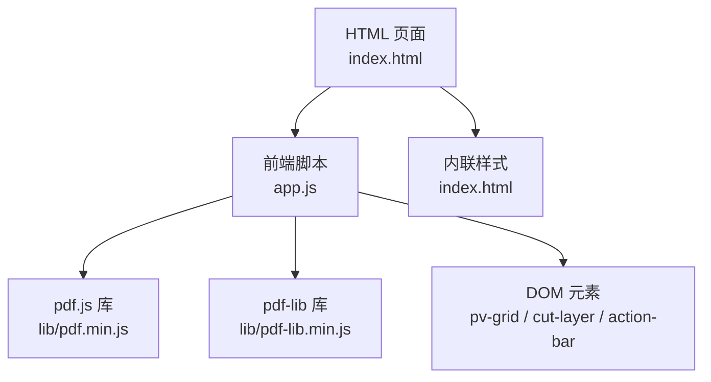
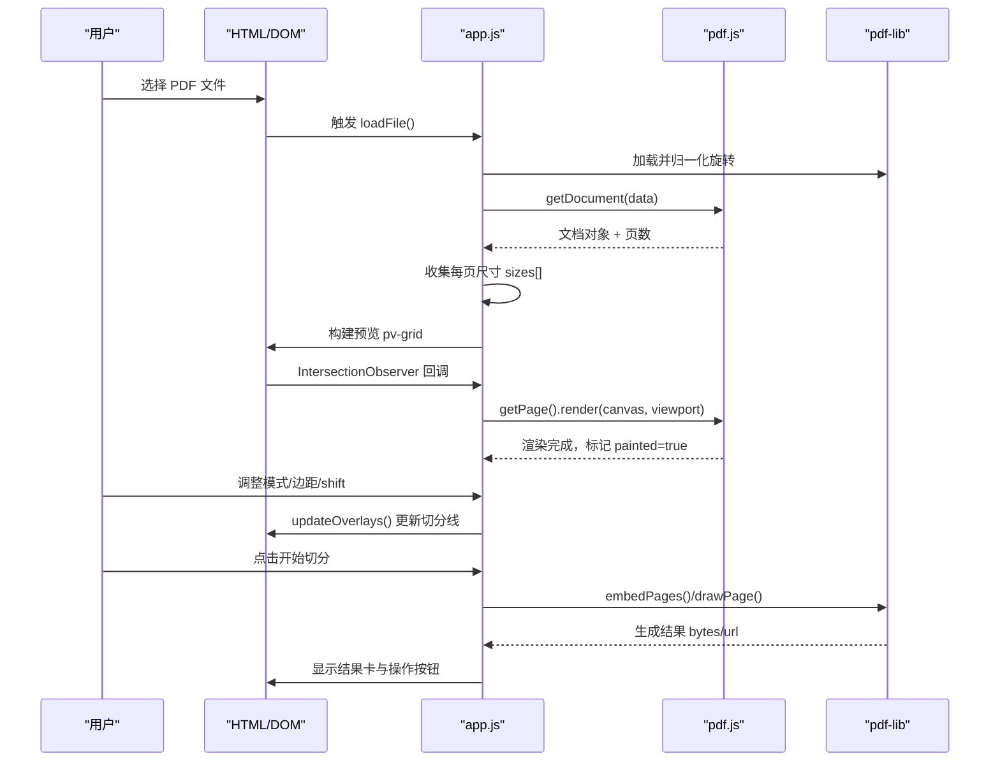
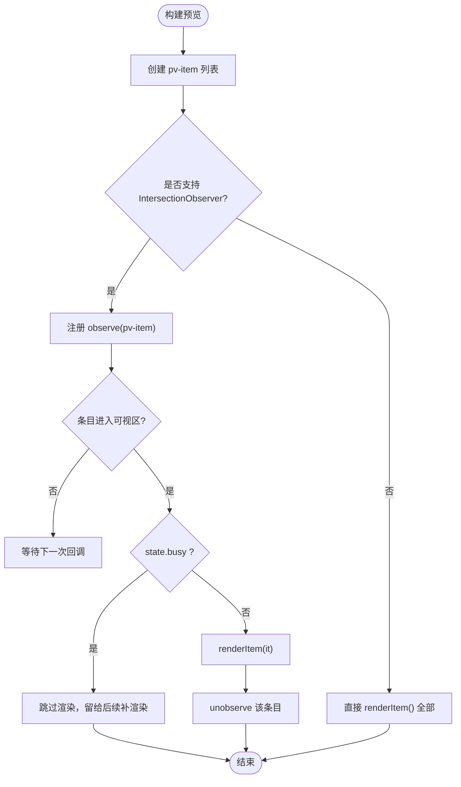
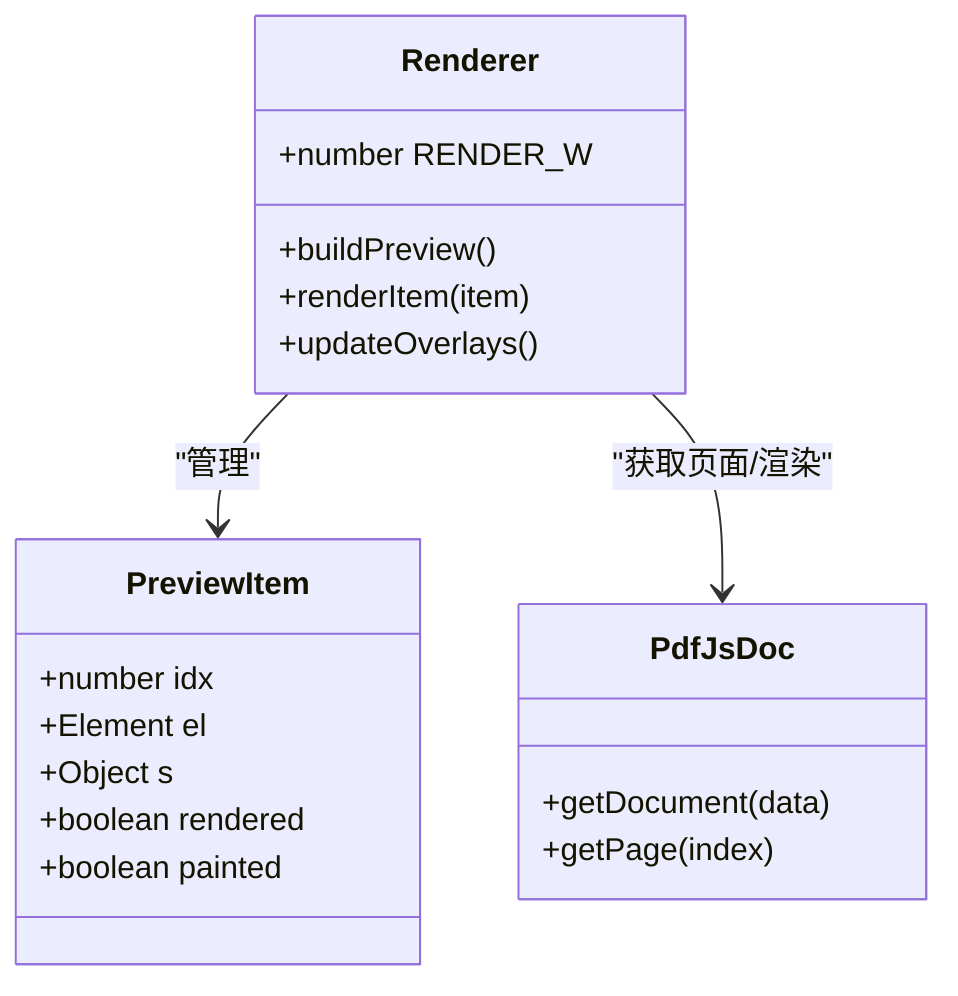
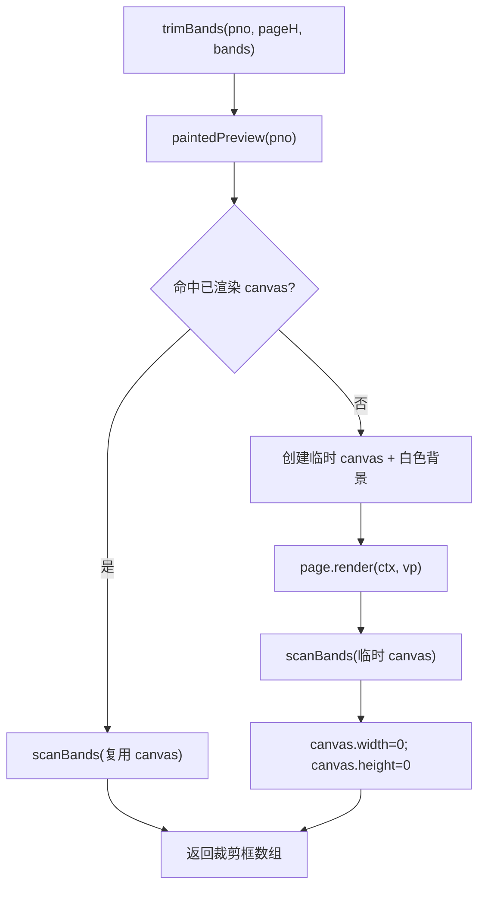
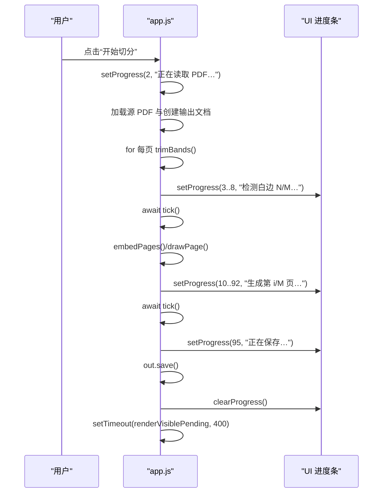
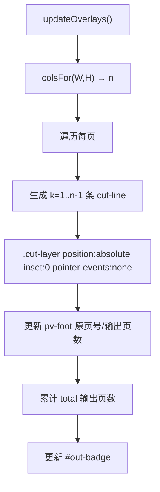
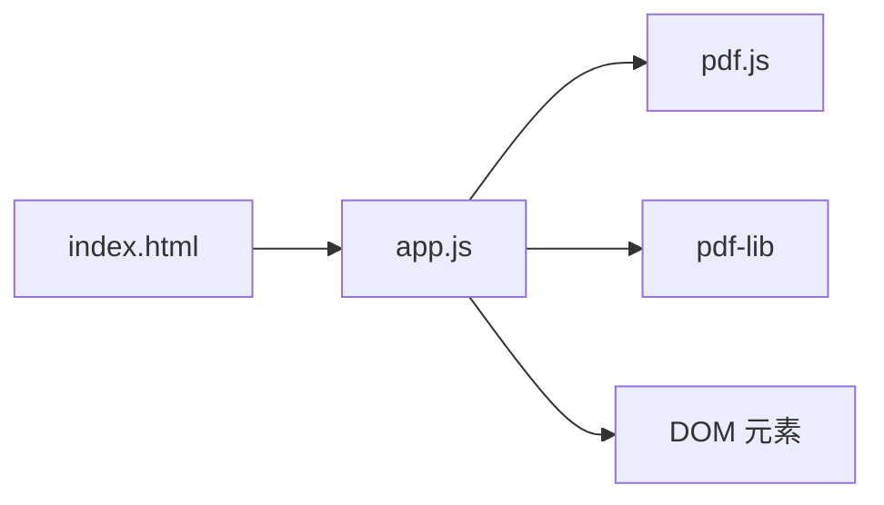

# 实时预览系统

<cite>
**本文引用的文件**   
- [app.js](file://pdf-splitter/app.js)
- [index.html](file://pdf-splitter/index.html)
- [README.md](file://README.md)
</cite>

## 目录
1. [引言](#引言)
2. [项目结构](#项目结构)
3. [核心组件](#核心组件)
4. [架构总览](#架构总览)
5. [详细组件分析](#详细组件分析)
6. [依赖关系分析](#依赖关系分析)
7. [性能考量](#性能考量)
8. [故障排查指南](#故障排查指南)
9. [结论](#结论)

## 引言
本文件面向“试卷切分助手”的实时预览子系统，聚焦基于 pdf.js 的渲染与交互实现。文档从系统架构、数据流、处理逻辑、错误处理与性能优化等维度展开，重点解释：
- 懒加载机制（IntersectionObserver）
- 视口计算与 Canvas 渲染优化
- 预览位图复用策略（painted 状态、缓存、内存释放）
- 进度同步机制（渲染队列、异步调度、用户交互响应）
- 切分线叠加显示（动态 DOM、CSS 定位、实时更新）
- 大文件、移动端与内存管理的最佳实践建议

## 项目结构
Web 端由三个关键部分组成：
- HTML 页面：定义上传区、配置区、预览区、结果区与底部操作栏，并注入 pdf.js 与 pdf-lib。
- 前端脚本：承载 PDF 加载、旋转校正、预览构建、切分线与标签更新、切分流程与下载/分享。
- 样式表：内嵌于 HTML，负责卡片、滑块、预览网格、切分线、进度条与固定操作栏布局。

图表来源
- [index.html:284-286](file://pdf-splitter/index.html#L284-L286)
- [app.js:6-10](file://pdf-splitter/app.js#L6-L10)

章节来源
- [index.html:1-289](file://pdf-splitter/index.html#L1-L289)
- [app.js:1-578](file://pdf-splitter/app.js#L1-L578)

## 核心组件
- 文件加载与文档初始化：读取 ArrayBuffer，使用 pdf-lib 加载并进行旋转归一化；随后用 pdf.js 打开文档并收集每页尺寸。
- 预览构建与懒加载：为每页创建 pv-item 容器、canvas 与切分层；通过 IntersectionObserver 在可见时触发渲染。
- 视口与缩放：以固定逻辑宽度 RENDER_W 计算 viewport scale，确保预览一致性与可复用性。
- 切分线叠加：根据列数与 shift 微调动态生成 cut-line 与 cut-lbl，仅更新 DOM 不重绘 canvas。
- 白边裁剪与位图复用：trimBands 优先复用已渲染 canvas 的像素数据，避免重复栅格化；扫描墨迹区域得到裁剪框。
- 切分流程：按栏嵌入页面内容到 A4 页面，按比例缩放并输出 PDF；过程中更新进度条与按钮状态。
- 结果导出：支持下载、系统分享或原生壳通道保存。

章节来源
- [app.js:13-28](file://pdf-splitter/app.js#L13-L28)
- [app.js:204-263](file://pdf-splitter/app.js#L204-L263)
- [app.js:265-329](file://pdf-splitter/app.js#L265-L329)
- [app.js:331-361](file://pdf-splitter/app.js#L331-L361)
- [app.js:412-508](file://pdf-splitter/app.js#L412-L508)

## 架构总览
整体数据与控制流如下：

图表来源
- [app.js:204-263](file://pdf-splitter/app.js#L204-L263)
- [app.js:265-329](file://pdf-splitter/app.js#L265-L329)
- [app.js:412-508](file://pdf-splitter/app.js#L412-L508)

## 详细组件分析

### 懒加载与可视区域检测（IntersectionObserver）
- 构建预览时，为每个 pv-item 注册 IntersectionObserver，rootMargin 设为 200px，提前预取即将进入视口的页面。
- 当 state.busy 为真（切分进行中），观察者让路给切分任务，避免抢占渲染队列；未观察到的项会在处理结束后通过 renderVisiblePending() 补渲染。
- 不支持 IntersectionObserver 的环境回退为立即渲染所有项。

图表来源
- [app.js:268-305](file://pdf-splitter/app.js#L268-L305)
- [app.js:307-314](file://pdf-splitter/app.js#L307-L314)

章节来源
- [app.js:268-314](file://pdf-splitter/app.js#L268-L314)

### 视口计算与 Canvas 渲染优化
- 固定逻辑宽度 RENDER_W = 820，用于统一预览缩放基准。
- 对每页调用 page.getViewport({ scale })，设置 canvas.width/height 后执行 render。
- 渲染完成后将 it.painted 置为 true，表示位图可用，供白边裁剪复用。
- 若未命中已渲染的 canvas，则按需创建临时 canvas 进行白边检测，并在完成后及时清空宽高释放内存。

图表来源
- [app.js:265-329](file://pdf-splitter/app.js#L265-L329)

章节来源
- [app.js:265-329](file://pdf-splitter/app.js#L265-L329)

### 预览位图复用策略（painted 状态、缓存、内存释放）
- 复用条件：previewItems 长度与当前页数一致，且目标项存在、it.painted 为真、canvas 尺寸足够大。
- 复用路径：trimBands 中先尝试 paintedPreview，命中则直接扫描像素数据，避免再次调用 pdf.js 渲染。
- 未命中路径：创建临时 canvas，使用 willReadFrequently 上下文，填充白色背景后渲染，扫描后立刻将 canvas.width/height 置零释放内存。
- 失败路径：捕获异常并返回 bands 占位 null，保证流程继续。

图表来源
- [app.js:153-193](file://pdf-splitter/app.js#L153-L193)

章节来源
- [app.js:153-193](file://pdf-splitter/app.js#L153-L193)

### 进度同步机制（渲染队列、异步调度、用户交互响应）
- 切分开始时设置 state.busy=true，禁用按钮并显示进度条；处理完成后恢复状态。
- 进度分段更新：读取 PDF、检测白边、嵌入页面、绘制 A4 页、保存等阶段分别更新百分比与提示文本。
- 长任务中插入 tick() 让出主线程，避免阻塞 UI 与滚动事件。
- 处理结束后延迟调用 renderVisiblePending()，补渲染被让路的预览项。

图表来源
- [app.js:402-508](file://pdf-splitter/app.js#L402-L508)

章节来源
- [app.js:402-508](file://pdf-splitter/app.js#L402-L508)

### 切分线叠加显示（动态 DOM、CSS 定位、实时更新）
- 根据 colsFor(W,H) 计算列数，结合 shift 微调偏移量，动态生成 .cut-line 与 .cut-lbl。
- 切分层 .cut-layer 使用绝对定位覆盖整个 pv-wrap，pointer-events:none 不影响交互。
- 更新函数只修改 DOM 与样式，不重新渲染 canvas，保证高频交互下的流畅度。
- 同时统计输出页数并更新 badge。

图表来源
- [app.js:331-361](file://pdf-splitter/app.js#L331-L361)

章节来源
- [app.js:331-361](file://pdf-splitter/app.js#L331-L361)

### 旋转校正与坐标一致性
- pdf.js 的 viewport 会应用 /Rotate，而 pdf-lib 的 getSize/embedPage 忽略它，因此需先归一化旋转：将 Rotate 矩阵烘焙进内容，必要时交换宽高，去除 /Rotate。
- 无旋转页面直接复用原始字节，避免不必要的重存。

章节来源
- [app.js:57-103](file://pdf-splitter/app.js#L57-L103)

## 依赖关系分析
- 外部库：
  - pdf.js：解析与渲染 PDF，提供 getDocument/getPage/render。
  - pdf-lib：页面嵌入、裁剪与 A4 输出。
- 内部模块：
  - app.js 作为唯一业务入口，协调 UI、PDF 库与状态。
  - index.html 提供 DOM 结构与样式，并引入两个库。

图表来源
- [index.html:284-286](file://pdf-splitter/index.html#L284-L286)
- [app.js:6-10](file://pdf-splitter/app.js#L6-L10)

章节来源
- [index.html:284-286](file://pdf-splitter/index.html#L284-L286)
- [app.js:6-10](file://pdf-splitter/app.js#L6-L10)

## 性能考量
- 大文件处理
  - 一次性嵌入所有页面可能导致内存峰值偏高；建议在超大文件场景下考虑分页写入或流式处理（当前实现为全量嵌入）。
  - 白边检测逐页栅格化，未预览到的页仍需一次 pdf.js 渲染，耗时约 1s/页。
- 移动端适配
  - 使用 IntersectionObserver 预取与 unobserve 减少常驻监听开销。
  - 固定逻辑宽度 RENDER_W 控制预览缩放，避免过高像素导致卡顿。
  - 底部固定操作栏提升操作可达性，适合拇指操作。
- 内存管理最佳实践
  - 切换文件时销毁上一份 pdf.js 文档，释放 worker 与缓存。
  - 临时 canvas 使用后立刻清空宽高释放位图。
  - 结果 URL 使用 ObjectURL 并在重置时 revoke。
  - 避免在频繁交互路径中重建 DOM 或重绘 canvas。

章节来源
- [README.md:77-90](file://README.md#L77-L90)
- [app.js:243-263](file://pdf-splitter/app.js#L243-L263)
- [app.js:175-193](file://pdf-splitter/app.js#L175-L193)
- [app.js:554-564](file://pdf-splitter/app.js#L554-L564)

## 故障排查指南
- 无法打开加密 PDF
  - 现象：提示无法打开 PDF，可能是加密文件。
  - 处理：先去除密码再处理。
- 切分失败
  - 现象：弹出“处理失败”，控制台有错误日志。
  - 处理：检查文件大小、浏览器内存、pdf.js 版本与 worker 加载情况。
- 预览未渲染或卡顿
  - 现象：滚动到某页无预览或明显卡顿。
  - 处理：确认 IntersectionObserver 是否生效；检查 state.busy 是否长时间为真；查看是否有大量未释放的临时 canvas。
- 切分线位置不正确
  - 现象：切分线与预期不符。
  - 处理：调整“切分线微调”百分比；确认自动识别列数是否正确；必要时手动选择 2 栏或 3 栏。

章节来源
- [app.js:234-238](file://pdf-splitter/app.js#L234-L238)
- [app.js:497-507](file://pdf-splitter/app.js#L497-L507)
- [app.js:288-305](file://pdf-splitter/app.js#L288-L305)
- [app.js:363-399](file://pdf-splitter/app.js#L363-L399)

## 结论
该实时预览系统通过 pdf.js 与 pdf-lib 协同工作，实现了高效的 PDF 预览与切分输出。其核心优势包括：
- 基于 IntersectionObserver 的懒加载与可视区域检测，显著降低初始渲染成本。
- 统一的视口缩放与 Canvas 渲染优化，配合 painted 状态实现位图复用，避免重复栅格化。
- 清晰的进度同步与异步调度机制，保障用户交互响应与长任务的可观测性。
- 轻量级的切分线叠加方案，通过动态 DOM 与 CSS 定位实现实时更新而不影响渲染性能。
针对大文件与移动端的进一步优化方向包括分页写入、更细粒度的内存回收与自适应缩放策略。