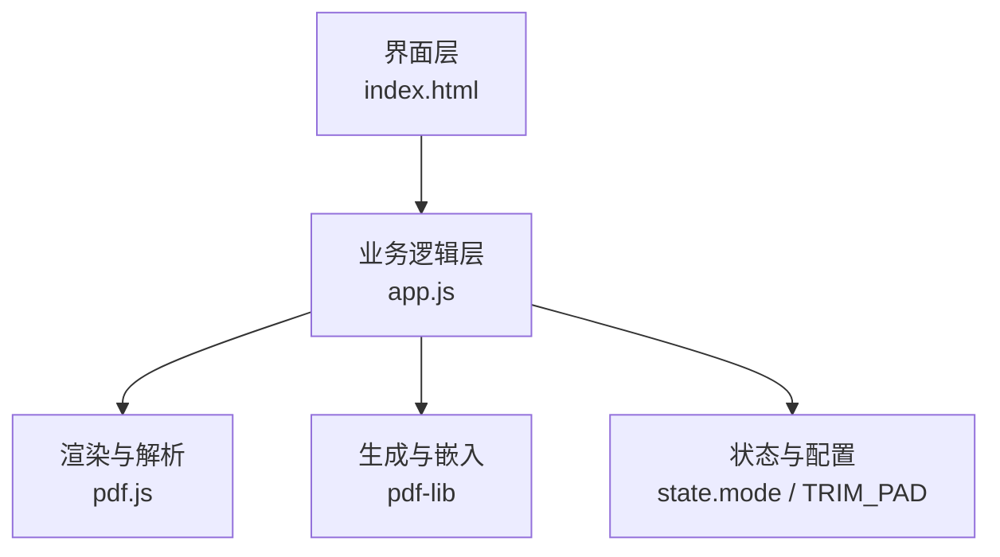
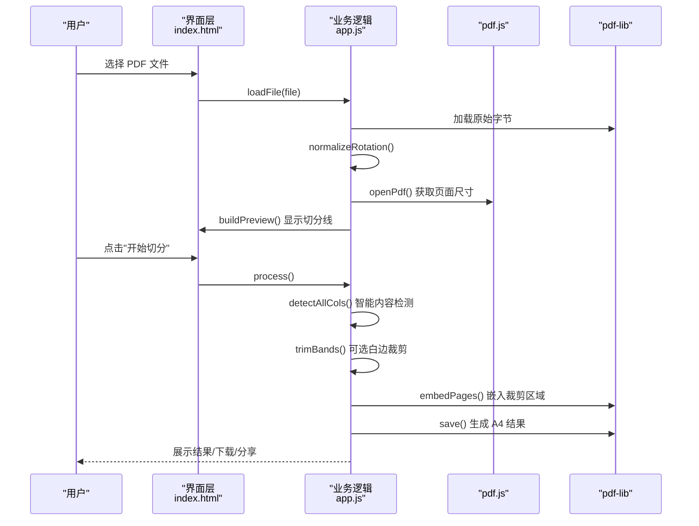
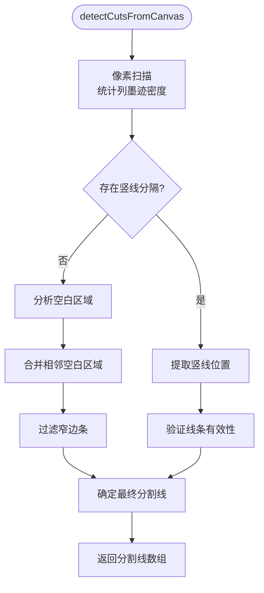
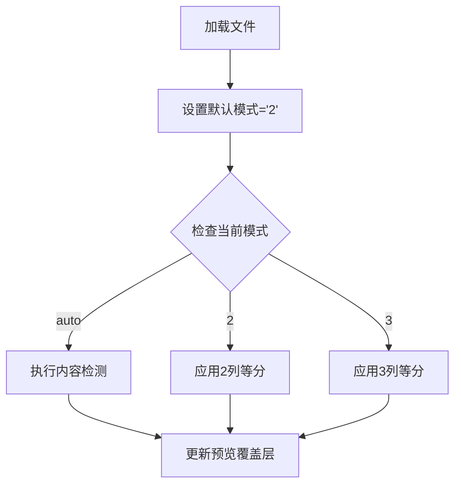
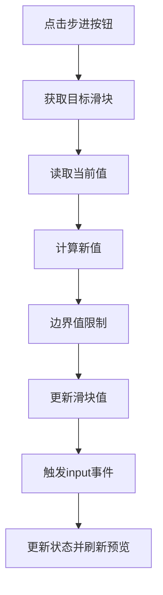
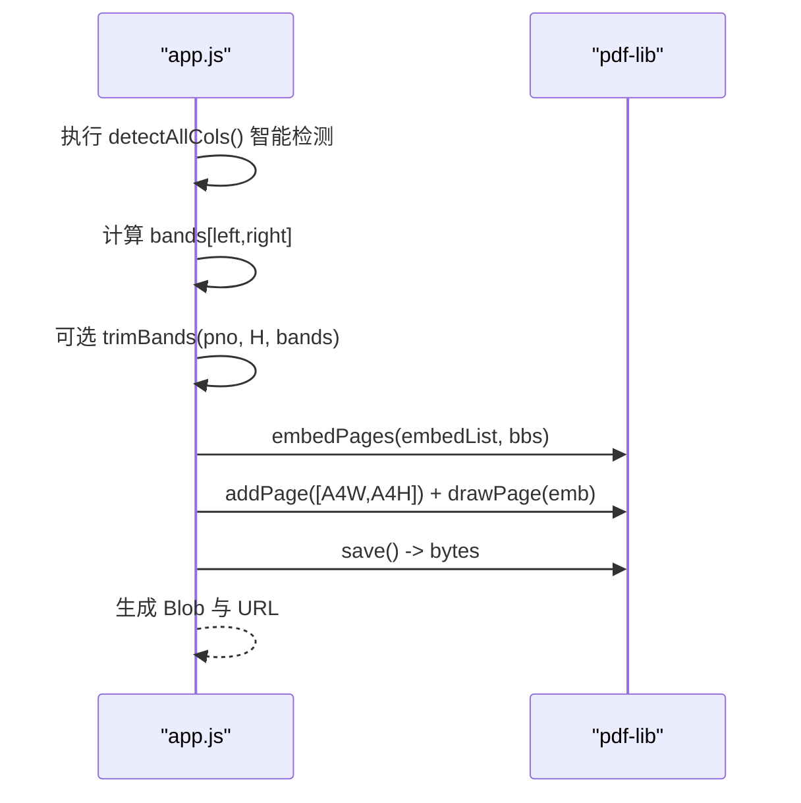
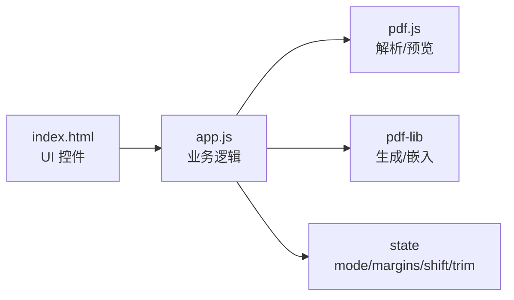

# 智能栏数识别

<cite>
**本文引用的文件**   
- [README.md](file://README.md)
- [app.js](file://pdf-splitter/app.js)
- [index.html](file://pdf-splitter/index.html)
</cite>

## 更新摘要
**变更内容**   
- 新增基于内容的智能栏数检测算法，替代原有的宽高比判断方法
- 增强UI控件，添加步进按钮支持精确参数调整
- 修改默认行为为2列模式，提升用户体验
- 重新组织列选择布局，优化界面交互

## 目录
1. [引言](#引言)
2. [项目结构](#项目结构)
3. [核心组件](#核心组件)
4. [架构总览](#架构总览)
5. [详细组件分析](#详细组件分析)
6. [依赖关系分析](#依赖关系分析)
7. [性能与优化](#性能与优化)
8. [故障排查](#故障排查)
9. [结论](#结论)

## 引言
本文件围绕"智能栏数识别"功能，系统化梳理自动检测算法、旋转校正、白边裁剪等关键实现。该能力用于把 A3/A4 拼版试卷（一页两栏或三栏）切分为"一页一题"的标准 A4 PDF，所有处理在手机/电脑本地完成，不联网、不上传。**最新更新**引入了基于内容的智能检测算法，能够更准确地识别页面栏数，同时增强了用户界面的交互体验。

## 项目结构
- `pdf-splitter/`：Web 本体（PWA），包含入口 HTML 与前端逻辑 JS，以及本地化的 pdf.js、pdf-lib 库。
- `android/`：Android 壳工程（Kotlin + WebView），负责文件选择、结果保存与分享等原生能力。
- `pdftool_test/`：本地验证脚本与测试数据。
- 根目录 `README.md`：使用说明、已知限制与关键点说明。

**图表来源**
- [index.html:194-220](file://pdf-splitter/index.html#L194-L220)
- [app.js:1-55](file://pdf-splitter/app.js#L1-L55)

**章节来源**
- [README.md:13-22](file://README.md#L13-L22)

## 核心组件
- **智能栏数检测**：采用基于内容的检测算法，通过分析页面像素分布识别分割线，优先查找竖线分隔符，其次分析空白区域，最后处理窄边条合并策略。
- **模式切换**：支持"智能识别""左右 2 栏""左右 3 栏"三种模式，默认设置为2列模式以提升用户体验。
- **旋转校正**：读取 PDF 页面的 `/Rotate`，按 0/90/180/270 度矩阵变换内容，归一化坐标系，避免预览与裁剪坐标不一致。
- **白边裁剪**：将每栏渲染为位图，扫描非白像素得到最小矩形，再以固定内边距收缩，得到最终裁剪框。
- **增强UI控件**：提供步进按钮支持精确参数调整，改进的布局设计提升操作便捷性。

**章节来源**
- [app.js:45-55](file://pdf-splitter/app.js#L45-L55)
- [app.js:57-103](file://pdf-splitter/app.js#L57-L103)
- [app.js:105-193](file://pdf-splitter/app.js#L105-L193)
- [index.html:194-220](file://pdf-splitter/index.html#L194-L220)

## 架构总览
整体流程：加载 PDF → 旋转归一化 → 打开文档并收集尺寸 → 构建预览 → 根据模式计算栏数与分割线 → 可选白边裁剪 → 嵌入到 A4 页面 → 保存/下载/分享。

**图表来源**
- [app.js:204-239](file://pdf-splitter/app.js#L204-L239)
- [app.js:412-508](file://pdf-splitter/app.js#L412-L508)

## 详细组件分析

### 基于内容的智能栏数检测算法

**更新** 新增了基于内容的智能检测算法，替代了原有的简单宽高比判断方法。

#### 核心检测逻辑
- **像素分析**：遍历页面像素数据，统计每列的墨迹密度
- **竖线检测**：优先寻找纵向墨迹占比高且宽度较窄的分隔线
- **空白区域分析**：当没有明显竖线时，分析空白沟槽来识别栏边界
- **边缘处理**：对过窄的边缘区域进行合并处理，避免误判

**图表来源**
- [app.js:82-119](file://pdf-splitter/app.js#L82-L119)

#### 算法实现细节
1. **竖线检测阶段**：
   - 设置阈值 `lineT = Math.round(h * 0.45)` 判断纵向墨迹密度
   - 使用 `groupRuns` 函数识别连续的墨迹列
   - 验证线条宽度不超过页面宽度的3%，且位置在合理范围内

2. **空白区域分析阶段**：
   - 降低墨迹阈值至 `Math.max(2, Math.round(h * 0.012))`
   - 合并间距小于 `minGap` 的空白区域
   - 过滤掉宽度小于页面6%的区域

3. **边缘处理策略**：
   - 如果首尾边缘区域宽度小于总宽度的16%，则移除相应的分割线
   - 最多保留2个分割点（即3栏）

**章节来源**
- [app.js:82-119](file://pdf-splitter/app.js#L82-L119)

### 模式切换与默认行为

**更新** 默认模式已更改为2列模式，提供更好的开箱即用体验。

#### 模式配置
- **默认模式**：`mode: '2'` - 左右2栏模式
- **智能模式**：`mode: 'auto'` - 基于内容的智能检测
- **3列模式**：`mode: '3'` - 左中右3栏模式

#### 模式切换机制
- 新文件加载时自动设置为2列模式
- 智能模式下调用 `detectAllCols()` 进行逐页内容分析
- 固定模式下使用 `applyEqualCuts(n)` 创建等分布局

**图表来源**
- [app.js:355](file://pdf-splitter/app.js#L355)
- [app.js:546-560](file://pdf-splitter/app.js#L546-L560)

**章节来源**
- [app.js:21](file://pdf-splitter/app.js#L21)
- [app.js:355](file://pdf-splitter/app.js#L355)
- [app.js:546-560](file://pdf-splitter/app.js#L546-L560)

### 增强的UI控件系统

**更新** 新增了步进按钮功能，提供更精确的参数调整体验。

#### 步进按钮实现
- **目标控制**：通过 `data-target` 属性关联对应的滑块控件
- **步进方向**：`data-step` 属性定义增减方向（-1或1）
- **值同步**：点击后触发滑块的input事件，保持状态同步

#### 支持的参数调整
- **左右边距**：0-20mm范围，步进单位1mm
- **上下边距**：0-40mm范围，步进单位1mm  
- **切分线微调**：-15%到15%范围，步进单位1%

**图表来源**
- [index.html:217-234](file://pdf-splitter/index.html#L217-L234)
- [app.js:578-593](file://pdf-splitter/app.js#L578-L593)

**章节来源**
- [index.html:217-234](file://pdf-splitter/index.html#L217-L234)
- [app.js:578-593](file://pdf-splitter/app.js#L578-L593)

### 旋转校正算法
- 目标：统一 pdf.js 与 pdf-lib 的坐标系，避免预览与裁剪使用两套坐标导致方向错误。
- 步骤：
  - 读取页面 `/Rotate` 属性，优先从 page.node 获取，其次尝试父节点。
  - 规范化角度为 0/90/180/270，其他值视为 0。
  - 对每个页面应用对应矩阵变换，将内容顺时针旋转到显示方向。
  - 90°/270° 时交换宽高，确保新页面尺寸正确。
  - 若无任何页面带旋转，直接复用原字节，避免多余重存。

**图表来源**
- [app.js:61-103](file://pdf-splitter/app.js#L61-L103)

**章节来源**
- [app.js:57-103](file://pdf-splitter/app.js#L57-L103)
- [README.md:77-81](file://README.md#L77-L81)

### 白边裁剪检测机制
- 像素扫描算法 scanInk：
  - 输入：ImageData 数据、画布宽高 w/h、缩放 scale、偏移 ox。
  - 遍历像素，判定非白像素（任一 RGB < 240）。
  - 维护 minX/minY/maxX/maxY，记录有墨迹的最小矩形。
  - 若整幅图像无墨迹，返回 null。
  - 将像素坐标换算为 PDF 点坐标，并以 TRIM_PAD 收缩边界。
- 列带扫描 scanBands：
  - 对每个 band 提取对应像素区域，调用 scanInk。
  - 将返回的 box 与 band 范围求交，转换 y 轴方向。
  - 过滤掉过小区域（宽/高 ≤ 8），防止裁空。
- 策略与容错：
  - 检测不到墨迹的栏返回 null，调用方保留原始整栏。
  - 已预览过的页直接复用位图，避免重复栅格化。
  - 未预览到的页按需渲染一次，渲染失败时回退为全栏。

**图表来源**
- [app.js:109-132](file://pdf-splitter/app.js#L109-L132)

**章节来源**
- [app.js:105-193](file://pdf-splitter/app.js#L105-L193)

### 切分与输出流程
- 计算栏数与分割线：
  - 对每页调用 `detectAllCols()` 进行智能内容检测。
  - 计算列宽 cw = W / n，并根据 shift 微调起始位置。
- 白边裁剪（可选）：
  - 若开启 trim，则调用 trimBands 对每栏收紧裁剪框。
- 嵌入与缩放：
  - 使用 pdf-lib 的 embedPages 将裁剪区域嵌入到新文档。
  - 以 A4 页面为目标，按可用区域等比缩放，居中绘制。
- 进度与反馈：
  - 处理过程中更新进度条文本与百分比。
  - 完成后滚动到底部，便于"保存到本地"。

**图表来源**
- [app.js:412-508](file://pdf-splitter/app.js#L412-L508)

**章节来源**
- [app.js:412-508](file://pdf-splitter/app.js#L412-L508)

## 依赖关系分析
- 外部库：
  - pdf.js：解析 PDF、渲染预览、获取 viewport 与尺寸。
  - pdf-lib：加载/创建 PDF、嵌入页面、保存输出。
- 内部模块：
  - 状态管理：state.mode、marginX/Y、shift、trim 等参数贯穿预览与切分。
  - 工具函数：fmtSize、tick、ab2bytes 等辅助处理。
- 耦合与解耦：
  - 旋转校正独立于预览与裁剪，仅在加载阶段执行一次。
  - 白边裁剪可开关，不影响基础切分流程。
  - 预览位图复用降低重复渲染开销。

**图表来源**
- [index.html:194-220](file://pdf-splitter/index.html#L194-L220)
- [app.js:1-55](file://pdf-splitter/app.js#L1-L55)

**章节来源**
- [app.js:1-55](file://pdf-splitter/app.js#L1-L55)
- [index.html:194-220](file://pdf-splitter/index.html#L194-L220)

## 性能与优化
- **智能检测优化**：
  - 并行处理多页内容检测，使用 Promise.all 提升效率。
  - 渲染失败时回退到传统的宽高比判断方法。
  - 智能检测仅在自动模式下执行，减少不必要的计算。
- 预览位图复用：
  - 已渲染且标记 painted 的页直接复用 canvas，避免二次栅格化。
  - 显著缩短大文件处理时间（例如 16 页从 ~14s 降至 ~1s）。
- 渲染尺度控制：
  - 与预览一致的 scale，保证屏幕内外页边距一致。
  - 限制最大 scale 为 2，避免过大画布。
- 内存释放：
  - 渲染失败或完成后立即清空 canvas 宽高，释放位图内存。
- 异步调度：
  - 使用 tick() 在长循环中让出主线程，提升 UI 响应性。
- 对象流压缩：
  - 保存时使用 useObjectStreams=true，减小输出体积。

## 故障排查
- 无法打开 PDF：
  - 可能为加密文件，需先去除密码。
  - 提示中包含错误信息，便于定位问题。
- 白边裁剪失败：
  - 渲染异常时回退为整栏，不会裁空。
  - 控制台输出 trim failed 日志，便于调试。
- **智能检测不准确**：
  - 内容检测算法会优先寻找明显的竖线分隔符。
  - 对于复杂版面，建议切换到手动模式指定栏数。
  - 渲染失败时会回退到传统的宽高比判断方法。
- 旋转方向异常：
  - 确认是否已进行旋转归一化；若源文件含 /Rotate，应已烘焙进内容。

**章节来源**
- [app.js:234-238](file://pdf-splitter/app.js#L234-L238)
- [app.js:187-191](file://pdf-splitter/app.js#L187-L191)
- [README.md:83-90](file://README.md#L83-L90)

## 结论
智能栏数识别通过全新的基于内容的检测算法，能够更准确地识别页面栏数，配合手动模式满足复杂场景需求。新的步进按钮UI控件提供了更精确的参数调整体验，默认2列模式提升了开箱即用的便利性。旋转校正统一了预览与裁剪坐标，避免方向错误；白边裁剪通过像素扫描精准定位墨迹区域，收缩边界后输出更紧凑的 A4 版面。整体方案在移动端与浏览器端均具备良好性能与可用性，同时提供明确的错误提示与降级策略。