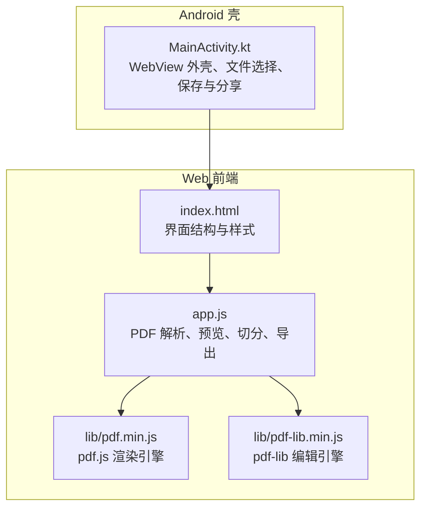
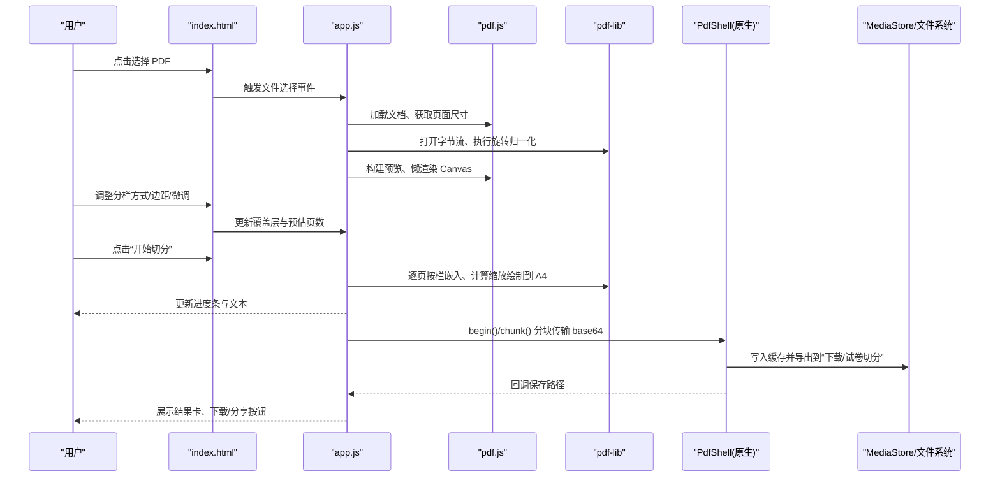
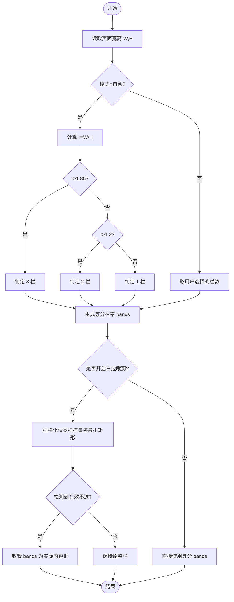
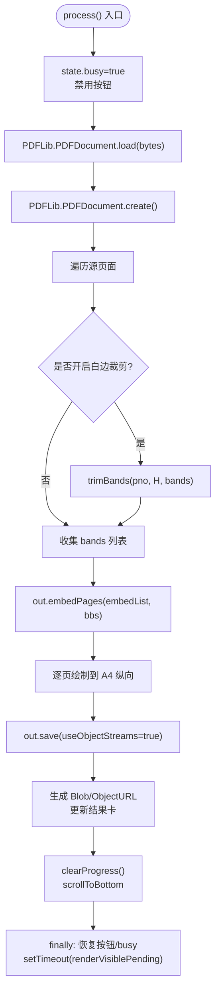
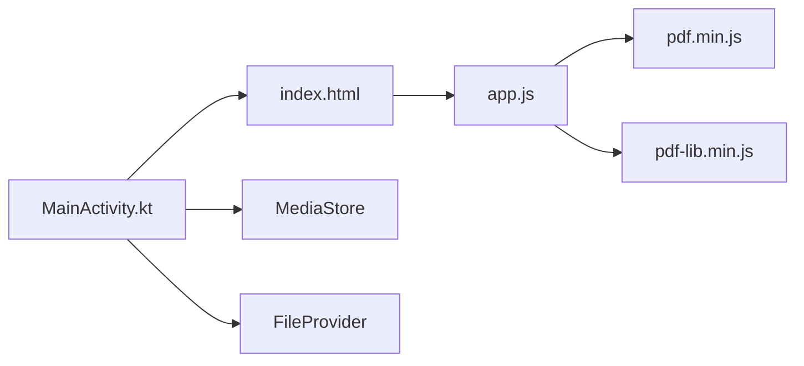

# 核心功能实现

<cite>
**本文引用的文件**   
- [README.md](file://README.md)
- [app.js](file://pdf-splitter/app.js)
- [index.html](file://pdf-splitter/index.html)
- [MainActivity.kt](file://android/app/src/main/java/com/pdfsplitter/app/MainActivity.kt)
</cite>

## 目录
1. [引言](#引言)
2. [项目结构](#项目结构)
3. [核心组件](#核心组件)
4. [架构总览](#架构总览)
5. [详细组件分析](#详细组件分析)
6. [依赖关系分析](#依赖关系分析)
7. [性能考量](#性能考量)
8. [故障排查指南](#故障排查指南)
9. [结论](#结论)

## 引言
本仓库是一个“试卷切分助手”，目标是把 A3/A4 拼版试卷（一页横排 2 栏或 3 栏）切分成“一页一题”的标准 A4 PDF，便于直接打印。全部处理在手机或电脑本地完成，不联网、不上传；Android 端通过 WebView 承载 Web 应用，原生层只负责文件选择、结果落盘与系统分享等能力。

该文档聚焦以下核心问题：
- 智能栏数识别的实现原理：自动检测逻辑、边界判断算法、错误处理机制。
- 实时预览系统的架构：pdf.js 渲染优化、预览位图复用、进度同步机制。
- 进度管理与状态同步：异步任务调度、用户反馈更新、错误恢复策略。
- 健壮的错误处理：异常捕获、用户提示、降级处理。
- 用户交互流程：文件选择、参数配置、处理控制与体验优化。

## 项目结构
仓库采用“Web 本体 + Android 壳工程”的混合结构：
- `pdf-splitter/`：PWA 前端，包含 HTML、JS 业务逻辑与本地化的 pdf.js、pdf-lib。
- `android/`：Kotlin + WebView 壳工程，构建时把 `pdf-splitter/` 同步到 assets/www。
- `pdftool_test/`：本地验证脚本与输出，用于坐标与旋转矩阵校验。
- 根目录说明文档与图标生成脚本。



**图表来源**
- [MainActivity.kt:37-151](file://android/app/src/main/java/com/pdfsplitter/app/MainActivity.kt#L37-L151)
- [index.html:284-286](file://pdf-splitter/index.html#L284-L286)
- [app.js:1-10](file://pdf-splitter/app.js#L1-L10)

**章节来源**
- [README.md:13-22](file://README.md#L13-L22)
- [index.html:1-14](file://pdf-splitter/index.html#L1-L14)

## 核心组件
- 文件加载与归一化：读取 ArrayBuffer，用 pdf-lib 打开并做旋转归一化，确保预览与裁剪使用同一套显示坐标。
- 智能栏数识别：根据页面宽高比自动判断 2 栏或 3 栏，也支持手动指定。
- 实时预览：基于 pdf.js 懒渲染、IntersectionObserver 可视区域触发、Canvas 位图复用。
- 白边裁剪：将每栏栅格化为位图后扫描墨迹最小矩形，作为实际裁剪框，再等比放入 A4。
- 切分与输出：按栏嵌入页面内容，计算缩放比例绘制到 A4 纵向页面，生成最终 PDF。
- 下载与分享：浏览器直链下载或系统分享；Android 端通过 PdfShell 桥分块传输 base64 并写入“下载/试卷切分”。

**章节来源**
- [app.js:13-28](file://pdf-splitter/app.js#L13-L28)
- [app.js:45-54](file://pdf-splitter/app.js#L45-L54)
- [app.js:57-103](file://pdf-splitter/app.js#L57-L103)
- [app.js:105-193](file://pdf-splitter/app.js#L105-L193)
- [app.js:412-508](file://pdf-splitter/app.js#L412-L508)
- [app.js:512-576](file://pdf-splitter/app.js#L512-L576)
- [MainActivity.kt:166-262](file://android/app/src/main/java/com/pdfsplitter/app/MainActivity.kt#L166-L262)

## 架构总览
整体数据流从“用户选择 PDF”开始，经过“文件读取 → 旋转归一化 → 预览渲染 → 参数配置 → 切分生成 → 结果导出”的流程。Android 壳在文件选择、结果落盘和系统分享方面提供必要能力，而核心业务逻辑集中在 Web 前端。



**图表来源**
- [index.html:164-286](file://pdf-splitter/index.html#L164-L286)
- [app.js:195-239](file://pdf-splitter/app.js#L195-L239)
- [app.js:243-263](file://pdf-splitter/app.js#L243-L263)
- [app.js:265-361](file://pdf-splitter/app.js#L265-L361)
- [app.js:412-508](file://pdf-splitter/app.js#L412-L508)
- [app.js:512-576](file://pdf-splitter/app.js#L512-L576)
- [MainActivity.kt:166-262](file://android/app/src/main/java/com/pdfsplitter/app/MainActivity.kt#L166-L262)

## 详细组件分析

### 智能栏数识别
- 自动检测逻辑：根据页面宽高比 r = W/H 判断：
  - r ≥ 1.85 → 3 栏
  - r ≥ 1.2 → 2 栏
  - 其他 → 1 栏
- 手动模式：支持“左右 2 栏”“左中右 3 栏”“不切分”，切换后立即刷新预览覆盖层与预估页数。
- 边界判断：当启用“裁掉白边”时，对每栏独立扫描墨迹最小矩形，若检测不到有效墨迹则退回整栏，避免裁空。
- 错误处理：检测失败返回 null，调用方保留原始整栏；trimBands 内部捕获渲染异常并回退为全栏空结果。



**图表来源**
- [app.js:45-54](file://pdf-splitter/app.js#L45-L54)
- [app.js:105-193](file://pdf-splitter/app.js#L105-L193)
- [app.js:427-457](file://pdf-splitter/app.js#L427-L457)

**章节来源**
- [app.js:45-54](file://pdf-splitter/app.js#L45-L54)
- [app.js:105-193](file://pdf-splitter/app.js#L105-L193)
- [app.js:427-457](file://pdf-splitter/app.js#L427-L457)

### 实时预览系统
- 渲染优化：
  - 固定逻辑宽度 RENDER_W = 820，按页面宽高计算 scale，保证屏幕内外一致。
  - IntersectionObserver 懒加载，滚动进入可视区域才渲染，减少初始开销。
  - 处理中让路：state.busy 为真时暂停 IntersectionObserver 渲染，由 renderVisiblePending 在处理结束后补渲染。
- 预览位图复用：
  - 每个预览项维护 rendered/painted 标记；painted 表示 Canvas 位图真正可用。
  - trimBands 优先复用已 painted 的 Canvas，避免重复栅格化；未预览到的页按需渲染一次。
- 进度同步：
  - updateOverlays 动态计算切分线位置与预估输出页数，实时更新 badge 与脚注。
  - 设置变更（模式、边距、微调）触发 resetResult 与 updateOverlays，保证预览与参数一致。

```mermaid
sequenceDiagram
participant UI as "index.html"
participant JS as "app.js"
participant PDFJ as "pdf.js"
participant IO as "IntersectionObserver"
UI->>JS : buildPreview()
JS->>IO : observe(pv-item)
IO-->>JS : 进入可视区域
JS->>PDFJ : getPage(idx+1).getViewport(scale)
PDFJ-->>JS : viewport
JS->>PDFJ : page.render({canvas, viewport})
PDFJ-->>JS : promise resolved
JS->>JS : it.painted=true; it.rendered=true
JS->>UI : updateOverlays() 更新切分线与预估页数
```

**图表来源**
- [app.js:265-361](file://pdf-splitter/app.js#L265-L361)

**章节来源**
- [app.js:265-361](file://pdf-splitter/app.js#L265-L361)

### 进度管理与状态同步
- 异步任务调度：
  - process() 使用 async/await 串行化步骤：读取 PDF → 创建输出文档 → 逐页嵌入 → 逐页绘制 → 保存。
  - 使用 tick() 让出主线程，避免长时间阻塞 UI。
- 用户反馈更新：
  - setProgress/clearProgress 控制底部进度条与文案，关键阶段（读取、检测白边、嵌入、生成、保存）均有明确提示。
  - 完成后滚动到底部，使“保存到本地”按钮触手可及。
- 错误恢复策略：
  - try/catch 包裹整个处理流程，catch 中清理进度并 alert 错误信息。
  - finally 中恢复按钮状态、重置 busy 标志，并在延迟后补渲染被让路的预览。



**图表来源**
- [app.js:412-508](file://pdf-splitter/app.js#L412-L508)

**章节来源**
- [app.js:412-508](file://pdf-splitter/app.js#L412-L508)

### 错误处理机制
- 文件加载失败：alert 提示无法打开 PDF，并给出加密文件的常见原因。
- 预览渲染失败：renderItem catch 中记录日志，不影响其他页渲染。
- 白边裁剪失败：scanBands/trimBands 捕获异常，返回空结果，调用方保留整栏。
- 处理过程异常：process() 全局 try/catch，清理进度并 alert 错误信息。
- Android 壳侧异常：Toast 提示保存失败、分享失败、无阅读器可用等，并尝试回退到系统选择器。

**章节来源**
- [app.js:204-239](file://pdf-splitter/app.js#L204-L239)
- [app.js:316-329](file://pdf-splitter/app.js#L316-L329)
- [app.js:170-193](file://pdf-splitter/app.js#L170-L193)
- [app.js:497-507](file://pdf-splitter/app.js#L497-L507)
- [MainActivity.kt:186-256](file://android/app/src/main/java/com/pdfsplitter/app/MainActivity.kt#L186-L256)

### 用户交互流程
- 文件选择：
  - Web 端：dropzone 点击触发 input[type=file]，onChange 调用 loadFile。
  - Android 端：onShowFileChooser 拦截系统文件选择器，复制文件到缓存目录并传回 WebView。
- 参数配置：
  - 分栏方式：自动/2栏/3栏/不切分，切换后刷新预览与预估页数。
  - 边距滑块：左右 0–20 mm、上下 0–40 mm，影响最终缩放与铺满程度。
  - 切分线微调：-15%~15%，用于对齐跨栏文字或视觉修正。
  - 白边裁剪：默认关闭，用户勾选后记住选择，开启会提示处理稍慢。
- 处理控制：
  - “开始切分”按钮禁用并显示旋转动画，底部进度条实时更新。
  - 完成后自动滚动到底部，展示结果卡与操作按钮。
  - “更换文件”可快速续切下一份，无需回到顶部。

**章节来源**
- [index.html:164-286](file://pdf-splitter/index.html#L164-L286)
- [app.js:195-239](file://pdf-splitter/app.js#L195-L239)
- [app.js:363-400](file://pdf-splitter/app.js#L363-L400)
- [app.js:412-508](file://pdf-splitter/app.js#L412-L508)
- [MainActivity.kt:114-145](file://android/app/src/main/java/com/pdfsplitter/app/MainActivity.kt#L114-L145)

## 依赖关系分析
- Web 前端依赖：
  - pdf.js：解析与渲染 PDF，提供 viewport、render API。
  - pdf-lib：编辑 PDF，支持 embedPage/embedPages、创建新文档、保存字节流。
- Android 壳依赖：
  - WebViewAssetLoader：以 https://appassets.androidplatform.net/assets/www/ 提供本地资源，避免 file:// 下 worker 加载失败。
  - MediaStore：写入“下载/试卷切分”目录，重名自动加序号。
  - FileProvider：发起系统分享，不落盘误报“已保存”。



**图表来源**
- [index.html:284-286](file://pdf-splitter/index.html#L284-L286)
- [MainActivity.kt:103-112](file://android/app/src/main/java/com/pdfsplitter/app/MainActivity.kt#L103-L112)
- [MainActivity.kt:264-292](file://android/app/src/main/java/com/pdfsplitter/app/MainActivity.kt#L264-L292)

**章节来源**
- [index.html:284-286](file://pdf-splitter/index.html#L284-L286)
- [MainActivity.kt:103-112](file://android/app/src/main/java/com/pdfsplitter/app/MainActivity.kt#L103-L112)
- [MainActivity.kt:264-292](file://android/app/src/main/java/com/pdfsplitter/app/MainActivity.kt#L264-L292)

## 性能考量
- 预览位图复用：已 painted 的 Canvas 直接复用，避免二次栅格化；16 页试卷从 ~14s 降到 ~1s。
- 懒渲染与可视区域触发：IntersectionObserver 仅渲染可见页，减少初始负载。
- 处理中让路：state.busy 阻止 IntersectionObserver 渲染，处理结束后统一补渲染。
- 白边裁剪成本：未预览到的页需一次 pdf.js 渲染（约 1s/页），瓶颈在内容解析与绘制指令而非像素量。
- 大文件内存峰值：一次性嵌入所有页面，内存峰值偏高且不能中途取消。

[本节为通用性能讨论，不直接分析具体文件]

## 故障排查指南
- 无法打开 PDF：
  - 检查是否为加密文件；当前不支持加密 PDF，需先去除密码。
  - 查看 console 中的错误信息与 alert 提示。
- 预览卡顿或空白：
  - 检查 IntersectionObserver 是否正常工作；处理中会暂停渲染，完成后应补渲染。
  - 确认 Canvas 尺寸与 scale 计算是否正确。
- 白边裁剪无效：
  - 检查是否检测到有效墨迹；若无墨迹则退回整栏。
  - 查看 scanInk/scanBands 的返回值与异常日志。
- 保存失败：
  - Android 端 Toast 提示“写入下载失败”；检查存储权限与路径。
  - 确认 PdfShell.begin/chunk/save 调用顺序正确。
- 分享失败：
  - 检查系统是否有可接收 PDF 的应用；若无则回退到系统选择器。
  - 确认 FileProvider 配置与 URI 权限。

**章节来源**
- [app.js:204-239](file://pdf-splitter/app.js#L204-L239)
- [app.js:316-329](file://pdf-splitter/app.js#L316-L329)
- [app.js:170-193](file://pdf-splitter/app.js#L170-L193)
- [MainActivity.kt:186-256](file://android/app/src/main/java/com/pdfsplitter/app/MainActivity.kt#L186-L256)

## 结论
本项目通过 Web 前端与 Android 壳工程的协作，实现了稳定高效的试卷切分功能。智能栏数识别基于页面宽高比与用户手动选择，结合白边裁剪提升输出质量；实时预览系统通过 pdf.js 懒渲染与位图复用显著降低耗时；进度管理与错误处理保证了用户体验与健壮性。Android 壳在文件选择、结果落盘与系统分享方面提供了必要的原生能力，使整体方案在手机端具备良好可用性。

[本节为总结性内容，不直接分析具体文件]