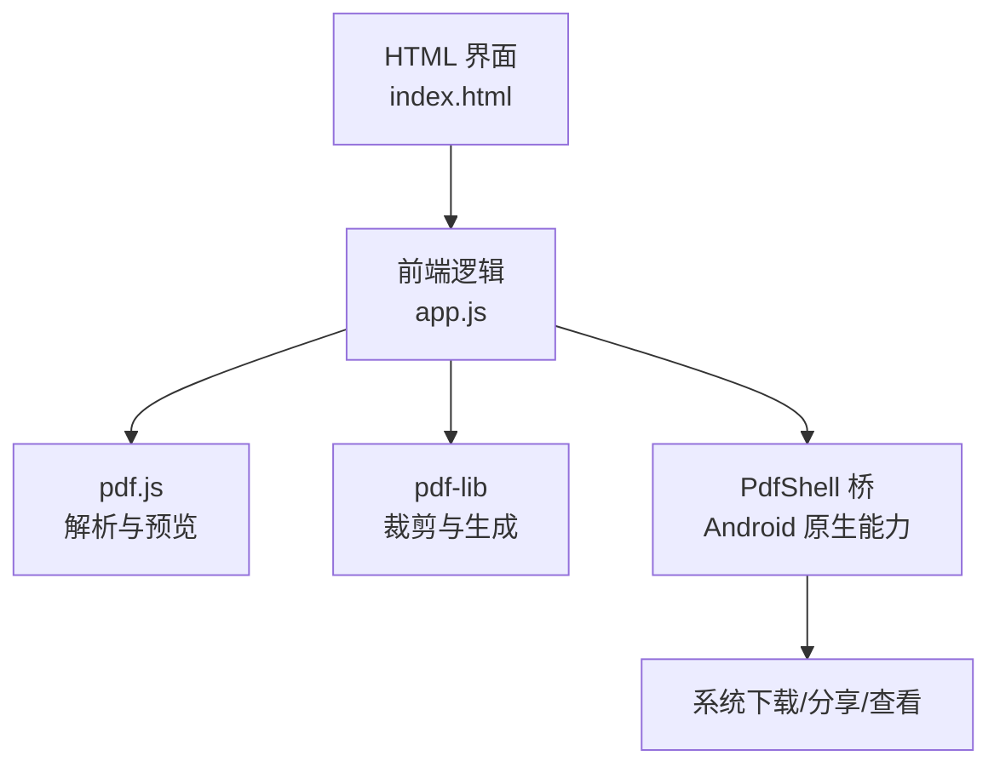
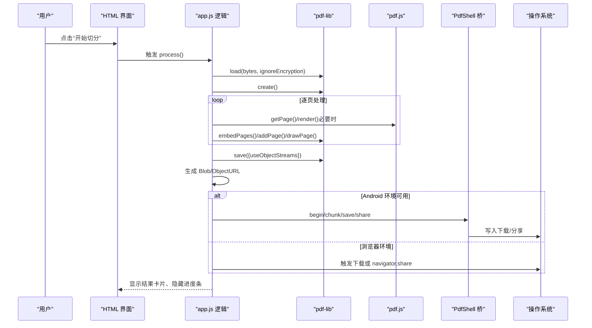
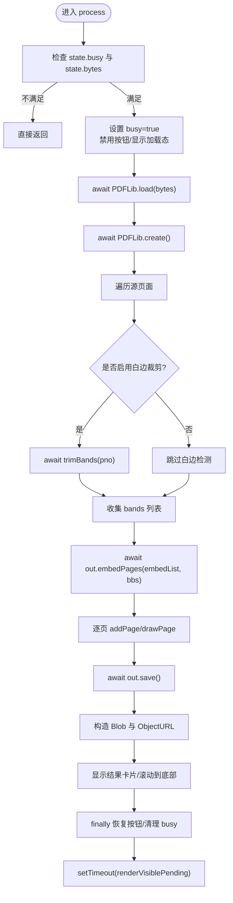
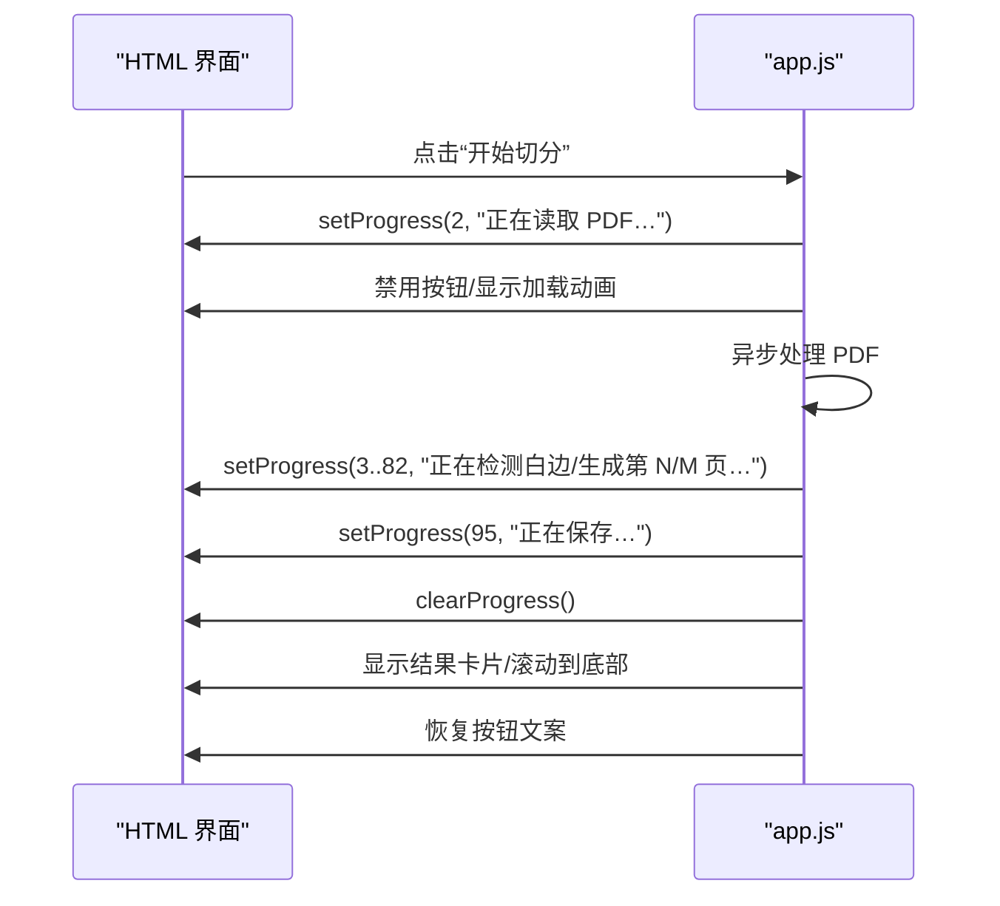
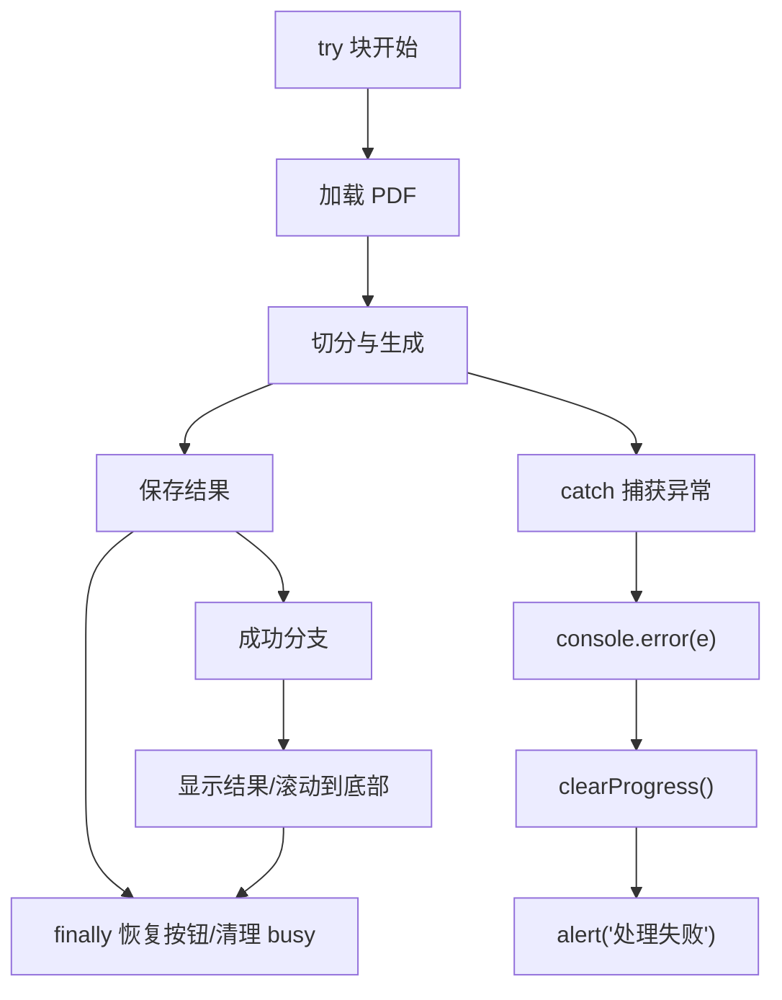
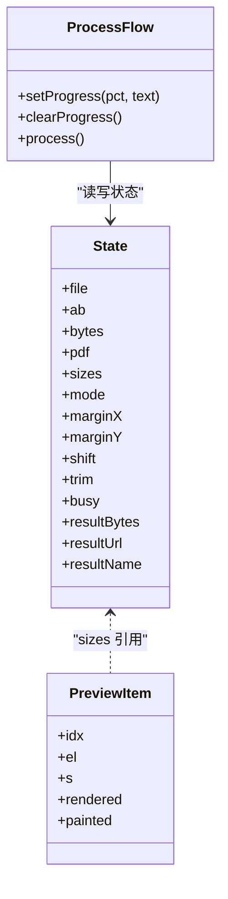
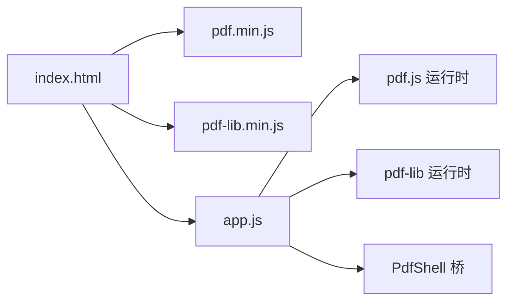

# 进度管理与状态同步

<cite>
**本文引用的文件**   
- [README.md](file://README.md)
- [app.js](file://pdf-splitter/app.js)
- [index.html](file://pdf-splitter/index.html)
</cite>

## 目录
1. [引言](#引言)
2. [项目结构](#项目结构)
3. [核心组件](#核心组件)
4. [架构总览](#架构总览)
5. [详细组件分析](#详细组件分析)
6. [依赖关系分析](#依赖关系分析)
7. [性能与体验优化](#性能与体验优化)
8. [故障排查指南](#故障排查指南)
9. [结论](#结论)

## 引言
本文围绕“试卷切分助手”的进度管理与状态同步机制展开，重点解释以下方面：
- 异步任务调度：Promise 链式调用、async/await 模式、任务优先级与渲染让路。
- 用户反馈更新：进度条动画、状态文本、按钮状态控制。
- 错误恢复策略：异常捕获、降级处理、用户提示设计。
- 状态管理：全局 state 对象、数据一致性、内存泄漏防护。
- 用户体验优化：流畅性保证、响应性提升、错误恢复最佳实践。

该应用以浏览器端 PDF 解析与编辑为核心，使用 pdf.js 进行预览与栅格化，使用 pdf-lib 完成页面裁剪、缩放与输出；Android 壳仅承担 WebView、文件选择、结果保存与分享等原生能力桥接。

**章节来源**
- [README.md:1-22](file://README.md#L1-L22)

## 项目结构
前端主逻辑集中在 `pdf-splitter/app.js`，界面结构与样式在 `pdf-splitter/index.html`，Android 壳工程位于 `android/`，PDF 库为本地化的 pdf.js 与 pdf-lib。

**图表来源**
- [index.html:284-286](file://pdf-splitter/index.html#L284-L286)
- [app.js:10-11](file://pdf-splitter/app.js#L10-L11)
- [app.js:514-552](file://pdf-splitter/app.js#L514-L552)

**章节来源**
- [index.html:1-13](file://pdf-splitter/index.html#L1-L13)
- [index.html:284-286](file://pdf-splitter/index.html#L284-L286)
- [app.js:1-11](file://pdf-splitter/app.js#L1-L11)

## 核心组件
- 全局状态对象：集中维护当前文件、原始字节、归一化字节、pdf.js 文档、每页尺寸、分栏模式、边距、偏移、白边裁剪开关、忙闲标志、结果字节与 URL、结果文件名等。
- 文件加载与初始化：读取 ArrayBuffer → 用 pdf-lib 加载 → 旋转归一化 → 用 pdf.js 打开并收集每页尺寸 → 构建预览。
- 预览系统：懒加载渲染、IntersectionObserver 可见区域触发、处理期间让路给后台任务、可复用已绘制位图。
- 切分流程：按页计算栏数与分割线 → 可选白边检测 → 嵌入裁剪区域 → 等比放入 A4 → 保存为 Blob → 生成 ObjectURL。
- 用户反馈：底部固定操作栏中的进度条与状态文本、按钮禁用与加载动画、结果卡片展示与自动滚动到底部。
- 结果导出：优先走 PdfShell 原生通道（分块 base64 传输），否则回退到浏览器下载或系统分享。

**章节来源**
- [app.js:13-28](file://pdf-splitter/app.js#L13-L28)
- [app.js:204-239](file://pdf-splitter/app.js#L204-L239)
- [app.js:265-361](file://pdf-splitter/app.js#L265-L361)
- [app.js:401-508](file://pdf-splitter/app.js#L401-L508)
- [app.js:514-552](file://pdf-splitter/app.js#L514-L552)

## 架构总览
整体采用“UI 层 + 业务逻辑层 + 第三方库层”的分层结构。UI 层负责交互与展示；业务逻辑层封装文件加载、预览、切分、导出；第三方库层提供 PDF 解析、渲染与编辑能力。Android 壳通过 PdfShell 暴露 save/share/open 等方法，供网页侧调用。

**图表来源**
- [app.js:412-508](file://pdf-splitter/app.js#L412-L508)
- [app.js:514-552](file://pdf-splitter/app.js#L514-L552)

## 详细组件分析

### 异步任务调度机制
- Promise 链式调用：文件读取、PDF 加载、旋转归一化、打开文档、构建预览均通过 then 链串联，确保顺序执行与错误向上传播。
- async/await 模式：process 函数使用 await 等待 PDF 加载、创建、嵌入、保存等耗时操作，代码可读性强且便于统一 try/catch。
- 任务优先级与让路：
  - 预览渲染使用 IntersectionObserver 懒加载，并在 state.busy 时主动让路，避免与切分任务争抢 pdf.js 队列。
  - 切分循环中周期性调用 tick()（基于 setTimeout(r, 0)）将控制权交还给事件循环，避免长时间阻塞 UI。
  - 处理结束后延迟 400ms 补渲染可见但未渲染的预览项，减少二次排队。

**图表来源**
- [app.js:412-508](file://pdf-splitter/app.js#L412-L508)
- [app.js:55-55](file://pdf-splitter/app.js#L55-L55)

**章节来源**
- [app.js:204-239](file://pdf-splitter/app.js#L204-L239)
- [app.js:265-329](file://pdf-splitter/app.js#L265-L329)
- [app.js:401-508](file://pdf-splitter/app.js#L401-L508)

### 用户反馈更新系统
- 进度条动画：
  - 通过 setProgress(pct, text) 更新进度条宽度与状态文本，同时为容器添加 on 类名以显示进度区域。
  - clearProgress() 移除 on 类名，隐藏进度区域。
- 状态文本更新：
  - 读取 PDF、检测白边、嵌入内容、生成各页、保存等阶段分别设置不同文案，帮助用户理解当前步骤。
- 按钮状态控制：
  - 处理开始时禁用“开始切分”按钮并替换为带旋转动画的“处理中”文案。
  - finally 中恢复按钮文案为“重新切分”，并释放 busy 标志。
- 结果展示与滚动：
  - 成功后显示结果卡片，计算总页数与文件大小，清空进度条，并直接滚动到页面底部，使“保存到本地”触手可及。

**图表来源**
- [app.js:401-508](file://pdf-splitter/app.js#L401-L508)
- [index.html:270-282](file://pdf-splitter/index.html#L270-L282)

**章节来源**
- [app.js:401-508](file://pdf-splitter/app.js#L401-L508)
- [index.html:105-134](file://pdf-splitter/index.html#L105-L134)
- [index.html:270-282](file://pdf-splitter/index.html#L270-L282)

### 错误恢复策略
- 异常捕获机制：
  - 文件加载失败时 alert 提示无法打开 PDF，并说明加密文件需先去除密码。
  - 切分主流程使用 try/catch/finally，捕获所有异常并记录日志，同时清理进度条与恢复按钮状态。
- 降级处理方案：
  - 白边检测失败时返回空框数组，调用方保留原始整栏，避免切空。
  - 预览渲染失败时记录错误但不中断整体流程。
  - Android 环境下若 PdfShell 不可用，则回退到浏览器下载或系统分享。
- 用户提示设计：
  - 使用 alert 明确告知失败原因与下一步建议。
  - 在 UI 上通过进度条与状态文本反馈当前阶段，失败时立即清除进度并恢复按钮。

**图表来源**
- [app.js:204-239](file://pdf-splitter/app.js#L204-L239)
- [app.js:412-508](file://pdf-splitter/app.js#L412-L508)

**章节来源**
- [app.js:204-239](file://pdf-splitter/app.js#L204-L239)
- [app.js:412-508](file://pdf-splitter/app.js#L412-L508)

### 状态管理机制
- 全局 state 对象设计：
  - 集中管理 file、ab、bytes、pdf、sizes、mode、marginX、marginY、shift、trim、busy、resultBytes、resultUrl、resultName 等字段，避免分散变量导致的状态不一致。
- 数据一致性保证：
  - 旋转归一化后统一使用 bytes 作为输入，确保预览与输出坐标系一致。
  - openPdf 中先销毁上一份 pdf.js 文档再加载新文档，避免缓存与 worker 占用内存。
  - 每次设置变化（模式、边距、偏移、白边裁剪）后调用 resetResult，重置结果状态，防止旧结果污染。
- 内存泄漏防护：
  - 换文件时显式调用 prev.destroy() 释放 pdf.js 文档。
  - 白边检测完成后及时清空 canvas 宽高释放位图。
  - 切换结果时撤销旧的 ObjectURL，避免 URL 泄漏。
  - 结果导出后仍保留 resultBytes 以便分享，但通过 shellTransfer 分块传输降低一次性拷贝压力。

**图表来源**
- [app.js:13-28](file://pdf-splitter/app.js#L13-L28)
- [app.js:265-329](file://pdf-splitter/app.js#L265-L329)
- [app.js:401-508](file://pdf-splitter/app.js#L401-L508)

**章节来源**
- [app.js:13-28](file://pdf-splitter/app.js#L13-L28)
- [app.js:243-263](file://pdf-splitter/app.js#L243-L263)
- [app.js:363-399](file://pdf-splitter/app.js#L363-L399)
- [app.js:554-564](file://pdf-splitter/app.js#L554-L564)

## 依赖关系分析
- app.js 依赖 pdf.js 与 pdf-lib，二者通过 window 全局对象注入。
- Android 壳通过 PdfShell 暴露 save/share/open 方法，网页侧通过 window.PdfShell 调用。
- HTML 通过 script 标签引入 pdf.min.js、pdf-lib.min.js 与 app.js，形成加载顺序依赖。

**图表来源**
- [index.html:284-286](file://pdf-splitter/index.html#L284-L286)
- [app.js:10-11](file://pdf-splitter/app.js#L10-L11)
- [app.js:514-552](file://pdf-splitter/app.js#L514-L552)

**章节来源**
- [index.html:284-286](file://pdf-splitter/index.html#L284-L286)
- [app.js:10-11](file://pdf-splitter/app.js#L10-L11)
- [app.js:514-552](file://pdf-splitter/app.js#L514-L552)

## 性能与体验优化
- 流畅性保证：
  - 使用 IntersectionObserver 懒加载预览，仅在元素进入视口附近时渲染，减少初始渲染压力。
  - 处理期间暂停预览渲染，避免与切分任务争抢 pdf.js 队列。
  - 切分循环中周期性 await tick()，让出事件循环，保持 UI 响应。
- 响应性提升：
  - 设置变更即时更新预览覆盖层与输出页数，无需重绘 canvas。
  - 结果卡片出现后直接 scrollTo 底部，避免平滑滚动带来的帧抖动。
- 错误恢复最佳实践：
  - 关键路径统一 try/catch/finally，确保 UI 状态始终可恢复。
  - 白边检测失败时降级为整栏，避免切空。
  - 大文件场景下，分块传输结果并通过 useObjectStreams 优化保存性能。

[本节为通用指导，不直接分析具体文件]

## 故障排查指南
- 无法打开 PDF：
  - 检查是否为加密文件，需先去除密码。
  - 确认文件类型与扩展名符合预期。
- 处理失败：
  - 查看控制台日志定位具体异常。
  - 检查是否启用了白边裁剪，某些扫描件可能检测不到墨迹而退化。
- 预览卡顿：
  - 确认未处于处理中状态（state.busy）。
  - 检查 IntersectionObserver 是否正常工作，必要时手动触发 renderVisiblePending。
- 结果未显示：
  - 检查 PdfShell 是否可用，若不可用则回退到浏览器下载。
  - 确认 ObjectURL 未被提前撤销。

**章节来源**
- [app.js:204-239](file://pdf-splitter/app.js#L204-L239)
- [app.js:412-508](file://pdf-splitter/app.js#L412-L508)
- [app.js:514-552](file://pdf-splitter/app.js#L514-L552)

## 结论
该应用在进度管理与状态同步方面采用了清晰的全局 state 管理、Promise/async-await 异步模型、以及细致的用户反馈更新机制。通过预览懒加载、处理让路、周期性让出事件循环等手段，保证了在大文件场景下的流畅性与响应性。错误恢复策略覆盖了异常捕获、降级处理与用户提示，提升了鲁棒性。未来可进一步考虑：
- 引入更细粒度的进度回调，支持取消与重试。
- 对超大文件采用流式处理与增量保存，降低内存峰值。
- 增加离线缓存与断点续传，提升网络不稳定环境下的可用性。

[本节为总结性内容，不直接分析具体文件]