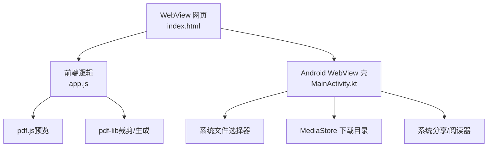
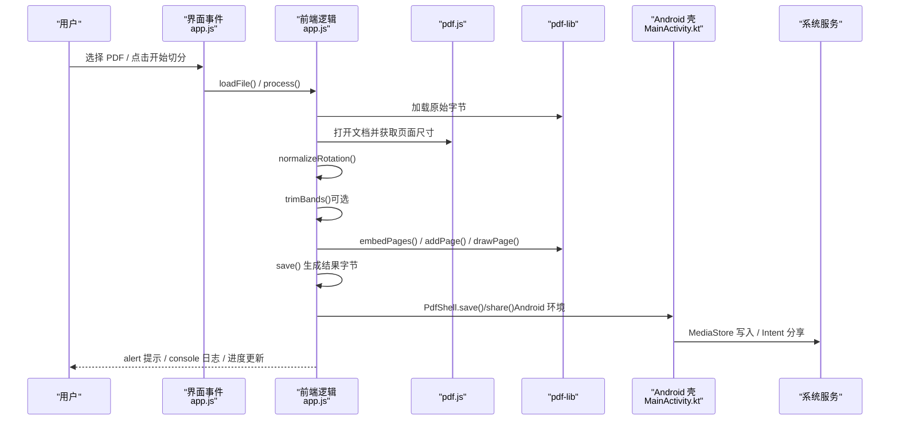
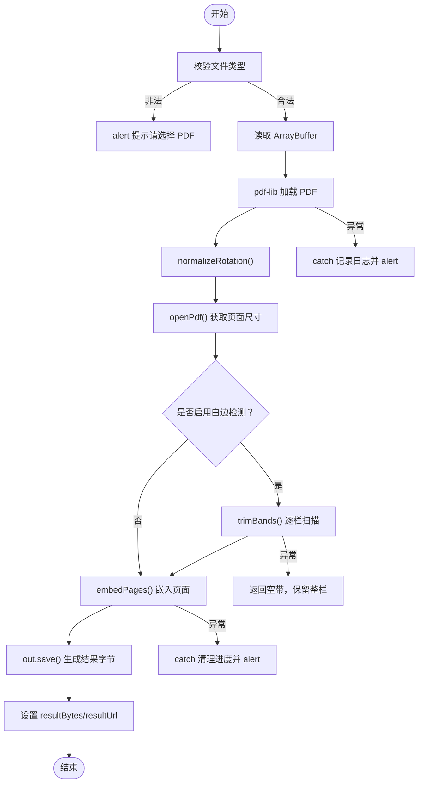
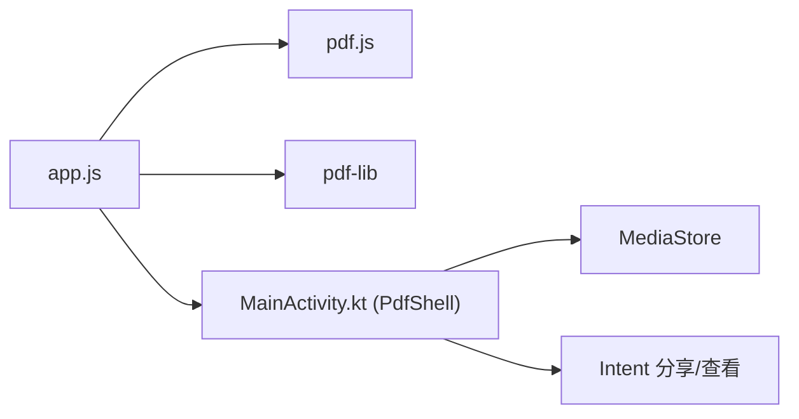

# 错误处理机制

<cite>
**本文引用的文件**   
- [app.js](file://pdf-splitter/app.js)
- [MainActivity.kt](file://android/app/src/main/java/com/pdfsplitter/app/MainActivity.kt)
- [README.md](file://README.md)
</cite>

## 目录
1. [引言](#引言)
2. [项目结构](#项目结构)
3. [核心组件](#核心组件)
4. [架构总览](#架构总览)
5. [详细组件分析](#详细组件分析)
6. [依赖关系分析](#依赖关系分析)
7. [性能与稳定性考量](#性能与稳定性考量)
8. [故障排查指南](#故障排查指南)
9. [结论](#结论)

## 引言
本文件聚焦“试卷切分助手”的错误处理机制，围绕异常捕获策略、用户提示系统、降级处理方案、资源清理机制以及健壮性设计原则展开。该应用以浏览器端 PDF 解析与裁剪为核心，Android WebView 壳负责文件选择、结果落盘与分享；所有 PDF 处理均在本地完成，不上传网络。错误处理贯穿文件加载、PDF 解析、预览渲染、白边检测、页面嵌入、保存与分享等关键路径。

## 项目结构
- `pdf-splitter/`：Web 本体，包含入口 HTML、主逻辑 `app.js` 与本地化的 pdf.js、pdf-lib。
- `android/`：Android 壳工程，使用 Kotlin + WebView，提供原生能力桥接。
- `README.md`：说明应用目标、安装方式、已知限制与处理流程关键点。

**图表来源**
- [app.js:1-578](file://pdf-splitter/app.js#L1-L578)
- [MainActivity.kt:1-311](file://android/app/src/main/java/com/pdfsplitter/app/MainActivity.kt#L1-L311)
- [README.md:13-22](file://README.md#L13-L22)

**章节来源**
- [README.md:13-22](file://README.md#L13-L22)

## 核心组件
- 前端状态机与工具函数：集中管理文件、字节流、PDF 文档、页面尺寸、模式、边距、进度与结果对象。
- 旋转校正模块：将 `/Rotate` 烘焙进内容，保证预览与输出坐标一致。
- 白边检测模块：基于栅格化位图扫描墨迹区域，计算每栏的裁剪框。
- 预览渲染模块：懒加载渲染页，复用已绘制位图，避免重复渲染。
- 切分生成模块：按栏嵌入页面到 A4，逐步构建输出 PDF。
- 下载与分享模块：根据环境选择浏览器下载或 Android 原生通道。
- Android 壳桥：实现 PdfShell API，负责分块写入、保存到下载目录、分享与打开。

**章节来源**
- [app.js:13-28](file://pdf-splitter/app.js#L13-L28)
- [app.js:57-103](file://pdf-splitter/app.js#L57-L103)
- [app.js:105-193](file://pdf-splitter/app.js#L105-L193)
- [app.js:265-329](file://pdf-splitter/app.js#L265-L329)
- [app.js:401-508](file://pdf-splitter/app.js#L401-L508)
- [app.js:512-552](file://pdf-splitter/app.js#L512-L552)
- [MainActivity.kt:162-262](file://android/app/src/main/java/com/pdfsplitter/app/MainActivity.kt#L162-L262)

## 架构总览
下图展示从用户操作到错误处理的端到端流程，包括前端 Promise 链、异步任务、用户提示与原生桥调用。

**图表来源**
- [app.js:204-239](file://pdf-splitter/app.js#L204-L239)
- [app.js:412-508](file://pdf-splitter/app.js#L412-L508)
- [MainActivity.kt:186-256](file://android/app/src/main/java/com/pdfsplitter/app/MainActivity.kt#L186-L256)

## 详细组件分析

### 异常捕获策略
- try-catch 块设计
  - 文件类型校验失败时直接通过 alert 提示用户，避免进入后续解析流程。
  - 读取 ArrayBuffer 后尝试用 pdf-lib 加载，若失败则统一在 catch 中记录日志并弹出友好提示。
  - 切分主流程使用 async/try/catch/finally：成功时更新结果与 UI，失败时清理进度与按钮状态，最终恢复 busy 标志。
- Promise 错误处理
  - 多处 Promise 链采用 `.catch()` 进行局部容错，例如渲染单个页面失败仅记录日志，不影响其他页。
  - 旋转归一化与页面嵌入使用链式 then，任何一步失败都会短路到外层 catch。
- 异步操作异常管理
  - IntersectionObserver 回调中遇到处理中的 busy 状态会跳过渲染，避免与切分队列冲突。
  - 白边检测失败时返回空带，调用方保留整栏，确保不会裁空。

**图表来源**
- [app.js:204-239](file://pdf-splitter/app.js#L204-L239)
- [app.js:412-508](file://pdf-splitter/app.js#L412-L508)
- [app.js:164-193](file://pdf-splitter/app.js#L164-L193)

**章节来源**
- [app.js:204-239](file://pdf-splitter/app.js#L204-L239)
- [app.js:412-508](file://pdf-splitter/app.js#L412-L508)
- [app.js:164-193](file://pdf-splitter/app.js#L164-L193)

### 用户提示系统
- alert 对话框
  - 文件类型不正确时提示“请选择 PDF 文件”。
  - 无法打开 PDF 时提示具体错误信息，并附带加密文件的处理建议。
  - 切分失败时显示错误详情。
  - 分享不可用时提示改用下载。
- console 日志记录
  - 多处使用 `console.error` 记录渲染失败、白边检测失败等细节，便于调试。
- 友好的错误信息展示
  - 进度条与按钮文案反映当前状态（如“正在读取 PDF…”、“处理中”）。
  - 结果卡显示页数与大小，滚动到底部方便用户操作。

**章节来源**
- [app.js:204-239](file://pdf-splitter/app.js#L204-L239)
- [app.js:412-508](file://pdf-splitter/app.js#L412-L508)
- [app.js:530-552](file://pdf-splitter/app.js#L530-L552)
- [MainActivity.kt:126-144](file://android/app/src/main/java/com/pdfsplitter/app/MainActivity.kt#L126-L144)

### 降级处理方案
- 功能回退机制
  - 未启用 IntersectionObserver 时，直接遍历渲染所有预览项，避免现代 API 缺失导致空白。
  - 白边检测失败时返回空带，调用方保留整栏，确保输出不为空。
  - Android 环境下若 PdfShell 不可用，回退到浏览器下载或系统分享。
- 容错处理
  - 读取 Rotate 属性失败时忽略，视为无旋转。
  - localStorage 读写失败时忽略，避免隐私模式或 file:// 下抛错。
  - 分享 API 不可用时降级为下载提示。
- 数据完整性保护
  - 旋转归一化仅在存在旋转页面时执行，否则直接使用原字节，减少不必要的重存。
  - 白边检测失败时保留整栏，避免裁空导致内容丢失。

**章节来源**
- [app.js:68-80](file://pdf-splitter/app.js#L68-L80)
- [app.js:288-305](file://pdf-splitter/app.js#L288-L305)
- [app.js:164-193](file://pdf-splitter/app.js#L164-L193)
- [app.js:389-399](file://pdf-splitter/app.js#L389-L399)
- [app.js:530-552](file://pdf-splitter/app.js#L530-L552)

### 资源清理机制
- 内存释放
  - 切换文件时调用 `prev.destroy()` 释放上一份 pdf.js 文档缓存与 worker。
  - 白边检测完成后将 canvas 宽高置零，及时释放位图内存。
  - 重置结果时撤销 ObjectURL，避免内存泄漏。
- 事件监听器移除
  - IntersectionObserver 在命中后调用 `unobserve`，避免持续监听。
  - 切分结束后延迟补渲染，避免与处理队列冲突。
- DOM 元素清理
  - 重建预览时清空 `pvGrid.innerHTML`，重新创建节点。
  - 下载链接创建后立即移除，避免残留 DOM。

**章节来源**
- [app.js:243-263](file://pdf-splitter/app.js#L243-L263)
- [app.js:182-193](file://pdf-splitter/app.js#L182-L193)
- [app.js:268-305](file://pdf-splitter/app.js#L268-L305)
- [app.js:554-564](file://pdf-splitter/app.js#L554-L564)
- [app.js:530-539](file://pdf-splitter/app.js#L530-L539)

### 健壮性设计原则
- 防御性编程
  - 输入校验：文件类型检查、参数边界处理（如 shift 百分比限制）。
  - 异常隔离：局部 `.catch()` 防止单点失败影响整体流程。
  - 环境兼容：API 可用性检测（IntersectionObserver、localStorage、navigator.share）。
- 错误边界设置
  - 每个关键步骤都有明确的错误分支，确保 UI 状态可恢复。
  - 进度条与按钮状态在 finally 中统一清理，避免卡死。
- 系统稳定性保障
  - 大文件分块传输（Android 壳），避免桥调用内存峰值过高。
  - 预览懒加载与复用，降低渲染压力。
  - 旋转校正与白边检测分离，职责清晰，易于维护。

**章节来源**
- [app.js:204-239](file://pdf-splitter/app.js#L204-L239)
- [app.js:412-508](file://pdf-splitter/app.js#L412-L508)
- [app.js:512-552](file://pdf-splitter/app.js#L512-L552)
- [MainActivity.kt:162-262](file://android/app/src/main/java/com/pdfsplitter/app/MainActivity.kt#L162-L262)

## 依赖关系分析
- 前端依赖 pdf.js 用于预览，pdf-lib 用于裁剪与生成。
- Android 壳通过 WebViewAssetLoader 提供本地资源，避免 file:// 协议问题。
- PdfShell 桥接口暴露 begin/chunk/save/share/open/log 等方法，供前端调用。

**图表来源**
- [app.js:1-10](file://pdf-splitter/app.js#L1-L10)
- [MainActivity.kt:103-152](file://android/app/src/main/java/com/pdfsplitter/app/MainActivity.kt#L103-L152)
- [MainActivity.kt:162-262](file://android/app/src/main/java/com/pdfsplitter/app/MainActivity.kt#L162-L262)

**章节来源**
- [app.js:1-10](file://pdf-splitter/app.js#L1-L10)
- [MainActivity.kt:103-152](file://android/app/src/main/java/com/pdfsplitter/app/MainActivity.kt#L103-L152)
- [MainActivity.kt:162-262](file://android/app/src/main/java/com/pdfsplitter/app/MainActivity.kt#L162-L262)

## 性能与稳定性考量
- 预览优化：IntersectionObserver 懒加载，命中后 unobserve，避免持续监听。
- 渲染复用：已绘制的页标记 painted，白边检测直接复用位图，减少重复渲染。
- 内存控制：canvas 宽高置零、ObjectURL 撤销、pdf.js 文档销毁。
- 大文件处理：Android 壳分块 base64 传输，避免单次桥调用过大。
- 已知限制：大文件一次性嵌入内存峰值偏高，不能中途取消；加密 PDF 不支持。

**章节来源**
- [app.js:288-305](file://pdf-splitter/app.js#L288-L305)
- [app.js:154-161](file://pdf-splitter/app.js#L154-L161)
- [app.js:243-263](file://pdf-splitter/app.js#L243-L263)
- [MainActivity.kt:162-184](file://android/app/src/main/java/com/pdfsplitter/app/MainActivity.kt#L162-L184)
- [README.md:83-91](file://README.md#L83-L91)

## 故障排查指南
- 常见问题
  - 无法打开 PDF：检查是否为加密文件，先去除密码再处理。
  - 白边检测失败：确认页面有墨迹，否则会自动保留整栏。
  - 分享不可用：提示改用下载，或检查系统分享配置。
- 调试建议
  - 使用 Chrome 开发者工具审查 WebView，查看 console 日志。
  - 检查 Android 日志，关注 Log.e 与 Log.w 输出。
  - 验证 PdfShell 桥方法是否被正确调用。

**章节来源**
- [app.js:234-239](file://pdf-splitter/app.js#L234-L239)
- [app.js:497-508](file://pdf-splitter/app.js#L497-L508)
- [MainActivity.kt:194-208](file://android/app/src/main/java/com/pdfsplitter/app/MainActivity.kt#L194-L208)
- [README.md:56-57](file://README.md#L56-L57)

## 结论
该项目的错误处理机制围绕“预防、隔离、恢复”三大原则构建：通过输入校验与 API 兼容性检测预防错误，通过局部 catch 与降级逻辑隔离异常，通过 finally 与资源清理恢复系统状态。用户提示系统兼顾即时反馈与友好表达，降级方案确保功能可用性与数据完整性，资源清理机制保障长期运行的稳定性。整体设计在移动端受限环境中实现了良好的健壮性与用户体验。