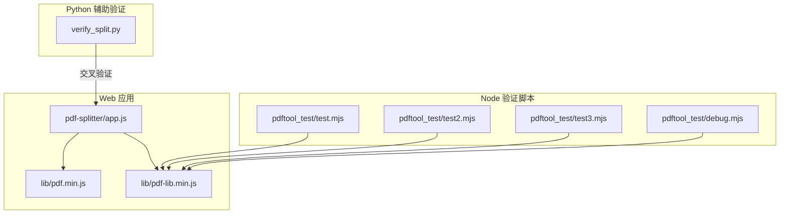
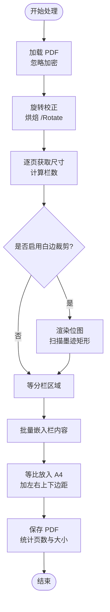
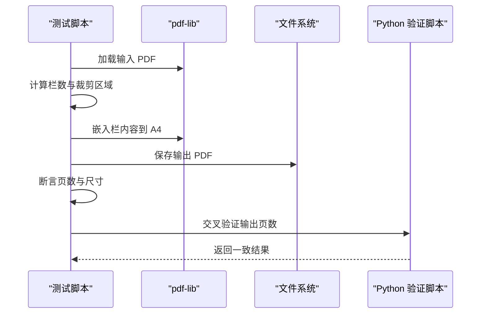
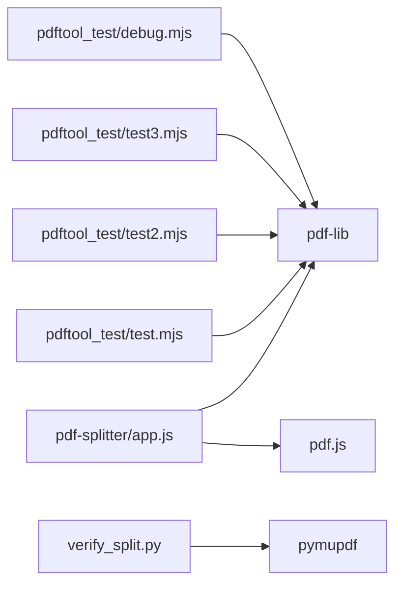

# 单元测试

<cite>
**本文引用的文件**   
- [README.md](file://README.md)
- [app.js](file://pdf-splitter/app.js)
- [package.json](file://pdftool_test/package.json)
- [test.mjs](file://pdftool_test/test.mjs)
- [test2.mjs](file://pdftool_test/test2.mjs)
- [test3.mjs](file://pdftool_test/test3.mjs)
- [debug.mjs](file://pdftool_test/debug.mjs)
- [verify_split.py](file://verify_split.py)
</cite>

## 目录
1. [引言](#引言)
2. [项目结构与测试定位](#项目结构与测试定位)
3. [Node.js 测试环境搭建与依赖管理](#nodejs-测试环境搭建与依赖管理)
4. [核心处理逻辑与可测点](#核心处理逻辑与可测点)
5. [单元测试总体设计](#单元测试总体设计)
6. [旋转校正算法验证用例](#旋转校正算法验证用例)
7. [栏数识别准确性测试](#栏数识别准确性测试)
8. [白边裁剪精度检测](#白边裁剪精度检测)
9. [边界条件与异常测试策略](#边界条件与异常测试策略)
10. [测试用例设计模式](#测试用例设计模式)
11. [切分结果、页面数量与输出格式验证示例](#切分结果页面数量与输出格式验证示例)
12. [依赖关系分析](#依赖关系分析)
13. [性能与内存注意事项](#性能与内存注意事项)
14. [故障排查指南](#故障排查指南)
15. [结论](#结论)

## 引言
本仓库是一个“试卷切分助手”，目标是把 A3/A4 拼版试卷（一页横排 2 栏或 3 栏）切分成“一页一题”的标准 A4 PDF。Web 本体位于 `pdf-splitter/`，Android 壳工程位于 `android/`，本地验证脚本位于 `pdftool_test/` 和 `verify_split.py`。

从测试视角看，当前仓库没有使用正式测试框架，而是通过 Node.js 脚本直接调用 `pdf-lib` 对真实 PDF 做端到端验证；同时 Web 主逻辑 `pdf-splitter/app.js` 实现了旋转校正、栏数识别、白边裁剪、A4 缩放嵌入等核心算法。单元测试文档需要围绕这些实现，给出可落地的测试方案、断言方法和扩展建议。

## 项目结构与测试定位
- `pdf-splitter/app.js`：浏览器/PWA 中的核心处理逻辑，包含旋转校正、栏数识别、白边裁剪、批量嵌入、进度与错误处理。
- `pdf-splitter/lib/pdf.min.js`、`pdf-splitter/lib/pdf-lib.min.js`：浏览器端使用的 pdf.js 与 pdf-lib 本地化资源。
- `pdftool_test/`：Node.js 侧的轻量验证脚本集合，用于快速验证切分流程、尺寸统计、批量嵌入行为等。
- `verify_split.py`：Python 侧辅助验证脚本，用 pymupdf 复现“按栏切割 + 等比放入 A4”的逻辑，便于交叉比对。
- `README.md`：说明项目目标、安装方式、构建方式、关键处理逻辑与已知限制。

**图表来源**
- [app.js:45-103](file://pdf-splitter/app.js#L45-L103)
- [app.js:412-491](file://pdf-splitter/app.js#L412-L491)
- [test.mjs:1-56](file://pdftool_test/test.mjs#L1-L56)
- [test2.mjs:1-48](file://pdftool_test/test2.mjs#L1-L48)
- [test3.mjs:1-57](file://pdftool_test/test3.mjs#L1-L57)
- [debug.mjs:1-36](file://pdftool_test/debug.mjs#L1-L36)
- [verify_split.py:17-52](file://verify_split.py#L17-L52)

**章节来源**
- [README.md:13-22](file://README.md#L13-L22)
- [README.md:77-90](file://README.md#L77-L90)

## Node.js 测试环境搭建与依赖管理
### 当前依赖
`pdftool_test/package.json` 中声明了两个运行时依赖：
- `pdf-lib`：用于加载、复制、嵌入、保存 PDF。
- `pdfjs-dist`：在 Node 测试脚本中未直接使用，但作为依赖存在，可能为后续扩展或统一版本管理预留。

### 安装与运行
- 进入 `pdftool_test/` 目录执行依赖安装。
- 将待测试卷保存为 `input.pdf`，或通过命令行参数指定输入路径。
- 各脚本默认输出到同目录下的不同文件名，例如 `test_out.pdf`、`test2_out.pdf`、`test3_out.pdf`、`debug.pdf`。

### 版本管理建议
- 固定 `pdf-lib` 与 `pdfjs-dist` 的具体小版本，避免上游 API 变化导致测试不稳定。
- 若引入正式测试框架，应把测试依赖与业务依赖分离，并明确 Node.js 最低版本要求。
- 对于浏览器端 PWA，应保持 `pdf-splitter/lib/pdf.min.js` 与 `pdf-splitter/lib/pdf-lib.min.js` 的版本与线上一致，避免 Node 测试与浏览器行为不一致。

**章节来源**
- [package.json:1-17](file://pdftool_test/package.json#L1-L17)
- [test.mjs:7-16](file://pdftool_test/test.mjs#L7-L16)
- [test2.mjs:7-16](file://pdftool_test/test2.mjs#L7-L16)
- [test3.mjs:7-16](file://pdftool_test/test3.mjs#L7-L16)
- [debug.mjs:7-16](file://pdftool_test/debug.mjs#L7-L16)

## 核心处理逻辑与可测点
`pdf-splitter/app.js` 是本次单元测试的核心被测对象，主要可测点包括：

| 功能 | 关键实现位置 | 可测点 |
| --- | --- | --- |
| 工具函数与格式化 | `fmtSize`、`detectCols`、`colsFor` | 文件大小格式化、栏数自动识别、手动模式解析 |
| 旋转校正 | `readRot`、`normalizeRotation`、`ROT_MATRIX` | `/Rotate` 读取、归一化矩阵、宽高交换、无旋转跳过优化 |
| 白边裁剪 | `TRIM_PAD`、`trimBands`、预览复用 | 最小墨迹矩形、留白余量、位图复用、回退整栏 |
| 切分生成 | `process`、`embedPages`、A4 缩放 | 栏宽计算、偏移微调、批量嵌入、A4 等比缩放、页码统计 |
| 进度与错误处理 | `setProgress`、`clearProgress`、`try/catch/finally` | 进度更新、异常提示、按钮状态恢复 |

**图表来源**
- [app.js:45-55](file://pdf-splitter/app.js#L45-L55)
- [app.js:57-103](file://pdf-splitter/app.js#L57-L103)
- [app.js:412-491](file://pdf-splitter/app.js#L412-L491)

**章节来源**
- [app.js:39-55](file://pdf-splitter/app.js#L39-L55)
- [app.js:57-103](file://pdf-splitter/app.js#L57-L103)
- [app.js:412-491](file://pdf-splitter/app.js#L412-L491)

## 单元测试总体设计
### 测试分层
1. **单元层**：针对 `detectCols`、`colsFor`、`readRot`、`normalizeRotation` 等纯函数或可隔离方法。
2. **集成层**：基于 `pdf-lib` 对完整 PDF 进行加载、旋转校正、栏切分、A4 嵌入、保存，验证输出 PDF 的页数、尺寸、内容布局。
3. **对比层**：与 Python 脚本 `verify_split.py` 的输出进行交叉验证，确保 Node 与 Python 实现一致。
4. **边界层**：超大文件、异常文件格式、空 PDF、加密 PDF、带 `/Rotate` 的扫描件、白边缺失栏等。

### 测试数据策略
- 使用真实试卷 PDF 作为基础数据源。
- 构造极端比例页面，覆盖 2 栏、3 栏、单栏边界。
- 构造带 `/Rotate` 的页面，覆盖 90°、180°、270°。
- 构造白边极多、白边极少、无墨迹栏等场景。

### 断言方法建议
- 输出页数断言：`out.getPageCount()` 与输入页数、栏数计算结果一致。
- 输出尺寸断言：A4 纵向宽度约 595.276 pt，高度约 841.89 pt。
- 内容布局断言：每栏等比缩放后不超出可用区，且尽量铺满。
- 文件大小断言：合理范围区间，避免异常膨胀或压缩失败。
- 一致性断言：与 Python 脚本输出页数相同，或与预期模板一致。

## 旋转校正算法验证用例
### 被测逻辑
- `readRot` 从页面节点读取 `/Rotate`，支持父级兜底，并将角度归一化为 0、90、180、270。
- `normalizeRotation` 遍历所有页面，若无旋转则直接返回 null，节省一次重存。
- 有旋转时，使用 `ROT_MATRIX` 将内容顺时针烘焙到显示方向，并在 90°/270° 时交换宽高。

### 测试用例设计
| 用例编号 | 输入特征 | 期望行为 | 断言方法 |
| --- | --- | --- | --- |
| ROT-01 | 页面 `/Rotate=0` | 不触发归一化，返回 null | 断言归一化结果为 null |
| ROT-02 | 页面 `/Rotate=90` | 内容顺时针旋转，宽高交换 | 断言输出页面高宽符合 H×W |
| ROT-03 | 页面 `/Rotate=180` | 内容倒置，宽高不变 | 断言输出页面 W×H |
| ROT-04 | 页面 `/Rotate=270` | 内容顺时针旋转，宽高交换 | 断言输出页面高宽符合 H×W |
| ROT-05 | 页面 `/Rotate=450` | 归一化为 90° | 断言行为与 90° 一致 |
| ROT-06 | 页面无 `/Rotate` | 视为 0° | 断言不触发归一化 |
| ROT-07 | 父级页面含 `/Rotate` | 子页继承旋转 | 断言子页也参与归一化 |

### 推荐验证方式
- 使用 `debug.mjs` 的思路，先复制原页面，再分别设置 MediaBox/CropBox，观察输出 PDF 的方向是否正确。
- 使用 `pdf-lib` 的 `embedPage` 与 `drawPage` 组合，验证旋转矩阵是否使内容与显示坐标一致。
- 与浏览器端预览行为对齐：旋转校正后，预览、检测栏数、裁剪应在同一套显示坐标下。

**章节来源**
- [app.js:57-103](file://pdf-splitter/app.js#L57-L103)
- [debug.mjs:21-35](file://pdftool_test/debug.mjs#L21-L35)

## 栏数识别准确性测试
### 被测逻辑
- `detectCols(W, H)` 根据页面长宽比判断栏数：
  - 比例 ≥1.85 → 3 栏
  - 比例 ≥1.2 → 2 栏
  - 其他 → 1 栏
- `colsFor(W, H)` 支持自动模式与手动模式。

### 测试用例设计
| 用例编号 | 输入 W/H | 期望栏数 | 说明 |
| --- | --- | --- | --- |
| COL-01 | 比例 <1.2 | 1 | 接近正方形或竖版单栏 |
| COL-02 | 比例 =1.2 | 2 | 2 栏下界 |
| COL-03 | 比例 =1.41 | 2 | A3 横版三栏实际会被判成 2 栏，属于已知限制 |
| COL-04 | 比例 =1.85 | 3 | 3 栏下界 |
| COL-05 | 比例 >1.85 | 3 | 典型三栏拼版 |
| COL-06 | 手动模式=2 | 2 | 强制 2 栏 |
| COL-07 | 手动模式=3 | 3 | 强制 3 栏 |

### 断言方法
- 直接断言 `detectCols(W, H)` 返回值。
- 结合真实 PDF 页面尺寸，断言切分出的栏数与预期一致。
- 与 `verify_split.py` 中的 `detect_cols` 保持一致性断言。

**章节来源**
- [app.js:45-54](file://pdf-splitter/app.js#L45-L54)
- [verify_split.py:17-25](file://verify_split.py#L17-L25)
- [README.md:83-86](file://README.md#L83-L86)

## 白边裁剪精度检测
### 被测逻辑
- 白边裁剪开启时，会将每栏渲染为位图，扫描出有墨迹的最小矩形作为裁剪框。
- 使用 `TRIM_PAD` 留出少量余量，避免削到笔画。
- 若检测不到墨迹，退回整栏，不会裁空。
- 已预览过的页复用位图，减少重复栅格化开销。

### 测试用例设计
| 用例编号 | 输入特征 | 期望行为 | 断言方法 |
| --- | --- | --- | --- |
| TRIM-01 | 白边较多 | 裁剪框贴近文字边缘 | 断言输出内容更饱满，空白减少 |
| TRIM-02 | 白边极少 | 裁剪框接近整栏 | 断言缩放倍率接近原始栏宽 |
| TRIM-03 | 某栏无墨迹 | 退回整栏 | 断言该栏未被裁空 |
| TRIM-04 | 已预览页 | 复用位图 | 断言处理时间显著低于首次渲染 |
| TRIM-05 | 白边+细线文字 | 保留笔画 | 断言 `TRIM_PAD` 未导致内容被削掉 |

### 推荐验证方式
- 对比开启与关闭白边裁剪的输出 PDF，检查内容放大倍率与页面利用率。
- 使用截图或像素级对比工具，验证裁剪框是否合理。
- 对“无墨迹栏”单独构造测试 PDF，确保不会裁成空白页。

**章节来源**
- [app.js:105-110](file://pdf-splitter/app.js#L105-L110)
- [app.js:440-450](file://pdf-splitter/app.js#L440-L450)
- [README.md:77-82](file://README.md#L77-L82)

## 边界条件与异常测试策略
### 超大文件处理
- 几百页扫描件一次性嵌入会导致内存峰值偏高。
- 测试应覆盖中等规模与较大规模 PDF，监控内存增长趋势。
- 注意当前实现不支持中途取消，需记录耗时与内存占用。

### 异常文件格式
- 非 PDF 文件：应抛出加载错误。
- 损坏 PDF：应捕获异常并提示处理失败。
- 加密 PDF：当前实现忽略加密但仍可能失败，需明确错误分支。

### 内存泄漏检测
- 多次加载/创建 PDFDocument 后，应释放临时对象。
- 浏览器端会复用预览位图，Node 测试也应避免长期持有大对象引用。
- 可通过进程退出前检查内存快照或日志输出判断是否存在明显泄漏。

### 测试矩阵建议
| 维度 | 用例类型 | 关注点 |
| --- | --- | --- |
| 文件大小 | 小文件、中文件、大文件 | 页数、耗时、内存峰值 |
| 页面比例 | 1:1、1.2、1.41、1.85、2.5 | 栏数识别准确性 |
| 旋转角度 | 0、90、180、270、非法值 | 旋转校正稳定性 |
| 白边情况 | 无白边、少白边、多白边、无墨迹 | 裁剪精度与回退逻辑 |
| 文件格式 | 正常 PDF、损坏 PDF、非 PDF、加密 PDF | 错误处理与用户提示 |

**章节来源**
- [README.md:83-90](file://README.md#L83-L90)
- [app.js:497-507](file://pdf-splitter/app.js#L497-L507)

## 测试用例设计模式
### 模拟数据生成
- 使用真实 PDF 作为基准数据，避免构造成本过高。
- 对关键属性（页面尺寸、旋转角度、白边比例）建立小型数据集。
- 对异常场景使用最小可复现样本，例如仅含一个页面的 PDF。

### 断言方法使用
- 页数断言：`out.getPageCount()` 应与输入页数 × 栏数一致。
- 尺寸断言：A4 页面宽度约 595.276 pt，高度约 841.89 pt。
- 内容布局断言：嵌入内容等比缩放，不超过可用区域。
- 文件大小断言：落在合理区间，避免异常膨胀。
- 一致性断言：与 Python 脚本输出页数一致。

### 异步测试处理
- 所有 PDF 操作均为异步 Promise，测试应使用 async/await。
- 对进度更新、UI 状态等浏览器相关逻辑，可在 Node 测试中只验证 PDF 输出。
- 对耗时较长的白边检测，应设置超时与分段断言。

### 现有脚本可复用模式
- `test.mjs`：复制页面、设置 MediaBox/CropBox、嵌入并绘制到 A4。
- `test2.mjs`：直接 `embedPage` 传入栏区域，统计输出页数。
- `test3.mjs`：批量 `embedPages`，验证资源复用与输出大小。
- `debug.mjs`：调试页面复制与 MediaBox 设置。

**章节来源**
- [test.mjs:18-55](file://pdftool_test/test.mjs#L18-L55)
- [test2.mjs:18-47](file://pdftool_test/test2.mjs#L18-L47)
- [test3.mjs:18-56](file://pdftool_test/test3.mjs#L18-L56)
- [debug.mjs:18-35](file://pdftool_test/debug.mjs#L18-L35)

## 切分结果、页面数量与输出格式验证示例
### 切分结果正确性
- 输入 N 页，每页 M 栏，输出应为 N × M 页。
- 每栏内容应等比放入 A4，保持纵横比不变。
- 左右上下边距应生效，内容不应超出可用区。

### 页面数量统计
- `test2.mjs` 直接累加栏数并输出总页数。
- `test3.mjs` 通过 `embs.length` 统计嵌入数量。
- `app.js` 在生成完成后统计总页数并显示给用户。

### 输出格式验证
- 输出 PDF 应为标准 PDF 文件。
- 页面尺寸应为 A4 纵向。
- 可使用 `pdf-lib` 再次加载输出文件，校验页面数量与尺寸。
- 可与 `verify_split.py` 的输出页数进行交叉验证。

**图表来源**
- [test.mjs:18-55](file://pdftool_test/test.mjs#L18-L55)
- [test2.mjs:18-47](file://pdftool_test/test2.mjs#L18-L47)
- [test3.mjs:18-56](file://pdftool_test/test3.mjs#L18-L56)
- [verify_split.py:27-52](file://verify_split.py#L27-L52)

**章节来源**
- [test.mjs:21-55](file://pdftool_test/test.mjs#L21-L55)
- [test2.mjs:21-47](file://pdftool_test/test2.mjs#L21-L47)
- [test3.mjs:21-56](file://pdftool_test/test3.mjs#L21-L56)
- [verify_split.py:27-52](file://verify_split.py#L27-L52)

## 依赖关系分析
### 模块依赖
- `pdf-splitter/app.js` 依赖浏览器端的 `pdf.js` 与 `pdf-lib`。
- `pdftool_test/*.mjs` 依赖 Node.js 环境的 `pdf-lib`。
- `verify_split.py` 依赖 Python 的 `pymupdf`。

### 耦合与内聚
- Web 主逻辑集中处理旋转、栏数、白边、嵌入，内聚性较高。
- Node 测试脚本各自独立，耦合度低，适合逐步扩展为正式测试套件。
- Python 脚本与 Node/Web 实现解耦，适合作为第三方验证器。

**图表来源**
- [app.js:45-103](file://pdf-splitter/app.js#L45-L103)
- [package.json:12-15](file://pdftool_test/package.json#L12-L15)
- [verify_split.py:6-12](file://verify_split.py#L6-L12)

**章节来源**
- [package.json:1-17](file://pdftool_test/package.json#L1-L17)
- [verify_split.py:1-12](file://verify_split.py#L1-L12)

## 性能与内存注意事项
- 大文件一次性嵌入会导致内存峰值偏高，测试时应记录内存曲线。
- 白边裁剪需要逐页栅格化，未预览到的页每页仍需一次渲染。
- 预览位图复用可显著降低重复渲染开销。
- 测试应避免长时间阻塞，可对耗时步骤设置超时与分段断言。
- 输出时使用对象流压缩可减少文件大小，但会增加 CPU 开销。

[本节为通用性能指导，不直接分析具体代码文件]

## 故障排查指南
### 常见问题
- 找不到输入文件：Node 脚本会打印错误并退出。
- 处理失败：Web 端会捕获异常并弹出提示。
- 旋转异常：检查 `/Rotate` 是否正确烘焙，确认宽高交换逻辑。
- 栏数错误：检查页面比例阈值与手动模式配置。
- 白边裁剪过猛：调整 `TRIM_PAD` 或检查无墨迹栏回退逻辑。

### 调试建议
- 使用 `debug.mjs` 验证页面复制与 MediaBox 设置。
- 使用 `test2.mjs` 快速统计输出页数。
- 使用 `test3.mjs` 验证批量嵌入与输出大小。
- 使用 `verify_split.py` 交叉验证切分逻辑。

**章节来源**
- [test.mjs:12-16](file://pdftool_test/test.mjs#L12-L16)
- [test2.mjs:12-16](file://pdftool_test/test2.mjs#L12-L16)
- [test3.mjs:12-16](file://pdftool_test/test3.mjs#L12-L16)
- [debug.mjs:12-16](file://pdftool_test/debug.mjs#L12-L16)
- [app.js:497-507](file://pdf-splitter/app.js#L497-L507)

## 结论
当前仓库的测试以 Node.js 脚本为主，围绕 `pdf-lib` 对 PDF 切分流程进行端到端验证。核心被测逻辑集中在 `pdf-splitter/app.js`，涵盖旋转校正、栏数识别、白边裁剪、A4 缩放嵌入等关键点。建议在现有脚本基础上引入正式测试框架，完善旋转、栏数、白边、异常、性能五类测试矩阵，并通过 Python 脚本进行交叉验证，提升测试覆盖率与稳定性。

[本节为总结性内容，不直接分析具体代码文件]