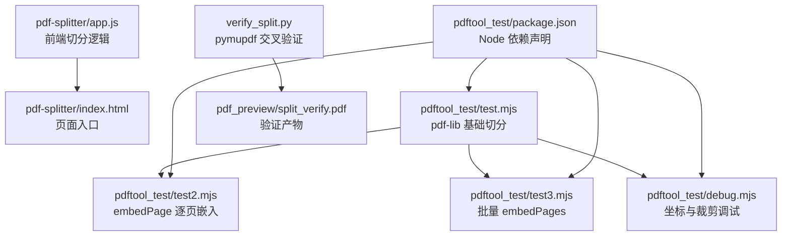
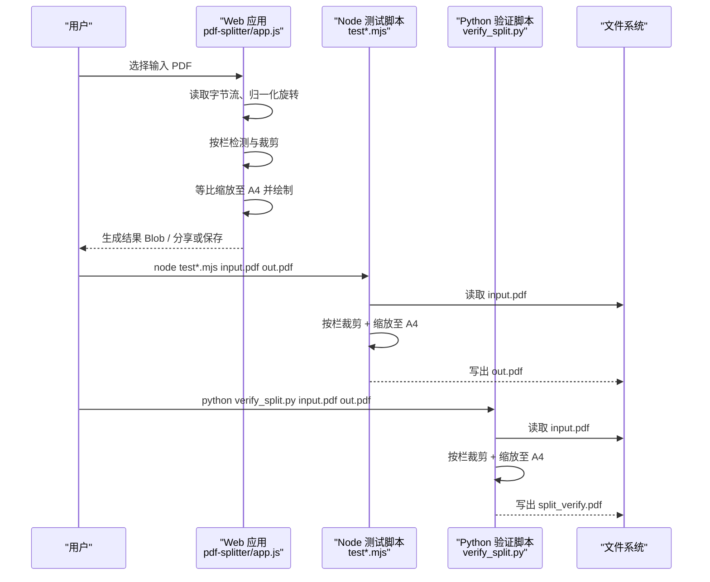
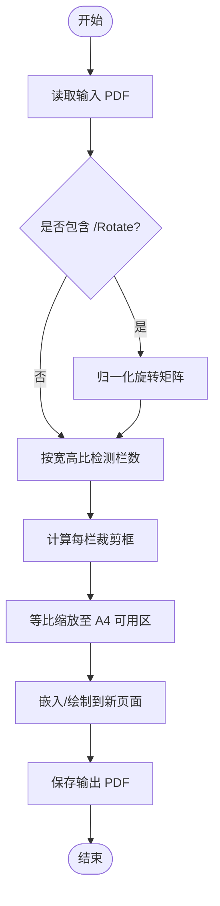
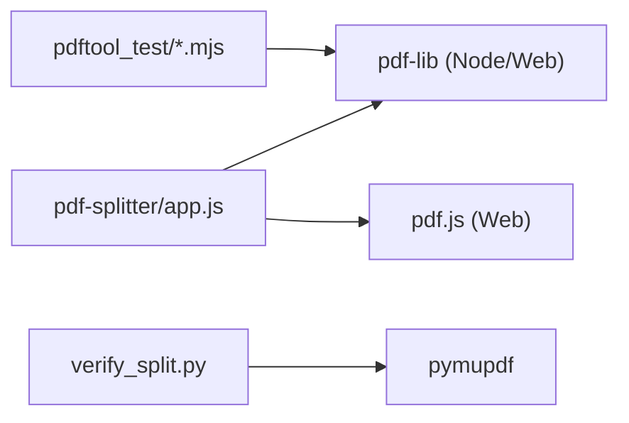

# 测试与验证

<cite>
**本文引用的文件**   
- [README.md](file://README.md)
- [app.js](file://pdf-splitter/app.js)
- [index.html](file://pdf-splitter/index.html)
- [package.json](file://pdftool_test/package.json)
- [test.mjs](file://pdftool_test/test.mjs)
- [debug.mjs](file://pdftool_test/debug.mjs)
- [test2.mjs](file://pdftool_test/test2.mjs)
- [test3.mjs](file://pdftool_test/test3.mjs)
- [verify_split.py](file://verify_split.py)
</cite>

## 目录
1. [引言](#引言)
2. [项目结构](#项目结构)
3. [核心组件](#核心组件)
4. [架构总览](#架构总览)
5. [详细组件分析](#详细组件分析)
6. [依赖关系分析](#依赖关系分析)
7. [性能考量](#性能考量)
8. [故障排查指南](#故障排查指南)
9. [结论](#结论)
10. [附录：测试清单与最佳实践](#附录测试清单与最佳实践)

## 引言
本文件面向“试卷切分助手”的测试与验证，目标是帮助读者在 Node.js 环境下搭建可复现的 PDF 处理测试环境，理解单元测试策略、集成测试方法、验证脚本用法，并给出持续集成与质量门禁建议。文档同时覆盖 PDF 处理逻辑的边界条件、异常场景、输出质量检查与内容完整性确认，以及常见问题定位方法。

## 项目结构
仓库中与测试和验证直接相关的部分集中在 `pdftool_test/` 与根目录下的 Python 验证脚本；Web 端主逻辑位于 `pdf-splitter/`，Android 壳工程位于 `android/`。

**图表来源**
- [app.js:1-577](file://pdf-splitter/app.js#L1-L577)
- [index.html:253-288](file://pdf-splitter/index.html#L253-L288)
- [test.mjs:1-56](file://pdftool_test/test.mjs#L1-L56)
- [test2.mjs:1-48](file://pdftool_test/test2.mjs#L1-L48)
- [test3.mjs:1-57](file://pdftool_test/test3.mjs#L1-L57)
- [debug.mjs:1-36](file://pdftool_test/debug.mjs#L1-L36)
- [verify_split.py:1-54](file://verify_split.py#L1-L54)
- [package.json:1-17](file://pdftool_test/package.json#L1-L17)

**章节来源**
- [README.md:13-22](file://README.md#L13-L22)
- [index.html:253-288](file://pdf-splitter/index.html#L253-L288)

## 核心组件
- Web 端切分引擎：基于 pdf-lib 进行栏裁剪与等比缩放至 A4，使用 pdf.js 做预览与渲染。
- Node 端测试脚本：提供三种不同实现路径（copyPages + setMediaBox/CropBox、embedPage、批量 embedPages），用于对比行为差异与优化空间。
- Python 交叉验证脚本：使用 pymupdf 独立实现相同算法，作为“参考实现”校验输出一致性。
- 依赖管理：Node 侧通过 `pdftool_test/package.json` 声明 pdf-lib 与 pdfjs-dist 依赖。

**章节来源**
- [app.js:401-508](file://pdf-splitter/app.js#L401-L508)
- [test.mjs:1-56](file://pdftool_test/test.mjs#L1-L56)
- [test2.mjs:1-48](file://pdftool_test/test2.mjs#L1-L48)
- [test3.mjs:1-57](file://pdftool_test/test3.mjs#L1-L57)
- [verify_split.py:1-54](file://verify_split.py#L1-L54)
- [package.json:12-15](file://pdftool_test/package.json#L12-L15)

## 架构总览
下图展示从输入 PDF 到输出 A4 切分结果的端到端流程，包括 Web 端与 Node/Python 验证路径。

**图表来源**
- [app.js:401-508](file://pdf-splitter/app.js#L401-L508)
- [test.mjs:18-55](file://pdftool_test/test.mjs#L18-L55)
- [test2.mjs:18-47](file://pdftool_test/test2.mjs#L18-L47)
- [test3.mjs:18-56](file://pdftool_test/test3.mjs#L18-L56)
- [verify_split.py:27-52](file://verify_split.py#L27-L52)

## 详细组件分析

### Node.js 测试环境与运行
- 依赖安装
  - 进入 `pdftool_test/`，执行包管理器安装命令以安装 `pdf-lib` 与 `pdfjs-dist`。
  - 依赖版本由 `package.json` 锁定，确保可重复构建。
- 运行测试脚本
  - 基础切分：`node test.mjs [输入PDF] [输出PDF]`，默认读取同目录 `input.pdf`，输出 `test_out.pdf`。
  - 逐页嵌入：`node test2.mjs [输入PDF] [输出PDF]`，输出 `test2_out.pdf`。
  - 批量嵌入：`node test3.mjs [输入PDF] [输出PDF]`，输出 `test3_out.pdf`。
  - 调试坐标：`node debug.mjs [输入PDF] [输出PDF]`，输出 `debug.pdf`，用于核对 MediaBox/CropBox 与分割线位置。
- 调试工具
  - 使用 Node 内置调试器：`node --inspect-brk pdftool_test/test.mjs`，配合 IDE 断点调试。
  - 使用浏览器 DevTools 调试 Web 端：在 Android Debug 包下访问 `chrome://inspect` 审查 WebView 页面。

**章节来源**
- [package.json:1-17](file://pdftool_test/package.json#L1-L17)
- [test.mjs:7-16](file://pdftool_test/test.mjs#L7-L16)
- [test2.mjs:7-16](file://pdftool_test/test2.mjs#L7-L16)
- [test3.mjs:7-16](file://pdftool_test/test3.mjs#L7-L16)
- [debug.mjs:7-16](file://pdftool_test/debug.mjs#L7-L16)
- [README.md:56-56](file://README.md#L56-L56)

### 单元测试策略与 PDF 处理逻辑验证
- 单元目标
  - 验证“按栏检测”逻辑：根据页面宽高比判断 2 栏或 3 栏。
  - 验证“裁剪框计算”：每栏宽度为整页宽度的等分，支持整体微调偏移。
  - 验证“A4 缩放与居中”：在保留边距前提下等比缩放，保证内容不超出可用区。
  - 验证“旋转归一化”：对带 `/Rotate` 的扫描件先归一化再处理，避免坐标系不一致。
- 关键断言
  - 输出页数 = 输入页数 × 栏数。
  - 输出页面尺寸接近 A4（允许微小浮点误差）。
  - 输出文件大小合理，未出现异常膨胀。
  - 多实现路径（copyPages、embedPage、embedPages）输出一致。
- 边界条件
  - 单栏页面（比例 < 1.2）。
  - 两栏页面（比例 ≥ 1.2 且 < 1.85）。
  - 三栏页面（比例 ≥ 1.85）。
  - 极端宽高比与超大/超小页面。
  - 加密 PDF（脚本忽略加密加载，需提前解密）。
- 异常情况
  - 输入文件不存在：脚本应报错退出。
  - 非法 PDF：抛出解析错误。
  - 内存不足：大文件一次性嵌入可能导致峰值偏高。

**图表来源**
- [app.js:401-508](file://pdf-splitter/app.js#L401-L508)
- [test.mjs:21-55](file://pdftool_test/test.mjs#L21-L55)
- [test2.mjs:21-47](file://pdftool_test/test2.mjs#L21-L47)
- [test3.mjs:21-56](file://pdftool_test/test3.mjs#L21-L56)
- [verify_split.py:17-52](file://verify_split.py#L17-L52)

**章节来源**
- [app.js:401-508](file://pdf-splitter/app.js#L401-L508)
- [test.mjs:21-55](file://pdftool_test/test.mjs#L21-L55)
- [test2.mjs:21-47](file://pdftool_test/test2.mjs#L21-L47)
- [test3.mjs:21-56](file://pdftool_test/test3.mjs#L21-L56)
- [verify_split.py:17-52](file://verify_split.py#L17-L52)

### 集成测试方法
- 端到端流程测试
  - Web 端：打开 `pdf-splitter/index.html`，选择输入 PDF，执行切分，下载或分享结果，验证输出页数、尺寸与内容。
  - Android 端：安装 Debug APK，使用 Chrome `chrome://inspect` 调试 WebView，验证文件选择、预览、切分、保存、查看、分享全流程。
- 多平台兼容性验证
  - 浏览器：Chrome、Edge、Firefox 等现代浏览器离线使用。
  - Android：minSdk 29，已在指定机型实测。
- 性能基准测试
  - 观察进度条与耗时：大文件（几百页）一次性嵌入时内存峰值偏高；预览复用位图可显著降低栅格化次数。
  - 指标建议：处理时间、输出文件大小、内存占用峰值。

**章节来源**
- [README.md:37-56](file://README.md#L37-L56)
- [README.md:77-90](file://README.md#L77-L90)
- [app.js:465-480](file://pdf-splitter/app.js#L465-L480)

### 验证脚本使用
- Node 端脚本
  - `test.mjs`：使用 copyPages + setMediaBox/CropBox 方式切分，适合快速验证基本流程。
  - `test2.mjs`：使用 embedPage 逐页嵌入，便于比较 API 行为差异。
  - `test3.mjs`：使用批量 embedPages，减少对象创建开销，适合大文件优化。
- Python 端脚本
  - `verify_split.py`：使用 pymupdf 独立实现相同算法，输出 `pdf_preview/split_verify.pdf`，用于交叉验证。
- 输出质量检查
  - 页数正确性：输出页数 = 输入页数 × 栏数。
  - 格式正确性：输出为合法 PDF，可在阅读器中正常打开。
  - 内容完整性：每栏内容完整无截断，文字清晰可读。
  - 尺寸与边距：页面接近 A4，边距符合预期。

**章节来源**
- [test.mjs:18-55](file://pdftool_test/test.mjs#L18-L55)
- [test2.mjs:18-47](file://pdftool_test/test2.mjs#L18-L47)
- [test3.mjs:18-56](file://pdftool_test/test3.mjs#L18-L56)
- [verify_split.py:27-52](file://verify_split.py#L27-L52)

## 依赖关系分析
- Node 依赖
  - `pdf-lib`：PDF 文档创建、页面复制、嵌入与保存。
  - `pdfjs-dist`：PDF 解析与预览（Web 端主要依赖）。
- Python 依赖
  - `pymupdf`：独立 PDF 处理库，用于交叉验证。
- 耦合与内聚
  - Web 端与 Node 端共享相同的“按栏检测 + 缩放至 A4”算法，但实现细节存在差异，需通过交叉验证确保一致性。
  - Android 壳工程仅负责系统能力桥接，业务逻辑集中于 Web 端。

**图表来源**
- [app.js:1-11](file://pdf-splitter/app.js#L1-L11)
- [package.json:12-15](file://pdftool_test/package.json#L12-L15)
- [verify_split.py:6-6](file://verify_split.py#L6-L6)

**章节来源**
- [package.json:12-15](file://pdftool_test/package.json#L12-L15)
- [verify_split.py:6-6](file://verify_split.py#L6-L6)

## 性能考量
- 大文件处理
  - 一次性嵌入所有页面会导致内存峰值升高，建议分批处理或流式写入（若未来扩展）。
- 预览复用
  - 已渲染的页面位图可直接复用，避免重复栅格化，显著降低耗时。
- 对象流优化
  - 使用 `useObjectStreams: true` 可减少输出文件大小。
- 白边裁剪
  - 白边检测需要逐页栅格化，耗时与页数线性相关；预览命中后可跳过重复渲染。

**章节来源**
- [README.md:81-90](file://README.md#L81-L90)
- [app.js:465-480](file://pdf-splitter/app.js#L465-L480)

## 故障排查指南
- 环境问题
  - Node 版本过低：确保支持 ES Modules（`import/export`）。
  - Python 环境缺失 pymupdf：通过包管理器安装。
- 依赖冲突
  - pdf-lib 与 pdfjs-dist 版本不匹配：遵循 `package.json` 中声明的版本。
- 测试结果解读
  - 输出页数不符：检查栏检测阈值与输入页面比例。
  - 内容被截断：检查裁剪框计算与缩放比例。
  - 文件无法打开：检查 PDF 合法性与编码选项。
- 常见错误
  - 输入文件不存在：脚本会打印错误信息并退出。
  - 加密 PDF：脚本忽略加密加载，需提前解密。
  - 内存不足：大文件处理时注意系统内存限制。

**章节来源**
- [test.mjs:12-16](file://pdftool_test/test.mjs#L12-L16)
- [test2.mjs:12-16](file://pdftool_test/test2.mjs#L12-L16)
- [test3.mjs:12-16](file://pdftool_test/test3.mjs#L12-L16)
- [debug.mjs:12-16](file://pdftool_test/debug.mjs#L12-L16)
- [verify_split.py:13-15](file://verify_split.py#L13-L15)

## 结论
本项目通过 Web 端与 Node/Python 多实现路径的交叉验证，确保了 PDF 切分逻辑的一致性与鲁棒性。测试环境搭建简单，脚本易于复用，适合自动化与持续集成。建议在 CI 中引入自动化测试、性能基准与质量门禁，进一步提升交付质量。

## 附录：测试清单与最佳实践
- 自动化测试框架
  - 使用 Node 原生模块编写轻量测试用例，无需引入重型框架。
  - 将 `test.mjs`、`test2.mjs`、`test3.mjs` 作为回归测试套件。
- 持续集成配置
  - 在 GitHub Actions 或 GitLab CI 中安装依赖并运行测试脚本。
  - 缓存依赖以提升构建速度。
- 质量门禁设置
  - 输出页数必须等于输入页数 × 栏数。
  - 输出文件大小不得异常膨胀。
  - Python 交叉验证结果与 Node 结果一致（页数、尺寸、文件大小相近）。
- 测试数据管理
  - 使用 `.gitignore` 排除真实试卷与输出文件，避免误提交。
  - 准备多种比例与复杂度的测试样本，覆盖边界条件。

**章节来源**
- [README.md:13-22](file://README.md#L13-L22)
- [package.json:1-17](file://pdftool_test/package.json#L1-L17)