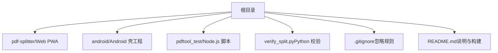
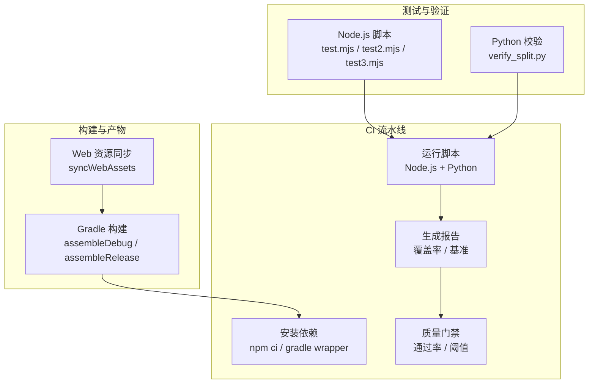
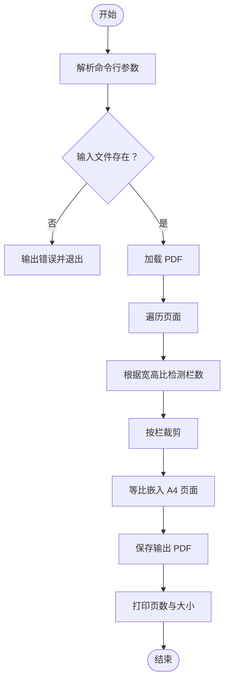
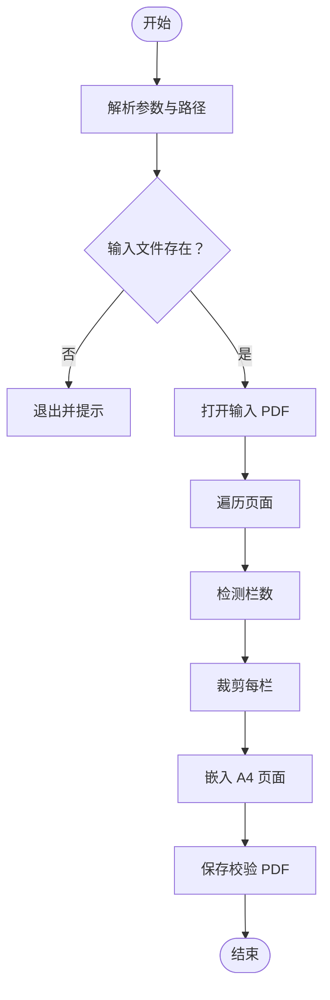
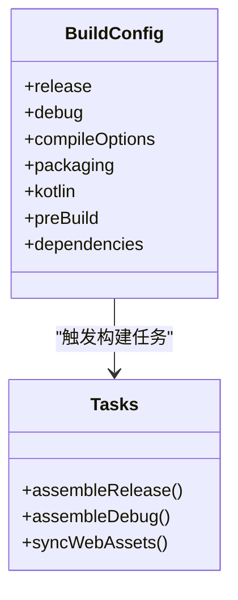
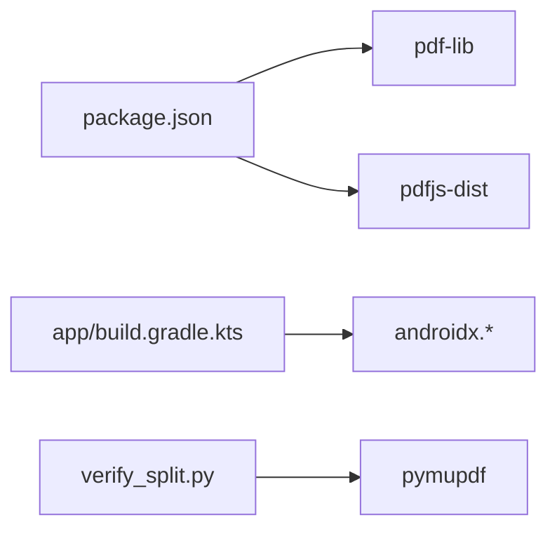
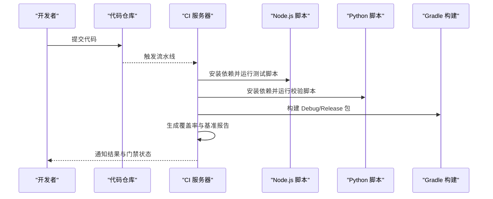

# 质量保证

<cite>
**本文引用的文件**   
- [README.md](file://README.md)
- [.gitignore](file://.gitignore)
- [pdftool_test/package.json](file://pdftool_test/package.json)
- [pdftool_test/test.mjs](file://pdftool_test/test.mjs)
- [pdftool_test/debug.mjs](file://pdftool_test/debug.mjs)
- [pdftool_test/test2.mjs](file://pdftool_test/test2.mjs)
- [pdftool_test/test3.mjs](file://pdftool_test/test3.mjs)
- [verify_split.py](file://verify_split.py)
- [android/app/build.gradle.kts](file://android/app/build.gradle.kts)
- [android/gradle.properties](file://android/gradle.properties)
</cite>

## 目录
1. [引言](#引言)
2. [项目结构](#项目结构)
3. [核心组件](#核心组件)
4. [架构总览](#架构总览)
5. [详细组件分析](#详细组件分析)
6. [依赖关系分析](#依赖关系分析)
7. [性能与基准](#性能与基准)
8. [持续集成与质量门禁](#持续集成与质量门禁)
9. [问题跟踪与修复流程](#问题跟踪与修复流程)
10. [结论](#结论)

## 引言
本文件面向“试卷切分助手”项目的质量保证体系，目标是在现有仓库基础上，系统化地搭建自动化测试、代码质量检查、持续集成与发布门禁，并给出可落地的实践示例。当前仓库已具备：
- Web PWA 本体与 Android 壳工程；
- Node.js 侧的 PDF 处理脚本（基于 pdf-lib）；
- Python 侧的验证脚本（基于 pymupdf）；
- Gradle 构建配置与资源同步任务。

本文将围绕这些既有资产，设计端到端的质量保证方案，包括测试环境、依赖管理、CI 流水线、静态检查、覆盖率统计、性能基准、版本发布门禁、回归策略以及问题跟踪与修复流程。

## 项目结构
仓库采用多语言、多模块组织方式：
- `pdf-splitter/`：Web PWA 本体，包含 HTML、JS 与本地化依赖；
- `android/`：Android 壳工程，负责 WebView 桥接、文件选择、结果保存与分享；
- `pdftool_test/`：Node.js 侧 PDF 处理与验证脚本；
- `verify_split.py`：Python 侧校验脚本；
- 根级 `.gitignore` 与 `README.md` 提供构建与使用说明。

**图表来源**
- [README.md:13-22](file://README.md#L13-L22)
- [.gitignore:1-33](file://.gitignore#L1-L33)

**章节来源**
- [README.md:13-22](file://README.md#L13-L22)
- [.gitignore:1-33](file://.gitignore#L1-L33)

## 核心组件
本节聚焦质量保证相关的关键组件与职责：
- Node.js 测试脚本：用于对 PDF 进行栏数识别、裁剪、嵌入 A4 页面等处理逻辑的验证；
- Python 校验脚本：使用不同库实现相同逻辑，作为交叉验证手段；
- Android 构建配置：定义编译选项、打包类型与资源同步任务；
- 依赖管理：Node.js 使用 npm 包管理，Android 使用 Gradle。

**章节来源**
- [pdftool_test/test.mjs:1-56](file://pdftool_test/test.mjs#L1-L56)
- [pdftool_test/debug.mjs:1-36](file://pdftool_test/debug.mjs#L1-L36)
- [pdftool_test/test2.mjs:1-48](file://pdftool_test/test2.mjs#L1-L48)
- [pdftool_test/test3.mjs:1-57](file://pdftool_test/test3.mjs#L1-L57)
- [verify_split.py:1-54](file://verify_split.py#L1-L54)
- [android/app/build.gradle.kts:51-84](file://android/app/build.gradle.kts#L51-L84)
- [android/gradle.properties:1-13](file://android/gradle.properties#L1-L13)

## 架构总览
质量保证体系由三层构成：
- 单元测试层：Node.js 脚本对 PDF 处理逻辑进行断言与对比；
- 集成测试层：Android 构建产物在设备或模拟器上执行端到端流程；
- 持续集成层：在 CI 中自动运行脚本、生成报告、执行门禁。

**图表来源**
- [pdftool_test/test.mjs:1-56](file://pdftool_test/test.mjs#L1-L56)
- [verify_split.py:1-54](file://verify_split.py#L1-L54)
- [android/app/build.gradle.kts:78-84](file://android/app/build.gradle.kts#L78-L84)
- [android/gradle.properties:1-13](file://android/gradle.properties#L1-L13)

## 详细组件分析

### Node.js PDF 处理脚本
- 功能要点：
  - 读取输入 PDF，按页面宽高比判断栏数（≥1.85 为三栏，≥1.2 为两栏，否则一栏）；
  - 将每栏裁剪后等比嵌入 A4 页面，保留边距；
  - 输出新 PDF 并打印页数与文件大小。
- 关键路径：
  - 参数解析与默认输入输出路径；
  - 错误处理（找不到输入文件时退出）；
  - 页面遍历与栏分割；
  - 缩放计算与绘制。

**图表来源**
- [pdftool_test/test.mjs:1-56](file://pdftool_test/test.mjs#L1-L56)
- [pdftool_test/test2.mjs:1-48](file://pdftool_test/test2.mjs#L1-L48)
- [pdftool_test/test3.mjs:1-57](file://pdftool_test/test3.mjs#L1-L57)

**章节来源**
- [pdftool_test/test.mjs:1-56](file://pdftool_test/test.mjs#L1-L56)
- [pdftool_test/test2.mjs:1-48](file://pdftool_test/test2.mjs#L1-L48)
- [pdftool_test/test3.mjs:1-57](file://pdftool_test/test3.mjs#L1-L57)

### Python 校验脚本
- 功能要点：
  - 使用 pymupdf 打开输入 PDF，按页面比例检测栏数；
  - 逐栏裁剪并嵌入 A4，计算缩放比例与位置；
  - 输出校验 PDF 并打印页数与路径。
- 用途：
  - 与 Node.js 脚本形成交叉验证，确保不同库实现的一致性；
  - 便于在 Python 环境中快速验证算法正确性。

**图表来源**
- [verify_split.py:1-54](file://verify_split.py#L1-L54)

**章节来源**
- [verify_split.py:1-54](file://verify_split.py#L1-L54)

### Android 构建与资源同步
- 构建类型：
  - release：启用签名配置；
  - debug：应用 ID 后缀与版本名后缀。
- 编译选项：
  - Java/Kotlin 目标版本为 17；
  - 关闭混淆（MinifyEnabled=false）。
- 资源同步：
  - preBuild 任务依赖 syncWebAssets，确保 Web 资源同步到 assets/www。
- Gradle 优化：
  - 并行构建与缓存开启；
  - JVM 参数与编码设置。

**图表来源**
- [android/app/build.gradle.kts:51-84](file://android/app/build.gradle.kts#L51-L84)
- [android/gradle.properties:1-13](file://android/gradle.properties#L1-L13)

**章节来源**
- [android/app/build.gradle.kts:51-84](file://android/app/build.gradle.kts#L51-L84)
- [android/gradle.properties:1-13](file://android/gradle.properties#L1-L13)

## 依赖关系分析
- Node.js 依赖：
  - pdf-lib：用于 PDF 创建、页面复制、嵌入与绘制；
  - pdfjs-dist：用于渲染与预览（在测试脚本中未直接调用，但属于项目依赖）。
- Android 依赖：
  - androidx.core、activity-ktx、webkit：WebView 与系统交互能力。
- Python 依赖：
  - pymupdf：用于 PDF 打开、裁剪与嵌入。

**图表来源**
- [pdftool_test/package.json:1-16](file://pdftool_test/package.json#L1-L16)
- [android/app/build.gradle.kts:80-84](file://android/app/build.gradle.kts#L80-L84)
- [verify_split.py:1-54](file://verify_split.py#L1-L54)

**章节来源**
- [pdftool_test/package.json:1-16](file://pdftool_test/package.json#L1-L16)
- [android/app/build.gradle.kts:80-84](file://android/app/build.gradle.kts#L80-L84)
- [verify_split.py:1-54](file://verify_split.py#L1-L54)

## 性能与基准
- 现有性能关注点：
  - 大文件一次性嵌入导致内存峰值偏高；
  - 裁白边需逐页栅格化，未预览到的页仍需一次 pdf.js 渲染；
  - 预览位图复用可减少重复渲染耗时。
- 建议的基准测试：
  - 以不同页数与分辨率的 PDF 作为输入，测量处理时间与内存占用；
  - 对比 Node.js 与 Python 实现的输出一致性与性能差异；
  - 在 CI 中记录基线数据，并在变更时进行回归比较。

[本节为通用指导，不直接分析具体文件]

## 持续集成与质量门禁

### 测试环境配置
- Node.js 环境：
  - 使用 npm ci 安装依赖；
  - 通过 node pdftool_test/test.mjs 等脚本执行 PDF 处理；
  - 可选引入 Jest/Mocha 框架，统一断言与报告格式。
- Python 环境：
  - 使用 pip 安装 pymupdf；
  - 运行 verify_split.py 进行交叉验证。
- Android 环境：
  - 使用 Gradle Wrapper 构建 Debug/Release 包；
  - 在模拟器或真机执行 UI 测试（可引入 Espresso）。

**章节来源**
- [pdftool_test/package.json:1-16](file://pdftool_test/package.json#L1-L16)
- [verify_split.py:1-54](file://verify_split.py#L1-L54)
- [android/app/build.gradle.kts:51-84](file://android/app/build.gradle.kts#L51-L84)

### 依赖管理
- Node.js：
  - 锁定依赖版本（package-lock.json）；
  - 在 CI 中使用 npm ci 确保可重现构建。
- Android：
  - 使用 Gradle Wrapper 与固定版本依赖；
  - 开启并行与缓存提升构建速度。

**章节来源**
- [pdftool_test/package.json:1-16](file://pdftool_test/package.json#L1-L16)
- [android/gradle.properties:1-13](file://android/gradle.properties#L1-L13)

### 持续集成流程
建议的 CI 步骤：
1. 检出代码；
2. 安装 Node.js 与 Python 环境；
3. 运行 Node.js 脚本（test.mjs/test2.mjs/test3.mjs）；
4. 运行 Python 校验脚本（verify_split.py）；
5. 构建 Android Debug 包；
6. 生成覆盖率与基准报告；
7. 执行质量门禁（通过率、覆盖率阈值、基准回归）。

**图表来源**
- [pdftool_test/test.mjs:1-56](file://pdftool_test/test.mjs#L1-L56)
- [verify_split.py:1-54](file://verify_split.py#L1-L54)
- [android/app/build.gradle.kts:51-84](file://android/app/build.gradle.kts#L51-L84)

**章节来源**
- [pdftool_test/test.mjs:1-56](file://pdftool_test/test.mjs#L1-L56)
- [verify_split.py:1-54](file://verify_split.py#L1-L54)
- [android/app/build.gradle.kts:51-84](file://android/app/build.gradle.kts#L51-L84)

### 代码质量检查工具
- 静态代码分析：
  - Node.js：ESLint + Prettier；
  - Python：flake8 + black；
  - Kotlin/Java：Detekt + SpotBugs。
- 代码覆盖率：
  - Node.js：Istanbul/nyc；
  - Python：coverage.py；
  - Android：JaCoCo。
- 性能基准：
  - Node.js：benchmark.js 或 autocannon；
  - Python：pytest-benchmark；
  - Android：Macrobenchmark。

[本节为通用指导，不直接分析具体文件]

### 版本发布前的质量门禁
- 自动化测试通过要求：
  - Node.js 脚本全部通过；
  - Python 校验脚本输出一致；
  - Android Debug/Release 构建成功。
- 代码审查流程：
  - Pull Request 必须至少一名 Reviewer 批准；
  - 分支保护规则禁止直接推送至主分支。
- 回归测试策略：
  - 针对历史问题用例建立回归套件；
  - 在 CI 中定期运行回归测试。

[本节为通用指导，不直接分析具体文件]

## 问题跟踪与修复流程

### Bug 报告模板
建议字段：
- 标题：简明描述问题；
- 复现步骤：逐步列出操作步骤；
- 期望行为：说明预期结果；
- 实际行为：描述实际结果；
- 环境信息：操作系统、浏览器/设备型号、版本号；
- 附件：截图、日志、输入 PDF 样例（脱敏）。

[本节为通用指导，不直接分析具体文件]

### 优先级分类
- P0（紧急）：影响核心功能或数据安全，需立即修复；
- P1（高）：影响主要功能，尽快修复；
- P2（中）：影响次要功能，计划内修复；
- P3（低）：体验优化或文档改进。

[本节为通用指导，不直接分析具体文件]

### 修复验证方法
- 单元测试：新增或更新对应用例；
- 集成测试：在 CI 中运行端到端流程；
- 回归测试：确保历史用例仍通过；
- 用户验收：在预发环境进行人工验证。

[本节为通用指导，不直接分析具体文件]

## 结论
本项目已具备基础的 PDF 处理脚本与 Android 构建能力。通过引入标准化的测试框架、静态检查、覆盖率统计与性能基准，并结合 CI 流水线与质量门禁，可以显著提升代码质量与交付稳定性。建议在后续迭代中完善测试覆盖、强化回归策略，并持续优化构建与验证效率。

[本节为总结性内容，不直接分析具体文件]