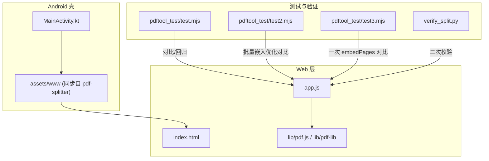
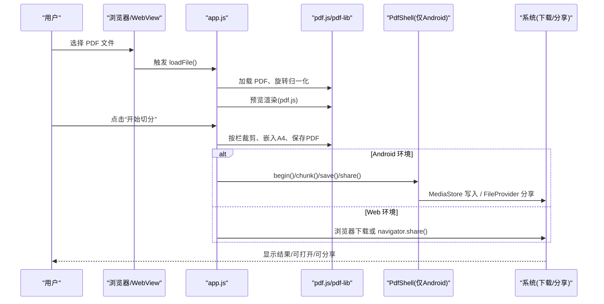
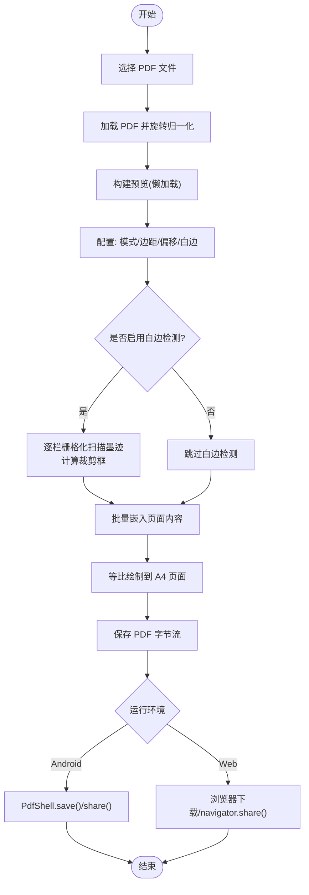
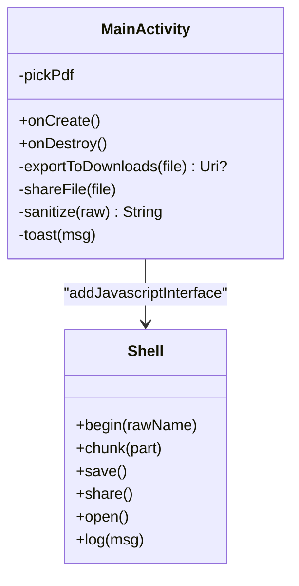
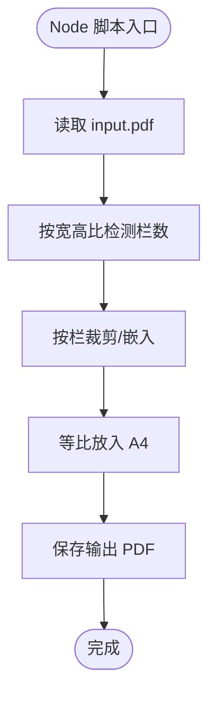
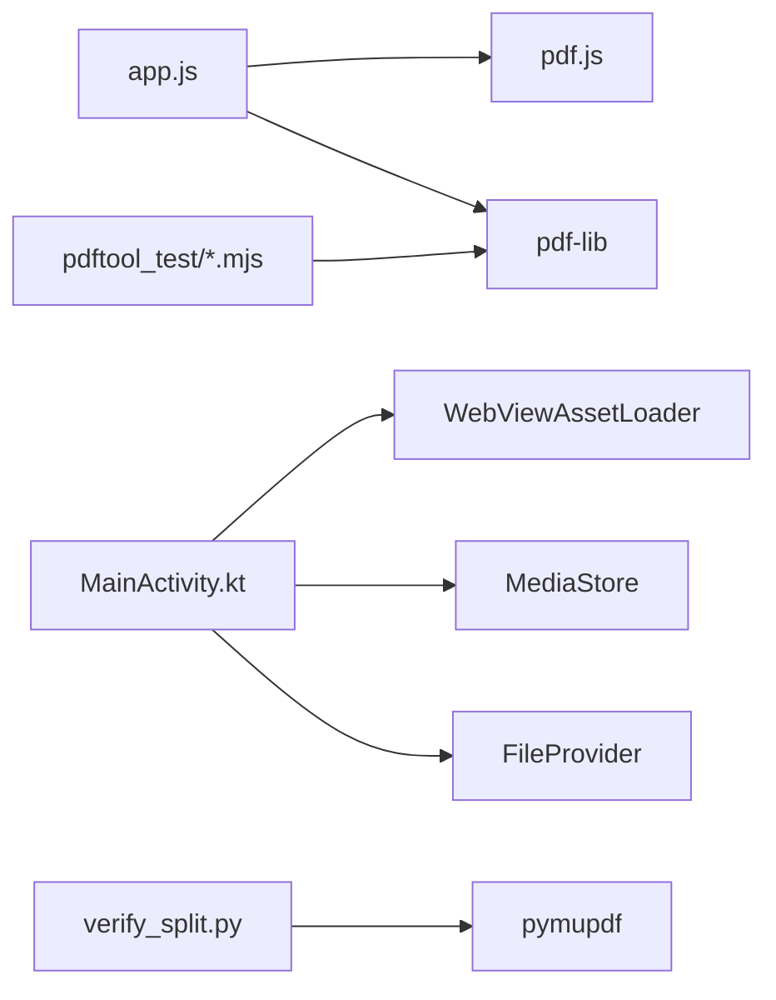

# 集成测试

<cite>
**本文引用的文件**   
- [README.md](file://README.md)
- [app.js](file://pdf-splitter/app.js)
- [MainActivity.kt](file://android/app/src/main/java/com/pdfsplitter/app/MainActivity.kt)
- [test.mjs](file://pdftool_test/test.mjs)
- [debug.mjs](file://pdftool_test/debug.mjs)
- [test2.mjs](file://pdftool_test/test2.mjs)
- [test3.mjs](file://pdftool_test/test3.mjs)
- [verify_split.py](file://verify_split.py)
</cite>

## 目录
1. [引言](#引言)
2. [项目结构](#项目结构)
3. [核心组件](#核心组件)
4. [架构总览](#架构总览)
5. [详细组件分析](#详细组件分析)
6. [依赖关系分析](#依赖关系分析)
7. [性能与基准测试方法](#性能与基准测试方法)
8. [多平台兼容性验证策略](#多平台兼容性验证策略)
9. [调试与排障指南](#调试与排障指南)
10. [端到端集成测试脚本示例](#端到端集成测试脚本示例)
11. [结论](#结论)

## 引言
本文件面向“试卷切分助手”的集成测试，目标是覆盖从用户选择 PDF 到结果输出、保存或分享的完整流程；同时给出 Web 浏览器与 Android WebView 环境下的兼容性验证方案、大文件处理与并发能力的性能基准方法，以及日志、错误追踪与性能分析的调试手段。文档中的实现细节均基于仓库现有代码与脚本，不引入外部假设。

## 项目结构
仓库包含以下关键部分：
- pdf-splitter：Web PWA 本体，使用 pdf.js 预览、pdf-lib 裁剪并生成 A4 页面。
- android：Android 壳工程（Kotlin + WebView），负责文件选择、本地保存、系统分享与原生桥接。
- pdftool_test：Node.js 侧的 PDF 处理参考脚本，用于离线验证与回归对比。
- verify_split.py：Python 侧的独立校验脚本，用于二次验证输出质量。
- README.md：项目说明、安装构建与已知限制。

图表来源
- [README.md:13-22](file://README.md#L13-L22)
- [MainActivity.kt:31-49](file://android/app/src/main/java/com/pdfsplitter/app/MainActivity.kt#L31-L49)
- [app.js:1-11](file://pdf-splitter/app.js#L1-L11)

章节来源
- [README.md:13-22](file://README.md#L13-L22)

## 核心组件
- Web 前端逻辑（pdf-splitter/app.js）
  - 负责文件加载、旋转归一化、栏数检测、预览渲染、白边检测、按栏裁剪、等比放入 A4、结果保存/分享。
  - 通过 window.PdfShell 与 Android 原生桥接，在移动端走 MediaStore 写入下载目录与系统分享。
- Android 壳（android/.../MainActivity.kt）
  - 提供 WebViewAssetLoader 资源访问、系统文件选择器回调、PdfShell 桥接口、MediaStore 写入、FileProvider 分享、阅读器定向打开。
- Node.js 测试脚本（pdftool_test/*.mjs）
  - 模拟主流程：读取 PDF、按栏裁剪、等比放入 A4、保存输出，用于离线回归与性能对比。
- Python 校验脚本（verify_split.py）
  - 使用 pymupdf 独立实现相同逻辑，作为第三方工具链的交叉验证。

章节来源
- [app.js:1-11](file://pdf-splitter/app.js#L1-L11)
- [MainActivity.kt:31-49](file://android/app/src/main/java/com/pdfsplitter/app/MainActivity.kt#L31-L49)
- [test.mjs:1-16](file://pdftool_test/test.mjs#L1-L16)
- [verify_split.py:1-15](file://verify_split.py#L1-L15)

## 架构总览
端到端流程分为两条路径：
- Web 浏览器路径：index.html → app.js → pdf.js/pdf-lib → 浏览器下载或系统分享。
- Android WebView 路径：MainActivity.kt → WebViewAssetLoader → assets/www/index.html → app.js → PdfShell 桥 → MediaStore/FileProvider。

图表来源
- [app.js:204-239](file://pdf-splitter/app.js#L204-L239)
- [app.js:412-508](file://pdf-splitter/app.js#L412-L508)
- [MainActivity.kt:103-151](file://android/app/src/main/java/com/pdfsplitter/app/MainActivity.kt#L103-L151)
- [MainActivity.kt:166-261](file://android/app/src/main/java/com/pdfsplitter/app/MainActivity.kt#L166-L261)

## 详细组件分析

### Web 前端处理流程（app.js）
- 文件选择与加载
  - 监听文件输入与拖拽区域，校验 PDF 类型后读取 ArrayBuffer，调用 pdf-lib 加载并进行旋转归一化。
- 旋转归一化
  - 检测页面 Rotate 值，必要时将内容矩阵烘焙进新文档，避免预览与裁剪坐标系不一致。
- 预览与懒加载
  - 使用 IntersectionObserver 懒渲染可见页，复用已绘制位图以加速白边检测。
- 白边检测与裁剪
  - 可选开启“裁掉白边”，对每栏栅格化扫描墨迹最小矩形，得到更紧的裁剪框；未检测到墨迹则回退整栏。
- 生成 A4 输出
  - 按栏计算缩放比例，等比放入 A4 纵向页面，支持左右/上下边距滑块与整体微调偏移。
- 结果保存与分享
  - Android 下通过 PdfShell 分块 base64 传输，原生写入下载目录并回传真实路径；Web 下直接下载或使用系统分享。

图表来源
- [app.js:57-103](file://pdf-splitter/app.js#L57-L103)
- [app.js:105-193](file://pdf-splitter/app.js#L105-L193)
- [app.js:204-239](file://pdf-splitter/app.js#L204-L239)
- [app.js:412-508](file://pdf-splitter/app.js#L412-L508)

章节来源
- [app.js:57-103](file://pdf-splitter/app.js#L57-L103)
- [app.js:105-193](file://pdf-splitter/app.js#L105-L193)
- [app.js:204-239](file://pdf-splitter/app.js#L204-L239)
- [app.js:412-508](file://pdf-splitter/app.js#L412-L508)

### Android 壳与桥接（MainActivity.kt）
- WebViewAssetLoader
  - 将 assets/www 资源以 https://appassets.androidplatform.net/assets/www/ 暴露，解决 file:// 下 pdf.js worker 加载失败问题。
- 文件选择器
  - onShowFileChooser 回调系统 OpenDocument，保留原始文件名并复制到缓存目录供页面使用。
- PdfShell 桥
  - begin/chunk/save/share/log：分块 base64 传输大文件，写入临时文件，最终保存到“下载/试卷切分”，或通过 FileProvider 发起分享。
- 阅读器定向打开
  - 优先匹配白名单中的阅读器包名，否则退回系统选择器。

图表来源
- [MainActivity.kt:85-151](file://android/app/src/main/java/com/pdfsplitter/app/MainActivity.kt#L85-L151)
- [MainActivity.kt:166-261](file://android/app/src/main/java/com/pdfsplitter/app/MainActivity.kt#L166-L261)
- [MainActivity.kt:264-299](file://android/app/src/main/java/com/pdfsplitter/app/MainActivity.kt#L264-L299)

章节来源
- [MainActivity.kt:85-151](file://android/app/src/main/java/com/pdfsplitter/app/MainActivity.kt#L85-L151)
- [MainActivity.kt:166-261](file://android/app/src/main/java/com/pdfsplitter/app/MainActivity.kt#L166-L261)
- [MainActivity.kt:264-299](file://android/app/src/main/java/com/pdfsplitter/app/MainActivity.kt#L264-L299)

### Node.js 参考脚本（pdftool_test）
- test.mjs
  - 基础流程：复制页面、设置 MediaBox/CropBox、嵌入临时页、再绘制到 A4，最后删除临时页。
- test2.mjs
  - 直接对原页进行 embedPage 并按栏裁剪，适合单页级对比。
- test3.mjs
  - 一次性收集所有栏的 embedPages 参数，批量嵌入以提升效率，便于与前端流程对齐。

图表来源
- [test.mjs:18-55](file://pdftool_test/test.mjs#L18-L55)
- [test2.mjs:18-47](file://pdftool_test/test2.mjs#L18-L47)
- [test3.mjs:18-56](file://pdftool_test/test3.mjs#L18-L56)

章节来源
- [test.mjs:18-55](file://pdftool_test/test.mjs#L18-L55)
- [test2.mjs:18-47](file://pdftool_test/test2.mjs#L18-L47)
- [test3.mjs:18-56](file://pdftool_test/test3.mjs#L18-L56)

### Python 校验脚本（verify_split.py）
- 使用 pymupdf 独立实现相同的栏检测与裁剪逻辑，输出到 pdf_preview/split_verify.pdf，用于交叉验证。

章节来源
- [verify_split.py:17-50](file://verify_split.py#L17-L50)

## 依赖关系分析
- Web 层依赖
  - pdf.js：解析与预览 PDF，支持 worker 线程。
  - pdf-lib：矢量操作、裁剪、嵌入、保存 PDF。
- Android 层依赖
  - WebViewAssetLoader：本地资源映射。
  - MediaStore：写入下载目录。
  - FileProvider：系统分享。
  - 系统 Activity：OpenDocument、ACTION_VIEW、ACTION_SEND。
- 测试层依赖
  - Node.js：pdf-lib 命令行式处理。
  - Python：pymupdf 独立校验。

图表来源
- [app.js:1-11](file://pdf-splitter/app.js#L1-L11)
- [MainActivity.kt:103-151](file://android/app/src/main/java/com/pdfsplitter/app/MainActivity.kt#L103-L151)
- [MainActivity.kt:264-299](file://android/app/src/main/java/com/pdfsplitter/app/MainActivity.kt#L264-L299)
- [test.mjs:1-5](file://pdftool_test/test.mjs#L1-L5)
- [verify_split.py:1-10](file://verify_split.py#L1-L10)

章节来源
- [app.js:1-11](file://pdf-splitter/app.js#L1-L11)
- [MainActivity.kt:103-151](file://android/app/src/main/java/com/pdfsplitter/app/MainActivity.kt#L103-L151)
- [test.mjs:1-5](file://pdftool_test/test.mjs#L1-L5)
- [verify_split.py:1-10](file://verify_split.py#L1-L10)

## 性能与基准测试方法
- 大文件处理速度测试
  - 使用 Node.js 脚本（test.mjs/test2.mjs/test3.mjs）对同一份大文件执行不同策略：
    - test.mjs：先 copyPages 再 setMediaBox/CropBox，最后 embedPages，观察中间步骤耗时。
    - test2.mjs：直接 embedPage 逐栏处理，便于对比单页开销。
    - test3.mjs：一次性 collect 所有栏的 embedPages 参数，批量嵌入，评估批处理收益。
  - 记录输出页数与文件大小，比较三种方式的运行时间与产物体积。
- 内存使用监控
  - 前端：app.js 中 trimBands 会创建 canvas 并 getImageData，注意及时释放（canvas.width = canvas.height = 0）。
  - Android：MainActivity.kt 在 begin/chunk/save 流程中使用缓存目录临时文件，避免一次性占用过多内存。
- 并发处理能力评估
  - 前端：IntersectionObserver 懒加载渲染，处理中暂停渲染队列，完成后补渲染可见项。
  - Node.js：可并行加载多个样本文件，分别统计时间，评估 CPU/IO 瓶颈。
- 指标建议
  - 时间：首帧预览时间、白边检测耗时、embedPages 耗时、保存耗时。
  - 内存：峰值 RSS、Canvas 对象数量、临时文件大小。
  - 稳定性：大文件（几百页扫描件）是否 OOM、是否出现卡顿或崩溃。

章节来源
- [app.js:153-193](file://pdf-splitter/app.js#L153-L193)
- [MainActivity.kt:166-261](file://android/app/src/main/java/com/pdfsplitter/app/MainActivity.kt#L166-L261)
- [test.mjs:18-55](file://pdftool_test/test.mjs#L18-L55)
- [test2.mjs:18-47](file://pdftool_test/test2.mjs#L18-L47)
- [test3.mjs:18-56](file://pdftool_test/test3.mjs#L18-L56)

## 多平台兼容性验证策略
- Web 浏览器环境测试
  - 直接双击 index.html 离线使用，或通过 python -m http.server 启动本地服务，在 Chrome 中安装为 PWA。
  - 验证点：文件选择、预览、切分、下载、系统分享（若可用）、旋转校正、白边检测。
- Android WebView 环境测试
  - 使用 debug 包并通过 chrome://inspect 审查页面、查看 console。
  - 验证点：WebViewAssetLoader 资源加载、系统文件选择器回调、PdfShell 桥 save/share/open、MediaStore 写入路径、FileProvider 分享、阅读器定向打开。
- 设备分辨率适配验证
  - 在不同屏幕尺寸与 DPI 设备上验证预览缩放、切分线位置、A4 输出缩放比例是否正确。
  - 重点检查：左右/上下边距滑块效果、shift 全局微调、自动栏数识别阈值（≥1.85 三栏、≥1.2 两栏）。

章节来源
- [README.md:37-56](file://README.md#L37-L56)
- [MainActivity.kt:85-151](file://android/app/src/main/java/com/pdfsplitter/app/MainActivity.kt#L85-L151)
- [MainActivity.kt:222-256](file://android/app/src/main/java/com/pdfsplitter/app/MainActivity.kt#L222-L256)
- [app.js:45-54](file://pdf-splitter/app.js#L45-L54)

## 调试与排障指南
- 日志记录
  - Android：MainActivity.kt 提供 Shell.log(msg)，统一打印到 TAG “PdfSplitter”。
  - Web：app.js 多处 console.error 输出渲染与处理异常。
- 错误追踪
  - 前端：loadFile/process 捕获异常并 alert 提示；trimBands 捕获渲染失败并降级。
  - Android：exportToDownloads/shareFile 捕获异常并 toast 提示；open 捕获无可用阅读器情况。
- 性能分析
  - 前端：使用浏览器 Performance 面板观察渲染与 JS 执行；关注 IntersectionObserver 与 renderVisiblePending。
  - Android：使用 Android Studio Profiler 观察 WebView 内存与 CPU；结合 Logcat 过滤 “PdfSplitter”。
- 常见问题
  - 加密 PDF：前端提示需先去除密码；Node 脚本忽略加密但可能影响后续处理。
  - 大文件内存峰值：trimBands 会栅格化，注意及时释放 canvas；Android 使用分块 base64 传输避免单次桥调用过大。

章节来源
- [app.js:234-238](file://pdf-splitter/app.js#L234-L238)
- [app.js:497-507](file://pdf-splitter/app.js#L497-L507)
- [MainActivity.kt:194-208](file://android/app/src/main/java/com/pdfsplitter/app/MainActivity.kt#L194-L208)
- [MainActivity.kt:282-291](file://android/app/src/main/java/com/pdfsplitter/app/MainActivity.kt#L282-L291)

## 端到端集成测试脚本示例
以下示例展示如何自动化执行完整的 PDF 处理流程并验证结果质量。示例命令不包含具体代码内容，仅描述步骤与预期。

- Node.js 基准对比
  - 准备输入文件：将待测试卷保存为 pdftool_test/input.pdf。
  - 执行基础流程：node pdftool_test/test.mjs [输入] [输出]，记录输出页数与文件大小。
  - 执行直接嵌入流程：node pdftool_test/test2.mjs [输入] [输出]，对比耗时与体积。
  - 执行批量嵌入流程：node pdftool_test/test3.mjs [输入] [输出]，评估批处理收益。
  - 断言：输出页数应与输入栏数一致；文件大小应在合理区间；无异常退出码。
- Python 交叉验证
  - 执行 python verify_split.py [输入] [输出]，生成 pdf_preview/split_verify.pdf。
  - 断言：输出页数与 Node 脚本一致；打开 PDF 后视觉内容与前端预览一致。
- Android 端到端
  - 构建 debug 包：cd android && ./gradlew :app:assembleDebug。
  - 安装到设备，打开 App，选择 PDF，执行切分，点击“保存到本地”，确认路径显示正确。
  - 点击“查看文件”，优先命中白名单阅读器；若无，退回系统选择器。
  - 点击“分享”，通过 FileProvider 唤起系统分享，不写入下载目录。
  - 断言：MediaStore 写入成功、路径回传正确、分享 Intent 携带 PDF URI。

章节来源
- [test.mjs:18-55](file://pdftool_test/test.mjs#L18-L55)
- [test2.mjs:18-47](file://pdftool_test/test2.mjs#L18-L47)
- [test3.mjs:18-56](file://pdftool_test/test3.mjs#L18-L56)
- [verify_split.py:27-50](file://verify_split.py#L27-L50)
- [MainActivity.kt:186-208](file://android/app/src/main/java/com/pdfsplitter/app/MainActivity.kt#L186-L208)
- [MainActivity.kt:282-291](file://android/app/src/main/java/com/pdfsplitter/app/MainActivity.kt#L282-L291)

## 结论
本集成测试文档覆盖了从文件选择到结果输出的完整流程，提供了 Web 与 Android WebView 环境的兼容性验证方案，给出了大文件处理、内存监控与并发能力的性能基准方法，并总结了日志、错误追踪与性能分析的调试手段。通过 Node.js 与 Python 的离线脚本，可对前端处理逻辑进行回归与交叉验证；Android 壳工程确保移动端的关键能力（文件选择、本地保存、系统分享）稳定可用。建议在 CI 中集成上述脚本与断言，持续保障处理质量与性能。