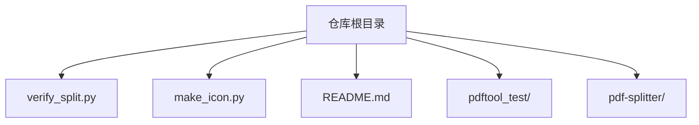
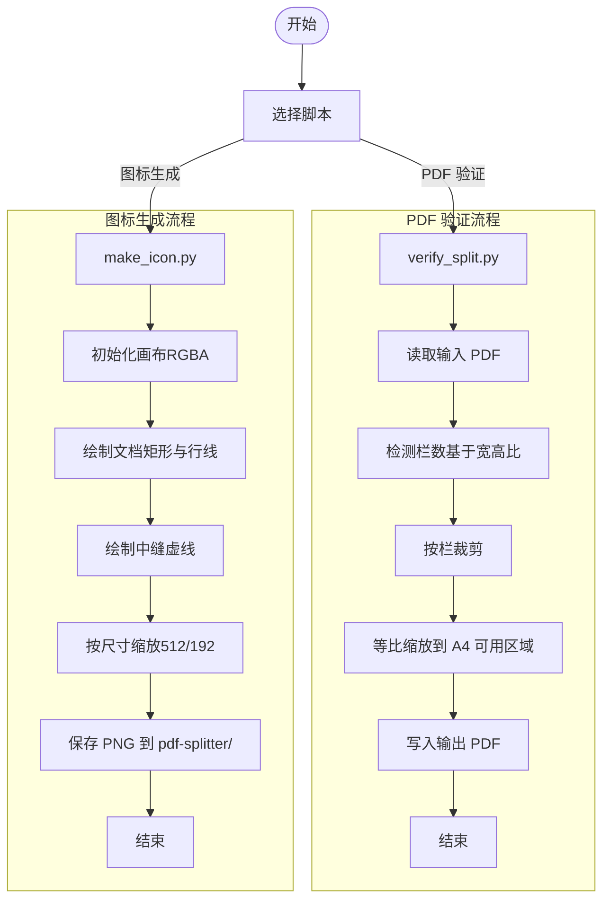
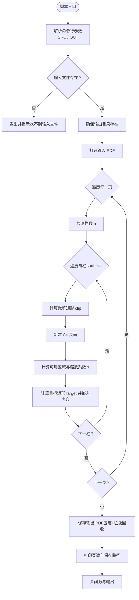
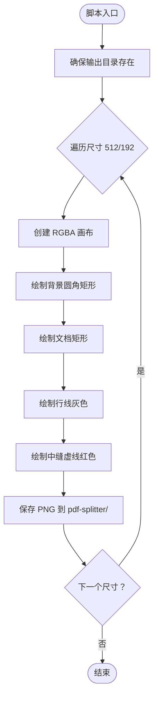
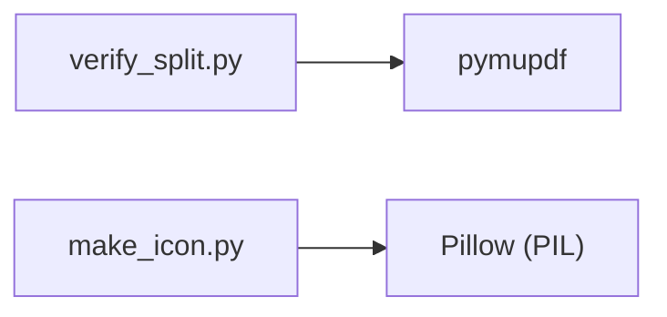

# 验证脚本

<cite>
**本文引用的文件**   
- [verify_split.py](file://verify_split.py)
- [make_icon.py](file://make_icon.py)
- [README.md](file://README.md)
</cite>

## 目录
1. [引言](#引言)
2. [项目结构](#项目结构)
3. [核心组件](#核心组件)
4. [架构总览](#架构总览)
5. [详细组件分析](#详细组件分析)
6. [依赖关系分析](#依赖关系分析)
7. [性能与质量考量](#性能与质量考量)
8. [故障排查指南](#故障排查指南)
9. [结论](#结论)
10. [附录：使用示例与最佳实践](#附录使用示例与最佳实践)

## 引言
本仓库提供两个 Python 辅助脚本，用于“试卷切分助手”项目的本地验证与资源生成：
- verify_split.py：对横向拼版 PDF（一页两栏或三栏）进行按栏切割、等比嵌入 A4 页面，并输出预览 PDF，便于人工核验切分结果。
- make_icon.py：根据设计坐标生成 PWA 图标（icon-192.png / icon-512.png），保持与 Android 可绘制资源一致。

本文档聚焦于这两个脚本的功能说明、执行方式、规则定义、错误处理与使用示例，帮助你在不联网、本地化的前提下自动化验证 PDF 处理结果的质量与完整性。

## 项目结构
与验证脚本直接相关的目录与文件如下：
- 根目录
  - verify_split.py：PDF 切分验证脚本
  - make_icon.py：PWA 图标生成脚本
  - README.md：项目说明与使用说明
- pdftool_test/：测试输入与调试脚本（由其他工具使用，非本文重点）
- pdf-splitter/：Web 本体与生成的图标输出目录（make_icon.py 的输出目标）

图表来源
- [README.md:13-20](file://README.md#L13-L20)

章节来源
- [README.md:13-20](file://README.md#L13-L20)

## 核心组件
- PDF 切分验证器（verify_split.py）
  - 功能：读取横向拼版 PDF，自动识别栏数，将每栏裁剪后等比放入 A4 页面，输出预览 PDF。
  - 适用场景：快速验证切分逻辑是否正确、页面方向是否一致、缩放是否合理。
- PWA 图标生成器（make_icon.py）
  - 功能：以 512px 为基准坐标系，绘制横版双栏试卷与中间红色裁切虚线，输出 512x512 与 192x192 的 PNG 图标。
  - 适用场景：更新 Android drawable 资源后，同步生成 Web PWA 图标，保证视觉一致性。

章节来源
- [verify_split.py:1-54](file://verify_split.py#L1-L54)
- [make_icon.py:1-53](file://make_icon.py#L1-L53)

## 架构总览
两个脚本均为独立命令行工具，无网络依赖，运行在本地 Python 环境中。

图表来源
- [verify_split.py:17-50](file://verify_split.py#L17-L50)
- [make_icon.py:20-51](file://make_icon.py#L20-L51)

## 详细组件分析

### PDF 切分验证器（verify_split.py）
- 入口与参数
  - 命令行参数：第一个参数为输入 PDF 路径；第二个参数为输出 PDF 路径。
  - 默认行为：若未传入参数，则从脚本所在目录下的 pdftool_test/input.pdf 读取，输出到 pdf_preview/split_verify.pdf。
- 核心逻辑
  - 栏数检测：依据页面宽高比判断 1/2/3 栏。阈值约定：比例≥1.85 判为 3 栏，≥1.2 判为 2 栏，否则为 1 栏。
  - 页面处理：对每一页按栏裁剪，计算可用 A4 区域（含边距），按宽/高限制等比缩放，居中放置。
  - 输出：启用垃圾回收与压缩，打印页数与保存路径。
- 关键常量
  - A4 纸张尺寸：595 x 842（点）。
  - 边距：12（点）。
- 错误处理
  - 输入文件不存在时退出并提示。
  - 自动创建输出目录。

图表来源
- [verify_split.py:8-15](file://verify_split.py#L8-L15)
- [verify_split.py:17-50](file://verify_split.py#L17-L50)
- [verify_split.py:50-53](file://verify_split.py#L50-L53)

章节来源
- [verify_split.py:1-54](file://verify_split.py#L1-L54)

### PWA 图标生成器（make_icon.py）
- 作用与场景
  - 生成与 Android drawable 一致的 PWA 图标，确保 Web 与原生视觉统一。
  - 支持多尺寸输出（512、192），便于在不同设备密度下显示清晰。
- 核心逻辑
  - 设计坐标系：以 512px 为基准，定义文档矩形、行线与中缝虚线位置。
  - 绘制流程：背景圆角矩形 → 文档白底 → 灰色行线 → 红色中缝虚线。
  - 缩放策略：所有坐标与线宽按目标尺寸等比缩放。
  - 输出：保存到 pdf-splitter/icon-192.png 与 icon-512.png。
- 关键常量
  - 文档矩形 DOC、行线 ROWS、左右列 COL_L/COL_R、中缝 FOLD。
  - 输出目录 OUT_DIR = pdf-splitter。

图表来源
- [make_icon.py:20-51](file://make_icon.py#L20-L51)

章节来源
- [make_icon.py:1-53](file://make_icon.py#L1-L53)

## 依赖关系分析
- verify_split.py
  - 依赖 pymupdf：用于打开 PDF、读取页面几何、裁剪与嵌入内容、设置输出压缩与垃圾回收。
- make_icon.py
  - 依赖 Pillow（PIL）：用于创建图像、绘制图形、保存 PNG。

图表来源
- [verify_split.py:6](file://verify_split.py#L6)
- [make_icon.py:8](file://make_icon.py#L8)

章节来源
- [verify_split.py:1-54](file://verify_split.py#L1-L54)
- [make_icon.py:1-53](file://make_icon.py#L1-L53)

## 性能与质量考量
- PDF 切分验证器
  - 栅格化与渲染：通过 show_pdf_page 嵌入矢量内容，避免额外栅格化；但大文件一次性嵌入仍可能占用较多内存。
  - 压缩与垃圾回收：输出启用 deflate 与垃圾回收，减小体积并清理临时对象。
  - 缩放策略：按可用区域等比缩放，优先满足高度限制，避免内容被过度缩小。
- PWA 图标生成器
  - 绘制开销低，主要成本在于两次尺寸的渲染与保存。
  - 坐标与线宽按比例缩放，保证不同密度屏幕下的清晰度。

[本节为通用性能讨论，不直接分析具体代码文件]

## 故障排查指南
- 找不到输入文件
  - 现象：脚本启动即退出并提示找不到输入文件。
  - 原因：未正确传入 SRC 参数，或默认路径不存在。
  - 处理：确认输入 PDF 路径正确，或将文件复制到默认路径 pdftool_test/input.pdf。
- 输出目录不存在
  - 现象：脚本自动创建输出目录；若权限不足可能导致失败。
  - 处理：确保脚本有写权限，或手动创建输出目录。
- 栏数识别不符合预期
  - 现象：A3 横版三栏被识别为两栏。
  - 原因：自动识别仅依据页面长宽比，阈值固定。
  - 处理：参考项目说明中的已知限制，必要时手动调整或修正输入页面方向。
- 图标尺寸不正确
  - 现象：生成的图标尺寸不符。
  - 原因：未正确运行脚本或未覆盖目标目录。
  - 处理：重新运行脚本并确保输出目录为 pdf-splitter。

章节来源
- [verify_split.py:8-15](file://verify_split.py#L8-L15)
- [README.md:83-90](file://README.md#L83-L90)

## 结论
- verify_split.py 提供了轻量、本地的 PDF 切分验证能力，适合在 CI 或本地开发中快速校验切分逻辑与页面布局。
- make_icon.py 保证了 Web 与原生图标的视觉一致性，简化了资源维护流程。
- 两者均无需联网，遵循本地化处理原则，符合项目隐私与安全要求。

[本节为总结性内容，不直接分析具体代码文件]

## 附录：使用示例与最佳实践
- 基本用法
  - PDF 切分验证：python verify_split.py [输入试卷.pdf] [输出.pdf]
    - 若不传参：默认读取 pdftool_test/input.pdf，输出到 pdf_preview/split_verify.pdf。
  - 图标生成：python make_icon.py
    - 输出到 pdf-splitter/icon-192.png 与 icon-512.png。
- 批量处理建议
  - 结合 shell 循环或任务队列，对多个输入 PDF 逐一调用 verify_split.py，生成对应输出文件。
  - 在构建流程中先运行 make_icon.py，确保图标与 drawable 资源保持一致。
- 质量检查清单
  - 页面格式：输出为 A4 纵向，内容居中且等比缩放。
  - 内容完整性：每栏内容完整嵌入，无截断或错位。
  - 元数据与安全：如需进一步校验，可在外部流程中加入 PDF 元数据检查与安全扫描步骤（例如使用第三方工具）。
- 错误处理机制
  - 输入缺失：脚本直接退出并提示。
  - 目录权限：确保输出目录可写。
  - 识别偏差：根据 README 中的已知限制调整输入或手动干预。

章节来源
- [verify_split.py:8-15](file://verify_split.py#L8-L15)
- [make_icon.py:47-52](file://make_icon.py#L47-L52)
- [README.md:83-90](file://README.md#L83-L90)