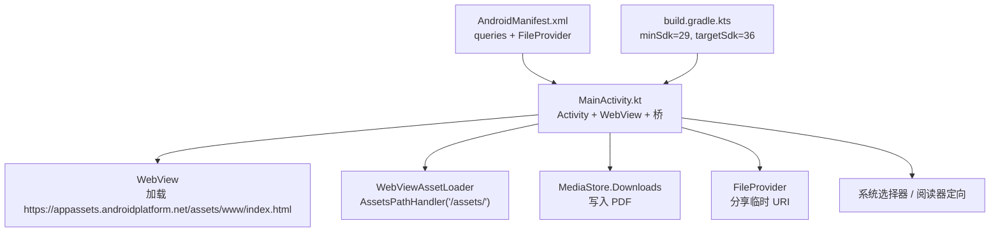
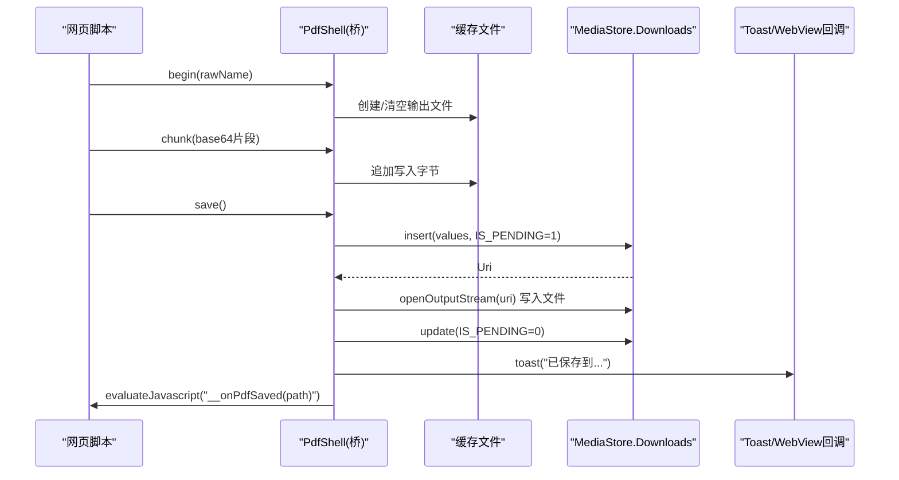
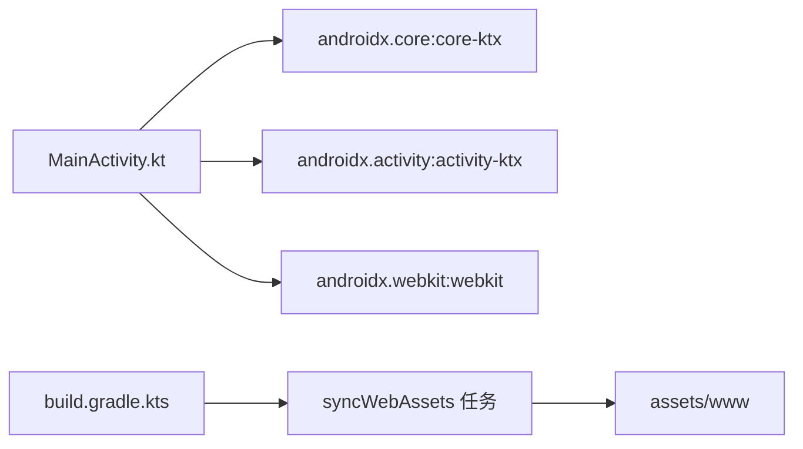

# 兼容性处理

<cite>
**本文引用的文件**   
- [MainActivity.kt](file://android/app/src/main/java/com/pdfsplitter/app/MainActivity.kt)
- [AndroidManifest.xml](file://android/app/src/main/AndroidManifest.xml)
- [build.gradle.kts](file://android/app/build.gradle.kts)
- [README.md](file://README.md)
</cite>

## 目录
1. [引言](#引言)
2. [项目结构](#项目结构)
3. [核心组件](#核心组件)
4. [架构总览](#架构总览)
5. [详细组件分析](#详细组件分析)
6. [依赖关系分析](#依赖关系分析)
7. [性能与兼容性权衡](#性能与兼容性权衡)
8. [兼容性测试指南](#兼容性测试指南)
9. [故障排查](#故障排查)
10. [结论](#结论)

## 引言
本文件聚焦 Android 端的兼容性处理，围绕以下目标展开：
- Android 版本差异处理：API 级别检测、向后兼容策略、特性可用性判断。
- 权限模型变化：运行时权限申请、权限检查结果处理、降级方案。
- WebView 兼容性：WebViewAssetLoader 使用、资源加载策略、跨版本适配。
- MediaStore API 的版本差异：旧版本兼容代码与功能降级。
- 兼容性测试：多版本设备测试、模拟器配置、问题排查方法。

本项目为“试卷切分助手”，Android 端是 Kotlin + WebView 壳，业务逻辑在本地 Web 层完成；原生侧负责选文件、写入下载、分享和查看文件等系统能力。

## 项目结构
Android 应用位于 `android/app`，核心入口为 `MainActivity.kt`，清单文件为 `AndroidManifest.xml`，构建配置为 `build.gradle.kts`。Web 本体位于仓库根目录的 `pdf-splitter/`，构建时同步到 `assets/www`，由 `WebViewAssetLoader` 以安全 URL 暴露给 WebView。

图表来源
- [MainActivity.kt:37-152](file://android/app/src/main/java/com/pdfsplitter/app/MainActivity.kt#L37-L152)
- [AndroidManifest.xml:1-45](file://android/app/src/main/AndroidManifest.xml#L1-L45)
- [build.gradle.kts:28-38](file://android/app/build.gradle.kts#L28-L38)

章节来源
- [MainActivity.kt:31-50](file://android/app/src/main/java/com/pdfsplitter/app/MainActivity.kt#L31-L50)
- [AndroidManifest.xml:1-45](file://android/app/src/main/AndroidManifest.xml#L1-L45)
- [build.gradle.kts:8-21](file://android/app/build.gradle.kts#L8-L21)
- [README.md:13-22](file://README.md#L13-L22)

## 核心组件
- MainActivity：承载 WebView、桥接 JS、文件选择、结果导出、分享与查看。
- WebViewAssetLoader：将 assets 下的 Web 资源通过安全 URL 提供，避免 file:// 限制。
- MediaStore.Downloads：按 Android 10+ 规范写入下载目录。
- FileProvider：生成可分享的临时 URI。
- queries：声明对 PDF 查看 Intent 的查询，满足 Android 11+ 包可见性要求。

章节来源
- [MainActivity.kt:103-112](file://android/app/src/main/java/com/pdfsplitter/app/MainActivity.kt#L103-L112)
- [MainActivity.kt:264-280](file://android/app/src/main/java/com/pdfsplitter/app/MainActivity.kt#L264-L280)
- [MainActivity.kt:282-291](file://android/app/src/main/java/com/pdfsplitter/app/MainActivity.kt#L282-L291)
- [AndroidManifest.xml:4-12](file://android/app/src/main/AndroidManifest.xml#L4-L12)

## 架构总览
下图展示从用户点击“保存”到结果落盘、回传路径并提示的关键流程，体现 WebView、JS 桥、MediaStore 与 UI 的交互。

图表来源
- [MainActivity.kt:170-209](file://android/app/src/main/java/com/pdfsplitter/app/MainActivity.kt#L170-L209)
- [MainActivity.kt:264-280](file://android/app/src/main/java/com/pdfsplitter/app/MainActivity.kt#L264-L280)

## 详细组件分析

### Android 版本差异与 API 级别检测
- 最低支持版本：minSdk 29（Android 10），targetSdk 36。这意味着应用运行在 Android 10 及以上环境，无需再为 Android 9 及以下做额外兼容。
- 构建配置中明确 Java/Kotlin 编译目标为 JVM 17，确保与较新 SDK 生态一致。
- 由于 minSdk 较高，代码中未出现显式的 Build.VERSION.SDK_INT 分支判断，而是直接采用 Android 10+ 的 API（如 MediaStore.Downloads、Scoped Storage）。

建议与现状评估
- 当前策略是“以高版本 API 为准”，不实现低版本分支。若未来需要降低 minSdk，需引入 SDK 检查与降级路径。
- 对于 WebView 相关 API，使用 androidx.webkit 兼容库，减少平台差异。

章节来源
- [build.gradle.kts:28-38](file://android/app/build.gradle.kts#L28-L38)
- [build.gradle.kts:62-75](file://android/app/build.gradle.kts#L62-L75)

### 权限模型变化与降级方案
- 清单中未声明任何用户可见权限（如存储、网络、定位），因为所有处理在本地 WebView 内完成，且写文件走 MediaStore。
- Android 11+ 包可见性：通过 `<queries>` 声明对 ACTION_VIEW + application/pdf 的查询，使 queryIntentActivities 能正确返回已安装的 PDF 阅读器，从而绕过默认选择器，优先打开 WPS、小米多看等。
- 运行时权限：当前未申请运行时权限。若未来需要访问外部存储或网络，应遵循运行时权限流程，并在拒绝时给出降级方案（例如仅使用内部缓存、引导用户授权）。

降级策略建议
- 若无法获取必要权限：退回仅内部缓存处理，禁用“保存到本地”，仅提供“分享”或“在线预览”。
- 若无可用阅读器：退回系统选择器，允许用户手动选择任意应用打开。

章节来源
- [AndroidManifest.xml:4-12](file://android/app/src/main/AndroidManifest.xml#L4-L12)
- [MainActivity.kt:222-256](file://android/app/src/main/java/com/pdfsplitter/app/MainActivity.kt#L222-L256)

### WebView 兼容性：WebViewAssetLoader 与资源加载
- 使用 WebViewAssetLoader 将 assets/www 暴露为 https://appassets.androidplatform.net/assets/www/，避免 file:// 协议下 pdf.js worker 加载失败的问题。
- WebViewClientCompat 重写 shouldInterceptRequest，统一拦截请求并交由 AssetLoader 处理。
- WebView 设置启用 JavaScript、DOM Storage，并限制只加载本地资源，关闭远程页面访问，提升安全性与稳定性。
- 调试模式：debuggable 环境下开启 WebContents 调试，便于 Chrome DevTools 调试。

跨版本适配要点
- 使用 androidx.webkit 库，屏蔽不同 Android 版本的 WebView 行为差异。
- 资源路径统一通过 AssetLoader，避免在不同版本上因 file:// 限制导致加载失败。

章节来源
- [MainActivity.kt:91-112](file://android/app/src/main/java/com/pdfsplitter/app/MainActivity.kt#L91-L112)
- [README.md:67-75](file://README.md#L67-L75)

### MediaStore API 的版本差异与降级
- 写入流程：先插入记录并设置 IS_PENDING=1，然后写入流，最后更新 IS_PENDING=0，确保系统在扫描前能看到“进行中”的状态。
- 重名处理：MediaStore 会自动加 “(1)” 等后缀，代码通过 displayNameOf 读取真实文件名并回传给前端显示。
- 当前实现基于 Android 10+ 的 MediaStore.Downloads，符合 Scoped Storage 规范。

旧版本兼容建议
- 若需支持低于 Android 10 的设备，应增加 SDK 检查：
  - Android 10+：继续使用 MediaStore.Downloads。
  - Android 9 及以下：回退到传统外部存储路径（如 Environment.getExternalStoragePublicDirectory(DIRECTORY_DOWNLOADS)），并申请 WRITE_EXTERNAL_STORAGE 权限。
- 对外部存储写入失败时，应捕获异常并提示用户，同时提供替代方案（如仅分享不落盘）。

章节来源
- [MainActivity.kt:264-280](file://android/app/src/main/java/com/pdfsplitter/app/MainActivity.kt#L264-L280)
- [README.md:35-35](file://README.md#L35-L35)

### 文件选择与文件名保留
- 使用 ActivityResultContracts.OpenDocument 拉起系统文件选择器，并通过 ValueCallback 回调接收选择的 Uri。
- 通过 OpenableColumns.DISPLAY_NAME 查询原始文件名，并进行 sanitize 处理（去除非法字符、补齐 .pdf 后缀、限制长度）。
- 选择后复制到本地缓存目录，避免跨应用 Uri 的生命周期问题。

兼容性注意
- 某些厂商 ROM 可能返回空 DISPLAY_NAME，代码已做兜底（取 lastPathSegment 或默认名）。
- 若 contentResolver.openInputStream 返回 null，会判定复制失败并回调空值，避免后续流程出错。

章节来源
- [MainActivity.kt:56-83](file://android/app/src/main/java/com/pdfsplitter/app/MainActivity.kt#L56-L83)
- [MainActivity.kt:294-299](file://android/app/src/main/java/com/pdfsplitter/app/MainActivity.kt#L294-L299)

### 分享与查看文件的兼容性
- 分享：使用 FileProvider.getUriForFile 生成临时 URI，配合 ACTION_SEND 发起分享，避免直接暴露应用私有目录。
- 查看：优先根据白名单匹配已安装的真实阅读器（WPS、小米多看等），若无命中则退回系统选择器。
- 清单中的 queries 保证 Android 11+ 能正确查询到 PDF 查看应用，否则定向打开会失败。

降级策略
- 若 startActivity 抛出异常（如无可用应用），捕获并提示用户改用分享。
- 若白名单未命中，自动回退到系统选择器，提升可用性。

章节来源
- [MainActivity.kt:282-291](file://android/app/src/main/java/com/pdfsplitter/app/MainActivity.kt#L282-L291)
- [MainActivity.kt:222-256](file://android/app/src/main/java/com/pdfsplitter/app/MainActivity.kt#L222-L256)
- [AndroidManifest.xml:4-12](file://android/app/src/main/AndroidManifest.xml#L4-L12)

## 依赖关系分析
- 运行时依赖：
  - androidx.core:core-ktx：基础扩展与工具类。
  - androidx.activity:activity-ktx：ActivityResultContracts 等现代 Activity API。
  - androidx.webkit:webkit：WebView 兼容库与 WebViewAssetLoader。
- 构建期依赖：
  - com.android.application、org.jetbrains.kotlin.android：Android 与 Kotlin 插件。
  - Gradle 任务 syncWebAssets：构建前将 pdf-splitter 源码同步到 assets/www。

图表来源
- [build.gradle.kts:80-84](file://android/app/build.gradle.kts#L80-L84)
- [build.gradle.kts:15-21](file://android/app/build.gradle.kts#L15-L21)

章节来源
- [build.gradle.kts:80-84](file://android/app/build.gradle.kts#L80-L84)

## 性能与兼容性权衡
- WebView 资源加载：通过 AssetLoader 避免 file:// 限制，提升跨版本稳定性；同时限制只加载本地资源，减少网络风险。
- 大文件传输：JS 桥采用分块 base64 传输，避免单次桥调用内存峰值过高。
- MediaStore 写入：IS_PENDING 标记确保系统扫描一致性，避免中间状态被其他应用读取。
- 性能瓶颈主要在 PDF 解析与栅格化，尤其是裁白边时的逐页渲染；预览阶段复用已绘制位图以降低重复开销。

[本节为通用指导，不直接分析具体文件]

## 兼容性测试指南

### 多版本设备测试
- 目标范围：至少覆盖 Android 10（minSdk）与 Android 13/14（常见发行版），以及 targetSdk 对应的新特性。
- 关键场景：
  - 文件选择：确认 OpenDocument 回调正常，DISPLAY_NAME 可读。
  - 保存文件：验证 MediaStore 写入成功，IS_PENDING 状态正确，重名后缀生效。
  - 分享与查看：验证 FileProvider 分享有效，白名单阅读器定向成功，无命中时回退系统选择器。
  - WebView 资源加载：确认 https://appassets.androidplatform.net/assets/www/ 资源可加载，pdf.js worker 正常。

### 模拟器配置
- 使用 Android Studio AVD Manager 创建 Android 10、11、12、13、14 的虚拟设备。
- 开启 Google Play Services 可选组件（如需测试系统级行为）。
- 在调试模式下启用 WebView 调试：Chrome 访问 chrome://inspect 进行审查。

### 问题排查方法
- 若“查看文件”无法定向到阅读器：
  - 检查清单是否声明 `<queries>`。
  - 确认设备上安装了匹配的 PDF 阅读器。
- 若“保存到本地”失败：
  - 检查 MediaStore.insert 返回值是否为 null。
  - 检查 openOutputStream 是否成功，日志中是否有异常。
- 若 WebView 资源加载失败：
  - 确认 AssetLoader 是否正确注册 /assets/ 路径。
  - 检查 WebViewClientCompat.shouldInterceptRequest 是否被调用。

章节来源
- [AndroidManifest.xml:4-12](file://android/app/src/main/AndroidManifest.xml#L4-L12)
- [MainActivity.kt:103-112](file://android/app/src/main/java/com/pdfsplitter/app/MainActivity.kt#L103-L112)
- [MainActivity.kt:264-280](file://android/app/src/main/java/com/pdfsplitter/app/MainActivity.kt#L264-L280)

## 故障排查

### 常见问题与定位
- 无法打开 PDF 阅读器：
  - 现象：点击“查看文件”无响应或提示无可用应用。
  - 原因：queries 缺失或白名单未命中。
  - 解决：确保清单声明 queries，并检查设备是否安装匹配应用。
- 保存失败：
  - 现象：toast 提示“写入下载失败”。
  - 原因：MediaStore.insert 或 openOutputStream 失败。
  - 解决：检查日志异常，确认存储权限与存储空间。
- WebView 资源加载失败：
  - 现象：页面空白或 js 报错。
  - 原因：AssetLoader 未正确拦截或资源路径错误。
  - 解决：核对 START_URL 与 addPathHandler 路径。

章节来源
- [MainActivity.kt:222-256](file://android/app/src/main/java/com/pdfsplitter/app/MainActivity.kt#L222-L256)
- [MainActivity.kt:264-280](file://android/app/src/main/java/com/pdfsplitter/app/MainActivity.kt#L264-L280)
- [MainActivity.kt:103-112](file://android/app/src/main/java/com/pdfsplitter/app/MainActivity.kt#L103-L112)

## 结论
本项目在 Android 10+ 环境下，采用现代 API（MediaStore、ActivityResultContracts、WebViewAssetLoader）实现稳定可靠的文件处理与 WebView 资源加载。通过清单 queries 与白名单策略，优化了“查看文件”的体验；通过 FileProvider 与 MediaStore，确保了分享与保存的安全性与兼容性。若未来需要降低 minSdk 或扩展功能（如网络、运行时权限），应引入 SDK 检查与降级路径，并完善测试矩阵与排查文档。