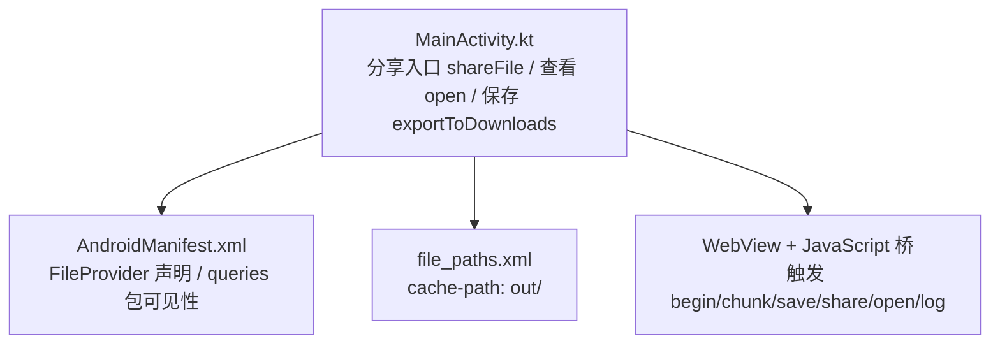
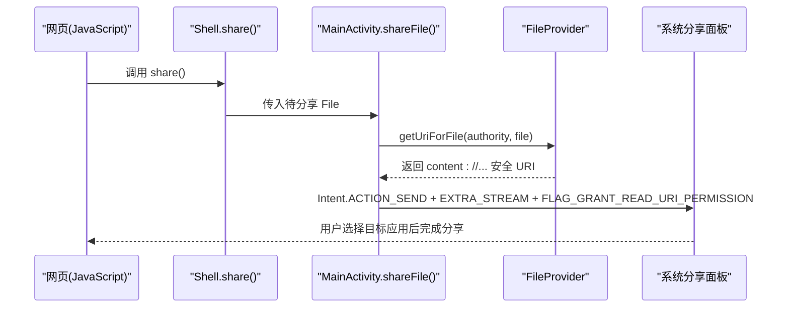
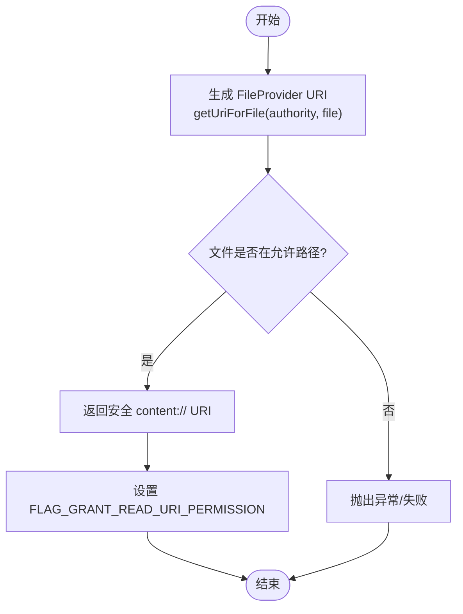
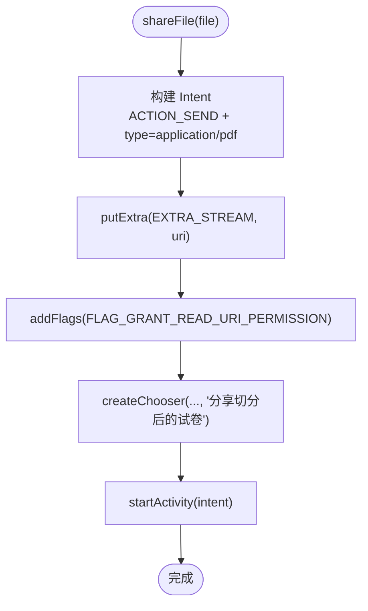
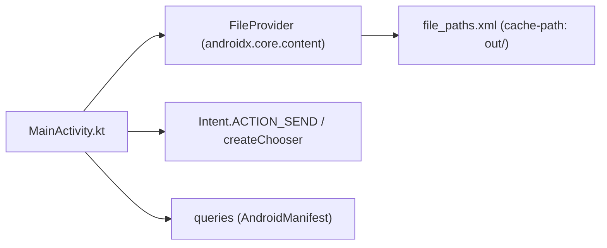

# 分享机制

<cite>
**本文引用的文件**   
- [MainActivity.kt](file://android/app/src/main/java/com/pdfsplitter/app/MainActivity.kt)
- [AndroidManifest.xml](file://android/app/src/main/AndroidManifest.xml)
- [file_paths.xml](file://android/app/src/main/res/xml/file_paths.xml)
</cite>

## 目录
1. [引言](#引言)
2. [项目结构](#项目结构)
3. [核心组件](#核心组件)
4. [架构总览](#架构总览)
5. [详细组件分析](#详细组件分析)
6. [依赖关系分析](#依赖关系分析)
7. [性能与兼容性考量](#性能与兼容性考量)
8. [故障排查指南](#故障排查指南)
9. [结论](#结论)

## 引言
本文围绕 Android 端的“分享机制”进行技术说明，重点覆盖：
- FileProvider 的使用方式、URI 生成与权限配置
- shareFile 方法的实现细节：Intent.ACTION_SEND、EXTRA_STREAM、FLAG_GRANT_READ_URI_PERMISSION
- 分享对话框的创建与用户体验优化：Intent.createChooser
- 与系统分享集成的最佳实践：错误处理、应用兼容性检查、可访问性与稳定性建议

本项目的原生外壳 MainActivity 负责桥接 WebView 中的 PDF 切分逻辑与系统能力（选择文件、写入下载、查看与分享）。分享流程通过 FileProvider 暴露安全 URI，再由系统分享面板完成跨应用传输。

## 项目结构
与分享机制直接相关的代码集中在以下位置：
- MainActivity.kt：包含分享入口 shareFile、查看 open、保存 exportToDownloads、WebView 桥接 Shell 等
- AndroidManifest.xml：声明 FileProvider、queries 包可见性、Activity 启动配置
- file_paths.xml：定义 FileProvider 可共享的缓存路径映射

图表来源
- [MainActivity.kt:282-292](file://android/app/src/main/java/com/pdfsplitter/app/MainActivity.kt#L282-L292)
- [AndroidManifest.xml:33-41](file://android/app/src/main/AndroidManifest.xml#L33-L41)
- [file_paths.xml:1-5](file://android/app/src/main/res/xml/file_paths.xml#L1-L5)

章节来源
- [MainActivity.kt:1-311](file://android/app/src/main/java/com/pdfsplitter/app/MainActivity.kt#L1-L311)
- [AndroidManifest.xml:1-45](file://android/app/src/main/AndroidManifest.xml#L1-L45)
- [file_paths.xml:1-5](file://android/app/src/main/res/xml/file_paths.xml#L1-L5)

## 核心组件
- MainActivity.Shell：供页面调用的桥方法，包括 begin、chunk、save、share、open、log
- MainActivity.shareFile：核心分享方法，使用 FileProvider 生成 URI 并发起 ACTION_SEND
- MainActivity.open：优先定向到已安装的 PDF 阅读器，否则回退到系统选择器
- MainActivity.exportToDownloads：将结果写入系统「下载」目录，返回 MediaStore URI
- AndroidManifest.FileProvider：以 applicationId.fileprovider 为 authority，仅暴露 cache/out 目录
- file_paths.xml：声明 cache-path name="out" path="out/"

章节来源
- [MainActivity.kt:166-262](file://android/app/src/main/java/com/pdfsplitter/app/MainActivity.kt#L166-L262)
- [MainActivity.kt:282-292](file://android/app/src/main/java/com/pdfsplitter/app/MainActivity.kt#L282-L292)
- [AndroidManifest.xml:33-41](file://android/app/src/main/AndroidManifest.xml#L33-L41)
- [file_paths.xml:1-5](file://android/app/src/main/res/xml/file_paths.xml#L1-L5)

## 架构总览
下图展示从页面触发分享到系统分享面板的整体流程，以及 FileProvider 在其中的作用。

图表来源
- [MainActivity.kt:212-220](file://android/app/src/main/java/com/pdfsplitter/app/MainActivity.kt#L212-L220)
- [MainActivity.kt:282-292](file://android/app/src/main/java/com/pdfsplitter/app/MainActivity.kt#L282-L292)
- [AndroidManifest.xml:33-41](file://android/app/src/main/AndroidManifest.xml#L33-L41)

## 详细组件分析

### FileProvider 与 URI 生成
- Authority 配置：在清单中声明 androidx.core.content.FileProvider，authorities 使用 ${applicationId}.fileprovider，grantUriPermissions=true，exported=false
- 路径映射：file_paths.xml 暴露 cache-path name="out" path="out/"，对应 MainActivity 中 cacheDir/out 目录
- URI 生成：shareFile 中调用 FileProvider.getUriForFile(applicationContext, "${packageName}.fileprovider", file)，得到受保护的 content:// URI
- 权限授予：Intent 添加 FLAG_GRANT_READ_URI_PERMISSION，使接收方临时拥有读取权限

图表来源
- [AndroidManifest.xml:33-41](file://android/app/src/main/AndroidManifest.xml#L33-L41)
- [file_paths.xml:1-5](file://android/app/src/main/res/xml/file_paths.xml#L1-L5)
- [MainActivity.kt:282-292](file://android/app/src/main/java/com/pdfsplitter/app/MainActivity.kt#L282-L292)

章节来源
- [AndroidManifest.xml:33-41](file://android/app/src/main/AndroidManifest.xml#L33-L41)
- [file_paths.xml:1-5](file://android/app/src/main/res/xml/file_paths.xml#L1-L5)
- [MainActivity.kt:282-292](file://android/app/src/main/java/com/pdfsplitter/app/MainActivity.kt#L282-L292)

### shareFile 方法实现要点
- Intent 动作：ACTION_SEND
- MIME 类型：application/pdf
- 数据传递：EXTRA_STREAM 携带 FileProvider 生成的 URI
- 权限标志：FLAG_GRANT_READ_URI_PERMISSION 确保接收方可读
- 交互体验：使用 Intent.createChooser 弹出系统分享面板，标题为“分享切分后的试卷”
- 错误处理：runCatching 捕获异常，失败时记录日志并通过 Toast 提示“未找到可接收 PDF 的应用”

图表来源
- [MainActivity.kt:282-292](file://android/app/src/main/java/com/pdfsplitter/app/MainActivity.kt#L282-L292)

章节来源
- [MainActivity.kt:282-292](file://android/app/src/main/java/com/pdfsplitter/app/MainActivity.kt#L282-L292)

### 分享对话框与用户体验优化
- 使用 Intent.createChooser 强制显示系统分享面板，避免某些应用拦截导致不可见
- 提供明确的标题文案，提升用户理解度
- 对无可用接收方的情况给出友好提示，降低困惑感

章节来源
- [MainActivity.kt:282-292](file://android/app/src/main/java/com/pdfsplitter/app/MainActivity.kt#L282-L292)

### 与系统分享集成的最佳实践
- 安全性
  - 仅通过 FileProvider 暴露必要路径（cache/out），不暴露整个外部存储
  - 明确 grantUriPermissions=true，并在 Intent 上设置 FLAG_GRANT_READ_URI_PERMISSION
- 兼容性
  - 使用 queries 声明 VIEW action + application/pdf mimeType，确保 Android 11+ 能查询到 PDF 阅读器
  - 在 open 流程中先尝试定向到具体阅读器，若无则回退 createChooser
- 错误处理
  - 分享失败时捕获异常并提示用户
  - 打开失败时提示“没有能打开 PDF 的应用，可改用系统分享”
- 用户体验
  - 分享前校验文件是否存在且非空
  - 保存成功后返回真实文件名用于 UI 展示
  - 使用简洁清晰的提示文案

章节来源
- [AndroidManifest.xml:1-12](file://android/app/src/main/AndroidManifest.xml#L1-L12)
- [MainActivity.kt:226-256](file://android/app/src/main/java/com/pdfsplitter/app/MainActivity.kt#L226-L256)
- [MainActivity.kt:282-292](file://android/app/src/main/java/com/pdfsplitter/app/MainActivity.kt#L282-L292)

### 查看与分享的差异
- open：优先匹配已安装 PDF 阅读器（WPS、Xodo、Adobe 等），若存在则直接定向；否则使用 createChooser 让用户选择
- share：始终走系统分享面板，适合发送给聊天、邮箱、网盘等支持附件的应用

章节来源
- [MainActivity.kt:226-256](file://android/app/src/main/java/com/pdfsplitter/app/MainActivity.kt#L226-L256)
- [MainActivity.kt:282-292](file://android/app/src/main/java/com/pdfsplitter/app/MainActivity.kt#L282-L292)

## 依赖关系分析
- MainActivity 依赖 FileProvider 生成安全 URI
- MainActivity 依赖系统分享面板（ACTION_SEND）和选择器（createChooser）
- AndroidManifest 声明 FileProvider 与 queries，影响 URI 生成与 Activity 查询行为
- file_paths.xml 决定哪些本地路径可通过 FileProvider 暴露

图表来源
- [MainActivity.kt:282-292](file://android/app/src/main/java/com/pdfsplitter/app/MainActivity.kt#L282-L292)
- [AndroidManifest.xml:33-41](file://android/app/src/main/AndroidManifest.xml#L33-L41)
- [AndroidManifest.xml:1-12](file://android/app/src/main/AndroidManifest.xml#L1-L12)
- [file_paths.xml:1-5](file://android/app/src/main/res/xml/file_paths.xml#L1-L5)

章节来源
- [MainActivity.kt:282-292](file://android/app/src/main/java/com/pdfsplitter/app/MainActivity.kt#L282-L292)
- [AndroidManifest.xml:1-12](file://android/app/src/main/AndroidManifest.xml#L1-L12)
- [AndroidManifest.xml:33-41](file://android/app/src/main/AndroidManifest.xml#L33-L41)
- [file_paths.xml:1-5](file://android/app/src/main/res/xml/file_paths.xml#L1-L5)

## 性能与兼容性考量
- 大文件传输
  - 分享通过 EXTRA_STREAM 传递 URI，避免将整个文件内容复制到 Intent 额外字段，减少内存压力
- 文件系统 IO
  - 分享前确保文件存在且非空，避免无效分享
  - 使用 runCatching 包裹可能失败的 IO 操作，保证主线程稳定
- 兼容性
  - queries 声明确保 Android 11+ 能正确查询到 PDF 相关 Activity
  - FileProvider 仅暴露最小必要路径，降低安全风险
- 用户体验
  - 分享与查看分离：查看优先直达阅读器，分享统一走系统面板
  - 清晰提示：失败时给出明确原因与建议

[本节为通用指导，不涉及具体文件分析]

## 故障排查指南
- 无法分享或提示“未找到可接收 PDF 的应用”
  - 检查 FileProvider 的 authorities 是否与 getUriForFile 一致
  - 确认 file_paths.xml 是否包含目标文件的相对路径
  - 检查 Intent 是否设置了 FLAG_GRANT_READ_URI_PERMISSION
- 打开 PDF 失败
  - 检查 queries 是否正确声明了 VIEW + application/pdf
  - 确认设备已安装 PDF 阅读器或未回退到 createChooser
- 分享后无响应或崩溃
  - 检查 shareFile 的 runCatching 分支是否捕获异常并提示
  - 确认传入的文件确实存在于 cache/out 目录且非空

章节来源
- [MainActivity.kt:282-292](file://android/app/src/main/java/com/pdfsplitter/app/MainActivity.kt#L282-L292)
- [AndroidManifest.xml:1-12](file://android/app/src/main/AndroidManifest.xml#L1-L12)
- [AndroidManifest.xml:33-41](file://android/app/src/main/AndroidManifest.xml#L33-L41)
- [file_paths.xml:1-5](file://android/app/src/main/res/xml/file_paths.xml#L1-L5)

## 结论
本项目通过 FileProvider 安全地暴露本地 PDF 文件，结合 Intent.ACTION_SEND 与 createChooser 实现稳定的系统分享能力。配合 queries 与优先级阅读器策略，既保证了 Android 11+ 的兼容性，也提升了用户的开箱体验。建议在后续迭代中继续强化错误提示、保持最小权限暴露范围，并对不同厂商 ROM 的分享面板行为进行持续验证。