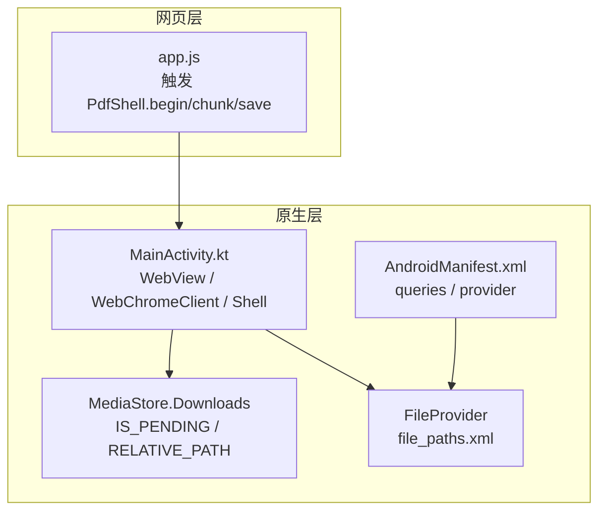
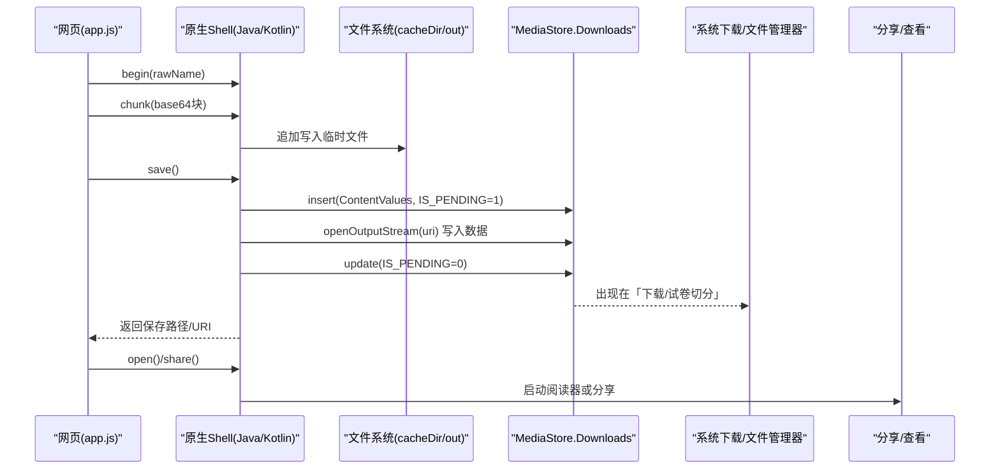
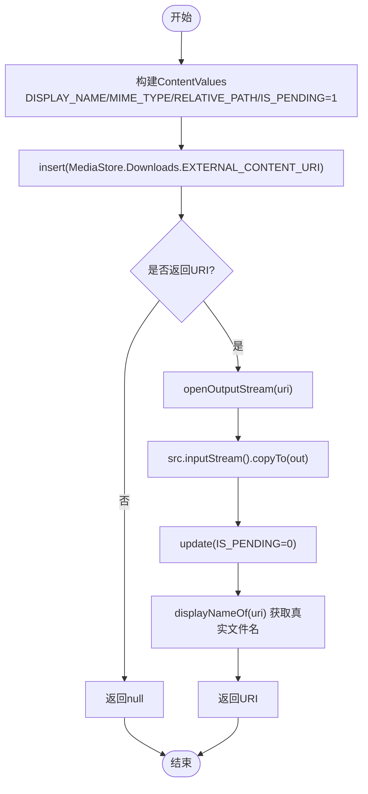
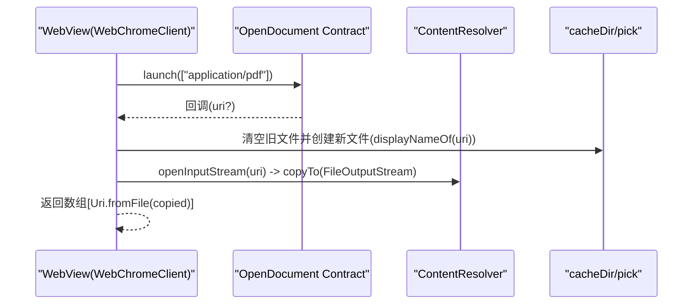
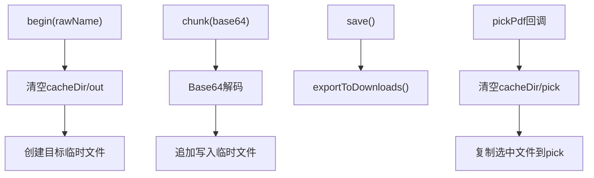
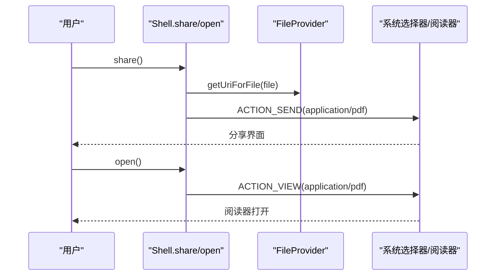
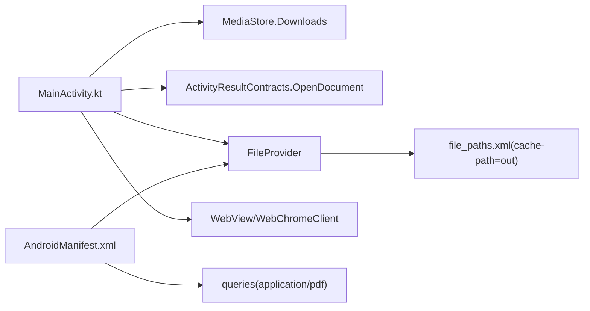

# 文件管理

<cite>
**本文引用的文件**   
- [MainActivity.kt](file://android/app/src/main/java/com/pdfsplitter/app/MainActivity.kt)
- [AndroidManifest.xml](file://android/app/src/main/AndroidManifest.xml)
- [file_paths.xml](file://android/app/src/main/res/xml/file_paths.xml)
- [app.js](file://pdf-splitter/app.js)
</cite>

## 目录
1. [简介](#简介)
2. [项目结构](#项目结构)
3. [核心组件](#核心组件)
4. [架构总览](#架构总览)
5. [详细组件分析](#详细组件分析)
6. [依赖关系分析](#依赖关系分析)
7. [性能与内存优化](#性能与内存优化)
8. [故障排查指南](#故障排查指南)
9. [结论](#结论)

## 简介
本文件管理技术文档聚焦于 Android 端文件保存、媒体存储访问、系统下载目录集成、文件选择器集成以及缓存文件管理。该应用采用 WebView + 原生外壳的混合架构：PDF 处理逻辑在网页侧运行，原生层负责“选文件”“写入系统下载”“分享”“打开 PDF”等能力。重点包括：
- MediaStore API 集成：通过 Downloads 集合写入 PDF，使用 IS_PENDING 状态保证写入原子性。
- 系统下载目录集成：将结果保存到“下载/试卷切分”相对路径。
- 文件选择器集成：重写 onShowFileChooser，使用 ActivityResultContracts.OpenDocument 选择 PDF，并保留原始文件名。
- 缓存文件管理：临时文件清理、流式写入、避免大对象驻留内存。
- 最佳实践：错误处理、权限与可见性、用户体验提升。

## 项目结构
本项目 Android 部分的关键文件如下：
- MainActivity.kt：WebView 宿主、文件选择、MediaStore 导出、分享与打开 PDF。
- AndroidManifest.xml：声明 queries（用于查询可打开 PDF 的应用）、FileProvider 配置。
- file_paths.xml：为 FileProvider 暴露缓存目录 out。
- app.js：网页侧触发原生通道，按块 Base64 传输数据到原生 Shell。

**图表来源**
- [MainActivity.kt:114-152](file://android/app/src/main/java/com/pdfsplitter/app/MainActivity.kt#L114-L152)
- [MainActivity.kt:166-280](file://android/app/src/main/java/com/pdfsplitter/app/MainActivity.kt#L166-L280)
- [AndroidManifest.xml:7-12](file://android/app/src/main/AndroidManifest.xml#L7-L12)
- [AndroidManifest.xml:33-41](file://android/app/src/main/AndroidManifest.xml#L33-L41)
- [file_paths.xml:1-5](file://android/app/src/main/res/xml/file_paths.xml#L1-L5)

**章节来源**
- [MainActivity.kt:1-311](file://android/app/src/main/java/com/pdfsplitter/app/MainActivity.kt#L1-L311)
- [AndroidManifest.xml:1-45](file://android/app/src/main/AndroidManifest.xml#L1-L45)
- [file_paths.xml:1-5](file://android/app/src/main/res/xml/file_paths.xml#L1-L5)

## 核心组件
- WebView 与 WebChromeClient：拦截文件选择请求，桥接到系统文件选择器。
- Shell（JavaScriptInterface）：接收网页传来的 PDF 数据块，写入缓存目录，最终导出到系统下载。
- exportToDownloads：封装 MediaStore 写入流程，设置 IS_PENDING、RELATIVE_PATH、MIME_TYPE。
- 文件选择器：onShowFileChooser 重写，ActivityResultContracts.OpenDocument 回调中复制文件并保留显示名。
- FileProvider：通过 file_paths.xml 暴露缓存目录，供分享 Intent 使用。
- 阅读器定向：根据已安装应用包名优先启动专用 PDF 阅读器，否则回退到系统选择器。

**章节来源**
- [MainActivity.kt:114-152](file://android/app/src/main/java/com/pdfsplitter/app/MainActivity.kt#L114-L152)
- [MainActivity.kt:166-280](file://android/app/src/main/java/com/pdfsplitter/app/MainActivity.kt#L166-L280)
- [AndroidManifest.xml:33-41](file://android/app/src/main/AndroidManifest.xml#L33-L41)
- [file_paths.xml:1-5](file://android/app/src/main/res/xml/file_paths.xml#L1-L5)

## 架构总览
下图展示从网页发起保存，到原生写入 MediaStore，再到用户查看或分享的完整流程。

**图表来源**
- [app.js:510-539](file://pdf-splitter/app.js#L510-L539)
- [MainActivity.kt:166-280](file://android/app/src/main/java/com/pdfsplitter/app/MainActivity.kt#L166-L280)

## 详细组件分析

### MediaStore 集成与 exportToDownloads
- 目标：将生成的 PDF 保存到系统“下载”目录下的子目录“试卷切分”。
- 关键步骤：
  - 构建 ContentValues，设置 DISPLAY_NAME、MIME_TYPE、RELATIVE_PATH、IS_PENDING。
  - 调用 contentResolver.insert(MediaStore.Downloads.EXTERNAL_CONTENT_URI, values) 获取 URI。
  - 通过 openOutputStream 写入源文件内容。
  - 更新 IS_PENDING 为 0，使文件对系统可见。
  - 读取真实文件名（MediaStore 可能自动加序号），用于 UI 展示。
- 优点：
  - 使用 IS_PENDING 保证写入期间文件不可见，避免扫描到半成品。
  - RELATIVE_PATH 指定相对路径，符合 Android 11+ 分区存储规范。
  - 统一 MIME 类型，便于系统识别 PDF。

**图表来源**
- [MainActivity.kt:264-280](file://android/app/src/main/java/com/pdfsplitter/app/MainActivity.kt#L264-L280)

**章节来源**
- [MainActivity.kt:264-280](file://android/app/src/main/java/com/pdfsplitter/app/MainActivity.kt#L264-L280)

### 文件选择器集成与原始文件名保留
- onShowFileChooser 重写：
  - 接管 WebView 的文件选择请求，避免默认行为。
  - 使用 ActivityResultContracts.OpenDocument 拉起系统文件选择器，限定类型为 application/pdf。
  - 在回调中将选中文件复制到本地缓存目录 pick，并保留原始显示名。
- displayNameOf 方法：
  - 通过 ContentResolver.query 查询 OpenableColumns.DISPLAY_NAME，取得用户可见文件名。
  - 若无法获取，则回退到 URI 的最后一段路径段；仍为空时使用默认名称。
  - sanitize 对非法字符进行替换，限制长度，并确保后缀为 .pdf。

**图表来源**
- [MainActivity.kt:56-83](file://android/app/src/main/java/com/pdfsplitter/app/MainActivity.kt#L56-L83)
- [MainActivity.kt:114-124](file://android/app/src/main/java/com/pdfsplitter/app/MainActivity.kt#L114-L124)

**章节来源**
- [MainActivity.kt:56-83](file://android/app/src/main/java/com/pdfsplitter/app/MainActivity.kt#L56-L83)
- [MainActivity.kt:114-124](file://android/app/src/main/java/com/pdfsplitter/app/MainActivity.kt#L114-L124)

### 缓存文件管理与内存优化
- 临时目录：
  - cacheDir/out：用于保存分片写入的 PDF 临时文件。
  - cacheDir/pick：用于保存用户选择的 PDF 副本。
- 清理策略：
  - begin() 时清空 out 目录并创建目标文件。
  - pickPdf 回调中清空 pick 目录后再写入新文件。
- 内存优化：
  - 网页侧按固定大小（例如 768KB）分块 Base64 传输，避免一次性加载大文件到内存。
  - 原生侧使用流式写入（inputStream().copyTo(outputStream)），减少内存峰值。
  - 不持有大对象引用，及时释放资源（use 块）。

**图表来源**
- [MainActivity.kt:166-184](file://android/app/src/main/java/com/pdfsplitter/app/MainActivity.kt#L166-L184)
- [MainActivity.kt:56-73](file://android/app/src/main/java/com/pdfsplitter/app/MainActivity.kt#L56-L73)
- [app.js:510-539](file://pdf-splitter/app.js#L510-L539)

**章节来源**
- [MainActivity.kt:166-184](file://android/app/src/main/java/com/pdfsplitter/app/MainActivity.kt#L166-L184)
- [MainActivity.kt:56-73](file://android/app/src/main/java/com/pdfsplitter/app/MainActivity.kt#L56-L73)
- [app.js:510-539](file://pdf-splitter/app.js#L510-L539)

### 分享与打开 PDF
- 分享：
  - 使用 FileProvider.getUriForFile 生成安全 URI。
  - 构造 ACTION_SEND Intent，设置 type 为 application/pdf，附加 EXTRA_STREAM。
  - 通过 createChooser 让用户选择分享目标。
- 打开：
  - 优先尝试已安装的专用 PDF 阅读器（WPS、Xodo、Adobe Reader 等）。
  - 若无匹配应用，回退到系统选择器。
  - 使用 FLAG_GRANT_READ_URI_PERMISSION 授予临时读取权限。

**图表来源**
- [MainActivity.kt:282-292](file://android/app/src/main/java/com/pdfsplitter/app/MainActivity.kt#L282-L292)
- [MainActivity.kt:226-256](file://android/app/src/main/java/com/pdfsplitter/app/MainActivity.kt#L226-L256)
- [AndroidManifest.xml:33-41](file://android/app/src/main/AndroidManifest.xml#L33-L41)

**章节来源**
- [MainActivity.kt:226-292](file://android/app/src/main/java/com/pdfsplitter/app/MainActivity.kt#L226-L292)
- [AndroidManifest.xml:33-41](file://android/app/src/main/AndroidManifest.xml#L33-L41)

## 依赖关系分析
- MainActivity 依赖：
  - MediaStore.Downloads：用于写入系统下载目录。
  - ActivityResultContracts.OpenDocument：用于文件选择。
  - FileProvider：用于分享时的安全 URI。
  - WebView/WebChromeClient：用于拦截文件选择与桥接网页。
- Manifest 依赖：
  - queries：允许查询可打开 PDF 的应用，解决 Android 11+ 包可见性问题。
  - FileProvider：声明 authorities 与 meta-data 指向 file_paths.xml。
- file_paths.xml：
  - 暴露 cacheDir/out 给 FileProvider，供分享 Intent 使用。

**图表来源**
- [MainActivity.kt:1-311](file://android/app/src/main/java/com/pdfsplitter/app/MainActivity.kt#L1-L311)
- [AndroidManifest.xml:7-12](file://android/app/src/main/AndroidManifest.xml#L7-L12)
- [AndroidManifest.xml:33-41](file://android/app/src/main/AndroidManifest.xml#L33-L41)
- [file_paths.xml:1-5](file://android/app/src/main/res/xml/file_paths.xml#L1-L5)

**章节来源**
- [MainActivity.kt:1-311](file://android/app/src/main/java/com/pdfsplitter/app/MainActivity.kt#L1-L311)
- [AndroidManifest.xml:1-45](file://android/app/src/main/AndroidManifest.xml#L1-L45)
- [file_paths.xml:1-5](file://android/app/src/main/res/xml/file_paths.xml#L1-L5)

## 性能与内存优化
- 分块传输：
  - 网页侧按固定大小分块 Base64 编码，降低单次桥接数据量，避免 OOM。
- 流式写入：
  - 原生侧使用 inputStream().copyTo(outputStream)，避免将整个文件读入内存。
- 临时文件清理：
  - begin() 和文件选择回调中主动清理对应目录，防止累积占用空间。
- 命名规范化：
  - sanitize 去除非法字符、限制长度、确保后缀，减少文件系统异常。
- 可见性与权限：
  - 使用 FileProvider 与 FLAG_GRANT_READ_URI_PERMISSION，避免直接暴露绝对路径。
- 阅读器定向：
  - 优先启动专用阅读器，减少系统选择器的交互成本，提升用户体验。

[本节为通用指导，不涉及具体代码片段]

## 故障排查指南
- 无法写入“下载”目录：
  - 检查 MediaStore.Downloads.RELATIVE_PATH 是否正确。
  - 确认 IS_PENDING 状态在写入后更新为 0。
  - 查看日志中的 export failed 信息。
- 文件未出现在系统下载：
  - 确认 MediaStore 插入成功且 URI 非空。
  - 检查 openOutputStream 是否成功写入数据。
- 分享失败：
  - 确认 FileProvider 已在 Manifest 中声明，且 file_paths.xml 正确暴露目录。
  - 检查 Intent 的 type 是否为 application/pdf，并包含 EXTRA_STREAM。
- 无法打开 PDF：
  - 确认 queries 已声明 android.intent.action.VIEW + application/pdf。
  - 检查是否有匹配的阅读器应用，必要时回退到系统选择器。
- 文件名异常：
  - 检查 displayNameOf 是否能正确查询 OpenableColumns.DISPLAY_NAME。
  - 确认 sanitize 对非法字符的处理逻辑。

**章节来源**
- [MainActivity.kt:186-209](file://android/app/src/main/java/com/pdfsplitter/app/MainActivity.kt#L186-L209)
- [MainActivity.kt:264-280](file://android/app/src/main/java/com/pdfsplitter/app/MainActivity.kt#L264-L280)
- [MainActivity.kt:282-292](file://android/app/src/main/java/com/pdfsplitter/app/MainActivity.kt#L282-L292)
- [AndroidManifest.xml:7-12](file://android/app/src/main/AndroidManifest.xml#L7-L12)

## 结论
该文件管理方案以 WebView + 原生外壳为核心，结合 MediaStore、FileProvider 与 ActivityResultContracts，实现了安全的文件选择、可靠的系统下载写入、稳定的分享与打开能力。通过分块传输、流式写入与临时目录清理，有效控制了内存占用与磁盘空间。遵循本文的最佳实践与故障排查建议，可在不同 Android 版本与设备上获得一致的用户体验。