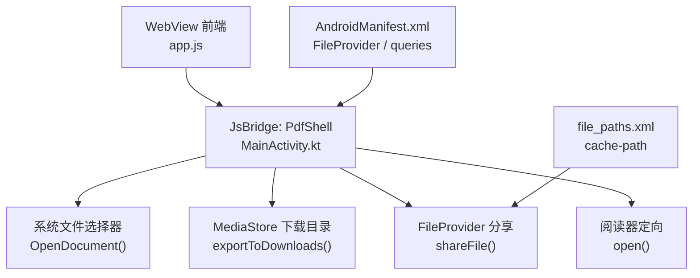
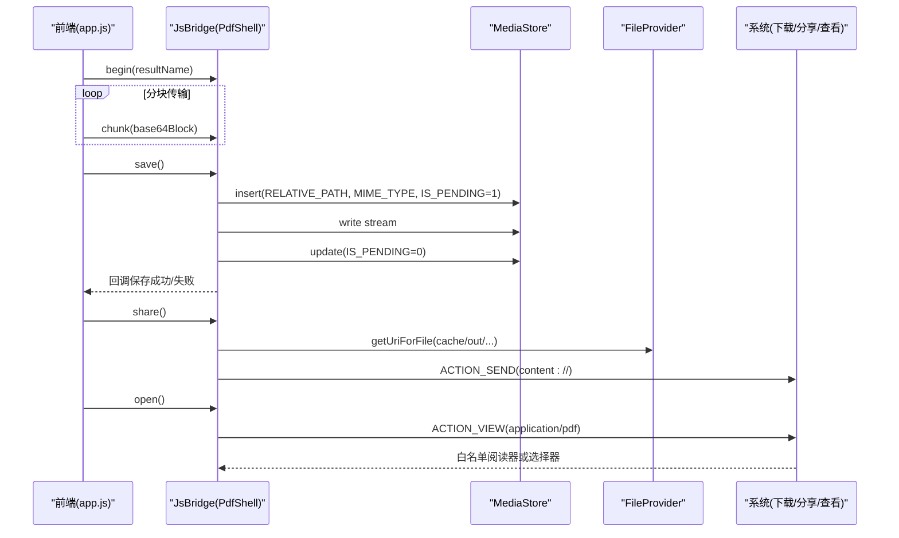
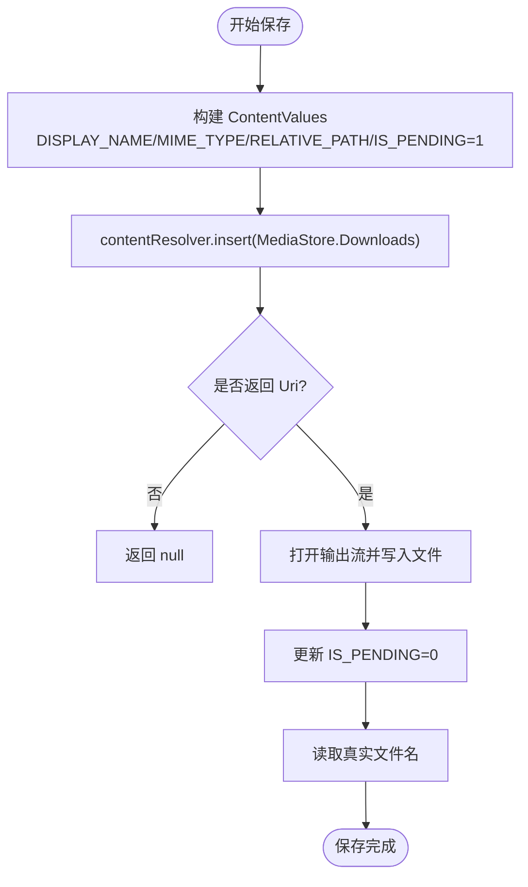
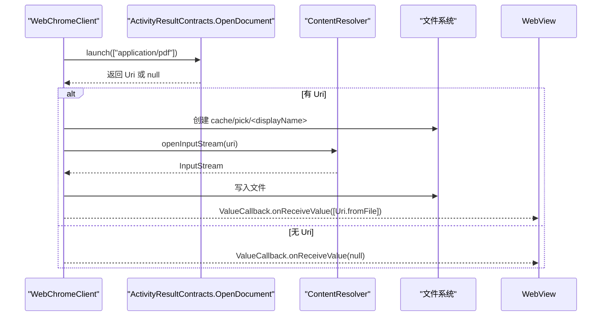
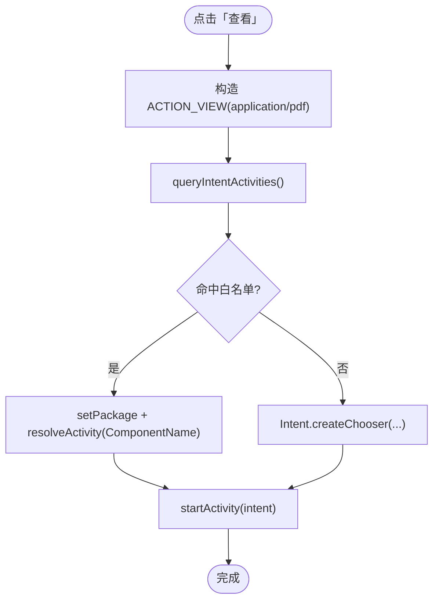
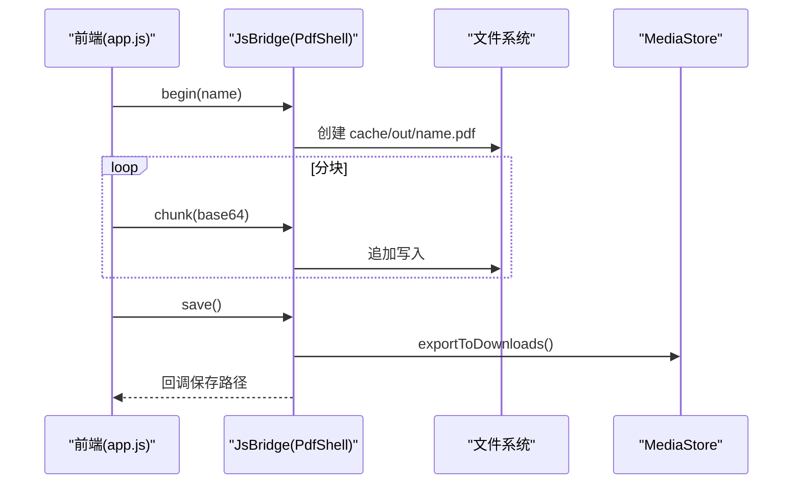
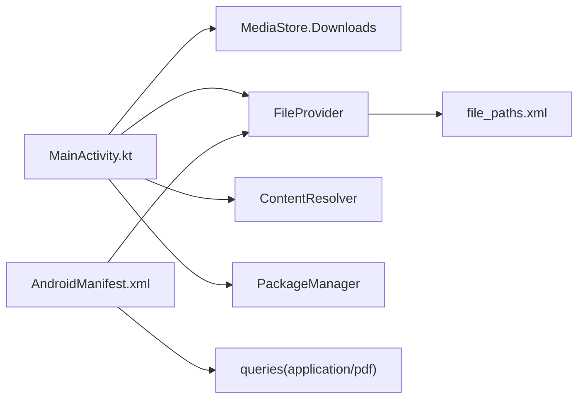

# 系统集成

<cite>
**本文引用的文件**   
- [MainActivity.kt](file://android/app/src/main/java/com/pdfsplitter/app/MainActivity.kt)
- [AndroidManifest.xml](file://android/app/src/main/AndroidManifest.xml)
- [file_paths.xml](file://android/app/src/main/res/xml/file_paths.xml)
- [app.js](file://pdf-splitter/app.js)
</cite>

## 目录
1. [引言](#引言)
2. [项目结构](#项目结构)
3. [核心组件](#核心组件)
4. [架构总览](#架构总览)
5. [详细组件分析](#详细组件分析)
6. [依赖关系分析](#依赖关系分析)
7. [性能与兼容性](#性能与兼容性)
8. [故障排查指南](#故障排查指南)
9. [结论](#结论)

## 引言
本文件面向“试卷切分助手”的 Android 集成层，系统性说明以下能力：
- 使用 MediaStore API 将处理后的 PDF 写入系统「下载」目录，并管理显示路径。
- 通过 FileProvider 生成安全 URI，实现跨应用分享。
- 集成系统文件选择器，保留原始文件名、过滤 PDF 类型。
- 阅读器定向机制：优先打开白名单中的 PDF 阅读器，否则回退到系统选择器。
- Android 版本兼容策略：包可见性、权限模型变化与向后兼容。
- 最佳实践：性能优化、错误处理与用户体验提升建议。

## 项目结构
本项目采用 WebView 承载前端业务逻辑（pdf.js + pdf-lib），原生侧仅承担三件事：选文件、把结果写进「下载」、唤起系统分享。关键文件如下：
- MainActivity.kt：WebView 外壳、文件选择、MediaStore 保存、FileProvider 分享、阅读器定向。
- AndroidManifest.xml：声明 FileProvider、queries 包可见性、Activity 入口。
- file_paths.xml：FileProvider 暴露的缓存目录映射。
- app.js：前端触发下载/分享，按块通过 JsBridge 调用原生 Shell。



图表来源
- [MainActivity.kt:56-291](file://android/app/src/main/java/com/pdfsplitter/app/MainActivity.kt#L56-L291)
- [AndroidManifest.xml:33-41](file://android/app/src/main/AndroidManifest.xml#L33-L41)
- [file_paths.xml:1-5](file://android/app/src/main/res/xml/file_paths.xml#L1-L5)
- [app.js:510-539](file://pdf-splitter/app.js#L510-L539)

章节来源
- [MainActivity.kt:31-54](file://android/app/src/main/java/com/pdfsplitter/app/MainActivity.kt#L31-L54)
- [AndroidManifest.xml:1-45](file://android/app/src/main/AndroidManifest.xml#L1-L45)
- [file_paths.xml:1-5](file://android/app/src/main/res/xml/file_paths.xml#L1-L5)
- [app.js:510-539](file://pdf-splitter/app.js#L510-L539)

## 核心组件
- WebView 外壳与桥接：提供 window.PdfShell，供前端分块传输二进制数据，避免单次桥调用过大。
- 文件选择器：重写 onShowFileChooser，使用 OpenDocument 契约，过滤 application/pdf，复制文件到本地缓存并返回 Uri。
- 媒体存储写入：通过 MediaStore.Downloads 写入「下载/试卷切分」子目录，标记 IS_PENDING，完成后更新为已完成。
- 安全分享：通过 FileProvider.getUriForFile 生成 content:// URI，配合 ACTION_SEND 分享。
- 阅读器定向：查询已安装支持 application/pdf 的应用，优先命中白名单包名，否则使用 Intent.createChooser。

章节来源
- [MainActivity.kt:114-145](file://android/app/src/main/java/com/pdfsplitter/app/MainActivity.kt#L114-L145)
- [MainActivity.kt:166-262](file://android/app/src/main/java/com/pdfsplitter/app/MainActivity.kt#L166-L262)
- [MainActivity.kt:264-291](file://android/app/src/main/java/com/pdfsplitter/app/MainActivity.kt#L264-L291)

## 架构总览
整体交互流程：前端在 WebView 中完成 PDF 切分后，通过 JsBridge 调用原生 Shell；原生侧负责落盘、分享与查看。



图表来源
- [app.js:510-539](file://pdf-splitter/app.js#L510-L539)
- [MainActivity.kt:166-291](file://android/app/src/main/java/com/pdfsplitter/app/MainActivity.kt#L166-L291)

## 详细组件分析

### MediaStore API 集成与下载目录管理
- 目标目录：Environment.DIRECTORY_DOWNLOADS + "/试卷切分"。
- 写入流程：
  - 构建 ContentValues，设置 DISPLAY_NAME、MIME_TYPE、RELATIVE_PATH、IS_PENDING=1。
  - 插入记录获取 Uri，打开输出流写入文件内容。
  - 更新 IS_PENDING=0 表示完成。
  - 读取真实文件名以应对重名自动后缀。
- 优点：符合 Android 10+ 分区存储规范，文件出现在系统「下载」应用中。



图表来源
- [MainActivity.kt:264-280](file://android/app/src/main/java/com/pdfsplitter/app/MainActivity.kt#L264-L280)

章节来源
- [MainActivity.kt:42-48](file://android/app/src/main/java/com/pdfsplitter/app/MainActivity.kt#L42-L48)
- [MainActivity.kt:264-280](file://android/app/src/main/java/com/pdfsplitter/app/MainActivity.kt#L264-L280)

### FileProvider 安全分享机制
- Manifest 配置：声明 androidx.core.content.FileProvider，authorities 使用 ${applicationId}.fileprovider，grantUriPermissions=true。
- 路径映射：file_paths.xml 暴露 cache/out 目录，用于临时生成的 PDF 文件分享。
- 生成 URI：FileProvider.getUriForFile(context, authorities, file)。
- 分享 Intent：ACTION_SEND，type=application/pdf，EXTRA_STREAM=content://URI，FLAG_GRANT_READ_URI_PERMISSION。

```mermaid
classDiagram
class MainActivity {
+shareFile(file)
}
class FileProvider {
+getUriForFile(context, authority, file)
}
class AndroidManifest {
+provider(authority="${applicationId}.fileprovider")
}
class FilePaths {
+cache-path name="out" path="out/"
}
MainActivity --> FileProvider : "生成 content : // URI"
AndroidManifest --> FileProvider : "注册 Provider"
FilePaths --> FileProvider : "暴露缓存目录"
```

图表来源
- [AndroidManifest.xml:33-41](file://android/app/src/main/AndroidManifest.xml#L33-L41)
- [file_paths.xml:1-5](file://android/app/src/main/res/xml/file_paths.xml#L1-L5)
- [MainActivity.kt:282-291](file://android/app/src/main/java/com/pdfsplitter/app/MainActivity.kt#L282-L291)

章节来源
- [AndroidManifest.xml:33-41](file://android/app/src/main/AndroidManifest.xml#L33-L41)
- [file_paths.xml:1-5](file://android/app/src/main/res/xml/file_paths.xml#L1-L5)
- [MainActivity.kt:282-291](file://android/app/src/main/java/com/pdfsplitter/app/MainActivity.kt#L282-L291)

### 系统文件选择器集成与原始文件名保留
- 重写 WebChromeClient.onShowFileChooser：
  - 使用 ActivityResultContracts.OpenDocument() 启动系统文件选择器。
  - 过滤类型：application/pdf。
  - 将选择的文件复制到本地缓存 pick 目录，返回 Uri 给 WebView。
- 原始文件名保留：
  - 通过 OpenableColumns.DISPLAY_NAME 查询用户可见文件名。
  - 若无法查询则回退到 Uri.lastPathSegment 或默认名称。
  - sanitize 清理非法字符并限制长度，确保扩展名为 .pdf。



图表来源
- [MainActivity.kt:114-124](file://android/app/src/main/java/com/pdfsplitter/app/MainActivity.kt#L114-L124)
- [MainActivity.kt:56-83](file://android/app/src/main/java/com/pdfsplitter/app/MainActivity.kt#L56-L83)

章节来源
- [MainActivity.kt:56-83](file://android/app/src/main/java/com/pdfsplitter/app/MainActivity.kt#L56-L83)
- [MainActivity.kt:114-124](file://android/app/src/main/java/com/pdfsplitter/app/MainActivity.kt#L114-L124)

### 阅读器定向机制与白名单配置
- 白名单：预置 WPS、多看、UC、Xodo、Adobe Reader 等包名。
- 定向流程：
  - 构造 ACTION_VIEW + application/pdf。
  - packageManager.queryIntentActivities 获取可打开的应用集合。
  - 优先匹配白名单包名，resolveActivity 精确指定 ComponentName。
  - 若无匹配，使用 Intent.createChooser 弹出系统选择器。
- 包可见性：AndroidManifest 中声明 <queries> 允许查询 VIEW action + application/pdf 的应用。



图表来源
- [MainActivity.kt:222-256](file://android/app/src/main/java/com/pdfsplitter/app/MainActivity.kt#L222-L256)
- [AndroidManifest.xml:7-12](file://android/app/src/main/AndroidManifest.xml#L7-L12)

章节来源
- [MainActivity.kt:44-48](file://android/app/src/main/java/com/pdfsplitter/app/MainActivity.kt#L44-L48)
- [MainActivity.kt:222-256](file://android/app/src/main/java/com/pdfsplitter/app/MainActivity.kt#L222-L256)
- [AndroidManifest.xml:7-12](file://android/app/src/main/AndroidManifest.xml#L7-L12)

### 前端与原生协作（JsBridge）
- 前端 app.js：
  - 检测 shellUsable()，若可用则通过 window.PdfShell.begin/chunk/save 调用原生。
  - 分块大小约 768KB，base64 编码传输，避免单次桥调用过大。
- 原生 MainActivity.kt：
  - Shell.begin：准备缓存目录 out 和文件名。
  - Shell.chunk：追加写入 base64 解码后的字节。
  - Shell.save：导出到 MediaStore 下载目录，回调前端展示路径。
  - Shell.share：直接分享缓存文件，不写下载目录。
  - Shell.open：定向打开已保存的 PDF。



图表来源
- [app.js:510-539](file://pdf-splitter/app.js#L510-L539)
- [MainActivity.kt:166-209](file://android/app/src/main/java/com/pdfsplitter/app/MainActivity.kt#L166-L209)

章节来源
- [app.js:510-539](file://pdf-splitter/app.js#L510-L539)
- [MainActivity.kt:166-209](file://android/app/src/main/java/com/pdfsplitter/app/MainActivity.kt#L166-L209)

## 依赖关系分析
- MainActivity 依赖：
  - MediaStore.Downloads：写入系统下载目录。
  - FileProvider：生成安全的 content:// URI。
  - ContentResolver：读写文件流、查询 OpenableColumns。
  - PackageManager：查询可打开 PDF 的应用。
- Manifest 依赖：
  - FileProvider 注册与 meta-data 指向 file_paths.xml。
  - <queries> 声明包可见性，解决 Android 11+ 查询限制。



图表来源
- [MainActivity.kt:264-291](file://android/app/src/main/java/com/pdfsplitter/app/MainActivity.kt#L264-L291)
- [AndroidManifest.xml:7-12](file://android/app/src/main/AndroidManifest.xml#L7-L12)
- [AndroidManifest.xml:33-41](file://android/app/src/main/AndroidManifest.xml#L33-L41)
- [file_paths.xml:1-5](file://android/app/src/main/res/xml/file_paths.xml#L1-L5)

章节来源
- [MainActivity.kt:264-291](file://android/app/src/main/java/com/pdfsplitter/app/MainActivity.kt#L264-L291)
- [AndroidManifest.xml:7-12](file://android/app/src/main/AndroidManifest.xml#L7-L12)
- [AndroidManifest.xml:33-41](file://android/app/src/main/AndroidManifest.xml#L33-L41)
- [file_paths.xml:1-5](file://android/app/src/main/res/xml/file_paths.xml#L1-L5)

## 性能与兼容性

### 性能优化
- 分块传输：前端按 768KB 分块并通过 base64 传输，避免单次桥调用内存峰值过高。
- 流式写入：MediaStore 输出流与源文件输入流使用 use 自动关闭，减少资源泄漏风险。
- 缓存清理：每次 begin/save/share 前清理对应缓存目录，避免残留大文件占用空间。
- 只读访问：文件选择后复制至本地缓存，避免跨进程流不稳定导致的重复 IO。

章节来源
- [app.js:510-539](file://pdf-splitter/app.js#L510-L539)
- [MainActivity.kt:166-209](file://android/app/src/main/java/com/pdfsplitter/app/MainActivity.kt#L166-L209)
- [MainActivity.kt:264-280](file://android/app/src/main/java/com/pdfsplitter/app/MainActivity.kt#L264-L280)

### Android 版本兼容
- Android 10+ 分区存储：通过 MediaStore.Downloads.RELATIVE_PATH 写入「下载」目录，无需额外存储权限。
- Android 11+ 包可见性：使用 <queries> 声明对 application/pdf 的 VIEW 动作查询，确保 queryIntentActivities 能命中第三方阅读器。
- FileProvider：通过 authorities 与 file_paths.xml 暴露受限目录，避免直接 file:// 分享导致的安全问题。
- WebView 安全：仅加载 assets 本地资源，allowFileAccess/allowContentAccess 控制严格，降低远程页面风险。

章节来源
- [AndroidManifest.xml:7-12](file://android/app/src/main/AndroidManifest.xml#L7-L12)
- [AndroidManifest.xml:33-41](file://android/app/src/main/AndroidManifest.xml#L33-L41)
- [MainActivity.kt:94-111](file://android/app/src/main/java/com/pdfsplitter/app/MainActivity.kt#L94-L111)

### 用户体验提升
- 明确提示：保存失败、分享失败、无阅读器时给出 Toast 提示。
- 真实文件名：保存后回读 MediaStore 的真实文件名，避免重名后缀影响展示。
- 白名单优先：优先打开常用阅读器，减少用户选择成本。
- 可选分享：提供“分享”按钮，不写下载目录，避免误报“已保存”。

章节来源
- [MainActivity.kt:186-209](file://android/app/src/main/java/com/pdfsplitter/app/MainActivity.kt#L186-L209)
- [MainActivity.kt:211-220](file://android/app/src/main/java/com/pdfsplitter/app/MainActivity.kt#L211-L220)
- [MainActivity.kt:222-256](file://android/app/src/main/java/com/pdfsplitter/app/MainActivity.kt#L222-L256)
- [MainActivity.kt:277-279](file://android/app/src/main/java/com/pdfsplitter/app/MainActivity.kt#L277-L279)

## 故障排查指南
- 无法看到已安装的 PDF 阅读器：
  - 检查 AndroidManifest 中 <queries> 是否正确声明 action=VIEW 且 mimeType=application/pdf。
- 分享失败或未找到接收应用：
  - 确认 FileProvider 已在 Manifest 注册，authorities 与 file_paths.xml 一致。
  - 确认分享的文件位于 cache/out 目录且存在非空内容。
- 保存失败：
  - 检查 MediaStore 插入是否返回有效 Uri，输出流写入是否成功，IS_PENDING 是否更新为 0。
- 文件名异常：
  - 检查 displayNameOf 是否能正确查询 OpenableColumns.DISPLAY_NAME，sanitize 是否清理非法字符并保证 .pdf 后缀。
- 浏览器端无法触发下载：
  - 确认前端 shellUsable() 判断与 JsBridge 方法调用顺序正确，分块传输完整。

章节来源
- [AndroidManifest.xml:7-12](file://android/app/src/main/AndroidManifest.xml#L7-L12)
- [AndroidManifest.xml:33-41](file://android/app/src/main/AndroidManifest.xml#L33-L41)
- [MainActivity.kt:56-83](file://android/app/src/main/java/com/pdfsplitter/app/MainActivity.kt#L56-L83)
- [MainActivity.kt:186-209](file://android/app/src/main/java/com/pdfsplitter/app/MainActivity.kt#L186-L209)
- [MainActivity.kt:264-291](file://android/app/src/main/java/com/pdfsplitter/app/MainActivity.kt#L264-L291)
- [app.js:510-539](file://pdf-splitter/app.js#L510-L539)

## 结论
该集成方案以 WebView 为核心，结合 MediaStore、FileProvider 与系统文件选择器，实现了安全的文件处理、规范的下载目录写入与稳定的跨应用分享。通过白名单定向与包可见性声明，提升了用户体验与兼容性。建议在后续迭代中继续优化分块大小、增强错误提示，并根据设备特性动态调整阅读器优先级。