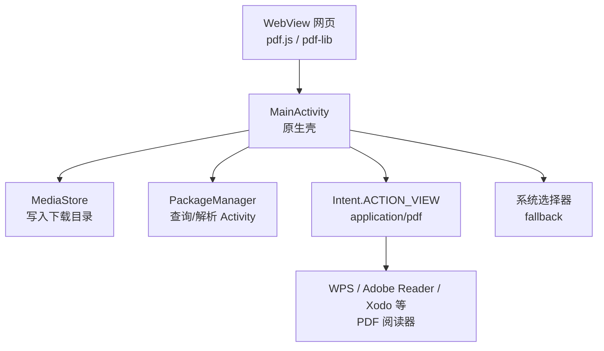
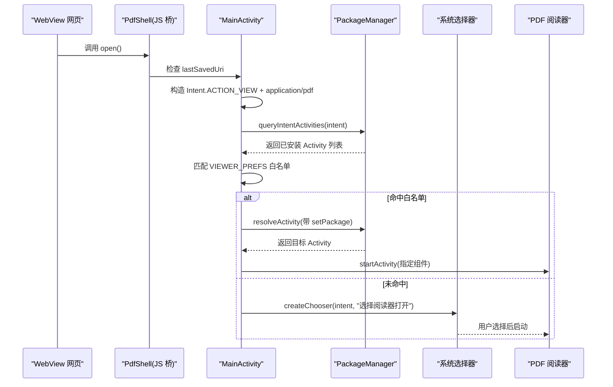
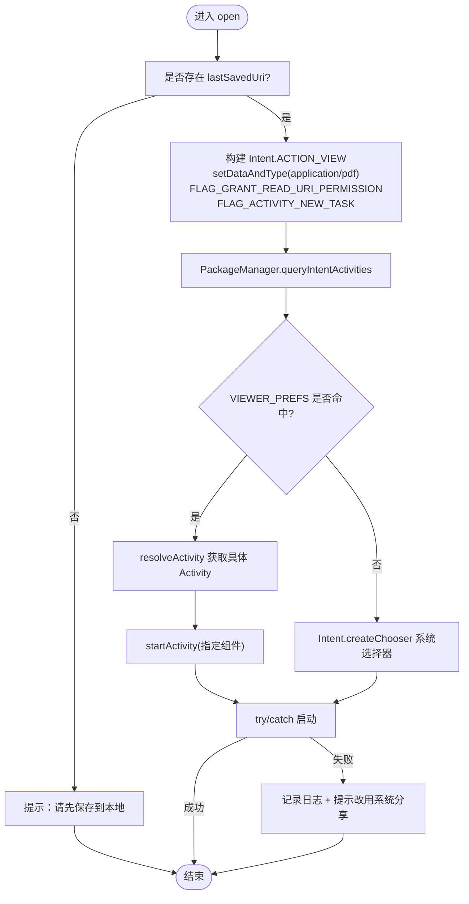
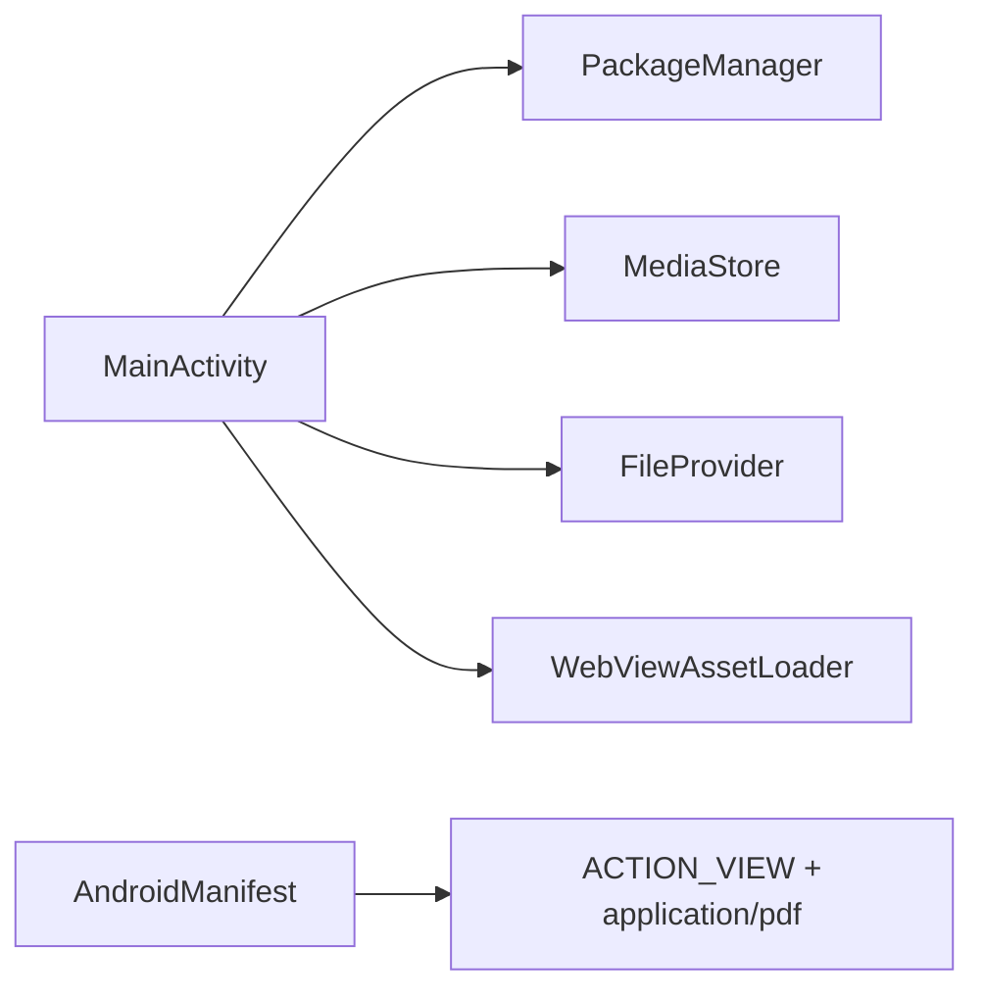

# 阅读器集成

<cite>
**本文引用的文件**   
- [MainActivity.kt](file://android/app/src/main/java/com/pdfsplitter/app/MainActivity.kt)
- [AndroidManifest.xml](file://android/app/src/main/AndroidManifest.xml)
- [README.md](file://README.md)
</cite>

## 目录
1. [引言](#引言)
2. [项目结构](#项目结构)
3. [核心组件](#核心组件)
4. [架构总览](#架构总览)
5. [详细组件分析](#详细组件分析)
6. [依赖关系分析](#依赖关系分析)
7. [性能与兼容性考量](#性能与兼容性考量)
8. [故障排查指南](#故障排查指南)
9. [结论](#结论)

## 引言
本文面向“阅读器集成”的技术实现，聚焦 Android 壳工程中的 PDF 打开流程、优先级白名单、系统选择器回退以及与主流阅读器的兼容策略。文档从代码级出发，解释 open 方法的 Intent.ACTION_VIEW 使用方式、PDF 类型识别、Activity 查询机制，并给出可操作的优化与测试建议。

## 项目结构
本项目采用“WebView + 原生壳”的混合架构：
- Web 层：pdf-splitter 下的前端逻辑（pdf.js + pdf-lib）负责切分与预览。
- 原生壳：MainActivity 提供文件选择、结果落盘、查看与分享等能力。
- 清单配置：AndroidManifest 声明包可见性 queries，使 ACTION_VIEW + application/pdf 能正确查询到已安装的阅读器。

图表来源
- [MainActivity.kt:85-152](file://android/app/src/main/java/com/pdfsplitter/app/MainActivity.kt#L85-L152)
- [MainActivity.kt:222-256](file://android/app/src/main/java/com/pdfsplitter/app/MainActivity.kt#L222-L256)
- [AndroidManifest.xml:1-12](file://android/app/src/main/AndroidManifest.xml#L1-L12)

章节来源
- [README.md:13-20](file://README.md#L13-L20)
- [README.md:67-75](file://README.md#L67-L75)

## 核心组件
- MainActivity：承载 WebView，处理文件选择、结果保存、查看与分享，并提供 PdfShell JS 桥。
- VIEWER_PREFS：按优先级排列的 PDF 阅读器包名白名单。
- Shell.open：实现“优先定向到真实阅读器，否则回退系统选择器”的核心逻辑。
- AndroidManifest queries：声明对 ACTION_VIEW + application/pdf 的查询权限，适配 Android 11+ 包可见性限制。

章节来源
- [MainActivity.kt:39-49](file://android/app/src/main/java/com/pdfsplitter/app/MainActivity.kt#L39-L49)
- [MainActivity.kt:222-256](file://android/app/src/main/java/com/pdfsplitter/app/MainActivity.kt#L222-L256)
- [AndroidManifest.xml:1-12](file://android/app/src/main/AndroidManifest.xml#L1-L12)

## 架构总览
下图展示“查看文件”端到端流程：Web 调用 JsBridge → 原生校验状态 → 构造 ACTION_VIEW → 查询已安装 Activity → 命中白名单则直连具体组件，否则走系统选择器。

图表来源
- [MainActivity.kt:222-256](file://android/app/src/main/java/com/pdfsplitter/app/MainActivity.kt#L222-L256)
- [AndroidManifest.xml:1-12](file://android/app/src/main/AndroidManifest.xml#L1-L12)

## 详细组件分析

### open 方法实现逻辑
open 是“查看刚保存的 PDF”的关键入口，其核心步骤如下：
- 前置校验：若尚未保存结果，提示用户先执行保存操作。
- 构造 Intent：ACTION_VIEW + setDataAndType("application/pdf")，并设置读权限与新任务标志。
- 查询已安装 Activity：通过 PackageManager.queryIntentActivities 获取支持该 Intent 的应用集合。
- 白名单匹配：在 VIEWER_PREFS 中查找第一个出现在已安装集合中的包名。
- 精确分发：若命中，setPackage 并 resolveActivity 得到具体 Activity 名称，再直接启动。
- 回退策略：未命中时，使用 Intent.createChooser 弹出系统选择器。
- 异常处理：捕获启动失败日志并提示改用系统分享。

图表来源
- [MainActivity.kt:222-256](file://android/app/src/main/java/com/pdfsplitter/app/MainActivity.kt#L222-L256)

章节来源
- [MainActivity.kt:222-256](file://android/app/src/main/java/com/pdfsplitter/app/MainActivity.kt#L222-L256)

### Intent.ACTION_VIEW 与 PDF 类型识别
- Intent 动作：使用 ACTION_VIEW 表示“查看某数据”。
- 数据类型：setDataAndType(uri, "application/pdf") 明确声明为 PDF 类型。
- 权限与任务：添加 FLAG_GRANT_READ_URI_PERMISSION 允许目标应用读取 URI；FLAG_ACTIVITY_NEW_TASK 保证跨进程启动。
- 类型识别：由 MIME 类型 application/pdf 驱动系统筛选支持 PDF 查看的应用。

章节来源
- [MainActivity.kt:233-237](file://android/app/src/main/java/com/pdfsplitter/app/MainActivity.kt#L233-L237)

### Activity 查询机制
- 查询接口：packageManager.queryIntentActivities(intent, 0) 返回所有能处理该 Intent 的 Activity 信息。
- 包名提取：将返回结果映射为 activityInfo.packageName 集合，用于后续白名单匹配。
- 包可见性：Android 11+ 需要清单声明 <queries> 才能查到第三方应用；本应用在清单中声明了 ACTION_VIEW + application/pdf。

章节来源
- [MainActivity.kt:238-239](file://android/app/src/main/java/com/pdfsplitter/app/MainActivity.kt#L238-L239)
- [AndroidManifest.xml:1-12](file://android/app/src/main/AndroidManifest.xml#L1-L12)

### 阅读器优先级配置（VIEWER_PREFS）
- 白名单定义：按优先级列出常见 PDF 阅读器的包名，如 WPS 系列、小米多看、夸克、Xodo、Adobe Reader 等。
- 匹配算法：遍历白名单，取第一个出现在已安装集合中的包名作为首选。
- 设计意图：避免邮箱、网盘、AI 助手等“附件上传型”应用被误选，确保“查看”行为由真正渲染 PDF 的阅读器完成。

章节来源
- [MainActivity.kt:44-48](file://android/app/src/main/java/com/pdfsplitter/app/MainActivity.kt#L44-L48)

### 组件解析过程
- setPackage：将 Intent 限定到选定包名下，缩小匹配范围。
- resolveActivity：再次确认该包下存在可处理该 Intent 的具体 Activity，并设置 ComponentName 以精确启动。
- 优势：减少系统选择弹窗，提升直达体验；同时避免某些包名虽存在但无对应 Activity 的情况。

章节来源
- [MainActivity.kt:241-246](file://android/app/src/main/java/com/pdfsplitter/app/MainActivity.kt#L241-L246)

### fallback 机制（系统选择器回退）
- 触发条件：未命中任何白名单包名。
- 行为：使用 Intent.createChooser 弹出系统选择器，让用户手动选择阅读器。
- 用户体验：当没有合适阅读器时，提示“没有能打开 PDF 的应用，可改用系统分享”，引导用户使用分享功能。

章节来源
- [MainActivity.kt:247-254](file://android/app/src/main/java/com/pdfsplitter/app/MainActivity.kt#L247-L254)

### 错误处理策略
- 启动异常：捕获 startActivity 抛出的异常，记录日志并给出友好提示。
- 资源缺失：若 lastSavedUri 为空，提示用户先保存结果。
- 分享兜底：当无法直接打开时，建议使用系统分享，间接唤起更多接收方。

章节来源
- [MainActivity.kt:228-231](file://android/app/src/main/java/com/pdfsplitter/app/MainActivity.kt#L228-L231)
- [MainActivity.kt:250-254](file://android/app/src/main/java/com/pdfsplitter/app/MainActivity.kt#L250-L254)

### 与不同 PDF 阅读器的兼容性处理
- 白名单覆盖：包含 WPS 多版本、小米多看、夸克、Xodo、Adobe Reader 等主流应用包名。
- 行为差异规避：不依赖系统默认选择器，避免邮箱/网盘/AI 助手等“仅上传附件”的应用被选中。
- 兼容性建议：
  - 保持白名单随主流阅读器更新而演进。
  - 对特定厂商定制 ROM 进行实测，必要时补充包名或调整顺序。
  - 对不支持 ACTION_VIEW 的阅读器，依赖系统选择器回退。

章节来源
- [MainActivity.kt:44-48](file://android/app/src/main/java/com/pdfsplitter/app/MainActivity.kt#L44-L48)
- [README.md:67-75](file://README.md#L67-L75)

## 依赖关系分析
- MainActivity 依赖：
  - PackageManager：查询与解析可处理 PDF 的 Activity。
  - MediaStore：将切分结果写入“下载/试卷切分”。
  - FileProvider：用于分享场景的文件 URI 生成。
  - WebViewAssetLoader：加载本地 Web 资源。
- 清单依赖：
  - <queries> 声明 ACTION_VIEW + application/pdf，解决 Android 11+ 包可见性问题。

图表来源
- [MainActivity.kt:85-152](file://android/app/src/main/java/com/pdfsplitter/app/MainActivity.kt#L85-L152)
- [MainActivity.kt:264-292](file://android/app/src/main/java/com/pdfsplitter/app/MainActivity.kt#L264-L292)
- [AndroidManifest.xml:1-12](file://android/app/src/main/AndroidManifest.xml#L1-L12)

章节来源
- [MainActivity.kt:85-152](file://android/app/src/main/java/com/pdfsplitter/app/MainActivity.kt#L85-L152)
- [MainActivity.kt:264-292](file://android/app/src/main/java/com/pdfsplitter/app/MainActivity.kt#L264-L292)
- [AndroidManifest.xml:1-12](file://android/app/src/main/AndroidManifest.xml#L1-L12)

## 性能与兼容性考量
- 性能优化
  - 白名单直连：命中白名单后直接启动具体 Activity，减少系统选择开销。
  - 精确组件解析：resolveActivity 后再启动，避免无效跳转。
  - 大文件传输：JsBridge 分块 base64 传输，避免单次桥调用内存峰值过高。
- 用户体验提升
  - 保留原始文件名：便于用户识别输出文件。
  - 友好的错误提示：未保存、无可用阅读器时给出明确指引。
  - 分享兜底：无法打开时引导使用系统分享。
- 兼容性测试建议
  - 设备与系统版本：覆盖 Android 10+ 多版本，重点验证包可见性与 MediaStore 行为。
  - 阅读器矩阵：WPS、Adobe Reader、Xodo、小米多看、夸克等主流应用均需验证。
  - 边界场景：无 PDF 阅读器、URI 失效、重名文件、加密 PDF 等。

章节来源
- [MainActivity.kt:162-184](file://android/app/src/main/java/com/pdfsplitter/app/MainActivity.kt#L162-L184)
- [MainActivity.kt:222-256](file://android/app/src/main/java/com/pdfsplitter/app/MainActivity.kt#L222-L256)
- [README.md:83-91](file://README.md#L83-L91)

## 故障排查指南
- 现象：点击“查看文件”无响应或提示“没有能打开 PDF 的应用”
  - 可能原因：
    - 未安装任何 PDF 阅读器或未命中白名单。
    - Android 11+ 未声明 <queries>，导致 queryIntentActivities 返回空。
    - lastSavedUri 为空，未先执行保存。
  - 处理建议：
    - 确认已安装至少一个主流 PDF 阅读器。
    - 检查清单中是否声明 ACTION_VIEW + application/pdf 的 <queries>。
    - 先执行“保存到本地”，再尝试“查看文件”。
- 现象：打开的是邮箱/网盘而非阅读器
  - 可能原因：系统默认选择器被使用，或白名单未命中。
  - 处理建议：
    - 调整白名单顺序，确保期望的阅读器优先。
    - 在设备上卸载或禁用“附件上传型”应用的 PDF 关联。
- 现象：分享失败
  - 可能原因：FileProvider 配置问题或无接收应用。
  - 处理建议：
    - 检查 FileProvider 配置与应用签名一致性。
    - 使用系统分享对话框确认是否有可接收应用。

章节来源
- [MainActivity.kt:222-256](file://android/app/src/main/java/com/pdfsplitter/app/MainActivity.kt#L222-L256)
- [AndroidManifest.xml:1-12](file://android/app/src/main/AndroidManifest.xml#L1-L12)
- [MainActivity.kt:282-292](file://android/app/src/main/java/com/pdfsplitter/app/MainActivity.kt#L282-L292)

## 结论
本项目的阅读器集成以“白名单直连 + 系统选择器回退”为核心策略，结合 ACTION_VIEW + application/pdf 的类型识别与 <queries> 包可见性声明，实现对主流 PDF 阅读器的稳定兼容。通过精确组件解析与完善的错误提示，既提升了直达体验，又保证了在极端场景下的可用性。建议在持续迭代中维护白名单、完善兼容性测试，并结合实际设备与 ROM 特性进行针对性优化。