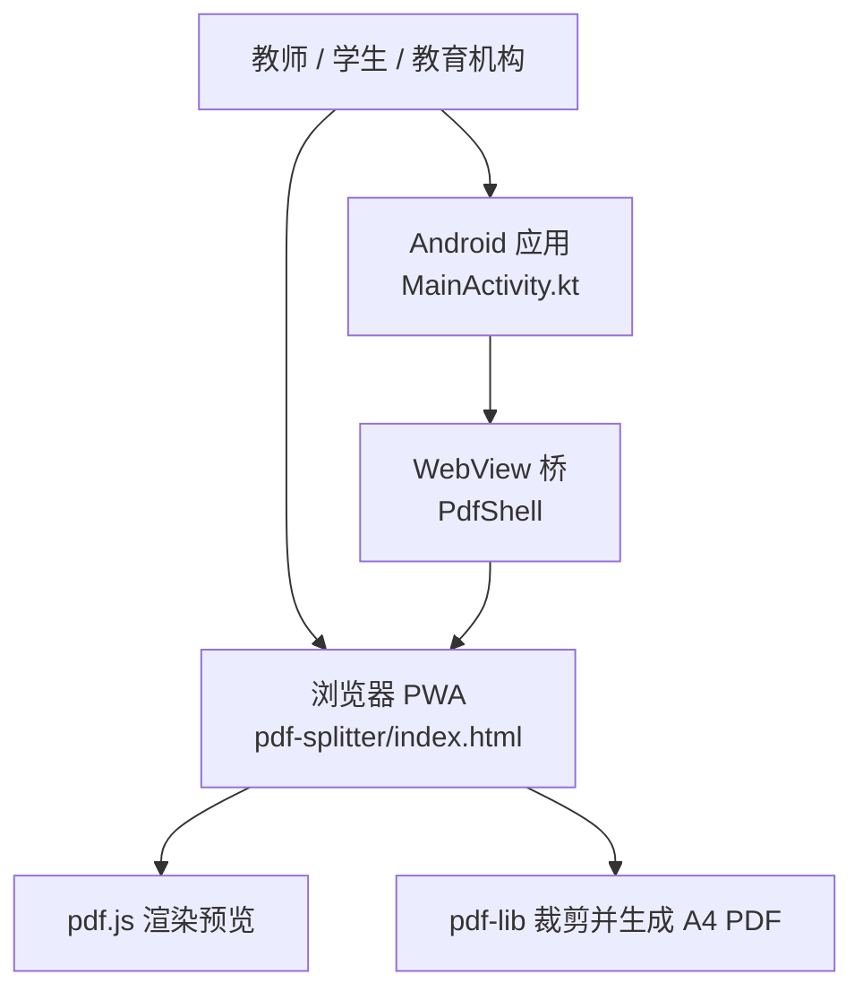
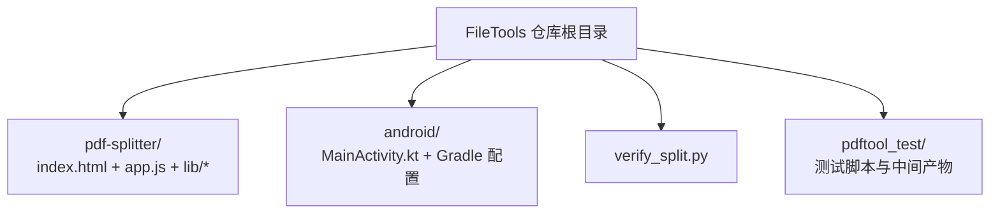
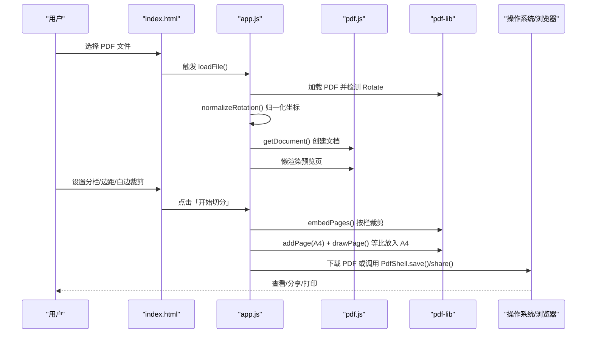
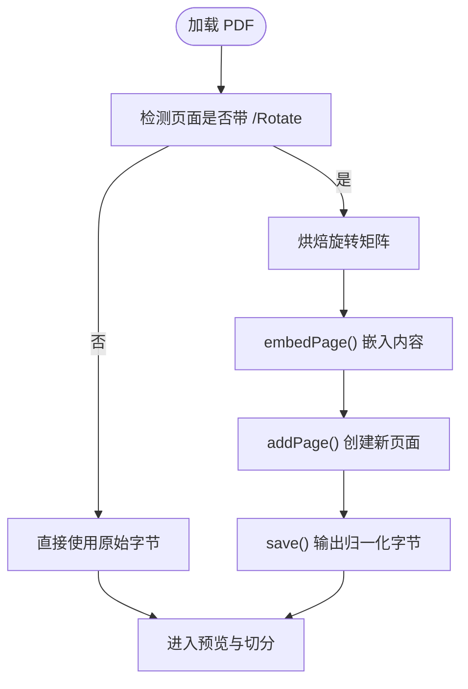
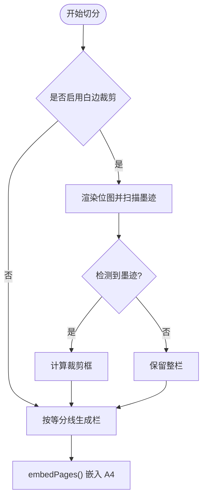
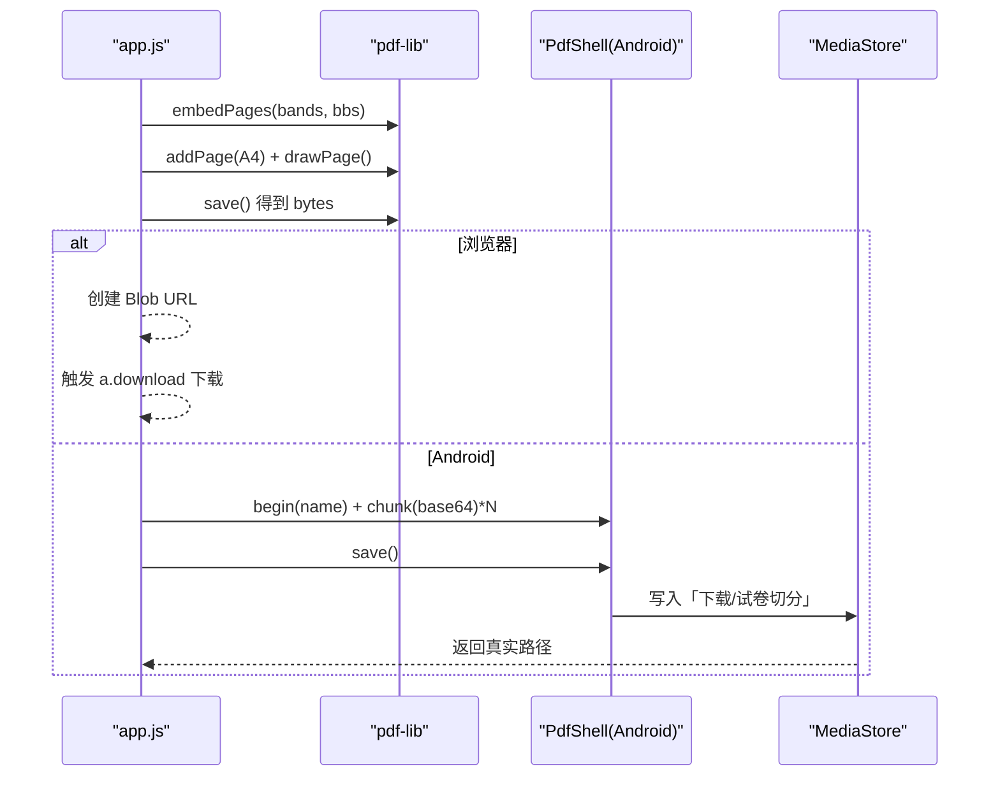
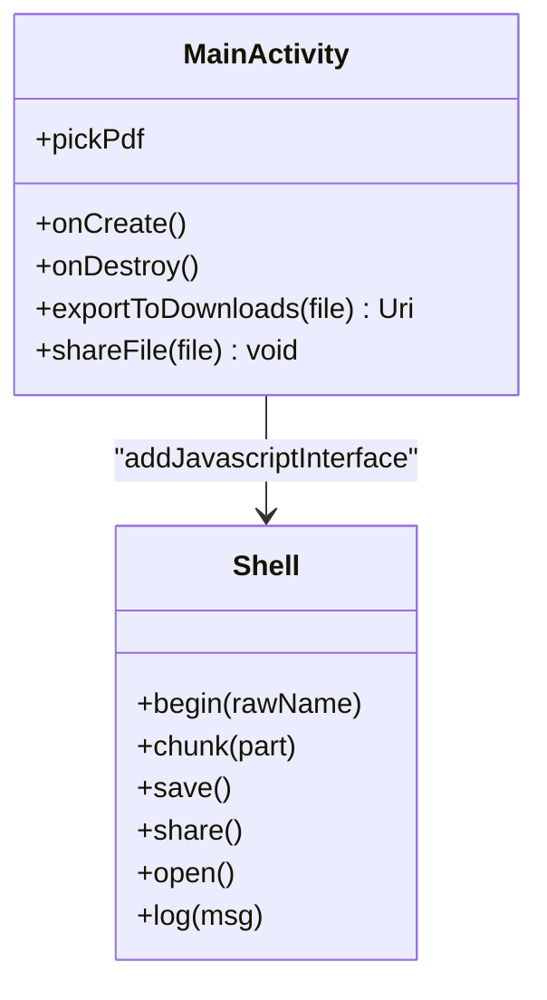

# 项目概述

<cite>
**本文引用的文件**   
- [README.md](file://README.md)
- [index.html](file://pdf-splitter/index.html)
- [app.js](file://pdf-splitter/app.js)
- [MainActivity.kt](file://android/app/src/main/java/com/pdfsplitter/app/MainActivity.kt)
- [verify_split.py](file://verify_split.py)
</cite>

## 目录
1. [简介](#简介)
2. [项目结构](#项目结构)
3. [核心价值与目标用户](#核心价值与目标用户)
4. [关键特性](#关键特性)
5. [技术架构与选型原因](#技术架构与选型原因)
6. [快速开始指南](#快速开始指南)
7. [核心处理流程](#核心处理流程)
8. [平台差异与集成点](#平台差异与集成点)
9. [性能与限制](#性能与限制)
10. [常见问题排查](#常见问题排查)
11. [总结](#总结)

## 简介
试卷切分助手是一个面向教师、学生和教育机构的本地化工具，用于把 A3/A4 拼版试卷（一页横排 2 栏或 3 栏）切分成「一页一题」的标准 A4 PDF。所有处理都在浏览器或 Android WebView 中完成，不上传任何数据，适合对隐私敏感的教学场景。

它同时提供两种使用形态：
- Web PWA：直接在浏览器中打开 `pdf-splitter/index.html`，支持离线安装到桌面或手机主屏幕。
- Android 应用：基于 Kotlin + WebView 的轻量壳工程，封装文件选择、保存和分享等原生能力。

**图表来源**
- [index.html:1-289](file://pdf-splitter/index.html#L1-L289)
- [app.js:1-578](file://pdf-splitter/app.js#L1-L578)
- [MainActivity.kt:1-311](file://android/app/src/main/java/com/pdfsplitter/app/MainActivity.kt#L1-L311)

**章节来源**
- [README.md:1-22](file://README.md#L1-L22)

## 项目结构
仓库采用“Web 本体 + Android 壳”的双形态组织方式：
- `pdf-splitter/`：完整的 Web PWA，包含页面、样式、脚本以及本地化的 pdf.js 与 pdf-lib，无 CDN 依赖。
- `android/`：Kotlin 壳工程，构建时自动同步 `pdf-splitter/` 到 assets，并提供文件选择、保存、分享等原生能力。
- `pdftool_test/`、`pdf_preview/`：本地验证脚本与输出，不在最终安装包中。
- `verify_split.py`：用 Python 复现切分逻辑，便于离线验证结果。

**图表来源**
- [README.md:13-21](file://README.md#L13-L21)

**章节来源**
- [README.md:13-21](file://README.md#L13-L21)

## 核心价值与目标用户
- 核心价值：把拼版试卷变成可直接打印的 A4 单页格式，减少手动裁剪、缩放和排版成本。
- 隐私安全：全部在本地处理，不联网、不上传；Android 包没有互联网权限，也没有存储/定位等可见权限。
- 跨平台体验：同一套网页逻辑运行在浏览器和 Android WebView 中，降低维护成本并保持行为一致。
- 目标用户：
  - 教师：批量准备课堂讲义、考试卷、练习册。
  - 学生：自行整理复习资料，按题拆分后打印复习。
  - 教育机构：统一分发标准化 A4 试卷，避免不同设备显示差异。

**章节来源**
- [README.md:1-5](file://README.md#L1-L5)

## 关键特性
- 自动识别分栏：根据页面长宽比判断 2 栏或 3 栏，也支持手动切换。
- 旋转校正：处理带 `/Rotate` 的扫描件，确保预览方向与输出方向一致。
- 白边裁剪：可选地按每栏实际有字范围裁剪，放大后更铺满 A4。
- 边距控制：左右边距 0–20 mm，上下边距 0–40 mm，可精细调整打印观感。
- 切分线微调：通过百分比偏移整体切分线，适配扫描偏差。
- 预览叠加：pdf.js 渲染后叠加虚线切分线，直观确认切割位置。
- 本地下载与系统分享：浏览器直接下载；Android 写入「下载/试卷切分」并支持微信、QQ、系统打印服务。

**章节来源**
- [README.md:24-35](file://README.md#L24-L35)
- [app.js:45-54](file://pdf-splitter/app.js#L45-L54)
- [app.js:57-103](file://pdf-splitter/app.js#L57-L103)
- [app.js:105-193](file://pdf-splitter/app.js#L105-L193)
- [app.js:331-361](file://pdf-splitter/app.js#L331-L361)

## 技术架构与选型原因
### 整体架构
- 前端逻辑集中在 `app.js`，负责文件读取、旋转归一化、预览、切分参数计算、结果生成与导出。
- 渲染预览使用 pdf.js，保证所见即所得，并支持 worker 模式。
- PDF 操作使用 pdf-lib，按栏裁剪后等比嵌入 A4 页面，生成标准纵向 A4 PDF。
- Android 壳只补 WebView 无法完成的必要能力：文件选择、MediaStore 写入、系统分享、阅读器定向。

**图表来源**
- [index.html:284-286](file://pdf-splitter/index.html#L284-L286)
- [app.js:204-239](file://pdf-splitter/app.js#L204-L239)
- [app.js:412-508](file://pdf-splitter/app.js#L412-L508)
- [MainActivity.kt:166-256](file://android/app/src/main/java/com/pdfsplitter/app/MainActivity.kt#L166-L256)

### 为什么选择 pdf-lib 与 pdf.js
- pdf-lib 更适合 PDF 结构级操作：按矩形区域裁剪、嵌入页面、写入新 A4 页面，且能保持矢量内容。
- pdf.js 更适合渲染预览：提供 viewport、canvas 渲染、worker 机制，便于叠加切分线和实时交互。
- 两者职责清晰：pdf.js 管“看”，pdf-lib 管“改”。

**章节来源**
- [README.md:22-23](file://README.md#L22-L23)
- [app.js:1-11](file://pdf-splitter/app.js#L1-L11)

## 快速开始指南
### 在浏览器中使用
1. 直接双击打开 `pdf-splitter/index.html`，即可离线使用。
2. 也可启动本地 HTTP 服务，例如 `cd pdf-splitter && python -m http.server 8000`，然后在 Chrome 访问 `http://localhost:8000`。
3. 在 Chrome 中可将页面安装为 PWA，作为桌面或手机主屏幕应用使用。
4. 浏览器版通过浏览器下载机制保存 PDF，不经过手机下载目录。

**章节来源**
- [README.md:37-43](file://README.md#L37-L43)

### 在 Android 上安装和使用
1. 将打包好的 APK 传到手机并安装，允许「安装未知应用」。
2. 打开 App，点击选择试卷 PDF。
3. 选择分栏方式：默认自动识别，也可手动选 2 栏或 3 栏。
4. 调整左右/上下边距、切分线微调，必要时勾选「裁掉页面四周白边」。
5. 点击「开始切分」，完成后点击「保存到本地」。
6. 结果写入「下载（Download）/ 试卷切分」，可点击「查看文件」或「分享」。
7. 打印时选择 A4 纸张，缩放选「适应页面」。

要求 Android 10 及以上。已在小米 10 / Android 13 实测通过完整流程。

**章节来源**
- [README.md:24-35](file://README.md#L24-L35)

## 核心处理流程
### 旋转归一化
- pdf.js 的 viewport 会应用 `/Rotate`，而 pdf-lib 的 `getSize()` / `embedPage()` 忽略它。
- 因此先烘焙旋转矩阵，把页面内容顺时针旋转到显示方向，并去掉 `/Rotate`。
- 若没有任何页面带旋转，则跳过重存，直接使用原字节，节省一次写入。

**图表来源**
- [app.js:57-103](file://pdf-splitter/app.js#L57-L103)

**章节来源**
- [README.md:77-79](file://README.md#L77-L79)
- [app.js:57-103](file://pdf-splitter/app.js#L57-L103)

### 白边裁剪与预览复用
- 白边裁剪会把每栏渲染成位图，扫描有墨迹的最小矩形作为裁剪框。
- 如果某栏检测不到墨迹，则退回整栏，不会裁空。
- 已预览过的页直接复用 canvas 位图，避免重复栅格化，显著降低大文件处理时间。

**图表来源**
- [app.js:105-193](file://pdf-splitter/app.js#L105-L193)
- [app.js:440-457](file://pdf-splitter/app.js#L440-L457)

**章节来源**
- [README.md:81-82](file://README.md#L81-L82)
- [app.js:105-193](file://pdf-splitter/app.js#L105-L193)

### 生成 A4 结果
- 按栏裁剪后，将每个栏等比放入 A4 页面，左右/上下边距由滑块决定。
- 输出文件名追加 `_A4切分.pdf`，并生成 Blob URL 供下载或分享。
- Android 环境下通过 `PdfShell` 桥分块传输 base64，再由原生写入 MediaStore。

**图表来源**
- [app.js:459-485](file://pdf-splitter/app.js#L459-L485)
- [app.js:512-552](file://pdf-splitter/app.js#L512-L552)
- [MainActivity.kt:166-256](file://android/app/src/main/java/com/pdfsplitter/app/MainActivity.kt#L166-L256)

**章节来源**
- [app.js:412-508](file://pdf-splitter/app.js#L412-L508)
- [MainActivity.kt:166-256](file://android/app/src/main/java/com/pdfsplitter/app/MainActivity.kt#L166-L256)

## 平台差异与集成点
### Web PWA
- 使用 `lib/pdf.min.js` 和 `lib/pdf-lib.min.js`，无 CDN 依赖。
- 支持 `file://` 直接打开，HTTPS 下正常加载 worker。
- 下载走浏览器下载机制，不经过系统下载目录。

**章节来源**
- [index.html:284-286](file://pdf-splitter/index.html#L284-L286)
- [app.js:6-9](file://pdf-splitter/app.js#L6-L9)
- [app.js:530-539](file://pdf-splitter/app.js#L530-L539)

### Android 壳
- 使用 `WebViewAssetLoader` 提供本地资源，避免 `file://` 下 pdf.js worker 加载失败。
- 通过 `onShowFileChooser` 接入系统文件选择器，保留原始文件名。
- `PdfShell` 桥负责分块传输、保存、分享、查看文件。
- 「查看文件」优先定向到真正阅读器，避免邮箱/网盘误当附件上传。

**图表来源**
- [MainActivity.kt:85-152](file://android/app/src/main/java/com/pdfsplitter/app/MainActivity.kt#L85-L152)
- [MainActivity.kt:166-262](file://android/app/src/main/java/com/pdfsplitter/app/MainActivity.kt#L166-L262)

**章节来源**
- [README.md:67-75](file://README.md#L67-L75)
- [MainActivity.kt:31-49](file://android/app/src/main/java/com/pdfsplitter/app/MainActivity.kt#L31-L49)
- [MainActivity.kt:103-152](file://android/app/src/main/java/com/pdfsplitter/app/MainActivity.kt#L103-L152)
- [MainActivity.kt:166-262](file://android/app/src/main/java/com/pdfsplitter/app/MainActivity.kt#L166-L262)

## 性能与限制
### 性能优化
- 预览懒加载：使用 IntersectionObserver 仅渲染可视区域，减少初始开销。
- 预览复用：已画完的页直接复用 canvas 位图，避免二次栅格化。
- 进度反馈：底部固定操作栏显示进度条和处理状态，提升交互体验。

**章节来源**
- [app.js:265-329](file://pdf-splitter/app.js#L265-L329)
- [app.js:401-410](file://pdf-splitter/app.js#L401-L410)

### 已知限制
- 自动识别只按页面长宽比判断：比例 ≥1.85 判 3 栏、≥1.2 判 2 栏；A3 横版三栏可能被判成 2 栏，需手动选择。
- 切分线只能整体等分 + 全局微调，不能逐栏设独立边界。
- 大文件一次性嵌入，内存峰值偏高且不能中途取消。
- 白边裁剪需要逐页栅格化，页数很多时会体现在「正在检测白边 N / M 页」上。
- 加密 PDF 不支持，需先去除密码。

**章节来源**
- [README.md:83-90](file://README.md#L83-L90)

## 常见问题排查
- 无法打开 PDF：可能是加密文件，请先去除密码；错误信息会通过 alert 提示。
- 预览卡顿：大文件或大量未预览页会导致渲染队列排队，等待处理结束后会自动补渲染可视区域。
- 白边裁剪较慢：属于预期行为，因为需要逐页栅格化；已预览页会复用位图，几乎不额外耗时。
- Android 分享失败：检查是否安装了可接收 PDF 的应用；若未命中白名单，会退回系统选择器。
- 查看文件失败：可能没有合适的阅读器，建议使用「分享」功能发送到微信、QQ 或系统打印服务。

**章节来源**
- [app.js:234-238](file://pdf-splitter/app.js#L234-L238)
- [app.js:497-507](file://pdf-splitter/app.js#L497-L507)
- [MainActivity.kt:222-256](file://android/app/src/main/java/com/pdfsplitter/app/MainActivity.kt#L222-L256)

## 总结
试卷切分助手以本地处理为核心，兼顾隐私安全与跨平台体验。通过 pdf.js 实现高质量预览，通过 pdf-lib 实现精确 PDF 操作，最终输出标准 A4 单页格式，满足教师、学生和教育工作者的日常需求。无论是浏览器 PWA 还是 Android 应用，都能提供一致的切分、预览、保存与分享体验。对于初学者，建议从浏览器版本入手；对于开发者，可参考 `verify_split.py` 与源码中的旋转归一化、白边裁剪、A4 嵌入逻辑进行扩展或验证。